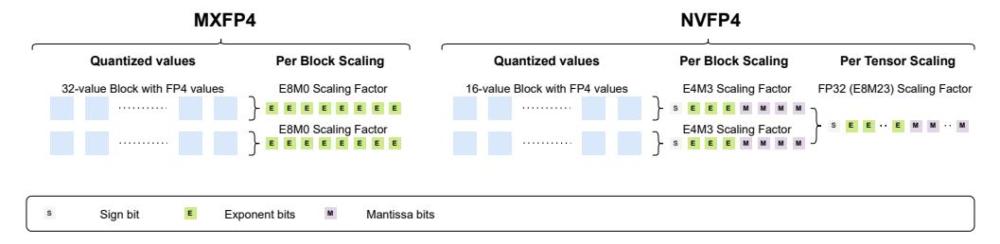

# 2 BACKGROUND ON MICROSCALING FLOATING-POINT FORMATS

General Definition. The microscaling MXFP4 and NVFP4 formats employ hierarchical quantization, where elements within a block share a common scale factor, enabling efficient hardware implementation. Given a tensor divided into one-dimensional groups, we define a Microscaling Block Floating-Point (MFP) representation as follows. The Group Size (G) is the number of elements in each group before quantization. The Element Representation (E) is the format used to represent the individual elements within each block. The Scale Representation (S): The format used to represent the scale values for each group.

Figure 1: Schematic illustration of the MXFP4 (left) and NVFP4 (right) microscaling formats.

For floating-point (FP) formats, we use the notation ExMy to say that x bits are allocated to the exponent, and y bits are allocated to the mantissa. For instance, in the standard FP4 E2M1 representation, each FP4 element consists of 1 sign bit, 2 exponent bits, and 1 mantissa bit, providing 7 distinct positive values {0.5, 1.0, 1.5, 2.0, 3.0, 4.0, 6.0} plus zero and the negatives.

The MXFP4 (Microscaling FP4) Format. This format [\[47\]](#page-13-3) follows the specification (G = 32, E = FP4, S = E8M0). Its distinguishing features are the group size of 32 and its quantization of group scales to powers-of-two, given the use of E8M0, which dedicates all bits to the exponent and none to the mantissa. This design choice simplifies hardware multiplication; yet, as our experiments reveal, it often introduces quantization artifacts that can significantly impact model accuracy.

The NVFP4 (NVIDIA FP4) Format was introduced by NVIDIA for the Blackwell architecture [\[43\]](#page-13-4), and employs a more flexible approach with (G = 16, E = FP4, S = E4M3). While sharing the FP4 element format with MXFP4, NVFP4 differs in two key aspects. First, it uses a 16-element group size, and, second, it uses a full FP8 representation for scales in E4M3, preserving more precise scaling information relative to E8M0. NVFP4 trades off a more accurate representation for weight and activation distributions, at the cost of increased bits-per-element (4.5 NVFP4 vs 4.25 for MXFP4).

Related Work. Early work on LLM quantization focused primarily on integer formats, with INT8 being the first to be investigated [\[13;](#page-11-6) [56\]](#page-13-8), in conjunction with round-to-nearest (RTN) assignment over groups of consecutive weights and activations. FP formats introduce new possibilities but also challenges: while FP8 quantization is known to be near-lossless [\[29\]](#page-12-1), the distribution of representable values in NVFP4/MXFP4 changes quantization dynamics. The GPTQ method [\[21\]](#page-11-0) reached nearlossless INT4 compression via second-order weight adjustments. Its effectiveness for FP4 formats remains unexplored. Methods like AWQ [\[35\]](#page-12-3), SqueezeLLM [\[28\]](#page-12-4), and SpQR [\[15\]](#page-11-1) relied on outlieraware quantization strategies that assume uniform grids and large group sizes. The FP4 formats' small group sizes (16 or 32) and non-uniform grid inherently perform outlier mitigation, as we discuss in our analysis. Recent extreme compression techniques like QuIP [\[6\]](#page-10-3), QuIP# [\[50\]](#page-13-1) and QTIP [\[51\]](#page-13-2) use rotation matrices to normalize the weight distributions. As we will see, this is not necessarily helpful for FP4 microscaling formats.

LLM activations are known to be extremely challenging to quantize, due to outlier features, defined roughly as elements up to 100× larger than average [\[13\]](#page-11-6). SmoothQuant [\[54\]](#page-13-7) addresses this for INT8 by rescaling to redistribute outliers between weights and activations. Recent rotation-based methods like QuaRot [\[4\]](#page-10-4) and SpinQuant [\[38\]](#page-12-2) mitigate outliers through Hadamard transforms. In this paper, we discover novel trade-offs for these approaches.

Prior work investigating accuracy trade-offs under quantization, e.g., Yao et al. [\[56\]](#page-13-8); Liu et al. [\[37\]](#page-12-5); Huang et al. [\[27\]](#page-12-6); Gong et al. [\[25\]](#page-11-7); Li et al. [\[34\]](#page-12-7); Gong et al. [\[24\]](#page-11-8); Lee et al. [\[32\]](#page-12-8); Kurtic et al. [\[29\]](#page-12-1) focuses almost exclusively on INT quantization. Despite industry claims about FP4's accuracy superiority [\[40;](#page-13-5) [43\]](#page-13-4), rigorous evaluation remains absent so far, likely due to the recent introduction of this format. Our work addresses this gap.

