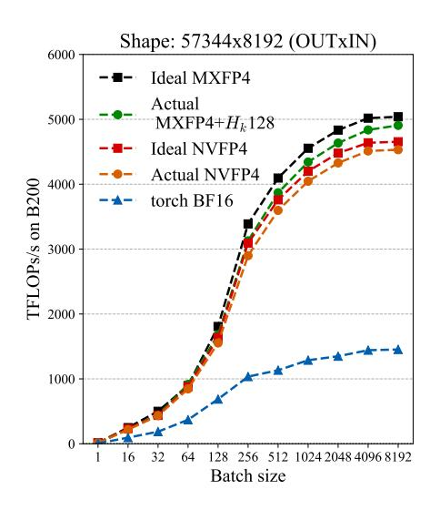
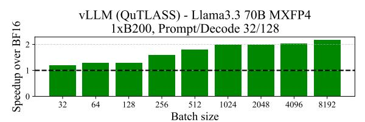
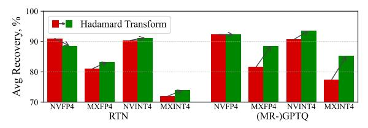

# 5 EXPERIMENTAL RESULTS

1. Experiments with Emulated Quantization. We first evaluate the highly-popular Llama 3.1-8B-Instruct model [\[18\]](#page-11-4), examining the impact of quantizing both weights and activations for all linear layers in this model to the INT4 and FP4 formats, using different algorithms. To ensure compatibility, experiments are performed using simulated quantization in PyTorch. We use a subset of tasks from the Open LLM Leaderboard V1 [\[5\]](#page-10-5) for evaluation: GSM8K for grade school math [\[10\]](#page-10-6), MMLU for world knowledge and reasoning [\[26;](#page-11-12) [9\]](#page-10-7), Winogrande and HellaSwag for language understanding [\[48;](#page-13-14) [58\]](#page-14-2). (Other tasks in this harness yield similar scores across top methods.) The INT4 experiments use group size 32 with FP16 scales, matching the average bit-width of NVFP4.

Algorithms. We consider both weights-and-activations quantization (W4A4, our main focus) and weight-only quantization (W4A16, as a "control"). For W4A4, we implement the following: (1) Round-to-nearest (RTN) quantization to the corresponding format, with absmax scales. In addition, we add Hadamard rotations matching the quantization group size (32), denoted as RTN + HT. (2) SmoothQuant [\[54\]](#page-13-7) diagonal rescaling, with a tuned α smoothening factor. We identified α = 0.6 to be the best in our experiments. (3) QuaRot [\[4\]](#page-10-4), which adds Hadamard rotations strategically at each linear layer. These should reduce quantization error, and most of them can be folded into the model. We use RTN for quantization post-rotation. (4) SpinQuant [\[38\]](#page-12-2), which adds trainable rotations to the model, similarly to QuaRot. A subset of 1024 calibration sequences from FineWeb is used for training the matrices. (5) GPTQ [\[21\]](#page-11-0) weight quantization and RTN on the activations, with absmax scales. A subset of 1024 calibration sequences from FineWeb, absmax scales, standard Hessian dampening factors (λ = 10−2 ), and standard quantization order are used. (6) MR-GPTQ weight quantization, i.e., GPTQ with block rotations, MSE scale optimization, and static activation re-ordering over the rotated weights, as described in Section [4.1,](#page-6-0) with RTN on the activations. As a control, we also implement weight-only quantization, via RTN, GPTQ, AWQ [\[36\]](#page-12-0), as well as Hadamard rotations followed by RTN, denoted as RTN + HT. These results closely follow our findings for W&A quantization, and are thus deferred to the Appendix. In Appendix [K,](#page-32-0) we perform an exhaustive sweep over DCT, DST, Hadamard, and GSR transforms and block sizes showing that the Hadamard transform matching the quantization group size provides the best results on average.

Discussion. The accuracy results for W4A4 experiments on Llama-3.1-8B-Instruct are presented in Table [1.](#page-8-0) The variance for the NVFP4 experiments (i.e., for entries in the 7th column over 5 distinct seeds) is of approximately 0.3 average points, whereas the variance for the INT4 experiments is of approximately 1 point. We mark all top aggregate entries (within 2 standard deviations) as bold in the corresponding columns. We observe the following:

(1) No Lossless Format: Across all formats, the accuracy drop is noticeable. The lowest average drop is for the NVFP4 format with SmoothQuant, GPTQ, or MR-GPTQ (these results are within variance of each other). The weight quantization results (Appendix Table [2\)](#page-15-0), show that the induced error is roughly evenly split between weight and activation quantization. These results suggest that micro-scaling is not a direct solution for accuracy recovery. (2) NVFP4 provides the best accuracy,

| Format   | Method      | MMLU-CoT | GSM8k | HellaSwag | WinoGrande | Avg.  | Recovery % |
|----------|-------------|----------|-------|-----------|------------|-------|------------|
| Baseline | FP16        | 72.76    | 85.06 | 80.01     | 77.90      | 78.93 | 100        |
|          | RTN         | 72.50    | 84.80 | 80.20     | 77.40      | 78.73 | 99.74      |
| INT8     | GPTQ        | 72.40    | 84.40 | 80.00     | 77.30      | 78.53 | 99.48      |
|          | RTN         | 72.40    | 84.70 | 79.80     | 77.70      | 78.65 | 99.64      |
| FP8      | GPTQ        | 71.80    | 84.50 | 79.90     | 78.10      | 78.58 | 99.55      |
|          | RTN         | 65.96    | 74.68 | 77.62     | 74.19      | 73.11 | 92.63      |
| INT4     | RTN+HT      | 68.30    | 79.61 | 77.60     | 73.48      | 74.75 | 94.71      |
|          | GPTQ        | 66.36    | 76.65 | 77.38     | 72.48      | 73.21 | 92.75      |
|          | RTN         | 68.26    | 78.39 | 78.15     | 74.11      | 74.73 | 94.67      |
|          | RTN + HT    | 67.41    | 78.01 | 77.31     | 73.48      | 74.05 | 93.82      |
|          | QuaRot      | 66.50    | 77.40 | 77.25     | 75.14      | 74.10 | 93.80      |
| NVFP4    | SpinQuant   | 66.50    | 76.10 | 76.96     | 75.32      | 73.70 | 93.40      |
|          | SmoothQuant | 68.90    | 79.50 | 79.50     | 74.70      | 75.70 | 95.90      |
|          | GPTQ        | 68.85    | 82.60 | 78.26     | 74.51      | 75.72 | 95.92      |
|          | MR-GPTQ     | 69.12    | 80.80 | 78.17     | 75.24      | 75.84 | 96.08      |
|          | RTN         | 62.21    | 67.85 | 73.99     | 73.24      | 69.32 | 87.83      |
|          | RTN + HT    | 62.38    | 72.48 | 75.29     | 71.67      | 70.45 | 89.26      |
|          | SmoothQuant | 63.93    | 68.54 | 75.10     | 73.56      | 70.30 | 89.06      |
| MXFP4    | QuaRot      | 49.86    | 56.94 | 73.50     | 71.43      | 62.90 | 79.70      |
|          | SpinQuant   | 61.80    | 68.16 | 74.87     | 72.93      | 69.40 | 88.00      |
|          | GPTQ        | 63.49    | 68.46 | 76.01     | 74.51      | 70.62 | 89.47      |
|          | MR-GPTQ     | 67.19    | 75.70 | 76.91     | 74.80      | 73.65 | 93.31      |
|          | RTN         | 68.56    | 78.17 | 78.64     | 75.14      | 75.13 | 95.18      |
|          | RTN + HT    | 68.59    | 81.73 | 78.38     | 74.27      | 75.74 | 95.96      |
| NVINT4   | GPTQ        | 68.69    | 81.58 | 77.59     | 73.40      | 75.32 | 95.42      |
|          | MR-GPTQ     | 69.71    | 82.26 | 79.14     | 75.53      | 76.66 | 97.12      |
|          | RTN         | 55.06    | 56.79 | 72.06     | 68.27      | 63.05 | 79.87      |
|          | RTN + HT    | 58.44    | 61.64 | 73.94     | 71.19      | 66.30 | 84.00      |
| MXINT4   | GPTQ        | 61.22    | 67.70 | 75.04     | 71.67      | 68.91 | 87.30      |
|          | MR-GPTQ     | 65.48    | 74.83 | 76.63     | 73.09      | 72.51 | 91.86      |

Table 1: Unified accuracy comparison of Llama-3.1-8B-Instruct W4A4 under different quantization formats and methods. For each format, top methods within variance are marked in bold.

with INT4 second, and MXFP4 third: On average, NVFP4 and INT4 quantization provide similar quality, with INT4 quantization having higher variance. The MXFP4 format is a distant third in terms of accuracy, regardless of the method used, but benefits significantly from MR-GPTQ. (3) Quantization Method Efficiency: First, we note the good performance of standard RTN for INT4 (with rotations) and NVFP4 (without). Second, the Hadamard transform appears effective for INT4 and MXFP4 (which use group size 32), but is less effective for NVFP4 (which uses group size 16), confirming our analysis. In particular, for round-to-nearest quantization, adding the Hadamard transform to NVFP4 *hurts* accuracy. Finally, the GPTQ and SmoothQuant methods appear to be consistently—but moderately—effective across all three formats.

2. Real Quantization. We integrate our kernels in vLLM [\[30\]](#page-12-10), and perform accuracy evaluations directly in this setup over additional models, such as Llama-3.3-70B-Instruct [\[18\]](#page-11-4), and the Qwen3 [\[55\]](#page-13-6) family of models. The results are presented in Table [10](#page-20-0) and Figure [7.](#page-9-0) For this experiment, we also provide results for Quantization-Aware Training (QAT) performed using the balanced Generalized Jensen-Shannon Divergence loss [\[20;](#page-11-13) [33\]](#page-12-11) between the quantized and the unquantized (frozen) model token distributions on a subset of 92,995 samples (10%) from the Tülu 3 [\[31\]](#page-12-12) instructions dataset. The results show that accuracies measured over real kernels for the Llama-3.1-8B-Instruct model track closely with the results from simulation, with slightly lower recoveries (within 0.2-0.3%). Smaller models (< 8B) and Llama-family models tend to have lower recovery rates, whereas Qwen3 models can achieve more than 99% average recovery in NVFP4. For NVFP4, standard GPTQ provides the highest recoveries on average, although RTN and MR-GPTQ are also competitive, with QAT only providing very limited benefits. For MXFP4, MR-GPTQ provides the best recovery among PTQ methods, while QAT consistently reduces the gap to full precision. Additionally, in Appendix [I](#page-26-1) we analyze differences between GPTQ variants on the less noisy PlatinumBench benchmark [\[53\]](#page-13-15).

**3. Integer Microscaling Formats.** Although integer-based microscaling formats are not specified in the OCP standard [47], one could easy extend the idea to them. For validation purposes, we propose the two following microscaling INT4-based formats: *NVINT4* and *MXINT4* that are identical to NVFP4 and MXFP4 respectively except for the base type being INT4 instead of FP4. The error and outlier preservation analysis in Figure 10 predicts that NVINT4 should profit from HT and yield performance superior to all other formats. Pseudo-quantization evaluations in Tables 1, 7 and Figure 7 verify that for 0-shot (RTN) and 1-shot (MR-GPTQ) quantization — a finding similar to that of Chen et al. [7].

Figure 6: QuTLASS performance end-to-end using our vLLM integration.

Figure 5: QuTLASS performance for a single linear LLM layer.

Figure 7: Average (over Llama 3 1,3,8B) recoveries for microscaling formats and the effect of HT.

**4. Kernel and Inference Performance.** Finally, in Figures 5 and 6, we examine the performance of our kernels. Figure 5 shows throughput for a single layer extracted from a Llama-3.3-70B model using FlashInfer as a backend. The curve labeled with "ideal" represents the upper bound for a real 4-bit weight and 4-bit activation matrix multiplication, i.e., the measured matmul throughput not including the overhead of quantization-related operations. In contrast, the curves labeled "actual" show real measurements including the costs of Hadamards, quantization, and scale computation. The comparison highlights the small gap between idealized efficiency and practical implementations with our kernels, with speedups of up to  $\approx 3.6 \times$  (out of  $4 \times$ ) on B200 and  $\approx 6 \times$  (out of  $8 \times$ ) on RTX5090. Interestingly, MXFP4 *outperforms* NVFP4 on B200, with up to  $\approx 15\%$  higher throughput, despite their closely related numerical formats. Possible contributing factors include MXFP4's use of potentially more efficient power-of-two scales as well as larger group sizes, which could reduce overhead.

Figure 6 shows end-to-end speedup of vLLM running Llama-3.3-70B with MXFP4 quantization compared to the baseline BF16 implementation on a single B200 GPU. The results demonstrate consistent performance gains across batch sizes, with speedups reaching up to  $2.2\times$  over the BF16 baseline, and nearly  $4\times$  on an RTX 5090 GPU (see Appendix F for more details).

#### 6 CONCLUSION

We present a first comprehensive study of the recently introduced MXFP4 and NVFP4 formats for LLM quantization, revealing gaps between the promise of these formats and their performance using state-of-the-art methods. To bridge these gaps, we introduce Micro-Rotated-GPTQ (MR-GPTQ), a novel GPTQ variant adapted to these formats. We support this approach with QuTLASS, a suite of high-performance GPU kernels that implement MR-GPTQ's micro-rotations with negligible overhead. We hope that our results will provide a basis and a motivation for future work on improving accuracy for these novel formats.

