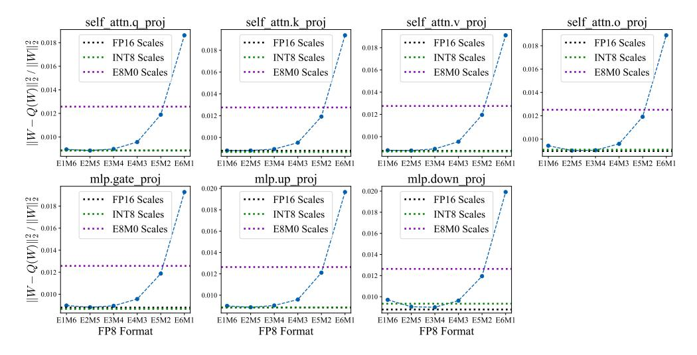
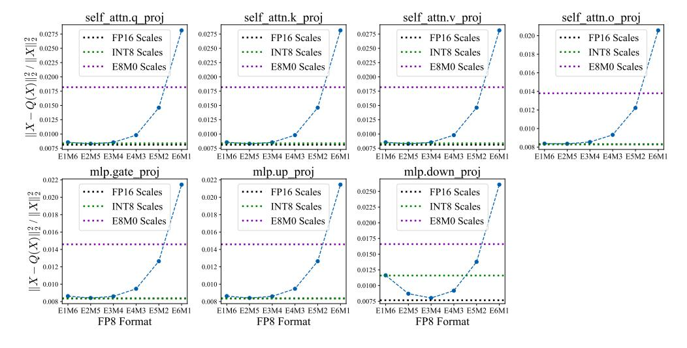
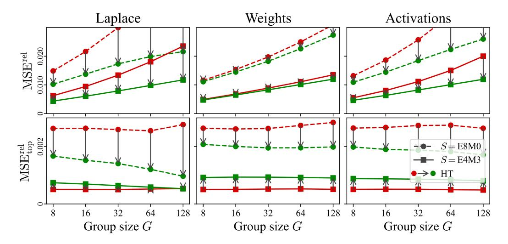
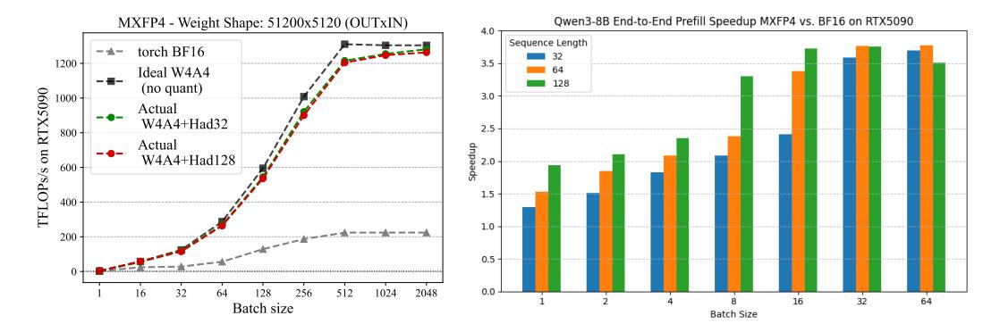
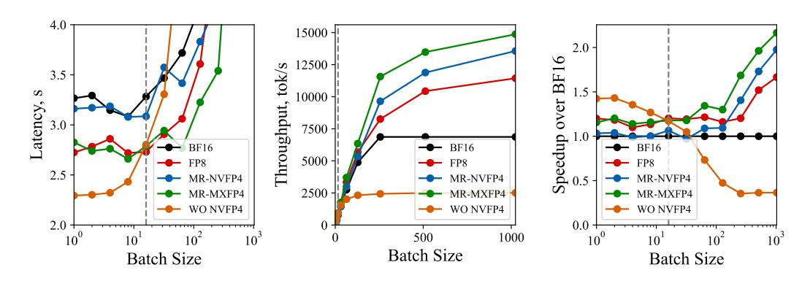
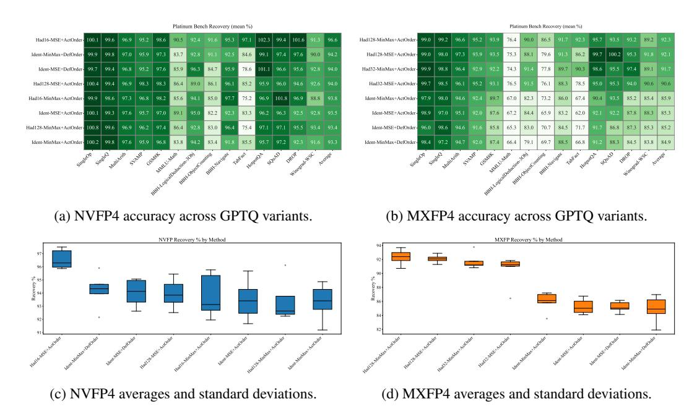
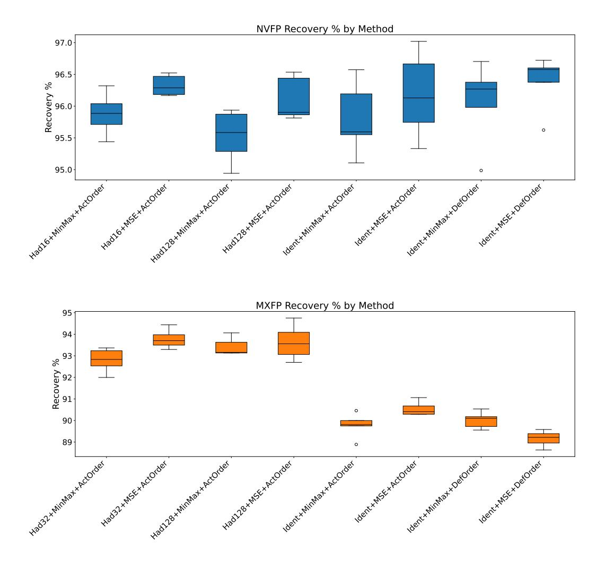
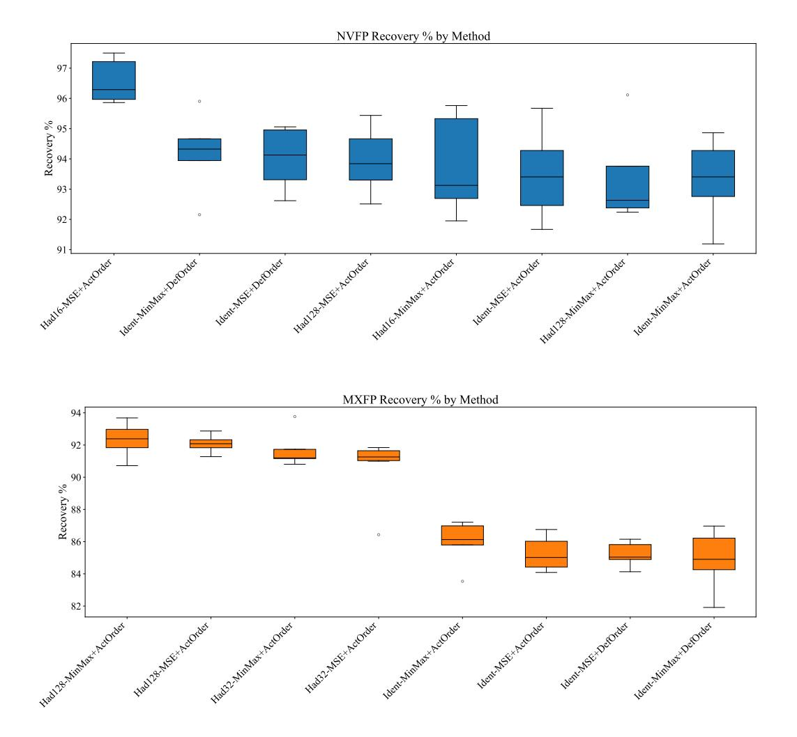

# B REAL QUANTIZATION RESULTS

In this section we provide a complete set of evaluation results for Llama-3 (Llama-3.2-1B-Instruct, Llama-3.2-3B-Instruct, Llama-3.1-8B-Instruct, Llama-3.3-70B-Instruct) and Qwen-3 (Qwen-3-8B, Qwen-3-14B, Qwen-3-32B) model families. We turn off thinking mode for Qwen as it turned out that long reasoning chains-of-thought turned out to be detrimental for performance on GSM8k and MMLU-CoT. The scores were produced using QuTLASS vLLM integration.

Table [10](#page-20-0) present more details on accuracy recovery for micro-scaling formats, including *NVINT4* and *MXINT4* and QAT.

| Format | Quantization | MMLU  | GSM8k | HellaSwag | WinoGrande | Avg.  | Recovery% |
|--------|--------------|-------|-------|-----------|------------|-------|-----------|
| -      | FP16         | 46.20 | 46.32 | 59.78     | 61.56      | 53.47 | –         |
|        | RTN          | 45.90 | 44.20 | 59.80     | 61.30      | 52.80 | 99.55     |
| INT8   | GPTQ         | 45.40 | 44.90 | 59.60     | 60.10      | 52.50 | 98.99     |
|        | RTN          | 46.10 | 44.70 | 59.50     | 59.50      | 52.50 | 98.99     |
| FP8    | GPTQ         | 45.80 | 45.00 | 59.10     | 60.60      | 52.63 | 99.22     |
|        | RTN          | 36.08 | 31.39 | 54.77     | 57.22      | 44.87 | 83.91     |
|        | RTN+Had16    | 32.80 | 25.02 | 56.24     | 59.04      | 43.28 | 80.94     |
|        | RTN+Had128   | 38.28 | 29.95 | 54.27     | 58.41      | 45.23 | 84.59     |
|        | GPTQ         | 37.79 | 29.80 | 55.48     | 60.22      | 45.82 | 85.71     |
| NVFP   | GPTQ+Had16   | 38.99 | 32.98 | 56.66     | 58.17      | 46.70 | 87.35     |
|        | GPTQ+Had128  | 35.47 | 31.16 | 57.02     | 59.19      | 45.71 | 85.50     |
|        | QAT          | 27.85 | 38.51 | 57.52     | 60.30      | 46.05 | 86.12     |
|        | QAT+Had16    | 32.72 | 37.60 | 57.53     | 58.41      | 46.57 | 87.09     |
|        | RTN          | 30.46 | 11.83 | 48.28     | 54.22      | 36.20 | 67.70     |
|        | RTN+Had32    | 30.89 | 19.41 | 51.64     | 57.22      | 39.79 | 74.42     |
|        | RTN+Had128   | 34.48 | 25.55 | 53.98     | 58.01      | 43.01 | 80.44     |
|        | GPTQ         | 26.84 | 13.50 | 49.29     | 56.75      | 36.60 | 68.45     |
| MXFP   | GPTQ+Had32   | 29.44 | 27.60 | 54.89     | 58.72      | 42.66 | 79.80     |
|        | GPTQ+Had128  | 35.68 | 28.13 | 54.60     | 58.72      | 44.28 | 82.83     |
|        | QAT          | 15.60 | 20.32 | 53.34     | 56.51      | 36.44 | 68.16     |
|        | QAT+Had32    | 28.12 | 36.85 | 57.04     | 58.80      | 45.20 | 84.55     |
|        | RTN          | 37.33 | 26.08 | 52.62     | 58.56      | 43.65 | 81.64     |
|        | RTN+Had16    | 33.41 | 32.52 | 57.12     | 59.19      | 45.56 | 85.21     |
| NVINT4 | GPTQ         | 37.15 | 27.60 | 55.94     | 59.35      | 45.01 | 84.19     |
|        | MR-GPTQ      | 36.69 | 33.36 | 57.95     | 58.96      | 46.74 | 87.42     |
|        | RTN          | 21.85 | 4.55  | 45.07     | 55.49      | 31.74 | 59.37     |
|        | RTN+Had32    | 13.17 | 9.48  | 48.91     | 53.99      | 31.39 | 58.71     |
| MXINT4 | GPTQ         | 23.42 | 13.27 | 50.02     | 55.88      | 35.65 | 66.67     |
|        | MR-GPTQ      | 21.81 | 23.12 | 54.96     | 55.41      | 38.83 | 72.62     |

Table 3: Performance of Llama-3.2-1B-Instruct for different weight & activation quantization settings.

| Format | Quantization   | MMLU  | GSM8k | HellaSwag | WinoGrande | Avg.  | Recovery% |
|--------|----------------|-------|-------|-----------|------------|-------|-----------|
| -      | FP16           | 64.43 | 78.01 | 73.42     | 70.09      | 71.49 | –         |
|        | RTN            | 64.00 | 77.70 | 73.30     | 69.60      | 71.15 | 99.47     |
| INT8   | GPTQ           | 64.00 | 77.90 | 73.40     | 69.90      | 71.30 | 99.67     |
|        | RTN            | 63.40 | 77.70 | 73.00     | 69.70      | 70.95 | 99.19     |
| FP8    | GPTQ           | 64.10 | 77.80 | 73.00     | 69.90      | 71.20 | 99.54     |
|        | RTN            | 60.62 | 70.43 | 70.99     | 68.03      | 67.52 | 94.45     |
|        | RTN+Had16      | 59.91 | 64.82 | 69.77     | 65.59      | 65.02 | 90.96     |
|        | RTN+Had128     | 54.34 | 67.48 | 69.69     | 66.93      | 64.61 | 90.38     |
|        | GPTQ           | 61.76 | 70.36 | 71.07     | 69.93      | 68.28 | 95.51     |
| NVFP   | GPTQ+Had16     | 60.26 | 68.76 | 71.05     | 67.80      | 66.97 | 93.68     |
|        | GPTQ+Had128    | 60.19 | 70.89 | 70.97     | 68.19      | 67.56 | 94.51     |
|        | MicroQAT+Had16 | 60.66 | 69.98 | 70.55     | 67.01      | 67.05 | 93.79     |
|        | QAT            | 62.06 | 75.06 | 71.27     | 67.96      | 69.09 | 96.64     |
|        | QAT+Had16      | 62.03 | 72.93 | 70.95     | 66.46      | 68.09 | 95.25     |
|        | RTN            | 56.81 | 60.80 | 67.30     | 64.56      | 62.37 | 87.24     |
|        | RTN+Had32      | 55.58 | 57.77 | 68.56     | 64.33      | 61.56 | 86.11     |
|        | RTN+Had128     | 55.95 | 60.80 | 67.57     | 64.88      | 62.30 | 87.15     |
|        | GPTQ           | 57.68 | 62.32 | 63.87     | 64.88      | 62.19 | 86.99     |
| MXFP   | GPTQ+Had32     | 59.79 | 68.92 | 69.50     | 66.85      | 66.27 | 92.69     |
|        | GPTQ+Had128    | 59.56 | 67.78 | 70.08     | 68.03      | 66.36 | 92.83     |
|        | MicroQAT+Had32 | 59.49 | 65.66 | 69.05     | 67.32      | 65.38 | 91.46     |
|        | QAT            | 56.17 | 64.90 | 69.51     | 67.17      | 64.44 | 90.14     |
|        | QAT+Had32      | 59.83 | 72.48 | 70.27     | 66.54      | 67.28 | 94.11     |
|        | RTN            | 60.22 | 71.65 | 70.92     | 66.77      | 67.39 | 94.27     |
|        | RTN + HT       | 56.75 | 71.95 | 69.24     | 66.61      | 66.14 | 92.52     |
| NVINT4 | GPTQ           | 60.5  | 71.42 | 27.01     | 51.07      | 52.50 | 73.44     |
|        | MR-GPTQ        | 60.8  | 72.25 | 71.74     | 70.48      | 68.82 | 96.27     |
|        | RTN            | 46.03 | 47.54 | 64.21     | 61.56      | 54.84 | 76.71     |
| MXINT4 | RTN + HT       | 50.55 | 51.33 | 64.61     | 59.83      | 56.58 | 79.15     |
|        | GPTQ           | 53.48 | 60.73 | 51.44     | 58.80      | 56.11 | 78.49     |
|        | MR-GPTQ        | 57.73 | 67.48 | 68.92     | 66.69      | 65.21 | 91.21     |

Table 4: Performance of Llama-3.2-3B-Instruct for different weight & activation quantization settings.

| Format | Quantization | MMLU-CoT | GSM8k | HellaSwag | WinoGrande | Avg.  | Recovery% |
|--------|--------------|----------|-------|-----------|------------|-------|-----------|
| -      | FP16         | 72.80    | 85.10 | 80.00     | 77.90      | 78.90 | –         |
|        | RTN          | 72.50    | 84.80 | 80.20     | 77.40      | 78.73 | 99.74     |
| INT8   | GPTQ         | 72.40    | 84.40 | 80.00     | 77.30      | 78.53 | 99.48     |
|        | RTN          | 72.40    | 84.70 | 79.80     | 77.70      | 78.65 | 99.64     |
| FP8    | GPTQ         | 71.80    | 84.50 | 79.90     | 78.10      | 78.58 | 99.55     |
|        | RTN          | 68.70    | 78.70 | 78.40     | 73.40      | 74.80 | 94.80     |
|        | RTN+Had      | 67.00    | 77.40 | 77.30     | 74.40      | 74.00 | 93.80     |
|        | RTN+Had128   | 66.60    | 77.00 | 77.50     | 75.50      | 74.10 | 93.90     |
|        | GPTQ         | 68.60    | 79.60 | 78.70     | 75.50      | 75.60 | 95.70     |
| NVFP   | GPTQ+Had     | 69.40    | 79.60 | 78.40     | 75.10      | 75.60 | 95.80     |
|        | GPTQ+Had128  | 68.90    | 79.50 | 78.30     | 73.60      | 75.10 | 95.10     |
|        | QAT          | 68.20    | 79.80 | 78.90     | 74.40      | 75.30 | 95.40     |
|        | QAT+Had      | 68.90    | 81.60 | 79.00     | 75.10      | 76.10 | 96.50     |
|        | RTN          | 62.20    | 69.50 | 73.80     | 72.60      | 69.50 | 88.10     |
|        | RTN+Had      | 62.60    | 71.80 | 75.20     | 72.30      | 70.50 | 89.30     |
|        | RTN+Had128   | 64.50    | 72.70 | 76.00     | 73.30      | 71.60 | 90.70     |
|        | GPTQ         | 63.74    | 70.20 | 75.52     | 7364       | 70.78 | 89.66     |
| MXFP   | GPTQ+Had     | 67.20    | 77.50 | 77.00     | 73.10      | 73.70 | 93.30     |
|        | GPTQ+Had128  | 66.80    | 78.30 | 76.90     | 74.90      | 74.20 | 94.00     |
|        | QAT          | 65.00    | 76.00 | 77.60     | 72.90      | 72.90 | 92.30     |
|        | QAT+Had      | 67.60    | 80.30 | 78.30     | 74.90      | 75.30 | 95.40     |
|        | RTN          | 68.56    | 78.17 | 78.64     | 75.14      | 75.13 | 95.18     |
|        | RTN + HT     | 68.59    | 81.73 | 78.38     | 74.27      | 75.74 | 95.96     |
| NVINT4 | GPTQ         | 68.69    | 81.58 | 77.59     | 73.40      | 75.32 | 95.42     |
|        | MR-GPTQ      | 69.71    | 82.26 | 79.14     | 75.53      | 76.66 | 97.12     |
|        | RTN          | 55.06    | 56.79 | 72.06     | 68.27      | 63.05 | 79.87     |
|        | RTN + HT     | 58.44    | 61.64 | 73.94     | 71.19      | 66.30 | 84.00     |
| MXINT4 | GPTQ         | 61.22    | 67.70 | 75.04     | 71.67      | 68.91 | 87.30     |
|        | MR-GPTQ      | 65.48    | 74.83 | 76.63     | 73.09      | 72.51 | 91.86     |

Table 5: Performance of Llama-3.1-8B-Instruct for different weight & activation quantization settings.

| Format | Quantization | MMLU  | GSM8k | HellaSwag | WinoGrande | Avg.  | Recovery% |
|--------|--------------|-------|-------|-----------|------------|-------|-----------|
| -      | FP16         | 86.55 | 95.07 | 86.22     | 84.93      | 88.19 | –         |
|        | RTN          | 85.50 | 93.48 | 85.63     | 83.27      | 86.97 | 98.61     |
|        | RTN+Had16    | 85.02 | 93.63 | 84.97     | 83.82      | 86.86 | 98.49     |
|        | RTN+Had128   | 85.24 | 91.81 | 84.91     | 83.35      | 86.33 | 97.89     |
| NVFP   | GPTQ         | 85.54 | 94.09 | 85.49     | 84.37      | 87.37 | 99.07     |
|        | GPTQ+Had16   | 85.58 | 93.40 | 85.45     | 82.40      | 86.71 | 98.32     |
|        | GPTQ+Had128  | 85.59 | 94.16 | 85.56     | 84.77      | 87.52 | 99.24     |
|        | RTN          | 83.42 | 92.65 | 83.93     | 81.45      | 85.36 | 96.79     |
|        | RTN+Had32    | 83.86 | 93.56 | 84.13     | 83.58      | 86.28 | 97.83     |
|        | RTN+Had128   | 84.37 | 94.47 | 84.22     | 82.40      | 86.37 | 97.93     |
| MXFP   | GPTQ         | 83.77 | 94.47 | 84.41     | 82.64      | 86.32 | 97.88     |
|        | GPTQ+Had32   | 84.82 | 94.54 | 84.66     | 83.11      | 86.78 | 98.40     |
|        | GPTQ+Had128  | 84.90 | 93.90 | 84.80     | 83.80      | 86.86 | 98.48     |

Table 6: Performance of Llama-3.3-70B-Instruct for different weight & activation quantization settings.

| Format | Quantization | MMLU  | GSM8k | HellaSwag | WinoGrande | Avg.  | Recovery% |
|--------|--------------|-------|-------|-----------|------------|-------|-----------|
| -      | FP16         | 72.98 | 90.90 | 75.52     | 70.56      | 77.49 | –         |
|        | RTN          | 70.78 | 90.30 | 74.63     | 70.72      | 76.61 | 98.86     |
|        | RTN+Had16    | 70.19 | 86.35 | 73.02     | 68.11      | 74.42 | 96.04     |
|        | RTN+Had128   | 69.09 | 86.66 | 73.47     | 67.96      | 74.30 | 95.88     |
|        | GPTQ         | 70.90 | 88.17 | 75.01     | 70.09      | 76.04 | 98.13     |
| NVFP   | GPTQ+Had16   | 71.06 | 88.32 | 74.58     | 68.03      | 75.50 | 97.43     |
|        | GPTQ+Had128  | 70.45 | 87.41 | 74.25     | 68.90      | 75.25 | 97.11     |
|        | QAT          | 70.94 | 89.08 | 74.67     | 68.51      | 75.80 | 97.82     |
|        | QAT+Had16    | 71.34 | 89.23 | 75.24     | 70.40      | 76.55 | 98.79     |
|        | RTN          | 67.69 | 84.23 | 71.24     | 67.40      | 72.64 | 93.74     |
|        | RTN+Had32    | 67.57 | 83.78 | 71.32     | 67.32      | 72.50 | 93.56     |
|        | RTN+Had128   | 67.27 | 81.58 | 71.41     | 66.38      | 71.66 | 92.48     |
|        | GPTQ         | 68.01 | 84.23 | 71.65     | 67.80      | 72.92 | 94.11     |
| MXFP   | GPTQ+Had32   | 69.13 | 84.84 | 73.17     | 68.03      | 73.79 | 95.23     |
|        | GPTQ+Had128  | 69.53 | 86.43 | 73.55     | 65.75      | 73.82 | 95.26     |
|        | QAT          | 69.45 | 87.34 | 74.03     | 69.85      | 75.17 | 97.00     |
|        | QAT+Had32    | 70.35 | 89.61 | 74.61     | 70.56      | 76.28 | 98.44     |

Table 7: Performance of Qwen-8B for different weight & activation quantization settings.

| Format | Quantization            | MMLU           | GSM8k          | HellaSwag      | WinoGrande     | Avg.           | Recovery%      |
|--------|-------------------------|----------------|----------------|----------------|----------------|----------------|----------------|
| -      | FP16                    | 77.18          | 91.96          | 79.84          | 74.27          | 80.81          | –              |
|        | RTN                     | 75.73          | 91.28          | 78.36          | 73.16          | 79.63          | 98.54          |
| NVFP   | RTN+Had16 RTN+Had128 | 74.98 74.46 | 92.04 91.13 | 77.76 77.60 | 72.38 71.98 | 79.29 78.79 | 98.12 97.50 |
|        | GPTQ GPTQ+Had16      | 74.88 75.49 | 91.28 91.43 | 78.40 78.38 | 74.51 74.51 | 79.77 79.95 | 98.71 98.94 |
|        | GPTQ+Had128             | 75.10          | 90.52          | 78.30          | 72.77          | 79.17          | 97.97          |
|        | RTN                     | 72.92          | 90.22          | 76.68          | 71.51          | 77.83          | 96.31          |
|        | RTN+Had32               | 73.19          | 89.54          | 75.95          | 71.67          | 77.59          | 96.01          |
|        | RTN+Had128              | 73.17          | 85.60          | 76.80          | 72.14          | 76.93          | 95.19          |
| MXFP   | GPTQ                    | 72.57          | 89.54          | 76.50          | 72.45          | 77.77          | 96.23          |
|        | GPTQ+Had32              | 74.36          | 89.92          | 77.64          | 72.53          | 78.61          | 97.28          |
|        | GPTQ+Had128             | 74.11          | 89.92          | 77.77          | 71.11          | 78.23          | 96.80          |

Table 8: Performance of Qwen-14B for different weight & activation quantization settings.

| Format | Quantization | MMLU  | GSM8k | HellaSwag | WinoGrande | Avg.  | Recovery% |
|--------|--------------|-------|-------|-----------|------------|-------|-----------|
| -      | FP16         | 80.81 | 92.04 | 83.97     | 76.56      | 83.35 | –         |
|        | RTN          | 79.85 | 94.24 | 83.27     | 75.22      | 83.15 | 99.76     |
|        | RTN+Had16    | 78.90 | 89.23 | 82.60     | 76.48      | 81.80 | 98.15     |
|        | RTN+Had128   | 78.49 | 89.69 | 82.47     | 75.37      | 81.51 | 97.79     |
| NVFP   | GPTQ         | 79.54 | 92.87 | 83.24     | 75.93      | 82.90 | 99.46     |
|        | GPTQ+Had16   | 78.60 | 90.90 | 82.93     | 75.14      | 81.89 | 98.26     |
|        | GPTQ+Had128  | 79.11 | 90.52 | 83.15     | 76.09      | 82.22 | 98.65     |
|        | RTN          | 77.07 | 72.33 | 81.52     | 75.22      | 76.54 | 91.83     |
|        | RTN+Had32    | 78.22 | 93.03 | 81.76     | 75.93      | 82.24 | 98.67     |
|        | RTN+Had128   | 78.36 | 88.10 | 81.66     | 75.30      | 80.86 | 97.01     |
| MXFP   | GPTQ         | 77.01 | 88.55 | 81.79     | 74.90      | 80.56 | 96.66     |
|        | GPTQ+Had32   | 78.46 | 82.41 | 82.72     | 75.06      | 79.66 | 95.58     |
|        | GPTQ+Had128  | 78.90 | 90.90 | 82.29     | 75.22      | 81.83 | 98.18     |

Table 9: Performance of Qwen-32B for different weight & activation quantization settings.

Table 10: Per-model recoveries with real (NVFP4 and MXFP4) and hypothetical (NVINT4 and MXINT4) quantization.

| Format | Method  | HT |      |      | Llama3 |      |      | Qwen3 |      |
|--------|---------|----|------|------|--------|------|------|-------|------|
|        |         |    | 1B   | 3B   | 8B     | 70B  | 8B   | 14B   | 32B  |
|        | RTN     | –  | 83.9 | 94.4 | 94.8   | 98.6 | 98.9 | 98.5  | 99.8 |
|        | RTN     | 16 | 80.9 | 91.0 | 93.8   | 98.5 | 96.0 | 98.1  | 98.1 |
|        | GPTQ    | –  | 85.7 | 95.5 | 95.7   | 99.1 | 98.1 | 98.7  | 99.5 |
| NVFP4  | MR-GPTQ | 16 | 87.3 | 93.7 | 95.8   | 98.3 | 97.4 | 98.9  | 98.3 |
|        | QAT     | –  | 86.1 | 96.6 | 95.4   | –    | 97.8 | –     | –    |
|        | QAT     | 16 | 87.1 | 95.3 | 96.5   | –    | 98.8 | –     | –    |
|        | RTN     | –  | 67.7 | 87.2 | 88.1   | 96.8 | 93.7 | 96.3  | 91.8 |
|        | RTN     | 32 | 74.4 | 86.1 | 89.3   | 97.8 | 93.6 | 96.0  | 98.7 |
|        | GPTQ    | –  | 68.4 | 87.0 | 89.7   | 97.9 | 94.1 | 96.2  | 96.7 |
| MXFP4  | MR-GPTQ | 32 | 79.8 | 92.7 | 93.3   | 98.4 | 95.2 | 97.3  | 95.6 |
|        | QAT     | –  | 68.2 | 90.1 | 92.3   | –    | 97.0 | –     | –    |
|        | QAT     | 32 | 84.5 | 94.1 | 95.4   | –    | 98.4 | –     | –    |
|        | RTN     | –  | 81.6 | 94.3 | 95.2   | –    | 96.3 | 98.1  | –    |
|        | RTN     | 16 | 85.2 | 92.5 | 96.0   | –    | 98.1 | 99.2  | –    |
| NVINT4 | GPTQ    | –  | 84.2 | 92.5 | 95.4   | –    | –    | –     | –    |
|        | MR-GPTQ | 16 | 87.4 | 96.3 | 97.1   | –    | –    | –     | –    |
|        | RTN     | –  | 59.4 | 76.7 | 79.9   | –    | 83.9 | 92.4  | –    |
|        | RTN     | 32 | 58.7 | 79.1 | 84.0   | –    | 89.7 | 94.9  | –    |
| MXINT4 | GPTQ    | –  | 66.7 | 78.5 | 87.3   | –    | –    | –     | –    |
|        | MR-GPTQ | 32 | 72.6 | 91.2 | 91.9   | –    | –    | –     | –    |

### C SCALE QUANTIZATION ANALYSIS

As discussed in the main text, microscaling formats adopt scale quantization to reduce memory storage overhead and accelerate dequantization operations. However, scale quantization may introduce additional error due to rounding of scales onto a coarser grid. Below we provide an analysis and explore alternative choices for scale quantization.

MXFP format adopts E8M0 grid with exponentially spaced levels. It allows to represent values with very small and large magnitude, yet the distance between adjacent levels can be pretty large resulting in large approximation errors. E4M3 grid used in NVFP, on the other hand, has much narrower dynamic range [-448, 448] with levels spread more uniformly. We note, that the sign bit is in fact never utilized, given that the scale is a non-negative value by definition.

Below, we explore several choices for 8-bit scale quantization with a fixed group size of 16. Specifically, we measure weight and activation  $MSE^{rel}$  for a range of EeMm formats with e + m = 7, as well as for E8M0 and INT8. For E8M0 scale quantization, we multiply the scale by 4/3 following [52], which yields an unbiased estimate of the original scale and reduces quantization error. Results for weight and activation quantization are shown in Figure 8 and Figure 9, respectively.

Figure 8: MSErel for the weights of 15th block in the Llama-3.1-8B-Instruct model.

Figure 9: MSErel for the activations of 15th block in the Llama-3.1-8B-Instruct model.

Figure 10: The effect of Hadamard Transform (HT) on MXINT4 (E8M0) and NVINT4 (E4M3) quantization on Laplace distribution samples and Llama-3.1-8B-Instruct weights and activations for various group sizes.

One can observe that the E4M3 and E8M0 scales are not optimal for weight scale quantization. E4M3 and E8M0 increase MSErel by 10%, 40% on average, respectively. At the same time, FP8 options with larger mantissa (E1M6-E3M4) as well as INT8 perform close to FP4 without scale quantization. The pattern for activation pattern is similar except for the case of down\_proj in feedforward layer, which is known to have a more heavy-tailed distribution with pronounced outliers. We note that the observed behavior generalizes to other models considered in our study.

### D INT4-BASED MICROSCALING FORMATS

To bridge this analysis gap and inform future hardware designs, we now present a new analysis of *hypothetical* microscaling INT4 formats.

Since INT4 is not a part of the "OCP Microscaling Formats (MX) Specification" [47], we define it ourselves as follows:

- 1. We define INT4 base data type as a uniform symmetric grid of 15 (to match FP4) elements: [-7, -6, -5, -4, -3, -2, -1, 0, +1, +2, +3, +4, +5, +6, +7].
- 2. We define NVINT4 as a microscaling format with E4M3 shared scales for groups of 16 elements (same as NVFP4) over the INT4 base element data type.
- 3. We define MXINT4 as a microscaling format with E8M0 shared scales for groups of 32 elements (same as MXFP4) over the INT4 base element data type.

Applying the error analysis from Section 3 to these formats, as demonstrated in Figure 10, reveals that NVINT4 performs close to NVFP4 without the normalizing transforms. Yet, the proposed group Hadamard Transform has positive effect on it (as opposed to negative for NVFP4), making microrotated NVINT4 the most accurate of all the analyzed formats. MXINT4, however, performs poorly, and the normalizing transforms yield limited improvement. These findings extrapolate seamlessly to evalutations in Tables 1,3,4 and 5, confirming the usefullness of the Hadamard Transform and the superiority of the micro-rotated NVINT4 format.

### E OUTLIERS ANALYSIS

**Proof of Lemma 1.** Let  $U=\frac{1}{\sqrt{G}}H$  be the normalized Hadamard matrix. U is orthogonal ( $U^{\top}U=I_G$ ). The error vectors are related by  $\varepsilon_x=\widehat{x}-x=U^{\top}\widehat{y}-U^{\top}y=U^{\top}(\widehat{y}-y)=U^{\top}\varepsilon_y$ . Since U

is orthogonal, it preserves the Euclidean norm:  $\|\varepsilon_x\|_2^2 = \|U^{\top}\varepsilon_y\|_2^2 = \|\varepsilon_y\|_2^2$ . The per-element Mean Squared Error (MSE) is defined as:

$$\mathrm{MSE}(G) = \frac{1}{G} \mathbb{E}[\|\varepsilon_x\|_2^2] = \frac{1}{G} \mathbb{E}[\|\varepsilon_y\|_2^2].$$

This establishes the second equality.

To prove the first, we rely on the standard assumption in quantization analysis that the quantization error  $\varepsilon_y$  is statistically independent of the signal y. Since x and y are related by the invertible transformation  $x = U^\top y$ ,  $\varepsilon_y$  is also independent of x. Consequently, the reconstruction error  $\varepsilon_x = U^\top \varepsilon_y$  is also going to be independent of x.

The index  $I_{\star} = \arg\max_{i} |x_{i}|$  is a function of x. Therefore, the error vector  $\varepsilon_{x}$  (and its components) is independent of the random index  $I_{\star}$ . Further, since the coordinates of x are i.i.d., we can apply symmetry to obtain that the probability that any coordinate i has the largest magnitude is uniform:  $P(I_{\star} = i) = 1/G$ .

We calculate the Top-Element MSE using the Law of Total Expectation:

$$\begin{aligned} \text{MSE}_{\text{top}}(G) &= \mathbb{E}[(\varepsilon_x)_{I_{\star}}^2] \\ &= \sum_{i=1}^G \mathbb{E}[(\varepsilon_x)_{I_{\star}}^2 \mid I_{\star} = i] P(I_{\star} = i) \\ &= \sum_{i=1}^G \mathbb{E}[(\varepsilon_x)_i^2 \mid I_{\star} = i] \cdot \frac{1}{G}. \end{aligned}$$

Because  $(\varepsilon_x)_i^2$  is independent of the event  $\{I_\star=i\}$ , the conditional expectation simplifies to  $\mathbb{E}[(\varepsilon_x)_i^2\mid I_\star=i]=\mathbb{E}[(\varepsilon_x)_i^2]$ . Substituting yields:

$$\begin{split} \mathrm{MSE_{top}}(G) &= \frac{1}{G} \sum_{i=1}^{G} \mathbb{E}[(\varepsilon_x)_i^2] \\ &= \frac{1}{G} \mathbb{E}\left[\sum_{i=1}^{G} (\varepsilon_x)_i^2\right] \quad \text{(by linearity of expectation)} \\ &= \frac{1}{G} \mathbb{E}[\|\varepsilon_x\|_2^2] = \mathrm{MSE}(G). \end{split}$$

This completes the proof.

**Lemma 3** (Outliers MAPE). Let distribution  $\mathcal{X}$  be a mix of two distributions:  $\mathcal{X}_{base}$  and  $\mathcal{X}_{outliers}$  with portions 1-p and p such that:

- 1.  $\min(|\mathcal{X}_{outliers}|) > \max(|\mathcal{X}_{base}|)$ ,
- 2.  $\mathrm{MSE_{ton}^{rel}}(X \sim \mathcal{X}|X_{I_{\star}} \sim \mathcal{X}_{outliers}) = \mathrm{MSE_{ton}^{rel}}(X \sim \mathcal{X}|X_{I_{\star}} \sim \mathcal{X}_{base}),$
- 3.  $p \cdot G \ll \mathrm{MSE_{top}^{rel}}(\mathcal{X})$ .

Then the expected outlier relative quadratic error equals  $MSE_{top}^{rel}(\mathcal{X})$  up to O(pG):

$$\mathbb{E}_{X \sim \mathcal{X}} \left[ \frac{\sum_{i=1}^{G} \lambda_{X_i \sim \mathcal{X}_{outliers}} \cdot \frac{(X_i - \widehat{X}_i)^2}{X_i^2}}{\sum_{i=1}^{G} \lambda_{X_i \sim \mathcal{X}_{outliers}}} \right] \approx \text{MSE}_{\text{top}}^{\text{rel}}(X \sim \mathcal{X}).$$

*Proof.* We expand the expectation conditioned on  $X_{I_{+}} \sim \mathcal{X}_{outliers}$ :

$$\begin{split} & \mathbb{E}_{X \sim \mathcal{X}} \left[ \frac{\sum_{i=1}^{G} \lambda_{X_{i} \sim \mathcal{X}_{outliers}} \cdot \frac{(X_{i} - \widehat{X}_{i})^{2}}{X_{i}^{2}}}{\sum_{i=1}^{G} \lambda_{X_{i} \sim \mathcal{X}_{outliers}}} \right] \\ & = \mathbb{E}_{X \sim \mathcal{X} \mid X_{I_{\star}} \sim \mathcal{X}_{outliers}} \left[ \frac{\frac{(X_{I_{\star}} - \widehat{X}_{I_{\star}})^{2}}{X_{I_{\star}}^{2}} + \sum_{i \neq I_{\star}} \lambda_{X_{i} \sim \mathcal{X}_{outliers}} \cdot \frac{(X_{i} - \widehat{X}_{i})^{2}}{X_{i}^{2}}}{1 + \sum_{i \neq I_{\star}} \lambda_{X_{i} \sim \mathcal{X}_{outliers}}} \right] \\ & = \mathbb{E}_{X \sim \mathcal{X} \mid X_{I_{\star}} \sim \mathcal{X}_{outliers}} \left[ \frac{(X_{I_{\star}} - \widehat{X}_{I_{\star}})^{2}}{X_{I_{\star}}^{2}} \right] + O(pG). \end{split}$$

By Assumption 2 this conditional expectation equals  $\mathrm{MSE^{rel}_{top}}(\mathcal{X})$ , up to O(pG) from Assumption 3. Hence the claim follows.

**Discussion.** Assumption 1 is satisfied for outliers chosen by absolute value thresholds. Assumption 2 holds for floating-point quantization due to constant relative accuracy (no overflow/underflow), verified in Section 3.2. Assumption 3 holds in practice for LLMs since outliers are typically about 0.1% of elements [12].

**Lemma 4** (Consistency of  $\mathrm{MSE}^{\mathrm{rel}}_{\mathrm{top}}$  for smooth distributions). Let  $\mathcal X$  be a distribution of values to quantize with a power-of-two translation-invariant quantization function

$$Q: \forall x \in \mathbb{R}_+, \forall k \in \mathbb{Z}: Q(x \cdot 2^k) = 2^k \cdot Q(x).$$

Assume:

- 1. supp  $\mathcal{X} \subset [2^a, 2^b]$  for integers a < b,
- 2.  $\forall x \in \text{supp } \mathcal{X}, \forall y \in [x/\sqrt{2}, x \cdot \sqrt{2}] : |f_{\mathcal{X}}(x) f_{\mathcal{X}}(y)| \leq \alpha$ ,

3. 
$$\frac{(x-Q(x))^2}{x^2} \leq MSE_{max}^{rel}$$

Then

$$\mathbb{E}_{x \sim \mathcal{X}} \left[ \frac{(x - Q(x))^2}{x^2} \right] = \int_1^2 \frac{(x - Q(x))^2}{x^2} dx + O\left((2^b - 2^a) \operatorname{MSE}_{\max}^{\operatorname{rel}} \cdot \alpha\right).$$

*Proof.* We decompose the expectation over dyadic intervals:

$$\mathbb{E}_{x \sim \mathcal{X}} \left[ \frac{(x - Q(x))^2}{x^2} \right] = \sum_{i=a}^{b-1} \int_{2^i}^{2^{i+1}} \frac{(x - Q(x))^2}{x^2} f_{\mathcal{X}}(x) dx.$$

Within each interval, write  $f_{\mathcal{X}}(x) = f_{\mathcal{X}}(2^i) + (f_{\mathcal{X}}(x) - f_{\mathcal{X}}(2^i))$ . The first term yields

$$\int_{1}^{2} \frac{(x - Q(x))^{2}}{x^{2}} dx \cdot \sum_{i=a}^{b-1} 2^{i} f_{\mathcal{X}}(2^{i}).$$

The second term is bounded using Assumption 2 and 3, giving

$$\sum_{i=1}^{b-1} \int_{2^i}^{2^{i+1}} \mathrm{MSE}_{\mathrm{max}}^{\mathrm{rel}} \cdot O(\alpha) \, dx = (2^b - 2^a) \cdot \mathrm{MSE}_{\mathrm{max}}^{\mathrm{rel}} \cdot O(\alpha).$$

Finally, the normalization error in the discrete approximation of  $\int f_{\mathcal{X}}$  contributes an additional  $O(\alpha)$  factor. Combining terms gives the stated result.

**Discussion.** Assumptions 1 and 3 hold for  $absmax X_{I_*}$  quantization since floating-point values are bounded with bounded relative error. Assumption 2 is supported empirically (Figure 4), where scale distributions are observed to be smooth.

Figure 11: Illustration of QuTLASS performance for weights and activations on MXFP4 while increasing batch size, for a single linear LLM layer, showing the low-overhead of the quantization-related ops, and end-to-end using the Transformers library.

Figure 12: End-to-end speedups for Llama-3.3-70B-Instruct. The gray vertical line roughly separates small-batch inference (which covers single-user text generation) from large-batch inference (which includes prefill).

### F QUTLASS RESULTS ON GEFORCE GPUS

Figure 11 illustrates additional QuTLASS performance results on an NVIDIA RTX5090 GPU. The figure on the left shows throughput for a single layer extracted from a MXPF4 quantized Qwen3-32B model, while the figure on the right shows the end-to-end speedups on Transformers running Qwen3-8B with MXFP4 quantization compared to the BF16 baseline implementation on a single RTX5090 GPU.

### G QUTLASS SPEEDUPS IN VARIOUS INFERENCE REGIMES

Figure 12 demonstrates end-to-end inference speedups of FP8 and various FP4 formats relative to BF16 for small and large batch sizes for Llama-3.3-70B-Instruct running on a single NVIDIA B200 GPU in vLLM.

For large batch workloads, it is easy to see how our Micro-Rotated (MR) kernels outperform both BF16 and FP8, with MR-MXFP4 providing the highest throughput at around 15,000 tok/sec: a 2.2x increase over BF16 and a 1.3x increase over FP8.

These kernels, however, were not optimized for small batch workloads, where they show little to no improvement over BF16 and FP8. In that regime, which is characterized by memory-bound inference, it is preferable to use weight-only quantization, as activation quantization brings no benefits to inference speed. We present accuracy measurements of weight-only quantized models in Appendix A. In Figure 12, we present latency and throughput measurements for a weight-only (WO)

micro-rotated FP4 quantization scheme, which is already supported in vLLM. One can see that it shows approximately 20% lower latency than FP8 for small batch size inference.

#### H MXFP SCALE FITTING

The principal cause of the poor performance of MXFP quantization is the large-scale quantization error. On the one hand, the E8M0 format allows representing extremely small values, such as  $2^{-127}$ , and extremely large values, such as  $2^{128}$ . On the other, as shown in Figure 4, the actual range of weights and activations is much more narrow, making the E8M0 grid too coarse. To address this mismatch, we propose a simple modification: fit the quantization grid to the data range.

The original MXFP quantization grid, with 4/3 re-scaling, quantizes scales as follows:

$$s_{\text{E8M0}} = (4/3) \cdot 2^{\text{clamp(round(log}_2 s), -128, 127)}.$$
 (1)

One can estimate the smallest  $s_{\min}$  and the largest  $s_{\max}$  values in given tensors, such that the smallest value is mapped to -128, and the largest to 127:

$$s_{\rm E8M0} = 2^{\left(\log_2 s_{\rm max} - \log_2 s_{\rm min}\right) \text{clamp}\left(\text{round}\left(255 \cdot \frac{\log_2 s - \log_2 s_{\rm min}}{\log_2 s_{\rm max} - \log_2 s_{\rm min}}\right), 0, 255\right) + \log_2 s_{\rm min}}.$$
 (2)

The modification reduces the scale-quantization error, by rescaling the exponent. In effect, we replace the exponent by a value  $2^{\alpha}$ ,  $\alpha \in (0,1)$ , followed by rescaling:

$$s = 2^{\alpha q + \beta} \tag{3}$$

We provide the comparision between the original MXFP and modified version, called MXFP4 $^{\dagger}$ , in Table 11. In almost every setting, MXFP4 $^{\dagger}$  yields a substantial performance boost relative to vanilla MXFP4 and performs close to NVFP4. One should note that MXFP4 $^{\dagger}$  requires 4.25 bit per parameter compared to 4.5 for NVFP.

| Method   | Format             | Llama3 (8B) | Qwen3 (8B)  |
|----------|--------------------|-------------|-------------|
| RTN      | MXFP4              | 87.8        | 93.7        |
|          | MXFP4 † | 94.3 (+6.5) | 96.3 (+2.6) |
|          | NVFP4              | 94.7        | 98.9        |
| RTN + HT | MXFP4              | 89.2        | 93.6        |
|          | MXFP4 † | 93.9 (+4.7) | 96.3 (+2.7) |
|          | NVFP4              | 93.8        | 96.0        |
| GPTQ     | MXFP4              | 89.5        | 94.1        |
|          | MXFP4 † | 95.2 (+5.7) | 92.3 (-1.8) |
|          | NVFP4              | 95.7        | 98.1        |
| MR-GPTQ  | MXFP4              | 93.6        | 95.2        |
|          | MXFP4 † | 94.9 (+1.3) | 98.5 (+3.3) |
|          | NVFP4              | 95.8        | 97.4        |

Table 11: Per-model recoveries with vanilla MXFP4 format and the proposed modification denoted by  $MXFP4^{\dagger}$ .

Efficient arithmetic with MXFP scales requires that the weight and activation tensors in a layer share the same exponent. Consequently, the product of the activation scale  $s_A$  and the weight scale  $s_W$  can be expressed as:

$$s_A s_W = 2^{\alpha_A q_A + \beta_A} 2^{\alpha_W q_W + \beta_W} = 2^{\alpha_A q_A + \beta_A + \alpha_B q_B + \beta_B}. \tag{4}$$

In the above expression,  $\alpha_A$  and  $\alpha_B$  have to the same for one to express scale multiplication in terms of power addition.

### I COMPARISON BETWEEN VARIANTS ON THE PLATINUM BENCHMARK

Next, we perform a detailed analysis between different versions of the GPTQ algorithm, on the two formats. As visible in Table 1, the standard evaluation harness struggles to distinguish variants, likely

because of high noise in some of the evaluations. To address this, we examine the differences between GPTQ variants on the less noisy PlatinumBench benchmark [53], which includes carefully curated tasks and questions. These experiments are performed with "real" kernels, via our vLLM integration. Figure 13 include full results across tasks, for the following variants:

- Transform matrices: Hadamard with different block sizes, denoted by e.g. Had128.
- Scale optimization: Our approach (MSE) or the default (MinMax).
- Quantization ordering: Static Activation Ordering (ActOrder) or arbitrary/initial (Default).

Figure 13: Comparison of NVFP4 and MXFP4 quantization methods on Platinum benchmark tasks. Top row shows recovery results across different GPTQ/MR-GPTQ component combinations. Bottom row shows average recovery scores and standard deviations for each method.

### **Discussion.** We observe the following:

- The results suggest that Hadamard rotations provide a statistically-significant advantage to our MR-GPTQ variant, with group-aligned Hadmard rotations (Had16), MSE and ActOrder, in the NVFP4 case as well. All other variants appear to be within variance of eachother on this benchmark, for NVFP4.
- We observe a large gap ( > 4 points on average) between the top NVFP4 recovery (96.6%) and the top MXFP4 recovery (92.3%).
- Finally, the MXFP4 results show a very large recovery gap between the variants with rotations and the variants without. Moreover, for MXFP4, larger Hadamard rotations (128 vs 32) appear to clearly help, whereas, for NVFP4, matching the rotation size to the group size appears ideal.

#### J STANDARD DEVIATION

We estimate the variance of evaluation scores by performing multiple quantization runs on Llama-3.1-8B-Instruct, varying the seeds for GPTQ calibration set sampling, as well as the strategies for scale selection and quantization ordering. These results were generated using our vLLM integration with QuTLASS kernels. Figure 14 displays the scores as bar plots, while Table 12 lists the average recovery scores and their standard deviations.

Additionally, we report the average recovery scores and their standard deviations for the Platinum benchmark suite [53] in Figure 17 and Table 12. We also report per-task recovery (%) in Figure 15.

Figure 14: Accuracy results for NVFP4 and MXFP4 across different combinations of MR-GPTQ components, averaged over five random seeds using vLLM kernels on the benchmark suite.

Figure 15: Accuracy results for MXFP4 across different MR-GPTQ component combinations on the Platinum benchmark tasks.

|                                                                                                                                                                                                                                                                                                                                                                                                                                                                                                                                                                                                                                                                                                                                                                                                                                                                                                                                                                                                                                                                                                                                                                                                                                                                                                                                                                                                                                                                                                                                                                                                                                                                                                                                                                                                                                                                                                                                                                                                                                                                                                                                |      |      |      |      |      | Platir | num Ben | ch Recov | ery (mea | an %) |      |       |      |      |      |
|--------------------------------------------------------------------------------------------------------------------------------------------------------------------------------------------------------------------------------------------------------------------------------------------------------------------------------------------------------------------------------------------------------------------------------------------------------------------------------------------------------------------------------------------------------------------------------------------------------------------------------------------------------------------------------------------------------------------------------------------------------------------------------------------------------------------------------------------------------------------------------------------------------------------------------------------------------------------------------------------------------------------------------------------------------------------------------------------------------------------------------------------------------------------------------------------------------------------------------------------------------------------------------------------------------------------------------------------------------------------------------------------------------------------------------------------------------------------------------------------------------------------------------------------------------------------------------------------------------------------------------------------------------------------------------------------------------------------------------------------------------------------------------------------------------------------------------------------------------------------------------------------------------------------------------------------------------------------------------------------------------------------------------------------------------------------------------------------------------------------------------|------|------|------|------|------|--------|---------|----------|----------|-------|------|-------|------|------|------|
| Had128-MinMax+ActOrder                                                                                                                                                                                                                                                                                                                                                                                                                                                                                                                                                                                                                                                                                                                                                                                                                                                                                                                                                                                                                                                                                                                                                                                                                                                                                                                                                                                                                                                                                                                                                                                                                                                                                                                                                                                                                                                                                                                                                                                                                                                                                                         | 99.0 | 99.2 | 96.6 | 95.2 | 93.9 | 76.4   | 90.0    | 86.5     |          | 92.3  | 95.7 | 93.5  | 93.2 | 89.2 | 92.3 |
| Had128-MSE+ActOrder-                                                                                                                                                                                                                                                                                                                                                                                                                                                                                                                                                                                                                                                                                                                                                                                                                                                                                                                                                                                                                                                                                                                                                                                                                                                                                                                                                                                                                                                                                                                                                                                                                                                                                                                                                                                                                                                                                                                                                                                                                                                                                                           | 99.0 | 98.0 | 97.3 | 93.9 | 93.5 | 75.3   | 88.1    | 79.6     |          | 86.2  | 99.7 | 100.2 | 95.3 | 91.8 | 92.1 |
| Had32-MinMax+ActOrder-                                                                                                                                                                                                                                                                                                                                                                                                                                                                                                                                                                                                                                                                                                                                                                                                                                                                                                                                                                                                                                                                                                                                                                                                                                                                                                                                                                                                                                                                                                                                                                                                                                                                                                                                                                                                                                                                                                                                                                                                                                                                                                         | 99.9 | 98.8 | 96.4 | 92.9 | 92.2 | 74.3   |         | 77.8     | 89.7     | 90.3  | 98.6 | 95.5  | 97.4 | 89.1 | 91.7 |
| Had32-MSE+ActOrder-                                                                                                                                                                                                                                                                                                                                                                                                                                                                                                                                                                                                                                                                                                                                                                                                                                                                                                                                                                                                                                                                                                                                                                                                                                                                                                                                                                                                                                                                                                                                                                                                                                                                                                                                                                                                                                                                                                                                                                                                                                                                                                            | 99.7 | 98.5 | 96.1 | 95.2 | 93.1 | 76.5   |         | 76.1     | 88.3     | 78.5  | 95.0 | 95.3  | 94.0 | 90.6 | 90.6 |
| Ident-MinMax+ActOrder-                                                                                                                                                                                                                                                                                                                                                                                                                                                                                                                                                                                                                                                                                                                                                                                                                                                                                                                                                                                                                                                                                                                                                                                                                                                                                                                                                                                                                                                                                                                                                                                                                                                                                                                                                                                                                                                                                                                                                                                                                                                                                                         | 97.9 | 98.0 | 94.6 | 92.4 | 89.7 | 67.0   | 82.3    | 73.2     | 86.0     | 67.4  | 90.4 | 93.5  | 85.2 | 85.4 | 85.9 |
| Ident-MSE+ActOrder-                                                                                                                                                                                                                                                                                                                                                                                                                                                                                                                                                                                                                                                                                                                                                                                                                                                                                                                                                                                                                                                                                                                                                                                                                                                                                                                                                                                                                                                                                                                                                                                                                                                                                                                                                                                                                                                                                                                                                                                                                                                                                                            | 98.9 | 97.0 | 95.1 | 92.0 | 87.6 | 67.2   | 84.4    | 65.9     | 83.2     | 62.0  | 92.1 | 92.2  | 87.8 | 88.3 | 85.3 |
| Ident-MSE+DefOrder-                                                                                                                                                                                                                                                                                                                                                                                                                                                                                                                                                                                                                                                                                                                                                                                                                                                                                                                                                                                                                                                                                                                                                                                                                                                                                                                                                                                                                                                                                                                                                                                                                                                                                                                                                                                                                                                                                                                                                                                                                                                                                                            | 96.0 | 98.6 | 94.6 | 91.6 | 85.8 | 65.3   | 83.0    | 70.7     | 84.5     | 71.7  |      | 86.8  | 87.3 | 85.3 | 85.2 |
| Ident-MinMax+DefOrder                                                                                                                                                                                                                                                                                                                                                                                                                                                                                                                                                                                                                                                                                                                                                                                                                                                                                                                                                                                                                                                                                                                                                                                                                                                                                                                                                                                                                                                                                                                                                                                                                                                                                                                                                                                                                                                                                                                                                                                                                                                                                                          | 98.4 | 97.2 | 94.7 | 92.0 | 87.4 | 66.4   | 79.1    | 69.7     | 88.5     | 66.8  |      | 88.3  | 84.5 | 83.8 | 84.9 |
| Subjects Steple William Stand Shark Shark Bulling Bulling Condition Bulling State Indeed School Back States States States States States States States States States States States States States States States States States States States States States States States States States States States States States States States States States States States States States States States States States States States States States States States States States States States States States States States States States States States States States States States States States States States States States States States States States States States States States States States States States States States States States States States States States States States States States States States States States States States States States States States States States States States States States States States States States States States States States States States States States States States States States States States States States States States States States States States States States States States States States States States States States States States States States States States States States States States States States States States States States States States States States States States States States States States States States States States States States States States States States States States States States States States States States States States States States States States States States States States States States States States States States States States States States States States States States States States States States States States States States States States States States States States States States States States States States States States States States States States States States States States States States States States States States States States States States States States States States States States States States States States States States States States States States States States States States States States States States States |      |      |      |      |      |        |         |          |          |       |      |       |      |      |      |

Figure 16: Accuracy results for NVFP4 across different MR-GPTQ component combinations on the Platinum benchmark tasks.

|                                                                                                                                                                                                                                                                                                                                                                                                                                                                                                                                                                                                                                                                                                                                                                                                                                                                                                                                                                                                                                                                                                                                                                                                                                                                                                                                                                                                                                                                                                                                                                                                                                                                                                                                                                                                                                                                                                                                                                                                                                                                                                                               | Platinum Bench Recovery (mean %) |      |      |      |      |      |      |      |      |      |       |       |       |      |      |
|-------------------------------------------------------------------------------------------------------------------------------------------------------------------------------------------------------------------------------------------------------------------------------------------------------------------------------------------------------------------------------------------------------------------------------------------------------------------------------------------------------------------------------------------------------------------------------------------------------------------------------------------------------------------------------------------------------------------------------------------------------------------------------------------------------------------------------------------------------------------------------------------------------------------------------------------------------------------------------------------------------------------------------------------------------------------------------------------------------------------------------------------------------------------------------------------------------------------------------------------------------------------------------------------------------------------------------------------------------------------------------------------------------------------------------------------------------------------------------------------------------------------------------------------------------------------------------------------------------------------------------------------------------------------------------------------------------------------------------------------------------------------------------------------------------------------------------------------------------------------------------------------------------------------------------------------------------------------------------------------------------------------------------------------------------------------------------------------------------------------------------|----------------------------------|------|------|------|------|------|------|------|------|------|-------|-------|-------|------|------|
| Had16-MSE+ActOrder                                                                                                                                                                                                                                                                                                                                                                                                                                                                                                                                                                                                                                                                                                                                                                                                                                                                                                                                                                                                                                                                                                                                                                                                                                                                                                                                                                                                                                                                                                                                                                                                                                                                                                                                                                                                                                                                                                                                                                                                                                                                                                            | 100.1                            | 99.6 | 96.9 | 95.2 | 98.6 | 90.5 | 92.4 | 91.6 | 95.3 | 97.1 | 102.3 | 99.4  | 101.6 |      | 96.6 |
| Ident-MinMax+DefOrder                                                                                                                                                                                                                                                                                                                                                                                                                                                                                                                                                                                                                                                                                                                                                                                                                                                                                                                                                                                                                                                                                                                                                                                                                                                                                                                                                                                                                                                                                                                                                                                                                                                                                                                                                                                                                                                                                                                                                                                                                                                                                                         | 99.9                             | 99.8 | 97.0 | 95.9 | 97.3 | 83.7 | 92.8 |      | 92.5 | 84.6 | 99.1  | 97.4  | 97.6  | 90.0 | 94.2 |
| Ident-MSE+DefOrder                                                                                                                                                                                                                                                                                                                                                                                                                                                                                                                                                                                                                                                                                                                                                                                                                                                                                                                                                                                                                                                                                                                                                                                                                                                                                                                                                                                                                                                                                                                                                                                                                                                                                                                                                                                                                                                                                                                                                                                                                                                                                                            | 99.7                             | 99.4 | 96.8 | 95.2 | 97.6 | 85.9 | 96.3 | 84.7 | 95.9 | 78.6 | 101.1 | 96.6  | 95.6  | 92.8 | 94.0 |
| Had128-MSE+ActOrder                                                                                                                                                                                                                                                                                                                                                                                                                                                                                                                                                                                                                                                                                                                                                                                                                                                                                                                                                                                                                                                                                                                                                                                                                                                                                                                                                                                                                                                                                                                                                                                                                                                                                                                                                                                                                                                                                                                                                                                                                                                                                                           | 100.4                            | 99.4 | 96.9 | 98.3 | 98.3 | 86.4 | 89.0 | 86.1 | 96.1 | 85.2 | 95.9  | 96.0  | 94.6  | 92.6 | 94.0 |
| Had16-MinMax+ActOrder                                                                                                                                                                                                                                                                                                                                                                                                                                                                                                                                                                                                                                                                                                                                                                                                                                                                                                                                                                                                                                                                                                                                                                                                                                                                                                                                                                                                                                                                                                                                                                                                                                                                                                                                                                                                                                                                                                                                                                                                                                                                                                         | 99.9                             | 98.6 | 97.3 | 96.8 | 98.2 | 85.6 | 94.1 | 85.0 | 97.7 | 75.2 | 96.9  | 101.8 | 96.9  | 88.8 | 93.8 |
| Ident-MSE+ActOrder                                                                                                                                                                                                                                                                                                                                                                                                                                                                                                                                                                                                                                                                                                                                                                                                                                                                                                                                                                                                                                                                                                                                                                                                                                                                                                                                                                                                                                                                                                                                                                                                                                                                                                                                                                                                                                                                                                                                                                                                                                                                                                            | 100.1                            | 99.3 | 97.6 | 95.7 | 97.0 | 89.1 | 95.0 | 82.2 | 92.3 | 83.3 | 96.2  | 96.3  | 92.5  | 92.8 | 93.5 |
| Had128-MinMax+ActOrder                                                                                                                                                                                                                                                                                                                                                                                                                                                                                                                                                                                                                                                                                                                                                                                                                                                                                                                                                                                                                                                                                                                                                                                                                                                                                                                                                                                                                                                                                                                                                                                                                                                                                                                                                                                                                                                                                                                                                                                                                                                                                                        | 100.8                            | 99.6 | 96.9 | 96.2 | 97.4 | 86.4 | 92.8 | 83.0 | 96.4 | 75.4 | 97.1  | 97.1  | 95.5  | 93.4 | 93.4 |
| Ident-MinMax+ActOrder                                                                                                                                                                                                                                                                                                                                                                                                                                                                                                                                                                                                                                                                                                                                                                                                                                                                                                                                                                                                                                                                                                                                                                                                                                                                                                                                                                                                                                                                                                                                                                                                                                                                                                                                                                                                                                                                                                                                                                                                                                                                                                         | 100.2                            | 99.8 | 97.6 | 95.9 | 96.8 | 83.8 | 94.2 | 83.4 | 91.8 | 85.5 | 95.7  | 97.2  | 92.3  | 91.6 | 93.3 |
| Single CR Single C. Millianin Stand School Library and Control Bollianis Control Bollianis Library Control Date Control Bollianis Control Bollianis Control Bollianis Control Bollianis Control Bollianis Control Bollianis Control Bollianis Control Bollianis Control Bollianis Control Bollianis Control Bollianis Control Bollianis Control Bollianis Control Bollianis Control Bollianis Control Bollianis Control Bollianis Control Bollianis Control Bollianis Control Bollianis Control Bollianis Control Bollianis Control Bollianis Control Bollianis Control Bollianis Control Bollianis Control Bollianis Control Bollianis Control Bollianis Control Bollianis Control Bollianis Control Bollianis Control Bollianis Control Bollianis Control Bollianis Control Bollianis Control Bollianis Control Bollianis Control Bollianis Control Bollianis Control Bollianis Control Bollianis Control Bollianis Control Bollianis Control Bollianis Control Bollianis Control Bollianis Control Bollianis Control Bollianis Control Bollianis Control Bollianis Control Bollianis Control Bollianis Control Bollianis Control Bollianis Control Bollianis Control Bollianis Control Bollianis Control Bollianis Control Bollianis Control Bollianis Control Bollianis Control Bollianis Control Bollianis Control Bollianis Control Bollianis Control Bollianis Control Bollianis Control Bollianis Control Bollianis Control Bollianis Control Bollianis Control Bollianis Control Bollianis Control Bollianis Control Bollianis Control Bollianis Control Bollianis Control Bollianis Control Bollianis Control Bollianis Control Bollianis Control Bollianis Control Bollianis Control Bollianis Control Bollianis Control Bollianis Control Bollianis Control Bollianis Control Bollianis Control Bollianis Control Bollianis Control Bollianis Control Bollianis Control Bollianis Control Bollianis Control Bollianis Control Bollianis Control Bollianis Control Bollianis Control Bollianis Control Bollianis Control Bollianis Control Bollianis Control Bollianis Control Bollianis Control Bollianis Control |                                  |      |      |      |      |      |      |      |      |      |       |       |       |      |      |

Figure 17: Average recovery scores and standard deviations for NVFP and MXFP methods on the Platinum benchmarks.

| Format | Method                 | Standard Bench % | STD   | Platinum Bench % | STD   |
|--------|------------------------|------------------|-------|------------------|-------|
|        | Had16+MinMax+ActOrder  | 95.88            | 0.332 | 93.77            | 1.680 |
|        | Had16+MSE+ActOrder     | 96.33            | 0.163 | 96.57            | 0.746 |
|        | Had128+MinMax+ActOrder | 95.52            | 0.416 | 93.42            | 1.618 |
|        | Had128+MSE+ActOrder    | 96.11            | 0.347 | 93.95            | 1.143 |
| NVFP   | Ident+MinMax+ActOrder  | 95.84            | 0.487 | 93.27            | 1.263 |
|        | Ident+MSE+ActOrder     | 96.18            | 0.589 | 93.51            | 1.304 |
|        | Ident+MinMax+DefOrder  | 96.06            | 0.655 | 94.20            | 1.358 |
|        | Ident+MSE+DefOrder     | 96.38            | 0.441 | 94.01            | 1.053 |
|        | Had32+MinMax+ActOrder  | 92.79            | 0.554 | 91.73            | 1.183 |
|        | Had32+MSE+ActOrder     | 93.78            | 0.445 | 90.51            | 2.294 |
|        | Had128+MinMax+ActOrder | 93.42            | 0.416 | 92.32            | 1.128 |
| MXFP   | Had128+MSE+ActOrder    | 93.63            | 0.817 | 91.86            | 0.743 |
|        | Ident+MinMax+ActOrder  | 89.78            | 0.570 | 85.93            | 1.459 |
|        | Ident+MSE+ActOrder     | 90.54            | 0.330 | 85.26            | 1.112 |
|        | Ident+MinMax+DefOrder  | 89.16            | 0.372 | 84.85            | 1.95  |
|        | Ident+MSE+DefOrder     | 90.02            | 0.387 | 85.21            | 0.798 |

Table 12: Average Recovery scores and standard deviations for NVFP and MXFP methods across the Standard benchmark and Platinum benchmark.

