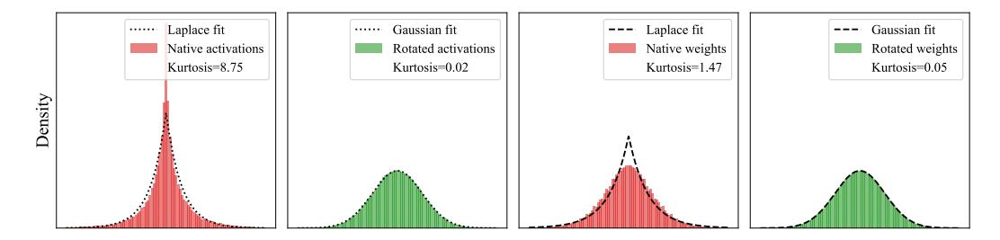
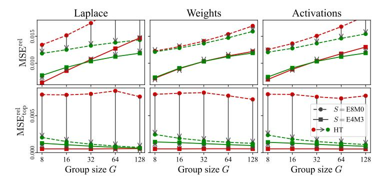
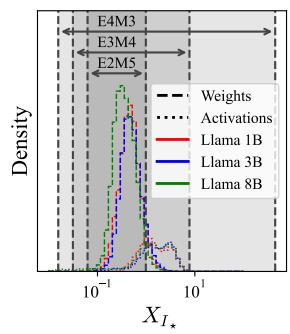

# 3 A QUANTIZATION ERROR ANALYSIS OF NVFP4 AND MXFP4

Prior work on quantization [\[41;](#page-13-0) [13;](#page-11-6) [16\]](#page-11-9) identified the average and top-element (outlier) mean-square error (MSE) as key quantities that can predict quantized model accuracy. In this section, we perform a model-based analysis of the NVFP4 and MXFP4 formats from the prism of these metrics.

Figure 2: Distribution fits for aggregate weights and activations of Llama-3.1-8B-Instruct, with and without rotations. The Normal distribution is clearly a good fit for rotated weights and activations, while the Laplace distribution provides a good fit for the native distributions. Although native weights appear Normal, they have much heavier tails, as evidenced by the Kurtosis value.

**Modeling Distributions.** Early work on modeling LLM parameters assumed a Normal (Gaussian) distribution [14], consistent with common initialization schemes. Yet, more recent studies have identified that distributions with high kurtosis, such as the Laplace or Student-t distributions, better model the sharp peaks and outlier-prone tails of weights and activations [2; 17].

Here, we follow the latter line of work and model weights and activations as following a Laplace distribution. At the same time, interestingly, it can be proven that, *after the Hadamard rotation*, these tensors tend to follow a *normal* distribution [6; 50]. We empirically validate these findings via fits over common models, illustrated in Figure 2. Formally, our modeling is as follows:

**Definition 1** (Modeling). We assume that the "native" weights and activations follow the Laplace distribution  $W \sim \text{Laplace}(0,b)$  with density  $f_W(w) = \frac{1}{2b}e^{-|w|/b}$ , and variance  $\text{Var}(W) = 2b^2$ . We fix unit variance throughout, so  $b = 1/\sqrt{2}$ . The magnitude Z = |W| is  $\text{Exp}(\lambda)$  with rate  $\lambda = 1/b = \sqrt{2}$ , that is  $f_Z(z) = \lambda e^{-\lambda z}$  and  $F_Z(z) = 1 - e^{-\lambda z}$  for  $z \geq 0$ .

We assume that weights and activations rotated via the Hadamard transform follow a Normal distribution  $V \sim \mathcal{N}(0,1)$ . The magnitude Z = |V| is half-normal with  $f_Z(z) = \sqrt{\frac{2}{\pi}} e^{-z^2/2}$  and  $F_Z(z) = \operatorname{erf}(z/\sqrt{2}), z \geq 0$ , where where  $\operatorname{erf}(z)$  is the standard Gauss error function  $\frac{2}{\sqrt{\pi}} \int_0^z e^{-t^2} dt$ .

**Quantization.** We model Microscaling Block Floating-Point (MFP) quantization as follows. Consider i.i.d. blocks containing  $G \geq 2$  elements drawn from some distribution:  $X = (X_1, \ldots, X_G)$  with  $\mathrm{Var}(X_i) = 1$  and  $Z_i = |X_i|$ . We assume a grid  $\mathcal{Q} \subset [0,1]$  that is finite, symmetric around 0, and includes both 0 and 1; we write  $\mathcal{Q}^+ = \mathcal{Q} \cap [0,1]$  and  $q_{\min} = \min(\mathcal{Q}^+ \setminus \{0\})$ . We use round-tonearest (RTN) quantization, assuming probability 0 for rounding ties. Next, we formally define the scaling process. For simplicity, we will not *not* quantize the scale s itself, and assume that values are normalized to [-1,1]. We remove these assumptions in our numerical validation (Section 3.2).

**Definition 2** (Scales). For a block of elements X, we define the unquantized scale  $s := \max_{1 \le i \le G} |X_i|$ , the normalized entries  $U_i := X_i/s \in [-1,1]$ , the quantized normalized entries  $\widehat{U}_i := \operatorname{RTN}_{\mathcal{Q}}(U_i)$ , and the de-normalized quantized values  $\widehat{X}_i := s \widehat{U}_i$ .

**Definition 3** (Quantization Metrics). For a group size G, we define: (i) The per-element MSE:  $\mathrm{MSE}(G) \coloneqq \mathbb{E}[(X_1 - \widehat{X}_1)^2]$  (by symmetry, the choice of index can be arbitrary). (ii) The top-element MSE per block: Let  $I_\star = \arg\max_{1 \le i \le G} |X_i|$ , ignoring ties. Define  $\mathrm{MSE}_{\mathrm{top}}(G) \coloneqq \mathbb{E}\left[(X_{I_\star} - \widehat{X}_{I_\star})^2\right]$ . We always use the same MFP map, i.e. same scale s, for both metrics.

**Remark 1** (Quantization Dead-zone). The first positive quantization level in the grid Q, which we denote by  $q_{\min}$ , induces the dead-zone half-width  $\delta \coloneqq q_{\min}/2$  on [0,1]. If  $|U_i| < \delta$ , then  $\widehat{U}_i = 0$ .

### 3.1 ANALYTICAL MSE BOUNDS

Next, we derive bounds on quantization error across top and average elements. First, notice that, in a simplified setting, applying the Hadamard rotation spreads the MSE evenly among elements.

**Lemma 1** (Top-Element MSE). Assume a vector  $x \in \mathbb{R}^G$  with coordinates i.i.d.  $\mathcal{N}(0,1)$ , to which we apply a Hadamard rotation, perform MFP quantization in the y-domain to produce  $\hat{y}$ , and reconstruct

Figure 3: The effect of Hadamard Transform (HT) on MXFP4 (E8M0) Figure 4: Ranges of FP8 and NVFP4 (E4M3) quantization on Laplace distribution samples and scale format and observed Llama-3.1-8B-Instruct weights and activations for various group sizes. weight and activation mag-

 $\widehat{x} = \frac{1}{\sqrt{G}} H^{\top} \widehat{y}$ . Define the quantization error vectors  $\varepsilon_y = \widehat{y} - y$  and  $\varepsilon_x = \widehat{x} - x = \frac{1}{\sqrt{G}} H^{\top} \varepsilon_y$ . The expected squared error on the original top coordinate  $I_{\star} = \arg \max_i |x_i|$  is the per-element MSE:

$$\mathrm{MSE}_{\mathrm{top}}(G) = \mathbb{E}[(\varepsilon_x)_{I_{\star}}^2] = \frac{1}{G} \mathbb{E} \|\varepsilon_y\|_2^2 = \mathrm{MSE}(G).$$

**Remark 2** (Outlier preservation). By contrast, it is immediate that  $MSE_{top}(G) = 0$  in the absence of the Hadamard rotation, since we are doing absmax scaling, which preserves the top element.

**Asymptotic MSE Analysis.** Thus, MSE is the key quantity we want to analyze. First, notice that, for any fixed grid with dead zone  $\delta > 0$ , for both Laplace and Normal models,  $\lim_{G \to \infty} MSE(G) =$  $\operatorname{Var}(X_1) = 1$ . Intuitively, this is because, as G grows, the block maximum M diverges, so  $|U_1| = |X_1|/M \to 0$  in probability; the mass that survives the dead-zone vanishes. Consequently, the dominant part of the MSE  $\mathbb{E}[(X_1 - \widehat{X}_1)^2]$  becomes  $\mathbb{E}[X_1^2 \mathbf{1}\{|U_1| < \delta\}] \to \mathbb{E}[X_1^2] = 1$ .

To get a more granular variant, we assume the large G domain and examine the "preserved mass":

$$\mathcal{R}(G) := 1 - \text{MSE}(G) = \mathbb{E}\left[X_1^2 \mathbf{1}\{|U_1| \ge \delta\}\right],$$

which captures the mass that *escapes* underflow. A precise calculation yields the following:

**Lemma 2** (Rates). Let  $\delta = q_{\min}/2 \in (0, \frac{1}{2})$  be the dead-zone halfwidth in the normalized domain.

For Laplace, we have: 
$$\mathcal{R}_L(G) = \Theta \left( (\log G)^2 G^{-\delta} \right)$$
, and for Normal:  $\mathcal{R}_N(G) = \Theta \left( \sqrt{\log G} \, G^{-\delta^2} \right)$ .

**Discussion.** Since  $0 < \delta^2 < \delta < 1$ , we have that, for small G, the Laplace MSE should be below the MSE for the Normal distribution. Yet, for sufficiently large G, the Normal rate dominates the Laplace rate, meaning that  $MSE_N(G) < MSE_L(G)$ . As such, we predict a *crossover* phenomenon, where the MSE gap in favor of the (native) Laplace distribution will be *inverted* for larger group size G in favor of the transformed Normal distribution. In short, transforms should hurt the original weights at small group sizes, and become effective as we increase it.

#### NUMERICAL VALIDATION

Relative Errors. In practice, the weight and activation distributions are not of unit variance. Shared scales give us control over the variance during the quantization process, but the aggregation of the proposed quadratic errors will be dominated by groups with higher variance. To address this, when analyzing real weights and activations, we use the relative version of the errors proposed above.

**Definition 4** (Relative Metrics). Let  $I_{\star} = \arg\max_{1 \leq i \leq G} |X_i|$  be the top group element. We define the relative per-element MSE as  $\mathrm{MSE}^{\mathrm{rel}}(G) \coloneqq \mathbb{E}[\sum_{i=1}^G (X_i - \widehat{X}_i)^2 / \sum_{i=1}^G X_i^2]$ , and the top-element MSE per block:  $\mathrm{MSE}^{\mathrm{rel}}_{\mathrm{top}}(G) := \mathbb{E}[(X_{I_{\star}} - \widehat{X}_{I_{\star}})^2/X_{I_{\star}}^2].$ 

MSErel is a key metric in compression theory [49]; in the context of LLM compression, Malinovskii et al. [39] to present a linear dependence between MSErel and end-to-end accuracy decline. Additionally, recent lattice-based PTQ methods explicitly optimize for MSErel when designing their lattice [50; 51; 39]. For  $\mathrm{MSE^{rel}_{top}}$ , Lemma 3 shows how it accurately reflects the outliers' relative error as long as outliers are large, rare, randomly positioned, and  $\mathrm{MSE^{rel}_{top}}$  is consistent for outliers and non-outliers (as shown by the shared scale quantization analysis below).

Figure 3 validates the analysis from Section 3.1 on samples from Laplace distribution, as well as on real weight and activation matrices from the Llama-3.1-8B-Instruct model. For  $MSE^{rel}$  (top row) and NVFP4 (G=16), the Hadamard Transform has a *negative effect* for small G and a *positive effect* for larger G, exactly as predicted. To interpret the other effects, we have to better understand the effect of the shared scales quantization.

**Shared Scales Quantization.** Under fixed bit-width, microscaling floating point formats with a shared scale (stored, e.g., in E8M0 or E4M3) trade range for accuracy. We begin our analysis by examining the range required to fully cover weights and activations.

Figure 4 shows the logarithmic dynamic ranges of several FP8 formats and compares them with the empirical distributions of shared scales for weights and activations across multiple models. One can see that the dynamic range of S = E4M3 covers the full range of these distributions. Trivially, S = E8M0, having more range, can easily cover it too. When shared scales range is less than the dynamic range of S, they can always be represented by normal floating-point values with their relative error (a) bounded by  $2^{-M}$  for mantissa precision M and (b) translation-invariant to power-of-two shifts. For absmax quantization without rotations, this leads to  $MSE_{top}^{rel}$ 's being insensitive to the shared scale magnitude in expectation over high dynamic range intervals, and, as the results, to G. We formalize this in Lemma 4.

This allows us to explain the effects of shared scale quantization on  $MSE_{top}^{rel}$  by relating it to the precision of the shared scales data type S and the base data type E. We observe the following:

(1) For MXFP4, top values inherit their precision from the base data type, and not the shared scale data type. This is because S = E8M0 is coarser than E = E2M1, leading to shared scales inheriting effectively constant relative error from E2M1 regardless of G, as visible in Figure 3. (2) By contrast, for NVFP4, shared scales inherit effectively constant relative error, regardless of G. This is because S = E4M3 is finer than E = E2M1, as visible in Figure 3. (3) Once the Hadamard Transform is applied, the maximum element error is spread across the whole group. This follows Lemma 1. From Figure 3, one can see that this leads to better precision than pure E2M1, but worse than pure E4M3. Moreover, one can see that for heavy-tailed distribution, such as Laplace or the observed model tensors,  $X_{I_*}^2$  grows faster than MSE(G) with G, leading to the error being reduced as we increase the group size G. Yet, this effect alone is not enough for it to improve over the E4M3 precision for reasonable group size G.

**Discussion.** Our analysis so far showed that the MXFP4 format induces higher MSE for RTN quantization relative to NVFP4, and is worse at outlier preservation. At the same time, the format has lower memory and computational costs relative to NVFP4, and is likely to benefit from normalization via the Hadamard transform. By contrast, the NVFP4 format has *lower MSE* due to the smaller group size, and *top value preservation* as it is "promoted" to E4M3. In addition, the NVFP4 MSE may not benefit from normalizing transforms. In the following, we incorporate our analysis into the classic GPTQ algorithm, obtaining a variant that is designed for FP4 formats, called MR-GPTQ.

### 4 MR-GPTQ: AN FP4-FOCUSED VARIANT OF THE GPTQ ALGORITHM

**Standard GPTQ.** Given a layer's weights W and calibration inputs X, GPTQ [21] aims to find quantized weights  $\widehat{W}$  that minimize the output reconstruction error:  $\|X\widehat{W} - XW\|_2^2$ . Assuming a fixed quantization grid, GPTQ builds upon the Optimal Brain Quantization (OBQ) framework [22] to iteratively quantize and update remaining weights to compensate for the error leveraging second-order information, while avoiding OBQ's high computational complexity. Specifically, while OBQ employs a dynamic, greedy weight selection strategy for selecting the next weight to quantize, GPTQ observes that this greedy approach offers low benefits over quantizing weights in an arbitrary, fixed order, for heavily-parameterized layers. Thus, GPTQ quantizes weights across *all rows* in the same fixed order. This enables it to share the Hessian information, used to compute error updates, among rows. GPTQ typically implements this fixed order by processing the dimensions sequentially, column-by-column (front-to-back). The inverse Hessian must be updated only once per column ( $d_{\rm col}$  times) rather than once per weight ( $d_{\rm row} \cdot d_{\rm col}$  times), which reduces the overall computational complexity from

 $O(d_{\text{row}} \cdot d_{\text{col}}^3)$  for OBQ, to  $O(\max{\{d_{\text{row}} \cdot d_{\text{col}}^2, d_{\text{col}}^3\}})$ , providing orders-of-magnitude speedup, for a weight matrix of size  $d_{\text{row}} \times d_{\text{col}}$ .

### 4.1 Adapting GPTQ to FP4 Formats

Our analysis showed that, with RTN quantization, NVFP4 provides lower MSE relative to MXFP4, due to better outlier preservation and smaller group size. GPTQ induces an orthogonal direction in the design space, relative to RTN, as it allows for MSE error to be "corrected" by shifting it to other weight blocks. This suggests three general solution strategies: (1) **GPTQ applied to the standard NVFP4 grid**, with absmax scaling, leveraging the natural properties of NVFP4. This simply extends RTN to GPTQ; (2) **MR-GPTQ-MXFP4**: GPTQ applied to the MXFP4 grid, on *rotated* weights and activations, as this reduces MSE for RTN; (3) **MR-GPTQ-NVFP4**: GPTQ on an *MSE-optimized* NVFP4 grid, with *rotated* weights and activations.

While the first two approaches follow naturally from our analysis, the third approach wagers that the higher per-group local MSE caused by applying Hadamard rotations to NVFP4 can be compensated by optimizing the scales, together with the GPTQ updates. As such, options 2 and 3 would offer a unified rotated/normalized format, that would apply to both NVFP4 and MXFP4. Next, we describe three key technical additions to the GPTQ algorithm that help bridge the gap between variants.

Ingredient 1: MSE-Optimized Grids. Our first step in MR-GPTQ is to identify a good initial grid. Recall that NVFP has both tensor (global) and per-group scales, which we denote by  $s_T$  and  $s_G$ , respectively. The quantized variant of the element  $X_i$  will be represented as  $\hat{X}_i = s_T \cdot s_G \cdot Q(X_i/(s_T \cdot s_G))$ , where Q is the quantization operation. To minimize error, we solve the following optimization problem for each tensor, across its groups:  $\min_{s_T,s_{G_1},\dots,s_{G_k}} \sum_i [\|\hat{X}_i - X_i\|_2^2]$ , where  $(s_{G_i})_{i=1,k}$  are the quantization scales for the k groups. We solve this by using alternating optimization over the block scales and the per-tensor scale, respectively. For NVFP4 without rotations, we have found this to yield consistent improvements. For MXFP4 with rotations, we have found that a single static value works stably across all layers, and we therefore use this approach in our implementation.

**Ingredient 2:** *Static* **Activation Reordering.** The original GPTQ algorithm heuristically re-orders the weight columns following the "dynamic act-order", i.e., a descending order of the corresponding Hessian diagonal entries. This matrix shuffle is applied before the quantization grid and scales are computed. While this consistently improves accuracy, it also requires re-shuffling the matrix columns dynamically at runtime, which results in a 10-20% end-to-end inference slow-down.

Instead, we observe that we can apply the activation re-ordering *statically*, i.e. *after* the scales and the quantization grid have been computed in the first step, based on the original (arbitrary) column order. In practice, we first fix the grid and scales for each group, shuffle the columns before GPTQ is applied, and then finally shuffle the columns back, maintaining the microscaling group structure of the original matrix. Importantly, this benefits from the improved behaviour during the quantization process itself, without any runtime penalties. This can be applied to GPTQ over any grid, and provides similar improvements to standard "dynamic" act-order, without the runtime overheads.

**Ingredient 3: Fused Online Rotations.** Our MR-GPTQ variants rotate the weights and activations via a block-wise Hadamard transform  $H_k$ , with  $k \times k$  diagonal blocks, where k is a power-of-two. Mathematically, for a linear layer with weights W and activations X, both quantized, the operation occurs as  $Q(WH_k)Q(XH_K)^T$ , where  $H_k$  is the block-wise rotation, and Q is the quantization function. In the next section, we describe how this format can be supported efficiently at runtime.

**MXFP scale fitting** Additionally, for MXFP in Appendix H we propose a simple scale-fitting modification, mapping the excessively large E8M0 range into data range that significantly improves performance of MXFP quantized models.

#### 4.2 GPU KERNEL SUPPORT FOR MR-GPTQ VIA QUTLASS

To support the methods described above, we introduce a set of kernels optimized for NVIDIA Blackwell GPUs. These kernels constitute QuTLASS v1.0, a high-performance library for low-precision deep learning quantization, building on NVIDIA CUTLASS [42]. QuTLASS provides full support for quantization- and matmul-related operations in both NVFP4 and MXFP4 micro-scaling formats. In addition, we release architecture-optimized implementations for different NVIDIA

Blackwell compute capabilities, namely SM100 [\[44\]](#page-13-11) and SM120 [\[46\]](#page-13-12). The kernels in QuTLASS can be grouped into two categories, which will handle the computation of Q(W Hk)Q(XHk) T :

- 1. Quantization-related kernels. While the product WHk is pre-fused in the weights, XHk occurs online. To avoid diminishing the benefits of FP4 hardware acceleration, QuTLASS provides lightweight fused kernels for online rotation. These kernels support "unimodal" k × k block diagonal matrices with k ∈ {16, 32, 64, 128}. For k < 256, dense transformations remain memory-bound, meaning that *any* rotation (not just Hadamards) can be applied at essentially the same cost, as the full matrix can be loaded at runtime (e.g., see Tables [13](#page-33-0) and [14\)](#page-34-0). To further reduce overhead, quantization and scale calculation are fused into the transformation kernel as a custom epilogue function. QuTLASS currently supports MSE and Abs-Max quantization methods, while its templatebased design allows new methods to be easily integrated.
- 2. Matmul-related narrow precision kernels. Between FP4 quantization and matrix multiplication, a hardware-mandated rearrangement of scaling factors is required [\[45\]](#page-13-13) for tcgen05.mma. QuT-LASS implements this step using a Triton kernel. For the matmul itself, QuTLASS supports multiple backends, including CUTLASS [\[42\]](#page-13-10) and FlashInfer [\[57\]](#page-14-1), enabling flexible plug-and-play backend selection depending on workload and hardware.

