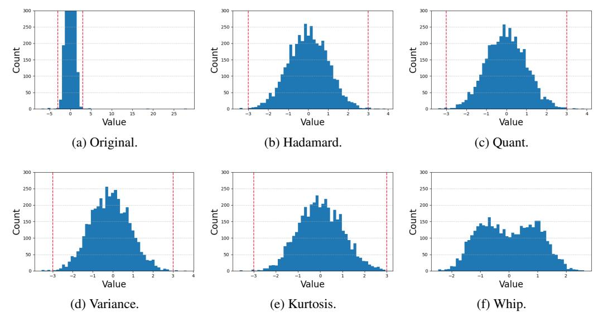

# Besides dense LLMs, we also extend our research to recent popular MoE-LLMs, and further experimental results can be found in the Appendix H.

Table 3 presents a comparison of the optimization time and memory consumption of SpinQuant, OSTQuant, and DartQuant on an A800 GPU server. DartQuant simplifies the calibration framework, leading to significant reductions in resource overhead across various models. In particular, for the 70B model, DartQuant completes the calibration in 30 minutes using a single GPU, achieving a speedup of  $47\times$  in training and  $10\times$  in memory savings compared to Spin-

Table 3: Comparison of Rotation Matrix Optimization Cost.

| Cost               | Method                                                          | 7B                               | 13B                               | 70B                                |
|--------------------|-----------------------------------------------------------------|----------------------------------|-----------------------------------|------------------------------------|
| Time (GPU hour) | SpinQuant OSTQuant DartQuant DartQuant 3090 | 0.30 0.30 0.14 0.43     | 0.70 0.80 0.23 0.70      | 42.90 44.00 0.91 2.90     |
| Memory (GiB)    | SpinQuant OSTQuant DartQuant DartQuant 3090 | 19.98 42.25 17.41 17.41 | 33.73 239.16 21.40 21.40 | 238.89 583.86 23.47 23.47 |

Quant and OSTQuant. Moreover, DartQuant is the first to optimize the rotation matrix of the 70B model on a single 3090 GPU, with a calibration time of  $\sim$ 3 hours. This development substantially reduces the cost of rotation matrix optimization and enhances its practical value.

#### 5.2 Ablation Studies

We compared the effectiveness of four optimization objectives: quantization loss, variance, kurtosis, and the Whip function. As shown in Figure 7a, the change in activation quantization loss over iteration steps is presented for each optimization objective. It is clearly observed that when using quantization loss, variance, or kurtosis as the optimization objective, the activation quantization loss shows minimal variation. However, when the Whip function is used as the optimization objective, the quantization loss curve decreases significantly within fewer iterations and converges rapidly.

Figure 6: Histograms of Activation Distributions After Rotation by Different Rotation Matrices. The region outside the red dashed line represents the outliers.

#### 5.2.1 Optimization objectives

By comparing the effects of different optimization objectives on the activation distribution (as shown in Figure [6\)](#page-8-0), we can clearly observe the substantial changes induced by the Whip function. Figure [6a](#page-8-1) shows the histogram of the original, unrotated activation distribution. From the range on the xaxis, it is evident that the original distribution contains significant outliers. Figure [6b](#page-8-2) displays the histogram of the activation distribution after a random Hadamard matrix rotation. After the Hadamard rotation, the activation range is notably compressed, although some outliers remain untreated. The rotation matrices trained with quantization loss and variance as optimization objectives show little improvement, resulting in an activation distribution nearly identical to that obtained by random Hadamard rotation. Although kurtosis optimization slightly improves the distribution, its effect is limited. In contrast, the histogram after Whip optimization shows a significant improvement (as shown in Figure [6f\)](#page-8-3): this method not only effectively addresses the outlier problem but also disperses the activation points, initially concentrated around zero, across other regions. The resulting distribution is the closest to a uniform distribution. This outcome aligns closely with our design goals and further validates the effectiveness of our approach. More ablation studies on different optimization objectives under zero-shot tasks and perplexity metrics are provided in Appendix [I.](#page-26-0)

#### 5.2.2 Optimizer Comparison

Figure [7b](#page-9-1) presents the comparison of the convergence curves between the Cayley optimization and our proposed QR-Orth optimization, both using Whip loss under identical settings. It is evident that QR-Orth demonstrates faster convergence and lower final loss, regardless of whether combined with SGD or Adam. As shown in Table [4,](#page-8-4) QR-Orth achieves a 1.4× speedup over Cayley optimization for the same number of iterations. Due to its faster convergence, QR SGD achieves the same result as Cayley SGD after 100 steps in just 6 steps, yielding an overall acceleration factor of 41×. This significantly improves the efficiency of orthogonal optimization.

Table 4: Comparison of Time Taken for 100 Iterations Across Different Orthogonal Optimization Schemes.

| Method | Cayley | QR-Orth | Speed up |
|--------|--------|---------|----------|
| SGD    | 8.2h   | 5.7h    | 1.44x    |
| Adam   | 8.1h   | 5.7h    | 1.42x    |

Figure 7: Comparison of activation quantization loss and convergence performance using different optimization methods.

#### 5.3 Results on Different Datasets

To investigate the sensitivity of DartQuant to different training datasets, we sample training data from three datasets: WIKITEXT2, PTB, and C4. These datasets are used to optimize R1 and R2 separately, and the impact of the dataset on the performance of the quantized LLM is compared. As shown in Table [5,](#page-9-2) the results of all three experiments are largely consistent. This demonstrates that DartQuant is robust to calibration datasets and does not negatively affect the generalization ability of the LLM. Further analysis on the impact of sample size on performance is provided in Appendix [D.](#page-21-0)

| Table 5: Comparison of LLM Performance with Different Calibration Datasets Using DartQuant. |  |  |
|---------------------------------------------------------------------------------------------|--|--|
|                                                                                             |  |  |

| Model | Dataset   | WikiText2 | PTB   | C4   | Avg   |
|-------|-----------|-----------|-------|------|-------|
|       | Baseline  | 5.47      | 37.91 | 7.26 | 16.88 |
| 2 7b  | WikiText2 | 5.92      | 42.63 | 7.99 | 18.85 |
|       | PTB       | 5.91      | 42.78 | 8.01 | 18.90 |
|       | C4        | 5.92      | 42.99 | 8.00 | 18.97 |
|       | Baseline  | 4.88      | 50.94 | 6.73 | 20.85 |
| 2 13b | WikiText2 | 5.25      | 58.29 | 7.3  | 23.61 |
|       | PTB       | 5.24      | 58.46 | 7.33 | 23.68 |
|       | C4        | 5.28      | 58.18 | 7.31 | 23.59 |

