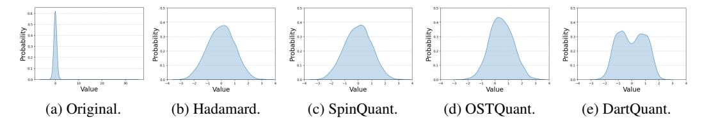
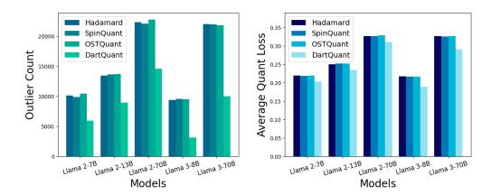
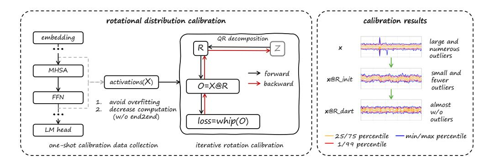

# DartQuant: Efficient Rotational Distribution Calibration for LLM Quantization

Yuantian Shao<sup>1,2\*</sup> Yuanteng Chen<sup>2,3,4\*</sup> Peisong Wang<sup>2,3†</sup> Jianlin Yu<sup>5</sup>
Jing Lin<sup>5</sup> Yiwu Yao<sup>5</sup> Zhihui Wei<sup>1</sup> Jian Cheng<sup>2,3</sup>

<sup>1</sup>Nanjing University of Science and Technology,

<sup>2</sup> C<sup>2</sup>DL, Institute of Automation, Chinese Academy of Sciences,

<sup>3</sup>School of Artificial Intelligence, University of Chinese Academy of Sciences,

<sup>4</sup>Zhongguancun Academy,

<sup>5</sup>Huawei Technologies Co., Ltd.

#### **Abstract**

Quantization plays a crucial role in accelerating the inference of large-scale models, and rotational matrices have been shown to effectively improve quantization performance by smoothing outliers. However, end-to-end fine-tuning of rotational optimization algorithms incurs high computational costs and is prone to overfitting. To address this challenge, we propose an efficient distribution-aware rotational calibration method, DartQuant, which reduces the complexity of rotational optimization by constraining the distribution of the activations after rotation. This approach also effectively reduces reliance on task-specific losses, thereby mitigating the risk of overfitting. Additionally, we introduce the QR-Orth optimization scheme, which replaces expensive alternating optimization with a more efficient solution. In a variety of model quantization experiments, DartQuant demonstrates superior performance. Compared to existing methods, it achieves 47× acceleration and 10× memory savings for rotational optimization on a 70B model. Furthermore, it is the first to successfully complete rotational calibration for a 70B model on a single 3090 GPU, making quantization of large language models feasible in resource-constrained environments. Code is available at https://github.com/CAS-CLab/DartQuant.git.

#### 1 Introduction

Large Language Models (LLMs) [1, 2, 3] have been a key breakthrough in natural language processing, demonstrating exceptional language understanding and generation capabilities through training on vast datasets with numerous parameters. These models perform exceptionally well on multiple tasks, including text generation, translation, and question-answering systems [4, 5]. However, the high computational and memory demands of LLM inference severely limit their deployment in resource-constrained environments [6, 7, 8, 9].

Current methods for reducing computational cost and improving the inference efficiency of deep learning models and LLMs include model pruning, knowledge distillation, parameter sharing, and quantization [10, 11, 12, 13, 14, 15]. Among these, post-training quantization (PTQ) stands out as a crucial technique to reduce computational costs due to its advantage of bypassing complex training processes, making it highly practical for real-world deployment [16, 17, 18, 19, 20].

<sup>\*</sup>Equal contribution.

<sup>&</sup>lt;sup>†</sup>Corresponding author.

In LLM quantization, activations pose a greater challenge than weights due to the frequent presence of extreme outliers, which can significantly degrade model accuracy [\[21\]](#page-11-4). To address this issue, various outlier-handling techniques have been proposed. For example, high-bit protection mechanisms preserve the precision of outliers, while diagonal matrices help smooth extreme values in activations [\[22,](#page-11-5) [23\]](#page-11-6). Recent studies have shown that rotation matrices and affine transformations are highly effective in reducing outliers in activations, significantly improving quantization performance [\[24\]](#page-11-7). Rotation matrices are invertible, preserve vector norms, and can be seamlessly integrated into model architectures without introducing additional inference costs, making them a mainstream approach for quantization [\[25\]](#page-11-8). Although random Hadamard rotations can improve performance to some extent, they are not optimal. SpinQuant demonstrates that training rotation matrices further enhances quantization performance [\[26\]](#page-11-9).

However, existing methods (e.g., SpinQuant [\[26\]](#page-11-9), OSTQuant [\[27\]](#page-11-10)) treat the rotation matrices as network parameters and fine-tune them endto-end, which incurs substantial computational and memory costs associated with quantization. As shown in Figure [1,](#page-1-0) optimizing the rotation matrices for a 70B model requires hundreds of GiB of GPU memory and tens of gpu hours of computation, which conflicts with the fast deployment goals of PTQ algorithms. Moreover, end-to-end fine-tuning of rotation matrices presents unique challenges due to the complexity of optimizing on the rotation manifold. Specifically, rotation matrices must be carefully optimized to preserve orthogonality, which necessitates the use of specialized techniques such as Cayley or Riemannian SGD [\[28,](#page-11-11) [29\]](#page-11-12). These

<span id="page-1-0"></span>

Figure 1: Comparison of computational costs across different rotation optimization methods.

methods are computationally intensive and incur significant time overhead. Additionally, using small sample sizes for end-to-end fine-tuning poses a substantial risk of overfitting [\[27\]](#page-11-10), which would worsen the optimization process.

To address these challenges, we propose DartQuant, a distribution-based rotation matrix calibration method that eliminates the need of end-to-end fine-tuning, significantly reducing the resource demands of rotation optimization while achieving higher accuracy. To mitigate overfitting, we redefine the rotation optimization problem from the perspective of distribution calibration, i.e., to transform the activations into the distribution most suitable for quantization. Based on the distribution transformation function that expands small value ranges and compresses large value ranges, we design the Whip loss. Unlike others that directly constrain outliers, Whip loss optimizes the activation distribution, making it more uniform and reducing the impact of outliers, thus lowering quantization errors. Finally, we introduce QR-Orth, an optimization method that applies orthogonal constraints using QR decomposition, avoiding complex projection calculations and significantly reducing the computational complexity of orthogonal optimization, thereby enhancing calibration efficiency.

Our contributions are summarized as follows:

- We introduce fast LLM Quantization with rotational distribution calibration framework, avoiding the excessive computational and memory costs of end-to-end fine-tuning paradigm. Based on this, the Whip loss is designed, which drives rotated activations toward a uniform distribution, effectively reducing quantization error and improving calibration efficiency.
- We present the QR-Orth optimization scheme, which ensures orthogonality of rotations via QR decomposition, eliminating the need for complex orthogonal optimizers. This reduces computational complexity and further enhances calibration efficiency.
- The proposed DartQaunt framework achieves superior quantization performance while significantly accelerating the rotation matrix calibration. For the 70B model, it delivers a 47× speedup in terms of GPU hours and reduces memory usage by 10× compared to existing methods. Notably, DartQuant enables rotation calibration of the 70B model on a single 3090 GPU in ∼3 hours, greatly reducing calibration costs.

#### 2 Related Work

#### 2.1 Challenges in LLM Quantization

Large language models (LLMs) face challenges in quantization due to activation outliers, which take up most of the quantization range and reduce accuracy. To address this, researchers have proposed various strategies. Early methods used mixed precision, applying different precisions to weights and activations to reduce errors. However, mixed precision methods are complex and hinder inference speed and memory efficiency.

#### 2.2 Outlier Handling through Scaling

To address outliers in activation quantization, scaling-based methods have been proposed. SmoothQuant [23] transfers outliers from activations to weights using scale invariance, reducing activation quantization errors. Outlier Suppression+ [21] addresses the asymmetric distribution of activations across channels by applying channel-wise scaling and shifting. OmniQuant [19] introduces learnable weight clipping and fine-tunes quantization errors using blockwise error minimization. Although scaling methods reduce outliers in activations, they often shift the quantization difficulty to weights. This does not fully solve the problem, especially in the presence of extreme outliers [30]. Efficiently handling outliers without complicating weight quantization remains a key challenge.

#### 2.3 Outlier Handling through Rotation

Recent research shows that rotation matrices offer unique advantages in handling outliers in activation quantization. QuIP [31] first introduces incoherent processing to reduce the impact of outliers in both the weight and activation spaces. QuIP# [32] further improves speed by using randomized Hadamard transforms, which also have better theoretical properties. Building on this, QuaRot [25] combines the outlier suppression ability of rotation matrices with invariance transformations, applying it to large models like LLaMA, significantly improving PTQ performance. QuaRot also finds that Hadamard transforms outperform random orthogonal transformations in quantization. SpinQuant [26] extends the rotation matrix as a trainable parameter and employs the Cayley optimizer [28] for end-to-end fine-tuning. QServe [27] combines rotation and scaling techniques, using random Hadamard transforms and scaling methods to suppress outliers across different modules, enhancing performance under low-bit quantization. Further, OSTQuant [27] treats both rotation and scaling as trainable parameters and employs a KL-top loss for end-to-end fine-tuning, achieving better quantization accuracy.

Existing end-to-end fine-tuning methods for optimizing rotation matrices, while relatively simple to implement, typically incur significant optimization costs and are prone to overfitting. These methods also require high-quality calibration samples. Furthermore, the orthogonal optimizers used during optimization are computationally expensive, as they need to perform optimization on complex manifolds, adding additional challenges. In contrast, DartQuant significantly improves the efficiency of rotation matrix calibration. While maintaining comparable accuracy, it achieves a calibration speed that is more than  $47 \times$  faster than existing methods.

<span id="page-2-1"></span><span id="page-2-0"></span>

Figure 2: Effects of different transformations on activation distribution.

#### 3 Preliminaries and Difficulty

The Transformer architecture, commonly used in large language models (LLMs), consists of multihead self-attention modules and feedforward network modules, both primarily composed of linear layers. Let the output of a linear layer be represented as  $Y = XW^{\top}$ , where  $X \in \mathbb{R}^{T \times C_{\text{in}}}$  denotes the input activation, and  $W \in \mathbb{R}^{C_{\text{out}} \times C_{\text{in}}}$  represents the weight matrix. Based on rotational invariance, we can insert an orthogonal transformation R into the linear layer without altering the output, yielding

<span id="page-3-2"></span><span id="page-3-0"></span>

(a) The number of outliers. (b) Quantization error.

<span id="page-3-1"></span>

Figure 3: Effects of different transformations on 1000 activations in layer 20 for various models. The rotation matrix optimized by DartQuant achieves the lowest number of outliers and the smallest quantization error.

Table 1: Impact of overfitting: Calibration on different data distribution on LLaMA models.

| Model | Datasets | WiKi | PTB   | C4   |
|-------|----------|------|-------|------|
| 2 7b  | Baseline | 5.47 | 37.91 | 7.26 |
|       | WiKi     | 5.94 | 45.13 | 8.13 |
|       | PTB      | 6.02 | 38.24 | 8.13 |
|       | C4       | 6.05 | 44.99 | 8.02 |
|       | Baseline | 4.88 | 50.94 | 6.73 |
| 2 13b | WiKi     | 5.21 | 58.39 | 7.40 |
| 2 130 | PTB      | 5.33 | 49.14 | 7.41 |
|       | C4       | 5.33 | 60.59 | 7.32 |

 $Y = (XR)(R^{\top}W^{\top})$ , where  $R \in \mathbb{R}^{C_{\text{in}} \times C_{\text{in}}}$  is an orthogonal matrix satisfying  $RR^{\top} = I$ . By combining R with the previous weight matrix and  $R^{\top}$  with the current layer's weight matrix, we can rotate the activation vector without introducing any additional computational cost.

Similarly, under the condition that the model's output remains unchanged, we can insert four orthogonal matrices  $R_1, R_2, R_3, R_4$  within the Transformer block, as outlined in [26] and Appendix A. Specifically, by multiplying  $R_1$  on the right side of  $W_q, W_k, W_v, W_{\text{up}}, W_{\text{gate}}$ , and multiplying  $R_1^{\top}$ on the left side of  $W_{\text{out}}$  and  $W_{\text{down}}$ , an equivalent transformation is achieved. Similarly,  $R_2$  can be inserted between  $W_v$  and  $W_{out}$ .  $R_3$  can be inserted between the rotated encodings of Q and K.  $R_4$ can be inserted before  $W_{\text{down}}$ . Finally,  $W_{\text{embedding}}$  is multiplied on the left by  $R_1^T$ , and  $W_{\text{lm\_head}}$  is multiplied on the right by  $R_1$ , completing all the equivalent transformations. This process is referred to as the "Computational Invariance" [33].

QuaRot [25] demonstrates that using random Hadamard rotation can achieve good results; however, this is not optimal, as shown in Figure 2. Methods like SpinQuant [26] and OSTQuant [27] treat the rotation matrix R as learnable network parameters and fine-tune them in an end-to-end manner with pseudo-quantizers inserted, resulting in better quantization performance. Although end-to-end fine-tuning is simple to implement, the complex computational process faces resource challenges and optimization difficulties. In Figure 3a, we present the number of outliers among 1000 activations in the 20th layer of various models after different transformations. Figure 3b shows the average quantization error of these samples (statistics for activations from other layers are in Appendix F). It is evident that the transformations in end-to-end fine-tuning do not significantly reduce the number of outliers in the activations, nor do they notably lower the quantization error, highlighting the limitations of end-to-end fine-tuning.

Moreover, end-to-end fine-tuning based on calibration sets not only consumes considerable computational resources but also tends to lead to overfitting on the calibration set [34, 27]. As shown in Table 1, fine-tuning methods exhibit a significant performance improvement on the corresponding test sets, with the improvement being particularly pronounced on the PTB dataset. A possible explanation is that the limited and relatively simple calibration data often fail to fully cover the parameter space of large models, causing the model to overfit to a narrow feature distribution, thereby limiting its generalization and emergent capabilities [27].

In addition, optimizing the rotation matrix requires the use of orthogonal optimizers to ensure the matrix's orthogonality. These optimizers are based on Riemannian optimization on the Grassmanian or Stiefel manifold, involving complex projection computations [28, 29]. As a result, their computational time is approximately twice that of standard optimizers. This, in turn, further increases the cost of rotation optimization and slows down the optimization process.

### Method

In this section, we provide a detailed description of the proposed DartQuant method. DartQuant is comprised of three key components: the rotational distribution calibration, the Whip loss function, and QR-Orth optimization. Each of these components addresses the primary challenges outlined earlier. Figure 4 illustrates the overall framework, highlighting the flow and interactions between these components.

<span id="page-4-0"></span>

Figure 4: Left: The DartQuant implementation process, with Z representing the latent parameters in QR-orth and R as the applied rotation matrix. Right: The change in rotation matrix before and after calibration.

#### 4.1 Rotational Distribution Calibration

End-to-end fine-tuning typically requires more data, and the optimization of rotation matrices depends on the task-specific loss, which significantly increases the risk of overfitting. For LLMs, end-to-end fine-tuning also entails substantial computational and memory overheads. To address these challenges, we redefine the rotation optimization problem and propose a rotational distribution calibration.

Specifically, we revisit the optimization objective of the rotation matrix from the perspective of feature distribution transformation. We redefine the problem as finding a rotation matrix that transforms the activations into the distribution most suitable for quantization. This approach reduces the reliance on task-specific loss during calibration, thereby mitigating the risk of overfitting.

Previous studies have shown that outliers are the primary cause of activation quantization loss. Therefore, we constrain the activation distribution after rotation by minimizing the number of outliers in the transformed activations, i.e.

$$\min_{R} \sum_{i=1}^{c_{in}} \mathbb{I}(|(Rx)_{i}| > \tau)$$
 (1)

The function I(·) represents the indicator function, and τ is the threshold used to identify outliers. Although this problem cannot be directly solved using standard stochastic gradient descent, we can resort to approximation methods for calibration. In statistics, variance is commonly used to measure the dispersion of data; however, using variance as an optimization objective is not ideal. Due to the symmetric distribution of activations [\[34\]](#page-12-1), the variance of activations typically corresponds to a constant multiple of the activation vector's norm square. Furthermore, the norm-invariance property of the rotation matrix introduces significant challenges when directly optimizing using variance (as shown in Figure [7a\)](#page-9-0). In addition to variance, kurtosis is frequently used to measure the heaviness of the distribution's tails, making it a suitable alternative objective. However, since the rotated activations are already close to a Gaussian distribution with relatively few outliers, optimizing with kurtosis is slow (as shown in Figure [7a\)](#page-9-0). Therefore, there is an urgent need for a better optimization objective to constrain the activation distribution.

#### 4.2 Activation Uniformity via Whip Loss

To better reduce outliers, we propose a new optimization objective that constrains the activation distribution to approach a uniform distribution, thereby effectively reducing the number of outliers in the rotated activations.

As shown in Figure [2a](#page-2-1) and Appendix [G,](#page-25-1) the activation tokens exhibit a distribution near Laplace. Assuming that the activation tokens follow a Laplace distribution with mean µ = 0 and scale parameter b, the probability density function (PDF) is given by:

$$f(x) = \frac{1}{2b} \exp\left(-\frac{|x|}{b}\right). \tag{2}$$

<span id="page-5-0"></span>

Figure 5: Intuition behind the distribution transformation:  $U_X(x)$  transforms the Laplace distribution into a uniform distribution by flattening the peak and aggregating the outliers.

In statistics, cumulative distribution functions (CDFs) are often used to transform one distribution into another [35]. To convert  $x \sim Laplace(0,b)$  to a uniform distribution over the interval  $[-\tau,\tau]$ , the transformation function is the following:

$$U_X(x) = 2\tau \left[ \int_{-\infty}^x \frac{1}{2b} \exp(-\frac{|x|}{b}) dt - \frac{1}{2} \right]$$

$$= \begin{cases} \tau \left[ \exp(\frac{x}{b}) - 1 \right], & x \le 0, \\ \tau \left[ 1 - \exp(-\frac{x}{b}) \right], & x > 0. \end{cases}$$
(3)

As shown in Figure 5, the left side presents the function graph of  $U_X(x)$ , where the intervals near the origin are expanded, while those further from the center are compressed. The right side visually illustrates the impact of this transformation on the distribution.  $U_X(x)$  spreads values originally concentrated around the center over a wider range, thus smoothing the peak of the distribution. Meanwhile, outliers farther from the center are gathered together, shrinking the overall distribution range, ultimately resulting in a uniform distribution within the interval  $[-\tau, \tau]$ .

Inspired by the mechanism of  $U_X(x)$ , we propose the Whip loss function:

$$Whip = \sum_{i=1}^{c_{in}} \exp(-|x_i|). \tag{4}$$

Here,  $\boldsymbol{x} = [x_1, x_2, \dots, x_{C_{in}}] \in \mathbb{R}^{C_{in}}$  denotes the activation vector. Clearly, the Whip function is continuously differentiable, and has larger gradients near zero. When used as a loss function, smaller values in the rotated activation vector are pushed away from zero. In other words, the Whip function encourages the rotation to smooth the sharp central peak of the Laplace distribution, producing a more uniform distribution. As the magnitudes of several small-value channels in the activation vector increase, the outliers are suppressed due to the norm-invariance constraint. This results in an "aggregation" effect in the activation values. As a result, the overall activation distribution tends to converge toward a uniform distribution within a smaller interval, thereby effectively reducing the quantization error.

#### 4.3 Enforcing Orthogonality with QR-Orth

To satisfy the orthogonality constraint, the rotation matrix must be optimized on the Grassmannian or Stiefel manifold, which necessitates the use of specialized optimizers, such as the Cayley SGD [28] used in SpinQuant [26]. Unlike gradients in Euclidean space, gradients on manifolds require complex projection operations, resulting in significantly higher computational costs. To avoid the computational complexity of orthogonal optimizers, we propose the QR-Orth optimization method.

Specifically, we can obtain an orthogonal matrix  $R \in \mathbb{R}^{n \times n}$  and an upper triangular matrix  $U \in \mathbb{R}^{n \times n}$  by performing a QR decomposition on any matrix  $Z \in \mathbb{R}^{n \times n}$ . Based on this relationship, we design

the rotational distribution calibration method with QR-Orth optimizer shown in Algorithm 1. We use the orthogonal matrix R, obtained from the QR decomposition, as the rotation matrix for the actual computation. The latent parameter Z is treated as a optimization parameter and is discarded after calibration. By optimizing the latent matrix Z, we indirectly optimize the rotation matrix R. In this way, we can use any optimizer to optimize the rotation matrix.

When the matrix size becomes large, the Cayley optimizer introduces a computational overhead of approximately  $6n^3$  compared to standard optimizers. In contrast, QR-Orth only incurs the cost of the QR decomposition, with a computational complexity on the order of  $\frac{4}{3}n^3$  (see Appendix B for a detailed complexity deriva-

<span id="page-6-0"></span>**Algorithm 1** Rotational Distribution Calibration with QR-Orth Optimizer

```
    Input: LLM model LLM, calibration sequence S, initial latent parameter Z<sub>0</sub> ∈ ℝ<sup>n×n</sup>, max iterations T, learning rate η.
    Output: Rotational matrix R ∈ ℝ<sup>n×n</sup>.
    X ← LLM(S)
    X ← token_sampling(X)
    Z ← Z<sub>0</sub>
    for k = 0 to T do
    R ← qr_decomposition(Z)
    O ← X@R
    L ← Whip(O)
    Z ← Z - η ∂L/∂Z
    end for
```

tion). Although QR decomposition usually requires iterative calculations, the significant reduction in overall computational load has brought about a 1.4x acceleration effect. In practice, QR-Orth can easily integrate with various optimizers such as SGD or Adam, making it highly adaptable. This flexibility makes QR-Orth a promising solution for optimizing orthogonal matrices.

#### 5 Experiment

**Model and Dataset.** We evaluate our method on the Llama series models, including Llama-2 (7B/13B/70B) [1] and Llama-3 (8B/70B). Moreover, we also provide results on two popular MoE models: Mixtral-8x7B [36] and Deepseek-MoE [37]. We report perplexity (PPL) scores on the WikiText2 [38], C4 [39], and PTB [40]. Additionally, we assess model performance on nine zero-shot evaluation tasks, including LAMBADA [41], HellaSwag [42], PIQA [43], WinoGrande [44], OpenBookQA [45], SIQA [46], MMLU [47], ARC-E, and ARC-C [48].

**Baselines and Implementation Details.** In addition to the basic RTN method, we compare our approach with several other methods, including SmoothQuant [23], GPTQ [49], OmniQuant [19], and current state-of-the-art methods such as Quarot [25], SpinQuant [26] and OSTQuant [27] for weight and activation quantization.

In the main results, we apply GPTQ to reconstruct the weights. To do so, we use 128 samples from WikiText2, with a sequence length of 2048 tokens, as the calibration set for GPTQ, following the standard GPTQ setup. All activations are quantized using per-token asymmetric quantization. We optimize all orthogonal matrices using SGD combined with QR-Orth. During the orthogonal matrix calibration phase, we use 128 samples from WikiText2, each with a token length of 2048.

#### 5.1 Main Results

Table 2 evaluates six models across four common bit-width settings, offering practical guidance for selecting appropriate rotation schemes. DartQuant utilizes learned rotation matrices  $R_1$  and  $R_2$ , which can be fused into the model weights during inference, eliminating any additional computational overhead. In contrast, online Hadamard rotations ( $R_3$  and  $R_4$ ) leverage fast Hadamard kernels for efficient inference computation [32]. As shown in Table 2, when both weights and activations are quantized to 8 bits, the performance differences among methods are minimal. However, when weights are quantized to 4 bits and activations to 8 bits, methods like SmoothQuant and OmniQuant experience significant performance degradation. This is primarily due to SmoothQuant's design, which complicates weight quantization and increases quantization errors, leading to a substantial drop in performance. In contrast, other methods generally maintain the model accuracy.

Although rotation transformation methods improve quantization performance when activations are quantized to 8 bits, the additional computational cost associated with  $R_3$  and  $R_4$  makes this approach less efficient. When activations are quantized to 4 bits, omitting the rotation matrix results in a significant performance drop. Furthermore, DartQuant, SpinQuant, and OSTQuant, which optimize

<span id="page-7-0"></span>Table 2: Comparison of the average Perplexity Scores across three datasets and the average accuracy on nine Zero-shot Common Sense Reasoning tasks. The results for all comparison methods were obtained using their publicly available codebases. Full results can be found in the Appendix C.

| Bits     | Method        | Llam                     | a-2 7B                  | Llama           | a-2 13B                 | Llama           | -2 70B                  | Llam            | a-3 8B                  | Llama           | -3 70B                |
|----------|---------------|--------------------------|-------------------------|-----------------|-------------------------|-----------------|-------------------------|-----------------|-------------------------|-----------------|-----------------------|
| (W-A-KV) | Method        | $\mathrm{PPL}\downarrow$ | $0$ -shot $^9 \uparrow$ | $PPL\downarrow$ | $0$ -shot $^9 \uparrow$ | $PPL\downarrow$ | $0$ -shot $^9 \uparrow$ | $PPL\downarrow$ | $0$ -shot $^9 \uparrow$ | $PPL\downarrow$ | 0-shot <sup>9</sup> ↑ |
| 16-16-16 | FloatingPoint | 16.88                    | 61.16                   | 20.85           | 64.28                   | 11.09           | 69.53                   | 8.92            | 66.04                   | 6.19            | 72.70                 |
|          | RTN           | 18.15                    | 59.37                   | 21.77           | 62.49                   | 12.53           | 67.83                   | 10.35           | 62.97                   | 12.38           | 67.18                 |
|          | SmoothQuant   | 332.17                   | 30.97                   | 1510.66         | 29.89                   | 180.96          | 38.36                   | 112.46          | 31.94                   | 544.68          | 33.95                 |
|          | GPTQ          | 6977.62                  | 60.03                   | 20.76           | 63.70                   | 11.90           | 69.03                   | 10.27           | 64.79                   | 6.89            | 69.44                 |
| 4-8-16   | OmniQuant     | 426.53                   | 59.15                   | 20.74           | 62.95                   | 14.06           | 67.18                   | 10.48           | 62.72                   | 14.95           | 59.94                 |
|          | QuaRot        | 18.41                    | 59.92                   | 22.02           | 63.50                   | 11.15           | 69.09                   | 9.59            | 64.92                   | 6.92            | 70.75                 |
|          | SpinQuant     | 17.85                    | 60.10                   | 21.15           | 63.53                   | 11.29           | 69.57                   | 9.48            | 65.01                   | 6.63            | 71.76                 |
|          | DartQuant     | 17.69                    | 60.17                   | 20.93           | 63.77                   | 11.18           | 69.30                   | 9.49            | 65.58                   | 6.66            | 71.82                 |
|          | RTN           | 668.50                   | 31.39                   | 2523.84         | 29.61                   | 63311.10        | 29.12                   | 200.56          | 30.54                   | 17390.85        | 31.01                 |
|          | SmoothQuant   | 3278.95                  | 29.48                   | 4366.47         | 29.05                   | 1636.53         | 29.40                   | 2216.28         | 29.55                   | 6242.62         | 29.30                 |
|          | GPTQ          | 1529.13                  | 31.05                   | 1554.72         | 29.85                   | 68684.35        | 29.23                   | 270.49          | 33.47                   | 14201.63        | 32.53                 |
| 4-4-16   | OmniQuant     | 202.95                   | 40.18                   | 107.01          | 42.98                   | 109.27          | 41.08                   | 186.02          | 31.25                   | 380.94          | 28.37                 |
|          | QuaRot        | 20.63                    | 57.90                   | 24.11           | 61.81                   | 11.35           | 67.92                   | 11.74           | 58.20                   | 10.73           | 62.28                 |
|          | SpinQuant     | 19.90                    | 57.85                   | 22.88           | 62.32                   | 11.70           | 68.59                   | 10.67           | 62.29                   | 9.61            | 66.06                 |
|          | OSTQuant      | 19.24                    | 57.94                   | 22.33           | 62.38                   | 11.98           | 68.29                   | 10.66           | 62.18                   | 7.67            | 67.94                 |
|          | DartQuant     | 18.53                    | 58.05                   | 22.44           | 62.64                   | 11.51           | 69.02                   | 10.58           | 62.80                   | 7.99            | 69.39                 |
|          | RTN           | 853.68                   | 30.29                   | 2535.13         | 29.53                   | 63772.42        | 29.15                   | 353.44          | 30.54                   | 17803.40        | 30.41                 |
|          | GPTQ          | 1813.34                  | 29.97                   | 1929.93         | 29.53                   | 78362.25        | 29.15                   | 496.93          | 31.60                   | 17361.71        | 32.98                 |
| 4-4-4    | QuaRot        | 27.01                    | 57.03                   | 24.98           | 59.87                   | 11.49           | 67.41                   | 12.29           | 57.32                   | 11.38           | 61.50                 |
|          | SpinQuant     | 25.12                    | 57.55                   | 23.37           | 61.60                   | 11.76           | 68.05                   | 10.99           | 61.35                   | 10.17           | 64.76                 |
|          | OSTQuant      | 19.74                    | 57.88                   | 22.83           | 62.31                   | 11.67           | 68.11                   | 10.66           | 61.57                   | 7.76            | 67.84                 |
|          | DartQuant     | 19.14                    | 57.96                   | 22.64           | 62.46                   | 11.55           | 68.22                   | 10.78           | 62.38                   | 8.13            | 69.05                 |

rotation matrices, clearly demonstrate the necessity of rotation matrix optimization, outperforming QuaRot. Additionally, while SpinQuant and OSTQuant perform well in reducing perplexity, their performance in zero-shot tasks is poor, which highlights the potential overfitting risks associated with end-to-end fine-tuning methods. In contrast, DartQuant, with its novel calibration strategy, generates rotation matrices that effectively compress the activation distribution range, resulting in outstanding performance in 0-shot tasks. Notably, we achieve a performance loss of only 0.5% on Llama 2-70b under w4a4kv16 setting. For Llama 3-70b which is more difficult to quantize [50], we manage to limit the average performance loss to 3.31%, outperforming SpinQuant and OSTQuant by 3.33% and 1.45% respectively.

