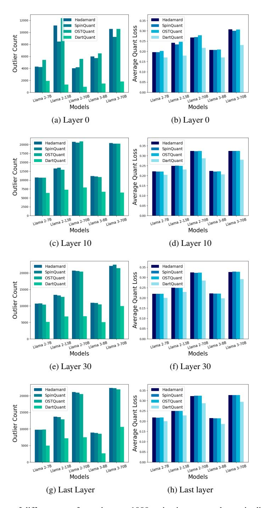

# E Comparison with Mixed Precision Quantization Methods

For a more comprehensive comparison, we selected two mixed precision quantization algorithms, QUIK [\[51\]](#page-13-1) and Atom [\[52\]](#page-13-2), and compared them with DartQuant under the 4-4-16 bit setting. It is important to note that, for a fair comparison, we preserved QUIK's feature of protecting the first 256 outlier channels, while quantizing the down projection to 4 bits to ensure consistency with our method. Atom was tested using its default settings. The specific experimental results are shown in Tables [17](#page-22-1) and [18.](#page-22-2)

Table 17: Comparison of accuracy with mixed precision quantization methods on zero-shot tasks.

| Model | Method    | WG    | SIQA  | PIQA  | OBQA  | LAMB  | HS    | ARC-E | ARC-C | MMLU  | AVG   |
|-------|-----------|-------|-------|-------|-------|-------|-------|-------|-------|-------|-------|
|       | QUIK      | 62.12 | 41.20 | 73.67 | 36.80 | 61.81 | 68.41 | 62.25 | 37.46 | 27.76 | 52.39 |
| 2-7b  | Atom      | 64.38 | 43.01 | 76.04 | 39.40 | 69.76 | 70.40 | 70.17 | 41.26 | 34.01 | 56.49 |
|       | DartQuant | 67.17 | 44.93 | 76.93 | 39.00 | 71.65 | 73.76 | 70.96 | 42.41 | 35.66 | 58.05 |
|       | QUIK      | 62.67 | 44.37 | 74.86 | 41.40 | 62.27 | 72.88 | 65.87 | 41.38 | 35.32 | 55.67 |
| 2-13b | Atom      | 69.04 | 45.26 | 77.94 | 43.60 | 73.94 | 75.81 | 72.62 | 45.44 | 45.07 | 60.97 |
|       | DartQuant | 71.11 | 46.16 | 79.27 | 44.20 | 75.18 | 78.04 | 75.38 | 47.61 | 46.80 | 62.64 |
|       | QUIK      | 68.67 | 44.22 | 77.58 | 42.80 | 64.12 | 74.32 | 68.98 | 46.42 | 46.53 | 59.29 |
| 2-70b | Atom      | 75.29 | 46.27 | 81.12 | 45.73 | 76.44 | 79.98 | 79.18 | 54.88 | 59.30 | 66.47 |
|       | DartQuant | 77.58 | 48.52 | 82.70 | 48.20 | 79.99 | 82.62 | 81.93 | 57.00 | 62.60 | 69.02 |
|       | QUIK      | 59.59 | 39.00 | 65.78 | 35.00 | 42.81 | 58.45 | 52.53 | 34.98 | 29.01 | 46.35 |
| 3-8b  | Atom      | 68.67 | 43.06 | 76.88 | 42.00 | 70.41 | 73.26 | 72.36 | 46.35 | 53.28 | 60.70 |
|       | DartQuant | 70.96 | 45.34 | 79.16 | 43.40 | 72.39 | 75.81 | 74.45 | 48.21 | 55.46 | 62.80 |
|       | QUIK      | 56.83 | 40.94 | 71.33 | 34.80 | 55.07 | 70.11 | 62.16 | 38.82 | 31.87 | 51.33 |
| 3-70b | Atom      | 74.16 | 44.98 | 78.61 | 45.54 | 72.17 | 76.88 | 74.23 | 51.78 | 61.62 | 64.44 |
|       | DartQuant | 77.27 | 47.54 | 83.08 | 48.00 | 76.44 | 83.61 | 81.57 | 58.02 | 68.96 | 69.39 |

Table 18: Comparison of perplexity with mixed precision quantization methods on the WikiText2, PTB, and C4 datasets.

| Model | Method    | WIKI  | PTB   | C4    | AVG   |
|-------|-----------|-------|-------|-------|-------|
|       | QUIK      | 8.05  | 51.97 | 10.12 | 23.38 |
| 2-7b  | Atom      | 6.03  | 46.77 | 8.25  | 20.35 |
|       | DartQuant | 5.88  | 41.72 | 7.99  | 18.53 |
|       | QUIK      | 7.29  | 65.72 | 9.23  | 27.41 |
| 2-13b | Atom      | 5.26  | 52.95 | 7.33  | 21.85 |
|       | DartQuant | 5.22  | 54.82 | 7.28  | 22.44 |
|       | QUIK      | 6.36  | 35.28 | 8.77  | 16.80 |
| 2-70b | Atom      | 3.68  | 28.21 | 6.05  | 12.65 |
|       | DartQuant | 3.64  | 24.90 | 5.99  | 11.51 |
|       | QUIK      | 18.01 | 37.42 | 14.72 | 23.38 |
| 3-8b  | Atom      | 7.57  | 16.67 | 13.28 | 12.50 |
|       | DartQuant | 7.32  | 12.51 | 11.81 | 10.58 |
|       | QUIK      | 10.32 | 21.48 | 17.24 | 16.35 |
| 3-70b | Atom      | 5.23  | 13.00 | 11.48 | 9.90  |
|       | DartQuant | 4.83  | 9.80  | 9.35  | 7.99  |

Even though DartQuant strictly quantizes all activations and weights to 4 bits (resulting in a lower average bit-width compared to QUIK and Atom), it still achieves accuracy improvements on most datasets. This underscores the effectiveness of our method.

Figure 10: Impact of different transformations on 1000 activations across layers in different models.

Figure 11: Activation distribution histograms for different layers of various models. The x-axis represents activation values, while the y-axis denotes the channel count.

