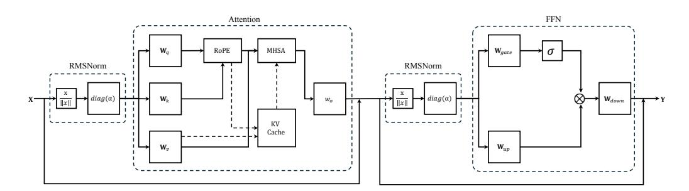
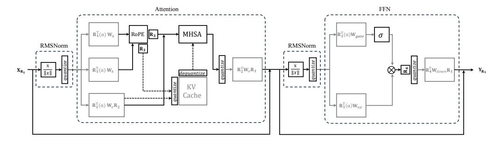

# References

- <span id="page-10-0"></span>[1] Hugo Touvron, Thibaut Lavril, Gautier Izacard, Xavier Martinet, Marie-Anne Lachaux, Timothée Lacroix, Baptiste Rozière, Naman Goyal, Eric Hambro, Faisal Azhar, et al. Llama: Open and efficient foundation language models. *arXiv preprint arXiv:2302.13971*, 2023.
- <span id="page-10-1"></span>[2] Susan Zhang, Stephen Roller, Naman Goyal, Mikel Artetxe, Moya Chen, Shuohui Chen, Christopher Dewan, Mona Diab, Xian Li, Xi Victoria Lin, et al. Opt: Open pre-trained transformer language models. *arXiv preprint arXiv:2205.01068*, 2022.
- <span id="page-10-2"></span>[3] Zhengxiao Du, Yujie Qian, Xiao Liu, Ming Ding, Jiezhong Qiu, Zhilin Yang, and Jie Tang. Glm: General language model pretraining with autoregressive blank infilling. *arXiv preprint arXiv:2103.10360*, 2021.
- <span id="page-10-3"></span>[4] Jacob Devlin Ming-Wei Chang Kenton and Lee Kristina Toutanova. Bert: Pre-training of deep bidirectional transformers for language understanding. In *Proceedings of naacL-HLT*, volume 1, page 2. Minneapolis, Minnesota, 2019.
- <span id="page-10-4"></span>[5] Alec Radford, Jong Wook Kim, Chris Hallacy, Aditya Ramesh, Gabriel Goh, Sandhini Agarwal, Girish Sastry, Amanda Askell, Pamela Mishkin, Jack Clark, et al. Learning transferable visual models from natural language supervision. In *International conference on machine learning*, pages 8748–8763. PMLR, 2021.
- <span id="page-10-5"></span>[6] Tom B Brown. Language models are few-shot learners. *arXiv preprint arXiv:2005.14165*, 2020.
- <span id="page-10-6"></span>[7] Zhilin Yang. Xlnet: Generalized autoregressive pretraining for language understanding. *arXiv preprint arXiv:1906.08237*, 2019.
- <span id="page-10-7"></span>[8] Tim Dettmers, Mike Lewis, Younes Belkada, and Luke Zettlemoyer. Gpt3. int8 (): 8-bit matrix multiplication for transformers at scale. *Advances in Neural Information Processing Systems*, 35:30318–30332, 2022.
- <span id="page-10-8"></span>[9] Yuanteng Chen, Yuantian Shao, Peisong Wang, and Jian Cheng. EAC-MoE: Expert-selection aware compressor for mixture-of-experts large language models. In *Proceedings of the 63rd Annual Meeting of the Association for Computational Linguistics (Volume 1: Long Papers)*, pages 12942–12963, July 2025.
- <span id="page-10-9"></span>[10] Geoffrey Hinton. Distilling the knowledge in a neural network. *arXiv preprint arXiv:1503.02531*, 2015.
- <span id="page-10-10"></span>[11] Song Han, Huizi Mao, and William J Dally. Deep compression: Compressing deep neural networks with pruning, trained quantization and huffman coding. *arXiv preprint arXiv:1510.00149*, 2015.
- <span id="page-10-11"></span>[12] Xinyin Ma, Gongfan Fang, and Xinchao Wang. Llm-pruner: On the structural pruning of large language models. *Advances in neural information processing systems*, 36:21702–21720, 2023.
- <span id="page-10-12"></span>[13] Wei Huang, Xingyu Zheng, Xudong Ma, Haotong Qin, Chengtao Lv, Hong Chen, Jie Luo, Xiaojuan Qi, Xianglong Liu, and Michele Magno. An empirical study of llama3 quantization: From llms to mllms. *Visual Intelligence*, 2(1):36, 2024.
- <span id="page-10-13"></span>[14] Peisong Wang, Qinghao Hu, Yifan Zhang, Chunjie Zhang, Yang Liu, and Jian Cheng. Two-step quantization for low-bit neural networks. In *Proceedings of the IEEE Conference on computer vision and pattern recognition*, pages 4376–4384, 2018.
- <span id="page-10-14"></span>[15] Weihan Chen, Peisong Wang, and Jian Cheng. Towards mixed-precision quantization of neural networks via constrained optimization. In *Proceedings of the IEEE/CVF International Conference on Computer Vision*, pages 5350–5359, 2021.
- <span id="page-10-15"></span>[16] Peisong Wang, Qiang Chen, Xiangyu He, and Jian Cheng. Towards accurate post-training network quantization via bit-split and stitching. In *International Conference on Machine Learning*, pages 9847–9856. PMLR, 2020.

- <span id="page-11-0"></span>[17] Peisong Wang, Weihan Chen, Xiangyu He, Qiang Chen, Qingshan Liu, and Jian Cheng. Optimization-based post-training quantization with bit-split and stitching. *IEEE Transactions on Pattern Analysis and Machine Intelligence*, 45(2):2119–2135, 2022.
- <span id="page-11-1"></span>[18] Benoit Jacob, Skirmantas Kligys, Bo Chen, Menglong Zhu, Matthew Tang, Andrew Howard, Hartwig Adam, and Dmitry Kalenichenko. Quantization and training of neural networks for efficient integer-arithmetic-only inference. In *Proceedings of the IEEE conference on computer vision and pattern recognition*, pages 2704–2713, 2018.
- <span id="page-11-2"></span>[19] Wenqi Shao, Mengzhao Chen, Zhaoyang Zhang, Peng Xu, Lirui Zhao, Zhiqian Li, Kaipeng Zhang, Peng Gao, Yu Qiao, and Ping Luo. Omniquant: Omnidirectionally calibrated quantization for large language models. *arXiv preprint arXiv:2308.13137*, 2023.
- <span id="page-11-3"></span>[20] Chen Tianqi, Yuanteng Chen, Weixiang Xu, Zeyu Zhu, Peisong Wang, and Jian Cheng. Qmamba: Towards more efficient mamba models via post-training quantization, 2025.
- <span id="page-11-4"></span>[21] Xiuying Wei, Yunchen Zhang, Yuhang Li, Xiangguo Zhang, Ruihao Gong, Jinyang Guo, and Xianglong Liu. Outlier suppression+: Accurate quantization of large language models by equivalent and optimal shifting and scaling. *arXiv preprint arXiv:2304.09145*, 2023.
- <span id="page-11-5"></span>[22] Changhun Lee, Jungyu Jin, Taesu Kim, Hyungjun Kim, and Eunhyeok Park. Owq: Outlieraware weight quantization for efficient fine-tuning and inference of large language models. In *Proceedings of the AAAI Conference on Artificial Intelligence*, volume 38, pages 13355–13364, 2024.
- <span id="page-11-6"></span>[23] Guangxuan Xiao, Ji Lin, Mickael Seznec, Hao Wu, Julien Demouth, and Song Han. Smoothquant: Accurate and efficient post-training quantization for large language models. In *International Conference on Machine Learning*, pages 38087–38099. PMLR, 2023.
- <span id="page-11-7"></span>[24] Yuexiao Ma, Huixia Li, Xiawu Zheng, Feng Ling, Xuefeng Xiao, Rui Wang, Shilei Wen, Fei Chao, and Rongrong Ji. Affinequant: Affine transformation quantization for large language models. In *The Twelfth International Conference on Learning Representations*, 2024.
- <span id="page-11-8"></span>[25] Saleh Ashkboos, Amirkeivan Mohtashami, Maximilian L Croci, Bo Li, Pashmina Cameron, Martin Jaggi, Dan Alistarh, Torsten Hoefler, and James Hensman. Quarot: Outlier-free 4-bit inference in rotated llms. *arXiv preprint arXiv:2404.00456*, 2024.
- <span id="page-11-9"></span>[26] Zechun Liu, Changsheng Zhao, Igor Fedorov, Bilge Soran, Dhruv Choudhary, Raghuraman Krishnamoorthi, Vikas Chandra, Yuandong Tian, and Tijmen Blankevoort. Spinquant–llm quantization with learned rotations. *arXiv preprint arXiv:2405.16406*, 2024.
- <span id="page-11-10"></span>[27] Xing Hu, Yuan Cheng, Dawei Yang, Zhixuan Chen, Zukang Xu, JiangyongYu, XUCHEN, Zhihang Yuan, Zhe jiang, and Sifan Zhou. OSTQuant: Refining large language model quantization with orthogonal and scaling transformations for better distribution fitting. In *The Thirteenth International Conference on Learning Representations*, 2025.
- <span id="page-11-11"></span>[28] Jun Li, Li Fuxin, and Sinisa Todorovic. Efficient riemannian optimization on the stiefel manifold via the cayley transform. *arXiv preprint arXiv:2002.01113*, 2020.
- <span id="page-11-12"></span>[29] Gary Bécigneul and Octavian-Eugen Ganea. Riemannian adaptive optimization methods. *arXiv preprint arXiv:1810.00760*, 2018.
- <span id="page-11-13"></span>[30] Haokun Lin, Haobo Xu, Yichen Wu, Jingzhi Cui, Yingtao Zhang, Linzhan Mou, Linqi Song, Zhenan Sun, and Ying Wei. Duquant: Distributing outliers via dual transformation makes stronger quantized llms. *arXiv preprint arXiv:2406.01721*, 2024.
- <span id="page-11-14"></span>[31] Jerry Chee, Yaohui Cai, Volodymyr Kuleshov, and Christopher M De Sa. Quip: 2-bit quantization of large language models with guarantees. *Advances in Neural Information Processing Systems*, 36, 2024.
- <span id="page-11-15"></span>[32] Albert Tseng, Jerry Chee, Qingyao Sun, Volodymyr Kuleshov, and Christopher De Sa. Quip#: Even better llm quantization with hadamard incoherence and lattice codebooks. *arXiv preprint arXiv:2402.04396*, 2024.

- <span id="page-12-0"></span>[33] Saleh Ashkboos, Maximilian L Croci, Marcelo Gennari do Nascimento, Torsten Hoefler, and James Hensman. Slicegpt: Compress large language models by deleting rows and columns. *arXiv preprint arXiv:2401.15024*, 2024.
- <span id="page-12-1"></span>[34] Janghwan Lee, Jiwoong Park, Jinseok Kim, Yongjik Kim, Jungju Oh, Jinwook Oh, and Jungwook Choi. Amxfp4: Taming activation outliers with asymmetric microscaling floating-point for 4-bit llm inference. *arXiv preprint arXiv:2411.09909*, 2024.
- <span id="page-12-2"></span>[35] Yucui Liu and Tomasz J Kozubowski. A folded laplace distribution. *Journal of Statistical Distributions and Applications*, 2:1–17, 2015.
- <span id="page-12-3"></span>[36] Albert Q Jiang, Alexandre Sablayrolles, Antoine Roux, Arthur Mensch, Blanche Savary, Chris Bamford, Devendra Singh Chaplot, Diego de las Casas, Emma Bou Hanna, Florian Bressand, et al. Mixtral of experts. *arXiv preprint arXiv:2401.04088*, 2024.
- <span id="page-12-4"></span>[37] Damai Dai, Chengqi Deng, Chenggang Zhao, RX Xu, Huazuo Gao, Deli Chen, Jiashi Li, Wangding Zeng, Xingkai Yu, Yu Wu, et al. Deepseekmoe: Towards ultimate expert specialization in mixture-of-experts language models. *arXiv preprint arXiv:2401.06066*, 2024.
- <span id="page-12-5"></span>[38] Stephen Merity, Caiming Xiong, James Bradbury, and Richard Socher. Pointer sentinel mixture models. *arXiv preprint arXiv:1609.07843*, 2016.
- <span id="page-12-6"></span>[39] Colin Raffel, Noam Shazeer, Adam Roberts, Katherine Lee, Sharan Narang, Michael Matena, Yanqi Zhou, Wei Li, and Peter J Liu. Exploring the limits of transfer learning with a unified text-to-text transformer. *Journal of machine learning research*, 21(140):1–67, 2020.
- <span id="page-12-7"></span>[40] Mitch Marcus, Grace Kim, Mary Ann Marcinkiewicz, Robert MacIntyre, Ann Bies, Mark Ferguson, Karen Katz, and Britta Schasberger. The penn treebank: Annotating predicate argument structure. In *Human Language Technology: Proceedings of a Workshop held at Plainsboro, New Jersey, March 8-11, 1994*, 1994.
- <span id="page-12-8"></span>[41] Alec Radford, Jeffrey Wu, Rewon Child, David Luan, Dario Amodei, Ilya Sutskever, et al. Language models are unsupervised multitask learners. *OpenAI blog*, 1(8):9, 2019.
- <span id="page-12-9"></span>[42] Rowan Zellers, Ari Holtzman, Yonatan Bisk, Ali Farhadi, and Yejin Choi. Hellaswag: Can a machine really finish your sentence? *arXiv preprint arXiv:1905.07830*, 2019.
- <span id="page-12-10"></span>[43] Yonatan Bisk, Rowan Zellers, Jianfeng Gao, Yejin Choi, et al. Piqa: Reasoning about physical commonsense in natural language. In *Proceedings of the AAAI conference on artificial intelligence*, volume 34, pages 7432–7439, 2020.
- <span id="page-12-11"></span>[44] Keisuke Sakaguchi, Ronan Le Bras, Chandra Bhagavatula, and Yejin Choi. Winogrande: An adversarial winograd schema challenge at scale. *Communications of the ACM*, 64(9):99–106, 2021.
- <span id="page-12-12"></span>[45] Todor Mihaylov, Peter Clark, Tushar Khot, and Ashish Sabharwal. Can a suit of armor conduct electricity? a new dataset for open book question answering. *arXiv preprint arXiv:1809.02789*, 2018.
- <span id="page-12-13"></span>[46] Maarten Sap, Hannah Rashkin, Derek Chen, Ronan LeBras, and Yejin Choi. Socialiqa: Commonsense reasoning about social interactions. *arXiv preprint arXiv:1904.09728*, 2019.
- <span id="page-12-14"></span>[47] Dan Hendrycks, Collin Burns, Steven Basart, Andy Zou, Mantas Mazeika, Dawn Song, and Jacob Steinhardt. Measuring massive multitask language understanding. *arXiv preprint arXiv:2009.03300*, 2020.
- <span id="page-12-15"></span>[48] Michael Boratko, Harshit Padigela, Divyendra Mikkilineni, Pritish Yuvraj, Rajarshi Das, Andrew McCallum, Maria Chang, Achille Fokoue-Nkoutche, Pavan Kapanipathi, Nicholas Mattei, et al. A systematic classification of knowledge, reasoning, and context within the arc dataset. *arXiv preprint arXiv:1806.00358*, 2018.
- <span id="page-12-16"></span>[49] Elias Frantar, Saleh Ashkboos, Torsten Hoefler, and Dan Alistarh. Gptq: Accurate post-training quantization for generative pre-trained transformers. *arXiv preprint arXiv:2210.17323*, 2022.

- <span id="page-13-0"></span>[50] Minghai Qin. The uniqueness of llama3-70b with per-channel quantization: An empirical study. *arXiv e-prints*, pages arXiv–2408, 2024.
- <span id="page-13-1"></span>[51] Saleh Ashkboos, Ilia Markov, Elias Frantar, Tingxuan Zhong, Xincheng Wang, Jie Ren, Torsten Hoefler, and Dan Alistarh. Quik: Towards end-to-end 4-bit inference on generative large language models. *arXiv preprint arXiv:2310.09259*, 2023.
- <span id="page-13-2"></span>[52] Yilong Zhao, Chien-Yu Lin, Kan Zhu, Zihao Ye, Lequn Chen, Size Zheng, Luis Ceze, Arvind Krishnamurthy, Tianqi Chen, and Baris Kasikci. Atom: Low-bit quantization for efficient and accurate llm serving. *Proceedings of Machine Learning and Systems*, 6:196–209, 2024.

#### <span id="page-14-0"></span>**A Computational Invariance in Transformers**

<span id="page-14-1"></span>

Figure 8: Flowchart of the transformer block used in most language models, including pre-RMSNorm, multi-head self-attention (MHSA), and the gated feedforward network (FFN). The solid arrows represent the data flow during training, pre-filling, and inference for each token. In RMSNorm, the input signal is normalized by its norm and rescaled by the parameter  $\sigma$ . In MHSA, the RoPE module computes the relative position embeddings, and the dashed arrows indicate access to the KV-Cache during generation. In the FFN, the activation function  $\sigma$  is applied to the gated signal, and the two signals are combined element-wise.

The weights and activations between blocks in the transformer can be transformed using orthogonal matrices without altering the model's output. Specifically, if a rotation transformation  $R_1$  is applied to the input activations, the effect can be offset by left-multiplying the weight matrices on the left side of the transformer block (such as  $W_q, W_k, W_v, W_{up}, W_{gate}$  in Figure 8) by the orthogonal matrix  $R_1^{\top}$ . To ensure the correctness of the residual computation,  $R_1$  is right-multiplied with the output matrices (such as  $W_o$  and  $W_{down}$  in Figure 8). Although RMSNorm is applied between two blocks, this transformation remains valid as long as there is no rescaling within RMSNorm (in practice, any rescaling is typically absorbed into the adjacent weight matrices). Theoretically, this is because RMSNorm only normalizes the activations, and applying a rotation transformation does not alter the norm of the activations. As a result, the commutative property  $RMSNorm(XR_1) = RMSNorm(XR_1)$  can be established [33].

<span id="page-14-2"></span>

Figure 9: Transformer applied in DartQuant. The RMSNorm scaling factor  $(\sigma)$  has been absorbed into the weight matrices. The black section represents the flow in FP16 format, while the gray section indicates the flow in INT4 format, and the dashed line shows the flow in and out of the KV buffer. The hidden state X has been rotated by  $R_1$ , which is offset by  $R_1^{\top}$  and absorbed into the weight matrices  $W_q, W_k, W_v, W_{up}, W_{gate}$ .  $R_1$  is also incorporated into  $W_o$  and  $W_{down}$  to ensure correct residual calculation.  $R_2$  in  $W_v$  cancels with  $R_2^{\top}$  in  $W_o$ .  $R_3$  and  $R_4$  are random Hadamard matrices computed online:  $R_3$  cancels out during the attention computation, and  $R_4$  cancels with  $R_3^{\top}$  absorbed in  $W_{down}$ . All weights are stored in INT4 format, and all activations prior to the weights are also quantized to INT4. The result of the matrix multiplication between INT4 weights and INT4 activations on TensorCore is INT32, which is immediately converted (and scaled) to FP16.

In addition to  $R_1$ , the Transformer block can also incorporate  $R_2$ ,  $R_3$ , and  $R_4$  as shown in Figure 9.  $R_2$  operates within the multi-head attention mechanism by being applied to each attention head. It is absorbed into  $W_v$  to rotate the input of  $W_o$ . To counterbalance the rotation effect introduced by  $W_v$ , the transpose of  $R_2$ , denoted  $R_2^{\top}$ , is left-multiplied to  $W_o$ .

 $R_3$  is absorbed into the KV cache to alleviate the quantization loss within the KV cache. Due to the presence of RoPE, directly incorporating  $R_3$  into the weight matrices is challenging, so  $R_3$  is designed as an online Hadamard transform.

Finally,  $R_4$  is a rotation matrix used to smooth the input to the down-projection. Given the gating mechanism, its rotational component cannot be fused into  $W_{up}$  or  $W_{gate}$ , thus it is also designed as an online Hadamard transform. However, the inverse transformation can be combined with  $W_{down}$ , avoiding the computational overhead of the inverse operation.

It is important to emphasize that the inference framework of DartQuant (Figure 9) is identical to the framework proposed by SpinQuant [26], resulting in the same level of inference acceleration.

#### <span id="page-15-0"></span>**B** Comparison of Calculation Amount

#### B.1 QR Decomposition

The Householder QR decomposition for an  $n \times n$  matrix A can be expressed as follows:

#### Algorithm 2 Householder QR Decomposition

- 1: **Input:** Matrix  $A \in \mathbb{R}^{n \times n}$
- 2: Output: Orthogonal matrix  $Q \in \mathbb{R}^{n \times n}$ , Upper triangular matrix  $R \in \mathbb{R}^{n \times n}$
- 3: Initialize R = A
- 4: **for** k = 1 to n 1 **do**
- 5: Set the vector  $x = R_{k:n,k}$
- 6: Compute the Householder vector  $v = x + \text{sign}(x_1) ||x||_2 e_1$
- 7: Normalize v:  $v = \frac{v}{\|v\|_2}$
- 8: Update  $R: R_{k:n,k:n} = R_{k:n,k:n} 2vv^T R_{k:n,k:n}$
- 9: Update the orthogonal matrix Q:  $Q_{k:n,k:n} = Q_{k:n,k:n} 2vv^T Q_{k:n,k:n}$
- 10: **end for**
- 11:  $R_{n,n}$  is the upper triangular matrix, Q is the orthogonal matrix.

Let us analyze the computational complexity of each step in the above pseudocode:

- Step 6&7: Computing the Householder vector v:
  - The operation involves computing the norm  $||x||_2$ , which takes (n-k+1).
  - Computing v involves adding two vectors and normalizing, which is also (n-k+1).
- Step 8: Updating R:
  - The update of R requires multiplying a vector v by a matrix slice  $R_{k:n,k:n}$ , which takes  $(n-k+1)^2$ .
- Step 9: Updating Q:
  - Updating Q involves a similar computation to updating R, so it also takes  $(n-k+1)^2$ .

We now aggregate the computational complexity of all steps across the iterations. The overall computational complexity is given by:

Total complexity 
$$\approx \sum_{k=1}^{n-1} 2[(n-k+1)^2 + (n-k+1)]$$
 (5)  

$$= \frac{2n(n+1)(2n+1)}{6} + n(n+1) - 4$$

$$\approx \frac{4}{3}n^3$$

#### **B.2** Cayley SGD

Algorithm 3 provides the detailed computational process of the Cayley SGD. Compared to standard SGD, it introduces additional computations in steps 5 through 12. These computations are primarily composed of matrix multiplications.

#### <span id="page-16-1"></span>**Algorithm 3** Cayley SGD with Momentum

```
1: learning rate l, momentum coefficient \beta, \epsilon = 10^{-8}, q = 0.5, s = 2
2: Initialize X_1 as an orthonormal matrix; and M_1 = 0
3: for k = 0 to T do
4: M_{k+1} \leftarrow \beta M_k - \mathcal{G}(X_k)
5: \hat{W}_k \leftarrow M_{k+1} X_k^\top - \frac{1}{2} X_k (X_k^\top M_{k+1} X_k^\top)
6: W_k \leftarrow \hat{W}_k - W_k^\top
7: M_{k+1} \leftarrow W_k X_k
8: \alpha \leftarrow \min\{l, 2q/(\|W_k\| + \epsilon)\}
9: Initialize Y^0 \leftarrow X + \alpha M_{k+1}
10: for i = 1 to s do
11: Y^i \leftarrow X_k + \frac{\alpha}{2} W_k (X_k + Y^{i-1})
12: end for
13: Update X_{k+1} \leftarrow Y^s
```

