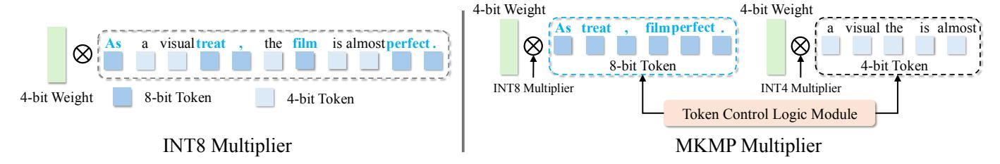

# *E. Multi-Kernel Mixed-Precision Multiplier*

The standard SIMD-based INT8 multipliers do not support mixed-precision integer MAC operations and typically zeroextend sub-8-bit operands to byte boundaries as 8-bit operands. To implement the proposed layer-wise token-adaptive quantization, we develop a SIMD-based MKMP multiplier to enable this mixed-precision quantization on devices as shown in Figure 5. After token adaptive quantization, we use existing INT8 multipliers for the 8-bit concatenated tokens and implement the INT4 multipliers. The INT4 multiplier is built on the existing INT8 multiplier, which concatenates weights from adjacent rows and multiplies them with a shared activation value in the SIMD kernel.

By concatenating weight matrices within GeMM, our approach significantly reduces the number of mathematical computation instructions required on processors compared to traditional byte-level quantized implementation kernels. This reduction is proportional to the concatenation density for the same workload. As shown in Figure 6, two 4-bit operands are concatenated into a single 16-bit register unit. This choice aligns with current practices in 8-bit quantized implementation kernels, where 8-bit data is often extended to 16 bits during product computations. This enables the use of efficient instructions like *mla* in Arm ISAs, which utilize a 32-bit destination register (INT32 datatype) to perform multiplication and accumulation in a single instruction. The 16-bit intermediate registers facilitate concatenation while offering redundancy beyond the actual sub-byte values. A low-bit priority strategy ensures that the bit width is utilized evenly, minimizing redundant zeros for subsequent computations. The 16-bit-wide multiplication operation is then performed, with the results internally split to maintain mathematical accuracy for the subsequent addition steps. Theoretically, this design reduces the computational burden—both in terms of multiplications and additions—for 4-bit GeMM by half compared to the conventional approach, which expands 4-bit data to 8-bit for use in byte-level quantization kernels.

Notably, while this methodology originates from weightmatrix concatenation, it is equally applicable to activationactivation matrix multiplications in transformer models. Similar to weight matrices, one of the activation matrices can be concatenated while preserving the logic and characteristics of design. This versatility makes it a broadly adaptable low-bit acceleration strategy. Using the SIMD-based memory mechanism, the INT4 multiplier employs bit-shift and row-by-row summation to add up intermediate values. INT4 multiplier can save 50% hardware resources of INT8 multiplier. By integrating quantization operator, we streamline entire MKMP multiplier within the GeMM kernel. Due to LLMs' huge memory readout, we optimize and assign computing threads for different operations and overlap memory readout time from the compiler level.

#### V. EXPERIMENTAL SETUP

## *A. Quantization Setup*

For the verification and deployment of our proposed methods, we experiment with lightweight LLMs, including LLaMA-58M [38], [39] and GPT2-97M [25]. We adopt the pretrain datasets from the work [46] and then perform regexbased cleaning on them. The cleaned datasets are tokenized using BytePair Encoding (BPE) with a vocabulary size of 16000. The models are then evaluated on BLiMP [43] for the zero-shot test, and (Super) GLUE [41] for the fine-tuning test. In the absence of prior coarse-grained QAT studies for LLMs, we compare with well-known static quantization methods as baselines, including NIPQ [23], PACT [8], and LLM-QAT [20]. The same fine-tuning recipe with distillation based on the FP16 pretrained model is adopted for all experiments.

Figure 5: Comparison of INT8 multiplier and SIMD-based MKMP multiplier to support mixed-precision MAC for adaptive token quantization.

Table I: LLaMA-58M quantization results on the BLiMP dataset, including the BLiMP Supplement.

| # Bits     | # Bits   FP16   W8A8 |      | W4A8 |         |      | W4A4 |      |         |      |      |      |         |      |
|------------|----------------------|------|------|---------|------|------|------|---------|------|------|------|---------|------|
| Method     | /                    | NIPQ | PACT | LLM-QAT | Ours | NIPQ | PACT | LLM-QAT | Ours | NIPQ | PACT | LLM-QAT | Ours |
| BLiMP Main |                      |      |      |         |      |      |      |         |      |      |      |         |      |
| AA         | 89.8                 | 85.5 | 86.4 | 88.0    | 88.1 | 58.1 | 86.6 | 87.1    | 87.6 | 66.2 | 85.8 | 85.9    | 85.7 |
| AS         | 73.1                 | 70.9 | 70.7 | 72.4    | 72.2 | 55.5 | 70.3 | 72.4    | 72.3 | 54.4 | 69.6 | 72.0    | 71.3 |
| Bind.      | 72.7                 | 71.1 | 71.0 | 71.9    | 72.3 | 61.7 | 70.6 | 71.8    | 72.2 | 51.5 | 68.2 | 71.5    | 72.4 |
| C/R        | 67.5                 | 65.5 | 64.6 | 66.6    | 66.7 | 54.7 | 64.0 | 65.8    | 66.7 | 53.6 | 63.6 | 65.4    | 66.3 |
| D-NA       | 90.8                 | 86.9 | 86.3 | 89.0    | 89.2 | 54.2 | 86.6 | 90.1    | 89.1 | 53.4 | 84.8 | 87.1    | 87.5 |
| Ell.       | 73.3                 | 60.4 | 59.7 | 68.4    | 69.4 | 29.9 | 59.7 | 67.2    | 69.8 | 33.8 | 56.8 | 63.2    | 65.1 |
| F-G        | 71.8                 | 70.2 | 69.0 | 71.8    | 72.1 | 66.7 | 69.3 | 71.7    | 72.0 | 61.1 | 66.8 | 70.2    | 70.4 |
| IF         | 93.1                 | 94.6 | 94.8 | 95.1    | 95.0 | 45.8 | 95.2 | 93.3    | 94.9 | 52.2 | 93.7 | 94.1    | 94.9 |
| ΙE         | 51.2                 | 48.2 | 49.2 | 51.3    | 51.7 | 43.6 | 50.0 | 51.9    | 52.1 | 48.5 | 43.3 | 48.2    | 51.3 |
| NPI-L      | 56.5                 | 50.0 | 52.1 | 57.9    | 58.3 | 26.8 | 52.2 | 57.3    | 57.7 | 36.6 | 48.2 | 45.9    | 44.5 |
| Quan.      | 73.3                 | 73.7 | 75.8 | 81.0    | 79.0 | 57.2 | 78.2 | 79.4    | 79.3 | 42.7 | 78.0 | 78.2    | 80.0 |
| S-VA       | 75.4                 | 68.4 | 67.8 | 73.1    | 73.2 | 46.3 | 67.7 | 73.0    | 74.0 | 48.6 | 64.5 | 68.0    | 70.3 |
| Avg.       | 74.0                 | 70.5 | 70.6 | 73.8    | 73.9 | 50.0 | 70.9 | 73.4    | 74.0 | 50.2 | 68.6 | 71.0    | 71.8 |
|            | BLiMP Supplement     |      |      |         |      |      |      |         |      |      |      |         |      |
| Hyper.     | 49.3                 | 48.0 | 49.0 | 49.6    | 48.9 | 49.5 | 48.7 | 48.7    | 49.6 | 50.9 | 50.3 | 49.3    | 50.5 |
| QAC-E      | 51.6                 | 48.4 | 51.5 | 49.1    | 50.1 | 35.9 | 50.0 | 49.8    | 50.1 | 37.5 | 48.4 | 49.3    | 50.1 |
| QAC-t      | 41.8                 | 40.6 | 40.0 | 41.6    | 41.3 | 34.5 | 40.6 | 40.6    | 41.3 | 33.9 | 39.3 | 40.6    | 41.9 |
| S-AI       | 88.5                 | 89.1 | 87.9 | 88.6    | 88.5 | 67.8 | 89.8 | 89.1    | 89.2 | 54.6 | 87.3 | 87.3    | 89.0 |
| TT         | 66.1                 | 58.2 | 57.1 | 62.0    | 61.5 | 43.2 | 57.5 | 60.3    | 61.8 | 51.4 | 55.7 | 59.2    | 60.1 |
| All Avg.   | 69.7                 | 66.5 | 66.6 | 69.2    | 69.3 | 48.9 | 66.9 | 68.8    | 69.4 | 48.9 | 64.9 | 66.9    | 67.8 |

Figure 6: SIMD-based INT4-concatenated multiplier design.

## B. Hardware Deployment

We use the OnePlus 11 smartphone, powered by the Snapdragon 8 Gen 2, as our mobile platform, utilizing all available cores for multi-threaded computation. Similarly, on the Raspberry Pi 5 with its BCM2712 quad-core Arm Cortex A76 processor, we deploy our quantized model and distribute

the computations across all four cores. Latency is reported based on 1000 iterations for each test.

#### VI. EXPERIMENTAL RESULTS

## A. Zero-Shot Evaluation

We first verify the effectiveness of our proposed QAT framework on the BLiMP [43] dataset with zero-shot (i.e., no fine-tuning) evaluations, and the results are shown in Table I. We compare our method with the other three QAT works, including NIPQ, PACT, and LLM-QAT, under different bitwidth settings including W8A8 (meaning 8-bit weight and 8-bit activation quantization), W4A8, and W4A4. As observed, our approach achieves better performance than all other three works in terms of the average accuracy of all subdatasets on the BLiMP dataset. Our method performs the best on most of the subdatasets across three bit-width configurations. Especially for the W4A8 setting, which is the most practical in wide applications, our method achieves an average accuracy of 69.4%, which is close to that of the FP16 model (only

0.3% drop) and even surpasses the W8A8 setting (69.3%). For the W4A4 setting, our method maintains an average accuracy of 67.8%, showcasing a clear advantage over other methods. Only our method can achieve a competitive average accuracy close to that of the FP16 model, while the baselines usually suffer from substantial accuracy drops. NIPQ fails to restore the accuracy when the model weights are quantized to 4 bits. For PACT, it is sensitive to the bit width of the activations, as evidenced by the poor results under the W4A4 setting. The LLM-QAT method consistently produces models with an lower average accuracy than our method.

## *B. Generalization Verification*

Additionally, we deliver the evaluation results of the GPT2- 97M model with the W4A4 setting to verify the generalization of our method in Table II. We conduct the experiments on the BLiMP main dataset. Our method can achieve the highest average accuracy with the best performance on most of the subdatasets, demonstrating our clear advantages over QAT baselines. Among the baselines struggling to restore the accuracy, the NIPQ and PACT perform much worse with large margins. Thus, the clear advantages, achieved by our method compared to other QAT methods, validates the generalization of our proposed Squant method for the small language models.

## VII. FINE-TUNING EVALUATION

To further demonstrate the effectiveness of the proposed Squant framework, we finetune the quantized models from different QAT frameworks on the (Super) GLUE dataset and show the evaluation results in Table III. To make a fair comparison, we use the same finetuning recipe for all methods. As observed, the proposed Squat method can restore the performance on all subdatasets and demonstrate a clear advantage in average accuracy compared to all the other three methods. In detail, other methods struggle to optimize the quantized model. The NIPQ can only restore the model performance on the WSC subdataset, and fail to the average accuracy. The PACT and LLM-QAT methods yield poor results on some subdataset. For instance, PACT exhibits bad results on the RTE and MultiRC subdatasets, while LLM-QAT experiences significant performance losses on the WSC subdataset. Therefore, the effectiveness of our proposed Squant framework on the downstreaming tasks is verified by the clear accuracy advantages.

