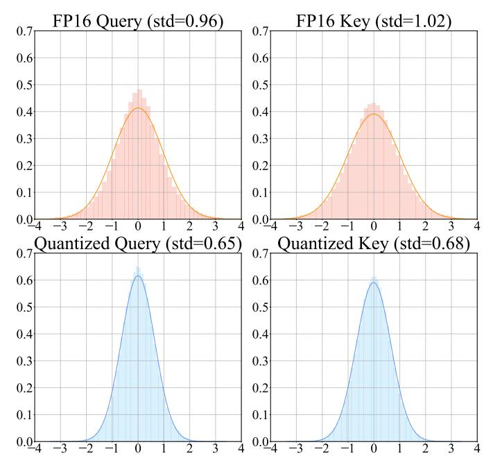
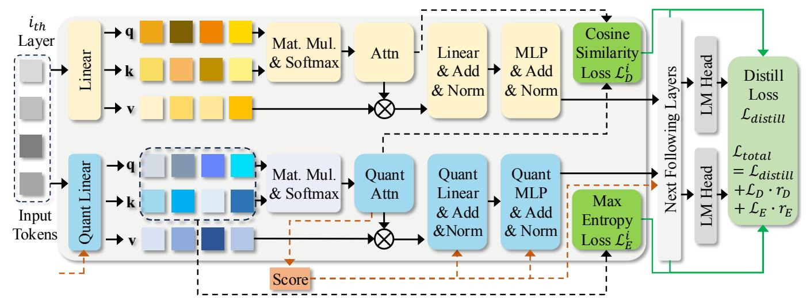

# I. INTRODUCTION

Large Language Models (LLMs) [4], [5], [26], [39], [48] have emerged as the dominant force in the field of Natural Language Processing (NLP). These models are increasingly integrated into various applications on daily life devices to enhance task performance and user experience. With growing concerns about the cost and latency of deploying LLMs in the cloud, the trend is increasingly shifting towards deploying Small Language Models (SLMs) on edge platforms such as mobile devices. Recently, MobileLLM [21], SmolLM2 [1], BabyLlama [37], [38] and other works [33], [40], [49] have prioritized the design of high-quality SLMs with fewer than one billion parameters, making such lightweight models a viable option for mobile deployment. Meanwhile, given the widespread support for quantized computation by Single Instruction Multiple Data (SIMD) mechanisms on mobile and edge devices [2], [28]–[32], [34], [35], model quantization emerges as a promising approach to accelerate SLMs on these platforms. Existing methods using Post-Training Quantization (PTQ) often suffer significant accuracy drops in sub-8-bit settings. Some PTQ methods like GPTQ [11], SqueezeLLM [17], and AWQ [19] only adopt the weight-only quantization, which leave the activations in float16 and can not fully exploit efficient integer computation on edge devices [11], [19], [27], [45]. Other PTQ methods, including Agile-Quant [27], SmoothQuant [45], and ZeroQuant [44], [47], quantize both weights and activations. However, their performance drops significantly when the activation bit width is reduced to 4 bit. In contrast, Quantization-Aware Training (QAT) allows fine-tuning to reduce quantization error, and models with both weights and activations quantized can take full advantage of fast integer matrix multiplication on edge hardware. Meanwhile, for SLMs, full parameter training is feasible, making QAT a practical and effective option. This enables us to jointly optimize both weights and activations during training, leading to better performance at lower bit widths—especially when targeting 4-bit deployment.

Recent QAT works [6], [16], [20] employ channel-wise or token-wise (fine-grained) quantization for weights and activations with sub-8-bit precision, resulting in multiple scaling factors for a single matrix. However, such fine-grained quantization methods are incompatible with computation kernels in general mobile devices and edge processors, leading to significant computation overhead. Specifically, standard SIMD-based libraries [10], [14] do not support running quantized networks with sub-8-bit precision, and the general matrix multiply (GeMM) kernel in SIMD cannot handle matrix multiplications (MAC) with multiple scaling factors for integer operations [2]. In conclusion, to effectively harness the power of SLMs on mobile devices, it is necessary to address the challenges of quantization algorithm design and corresponding efficient hardware implementation.

Therefore, to build efficient and accurate SLMs on mobile devices, we present a novel framework called Squat in this paper. Specifically, we first identify that, for the self-attention module, the information distortion brought by quantizing queries and keys is the most critical factor leading to information loss. We then introduce an entropy-guided optimization method to mitigate the loss by maximizing the information entropy. Simultaneously, we align the distributions of the quantized attention maps to the FP16 one to minimize the difference. Furthermore, the sub-8-bit token adaptive quantization is implemented, which assigns varying bit widths to different tokens based on their informativeness, thereby further reducing redundancy. Moreover, we recompile the existing INT8 multiplier and develop a SIMD-based Multi-Kernel Mixed-Precision (MKMP) multiplier for the proposed token adaptive quantization method. Finally, Squat framework can accelerate the inference of mixed-precision SLMs with sub-8-bit quantization on mobile devices and edge processors. In our experiments, we uniformly quantize the weights with 4 bits or 8 bits, and adaptively quantize the activations with 4 bits or 8 bits. The results show that our method can achieve better task performance than other coarse-grained QAT methods. Moreover, our results demonstrate that our proposed adaptive quantization approach yields superior performance with a mixed strategy compared to a uniform strategy. For instance, a combination of half 4-bit and half 8-bit quantization outperforms uniform 6-bit quantization. Furthermore, our quantized models with the proposed MKMP multiplier can achieve a practical speedup of up to 2.37× on mobile devices. Our contributions are summarized below:

- 1. We design the entropy-guided and distribution-aligned QAT method to mitigate information distortion brought by quantization.
- 2. We design the token importance-aware adaptive quantization method for activations (i.e., tokens), further reducing model redundancy and outperforming bit-equivalent uniform quantization.
- 3. We develop a SIMD-based MKMP multiplier for the acceleration of sub-8-bit mixed-precision LLM inference on mobile devices.
- 4. We achieve better task performance than other QAT methods with an on-device speedup of up to 2.37×.

#### II. BACKGROUND AND RELATED WORKS

#### *A. Efficient Design of SLMs*

Recently, a growing trend [40] is the use of SLMs for specialized tasks on mobile devices. These models, such as MiniCPM [13], Octopus [7], SmolLM2 [1], and MobileLLM [21], have shown that they can perform effectively on general tasks while being more suitable for deployment on mobile platforms. To facilitate SLM developments, quantization has emerged as a powerful technique to reduce the computational and memory demands with low-bit format. Current quantization methods can be broadly categorized into PTQ and QAT. Previous weight-only quantization methods, such as GPTQ [11], SqueezeLLM [17], and AWQ [19], focus on optimizing quantized weights while leaving activations unquantized. This approach fails to exploit efficient integer computation capabilities on edge devices. PTQ works, such as SmoothQuant [45], ZeroQuant [47], ZeroQuant-FP [44], and Agile-Quant [27] can achieve multiple different quantization configurations for both weights and activations. On the other hand, QAT methods, like LLM-QAT [20], TSLD [16], EfficientQAT [6], and others [36] use fine-tuning with fine-grained quantization (e.g., channel-wise and token-wise ) to recover task performance. However, these fine-grained quantization techniques are difficult to be deployed on mainstream edge processors, making them less practical for mobile devices.

#### *B. Hardware Implementation for Quantization*

Low-precision linear algebra kernels are designed to maximize computing throughput by adapting existing wider bit-

Figure 1: Accuracy analysis of LLaMA-58M on the Anaphor Agr. subdataset of BLiMP with different quantized modules.

width kernels to handle lower-precision operands. This approach improves performance based on lower-precision SIMD instructions (e.g., vmlaq s8() in ARMv8 ISA), which process more elements in parallel than higher-precision instructions (e.g., vmlaq f32()). State-of-the-art (SOTA) low-precision linear algebra kernels, such as Google's GEMMLOWP [14] and Meta's QNNPACK [10], can greatly enhance model efficiency with 8-bit quantization (W8A8) scenarios, e.g., on a 64 bit ARM Cortex-A72 CPU. However, two critical challenges have yet to be addressed to achieve SOTA complex quantization frameworks. (i) More aggressive sub-8-bit quantization does not offer additional performance benefits, as commercial CPUs/GPUs only support SIMD operations with 8-bit or higher precision. Thus, low-precision kernels simply zeroextend sub-8-bit operands to byte boundaries, treating them as 8-bit operands. (ii) Quantization process is executed with a SIMD-based GeMM engine that supports layer-wise (coarsegrained) quantization with a single scaling factor per matrix, which means the fine-grained quantization methods adopted by SOTA methods are limited on the edge.

#### III. ANALYSIS

To identify the bottlenecks of layer-wise QAT, we analyze performance deterioration when quantizing each part of the model. Additionally, we assess token importance using the attention map, specifically examining its relationship with the initial token of each head.

## *A. Quantized Self-Attention Module*

We first analyze the degradation on task performance by applying layer-wise quantization (i.e., coarse-grained quantization) to various components of the model without fine-tuning. In Figure 1, the MLP module, the entire self-attention module, and specific parts of the self-attention module (query and key) are quantized, respectively. Other parts of the model remain as FP16. As shown in Figure 1, we identify that the quantized query and key are the main factors that lead to the substantial performance drop, as the performance drop caused by query and key nearly mirrors the loss from quantizing the entire self-attention module. We further visualize the distributions of quantized queries and keys, which approximate Gaussian

Figure 2: Distributions of query and key at the last layer of FP16 and quantized LLaMA-58M. The main difference is from the variance of the distribution.

Figure 3: Averaged attention maps through all heads at the last layer of the FP16 and quantized models. The main difference is from the first column of the heatmap.

distributions [24], [27]. As shown in Figure 2, there is a significant difference in distributions between the quantized and FP16 versions for either the query or key (e.g., different variance). The distribution difference results in an entropy discrepancy, inevitably leading to a deterioration in the attention module's representational capability.

#### B. Token Importance

In LLMs, a unique initial token is placed at the start of the input sequence to define token positions, visible to all subsequent tokens due to autoregressive language modeling. Removing interactions between the initial token and other ones can fundamentally alter the model's output. However, as shown in Figure 3, a distinct column pattern associated with the initial token in the FP16 version disappears in the quantized version. Besides, we highlight that the initial token remains critical for assessing token importance, which is

essential for further optimizations like token pruning [9], [15], [18], [27]. In generative models, the self-attention mechanism limits each token's interactions to those preceding it, and the initial token encapsulates the informational content of each generated token. Thus, we evaluate token importance based on each token's average attentivity to the initial token with all heads (i.e., the first column of attention map).

#### IV. METHODOLOGY

In this section, we first provide the preliminary of QAT. Then, we propose the design of entropy loss and distribution loss. We further introduce token adaptive quantization method based on token importance. We also design the MKMP multiplier for adaptive quantization deployment on mobile devices.

#### A. Preliminary

For layer-wise QAT, we adopt the symmetric quantization for both weights  $\mathbf{w}$  and activations  $\mathbf{x}$  as follows,

$$Q(\mathbf{w}) = \lfloor \text{CLIP}(\frac{\mathbf{w}}{\alpha_{\mathbf{w}}}, -2^{b_{\mathbf{w}}-1}, 2^{b_{\mathbf{w}}-1} - 1) \rceil; \tag{1}$$

$$\hat{\mathbf{w}} = \mathcal{Q}(\mathbf{w}) \cdot \alpha_{\mathbf{w}}; \tag{2}$$

$$Q(\mathbf{x}) = \lfloor \text{CLIP}(\frac{\mathbf{x}}{\alpha_{\mathbf{x}}}, -2^{b_{\mathbf{x}}-1}, 2^{b_{\mathbf{x}}-1} - 1) \rceil; \tag{3}$$

$$\hat{\mathbf{x}} = \mathcal{Q}(\mathbf{x}) \cdot \alpha_{\mathbf{x}},\tag{4}$$

where  $\mathcal{Q}(\cdot)$  denotes the quantization function. CLIP $(x, r_1, r_2)$  returns x with values in the range from  $r_1$  to  $r_2$  through clipping with the lower bound  $r_1$  and upper bound  $r_2$ .  $\lfloor \cdot \rfloor$  represents rounding to the nearest integer.  $\mathbf{x}$  is the activations and  $\mathbf{w}$  means the weights.  $\hat{\mathbf{x}}$  and  $\hat{\mathbf{w}}$  denote the dequantized activations and weights with scaling factor  $\alpha$ .  $b_{\mathbf{x}}$  and  $b_{\mathbf{w}}$  denote bit width for activations and weights.

For the forward propagation, the linear projection can be calculated as follows:

$$\mathcal{F}_{Linear}(\mathbf{x}, \mathbf{w}) = \hat{\mathbf{x}} \times \hat{\mathbf{w}}$$

$$= \alpha_{\mathbf{x}} \alpha_{\mathbf{w}} \left[ \mathcal{Q}(\mathbf{x}) \times \mathcal{Q}(\mathbf{w}) \right], \tag{5}$$

where the  $\mathcal{F}_{Linear}$  denotes the normal matrix multiplication. For backward propagation, gradients are computed as follows:

$$\begin{split} \frac{\partial \mathcal{J}}{\partial \mathbf{x}} &= \frac{\partial \mathcal{J}}{\partial \hat{\mathbf{x}}} \frac{\partial \hat{\mathbf{x}}}{\partial \mathbf{x}} \\ &= \left\{ \begin{array}{ll} \frac{\partial \mathcal{J}}{\partial \hat{\mathbf{x}}}, & \mathbf{x} \in \left[-2^{b_{\mathbf{x}}-1}, 2^{b_{\mathbf{x}}-1} - 1\right], \\ 0, & \text{otherwise.} \end{array} \right. \end{split}$$
(6)

$$\frac{\partial \mathcal{J}}{\partial \mathbf{w}} = \frac{\partial \mathcal{J}}{\partial \mathbf{x}} \frac{\partial \mathbf{x}}{\partial \hat{\mathbf{w}}} \frac{\partial \hat{\mathbf{w}}}{\partial \mathbf{w}} 
= \begin{cases} \frac{\partial \mathcal{J}}{\partial \mathbf{x}} \frac{\partial \mathbf{x}}{\partial \hat{\mathbf{w}}}, & \mathbf{w} \in [-2^{b_{\mathbf{w}}-1}, 2^{b_{\mathbf{w}}-1} - 1], \\ 0, & \text{otherwise.} \end{cases} (7)$$

where  $\mathcal{J}$  denotes the loss function, and straight-through estimator (STE) [3] is adopted to retain derivation of gradients.

Figure 4: Adaptive distillation pipeline based on token importance score (colored in red), with maximum entropy loss and attention map cosine similarity loss (both colored in green).

