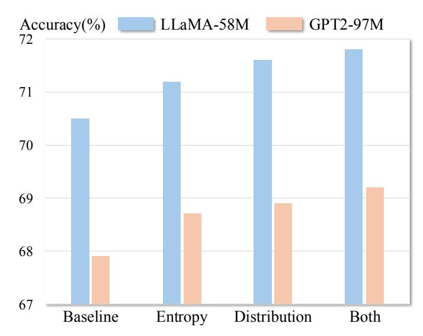
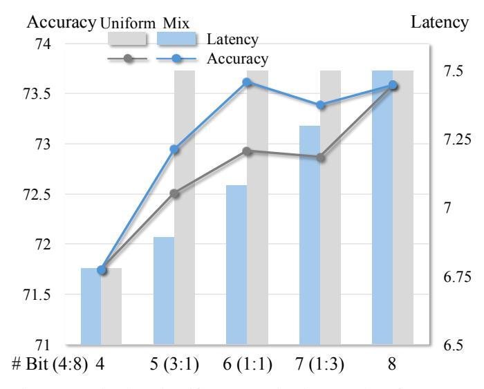

# VIII. HARDWARE EFFICIENCY

Our MKMP multiplier is compatible with mainstream processors on edge platforms, such as mobile phones and Raspberry Pi IoT processors, which typically face challenges when processing low-bit data due to their SIMD instructions supporting only 8-bit or larger data granularity. We deliver the latency profiling results with model size and accuracy in Table IV, and we can draw the following conclusions: 8-bit quantization provides more than 1.4× acceleration on smartphones and over 1.6× acceleration on Raspberry Pi. As the high-end CPUs on smartphones can afford more robust floating-point processing capabilities, the acceleration attained

Table II: GPT2-97M with W4A4 on BLiMP Main dataset.

| Method | FP16 | NIPQ | PACT | LLM-QAT | Ours |
|--------|------|------|------|---------|------|
| AA     | 87.0 | 38.1 | 69.8 | 84.3    | 84.5 |
| AS     | 71.3 | 57.4 | 63.7 | 70.5    | 71.7 |
| Bind.  | 70.2 | 49.8 | 64.4 | 69.7    | 69.8 |
| C/R    | 66.1 | 54.2 | 62.6 | 65.1    | 65.3 |
| D-NA   | 87.4 | 51.4 | 72.3 | 86.9    | 86.0 |
| Ell.   | 62.1 | 39.6 | 39.2 | 59.8    | 59.9 |
| F-G    | 70.7 | 43.3 | 63.2 | 70.5    | 70.4 |
| IF     | 94.1 | 52.3 | 90.0 | 94.3    | 95.4 |
| IE     | 47.2 | 59.7 | 44.9 | 46.5    | 46.8 |
| NPI-L  | 48.5 | 71.3 | 44.4 | 47.5    | 44.8 |
| Quan.  | 68.0 | 27.5 | 46.7 | 69.5    | 69.4 |
| S-VA.  | 66.2 | 48.1 | 55.5 | 65.1    | 66.0 |
| Avg.   | 69.9 | 49.4 | 59.7 | 69.1    | 69.2 |

Table III: LLaMA-58M with W4A4 on (Super)GLUE.

| Method | FP16 | NIPQ | PACT | LLM-QAT | Ours |
|--------|------|------|------|---------|------|
| CoLA   | 69.5 | 33.3 | 69.3 | 68.5    | 68.4 |
| SST-2  | 87.2 | 49.4 | 85.4 | 85.0    | 84.1 |
| MRPC   | 63.2 | 32.2 | 69.4 | 69.3    | 69.5 |
| QQP    | 84.3 | 42.4 | 82.5 | 83.7    | 84.1 |
| MNLI   | 72.9 | 35.4 | 67.5 | 70.8    | 70.8 |
| MNLIm  | 73.7 | 35.8 | 69.1 | 71.5    | 71.1 |
| QNLI   | 81.1 | 47.2 | 74.4 | 78.2    | 79.4 |
| RTE    | 61.6 | 50.5 | 48.5 | 54.6    | 53.5 |
| BoolQ  | 67.2 | 58.4 | 60.3 | 62.4    | 62.9 |
| MulRC  | 58.9 | 53.2 | 46.1 | 53.7    | 54.1 |
| WSC    | 61.4 | 61.4 | 53.0 | 52.9    | 56.6 |
| Avg.   | 71.0 | 45.4 | 65.9 | 68.2    | 68.6 |

through quantization on smartphones is not as significant as the improvements observed on the Raspberry Pi 5. Meanwhile, for the W4A4 configuration, we achieve more than 2.2× acceleration on smartphones and 2.3× acceleration on Raspberry Pi, separately. Overall, the GPT2-97M model achieves greater acceleration in our framework compared to the LLaMA-58M model. This is largely due to its higher parameter amount, which enables more efficiency improvement through memory access reduction on edge devices. Additionally, the 4-bit compression and concatenation technique amplifies this advantage, delivering a 2.26× acceleration compared to the 1.43× speedup achieved with 8-bit quantization on smartphones for GPT2-97M model.

Also, the introduction of mixed precision is essential as it bridges the gap between the latency of 4-bit and 8-bit configurations. While the theoretical, computational workload is halved, some overhead is introduced due to internal shifts of concatenated weights and the recovery of stored results in INT8 format. However, using W4A4 precision can lead to a noticeable performance drop in LLM tasks. To address this, we employ our MKMP multiplier for the mixed W4A4 and W4A8 configurations. This approach not only achieves further acceleration compared to 8-bit quantization but also maintains the model performance as shown in Figure 8. For Raspberry Pi, the additional acceleration achieved through the mixed configuration becomes over 40%.

## IX. ABLATION STUDY

#### *A. Loss Ablation*

As shown in Figure 7, we adopt ablation study for proposed entropy loss LE and distribution loss LD. The results in blue denote the LLaMA-58M and the results in red denote GPT2- 97M. The results are obtained with the W4A4 configuration. We can identify that, compared to entropy loss, distribution loss more effectively improves the model performance. Besides, we make the observation that combining the two losses generates better results than using either single one. Both loss types are verified to be effective when used for both LLaMA-58M and GPT2-97M, which validates the generalization of the proposed loss optimization method.

#### *B. Mixed Strategy*

Ablation for quantization with mixed or uniform strategy is included in Figure 8. The results in blue denote the quantization with mixed strategy while the results in grey denote the quantization with uniform strategy. Results are evaluated with LLaMA-58M model on BLiMP Main dataset using a Raspberry Pi 5. Results show that mixed strategy yields superior quantization performance (higher accuracy and lower latency in ms/Token) compared to uniform strategy. The inference acceleration using a mixed strategy verifies superior performance compared to uniform quantization at any bit level (5, 6, 7, or 8 bits). Specifically, for 6-bit activation quantization strategy, the mixed-precision strategy with half 4-bit and half 8-bit quantization shows impressive better accuracy than the uniform strategy.

#### X. CONCLUSION AND LIMITATION

In this paper, we introduce the Squant method, an entropy-guided and distribution-aligned token adaptive mixedprecision QAT framework, designed to accelerate small language models on mobile devices. Besides, we adaptively quantize tokens with different bit widths based on their importance, which further accelerates the inference and maintains performance. Meanwhile, we implement the corresponding multiplier, which helps the mobile devices benefit from our proposed 4-bit quantization optimization algorithm. We effectively restore the model performance to that of FP16 counterparts and achieve up to 2.37× speedup on mobile devices. We will verify our method on larger models with hundreds of millions of parameters in our further work.

## REFERENCES

[1] L. B. Allal, A. Lozhkov, E. Bakouch, G. M. Blazquez, G. Penedo, ´ L. Tunstall, A. Marafioti, H. Kydl´ıcek, A. P. Lajar ˇ ´ın, V. Srivastav, et al. Smollm2: When smol goes big–data-centric training of a small language model. *arXiv preprint arXiv:2502.02737*, 2025.

Figure 7: Loss ablation with average accuracy of LLaMA-58M and GPT2-97M on BLiMP Main dataset in W4A4.

Figure 8: Mixed and uniform quantization results of LLaMA-58M on the BLiMP Main dataset with Rapberry Pi 5.

- [2] S. Ashfaq, M. AskariHemmat, S. Sah, E. Saboori, O. Mastropietro, and A. Hoffman. Accelerating deep learning model inference on arm cpus with ultra-low bit quantization and runtime. *arXiv preprint arXiv:2207.08820*, 2022.
- [3] Y. Bengio, N. Leonard, and A. Courville. Estimating or propagating ´ gradients through stochastic neurons for conditional computation. *arXiv preprint arXiv:1308.3432*, 2013.
- [4] T. Brown, B. Mann, N. Ryder, M. Subbiah, J. D. Kaplan, P. Dhariwal, A. Neelakantan, P. Shyam, G. Sastry, A. Askell, et al. Language models are few-shot learners. *NeurIPS*, 33:1877–1901, 2020.
- [5] T. B. Brown, B. Mann, N. Ryder, M. Subbiah, J. Kaplan, P. Dhariwal, A. Neelakantan, P. Shyam, G. Sastry, A. Askell, S. Agarwal, A. Herbert-Voss, G. Krueger, T. Henighan, R. Child, A. Ramesh, D. M. Ziegler, J. Wu, C. Winter, C. Hesse, M. Chen, E. Sigler, M. Litwin, S. Gray, B. Chess, J. Clark, C. Berner, S. McCandlish, A. Radford, I. Sutskever, and D. Amodei. Language models are few-shot learners. 2020.
- [6] M. Chen, W. Shao, P. Xu, J. Wang, P. Gao, K. Zhang, and P. Luo. Efficientqat: Efficient quantization-aware training for large language models. *arXiv preprint arXiv:2407.11062*, 2024.

Table IV: Latency results (ms/Token) of LLaMA-58M and GPT2-97M with 128 input sequence length on mobile (Onepluss 11) and edge (Raspberry Pi 5) devices.

| W                    | FP16  | INT8          | INT4          | INT4          | INT4          | INT4          | INT4         |  |  |
|----------------------|-------|---------------|---------------|---------------|---------------|---------------|--------------|--|--|
| A                    | FP16  | INT8          | INT8          | 4:8 (1:3)     | 4:8 (1:1)     | 4:8 (3:1)     | INT4         |  |  |
| LLaMA-58M (ms/Token) |       |               |               |               |               |               |              |  |  |
| MB                   | 110.6 | 55.3          | 27.7          | 27.7          | 27.7          | 27.7          | 27.7         |  |  |
| Mobile               | 4.54  | 3.22 (1.41×)  | 2.56 (1.77×)  | 2.39 (1.90×)  | 2.23 (2.04×)  | 2.10 (2.16×)  | 2.02 (2.24×) |  |  |
| Raspberry Pi         | 15.63 | 9.40 (1.66×)  | 7.50 (2.08×)  | 7.30 (2.14×)  | 7.08 (2.21×)  | 6.89 (2.27×)  | 6.78 (2.31×) |  |  |
| GPT2-97M (ms/Token)  |       |               |               |               |               |               |              |  |  |
| MB                   | 185.5 | 92.7          | 46.3          | 46.3          | 46.3          | 46.3          | 46.3         |  |  |
| Mobile               | 6.22  | 4.35 (1.43×)  | 3.42 (1.82×)  | 3.06 (2.06×)  | 3.02 (2.03×)  | 2.86 (2.17×)  | 2.75 (2.26×) |  |  |
| Raspberry Pi         | 23.04 | 13.75 (1.68×) | 12.45 (1.85×) | 11.24 (2.05×) | 10.98 (2.10×) | 10.01 (2.30×) | 9.74 (2.37×) |  |  |

- [7] W. Chen and Z. Li. Octopus v2: On-device language model for super agent, 2024.
- [8] J. Choi, Z. Wang, S. Venkataramani, P. I.-J. Chuang, V. Srinivasan, and K. Gopalakrishnan. Pact: Parameterized clipping activation for quantized neural networks. *arXiv preprint arXiv:1805.06085*, 2018.
- [9] P. Dong, M. Sun, A. Lu, Y. Xie, K. Liu, Z. Kong, X. Meng, Z. Li, X. Lin, Z. Fang, et al. Heatvit: Hardware-efficient adaptive token pruning for vision transformers. In *2023 IEEE International Symposium on High-Performance Computer Architecture (HPCA)*, pages 442–455. IEEE, 2023.
- [10] M. Dukhan, Y. Wu, and H. Lu. Qnnpack: Open source library for optimized mobile deep learning, 2018.
- [11] E. Frantar, S. Ashkboos, T. Hoefler, and D. Alistarh. Gptq: Accurate post-training quantization for generative pre-trained transformers. *arXiv preprint arXiv:2210.17323*, 2022.
- [12] G. Hinton, O. Vinyals, and J. Dean. Distilling the knowledge in a neural network. *arXiv preprint arXiv:1503.02531*, 2015.
- [13] S. Hu, Y. Tu, X. Han, C. He, G. Cui, X. Long, Z. Zheng, Y. Fang, Y. Huang, W. Zhao, X. Zhang, Z. L. Thai, K. Zhang, C. Wang, Y. Yao, C. Zhao, J. Zhou, J. Cai, Z. Zhai, N. Ding, C. Jia, G. Zeng, D. Li, Z. Liu, and M. Sun. Minicpm: Unveiling the potential of small language models with scalable training strategies, 2024.
- [14] B. Jacob and P. Warden. gemmlowp: A small self-contained lowprecision gemm library. *Retrieved June*, 14:2018, 2017.
- [15] M. Kim, S. Gao, Y.-C. Hsu, Y. Shen, and H. Jin. Token fusion: Bridging the gap between token pruning and token merging. In *Proceedings of the IEEE/CVF Winter Conference on Applications of Computer Vision*, pages 1383–1392, 2024.
- [16] M. Kim, S. Lee, J. Lee, S. Hong, D.-S. Chang, W. Sung, and J. Choi. Token-scaled logit distillation for ternary weight generative language models. *Advances in Neural Information Processing Systems*, 36, 2024.
- [17] S. Kim, C. Hooper, A. Gholami, Z. Dong, X. Li, S. Shen, M. W. Mahoney, and K. Keutzer. Squeezellm: Dense-and-sparse quantization. *arXiv preprint arXiv:2306.07629*, 2023.
- [18] Z. Kong, P. Dong, X. Ma, X. Meng, W. Niu, M. Sun, X. Shen, G. Yuan, B. Ren, H. Tang, et al. Spvit: Enabling faster vision transformers via latency-aware soft token pruning. In *European Conference on Computer Vision*, pages 620–640. Springer, 2022.
- [19] J. Lin, J. Tang, H. Tang, S. Yang, X. Dang, and S. Han. Awq: Activationaware weight quantization for llm compression and acceleration. *arXiv preprint arXiv:2306.00978*, 2023.
- [20] Z. Liu, B. Oguz, C. Zhao, E. Chang, P. Stock, Y. Mehdad, Y. Shi, R. Krishnamoorthi, and V. Chandra. Llm-qat: Data-free quantization aware training for large language models. *arXiv preprint arXiv:2305.17888*, 2023.
- [21] Z. Liu, C. Zhao, F. Iandola, C. Lai, Y. Tian, I. Fedorov, Y. Xiong, E. Chang, Y. Shi, R. Krishnamoorthi, et al. Mobilellm: Optimizing sub-billion parameter language models for on-device use cases. *arXiv preprint arXiv:2402.14905*, 2024.
- [22] D. Messerschmitt. Quantizing for maximum output entropy (corresp.). *IEEE Transactions on Information Theory*, 17(5):612–612, 1971.
- [23] S. Park, J. So, J. Shin, and E. Park. Nipq: Noise injection

- pseudo quantization for automated dnn optimization. *arXiv preprint arXiv:2206.00820*, 2022.
- [24] H. Qin, Y. Ding, M. Zhang, Q. Yan, A. Liu, Q. Dang, Z. Liu, and X. Liu. Bibert: Accurate fully binarized bert. *The International Conference on Learning Representations (ICLR)*, 2022.
- [25] A. Radford, J. Wu, R. Child, D. Luan, D. Amodei, and I. Sutskever. Language models are unsupervised multitask learners. 2019.
- [26] A. Radford, J. Wu, R. Child, D. Luan, D. Amodei, I. Sutskever, et al. Language models are unsupervised multitask learners. *OpenAI blog*, 1(8):9, 2019.
- [27] X. Shen, P. Dong, L. Lu, Z. Kong, Z. Li, M. Lin, C. Wu, and Y. Wang. Agile-quant: Activation-guided quantization for faster inference of llms on the edge. In *Proceedings of the AAAI Conference on Artificial Intelligence*, volume 38, pages 18944–18951, 2024.
- [28] X. Shen, C. Han, Y. Zhou, Y. Xie, Y. Gong, Q. Wang, Y. Wang, Y. Wang, P. Zhao, and J. Gu. Draftattention: Fast video diffusion via lowresolution attention guidance. *arXiv preprint arXiv:2505.14708*, 2025.
- [29] X. Shen, Z. Han, L. Lu, Z. Kong, P. Dong, Z. Li, Y. Xie, C. Wu, M. Leeser, P. Zhao, X. Lin, and Y. Wang. Hotaq: Hardware oriented token adaptive quantization for large language models. *IEEE Transactions on Computer-Aided Design of Integrated Circuits and Systems*, pages 1–1, 2024.
- [30] X. Shen, W. Ma, J. Liu, C. Yang, R. Ding, Q. Wang, H. Ding, W. Niu, Y. Wang, P. Zhao, J. Lin, and J. Gu. Quartdepth: Post-training quantization for real-time depth estimation on the edge. In *Proceedings of the Computer Vision and Pattern Recognition Conference (CVPR)*, pages 11448–11460, June 2025.
- [31] X. Shen, W. Ma, Y. Zhou, E. Tang, Y. Xie, Z. Li, Y. Gong, Q. Wang, H. Ding, Y. Wang, Y. Wang, P. Zhao, J. Lin, and J. Gu. Fastcar: Cache attentive replay for fast auto-regressive video generation on the edge. *arXiv preprint arXiv:2505.14709*, 2025.
- [32] X. Shen, Z. Song, Y. Zhou, B. Chen, Y. Li, Y. Gong, K. Zhang, H. Tan, J. Kuen, H. Ding, Z. Shu, W. Niu, P. Zhao, Y. Wang, and J. Gu. Lazydit: Lazy learning for the acceleration of diffusion transformers. *Proceedings of the AAAI Conference on Artificial Intelligence*, 39(19):20409–20417, Apr. 2025.
- [33] X. Shen, Z. Song, Y. Zhou, B. Chen, J. Liu, R. Zhang, R. A. Rossi, H. Tan, T. Yu, X. Chen, Y. Zhou, T. Sun, P. Zhao, Y. Wang, and J. Gu. Numerical pruning for efficient autoregressive models. *Proceedings of the AAAI Conference on Artificial Intelligence*, 39(19):20418–20426, Apr. 2025.
- [34] X. Shen, P. Zhao, Y. Gong, Z. Kong, Z. Zhan, Y. Wu, M. Lin, C. Wu, X. Lin, and Y. Wang. Search for efficient large language models. In *NeurIPS*, 2024.
- [35] X. Shen, H. Zheng, Y. Gong, Z. Kong, C. Yang, Z. Zhan, Y. Wu, X. Lin, Y. Wang, P. Zhao, and W. Niu. Sparse learning for state space models on mobile. In *The Thirteenth International Conference on Learning Representations*, 2025.
- [36] C. Tao, L. Hou, W. Zhang, L. Shang, X. Jiang, Q. Liu, P. Luo, and N. Wong. Compression of generative pre-trained language models via quantization. *arXiv preprint arXiv:2203.10705*, 2022.
- [37] J.-L. Tastet and I. Timiryasov. Babyllama-2: Ensemble-distilled models

- consistently outperform teachers with limited data. *arXiv preprint arXiv:2409.17312*, 2024.
- [38] I. Timiryasov and J.-L. Tastet. Baby llama: knowledge distillation from an ensemble of teachers trained on a small dataset with no performance penalty. *arXiv preprint arXiv:2308.02019*, 2023.
- [39] H. Touvron, T. Lavril, G. Izacard, X. Martinet, M.-A. Lachaux, T. Lacroix, B. Roziere, N. Goyal, E. Hambro, F. Azhar, A. Rodriguez, ` A. Joulin, E. Grave, and G. Lample. Llama: Open and efficient foundation language models. *arXiv*, 2023.
- [40] C. Van Nguyen, X. Shen, R. Aponte, Y. Xia, S. Basu, Z. Hu, J. Chen, M. Parmar, S. Kunapuli, J. Barrow, et al. A survey of small language models. *arXiv preprint arXiv:2410.20011*, 2024.
- [41] A. Wang, Y. Pruksachatkun, N. Nangia, A. Singh, J. Michael, F. Hill, O. Levy, and S. Bowman. Superglue: A stickier benchmark for general-purpose language understanding systems. *Advances in neural information processing systems*, 32, 2019.
- [42] H. Wang, Z. Zhang, and S. Han. Spatten: Efficient sparse attention architecture with cascade token and head pruning. In *2021 IEEE International Symposium on High-Performance Computer Architecture (HPCA)*, pages 97–110. IEEE, 2021.
- [43] A. Warstadt, A. Parrish, H. Liu, A. Mohananey, W. Peng, S.-F. Wang, and S. R. Bowman. BLiMP: The Benchmark of Linguistic Minimal Pairs for English. *Transactions of the Association for Computational Linguistics*, 8:377–392, 07 2020.
- [44] X. Wu, Z. Yao, and Y. He. Zeroquant-fp: A leap forward in llms posttraining w4a8 quantization using floating-point formats. *arXiv preprint arXiv:2307.09782*, 2023.
- [45] G. Xiao, J. Lin, M. Seznec, H. Wu, J. Demouth, and S. Han. Smoothquant: Accurate and efficient post-training quantization for large language models. In *International Conference on Machine Learning*, pages 38087–38099. PMLR, 2023.
- [46] Y. Yang, E. Sulem, I. Lee, and D. Roth. Penn & BGU BabyBERTa+ for Strict-Small BabyLM Challenge. Technical report, 2023.
- [47] Z. Yao, R. Yazdani Aminabadi, M. Zhang, X. Wu, C. Li, and Y. He. Zeroquant: Efficient and affordable post-training quantization for largescale transformers. *Advances in Neural Information Processing Systems*, 35:27168–27183, 2022.
- [48] S. Zhang, S. Roller, N. Goyal, M. Artetxe, M. Chen, S. Chen, C. Dewan, M. Diab, X. Li, X. V. Lin, et al. Opt: Open pre-trained transformer language models. *arXiv*, 2022.
- [49] P. Zhao, X. Shen, Z. Kong, Y. Shen, S.-E. Chang, T. Rupprecht, L. Lu, E. Nan, C. Yang, Y. He, et al. Fully open source moxin-7b technical report. *arXiv preprint arXiv:2412.06845*, 2024.