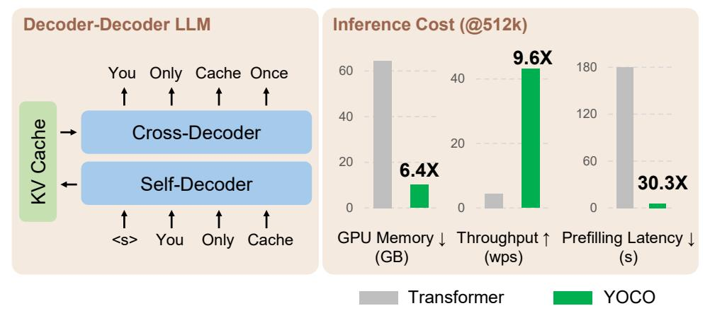
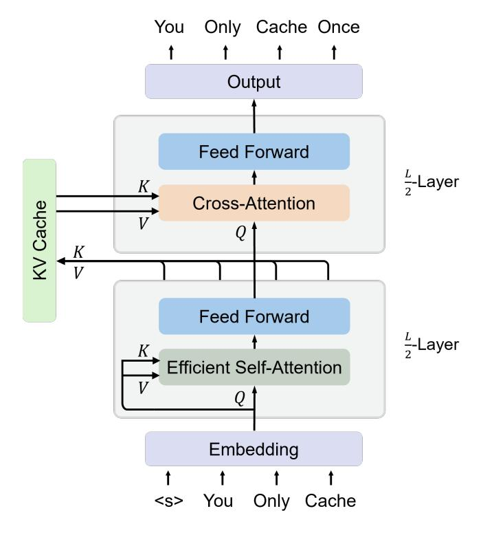
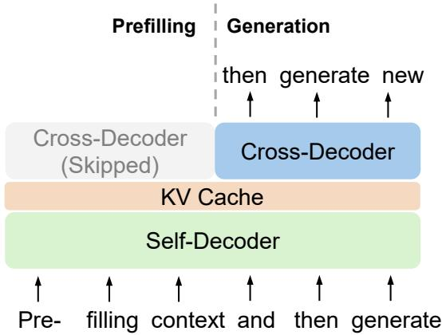
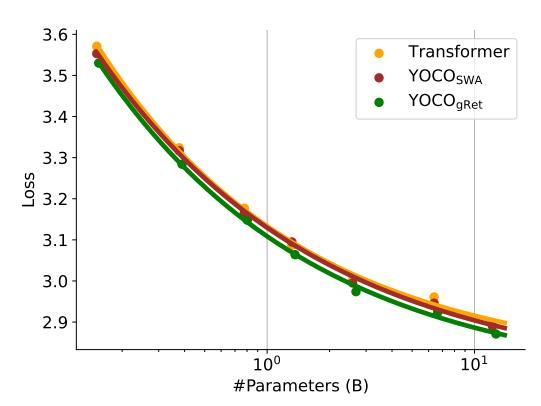
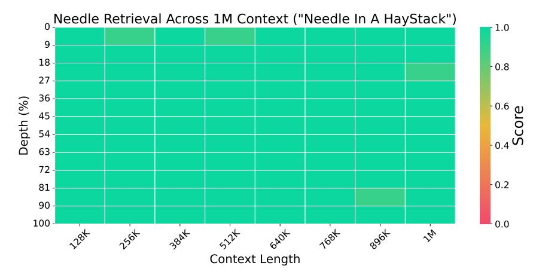
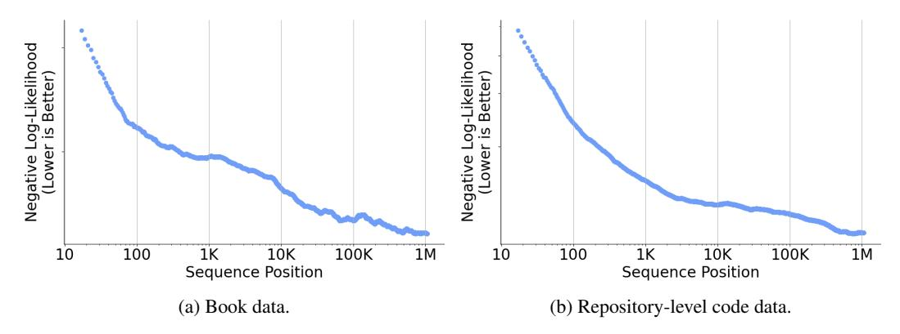
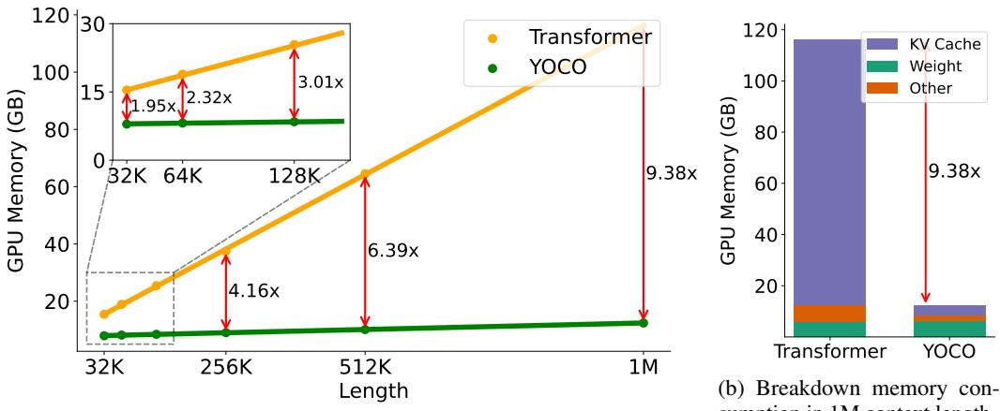
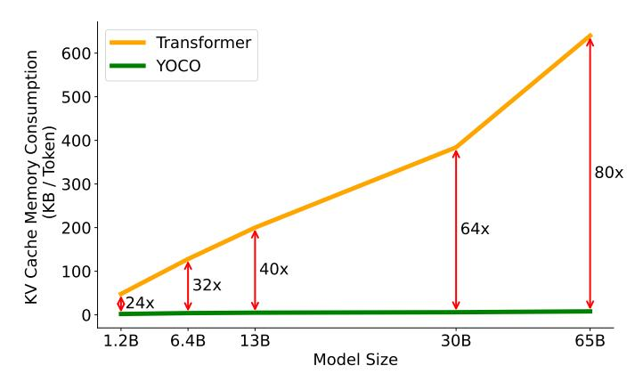
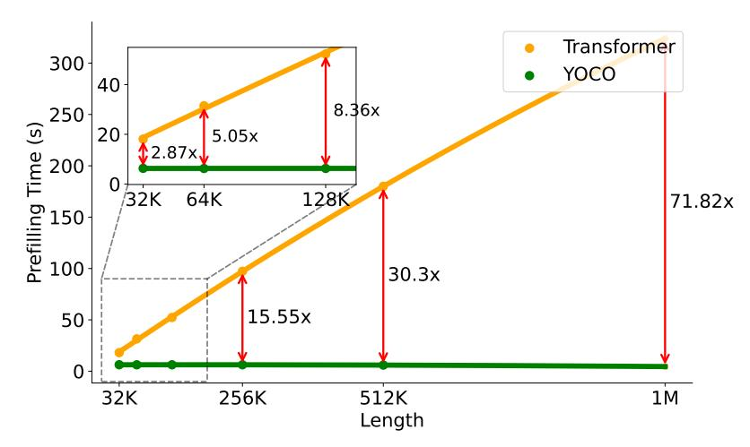
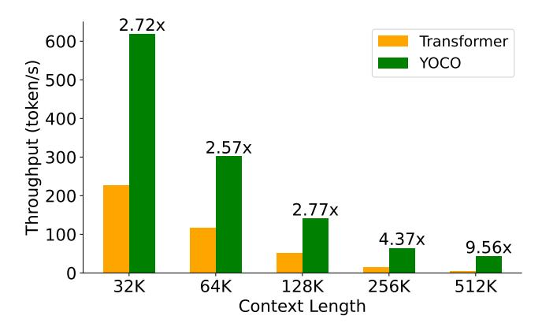

# Abstract

We introduce a decoder-decoder architecture, YOCO, for large language models, which only caches key-value pairs once. It consists of two components, i.e., a *crossdecoder* stacked upon a *self-decoder*. The self-decoder efficiently encodes global key-value (KV) caches that are reused by the cross-decoder via cross-attention. The overall model behaves like a decoder-only Transformer, although YOCO only caches once. The design substantially reduces GPU memory demands, yet retains global attention capability. Additionally, the computation flow enables prefilling to early exit without changing the final output, thereby significantly speeding up the prefill stage. Experimental results demonstrate that YOCO achieves favorable performance compared to Transformer in various settings of scaling up model size and number of training tokens. We also extend YOCO to 1M context length with near-perfect needle retrieval accuracy. The profiling results show that YOCO improves inference memory, prefill latency, and throughput by orders of magnitude across context lengths and model sizes. Code is available at <https://aka.ms/YOCO>.

Figure 1: We propose a decoder-decoder architecture, YOCO, for large language model, which only caches key/value once. YOCO markedly reduces the KV cache memory and the prefilling time, while being scalable in terms of training tokens, model size, and context length. The inference cost is reported to be 512K as the context length, and Figures [7](#page-9-0)[–10](#page-10-0) present more results for different lengths.

∗ Equal contribution. ⋄ Corresponding author.

### 1 Introduction

The decoder-only Transformer [VSP+17] has become the de facto architecture for language models. Numerous efforts have continued to develop suitable architectures for language modeling. There have been main strands of explorations. First, encoder-only language models, such as BERT [DCLT19], bidirectionally encode the input sequence. Second, encoder-decoder models, such as T5 [RSR+20], use a bidirectional encoder to encode input and a unidirectional decoder to generate output. Both of the above layouts struggle with autoregressive generation due to bidirectionality. Specifically, encoders have to encode the whole input and output tokens again for the next generation step. Although encoder-decoder can use only decoder to generate, the output tokens do not fully leverage the parameters of encoder, especially for multi-turn conversation. Third, decoder-only language models, such as GPT [BMR+20], generate tokens autoregressively. By caching the previously computed key/value vectors, the model can reuse them for the current generation step. The key-value (KV) cache avoids encoding the history again for each token, greatly improving the inference speed. This compelling feature establishes the decoder-only language model as the standard option.

However, as the number of serving tokens increases, the KV caches occupy a lot of GPU memory, rendering the inference of large language models memory-bounded [PDC+22]. For the example of a 65B-size language model (augmented with grouped-query attention [ALTdJ+23] and 8-bit KV quantization), 512K tokens occupy about 86GB GPU memory, which is even larger than the capacity of one H100-80GB GPU. In addition, the prefilling latency of long-sequence input is extremely high. For instance, using four H100 GPUs, the 7B language model (augmented with Flash-Decoding [DHMS23] and kernel fusion) requires about 110 seconds to prefill 450K tokens, and 380 seconds for 1M length. The above bottlenecks make it difficult to deploy long-context language models in practice.

In this work, we propose a decoder-decoder architecture, YOCO, for large language models, which only caches KV pairs once. Specifically, we stack cross-decoder upon self-decoder. Given an input sequence, the self-decoder utilizes efficient self-attention to obtain KV caches. Then the cross-decoder layers employ cross-attention to reuse the shared KV caches. The decoder-decoder architecture is conceptually similar to encoder-decoder, but the whole model behaves more like a decoder-only model from the external view. So, it naturally fits into autoregressive generation tasks, such as language modeling. First, because YOCO only caches once2, the GPU memory consumption of KV caches is significantly reduced. Second, the computation flow of the decoder-decoder architecture enables prefilling to early exit before entering the self-decoder. The nice property speeds up the prefill stage dramatically, improving user experience for long-context language models. Third, YOCO allows for more efficient system design for distributed long-sequence training. In addition, we propose gated retention for self-decoder, which augments retention [SDH+23] with a data-controlled gating mechanism.

We conduct extensive experiments to show that YOCO achieves favorable language modeling performance and has many advantages in terms of inference efficiency. Experimental results demonstrate that YOCO can be scaled up with more training tokens, larger model size, and longer context length. Specifically, we scale up the 3B YOCO model to trillions of training tokens, attaining results on par with prominent Transformer language models, such as StableLM [TBMR]. Moreover, the scaling curves ranging from 160M to 13B show that YOCO are competitive compared to Transformer. We also extend the context length of YOCO to 1M tokens, achieving near perfect needle retrieval accuracy. In the multi-needle test, YOCO obtains competitive results even compared to larger Transformers.

In addition to good performance on various tasks, the profiling results show that YOCO improves the GPU memory footprint, prefill latency, throughput, and serving capacity. In particular, the memory of KV caches can be reduced by about  $80\times$  for 65B models. Even for a 3B model, the overall inference memory consumption can be reduced by two times for 32K tokens and by more than nine times for 1M tokens. The prefill stage is speeded up by  $71.8\times$  for the 1M context and  $2.87\times$  for the 32K input. For example, for a 512K context, YOCO reduces the Transformer prefilling latency from 180 seconds to less than six seconds. The results position YOCO as a strong candidate model architecture for future large language models with native long-sequence support.

&lt;sup>2The word "once" refers to global KV cache. Strictly, self-decoder also needs to store a certain number of caches. As the self-decoder utilizes an efficient attention module, the cache size is bounded to a constant, which can be ignored compared to global caches when the sequence length is large.

Figure 2: Overview of the decoder-decoder architecture. Self-decoder generates the global KV cache. Then cross-decoder employs cross-attention to reuse the shared KV caches. Both self-decoder and cross-decoder use causal masking. The overall architecture behaves like a decoder-only Transformer, autoregressively generating tokens.

## 2 You Only Cache Once (YOCO)

The proposed architecture, named YOCO, is designed for autoregressive modeling, such as large language models (LLMs). As shown in Figure 2, the decoder-decoder architecture has two parts, i.e., self-decoder and cross-decoder. Specifically, YOCO is stacked with L blocks, where the first  $\frac{L}{2}$  layers are self-decoder while the rest modules are cross-decoder. Given an input sequence  $x=x_1\cdots x_{|x|}$ , the input embeddings are packed into  $X^0=[x_1,\cdots,x_{|x|}]\in\mathbb{R}^{|x|\times d_{\mathrm{model}}}$ , where  $d_{\mathrm{model}}$  is hidden dimension. We first obtain contextualized vector representations  $X^l=\mathrm{Self-Decoder}(X^{l-1}), l\in[1,\frac{L}{2}]$ , where  $X^{L/2}$  is used to produce KV caches  $\hat{K},\hat{V}$  for cross-decoder. Then we compute  $X^l=\mathrm{Cross-Decoder}(X^{l-1},\hat{K},\hat{V}), l\in[\frac{L}{2}+1,L]$  to get the output vectors  $X^L$ .

Both self- and cross-decoder follow a similar block layout (i.e., interleaved attention and feed-forward network) as in Transformer [VSP $^+$ 17]. We also include pre-RMSNorm [ZS19], SwiGLU [Sha20], and grouped-query attention [ALTdJ $^+$ 23] as improvements. The difference between the two parts lies in attention modules. Self-decoder (Section 2.1) uses efficient self-attention (e.g., sliding-window attention). In comparison, cross-decoder (Section 2.2) uses global cross-attention to attend to the shared KV caches produced by the output of the self-decoder.

#### 2.1 Self-Decoder

Self-decoder takes token embeddings  $X^0$  as input and compute intermediate vector representation  $M = X^{L/2}$ :

$$Y^{l} = \text{ESA}(\text{LN}(X^{l})) + X^{l}$$

$$X^{l+1} = \text{SwiGLU}(\text{LN}(Y^{l})) + Y^{l}$$
(1)

where ESA(·) represents efficient self-attention, SwiGLU(X) = (swish( $XW_G$ )  $\odot XW_1$ ) $W_2$ , and RMSNorm [ZS19] is used for LN(·). Causal masking is used for efficient self-attention.

Figure 3: YOCO Inference. Prefill: encode input tokens in parallel. **Generation**: decode output tokens one by one. The computation flow enables prefilling to early exit without changing the final output, Table 2: Prefilling time complexity of attention thereby significantly speeding up the prefill stage. modules. N, L, D are the same as above.

|                     | KV Cache Memory                             |
|---------------------|---------------------------------------------|
| Transformer YOCO | $\mathcal{O}(LND)$ $\mathcal{O}((N+L)D)$ |

Table 1: Inference memory complexity of KV caches. N, L, D are the sequence length, number of layers, and hidden dimension.

|             | <b>Prefilling Time</b> |
|-------------|------------------------|
| Transformer | $\mathcal{O}(LN^2D)$   |
| YOCO        | $\mathcal{O}(LND)$     |

The key property of the efficient self-attention module is  $\mathcal{O}(1)$  inference memory, i.e., constant number of KV caches. For example, the cache size of sliding-window attention [CGRS19] depends on the window size instead of the input length. More design choices (e.g., gated retention) of the efficient self-attention module are detailed in Section 3.

#### 2.2 Cross-Decoder

First, the output of the self-decoder  $X^{L/2}$  generates global KV caches  $\hat{K}$ ,  $\hat{V}$  for cross-decoder:

$$\hat{K} = \text{LN}(X^{L/2})W_K, \quad \hat{V} = \text{LN}(X^{L/2})W_V$$
 (2)

where  $W_K, W_V \in \mathbb{R}^{d \times d}$  are learnable weights. Then, cross-decoder layers are stacked after the self-decoder to obtain the final output vectors  $X^L$ . The KV caches  $\hat{K}, \hat{V}$  are reused by all the  $\frac{L}{2}$ cross-decoder modules:

$$\begin{split} \hat{Q}^l &= \text{LN}(X^l) W_Q^l \\ Y^l &= \text{Attention}(\hat{Q}^l, \hat{K}, \hat{V}) + X^l \\ X^{l+1} &= \text{SwiGLU}(\text{LN}(Y^l)) + Y^l \end{split} \tag{3}$$

where  $\operatorname{Attention}(\cdot)$  is standard multi-head attention [VSP+17], and  $W_Q^l \in \mathbb{R}^{d \times d}$  is a learnable matrix. Causal masking is also used for cross-attention. Because cross-attention is compatible with group query attention [ALTdJ+23], we can further save the memory consumption of KV caches. After obtaining  $X^L$ , a softmax classifier performs next-token prediction.

#### 2.3 Inference Advantages

In addition to competitive language modeling results, YOCO significantly reduces serving costs and improves inference performance. We report detailed inference comparisons in Section 4.4.

**Saving GPU Memory and Serving More Tokens.** Table 1 compares the memory complexity between Transformers and YOCO. Specifically, because global KV caches are reused and efficient self-attention needs constant caches, the number of caches is  $\mathcal{O}(N+CL)$ , where N is the input length, C is a constant (e.g., sliding window size), and L is the number of layers. For long sequences, CL is much smaller than N, so about O(N) caches are required, i.e., you only cache once.

In comparison, Transformer decoders have to store  $N \times L$  keys and values during inference. So YOCO roughly saves L times GPU memory for caches compared to Transformer decoders. Because the inference capacity bottleneck becomes KV caches (Figure 7b), our method enables us to serve many more tokens without being out of GPU memory. The increased batch size is also beneficial to inference throughput.

**Reducing Prefilling Time and Improving Throughput.** As shown in Figure 3, because the cross-decoder reuses the outputs of self-decoder, we can exit early before entering the cross-decoder during the prefill stage. The intriguing property of computation dependency greatly accelerates the prefilling speed.

First, only half the layers are needed for forward computation, i.e., at least half prefilling latency reduction. Second, the efficient attention modules of the self-decoder are usually fast. For the example of 512K context length, we can decrease the prefilling latency from 180 seconds (Transformer with optimized inference, such as Flash-Decoding and kernel fusion) to less than 6 seconds (Figure 9). Even for 32K length, YOCO has about three times speedup in terms of prefilling time. Table 2 compares prefilling time complexity of attention modules between Transformer and YOCO.

## 3 Design Choices of Self-Decoder

We can choose various efficient self-attention methods for self-decoder. As long as the module only requires constant inference memory, the cache memory complexity of the self-decoder depends on the number of layers. Moreover, a good module choice improves both training and deployment costs. In this work, we use gated retention (Section 3.1) or sliding-window attention (Section 3.2).

#### 3.1 Gated Retention

Gated retention (gRet, aka gRetNet or RetNet-3) augments retention [SDH+23] with a data-dependent gating mechanism, which achieves training parallelism, good performance, and low inference cost simultaneously for sequence modeling. We use gRet as the default efficient self-attention module in the experiments. The method unifies the parallel, recurrent, and chunkwise recurrent computation paradigms. These three representations are equivalent and can obtain the same computation results. The training process usually uses the parallel or chunkwise recurrent paradigms, while the inference stage can employ the recurrent paradigm for constant KV memory. We describe the three representations as follows:

**The Parallel Representation** The gated retention is defined as:

$$Q = (XW_Q) \odot \Theta, \quad K = (XW_K) \odot \overline{\Theta}, \quad V = XW_V, \quad \Theta_n = e^{in\theta}$$

$$\gamma = \operatorname{sigmoid}(XW_\gamma)^{1/\tau}, \quad D_{nm} = \begin{cases} \prod_{i=m+1}^n \gamma_i, & n \ge m \\ 0, & n < m \end{cases}$$

$$\operatorname{gRet}(X) = (QK^{\mathsf{T}} \odot D)V$$

$$(4)$$

where  $W_Q, W_K, W_V \in \mathbb{R}^{d \times d}$  and  $W_\gamma \in \mathbb{R}^{d \times 1}$  are learnable weights, and the temperature term  $\tau$  encourages  $\gamma$  to 1 for better memorization [YWS+23]. The data-controlled decay is head-wise [Kat23] rather than element-wise so that the computation can fully utilize NVIDIA tensor cores. Refer to [SDH+23] for more details about the other designs.

**The Recurrent Representation** Being equivalent to Equation (4), the output of gated retention can be computed recurrently. For the n-th timestep, the output is obtained via:

$$S_n = \gamma_n S_{n-1} + K_n^{\mathsf{T}} V_n$$
  

$$gRet(X_n) = Q_n S_n, \quad n = 1, \dots, |x|$$
(5)

where  $Q, K, V, \gamma$  are the same as in Equation (4). During auto-regressive inference, the self-decoder maintains  $S_n$  as the intermediate state for an efficient generation.

The Chunkwise Recurrent Representation The chunk-wise representation is a unified formulation of recurrent and parallel representations. Given chunk size B, the outputs are computed chunk by chunk. The computation is divided into inner-chunk and cross-chunk parts. Denote [i] as the i-th

chunk, i.e.,  $x_{[i]} = x_{(i-1)B+1}, \dots, x_{iB}$ , we compute the *i*-th chunk as:

$$\beta_{(i-1)B+j} = \prod_{k=(i-1)B+1}^{(i-1)B+j} \gamma_k, \quad D_{[i]}(j,k) = \frac{\beta_{(i-1)B+k}}{\beta_{(i-1)B+j}} \text{ if } j \leq k \text{ else } 0$$

$$R_i = K_{[i]}^{\mathsf{T}}(V_{[i]} \odot \frac{\beta_{iB}}{\beta_{[i]}}) + \beta_{iB}R_{i-1}, \quad \beta_{[i]}(j,k) = \beta_{(i-1)B+j}$$

$$gRet(X) = \underbrace{(Q_{[i]}K_{[i]}^{\mathsf{T}} \odot D_{[i]})V_{[i]}}_{\text{Inner-Chunk}} + \underbrace{(Q_{[i]}R_{i-1}) \odot \beta_{[i]}}_{\text{Cross-Chunk}}$$
(6)

where  $R_i$  is the intermediate state of the i-th chunk, and  $\beta$  summarizes the data-controlled decay  $\gamma$ . The proof in Appendix B shows the equivalence between the computation paradigms. The chunkwise paradigm combines the best of parallelism and recurrence, i.e., saving FLOPs compared with fully parallel computation and reducing the iterations compared to recurrent computation. During the training and prefill stages, the chunk-wise representation increases throughput and reduces GPU memory consumption.

**Multi-Head Gated Retention** Similar to multi-head attention [VSP+17] and multi-scale retention [SDH+23], we apply gated retention to each head and combine the outputs together:

$$\begin{aligned} \operatorname{head}_i &= \operatorname{gRet}(X) \\ Y &= \operatorname{GroupNorm}_h(\operatorname{Concat}(\operatorname{head}_1, \cdots, \operatorname{head}_n)) \end{aligned} \tag{7}$$
 
$$\operatorname{MHGR}(X) &= (\operatorname{swish}(XW_G) \odot Y)W_O$$

where  $W_G, W_O \in \mathbb{R}^{d \times d}$  are learnable matrices, and GroupNorm [WH18] normalizes each head [WMH+23]. We also apply swish gate to increase non-linearity [SDH+23].

#### 3.2 Sliding-Window Attention

Sliding-window attention [CGRS19] restricts the attention range into a fixed window size C. In contrast, vanilla Transformer decoders attend to all previous tokens. During inference, the KV cache memory complexity can be reduced from  $\mathcal{O}(N)$  to  $\mathcal{O}(C)$ , i.e., the memory usage is constant rather than increasing with sequence length. Similar to multi-head self-attention [VSP+17], we compute the output of sliding-window attention via:

$$Q = XW_Q, \quad K = XW_K, \quad V = XW_V$$

$$\operatorname{head}_i = \operatorname{softmax}(Q_{[i]}K_{[i]}^{\mathsf{T}} + B)V$$

$$B_{ij} = \begin{cases} 0, & i - C < j \leq i \\ -\infty, & \text{otherwise} \end{cases}$$

$$Y = \operatorname{Concat}(\operatorname{head}_1, \cdots, \operatorname{head}_h)$$

$$\operatorname{SWA}(X) = YW_O$$

$$(8)$$

where  $W_Q, W_K, W_V, W_O \in \mathbb{R}^{d \times d}$  are learnable matrices, and the window causal mask B controls each query only attends to the previous keys whose distances are less than C. The pre-normalization and residual connection are also applied to the module.

## 4 Experiments

We evaluate YOCO for large language models from the following perspectives. First, we follow the setting of StableLM-3B-4E1T [TBMR] to scale up training tokens (Section 4.1). Second, we present the scaling curves of the proposed architectures (Section 4.2). Third, we scale up the YOCO model to 1M context length and evaluate its long-sequence modeling capability (Section 4.3). Fourth, we analyze the deployment advantages, including GPU memory footprint, serving capacity, prefilling time, and throughput (Section 4.4). Experimental results show that YOCO achieves competitive performance across various evaluation metrics. More importantly, the proposed method significantly reduces the inference cost.

| Model                       | ARC-C     | ARC-E | BoolQ | Hellaswag | OBQA  | PIQA  | Winogrande | SciQ  | Avg   |
|-----------------------------|-----------|-------|-------|-----------|-------|-------|------------|-------|-------|
| Training with 1T tokens     |           |       |       |           |       |       |            |       |       |
| OpenLLaMA-3B-v2             | 0.339     | 0.676 | 0.657 | 0.700     | 0.260 | 0.767 | 0.629      | 0.924 | 0.619 |
| StableLM-base-alpha-3B-v2   | 0.324     | 0.673 | 0.646 | 0.686     | 0.264 | 0.760 | 0.621      | 0.921 | 0.612 |
| StableLM-3B-4EÎT            | _         | 0.666 |       | _         |       | 0.768 | 0.632      | 0.914 |       |
| YOCO-3B                     | 0.379     | 0.731 | 0.645 | 0.689     | 0.298 | 0.763 | 0.639      | 0.924 | 0.634 |
| Training with 1.6T tokens   |           |       |       |           |       |       |            |       |       |
| StableLM-3B-4E1T            | _         | 0.688 |       | _         | _     | 0.762 | 0.627      | 0.913 | _     |
| YOCO-3B                     | 0.396     | 0.733 | 0.644 | 0.698     | 0.300 | 0.764 | 0.631      | 0.921 | 0.636 |
| Extending context length to | 1M tokens |       |       |           |       |       |            |       |       |
| YOCO-3B-1M                  | 0.413     | 0.747 | 0.638 | 0.705     | 0.300 | 0.773 | 0.651      | 0.932 | 0.645 |

Table 3: Eval Harness [GTA+23] results compared with previous well-trained Transformer language models [TBMR, Tow, GL23]. We scale the 3B model to 1.6 trillion training tokens. The 1T and 1.6T results of StableLM-3B-4E1T are taken from its technical report [TBMR]. YOCO-3B-1M is extended to the context length of 1M tokens.

#### 4.1 Language Modeling Evaluation

We train a 3B-size YOCO language models by scaling up the number of training tokens. Then we compare the checkpoints with strong Transformer-based language models.

**Setup** We use a similar training recipe as in StableLM-3B-4E1T [TBMR]. We adjust the head dimension to 128 instead of 80 as in StableLM for better kernel support. In order to keep the model size unchanged, we set the hidden size to 3072 and the number of layers to 26. Grouped-query attention [ALTdJ+23] is used, where the number of query heads is 24, and the number of key-value heads is 8. We train YOCO with gated retention (Section 3.1). The non-embedding parameter count is 2.8B. In comparison, StableLM-3B-4E1T is 2.7B and OpenLLaMA-v2-3B [GL23] is 3.2B. The training sequence length is 4096. The batch size is 4M tokens. We use the AdamW [LH19] optimizer with  $\beta = 0.9, 0.95$ . The maximal learning rate is 3.2e-4 with 1000 warmup steps and linear decay to 1.28e-5. The total schedule is set to 5T tokens. We train the model with 400k steps (i.e., 1.6T tokens) given the resource budget. The curated training corpus is similar to [TBMR]. We use tiktoken-c1100k\_base as the tokenizer. Detailed hyperparameters are described in Appendix C.

**Results** Table 3 compares the YOCO checkpoints with OpenLLaMA-v2-3B [GL23], StableLM-base-alpha-3B-v2 [Tow], and StableLM-3B-4E1T [TBMR]. We use LM Eval Harness [GTA+23] to evaluate the zero-shot performance on various downstream tasks. OpenLLaMA-v2-3B and StableLM-base-alpha-3B-v2 are trained with 1T tokens. The intermediate numbers of StableLM-3B-4E1T are taken from its technical report [TBMR]. Experimental results across end tasks indicate that YOCO achieves comparable results with previous well-tuned Transformer language models. Both the checkpoints trained with 1T tokens and 1.6T tokens obtain consistent trend. Moreover, the results show that YOCO is scalable in terms of training tokens.

#### 4.2 Scalability Compared with Transformers

We compare the scaling curves between Llama Transformer [VSP+17, TLI+23], YOCO with gated retention (YOCOgRet; Section 3.1), and YOCO with sliding-window attention (YOCOSWA; Section 3.2). We train language models of various sizes (i.e., 160M, 400M, 830M, 1.4B, 2.7B, 6.8B, and 13B) using the same training data and settings. The validation loss is used as the evaluation metric. The scaling law [KMH+20] is supposed to extrapolate larger-size performance.

**Setup** We augment the Transformer architecture with Llama [TLI+23] improvements, such as RMSNorm [ZS19], SwiGLU [Sha20], and removing bias. The sliding window size

Figure 4: LM loss decreases along with scaling up the model size (ranging from 160M to 13B).

Figure 5: Needle-in-a-haystack results in 1M length.

| Model                               | Size | N = 1 | N = 2 | N = 4 | N = 8 |
|-------------------------------------|------|-------|-------|-------|-------|
| YaRN-Mistral-128K [PQFS23]          | 7B   | 0.02  | 0.12  | 0.08  | 0.20  |
| LWM-1M-text [LYZA24]                | 7B   | 1.00  | 0.90  | 0.76  | 0.62  |
| MiniCPM-128K [HTH+24]               | 2.4B | 1.00  | 1.00  | 0.54  | 0.56  |
| ChatGLM3-128K [ZLD + 22] | 6B   | 0.94  | 0.72  | 0.52  | 0.44  |
| YOCO-3B-1M                          | 3B   | 0.98  | 0.98  | 0.84  | 0.56  |

Table 4: Multi-needle retrieval accuracy. N indicates the number of needles. N=1 is single-needle retrieval used as a reference, and N>1 indicates the multi-needle test. The evaluation is conducted in 128K length, because most previous long-context models are tuned with this length.

of YOCOSWA is 1,024. We align the number of parameters by adjusting the FFN intermediate dimension. The training batch size is 0.25M tokens with a 2k sequence length. We train the models with 40k steps, i.e., 10B tokens. In practice, we find that the setting is effective for loss convergence, and the scaling laws can be well-fitted. More hyperparameters are detailed in Appendix D.

**Results** Figure 4 reports the validation loss with various parameter counts. We also fit the scaling curves as in [KMH $^+$ 20]. YOCO obtains comparable performance from 160M to 13B compared to the Llama-optimized transformer architecture. The findings demonstrate that YOCO scales effectively with respect to model size. Moreover, YOCOgRet outperforms Transformer and YOCOSWA. The gains come from hybrid architectures of attention and retention, whose inductive biases tend to be complementary to each other. We observed similar gains by interleaving the attention and retention modules (1:3). Recent hybrid architectures [LLB $^+$ 24] also confirm similar findings.

#### 4.3 Long-Context Evaluation

We extend the context length of YOCO-3B (Section 4.1) to 1M tokens. We evaluate long-context models on needle retrieval and language modeling tasks.

We continue the model training with longer lengths progressively. The length schedule is 64K, 256K, and 1M tokens. The batch size is kept the same as before. The learning rate and RoPE [SLP+21]  $\theta$  are set as in Table 7. Training data is up-sampled according to sequence length [FPN+24]. For a fair comparison, we do not use long-instruction tuning data. More training details are described in Appendix E. A chunk parallelism algorithm for YOCO is proposed in Appendix A, which reduces communication overhead and GPU memory fragmentation in our experiments of 1M length.

**Needle In A Haystack** The pressure test evaluates whether models can retrieve "needles" from a long document [Kam23]. We follow the evaluation setting of Gemini 1.5 [RST+24] and LWM [LYZA24]. The needles are constructed as a city with a magic number. We run 10 times at the same depth and length. The averaged accuracy is reported. Figure 5 shows that YOCO-3B-1M passes the Needle-In-A-Haystack test with near perfect accuracy. The results indicate that YOCO has strong long-context modeling capability.

Figure 6: Cumulative average negative log-likelihood on book and repository-level code. We filter the validation examples that are longer than 1M tokens. YOCO achieves improved performance with longer context, i.e., utilizing long-distance information for language modeling.

Multi-Needle Retrieval Besides the above single-needle retrieval, we conduct a multi-needle evaluation. We compare YOCO-3B-1M with previous long-context language models, including MiniCPM-128K [\[HTH](#page-12-7)+24], ChatGLM3-128K [\[ZLD](#page-14-3)+22], YaRN-Mistral-128K [\[PQFS23\]](#page-13-9), and LWM-1M-text [\[LYZA24\]](#page-12-6). The evaluation is conducted in 128K sequence length, because most previous models are tuned with this length.

Table [4](#page-7-2) reports the accuracy with N needles. Among these models, LWM-1M-text and YOCO-3B-1M are trained with a 1M context length, while the others are in 128K length. Although LWM-1M-text continues training of Llama-2-7B, YOCO-3B-1M can still achieve comparable performance with half the model size. Moreover, the 7B-size YaRN-Mistral-128K [\[PQFS23\]](#page-13-9) obtained by postion interpolation lags behind the other models. Compared to MiniCPM-128K and ChatGLM3-128K, YOCO-3B-1M also outperforms these well-trained language models.

Perplexity over Long Sequences Figure [6](#page-8-1) shows the cumulative average negative log-likelihood (NLL) as a function of context length. We evaluate both book and repository-level code data. We follow the setting of [\[RST](#page-13-11)+24] and filter validation data that are longer than 1M tokens. NLL decreases consistently with longer sequence length. The results indicate that YOCO can effectively utilize long-distance dependency for language modeling. We also observe that the NLL-length curves tend to fit the power law, where the gaps are affected by the noise within the validation examples.

#### 4.4 Inference Advantages

We analyze inference efficiency from various perspectives, such as GPU memory footprint, prefilling latency, throughput, and serving capacity. We demonstrate that YOCO reduces the deployment cost by orders of magnitude, especially for long-sequence inference. More importantly, the user experience (such as latency) is improved while maintaining good performance and reducing expenses.

We compare YOCOgRet with Transformer. The default model configuration follows Section [4.1.](#page-6-0) Notice that Transformer uses grouped-query attention [\[ALTdJ](#page-11-2)+23], Flash-Decoding [\[DHMS23\]](#page-12-0), and kernel fusion for a fair comparison. As described in Section [3.1,](#page-4-1) gated retention uses the chunkrecurrent representation in the prefill stage, and the recurrent representation in the generation stage. The chunk size is set to 256. We implement a Triton [\[TC19\]](#page-13-12) kernel for gated retention. The evaluation sequence length is ranging from 32K to 1M. The last 1,024 tokens are supposed to be generated, while the previous tokens are given input context. The experiments are conducted with H100-80GB GPU cards.

GPU Memory The inference memory consumption is made up of three parts, namely model weights, intermediate activation, and KV cache. Figure [7b](#page-9-0) presents the breakdown memory profiling results. Along with an increase in context length, the main memory bottleneck becomes KV caches, while model weights consume constant memory. The results show that YOCOgRet alleviates the activation cost and KV cache memory footprint.

(a) Inference memory of Transformer and YOCO across various lengths.

sumption in 1M context length.

Figure 7: GPU memory consumption during inference.

Figure 8: GPU memory consumption of KV cache for each token with different model size. YOCO can save more for larger model size.

As shown in Figure 7a, the memory cost is significantly reduced using YOCO. Moreover, the memory consumption of YOCO increases slowly along the sequence length. For example of 1M length, the overall inference memory usage is only 12.4GB, while Transformers occupy 9.4× GPU memory. YOCO makes it feasible to deploy long-sequence modeling on customer-level GPUs. Even with a 32K sequence length, YOCO requires about 2× less memory than Transformer. Although we compare 3B-size models here, the reduction ratio becomes larger as the number of layers increases.

Figure 8 reports the GPU memory consumption of KV cache for each token. As YOCO only caches one layer of global key-value pairs, it needs roughly L times fewer memory compared to Transformer. For example, YOCO can serve 128K tokens with 1GB GPU memory, while Transformer with GQA [ALTdJ+23] can only support 1.6K tokens at 65B model size.

**Prefilling Latency** In the prefill stage, the model encodes input tokens in parallel. As shown in Figure 9, the prefilling latency is a pain point of user experience for long-context models. For 512Kand 1M-length input sequences, Transformer needs about 180 seconds and 300 seconds, respectively. The computational complexity of Transformer is  $\mathcal{O}(N^2)$ , which requires a large number of FLOPs for long context. In contrast, YOCO's prefilling time is  $\mathcal{O}(N)$ , growing linearly (Section 2.3) along the sequence length.

Figure 9 shows that YOCO reduces the Transformer prefilling time from 180 seconds to less than 6 seconds for 512K context. As described in Section 2.3, the prefill stage can early exit before entering cross-decoder. So, there is at least two times speedup of prefilling latency even for short context. For example, YOCO is  $2.87 \times$  faster than Transformer for 32K length.

Figure 9: Prefilling latency for different length, i.e., the encoding time of given input prompt before generating the first token. Transformer's time grows quadratically while YOCO's grows linearly. Even for a short input length, such as 32K, YOCO can still accelerate  $2.87 \times$ .

Figure 10: Inference throughput of Transformer and YOCO varying the context length.

**Throughput** The throughput indicates how many tokens the model can process per second, involving both pre-filling and generation time. Figure 10 shows that YOCO achieves higher throughput across context lengths compared to Transformer. For the example of 512K queries, Transformer's throughput is 4.5 token/s while YOCO reaches 43.1 token/s, i.e, achieving  $9.6\times$  speedup. The throughput is improved for the following reasons. First, YOCO decreases the time required for prefilling as previously demonstrated. Second, as the memory consumption is reduced, we can use larger batch size for inference, which also contributes to the throughput improvement.

#### 5 Conclusion

In this work, we propose a decoder-decoder architecture (YOCO) for large language modeling. YOCO achieves significantly better inference efficiency and competitive performance compared with Transformers. Experimental results demonstrate that YOCO achieves favorable results for large language models under various settings, i.e., scaling up number of training tokens, scaling up model size, and scaling up context length to 1M tokens. Profiling results also show that YOCO improves inference efficiency by orders of magnitude, especially for long-sequence modeling.

The work can be advanced from the following perspectives:

• YOCO + BitNet + Groq. Groq achieves very high throughput by putting all things within SRAM. However, the memory capacity bottleneck limits the model size and input token count. Now, hundreds of chips are connected to host just one model. As a solution, YOCO reduces KV cache

- memory, and BitNet reduces model weight memory. The LLM deployment cost is expected to be reduced by orders of magnitude using the above combination.
- YOCO for Multimodal Large Language Models. The YOCO layout is general to the use of multiple self-decoders. The cross-attention layers are natural for multimodal fusion [BWD+22, WBD+22]. The causal dependency of self-decoders also perfectly fits in streaming video. The async multimodal large language models can avoid different data steams block each other, which is critical for real-time applications, such as robotics.
- Optimized Mechanism for KV Cache Module. Figure 2 explicitly highlights KV cache, which opens up new opportunities to develop native memory mechanisms. First, we can integrate a cache compression mechanism to obtain more compact memory. Second, we can build an index [WDC+23] for efficient key-value retrieval. As YOCO reuses caches, it enables us to maintain only one index rather than creating an index for each layer. Third, the disentangled modeling supports pre-caching context, which is potentially useful for native RAG and LLM-native search engines.

## Acknowledgement

We would like to acknowledge Ben Huntley for maintaining the GPU cluster. The long-sequence training utilizes CUBE, which is an internal version of [LML+23]. We implement the Triton kernel of gated retention based on FLA [YZ24].

#### References

- [AET+23] Simran Arora, Sabri Eyuboglu, Aman Timalsina, Isys Johnson, Michael Poli, James Zou, Atri Rudra, and Christopher Ré. Zoology: Measuring and improving recall in efficient language models. *arXiv preprint arXiv:2312.04927*, 2023.
- [ALTdJ+23] Joshua Ainslie, James Lee-Thorp, Michiel de Jong, Yury Zemlyanskiy, Federico Lebrón, and Sumit Sanghai. Training generalized multi-query transformer models from multi-head checkpoints. *arXiv preprint arXiv:2305.13245*, 2023.
- [BMR+20] Tom Brown, Benjamin Mann, Nick Ryder, Melanie Subbiah, Jared D Kaplan, Prafulla Dhariwal, Arvind Neelakantan, Pranav Shyam, Girish Sastry, Amanda Askell, Sandhini Agarwal, Ariel Herbert-Voss, Gretchen Krueger, Tom Henighan, Rewon Child, Aditya Ramesh, Daniel Ziegler, Jeffrey Wu, Clemens Winter, Chris Hesse, Mark Chen, Eric Sigler, Mateusz Litwin, Scott Gray, Benjamin Chess, Jack Clark, Christopher Berner, Sam McCandlish, Alec Radford, Ilya Sutskever, and Dario Amodei. Language models are few-shot learners. In Advances in Neural Information Processing Systems, volume 33, pages 1877–1901. Curran Associates, Inc., 2020.
- [BWD+22] Hangbo Bao, Wenhui Wang, Li Dong, Qiang Liu, Owais Khan Mohammed, Kriti Aggarwal, Subhojit Som, Songhao Piao, and Furu Wei. VLMo: Unified vision-language pretraining with mixture-of-modality-experts. In Alice H. Oh, Alekh Agarwal, Danielle Belgrave, and Kyunghyun Cho, editors, Advances in Neural Information Processing Systems, 2022.
- [CGRS19] Rewon Child, Scott Gray, Alec Radford, and Ilya Sutskever. Generating long sequences with sparse Transformers. *URL https://openai.com/blog/sparse-transformers*, 2019.
- [DCLT19] Jacob Devlin, Ming-Wei Chang, Kenton Lee, and Kristina Toutanova. BERT: Pretraining of deep bidirectional transformers for language understanding. In *Proceedings of the 2019 Conference of the North American Chapter of the Association for Computational Linguistics: Human Language Technologies, Volume 1 (Long and Short Papers)*, pages 4171–4186, Minneapolis, Minnesota, June 2019. Association for Computational Linguistics.
- [DFS+22] Tri Dao, Daniel Y Fu, Khaled K Saab, Armin W Thomas, Atri Rudra, and Christopher Ré. Hungry hungry hippos: Towards language modeling with state space models. *arXiv* preprint arXiv:2212.14052, 2022.

- [DHMS23] Tri Dao, Daniel Haziza, Francisco Massa, and Grigory Sizov. Flash-Decoding for longcontext inference. [https://crfm.stanford.edu/2023/10/12/flashdecoding.](https://crfm.stanford.edu/2023/10/12/flashdecoding.html) [html](https://crfm.stanford.edu/2023/10/12/flashdecoding.html), 2023.
- [DMD+23] Jiayu Ding, Shuming Ma, Li Dong, Xingxing Zhang, Shaohan Huang, Wenhui Wang, Nanning Zheng, and Furu Wei. Longnet: Scaling transformers to 1,000,000,000 tokens. *arXiv preprint arXiv:2307.02486*, 2023.
- [FPN+24] Yao Fu, Rameswar Panda, Xinyao Niu, Xiang Yue, Hanna Hajishirzi, Yoon Kim, and Hao Peng. Data engineering for scaling language models to 128k context. *ArXiv*, abs/2402.10171, 2024.
  - [GD23] Albert Gu and Tri Dao. Mamba: Linear-time sequence modeling with selective state spaces. *arXiv preprint arXiv:2312.00752*, 2023.
  - [GL23] Xinyang Geng and Hao Liu. OpenLLaMA: An open reproduction of LLaMA. [https:](https://github.com/openlm-research/open_llama) [//github.com/openlm-research/open\\_llama](https://github.com/openlm-research/open_llama), 2023.
- [GTA+23] Leo Gao, Jonathan Tow, Baber Abbasi, Stella Biderman, Sid Black, Anthony DiPofi, Charles Foster, Laurence Golding, Jeffrey Hsu, Alain Le Noac'h, Haonan Li, Kyle McDonell, Niklas Muennighoff, Chris Ociepa, Jason Phang, Laria Reynolds, Hailey Schoelkopf, Aviya Skowron, Lintang Sutawika, Eric Tang, Anish Thite, Ben Wang, Kevin Wang, and Andy Zou. A framework for few-shot language model evaluation, 12 2023.
- [HTH+24] Shengding Hu, Yuge Tu, Xu Han, Chaoqun He, Ganqu Cui, Xiang Long, Zhi Zheng, Yewei Fang, Yuxiang Huang, Weilin Zhao, et al. Minicpm: Unveiling the potential of small language models with scalable training strategies. *arXiv preprint arXiv:2404.06395*, 2024.
- [Kam23] Greg Kamradt. Needle in a Haystack - pressure testing llms. [https://github.com/](https://github.com/gkamradt/LLMTest_NeedleInAHaystack/tree/main) [gkamradt/LLMTest\\_NeedleInAHaystack/tree/main](https://github.com/gkamradt/LLMTest_NeedleInAHaystack/tree/main), 2023.
- [Kat23] Tobias Katsch. Gateloop: Fully data-controlled linear recurrence for sequence modeling. *arXiv preprint arXiv:2311.01927*, 2023.
- [KMH+20] Jared Kaplan, Sam McCandlish, Tom Henighan, Tom B. Brown, Benjamin Chess, Rewon Child, Scott Gray, Alec Radford, Jeffrey Wu, and Dario Amodei. Scaling laws for neural language models. *CoRR*, abs/2001.08361, 2020.
  - [LH19] Ilya Loshchilov and Frank Hutter. Decoupled weight decay regularization. In *International Conference on Learning Representations*, 2019.
- [LLB+24] Opher Lieber, Barak Lenz, Hofit Bata, Gal Cohen, Jhonathan Osin, Itay Dalmedigos, Erez Safahi, Shaked Meirom, Yonatan Belinkov, Shai Shalev-Shwartz, Omri Abend, Raz Alon, Tomer Asida, Amir Bergman, Roman Glozman, Michael Gokhman, Avashalom Manevich, Nir Ratner, Noam Rozen, Erez Shwartz, Mor Zusman, and Yoav Shoham. Jamba: A hybrid Transformer-Mamba language model. *CoRR*, abs/2403.19887, 2024.
- [LML+23] Zhiqi Lin, Youshan Miao, Guodong Liu, Xiaoxiang Shi, Quanlu Zhang, Fan Yang, Saeed Maleki, Yi Zhu, Xu Cao, Cheng Li, Mao Yang, Lintao Zhang, and Lidong Zhou. SuperScaler: Supporting flexible DNN parallelization via a unified abstraction, 2023.
- [LXLY21] Shenggui Li, Fuzhao Xue, Yongbin Li, and Yang You. Sequence parallelism: Making 4d parallelism possible. *arXiv preprint arXiv:2105.13120*, 2021.
- [LYZA24] Hao Liu, Wilson Yan, Matei Zaharia, and Pieter Abbeel. World model on million-length video and language with ringattention. *arXiv preprint arXiv:2402.08268*, 2024.
  - [LZA23] Hao Liu, Matei Zaharia, and Pieter Abbeel. Ring attention with blockwise transformers for near-infinite context. *arXiv preprint arXiv:2310.01889*, 2023.

- [PDC+22] Reiner Pope, Sholto Douglas, Aakanksha Chowdhery, Jacob Devlin, James Bradbury, Anselm Levskaya, Jonathan Heek, Kefan Xiao, Shivani Agrawal, and Jeff Dean. Efficiently scaling Transformer inference. *ArXiv*, abs/2211.05102, 2022.
- [PQFS23] Bowen Peng, Jeffrey Quesnelle, Honglu Fan, and Enrico Shippole. Yarn: Efficient context window extension of large language models. *arXiv preprint arXiv:2309.00071*, 2023.
- [RSR+20] Colin Raffel, Noam Shazeer, Adam Roberts, Katherine Lee, Sharan Narang, Michael Matena, Yanqi Zhou, Wei Li, and Peter J. Liu. Exploring the limits of transfer learning with a unified text-to-text transformer. *Journal of Machine Learning Research*, 21(140):1–67, 2020.
- [RST+24] Machel Reid, Nikolay Savinov, Denis Teplyashin, Dmitry Lepikhin, Timothy Lillicrap, Jean-baptiste Alayrac, Radu Soricut, Angeliki Lazaridou, Orhan Firat, Julian Schrittwieser, et al. Gemini 1.5: Unlocking multimodal understanding across millions of tokens of context. *arXiv preprint arXiv:2403.05530*, 2024.
- [SDH+23] Yutao Sun, Li Dong, Shaohan Huang, Shuming Ma, Yuqing Xia, Jilong Xue, Jianyong Wang, and Furu Wei. Retentive network: A successor to transformer for large language models. *arXiv preprint arXiv:2307.08621*, 2023.
  - [Sha20] Noam Shazeer. Glu variants improve transformer. *arXiv preprint arXiv:2002.05202*, 2020.
- [SIE+23] Uri Shaham, Maor Ivgi, Avia Efrat, Jonathan Berant, and Omer Levy. Zeroscrolls: A zero-shot benchmark for long text understanding. *arXiv preprint arXiv:2305.14196*, 2023.
- [SLP+21] Jianlin Su, Yu Lu, Shengfeng Pan, Bo Wen, and Yunfeng Liu. Roformer: Enhanced transformer with rotary position embedding. *arXiv preprint arXiv:2104.09864*, 2021.
- [TBMR] Jonathan Tow, Marco Bellagente, Dakota Mahan, and Carlos Riquelme. StableLM 3B 4E1T. <https://aka.ms/StableLM-3B-4E1T>.
- [TC19] Philippe Tillet and David Cox. Triton: an intermediate language and compiler for tiled neural network computations. In *Proceedings of the 3rd ACM SIGPLAN International Workshop on Machine Learning and Programming Languages*, pages 10–19, 2019.
- [TLI+23] Hugo Touvron, Thibaut Lavril, Gautier Izacard, Xavier Martinet, Marie-Anne Lachaux, Timothée Lacroix, Baptiste Rozière, Naman Goyal, Eric Hambro, Faisal Azhar, et al. Llama: Open and efficient foundation language models. *arXiv preprint arXiv:2302.13971*, 2023.
  - [Tow] Jonathan Tow. StableLM Alpha v2 models. [https://huggingface.co/](https://huggingface.co/stabilityai/stablelm-base-alpha-3b-v2) [stabilityai/stablelm-base-alpha-3b-v2](https://huggingface.co/stabilityai/stablelm-base-alpha-3b-v2).
- [VSP+17] Ashish Vaswani, Noam Shazeer, Niki Parmar, Jakob Uszkoreit, Llion Jones, Aidan N. Gomez, Lukasz Kaiser, and Illia Polosukhin. Attention is all you need. In *Advances in Neural Information Processing Systems 30: Annual Conference on Neural Information Processing Systems 2017, 4-9 December 2017, Long Beach, CA, USA*, pages 6000– 6010, 2017.
- [WBD+22] Wenhui Wang, Hangbo Bao, Li Dong, Johan Bjorck, Zhiliang Peng, Qiang Liu, Kriti Aggarwal, Owais Khan Mohammed, Saksham Singhal, Subhojit Som, et al. Image as a foreign language: BEiT pretraining for all vision and vision-language tasks. *arXiv preprint arXiv:2208.10442*, 2022.
- [WDC+23] Weizhi Wang, Li Dong, Hao Cheng, Xiaodong Liu, Xifeng Yan, Jianfeng Gao, and Furu Wei. Augmenting language models with long-term memory. In *Thirty-seventh Conference on Neural Information Processing Systems*, 2023.
  - [WH18] Yuxin Wu and Kaiming He. Group normalization. In *Proceedings of the European conference on computer vision (ECCV)*, pages 3–19, 2018.

- [WMH+23] Hongyu Wang, Shuming Ma, Shaohan Huang, Li Dong, Wenhui Wang, Zhiliang Peng, Yu Wu, Payal Bajaj, Saksham Singhal, Alon Benhaim, Barun Patra, Zhun Liu, Vishrav Chaudhary, Xia Song, and Furu Wei. Magneto: A foundation Transformer. In *Proceedings of the 40th International Conference on Machine Learning*, volume 202, pages 36077–36092, 2023.
- [XLM+23] Wenhan Xiong, Jingyu Liu, Igor Molybog, Hejia Zhang, Prajjwal Bhargava, Rui Hou, Louis Martin, Rashi Rungta, Karthik Abinav Sankararaman, Barlas Oguz, et al. Effective long-context scaling of foundation models. *arXiv preprint arXiv:2309.16039*, 2023.
- [YWS+23] Songlin Yang, Bailin Wang, Yikang Shen, Rameswar Panda, and Yoon Kim. Gated linear attention transformers with hardware-efficient training. *arXiv preprint arXiv:2312.06635*, 2023.
  - [YZ24] Songlin Yang and Yu Zhang. FLA: A Triton-based library for hardware-efficient implementations of linear attention mechanism. [https://github.com/sustcsonglin/](https://github.com/sustcsonglin/flash-linear-attention) [flash-linear-attention](https://github.com/sustcsonglin/flash-linear-attention), 2024.
- [ZLD+22] Aohan Zeng, Xiao Liu, Zhengxiao Du, Zihan Wang, Hanyu Lai, Ming Ding, Zhuoyi Yang, Yifan Xu, Wendi Zheng, Xiao Xia, et al. GLM-130B: An open bilingual pretrained model. *arXiv preprint arXiv:2210.02414*, 2022.
  - [ZS19] Biao Zhang and Rico Sennrich. Root mean square layer normalization. *Advances in Neural Information Processing Systems*, 32, 2019.

