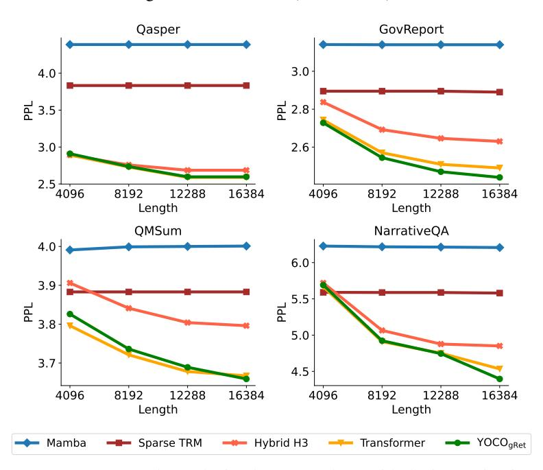

# <span id="page-15-0"></span>B Chunk-wise Representation of Gated Retention

We illustrate the equivalence between recurrent representation and chunkwise recurrent representation of gated retention. For the output On, n can be split as n = kB + r where B is the chunk size:

$$O_{n} = \sum_{m=1}^{n} \prod_{i=m+1}^{n} \gamma_{i} Q_{n} K_{m}^{\mathsf{T}} V_{m} = \sum_{m=kB+1}^{n} \prod_{i=m+1}^{n} \gamma_{i} Q_{n} K_{m}^{\mathsf{T}} V_{m} + \sum_{m=1}^{kB} \prod_{i=m+1}^{n} \gamma_{i} Q_{n} K_{m}^{\mathsf{T}} V_{m}$$

$$\sum_{m=kB+1}^{n} \prod_{i=m+1}^{n} \gamma_{i} Q_{n} K_{m}^{\mathsf{T}} V_{m} = (Q_{n} K_{kB+1:n}^{\mathsf{T}} \odot \Gamma_{kB+1:n}) V_{kB+1:n}$$

$$\sum_{m=1}^{kB} \prod_{i=m+1}^{n} \gamma_{i} Q_{n} K_{m}^{\mathsf{T}} V_{m} = (Q_{n} \prod_{i=kB+1}^{n} \gamma_{i}) \sum_{c=0}^{k-1} \sum_{m=1}^{B} (K_{m+cB}^{\mathsf{T}} V_{m+cB} \prod_{i=m+cB+1}^{(c+1)B} \gamma_{i}) \prod_{i=(c+1)B+1}^{kB} \gamma_{i}$$

$$= (Q_{n} \prod_{i=kB+1}^{n-1} \gamma_{i}) \sum_{c=1}^{k} (K_{[c]}^{\mathsf{T}} (V_{[c]} \odot \zeta_{[c]})) \prod_{i=c+1}^{k} \alpha_{i}$$

$$= (Q_{n} \prod_{i=kB+1}^{n-1} \gamma_{i}) R_{i-1}$$

$$(9)$$

where  $\Gamma_i = \prod_{k=i+1}^n \gamma_i$ ,  $\zeta_{[c]}(j,k) = \prod_{i=(c-1)B+j+1}^{cB} \gamma_i$ ,  $\alpha_i = \prod_{j=(i-1)B+1}^{iB} \gamma_j$ , [i] indicates the i-th chunk, i.e.,  $x_{[i]} = [x_{(i-1)B+1}, \cdots, x_{iB}]$ .  $R_n$  is written as a recurrent function:

$$R_{i} = K_{[i]}^{\mathsf{T}}(V_{[i]} \odot \zeta_{[i]}) + \alpha_{i} R_{i-1}$$
(10)

Denote [i] as the i-th chunk, i.e.,  $x_{[i]} = [x_{(i-1)B+1}, \cdots, x_{iB}], \ \beta_{(i-1)B+j} = \prod_{k=(i-1)B+j}^{(i-1)B+j}, \beta_{[i]}(j,k) = \beta_{(i-1)B+j}$ , We concatenate the output in a block together:

$$O_{[n]} = \sum_{m=kB+1}^{[n]} \beta_{[n]} Q_{[n]} K_m^{\mathsf{T}} V_m + \sum_{m=1}^{kB} \beta_{[n]} Q_{[n]} \prod_{i=m+1}^{n} \gamma_i K_m^{\mathsf{T}} V_m$$

$$\sum_{m=kB+1}^{[n]} \beta_{[n]} Q_{[n]} K_m^{\mathsf{T}} V_m = (Q_{[n]} K_{[n]}^{\mathsf{T}} \odot D_{[n]}) V_{[n]}, \quad D_{[n]}(j,k) = \frac{\beta_{(n-1)B+k}}{\beta_{(n-1)B+j}} \text{ if } j \leq k \text{ else } 0$$

$$\sum_{m=1}^{kB} \beta_{[n]} Q_{[n]} \prod_{i=m+1}^{n} \gamma_i K_m^{\mathsf{T}} V_m = \beta_{[n]} Q_{[n]} R_{i-1}, \quad R_i = K_{[i]}^{\mathsf{T}} (V_{[i]} \odot \frac{\beta_{iB}}{\beta_{[i]}}) + \beta_{iB} R_{i-1},$$

$$O_{[n]} = \underbrace{(Q_{[n]} K_{[n]}^{\mathsf{T}} \odot D_{[n]}) V_{[n]}}_{\text{Inner-Chunk}} + \underbrace{(Q_{[n]} R_{n-1}) \odot \beta_{[n]}}_{\text{Cross-Chunk}}$$
(11)

Finally, we show that the chunkwise recurrent representation of gated retention is equivalent to the other two representations.

## <span id="page-16-0"></span>C Hyperparameters for YOCO-3B

We describe the hyperparameters used for Section 4.1. The hidden dimension is set to 3072. The number of layers is 26. The number of query heads is 24, and the number of key/value heads is 8 with grouped-query attention [ALTdJ+23]. The total number of parameters without embedding is 2.83B. The training batch size is 4M tokens. We use 4096 training length. The optimizer is AdamW [LH19] with  $\beta=(0.9,0.95)$ . The learning rate is  $3.2\times10^{-4}$  with 1000 warmup steps. We set a 5T-token learning rate schedule with linear decay to  $1.28\times10^{-5}$ .

| Params          | Values               |
|-----------------|----------------------|
| Layers          | 26                   |
| Hidden size     | 3072                 |
| FFN size        | 8192                 |
| Vocab size      | 100,288              |
| Heads           | 24                   |
| Key-value heads | 8                    |
| Adam $\beta$    | (0.9, 0.95)          |
| LR              | $3.2 \times 10^{-4}$ |
| Batch size      | 4M                   |
| Warmup steps    | 1000                 |
| Weight decay    | 0.1                  |
| Dropout         | 0.0                  |

Table 5: Hyperparamters used for the YOCO-3B model in Section 4.1.

## <span id="page-16-1"></span>D Hyperparameters for Scaling Curves

We describe the hyperparameters used for Section 4.2. Table 6 reports the hidden dimension, number of layers, and number of heads used for different model sizes. The head dimension of gated retention is set to 256. To align the number of parameters, the FFN size for Transformer is  $\frac{8}{3}d$  while the FFN

<span id="page-17-2"></span>size for YOCO is 3d. The training length is set to 2048. The batch size is set to 0.25M tokens. We use the AdamW [LH19] optimizer with  $\beta_1 = 0.9, \beta_2 = 0.98$ . The learning rate is  $1.5 \times 10^{-4}$  for 160M to 1.4B sizes and  $7.5 \times 10^{-5}$  for 2.7B to 13B sizes. The warmup step is 375 with linear rate decay. The weight decay is set to 0.05. We train the models with 40k steps, i.e., 10B tokens.

| Size | Hidden Dim. | #Layers | #Heads |
|------|-------------|---------|--------|
| 160M | 768         | 12      | 12     |
| 400M | 1024        | 24      | 16     |
| 830M | 1536        | 24      | 12     |
| 1.4B | 2048        | 24      | 16     |
| 2.7B | 2560        | 32      | 20     |
| 6.8B | 4096        | 32      | 32     |
| 13B  | 5120        | 40      | 40     |

Table 6: Model size and hyper-parameters used for scaling curves in Section 4.2.

## <span id="page-17-1"></span>**E** Hyperparameters for Length Extension

<span id="page-17-0"></span>We progressively extend the context length to 1M tokens in Section 4.3. The length schedule is 64K, 256K, and 1M. We up-sample the documents that are longer than the training length. Table 7 shows that we use different RoPE  $\theta$  and learning rate for each stage.

| Training Length                             | 65,536                         | 262,144                                                               | 1,048,576                         |
|---------------------------------------------|--------------------------------|-----------------------------------------------------------------------|-----------------------------------|
| Learning Rate RoPE $\theta$ Training Tokens | $8 \times 10^{-5}$ $640K$ $6B$ | $\begin{array}{c} 4\times10^{-5}\\ \text{5M}\\ \text{4B} \end{array}$ | $2 \times 10^{-5}$<br>80M<br>1.5B |

Table 7: Hyperparamters used for length extension in Section 4.3.

## F Pseudo Code of Gated Retention

We present pseudocode for the three computation paradigms of gated retention (Section 3.1). Parallel implementation enables training parallelism to fully utilize GPUs. The recurrent paradigm enables low-cost inference. Chunkwise retention combines the above advantages (i.e., parallel within each chunk and recurrent across chunks), which has linear memory complexity for long sequences.

```
def ParallelRetention(
   q, # bsz * num_head * len * dim
   k, # bsz * num_head * len * dim
   v, # bsz * num_head * len * dim
   gt): # bsz * num_head * len
   retention = q @ k.transpose(-1, -2)
   causal_mask = torch.full([q.shape[-2], q.shape[-2]], float("-inf"), device=q.device).
        triu(1).type_as(q)
   gt = F.logsigmoid(gt).cumsum(-1) / gate_logit_normalizer
   mask = (g[..., None] - g[..., None, :] + causal_mask).exp()

retention = retention * mask
   output = retention @ v
   output = group_norm(output)
   return output
```

```
def RecurrentRetention(
   q, k, v, # bsz * num_head * dim
   past_kv, # bsz * num_head * dim * dim
   gt # bsz * num_head * 1 * 1
   ):
   gt = F.logsigmoid(gt) / gate_logit_normalizer
   current_kv = gt.exp() * past_kv + k.unsqueeze(-1) * v.unsqueeze(-2)
   output = torch.sum(q.unsqueeze(-1) * current_kv, dim=-2)
   output = group_norm(output)
   return output, current_kv
```

```
def ChunkwiseRetention(
   q, k, v, # bsz * num_head * chunk_size * dim
   past_kv, # bsz * num_head * dim * dim
   gt): # bsz * num_head * chunk_size
   gt = F.logsigmoid(gt).cumsum(-1) / gate_logit_normalizer
   cross_retention = (q @ past_kv) * gt[..., None].exp()
   inner_retention = ParallelRetention(q, k, v, gt)
   retention = inner_retention + cross_retention
   output = group_norm(retention)

value_decay = (-gt + gt[:, :, :, -1, None]).exp()[..., None]
   chunk_decay = gt[..., -1].exp()
   current_kv = chunk_decay * past_kv + k.transpose(-1, -2) @ (v * value_decay)
   return output, current_kv
```

## **G** Comparisons with Transformer Variants

We compare  $YOCO_{gRet}$  and  $YOCO_{SWA}$  with Transformer and other variants, including H3 [DFS<sup>+</sup>22], RetNet [SDH<sup>+</sup>23], Mamba [GD23], and gRetNet (Section 3.1). All models have 160M parameters with 12 layers and a hidden dimension of 768. The weights of word embedding and softmax projection are shared. For Mamba, we follow all the details in the paper [GD23], where double-SSM layers are implemented instead of "SSM + SwiGLU". For H3, the experiment uses a hybrid version following the original paper [DFS<sup>+</sup>22], where attention layers are inserted into the second layer and the  $\frac{L}{2}+1$  layer. For RetNet and gRetNet, the value dimension is d instead of 2d, and the intermediate dimension of SwiGLU is  $\frac{7}{3}d$  to match the number of parameters.

#### **G.1** Fine-Grained LM Perplexity Results

<span id="page-18-0"></span>Table 8 reports the validation perplexity for language modeling. Following Zoology [AET<sup>+</sup>23], we divide the perplexity into **Ar-Hit**, where the predicted token is a bigram previously seen in the previous context, and **First-Occur**, where the predicted token cannot be recalled from the context.

| Valid. Set | AR-Hit                                             | First-Occur                                                                            |
|------------|----------------------------------------------------|----------------------------------------------------------------------------------------|
| 3.645      | 1.555                                              | 4.126                                                                                  |
| 3.633      | 1.466                                              | 4.131                                                                                  |
| 3.591      | 1.251                                              | 4.130                                                                                  |
| 3.600      | 1.354                                              | 4.116                                                                                  |
| 3.564      | 1.219                                              | 4.104                                                                                  |
| 3.553      | 1.202                                              | 4.094                                                                                  |
| 3.530      | 1.199                                              | 4.067                                                                                  |
|            | 3.645<br>3.633<br>3.591<br>3.600<br>3.564<br>3.553 | 3.645 1.555<br>3.633 1.466<br>3.591 1.251<br>3.600 1.354<br>3.564 1.219<br>3.553 1.202 |

Table 8: Fine-grained perplexity results on language modeling. We report perplexity on both the overall validation set and the fine-grained diagnosis sets [AET<sup>+</sup>23], i.e., "AR-Hit" evaluates the associative recall capability, and "First-Occur" indicates the regular language modeling performance.

#### G.2 Long-Context Evaluation

We evaluate the long-context modeling for the above architectures on four tasks of the Zero-SCROLLS [\[SIE](#page-13-15)+23] benchmark. We continue training the 160M models in Table [8](#page-18-0) as long-context models. Specifically, we further train the models with 2B tokens in 16,384 length. The rotation base scaling [\[XLM](#page-14-5)<sup>+</sup>23] is also used for length extension. For sparse Transformer, we keep the 2,048 context window and do not change the rotation base (i.e., RoPE θ).

<span id="page-19-0"></span>

Figure 12: Long sequence task perplexity decreases along with the increasing input length.

Figure [12](#page-19-0) reports the perplexity of the answers with different input lengths. Among all these architectures, YOCO and Transformer consistently perform better than others across tasks and lengths.