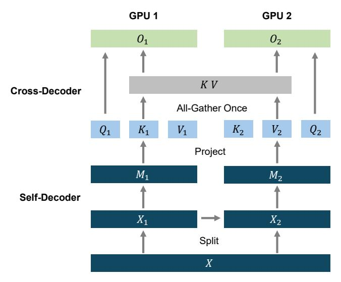

# A Chunk Parallelism for Long-Sequence Training of YOCO

We introduce chunk parallelism for YOCO to reduce the communication frequency, accelerating long-sequence training. Dividing long sequences into different devices is essential when the training length is extremely long [\[LXLY21,](#page-12-12) [DMD](#page-12-13)+23]. However, the overall throughput tends to be bounded by GPU communication [\[LZA23\]](#page-12-14). Cross-decoder disentangles self-attention dependency while preserving modeling capability, bringing intriguing advantages to distributed long-sequence training.

Figure 11: Chunk parallelism of YOCO training on two GPU devices. The training strategy is to partition the sequence into different chunks. M denotes the intermediate representation X L/2 , i.e., the output of self-decoder. The keys and values in the cross-decoder are only gathered once.

In self-decoder, the dependency only exists in the adjacent devices. For example, gated retention only requires the hidden state Sn in Equation [\(5\)](#page-4-3), and sliding-window attention attends to tokens within the context window. Therefore, the communication amount of self-decoder is relatively small. In the cross-decoder, the all-gather operation is only triggered once for the KV cache, rather than communicating in each layer. The hardware-friendly architecture gives more flexibility to distributed long-sequence training.

