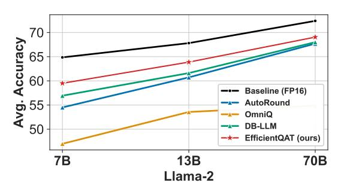
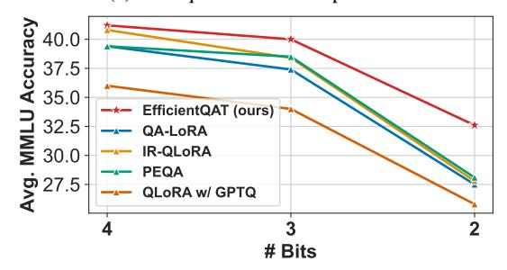
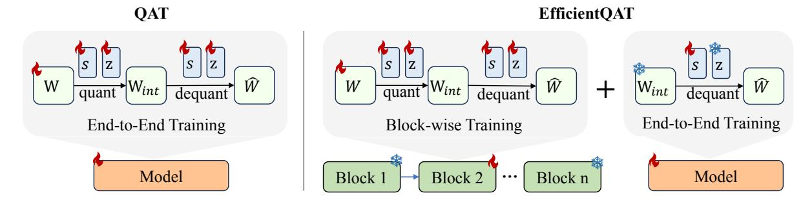

# EfficientQAT: Efficient Quantization-Aware Training for Large Language Models

Mengzhao Chen $^{1,2}$ , Wenqi Shao $^{\dagger 2}$ , Peng Xu $^{1,2}$ , Jiahao Wang $^{1,2}$ , Peng Gao $^2$ , Kaipeng Zhang $^2$ , Ping Luo $^{\dagger 1}$ 

1The University of Hong Kong 2Shanghai AI Laboratory

#### **Abstract**

Large language models (LLMs) are crucial in modern natural language processing and artificial intelligence. However, they face challenges in managing their significant memory requirements. Although quantization-aware training (QAT) offers a solution by reducing memory consumption through low-bit representations with minimal accuracy loss, it is impractical due to substantial training resources. To address this, we propose Efficient Quantization-Aware Training (EfficientOAT), a more feasible OAT algorithm. EfficientOAT involves two consecutive phases: Block-wise training of all parameters (Block-AP) and end-to-end training of quantization parameters (E2E-QP). To the best of our knowledge, Block-AP is the first method to enable direct training of all parameters in a block-wise manner, reducing accuracy loss in low-bit scenarios by enhancing the solution space during optimization. E2E-OP then trains only the quantization parameters (step sizes) end-to-end, further improving the performance of quantized models by considering interactions among all sub-modules. Extensive experiments demonstrate that EfficientQAT outperforms previous quantization methods across a range of models, including base LLMs, instruction-tuned LLMs, and multimodal LLMs, with scales from 7B to 70B parameters at various quantization bits. For instance, EfficientOAT obtains a 2-bit Llama-2-70B model on a single A100-80GB GPU in 41 hours, with less than 3 points accuracy degradation compared to the full precision (69.48 vs. 72.41). Code is available at https: //github.com/OpenGVLab/EfficientQAT.

#### 1 Introduction

Recent advancements in large language models (LLMs) (Touvron et al., 2023; Bubeck et al., 2023; Chiang et al., 2023; Xu et al., 2023a; Ying et al.,

(a) 2-bit quantization comparisons

(b) O-PEFT comparisons

Figure 1: (a) EfficientQAT significantly surpasses existing uniform quantization methods, and is either superior to or comparable with vector quantization techniques. (b) EfficientQAT markedly outperforms existing Q-PEFT methods.

2024) have demonstrated impressive capabilities in diverse language tasks such as reasoning (Clark et al., 2018, 2019; Zellers et al., 2019), cognitive processing (Fu et al., 2023; Xu et al., 2023a), and agent-based applications (Qin et al., 2023a,b). However, these models are characterized by their extensive parameters, which pose significant challenges for memory footprint and bandwidth (Kim et al., 2023b; Xu et al., 2024a).

Quantization-aware training (QAT) is a highly effective quantization technique that minimizes quantization errors by incorporating quantization constraints during training. For example, BitNet b1.58 (Ma et al., 2024) can achieve nearly lossless ternary quantization. The precision of QAT is due to two main factors: 1) Fully trainable parameters allow for enough optimized space for gradi-

&lt;sup>†Corresponding authors: shaowenqi@pjlab.org.cn; pluo@cs.hku.hk

ent descent optimization; 2) End-to-end training accounts for interactions among all sub-modules in the models. Despite its performance benefits, QAT demands significant training resources, such as time and GPUs, as well as extensive training data. For instance, BitNet b1.58 requires retraining LLMs from scratch using the entire pre-trained dataset. Therefore, this approach is impractical for extremely large models and has only been verified on 3B models with 100B training tokens.

In optimizing quantization for LLMs, current methods emphasize either fine-grained reconstruction or reducing trainable parameters. While these approaches improve efficiency, they significantly degrade accuracy in low-bit scenarios. Mainstream post-training quantization (PTQ) methods [\(Lin](#page-10-2) [et al.,](#page-10-2) [2023;](#page-10-2) [Frantar et al.,](#page-9-5) [2022;](#page-9-5) [Shao et al.,](#page-11-6) [2023\)](#page-11-6) focus on block-wise reconstruction [\(Li et al.,](#page-10-3) [2021\)](#page-10-3). They also restrict the optimization space to alleviate overfitting risk by only training rounding parameters [\(Nagel et al.,](#page-10-4) [2020;](#page-10-4) [Cheng et al.,](#page-9-6) [2023\)](#page-9-6), clipping thresholds [\(Shao et al.,](#page-11-6) [2023\)](#page-11-6), or step sizes [\(Esser et al.,](#page-9-7) [2019;](#page-9-7) [Ding et al.,](#page-9-8) [2023\)](#page-9-8). However, these methods not only limit optimizable parameters but also overlook cross-block interactions, leading to notable accuracy degeneration in lowbit scenarios, as shown in Figure [1a.](#page-0-0) Conversely, quantized parameter-efficient fine-tuning (Q-PEFT) methods [\(Dettmers et al.,](#page-9-9) [2023a;](#page-9-9) [Kim et al.,](#page-10-5) [2023a\)](#page-10-5) reduce training costs by freezing quantized parameters and only training a few continuous floats. For example, PEQA [\(Kim et al.,](#page-10-5) [2023a\)](#page-10-5) and QA-LoRA [\(Xu et al.,](#page-11-7) [2023b\)](#page-11-7) focus on training continuous quantization parameters. Despite this, their performance remains poor, as depicted in Figure [1b,](#page-0-0) because the severe performance loss in low-bit scenarios (2-bit and 3-bit) cannot be fully recovered with limited trainable parameters.

To address these challenges, we introduce a novel quantization-aware training framework called EfficientQAT. This framework combines the advantages of fully trainable parameters and endto-end training, similar to native QAT [\(Ma et al.,](#page-10-1) [2024\)](#page-10-1), while maintaining the training efficiency of PTQ [\(Cheng et al.,](#page-9-6) [2023;](#page-9-6) [Shao et al.,](#page-11-6) [2023\)](#page-11-6) and Q-PEFT [\(Xu et al.,](#page-11-7) [2023b\)](#page-11-7). EfficientQAT introduces block-wise training of all parameters (Block-AP) to enhance the optimizable space and mitigate quantization accuracy loss. Block-AP sequentially trains all parameters, including original weights and quantization parameters (step sizes and zero points), within each transformer block. Several

works have been developed based on block-wise reconstruction. However, previous approaches focus on designing additional trainable parameters, such as clipping thresholds for OmniQuant [\(Shao et al.,](#page-11-6) [2023\)](#page-11-6), weight rounding for AutoRound [\(Cheng](#page-9-6) [et al.,](#page-9-6) [2023\)](#page-9-6) and BRECQ [\(Li et al.,](#page-10-3) [2021\)](#page-10-3), or LoRA [\(Hu et al.,](#page-10-6) [2021\)](#page-10-6) parameters for CBQ [\(Ding](#page-9-8) [et al.,](#page-9-8) [2023\)](#page-9-8). Our Block-AP is the first to directly train all parameters during block-wise reconstruction, achieving superior performance compared to previous methods (see Table [5\)](#page-7-0). Block-AP successfully demonstrates that complex trainable parameter design is unnecessary for effective block-wise reconstruction in LLMs quantization. Furthermore, we introduce end-to-end training of quantization parameters (E2E-QP) to account for inter-block interactions. E2E-QP keeps the quantized weights fixed and trains only the quantization parameters (step sizes) end-to-end.

Thanks to the integration of the proposed Block-AP and E2E-QP, EfficientQAT characterizes itself as a fast-converging, memory-efficient, and high-performing quantization technique. For instance, EfficientQAT can obtain a 2-bit Llama-2- 70B model on a single A100-80GB GPU in just 41 hours, with less than 3 points accuracy degradation on 5 zero-shot common-sense tasks compared to its full-precision counterpart (69.48 vs. 72.41). We also evaluate EfficientQAT across scenarios involving model compression and instruction-tuning. In model compression, as illustrated in Figure [1a,](#page-0-0) EfficientQAT significantly outperforms existing uniform quantization methods by approximately 5 points on accuracy in the challenging 2-bit quantization setting. In terms of instruction tuning, as shown in Figure [1b,](#page-0-0) EfficientQAT consistently outperforms existing Q-PEFT methods, including QLoRA [\(Dettmers et al.,](#page-9-9) [2023a\)](#page-9-9), QA-LoRA [\(Xu](#page-11-7) [et al.,](#page-11-7) [2023b\)](#page-11-7), and PEQA [\(Kim et al.,](#page-10-5) [2023a\)](#page-10-5). For instance, EfficientQAT surpasses PEQA [\(Kim et al.,](#page-10-5) [2023a\)](#page-10-5) with 4.5 points MMLU accuracy when finetuning with Alpaca dataset.

## 2 Related Works

Post-Training Quantization of LLMs. PTQ is a pivotal technique for accelerating and deploying LLMs. Quantization approaches generally fall into two categories: weight-only quantization [\(Fran](#page-9-5)[tar et al.,](#page-9-5) [2022;](#page-9-5) [Dettmers et al.,](#page-9-10) [2023b;](#page-9-10) [Lee et al.,](#page-10-7) [2023a;](#page-10-7) [Kim et al.,](#page-10-0) [2023b\)](#page-10-0) and weight-activation quantization [\(Xiao et al.,](#page-11-8) [2023;](#page-11-8) [Liu et al.,](#page-10-8) [2023c;](#page-10-8)

[Wei et al.,](#page-11-9) [2022,](#page-11-9) [2023;](#page-11-10) [Yuan et al.,](#page-12-1) [2023;](#page-12-1) [Zhao](#page-12-2) [et al.,](#page-12-2) [2023;](#page-12-2) [Ashkboos et al.,](#page-9-11) [2023;](#page-9-11) [Li et al.,](#page-10-9) [2023a;](#page-10-9) [Ashkboos et al.,](#page-9-12) [2024\)](#page-9-12). Weight-only quantization focuses on compressing weights into low-bit formats, reducing memory demands and enhancing the efficiency of memory-bounded computations in LLMs [\(Lin et al.,](#page-10-10) [2024;](#page-10-10) [Yuan et al.,](#page-12-3) [2024\)](#page-12-3). Conversely, weight-activation quantization compresses both weights and activations, thus further decreasing the overhead associated with matrix multiplications [\(Lin et al.,](#page-10-10) [2024\)](#page-10-10). Recent advancements in weight-only quantization include the introduction of vector quantization methods by QUIP#[\(Tseng](#page-11-11) [et al.,](#page-11-11) [2024\)](#page-11-11) and AQLM[\(Egiazarian et al.,](#page-9-13) [2024\)](#page-9-13). These methods have shown promising performance but also introduce significant overhead [\(Gong et al.,](#page-10-11) [2024\)](#page-10-11). Our research continues to explore uniform quantization, which is preferred for its compatibility with hardware implementations.

Quantization-Aware Training of LLMs. QAT can enhance the performance of quantized models beyond what PTQ offers. However, QAT has been less explored in LLMs due to the significant training costs involved. Studies such as LLM-QAT [\(Liu](#page-10-12) [et al.,](#page-10-12) [2023e\)](#page-10-12) and BitDistiller [\(Du et al.,](#page-9-14) [2024\)](#page-9-14) investigate the application of knowledge distillation within QAT contexts. Techniques like Bit-Net b1.58 [\(Ma et al.,](#page-10-1) [2024\)](#page-10-1) and OneBit [\(Xu et al.,](#page-11-12) [2024b\)](#page-11-12) employ QAT to achieve extreme binary or ternary quantization levels. Although BitNet b1.58 demonstrates near-lossless performance on models up to 3 billion parameters and 100 billion training tokens with ternary quantization, its applicability to larger models or datasets remains uncertain due to prohibitive training expenses.

Quantized Parameter-Efficient Fine-Tuning of LLMs. Techniques like QLoRA [\(Dettmers et al.,](#page-9-9) [2023a\)](#page-9-9), INT2.1 [\(Chai et al.,](#page-9-15) [2023\)](#page-9-15), LQ-LoRA [\(Guo](#page-10-13) [et al.,](#page-10-13) [2023\)](#page-10-13), and LoftQ [\(Li et al.,](#page-10-14) [2023b\)](#page-10-14) quantize model parameters to low-bit representations followed by the addition of LoRA [\(Hu et al.,](#page-10-6) [2021\)](#page-10-6) modules for fine-tuning. However, these methods require merging the LoRA modules into quantized weights, resulting in the model reverting to the FP16 format. Addressing this issue, QA-LoRA [\(Xu](#page-11-7) [et al.,](#page-11-7) [2023b\)](#page-11-7) redesigns the LoRA module to merge seamlessly into the zero points. The approach most similar to ours is PEQA [\(Kim et al.,](#page-10-5) [2023a\)](#page-10-5), which uses a round-to-nearest (RTN) method for low-bit quantization and fine-tunes step sizes for task adaptation. However, PEQA experiences significant performance degradation due to limited trainable

parameters, which hinders recovery from quantization information loss.

## 3 EfficientQAT

#### 3.1 Method Overview

In this section, we introduce EfficientQAT, a novel quantization-aware training framework for LLMs that enhances memory efficiency. As illustrated in Figure [2,](#page-3-0) traditional QAT approaches train the weights W and quantization parameters s (step sizes) and z (zero points) simultaneously in an endto-end manner, which significantly increases the memory requirements due to the large number of parameters involved. To address this issue, EfficientQAT adopts a two-stage strategy: block-wise training of all parameters (Block-AP) and end-toend training of quantization parameters (E2E-QP). In the Block-AP phase, model parameters and quantization parameters are trained block-by-block using reconstruction loss, which not only allows for precise calibration with full training but also reduces memory consumption [\(Li et al.,](#page-10-3) [2021;](#page-10-3) [Shao](#page-11-6) [et al.,](#page-11-6) [2023\)](#page-11-6) by block-wise training. Following this, the E2E-QP phase fixes the quantized weights and trains the step sizes exclusively on target datasets, thus achieving inter-block interaction in a memoryefficient way. Details on Block-AP and E2E-QP are further described in Sections [3.2](#page-2-0) and [3.3,](#page-3-1) respectively.

### 3.2 Block-Wise Training of All Parameters

In this section, we introduce the Block-Wise Training of All Parameters (Block-AP) approach, designed to efficiently provide an effective initialization for following end-to-end training.

Quantization and Dequantization. Specifically, Block-AP begins with a standard uniform quantization method:

$$\mathbf{W}_{int} = \text{clamp}(\lfloor \frac{\mathbf{W}}{s} \rceil + z, 0, 2^N - 1), \quad (1)$$

where ⌊·⌉ represents the rounding operation. N is the target bit number. Wint and W denote the quantized integer and full-precision weights (Float16 or BFloat16 for LLMs), respectively. s is the scaling factor and z is the zero point. In the forward propagation, the quantized weights are converted back to full precision as follows:

$$\widehat{\mathbf{W}} = (\mathbf{W_{int}} - z) \cdot s. \tag{2}$$

Figure 2: The overall pipeline of naive QAT and proposed EfficientQAT. EfficientQAT introduces two novel processes: Block-wise Training of All Parameters (Block-AP) and End-to-End Training of Quantization Parameters (E2E-QP).

Here, Wc refers to the dequantized weights used in the forward computation. The processes of quantization (Eq.[\(1\)](#page-2-1)) and dequantization (Eq.[\(2\)](#page-2-2)) are integrated within the computation graph and can be optimized through gradient descent in a quantizationaware manner.

Blcok-wise Quantization-aware Training. Traditional QAT methods [\(Ma et al.,](#page-10-1) [2024;](#page-10-1) [Esser et al.,](#page-9-7) [2019;](#page-9-7) [Liu et al.,](#page-10-12) [2023e\)](#page-10-12) train the entire network using Eq.[\(1\)](#page-2-1) and Eq.[\(2\)](#page-2-2) in an end-to-end fashion, which typically requires substantial computational resources and extensive data to prevent overfitting. Here we aim to enhance the training efficiency of QAT. Previous studies, such as BRECQ [\(Li et al.,](#page-10-3) [2021\)](#page-10-3), have demonstrated that block-wise training achieves faster convergence and requires less training time, data, and memory than end-to-end training given a pre-trained model. Following the methodologies in BRECQ [\(Li et al.,](#page-10-3) [2021\)](#page-10-3) and OmniQuant [\(Shao et al.,](#page-11-6) [2023\)](#page-11-6), Block-AP sequentially conducts quantization-aware training within one transformer block before moving on to the next under a block-wise reconstruction framework.

Full Training of Model Weights and Quantization Parameters. Unlike previous methods which optimize several quantization parameters such as rounding parameters [\(Nagel et al.,](#page-10-4) [2020;](#page-10-4) [Cheng](#page-9-6) [et al.,](#page-9-6) [2023;](#page-9-6) [Lee et al.,](#page-10-15) [2023b\)](#page-10-15), clipping parameters [\(Shao et al.,](#page-11-6) [2023\)](#page-11-6), and step sizes [\(Esser et al.,](#page-9-7) [2019;](#page-9-7) [Ding et al.,](#page-9-8) [2023\)](#page-9-8), Block-AP behaves like QAT, training all inherent parameters from Eq.[\(1\)](#page-2-1) and Eq.[\(2\)](#page-2-2), including scaling factor s, zero point z, and model weights W.

In our Block-AP approach, a straightforward full-training regimen outperforms existing partialtraining variants [\(Nagel et al.,](#page-10-4) [2020;](#page-10-4) [Li et al.,](#page-10-3) [2021;](#page-10-3) [Ding et al.,](#page-9-8) [2023\)](#page-9-8) with intricate designs. Traditional training methods involving rounding parameters [\(Nagel et al.,](#page-10-4) [2020;](#page-10-4) [Li et al.,](#page-10-3) [2021;](#page-10-3) [Ding](#page-9-8) [et al.,](#page-9-8) [2023\)](#page-9-8) serve as regularization techniques, constraining the update range of integral weights to (−1, +1) to mitigate overfitting. However, this approach limits the solution space, potentially hindering the final performance of quantized models. Our empirical findings demonstrate the superiority of full training within our Block-AP over existing partial-training variants [\(Nagel et al.,](#page-10-4) [2020;](#page-10-4) [Li et al.,](#page-10-3) [2021;](#page-10-3) [Ding et al.,](#page-9-8) [2023\)](#page-9-8), as shown in Table [5.](#page-7-0)

Following block-wise training, we obtain the quantized model which includes quantized weights Wq, step sizes s, and zero points z for each quantization group. The weights Wq and zero points z are stored in a low-bit format, while step sizes s are stored in FP16. Note that s and z are shared within their respective quantization groups and constitute only a small fraction of the model's parameters, approximately 1.6% for a group size of 64. Moreover, the model's memory footprint is substantially reduced by transitioning from full-precision 16-bit weights to 2/3/4-bit quantized weights.

