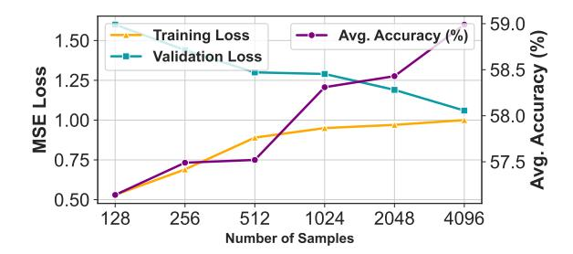

# 4 Experiments

This section presents extensive experiments to verify our proposed EfficientQAT. Secition [4.1](#page-4-0) and Sec [4.2](#page-5-0) present the comparisons with quantization methods and Q-PEFT methods respectively. Section [4.4](#page-7-2) details the training cost and inference speed-up of the proposed EfficientQAT. Section [4.3](#page-6-0) presents the comprehensive ablation studies of the proposed EfficientQAT.

#### 4.1 EfficientQAT for LLMs Quantization

Training. We conduct experiments on the Llama-2 and Llama-3 models. For Block-AP, we use 4096 samples from RedPajama [\(Computer,](#page-9-16) [2023\)](#page-9-16) with a context length of 2048. We train each block with batch size as 2 and epochs as 2, setting the learning rate of quantization parameters as 1 × 10−4 , and the learning rate of weights as 2 × 10−5 for 2-bit and 1 × 10−5 for 3/4-bits. For E2E-QP, we also employ 4096 samples from RedPajama [\(Computer,](#page-9-16) [2023\)](#page-9-16) but with a context length of 4096. We train the entire model with batch size as 32 and epoch as 1, and set the learning rate of step size as 2 × 10−5 for 2-bit and 1 × 10−5 for 3-bits.

PTQ Baseline. We compare our results with PTQ methods from uniform quantization such as GPTQ [\(Frantar et al.,](#page-9-5) [2022\)](#page-9-5), AWQ [\(Lin et al.,](#page-10-2) [2023\)](#page-10-2), OmniQ [\(Shao et al.,](#page-11-6) [2023\)](#page-11-6), ApiQ [\(Liao and](#page-10-16) [Monz,](#page-10-16) [2024\)](#page-10-16) and AutoRound [\(Cheng et al.,](#page-9-6) [2023\)](#page-9-6), and vector quantization including QuIP# [\(Tseng](#page-11-11) [et al.,](#page-11-11) [2024\)](#page-11-11) and AQLM [\(Egiazarian et al.,](#page-9-13) [2024\)](#page-9-13). Note that if a result is the best of uniform quantization, we set it to bold.

Accuracy results. We evaluate the zero-shot accuracy on five common-sense reasoning tasks using the v0.4.2 lm-evaluation-harness[\\*](#page-4-1). These tasks include WinoGrande [\(Sakaguchi et al.,](#page-11-14) [2021\)](#page-11-14), PIQA [\(Bisk et al.,](#page-9-17) [2020\)](#page-9-17), HellaSwag [\(Zellers et al.,](#page-12-0) [2019\)](#page-12-0), Arc-Easy [\(Clark et al.,](#page-9-2) [2018\)](#page-9-2), and Arc-Challenge [\(Clark et al.,](#page-9-2) [2018\)](#page-9-2). Table [1](#page-5-1) shows that the proposed EfficientQAT significantly outperforms previous methods for uniform quantization across the Llama-2 and Llama-3 model families, as well as in both 2-bit and 3-bit quantization settings. The performance gains are particularly notable in extremely low-bit quantization, such as 2-bit. For instance, EfficientQAT achieves a +3.26% accuracy improvement over AWQ in w3g128 quantization with Llama-3-8B. Moreover, EfficientQAT surpasses DB-LLM by +9.02% accuracy in w2g64 quantization. In comparison to vector quantization, our results show that EfficientQAT outperforms QuIP#[\(Tseng et al.,](#page-11-11) [2024\)](#page-11-11) in 3-bit quantization, but underperforms in 2-bit scenarios. However, direct comparisons between uniform quantization methods (such as EfficientQAT) and vector quantization methods (such as QuIP#) can be misleading due to fundamental differences in their approaches. Vector quantization often achieves better results at very low bit-widths through complex codebook designs, but this comes at the cost of reduced generalization and deployment flexibility. For instance, EfficientQAT supports both weight and activation quantization, while vector quantization methods are typically limited to weight-only quantization. Furthermore, a recent study, PrefixQuant[\(Chen](#page-9-18) [et al.,](#page-9-18) [2024b\)](#page-9-18), demonstrates that EfficientQAT improves state-of-the-art weight-activation quantization methods by nearly 0.3 perplexity.

Perplexity results. We also evaluate perplexity on Wikitext2 and C4 using a 2048 context length, following prior studies [\(Frantar et al.,](#page-9-5) [2022;](#page-9-5) [Shao](#page-11-6) [et al.,](#page-11-6) [2023\)](#page-11-6). The results align with the accuracy comparison, as EfficientQAT consistently achieves lower perplexity across the Llama-2 and Llama-3 model families in both 2-bit and 3-bit quantization. Notably, the benefits are more pronounced in Llama-3 models, which face greater challenges in quantization [\(Huang et al.,](#page-10-17) [2024\)](#page-10-17). For example, EfficientQAT reduces perplexity by 0.37 and 4.19 points compared to DB-LLM in Llama-2-7B and

\*https://github.com/EleutherAI/lm-evaluation-harness

Table 1: Llama 2 & 3 average zero-shot accuracy on 5 common-sense reasoning tasks (†). "-" indicates the result is unreachable in the public papers.

| Method       | Bits | Group | 2-7   | 2-13  | 2-70  | 3-8   | 3-70  |
|--------------|------|-------|-------|-------|-------|-------|-------|
| FP16         | 16   | -     | 64.86 | 67.81 | 72.41 | 68.58 | 75.33 |
| RTN          | 3    | 128   | 62.06 | 65.77 | 70.83 | 58.72 | 65.29 |
| GPTQ         | 3    | 128   | 62.48 | 66.18 | 71.47 | 60.58 | 71.28 |
| AWQ          | 3    | 128   | 62.82 | 66.14 | 71.41 | 64.82 | 73.65 |
| OmniQ        | 3    | 128   | 62.42 | 66.18 | 71.07 | 64.09 | 71.90 |
| AutoRound    | 3    | 128   | 63.72 | 66.68 | 71.24 | -     | -     |
| QuIP#        | 3    | -     | 63.52 | 66.26 | 72.13 | -     | -     |
| EfficientQAT | 3    | 128   | 64.02 | 67.28 | 71.76 | 67.35 | 73.96 |
| OmniQ        | 2    | 128   | 46.98 | 53.56 | 54.87 | 52.66 | 60.06 |
| AutoRound    | 2    | 128   | 54.50 | 60.72 | 67.70 | -     | -     |
| EfficientQAT | 2    | 128   | 59.50 | 63.88 | 68.93 | 59.37 | 67.57 |
| AQLM         | 2    | 2x8   | 57.61 | 62.22 | 69.85 | -     | -     |
| QuIP#        | 2    | -     | 60.61 | 64.44 | 70.91 | -     | -     |
| DB-LLM       | 2    | 64    | 56.93 | 61.61 | 68.01 | 51.74 | -     |
| EfficientQAT | 2    | 64    | 60.14 | 64.48 | 69.48 | 60.76 | 67.89 |

Llama-3-8B, respectively.

How model size and training tokens affect quantization error. Recent scaling laws for PTQ (Kumar et al., 2024; Ouyang et al., 2024) show that quantization error increases with the number of training tokens and decreases as model size grows. Our results in Table 1 and Table 2 are consistent with these PTQ scaling laws. Additionally, the absolute benefit of our proposed method is more pronounced in smaller models, as they experience greater performance degradation from quantization. For example, DB-LLM loses 7.93 accuracy points with W2G64 on Llama-2-7B, but only 4.40 on Llama-2-70B. As a result, the improvement of EfficientQAT over DB-LLM decreases from 3.21 on Llama-2-7B to 1.47 on Llama-2-70B. However, when we use the relative gain met-EfficientQAT-DBLLM EfficientQAT reduces quantization error by 40% for Llama-2-7B and 33% for Llama-2-70B. The relative gain metric demonstrates the effectiveness of proposed EfficientQAT across different model sizes.

#### 4.2 EfficientQAT for Instruction Tuning

**Training and Evaluation.** Following existing works (Xu et al., 2023b; Qin et al., 2024), we train Llama-1 models on the Alpaca dataset (Taori et al., 2023) and assess their performance by measuring average 5-shot MMLU (Hendrycks et al., 2020) accuracy works (Xu et al., 2023b; Qin et al., 2024).

The training hyperparameters are identical to those described in Section 4.1, except we replace the Red-Pajama dataset (Computer, 2023) with Alpaca. In line with QLoRA's methodology (Dettmers et al., 2023a), we adjust the source context length to 384 and the target context length to 128, training for 10,000 steps with a batch size of 16.

Baseline. We benchmark EfficientQAT against several leading methods, including QLoRA (Dettmers et al., 2023a), QA-LoRA (Xu et al., 2023b), PEQA (Kim et al., 2023a), and IR-QLoRA (Qin et al., 2024), across quantization setting of 2, 3, and 4 bits. Consistent with QA-LoRA (Xu et al., 2023b), we also employ GPTQ (Frantar et al., 2022) to quantize the finetuned QLoRA models into a low-bit format without FP16 LoRA for equitable comparison.

Results. Both Table 3 and Figure 1b indicate that EfficientQAT significantly outperforms existing Q-PEFT methods. For instance, in channel-wise quantization (group size of -1), EfficientQAT achieves more than 3% higher accuracy than PEQA (Kim et al., 2023a). In the 2-bit quantization scenario, the superiority of EfficientQAT is even more pronounced, surpassing QA-LoRA (Xu et al., 2023b) by 5.1% and 4.0% in 7B and 13B models, respectively, and outperforming PEQA by 4.5% and 8.7% in the same models. Moreover, Table 3 also demonstrates that EfficientQAT outperforms both QA-LoRA and QLoRA with GPTQ in smaller model

Table 2: Llama 2 & 3 Wikitext2 and C4 perplexity (↓), context length 2048. "-" indicates the result is unreachable in the public papers.

|              |    |            |      |      | Wikitext 2 |                 |      |       |           | C4   |                                                          |      |
|--------------|----|------------|------|------|------------|-----------------|------|-------|-----------|------|----------------------------------------------------------|------|
| Method       |    | Bits Group | 2-7  |      | 2-13 2-70  | 3-8             | 3-70 | 2-7   | 2-13 2-70 |      | 3-8                                                      | 3-70 |
| FP16         | 16 | -          | 5.47 |      | 4.88 3.32  | 6.14            | 2.85 | 6.97  | 6.47      | 5.52 | 8.88                                                     | 6.73 |
| GPTQ         | 3  | 128        | 6.29 |      | 5.42 3.85  | 9.58            | 5.25 | 7.89  | 7.00      |      | 5.85 11.66                                               | 8.64 |
| AWQ          | 3  | 128        | 6.24 |      | 5.32 3.74  | 8.16            | 4.69 | 7.84  | 6.94      |      | 5.81 11.49                                               | 7.91 |
| OmniQ        | 3  | 128        | 6.03 |      | 5.28 3.78  | 8.27            | 4.99 | 7.75  | 6.98      |      | 5.85 11.66                                               | 7.97 |
| BitDistiller | 3  | 128        | 5.97 | -    | -          | -               | -    | -     | -         | -    | -                                                        | -    |
| EfficientQAT | 3  | 128        | 5.81 |      | 5.12 3.61  | 7.09            | 4.21 | 7.34  | 6.73      |      | 5.71 10.06                                               | 7.46 |
| OmniQ        | 2  | 128        |      |      |            |                 |      |       |           |      | 11.06 8.26 6.55 18.50 16.79 15.02 11.05 8.52 22.46 15.06 |      |
| ApiQ         | 2  | 128        | 8.25 | 6.71 | -          | -               | -    | 12.04 | 9.13      | -    | -                                                        | -    |
| BitDistiller | 2  | 128        | 8.08 | -    | -          | -               | -    | -     | -         | -    | -                                                        | -    |
| EfficientQAT | 2  | 128        | 7.19 |      | 6.08 4.61  | 9.80            | 6.38 | 8.79  | 7.75      |      | 6.48 13.22                                               | 9.53 |
| AQLM         | 2  | 2x8        | 7.24 |      | 6.06 4.49  | -               | -    | 8.96  | 7.80      | 6.36 | -                                                        | -    |
| QuIP#        | 2  | -          | 6.66 |      | 5.74 4.16  | -               | -    | 8.35  | 7.45      | 6.12 | -                                                        | -    |
| ApiQ         | 2  | 64         | 7.59 | 6.44 | -          | -               | -    | 10.56 | 8.92      | -    | -                                                        | -    |
| CBQ          | 2  | 64         | 8.01 | -    | -          | -               | -    | 11.30 | -         | -    | -                                                        | -    |
| DB-LLM       | 2  | 64         | 7.23 |      |            | 6.19 4.64 13.60 | -    | 9.62  | 8.38      |      | 6.77 19.20                                               | -    |
| EfficientQAT | 2  | 64         | 6.86 |      | 5.96 4.52  | 9.41            | 6.07 | 8.50  | 7.59      |      | 6.38 12.77                                               | 9.23 |

memory footprint (larger group size).

Table 3: Llama-1 average MMLU accuracy (5-shot) about instruction-tuning on Alpaca dataset.

| Method        | Bits | Group | 7B   | 13B  |
|---------------|------|-------|------|------|
| -             | 16   | -     | 34.6 | 46.3 |
| PEQA          | 4    | -1    | 35.8 | 45.0 |
| EfficientQAT  | 4    | -1    | 38.8 | 48.2 |
| QLoRA         | 4+16 | -     | 38.4 | 48.4 |
| QLoRA w/GPTQ  | 4    | 32    | 36.0 | 48.0 |
| QA-LoRA       | 4    | 32    | 39.4 | 49.2 |
| PEQA          | 4    | 64    | 39.4 | 47.4 |
| IR-QLoRA      | 4    | 64    | 40.8 | 49.3 |
| EfficientQAT  | 4    | 64    | 41.2 | 49.5 |
| QLoRA w/ GPTQ | 3    | 32    | 34.0 | 46.1 |
| QA-LoRA       | 3    | 32    | 37.4 | 47.3 |
| IR-QLoRA      | 3    | 64    | 38.4 | -    |
| PEQA          | 3    | 64    | 38.5 | 46.3 |
| EfficientQAT  | 3    | 64    | 40.0 | 48.2 |
| QLoRA w/ GPTQ | 2    | 32    | 25.8 | 30.9 |
| QA-LoRA       | 2    | 32    | 27.5 | 36.9 |
| IR-QLoRA      | 2    | 64    | 27.8 | -    |
| PEQA          | 2    | 64    | 28.1 | 32.2 |
| EfficientQAT  | 2    | 64    | 32.6 | 40.9 |

#### 4.3 Ablation Analysis

The EfficientQAT algorithm is comprised of two main components: Block-AP and E2E-QP. This section evaluates the effectiveness, trainable parameters, and training sample requirements of each component. We present the average perplexity for

WikiText2 and C4 datasets, and the average accuracy for five zero-shot reasoning tasks, similar to Table [1.](#page-5-1)

Effectiveness of each component. As indicated in Table [4,](#page-7-3) both the Block-AP and E2E-QP components significantly enhance performance, with their combination yielding the best results. Notably, Block-AP outperforms E2E-QP, aligning with findings from BRECQ [\(Li et al.,](#page-10-3) [2021\)](#page-10-3).

Trainable parameters of Block-AP. Block-AP trains all parameters, including original weights and quantization parameters. Previous methods have introduced various training strategies to mitigate overfitting, such as trained rounding [\(Nagel](#page-10-4) [et al.,](#page-10-4) [2020;](#page-10-4) [Cheng et al.,](#page-9-6) [2023\)](#page-9-6), clipping thresholds [\(Shao et al.,](#page-11-6) [2023\)](#page-11-6), and step sizes [\(Esser et al.,](#page-9-7) [2019;](#page-9-7) [Ding et al.,](#page-9-8) [2023\)](#page-9-8). We compare Block-AP with these methods by modifying only the trainable parameters of Block-AP. As shown in Table [5,](#page-7-0) Block-AP (training s, z, W) performs best with an acceptable training cost. Additionally, the memory footprint of directly training W is even smaller than that of training the rounding operation, which requires an additional copy of rounding parameters. Additionally, BitNet [\(Ma et al.,](#page-10-1) [2024\)](#page-10-1) demonstrates that optimizing only the weights, without considering quantization parameters, can still achieve strong performance. However, Table [5](#page-7-0) shows that

training only the weights results in a perplexity of 14.32, which is significantly higher than the 8.53 achieved by Block-AP. This difference arises because our quantization approach starts from a pretrained model and directly optimizes the scaling factors (s) and zero points (z) to minimize quantization errors, making minimal changes to the weights and thus preserving the model's learned knowledge. In contrast, training only the weights adjusts the scaling factors indirectly, requiring larger weight updates that can disrupt this knowledge. Bit-Net (Ma et al., 2024), which is trained from scratch, does not face this issue.

**Trainable parameters of E2E-QP.** We further examine the trainable parameters within E2E-QP. Table 6 shows that training s, z, or both yields similar performance. However, given that converting z from an original low-bit representation to a trainable FP16 format increases the average bit count, we opt to train only s by default.

Table 4: Effectiveness of each component on Llama-2-7B w2g64 quantization.

| Block-AP E2E-QP Avg. PPL Avg. Acc. |          |              |                |  |  |  |
|------------------------------------|----------|--------------|----------------|--|--|--|
| ×                                  | ×        | 453.49       | 40.69          |  |  |  |
| $\checkmark$                       | ×        | 8.53         | 58.99          |  |  |  |
| <b>X</b>                           | <b>√</b> | 9.33 7.68 | 55.71 60.14 |  |  |  |

Table 5: W2g64 Llama-2-7B performance with different trainable parameters in the block-wise training (w/o E2E-QP). "#" indicates trainable parameters count in a block.

| Param.           | #      | Memory | Avg. PPL | Avg. Acc. |
|------------------|--------|--------|----------|-----------|
| clipping         | 6.3M   | 6.4GB  | 11.28    | 53.20     |
| s,z              | 6.3M   | 6.4GB  | 10.26    | 55.20     |
| round            | 202.4M | 8.6GB  | 15.50    | 45.32     |
| ${\bf W}$        | 202.4M | 8.5 GB | 14.32    | 46.50     |
| s,z,round        | 208.7M | 9.3GB  | 9.17     | 57.14     |
| $s,z,\mathbf{W}$ | 208.7M | 8.5GB  | 8.53     | 58.99     |

**Samples number of Block-AP.** We assess the number of training samples for Block-AP, noting that E2E-QP trains all parameters, which may lead to overfitting. To address this, we introduce an additional 64 unseen samples from ReadPajama to evaluate the overfitting issue. We adjust the training epochs to ensure a similar total training time, allowing for fair comparisons across different sam-

Table 6: Llama-2-7B w2g64 quantization with different trainable parameters for E2E-QP (w/ Block-AP).

| Param. | Avg. Bits | Avg. PPL | Avg. Accuracy |
|--------|-----------|----------|---------------|
| s      | 2.28      | 7.68     | 60.14         |
| z      | 2.50      | 7.69     | 60.08         |
| s, z   | 2.50      | 7.68     | 60.18         |

Figure 3: Illustration of training loss, validation loss and average accuracy of w2g64 Llama-2-7b with different training samples size for Block-AP (w/o E2E-QP).

ple sizes. As illustrated in Figure 3, increasing the number of training samples significantly reduces the gap between training loss and validation loss from 1.07 to 0.06. This reduction corresponds to an increase in the average accuracy for zero-shot tasks from 57.14% to 58.99%. Consequently, we set the default number of training samples for E2E-QP at 4096, as this maintains a minimal gap between training and validation losses.

Samples number of E2E-QP. In the E2E-QP, we train the model for 1 epoch to avoid over-fitting. Our examination of the training sample sizes for E2E-QP, detailed in Table 8, reveals that average perplexity consistently improves as sample sizes increase from 128 to 32,674. However, there is no significant improvement in average accuracy beyond 4096 samples. Therefore, we set the training sample size for E2E-QP at 4096 by default to balance efficiency and performance. Nonetheless, it is possible to further enhance the performance of EfficientQAT by increasing the sample size.

#### 4.4 Efficiency of EfficientQAT

**Training Efficiency** Table 7 illustrates the required memory and time for training Lllama-2 models using EfficientQAT. The results indicate that the model completes training rapidly, taking 4.8 hours for the 7B model and 40.9 hours for the 70B model. we further compare the training time with other QAT methods, including BitDistiller, and DB-LLM. As shown in Table 9, the training time of Efficien-

Table 7: The detailed training time and training memory of EfficientQAT across different model size and quantization bits on a single A100-80GB GPU.

| Llama-2 |       | Block-AP |        | E2E-QP                |            |
|---------|-------|----------|--------|-----------------------|------------|
|         | Time  | Memory   | Time   | Memory (4-/3-/2-bits) | Total Time |
| 7B      | 3.3h  | 8.5GB    | ∼1.5h  | 7.0/6.4/5.6GB         | 4.8h       |
| 13B     | 5.6h  | 10.3GB   | ∼2.9h  | 11.7/10.6/9.1GB       | 8.5h       |
| 70B     | 26.6h | 29.9GB   | ∼14.3h | 48.4/42.0/34.2GB      | 40.9h      |

Table 8: Llama-2-7B w2g64 quantization performance with different sample numbers for E2E-QP (w/ Block-AP).

| # Samples | Avg. PPL | Avg. Accuracy |
|-----------|----------|---------------|
| 128       | 8.09     | 59.03         |
| 512       | 7.88     | 59.81         |
| 2048      | 7.75     | 60.13         |
| 4096      | 7.68     | 60.14         |
| 8192      | 7.63     | 60.19         |
| 32764     | 7.50     | 60.31         |

tQAT is significantly lower than that of existing methods. For example, the tuning time of EfficientQAT is only 50% of DB-LLM. Additionally, for quantizing a 70B model, the full process of EfficientQAT can be completed on a single A100-80GB GPU. However, other methods require at least 4 A100-80GB GPUs to quantize a model of this size. Therefore, EfficientQAT is both a time-efficient and memory-efficient QAT method.

Inference Efficiency Due to the leverage of standard uniform quantization, the quantized models of EfficientQAT can also achieve speedup through a lot of toolboxes, such as MLC-LLM [\(team,](#page-11-17) [2023\)](#page-11-17), AWQ [\(Lin et al.,](#page-10-2) [2023\)](#page-10-2), and BitBLAS [\(Wang et al.,](#page-11-18) [2024\)](#page-11-18), T-MAC [\(Wei et al.,](#page-11-19) [2024\)](#page-11-19), Marlin [\(Frantar](#page-9-19) [et al.,](#page-9-19) [2024\)](#page-9-19), *etc*. For example, Table [10](#page-14-0) shows that INT2 quantization of EfficientQAT can enhance the forward-pass speed by approximately 2.9x to 4.4x through BitBLAS [\(Wang et al.,](#page-11-18) [2024\)](#page-11-18).

## 5 Conclusion

In this study, we introduce EfficientQAT, a novel method that completes QAT with improved efficiency in both memory usage and training time. Through comprehensive testing, EfficientQAT proves superior to existing PTQ, QAT, and Q-PEFT methods in terms of versatility and performance across various models and quantization levels. Additionally, EfficientQAT leverages a standard uni-

Table 9: Comparisons of training time with existing methods in Llama-2-70B.

| Method       | One A100-80GB? GPU hours (h) |     |
|--------------|------------------------------|-----|
| LLM-QAT      | %                            | 900 |
| QuiP#        | %                            | 300 |
| AQLM         | ✓                            | 336 |
| BitDistiller | %                            | 64  |
| PB-LLM       | %                            | 90  |
| DB-LLM       | %                            | 82  |
| EfficientQAT | ✓                            | 41  |

form quantization, which simplifies deployment using popular toolboxes. We anticipate that EfficientQAT will stimulate further research and improve the compression of Large Language Models (LLMs), making them more efficient and widely accessible.

## 6 Limitation

EfficientQAT achieves impressive results in lowbit quantization scenarios, but there remains a performance gap compared to full-precision (FP16) models, particularly in 2-bit settings. Reducing this gap without sacrificing efficiency remains a challenge. Additionally, the method depends on the availability of high-quality and diverse datasets, requiring 4096 samples for effective training in both the Block-AP and E2E-QP phases. The performance of the quantized models can vary significantly based on the size and distribution of the training data. This reliance may limit its effectiveness in data-scarce or domain-specific applications.

## Acknowledgement

This paper is partially supported by the National Key R&D Program of China No.2022ZD0161000.

