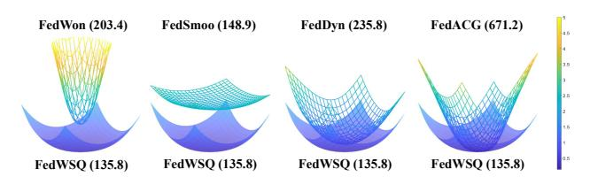

# 3.2. Quantization of LMPUs

<span id="page-3-2"></span>Neural network quantization often involves learning quantization parameters. However, in FL, transmitting additional quantization parameters or auxiliary information for each communication round would introduce significant resource overhead. Instead, we propose a fixed quantization function that eliminates the need to transmit additional quantization information, ensuring a lightweight and efficient communication process. A fundamental assumption in NUQ is that model parameters follow a normal distribution, as demonstrated in prior studies [\[7,](#page-8-18) [45,](#page-9-16) [54\]](#page-9-17). Since LMPUs represent the difference between an updated LMP and the previous GMP, they may also exhibit a normal distribution.

LMPU scaling Most quantization methods adopt the *absmax* strategy to manage the dynamic range of values [\[16,](#page-8-11) [33\]](#page-9-11). This approach scales an input tensor to the range [−1, 1] by dividing each element by the maximum absolute value of the tensor. Within this constrained range, conventional quantization methods determine QLs and map input values to the nearest quantization point. However, these methods are highly sensitive to outliers, which can excessively expand the dynamic range of the target tensor. Such over-scaling often results in underflow, especially in extremely low-bit representation. To solve this problem, we use the standard deviation of the input tensor as a scaling factor. Unlike the *absmax* value, the standard deviation is more robust to outliers. Moreover, since our DANUQ is based on a probability model of a standard normal distribution, the standard deviation provides a more reliable approximation of the target dynamic range.

In FedWSQ, we use a shared global scaling factor to help maintain consistency in quantization. Instead of independently using scaling factors, we employ a collaborative approach in which each client contributes to a global scaling vector, ensuring that local standard deviations are taken into account. Specifically, each client i computes a scaling vector, defined as s<sup>i</sup> = [si,1, . . . , si,L] T , where si,l denotes the standard deviation of the LMPUs for the l-th layer. The server then collects and aggregates s<sup>i</sup> from the participating clients i ∈ S, and updates the global scaling vector

<span id="page-3-0"></span><sup>3</sup>Section [A](#page-10-0) of the supplementary document provides its derivation.

$$\mathbf{s}_{\mathsf{g}} = [s_{\mathsf{g},1}, \dots, s_{\mathsf{g},L}]^T$$
 as follows:

$$\mathbf{s}_{g} \leftarrow (1 - \beta)\mathbf{s}_{g} + \beta \frac{1}{|\mathcal{S}|} \sum_{i \in \mathcal{S}} \mathbf{s}_{i},$$
 (7)

where  $\beta$  is a momentum parameter that controls the update rate. This approach ensures that the global scaling factor smoothly adapts while mitigating local fluctuations. Once updated, the server distributes  $\mathbf{s}_{g}$  to the participating clients. Each client then divides its LMPU updates for the l-th layer by the corresponding scale  $s_{g,l}$ , so that the normalized values can be regarded as samples from a standard normal distribution. Based on this assumption, we apply the proposed DANUQ scheme detailed in the next section.

**QLs considering normal distribution** To determine the optimal multi-bit QLs, we formulate an optimization problem that minimizes the expected quantization error under a normal distribution. We assume that a random variable  $\Delta w$  from the normalized LMPUs follows a standard normal distribution. Since the distribution is symmetric around zero, we consider only its nonnegative half. Given a B-bit representation, let  $Q = \{q_0, q_1, \dots, q_R\}$  be the set of QLs, where  $R = 2^{B-1} - 1$ . Here, we assume that  $q_r$  values are sorted in ascending order and set  $q_0 = 0$  as a fixed value. Then, the quantization boundaries are defined as

$$u_r = \begin{cases} q_0, & \text{if } r = 0, \\ \frac{q_{r-1} + q_r}{2}, & \text{if } 1 \le r \le R, \\ +\infty, & \text{if } r = R + 1. \end{cases}$$
 (8)

A full-precision value in the range  $[u_r, u_{r+1})$  is quantized into the QL  $q_r$ . The optimal QLs are determined by minimizing the expected quantization error, formulated as

<span id="page-4-0"></span>
$$\mathbb{E}\left[(\Delta w - \Delta \bar{w})^2\right] = \sum_{r=0}^{R} \int_{u_r}^{u_{r+1}} (x - q_r)^2 p(x) dx, \quad (9)$$

where  $\Delta \bar{w} \in Q$  represents the quantized value, and p(x) is the PDF of the standard normal distribution. From (9), we can derive the following optimization problem as

$$\min_{\{q_1,\dots,q_R\}} \left\{ \frac{1}{2} (q_R^2 + 1) - \sqrt{\frac{2}{\pi}} q_1 e^{-\frac{u_1^2}{2}} - \frac{1}{2} q_1^2 \text{erf} \left(\frac{u_1}{\sqrt{2}}\right) + \sqrt{\frac{2}{\pi}} \sum_{r=1}^{R-1} (q_r - q_{r+1}) e^{-\frac{u_{r+1}^2}{2}} + \frac{1}{2} \sum_{r=1}^{R-1} (q_r^2 - q_{r+1}^2) \text{erf} \left(\frac{u_{r+1}}{\sqrt{2}}\right) \right\}, \tag{10}$$

where  $\operatorname{erf}(\cdot)$  denotes the error function.<sup>4</sup> A closed-form solution to Eq. (22) is intractable due to the presence of nonlinear terms, including the Gaussian integral and the error

#### Algorithm 1: FedWSQ

return  $(\Delta \overline{\mathbf{W}}_i, \mathbf{s}_i)$ 

```
Input: Initial global parameters \mathbf{W}_{g}^{0}, initial scales \mathbf{s}_{g}^{0}, global
                 communication round T, local training iteration K, number
                 of total clients N, number of model layers L, learning rate
                \eta, hyperparameter \beta
Server-side:
for t=1,\ldots,T do
           Randomly sample a subset of clients S_t \subseteq [N]
           Set the bit-precision B_i for the client i \in \mathcal{S}_t
           Send (\mathbf{W}_{\mathrm{g}}^{t-1}, \mathbf{s}_{\mathrm{g}}^{t-1}) to client i \in \mathcal{S}_t
           for each client i \in \mathcal{S}_t, in parallel do
                     (\Delta \overline{\mathbf{W}}_i^t, \mathbf{s}_i^t) \leftarrow
                         ClientLocalTraining(\mathbf{W}_{\mathrm{g}}^{t-1}, \mathbf{s}_{\mathrm{g}}^{t-1}, i, B_{i})
           end
           for i \in \mathcal{S}_t do
                  Obtain dequantized parameters \Delta_i^t using (\Delta \overline{\mathbf{W}}_i^t, \mathbf{s}_i^t)
          Aggregate local updates: \Delta^t \leftarrow \sum_{i \in \mathcal{S}_t} \Delta^t_i
Update global parameters: \mathbf{W}_{\mathbf{g}}^t \leftarrow \mathbf{W}_{\mathbf{g}}^{t-1} + \Delta^t
Update global scales: \mathbf{s}_{\mathbf{g}}^t \leftarrow (1-\beta)\mathbf{s}_{\mathbf{g}}^{t-1} + \beta\frac{1}{|\mathcal{S}_t|}\sum_{i \in \mathcal{S}_t}\mathbf{s}_i^t
 \begin{aligned} \textbf{ClientLocalTraining}(\mathbf{W}_{\mathrm{g}}, \mathbf{s}_{\mathrm{g}}, i, B) \colon \\ \text{Initialize local parameters: } \mathbf{W}_{i}^{0} \leftarrow \mathbf{W}_{\mathrm{g}} \end{aligned} 
Set DANUQ function \mathcal{Q}(\cdot) based on the bit-precision B
for k = 1, ..., K do

Apply WS to \mathbf{W}_i^{k-1} using (5)

Compute unbiased gradient of local loss \nabla f_i(\mathbf{W}_i^{k-1})

Update local parameters: \mathbf{W}_i^k \leftarrow \mathbf{W}_i^{k-1} - \eta \nabla f_i(\mathbf{W}_i^{k-1})
Compute local update: \Delta \mathbf{W}_i \leftarrow \mathbf{W}_i^K - \mathbf{W}_{\mathrm{g}}
for each layer l=1,\ldots,L do
           Compute quantized local update: \Delta \overline{\mathbf{W}}_{i,l} \leftarrow \mathcal{Q}(\Delta \mathbf{W}_{i,l}/s_{g,l})
           Calculate local scale factors: s_{i,l} \leftarrow \operatorname{std}(\Delta \mathbf{W}_{i,l})
end
 \Delta \overline{\mathbf{W}}_i \coloneqq (\Delta \mathbf{W}_{i,1}, \cdots, \Delta \mathbf{W}_{i,L})
 \mathbf{s}_i \coloneqq [s_{i,1}, \cdots, s_{i,L}]
```

function, which lack simple analytical inverses, and the interdependent QLs due to boundary conditions. As an alternative, we employ a brute-force search algorithm to numerically determine the optimal QLs.<sup>5</sup> The optimal QLs for different bit-widths are obtained as follows: 1) 1-bit<sup>6</sup>: [-0.798, 0.798]; 2) 2-bit: [-1.224, 0, 0.765, 1.724]; 3) 4-bit: [-2.654, -1.974, -1.508, -1.149, -0.834, -0.544, -0.269, 0, 0.230, 0.465, 0.708, 0.966, 1.248, 1.568, 1.968, 2.649]. These QLs minimize quantization error under the normal distribution, which provides an effective trade-off between precision and computational efficiency.

<span id="page-4-1"></span><sup>&</sup>lt;sup>4</sup>The full derivation is provided in the supplementary document.

<span id="page-4-2"></span><sup>&</sup>lt;sup>5</sup>We discretize the search space of possible QLs and perform an exhaustive evaluation of the cost function to identify the configuration that minimizes the quantization error. To improve computational efficiency, we restrict the search space to a reasonable range based on empirical observations and employ parallel processing to accelerate evaluation.

<span id="page-4-3"></span><sup>&</sup>lt;sup>6</sup>For the 1-bit case, the QLs consist of only two values. Thus, the constraint,  $q_0 = 0$ , is omitted to allow optimal placement of both QLs.

<span id="page-5-1"></span><span id="page-5-0"></span>

| Table 1. FL performance on the three benchmark datasets with a 5% participation rate over 100 clients for $\alpha \in \{0.1, 0.3\}$ |
|-------------------------------------------------------------------------------------------------------------------------------------|
|-------------------------------------------------------------------------------------------------------------------------------------|

| Method         | #bits      | CIFAR-10       |       |       |        | CIFAR-100 |       |       | Tiny-ImageNet |       |       |       |        |
|----------------|------------|----------------|-------|-------|--------|-----------|-------|-------|---------------|-------|-------|-------|--------|
|                | 7010       | $\alpha = 0.1$ | 0.3   | 0.6   | i.i.d. | 0.1       | 0.3   | 0.6   | i.i.d.        | 0.1   | 0.3   | 0.6   | i.i.d. |
| FedAvg [31]    | 32         | 70.65          | 82.52 | 85.45 | 89.25  | 43.45     | 47.39 | 49.04 | 48.66         | 30.37 | 34.65 | 36.54 | 37.39  |
| FedProx [27]   | 32         | 70.89          | 83.91 | 86.60 | 88.81  | 43.78     | 48.26 | 48.49 | 48.54         | 29.99 | 35.44 | 37.14 | 37.43  |
| FedAvgM [13]   | 32         | 78.30          | 85.27 | 87.94 | 90.00  | 47.70     | 52.04 | 53.00 | 53.40         | 32.00 | 37.63 | 39.66 | 41.02  |
| FedADAM [36]   | 32         | 72.58          | 81.73 | 85.97 | 88.45  | 46.83     | 53.43 | 55.96 | 57.93         | 34.77 | 39.97 | 43.27 | 46.26  |
| FedDyn [1]     | 32         | 83.63          | 88.28 | 89.20 | 91.08  | 53.83     | 56.40 | 56.90 | 56.93         | 37.32 | 40.92 | 42.78 | 42.65  |
| FedMLB [21]    | 32         | 71.12          | 82.40 | 86.23 | 89.25  | 49.72     | 54.16 | 55.17 | 56.45         | 33.45 | 39.06 | 40.55 | 41.46  |
| FedLC [52]     | 32         | 74.03          | 83.80 | 86.20 | 88.35  | 43.86     | 48.50 | 48.61 | 47.81         | 31.73 | 34.55 | 36.72 | 38.06  |
| FedNTD [26]    | 32         | 73.29          | 83.34 | 86.26 | 89.36  | 45.08     | 48.73 | 50.39 | 50.90         | 34.36 | 36.44 | 39.06 | 40.60  |
| FedSmoo [43]   | 32         | 78.61          | 80.07 | 85.03 | 86.48  | 42.02     | 44.97 | 45.32 | 49.43         | 23.09 | 27.14 | 29.70 | 34.96  |
| FedDecorr [39] | 32         | 75.44          | 83.01 | 84.49 | 88.40  | 44.05     | 49.35 | 50.44 | 49.40         | 31.12 | 34.13 | 35.59 | 36.36  |
| FedWon [56]    | 32         | 70.89          | 78.36 | 82.44 | 86.56  | 45.55     | 51.68 | 53.60 | 55.28         | 30.52 | 36.20 | 38.59 | 40.73  |
| FedRCL [38]    | 32         | 83.45          | 88.19 | 89.74 | 91.55  | 58.26     | 62.21 | 63.95 | 65.11         | 37.86 | 44.94 | 46.75 | 47.96  |
| FedACG [20]    | 32         | 83.62          | 89.12 | 90.38 | 91.75  | 58.14     | 62.80 | 61.85 | 62.46         | 39.75 | 45.46 | 48.22 | 50.49  |
| E ID40 (27)    | 4          | 66.81          | 78.52 | 81.36 | 85.46  | 38.06     | 42.42 | 43.46 | 44.35         | 28.54 | 31.93 | 33.56 | 34.98  |
| FedPAQ [37]    | 1          | 57.82          | 71.27 | 72.36 | 79.46  | 30.07     | 34.16 | 38.24 | 37.85         | 24.74 | 29.48 | 30.74 | 33.81  |
| E-4110 . [5]   | 4          | 66.89          | 78.42 | 81.42 | 85.54  | 38.22     | 42.66 | 43.10 | 44.86         | 28.59 | 32.18 | 34.24 | 35.69  |
| FedHQ+ [5]     | 1          | 58.14          | 70.68 | 73.16 | 79.04  | 31.11     | 34.11 | 37.50 | 39.17         | 24.79 | 29.18 | 31.14 | 33.50  |
|                | FedWS (32) | 85.94          | 89.81 | 91.00 | 92.47  | 64.14     | 68.19 | 69.31 | 70.14         | 47.05 | 52.84 | 54.23 | 55.26  |
| FedWSQ         | 4          | 86.84          | 89.84 | 91.11 | 92.21  | 64.34     | 67.31 | 68.41 | 68.53         | 46.51 | 50.49 | 51.96 | 52.13  |
|                | 1          | 84.79          | 88.62 | 89.49 | 91.15  | 62.05     | 65.14 | 66.19 | 66.11         | 45.11 | 49.93 | 51.11 | 51.77  |
|                | FBA (2.33) | 86.16          | 89.60 | 90.44 | 91.71  | 63.07     | 66.16 | 67.08 | 67.17         | 46.62 | 50.69 | 51.43 | 51.68  |
|                | DBA (2.33) | 85.20          | 89.23 | 90.26 | 91.78  | 63.28     | 66.32 | 67.26 | 67.22         | 46.50 | 50.24 | 51.55 | 51.80  |

Mixed channel-bit allocation To further enhance communication efficiency in FL, we propose an adaptive mixedprecision strategy in which each client dynamically selects its bit representation based on its communication channel conditions. This approach effectively balances model update quality and transmission cost, reducing overall bandwidth utilization. To validate this strategy, we conduct two simulation setups: 1) Fixed-bit allocation (FBA), where each client keeps a constant bit-width selected from  $\{1,2,4\}$  throughout training, and 2) dynamic-bit allocation (DBA), where each client is assigned a randomly selected bit-width at every communication round. With bit-width selection following a uniform distribution over  $\{1, 2, 4\}$ , the expected bit-width per client is approximately 2.3 bits. The entire FedWSQ framework, including the mixed-precision strategy, is summarized in Algorithm 1.

#### 4. Experiments

In this section, we evaluate the proposed FedWSQ on standard FL benchmarks, compare its performance against various FL methods on both *i.i.d.* and non-*i.i.d.* data conditions, and offer a further analysis of FedWSQ. The convergence plots obtained from the experiments are provided in Section D of the supplementary document.

#### 4.1. Experimental setup

For experiments, we use three standard benchmark datasets: CIFAR-10 [23], CIFAR-100 [23], and Tiny-ImageNet [25]. CIFAR-10 and CIFAR-100 contain 60,000 images divided into 10 and 100 classes, respectively. Tiny-ImageNet is composed of 200 classes, providing a more complex image classification task. For *i.i.d.* settings, training sam-

ples are randomly assigned to clients without replacement. For the non-i.i.d. setting, we sample label ratios from a Dirichlet distribution with a concentration parameter  $\alpha \in$  $\{0.1, 0.3, 0.6\}$ , following Hsu et al. [13]. Lower values of  $\alpha$  (e.g., 0.1) indicate higher data heterogeneity, whereas larger values (e.g., 0.6) and the i.i.d. case correspond to more homogeneous distributions. The participation rate is set to 5% among 100 clients. Model accuracy is evaluated on the test set of each dataset at the 1,000th communication round. To ensure stable evaluations, we report accuracy using an exponential moving average with a smoothing parameter of 0.9. To validate the effectiveness of FedWSO, we integrate it with FedAvg [31]. Note that FedWSQ can be incorporated into any existing FL algorithm. For clarity, we refer to the proposed method without DANUQ as FedWS. For quantized FL settings, we consider three bitallocation strategies: constant allocation, FBA, and DBA. In the constant allocation settings, a fixed bit-width is assigned to all clients. We compare FedWSQ against various FL algorithms, including FedAvg [31], FedProx [27], FedAvgM [13], FedADAM [36], FedDyn [1], FedMLB [21], FedLC [52], FedNTD [26], FedSmoo [43], FedDecorr [39], FedWon [56], FedRCL [38], FedACG [20], FedPAQ [37], and FedHQ+ [5].

#### 4.2. Implementation details

We follow most of the implementation setups and evaluation protocols from [1, 20, 38, 48]. The ResNet-18 architecture [11] is adopted as the backbone network. Consistent with standard practice in FL [12], all BN [15] layers in ResNet-18 are replaced with GN [47] layers. Following the recommendation of [35], WS is applied before each GN

<span id="page-6-4"></span><span id="page-6-1"></span>

| Table 2. Comparison of UQ and DANUQ methods with or without WS on the three benchmark datasets with a 5% participation rate over |
|----------------------------------------------------------------------------------------------------------------------------------|
| 100 clients for $\alpha \in \{0.1, 0.3, 0.6\}$ .                                                                                 |

| Dataset       | WS | #bits | $\alpha = 0.1$ |       | $\alpha = 0.3$ |       | $\alpha = 0.6$ |       | i.i.d. |       |
|---------------|----|-------|----------------|-------|----------------|-------|----------------|-------|--------|-------|
|               |    |       | UQ             | DANUQ | UQ             | DANUQ | UQ             | DANUQ | UQ     | DANUQ |
|               |    | 1     | 57.82          | 72.48 | 71.27          | 80.88 | 72.36          | 83.52 | 79.46  | 86.92 |
|               | ×  | 2     | 62.39          | 65.19 | 74.35          | 78.61 | 76.79          | 82.59 | 82.25  | 86.11 |
| CIFAR-10      |    | 4     | 66.81          | 72.87 | 78.52          | 84.62 | 81.36          | 86.26 | 85.46  | 88.66 |
| CHI III       |    | 1     | 75.48          | 84.79 | 80.15          | 88.62 | 82.53          | 89.49 | 85.37  | 91.15 |
|               | ~  | 2     | 78.36          | 85.92 | 83.02          | 88.98 | 84.10          | 90.35 | 86.95  | 91.50 |
|               |    | 4     | 82.78          | 86.84 | 86.37          | 89.84 | 87.58          | 91.11 | 89.87  | 92.21 |
|               |    | 1     | 30.07          | 40.51 | 34.16          | 46.62 | 38.24          | 48.67 | 37.85  | 48.55 |
|               | ×  | 2     | 33.52          | 40.58 | 37.66          | 45.07 | 40.47          | 46.31 | 40.90  | 46.06 |
| CIFAR-100     |    | 4     | 38.06          | 43.59 | 42.42          | 48.33 | 43.46          | 49.29 | 44.35  | 48.76 |
|               |    | 1     | 45.59          | 62.05 | 50.10          | 65.14 | 52.13          | 66.19 | 54.58  | 66.11 |
|               | ~  | 2     | 49.68          | 63.34 | 54.22          | 65.96 | 56.01          | 67.19 | 58.72  | 67.82 |
|               |    | 4     | 56.85          | 64.34 | 60.21          | 67.31 | 61.98          | 68.41 | 62.98  | 68.53 |
|               |    | 1     | 24.74          | 28.95 | 29.48          | 33.14 | 30.74          | 36.75 | 33.81  | 38.95 |
| Tiny-ImageNet | ×  | 2     | 27.02          | 30.33 | 31.60          | 34.12 | 33.58          | 36.6  | 34.87  | 35.41 |
|               |    | 4     | 28.54          | 31.14 | 31.93          | 35.42 | 33.56          | 36.66 | 34.98  | 38.13 |
| ,gerver       |    | 1     | 32.73          | 45.11 | 37.63          | 49.93 | 39.60          | 51.11 | 41.98  | 51.77 |
|               | ~  | 2     | 36.16          | 45.96 | 40.90          | 50.17 | 42.51          | 51.12 | 44.89  | 51.12 |
|               |    | 4     | 40.46          | 46.51 | 44.58          | 50.49 | 45.55          | 51.96 | 46.93  | 52.13 |

<span id="page-6-2"></span>Table 3. Comparison of NUQ methods using WS on CIFAR-10 and CIFAR-100 datasets for  $\alpha \in \{0.1, 0.3, 0.6\}$ .

| #bits | Method | CI             | CIFAR-100   |             |             |             |             |
|-------|--------|----------------|-------------|-------------|-------------|-------------|-------------|
|       | curou  | $\alpha = 0.1$ | 0.3         | 0.6         | 0.1         | 0.3         | 0.6         |
| 1     | NF/FP  | 24.0           | 30.6        | 28.8        | 7.0         | 8.3         | 8.1         |
|       | DANUQ  | <b>84.8</b>    | <b>88.6</b> | <b>89.5</b> | <b>62.1</b> | 65.1        | 66.2        |
| 2     | NF     | 57.8           | 73.8        | 80.0        | 41.2        | 49.1        | 53.0        |
|       | FP     | 45.0           | 57.5        | 58.6        | 25.3        | 32.0        | 34.2        |
|       | DANUQ  | <b>85.9</b>    | <b>89.0</b> | <b>90.4</b> | <b>63.3</b> | <b>66.0</b> | <b>67.2</b> |
| 4     | NF     | 86.6           | 89.7        | 91.0        | 64.8        | 66.7        | 68.4        |
|       | FP     | <b>87.1</b>    | <b>90.0</b> | 91.0        | 64.3        | 67.0        | 68.4        |
|       | DANUQ  | 86.8           | 89.8        | <b>91.1</b> | 64.3        | <b>67.3</b> | 68.4        |

layer to achieve optimal performance. The hyper-parameter of WS is set to  $\rho=0.001$ , and the momentum for updating the scaling vector is set to  $\beta=0.1$ . Additional information on the hyper-parameter selection is provided in Section C of the supplementary document.

#### 4.3. Comparison with existing FL methods

Table 1 presents the performance comparison of the proposed FedWSQ against various existing FL methods on the three benchmark datasets. The bit-width settings for each FL method are indicated in the table. Compared to FL methods that use quantization, such as FedPAQ and FedHQ+, FedWSQ demonstrates superior performance for 4-bit and 1-bit settings. Also, FedWSQ outperforms FL methods with full-precision representation, including SOTA methods such as FedACG and FedRCL. Notably, even with a 1bit representation, FedWSQ demonstrates competitive performance on CIFAR-10 and achieves superior results on CIFAR-100 and Tiny-ImageNet. For example, in a highly heterogeneous setting ( $\alpha = 0.1$ ), FedWSQ (1-bit) achieves 62.05% accuracy on CIFAR-100, surpassing FedRCL and FedACG by 3.79% and 3.91%, respectively. Similarly, on Tiny-ImageNet, FedWSQ (1-bit) achieves 45.11% ac-

<span id="page-6-3"></span>

Figure 3. Loss landscape of FL methods trained on CIFAR-100, where the numbers indicate the Hessian top eigenvalue.

curacy, outperforming FedRCL and FedACG by 7.25% and 5.36%, respectively. These results highlight the effectiveness of FedWSQ, which demonstrates its robustness even in extremely low bit-width scenarios while maintaining high model accuracy.

#### <span id="page-6-0"></span>4.4. Additional analyses

Impact of bit representation in FedWSQ FedWSQ balances model performance and communication efficiency by adopting different bit-width settings. Table 1 presents the results for 32-bit (FedWS), 4-bit, and 1-bit representations, as well as adaptive bit-allocation strategies (FBA and DBA). Despite using lower bit-widths, FedWSQ remains robust in non-i.i.d. settings, particularly under high heterogeneity ( $\alpha = 0.1$ ). Since local models tend to overfit under high data heterogeneity, quantizing model updates helps to regularize overfitting, achieving more robust FL performance [2, 3]. The accuracy gaps among different bit-widths are relatively small, and thus the FBA and DBA strategies enable efficient communication with marginal performance loss. As shown in Table 1, both FBA and DBA strategies achieve performance close to the 4-bit setting while reducing communication costs by half. In summary, FedWSQ confirms its ability to maintain accuracy while significantly reducing communication bandwidth usage for real-world

<span id="page-7-3"></span><span id="page-7-1"></span>Table 4. FL performance of different backbone architectures for  $\alpha=0.3$ .

| Backbone        | Vanilla | FedWS        | FedWSQ (DBA) |
|-----------------|---------|--------------|--------------|
| ShuffleNet [53] | 36.37   | 53.32        | 51.12        |
| VGGNet-9 [40]   | 46.14   | 60.01        | 60.48        |
| SqueezeNet [14] | 39.45   | 55.87        | 56.10        |
| ResNet-18 [11]  | 47.39   | 68.19        | 66.32        |
| MobileViT [32]  | 35.42   | <u>40.80</u> | 41.27        |

FL scenarios.

Effect of WS and DANUQ Table 2 shows a comparative analysis of our proposed DANUQ and UQ under varying bit-widths and data heterogeneity. In this experiment, UQ is implemented using the FedPAQ approach [37]. As listed in the table, our DANUQ consistently outperforms the UQ method. Under extremely low-bit quantization (1bit and 2-bit settings), the UQ suffers from significant accuracy degradation. While WS alone improves performance, combining WS with the proposed DANUQ yields the highest performance gains. The UQ with WS shows improvements compared with its non-WS counterparts, but the synergy between WS and DANUQ provides the most robust FL performance. Furthermore, our method maintains high accuracy even with low-bit representations. This suggests that applying FBA or DBA can be highly effective, as our approach maintains strong performance across varying bitwidths and makes FedWSQ particularly practical for realworld FL deployments.

Comparison with other NUQ methods We evaluate the effectiveness of the proposed DANUQ by comparing it with existing NUQ approaches, FP [45] and NF [7]. As shown in Table 3, at the 4-bit representation, all NUQ methods perform competitively, indicating that NUQ is generally robust at relatively higher bit-widths. However, under 1-bit and 2-bit representations, FP and NF suffer from severe performance degradation, particularly in highly heterogeneous data ( $\alpha=0.1$ ). In contrast, our DANUQ outperforms both NF and FP across all conditions, which confirms its robustness against extreme quantization constraints. These results highlight the superiority of our DANUQ method among NUQ methods for communication-efficient FL.

Loss Landscape Analysis Figure 3 visualizes the loss landscapes of various FL methods compared to Fed-WSQ (with DBA). FedWSQ achieves the smoothest and most stable loss landscape, with the lowest Hessian top eigenvalue of 135.8, indicating improved generalization ability. FedSmoo exhibits a flatter landscape but converges to a much higher global minimum, reducing sharpness at the cost of performance. In contrast, FedACG reaches a global comparable to FedWSQ but has a significantly sharper landscape, with a Hessian top eigenvalue of 671.2, which indicates it is more sensitive to perturbations. These results

<span id="page-7-2"></span>Table 5. Ablation study for  $\rho$  using FedWS on CIFAR-10. For the non-*i.i.d.* setting,  $\alpha=0.3$  is used.

| ρ          | $1 \times 10^{-4}$ | $1 \times 10^{-3}$ | $1 \times 10^{-2}$ | $1 \times 10^{-1}$ |
|------------|--------------------|--------------------|--------------------|--------------------|
| non-i.i.d. | 87.15              | 89.71              | 89.62              | 89.46              |
| i.i.d.     | 90.64              | 92.48              | 91.97              | 92.11              |

show that FedWSQ effectively enhances the generalization, leading to more stable training and improved FL performance.

Impact on different backbone architectures Table 4 presents the performance of different backbone architectures on CIFAR-100 to evaluate the impact of FedWS and FedWSQ. For all architectures, FedWS significantly improves accuracy over the vanilla models, and FedWSQ maintains a comparable performance to FedWS with improved communication efficiency. In addition, We evaluate MobileViT [32], a vision transformer-based architecture, which also benefits from FedWS and FedWSQ. These results confirm their applicability beyond CNNs.

Comparision with FedWon We provide the comparison of FedWSQ with FedWon, which was discussed in Section 3.1. As shown in Table 1, FedWSQ substantially outperforms FedWon across all datasets and data heterogeneity settings. As illustrated in Figure 3, FedWon exhibits a much higher global minimum and a very sharp loss land-scape with a Hessian top eigenvalue of 203.4, whereas FedWSQ maintains a smoother surface with an eigenvalue of 135.8. These results demonstrate FedWSQ's superior robustness and generalization ability.

Hyper-parameters We examine the hyper-parameter  $\rho$  for WS, which handles the normalization scales. To evaluate its impact, we vary the values of  $\rho$  and assess the performance of FedWS under both non-*i.i.d.* and *i.i.d.* data distributions. As shown in Table 5, the performance of FedWS is insensitive to  $\rho$  variations. This is because during inference, normalization layers like GN cancel the effect of constant scaling, and the variance of the parameter vectors within the same convolutional layer is not significant. We select  $\rho = 1 \times 10^{-3}$ , which yields the best results.

#### 5. Conclusions

This paper presents FedWSQ, a novel FL framework using WS and the proposed DANUQ to address key FL challenges, including data heterogeneity, partial client participation, and communication bottleneck. By leveraging WS, FedWSQ enhances training stability and mitigates client drift via an implicit gradient filtering mechanism. Additionally, DANUQ efficiently compresses LMPUs while preserving essential local information, significantly reducing communication overhead even at ultra-low bit-widths. Extensive experiments on the benchmark datasets confirm that

<span id="page-7-0"></span> $<sup>^7\</sup>mbox{QLs}$  of different methods are visualized in Section C of the supplementary document.

FedWSQ consistently outperforms SOTA FL methods under various conditions. Furthermore, the mixed-precision strategies FBA and DBA effectively balance communication cost and model accuracy. These results validate the robustness of the FedWSQ framework in extreme quantization scenarios, making it highly practical for real-world FL.

