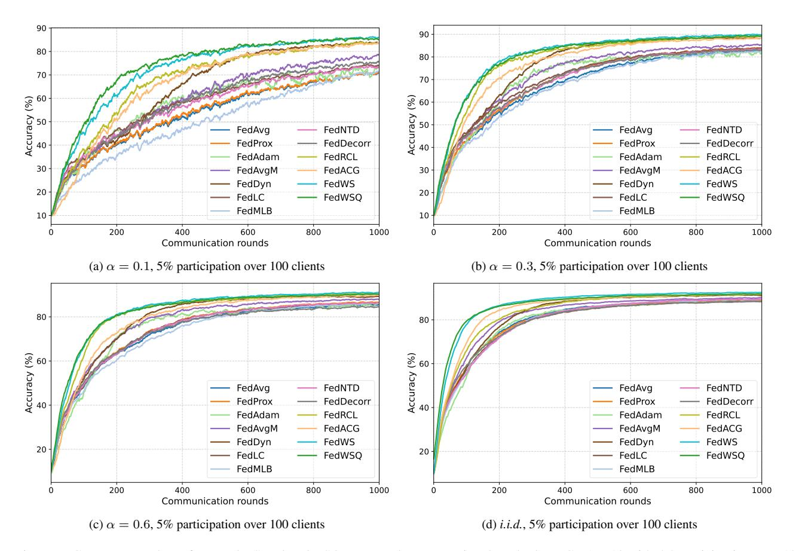
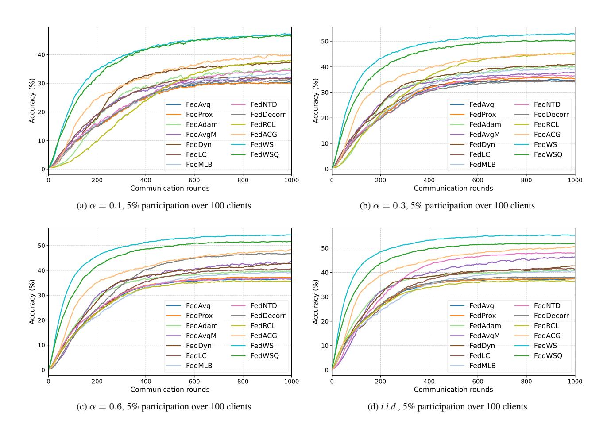

# C. Experimental setup

Implementation details We follow most of the implementation setups and evaluation protocols in [\[1,](#page-8-7) [20,](#page-8-20) [38,](#page-9-20) [48\]](#page-9-21). The ResNet-18 architecture [\[11\]](#page-8-23) is adopted as our backbone network. Consistent with [\[12\]](#page-8-24) and common practice in FL, all BN layers in ResNet-18 are replaced with GN layers. Following the recommendation of Qiao *et al*. [\[35\]](#page-9-8), WS is applied before each GN layer. All the models are trained from scratch by using the SGD optimizer with an initial learning rate of 0.1 and a weight decay of 0.001. For the proposed model, the learning rate is exponentially decayed at each communication round by a factor of 0.995. For the other models compared, we select the learning decay parameter from {0.995, 0.998, 1} to attain the best accuracy. The global learning rate of FedAdam is set to 0.01, and that of the other methods is set to 1. Momentum is not used following the previous works [\[1,](#page-8-7) [20,](#page-8-20) [48\]](#page-9-21), and gradient clipping is applied for learning stability. Unless otherwise noted, the number of local training epochs per round is set to 5, with the batch size adjusted so that each local epoch consists of 10 iterations. The hyper-parameter of WS is set to ρ = 0.001. The source code is implemented by using the PyTorch framework [\[34\]](#page-9-26) on NVIDIA RTX 4090 GPUs. We set the number of local training epochs to 5. The batch size for local updates is adjusted so that each local epoch has 10 iterations (*i.e*., 50 iterations during a single communication round).

Hyper-parameter selection We adopt the hyper-parameter settings of the baseline methods suggested in [\[20,](#page-8-20) [38\]](#page-9-20). Table [A](#page-12-1) summarizes the hyper-parameter settings we used, with the notations consistent with the original papers.

Table A. Summary of hyper-parameter selection

| Method         | Hyper-parameters                     |
|----------------|--------------------------------------|
| FedProx [27]   | µ = 0.001                            |
| FedAvgM [13]   | β = 0.4                              |
| FedADAM [36]   | τ = 0.001, β1 = 0.9, β2 = 0.99 |
| FedDyn [1]     | α = 0.1                              |
| FedMLB [21]    | τ = 1, λ1 = 1, λ2 = 1          |
| FedLC [52]     | τ = 1                                |
| FedNTD [26]    | τ = 1, β = 0.3                       |
| FedDecorr [39] | β = 0.01                             |
| FedRCL [38]    | τ = 0.05, β = 1, λ = 0.7             |
| FedACG [20]    | β = 0.001, λ = 0.85                  |

QLs of NUQ methods Figure [A](#page-13-0) provides a comparative visualization of the QLs adopted by different NUQ methods. The histogram illustrates the empirical distribution of LMPUs with the standard normal distribution curve. As shown in the figure, the proposed DANUQ places QLs more adaptively based on the statistical structure of LMPUs, leading to improved quantization efficiency.

Figure A. Visualization of QLs used in different NUQ methods. The histogram represents the empirical distribution of LMPUs in the 1st and 3rd ResNet-18 blocks, and the red curve denotes the standard normal distribution. The vertical dashed lines indicate the QLs chosen by different methods, NF, FP, and the proposed DANUQ, where the 4-bit representation is used.

### D. Convergence plot evaluated on various federated learning scenarios

Figures B-D present the convergence plots of various FL methods on CIFAR-10, CIFAR-100, and Tiny-ImageNet, for i.i.d and non-i.i.d. data distributions with  $\alpha \in \{0.05, 0.1, 0.3, 0.6\}$ , using a participation rate of 5% over 100 distributed clients. As shown in the figures, FedWSQ consistently enhances the FL performance of conventional methods, outperforming those of state-of-the-art FL approaches.

Figure B. Convergence plots of our FedWS and FedWSQ compared to conventional methods on CIFAR-10 with 5% participation over 100 clients under varying Dirichlet parameters.

Figure C. Convergence plots of our FedWS and FedWSQ compared to conventional methods on CIFAR-100 with 5% participation over 100 clients under varying Dirichlet parameters.

Figure D. Convergence plots of our FedWS and FedWSQ compared to conventional methods on Tiny-ImageNet with 5% participation over 100 clients under varying Dirichlet parameters.