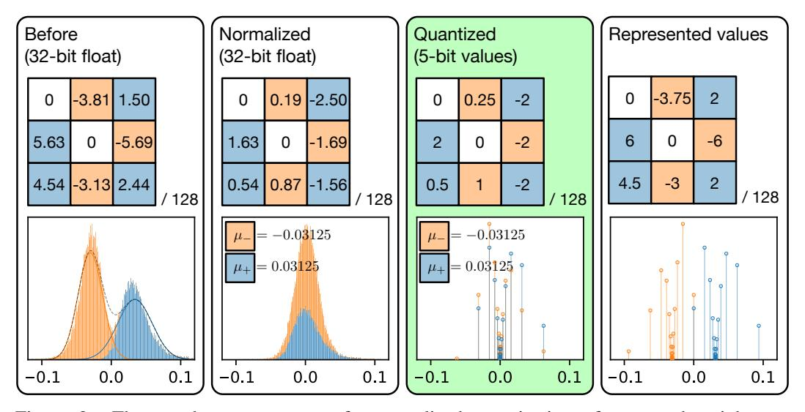

# 2 Related Work

Recently, a wide range of techniques have been proposed and proven effective for reducing the memory and computation requirements of CNNs. These proposed optimizations can provide direct reductions in memory footprints, bandwidth requirements, total number of arithmetic operations, arithmetic complexities or a combination of these properties.

Pruning-based optimization methods directly reduce the number of parameters in a network. Finegrained pruning method [\[6\]](#page-9-1) significantly reduces the size of a model but introduces element-wise sparsity. Coarse-grained pruning [\[17,](#page-9-3) [4\]](#page-9-4) shrinks model sizes and reduce computation at a higher granularity that is easier to accelerate on commodity hardware. Quantization methods allow parameters to be represented in more efficient data formats. Quantizing weights to powers-of-2 recently gained attention because it not only reduces the model size but also simplifies computation [\[14,](#page-9-5) [26,](#page-10-0) [18,](#page-10-5) [24\]](#page-10-3). Previous research also focused on quantizing CNNs to extremely low bit-widths such as ternary [\[27\]](#page-10-6) or binary [\[12\]](#page-9-6) values. They however introduce large numerical errors and thus cause significant degradations in model accuracies. To minimize loss in accuracies, the proposed methods of [\[23\]](#page-10-4) and [\[15\]](#page-9-2) quantize weights to *N* binary values, compute *N* binary convolutions and scale the convolution outputs individually before summation. Lossy and lossless encodings are other popular methods to reduce the size of a DNN, typically used in conjunction with pruning and quantization [\[3,](#page-9-7) [7\]](#page-9-8).

Since many compression techniques are available and building a compression pipeline provides a multiplying effect in compression ratios, researchers start to chain multiple compression techniques. Han *et al.* [\[7\]](#page-9-8) proposed Deep Compression that combines pruning, quantization and Huffman encoding. Dubey *et al.* [\[3\]](#page-9-7) built a compression pipeline using their coreset-based filter representations. Tung *et al.* [\[22\]](#page-10-7) and Polino *et al.* [\[20\]](#page-10-8) integrated multiple compression techniques, where [\[22\]](#page-10-7) combined pruning with quantization and [\[20\]](#page-10-8) employed knowledge distillation on top of quantization. Although there are many attempts in building an efficient compression pipeline, the statistical relationship between pruning and quantization lacked exploration. In this paper, we look at exactly this problem and propose a new method that exploits the statistical properties of weights in pruned models to quantize them efficiently and effectively.

Figure 2: The step-by-step process of recentralized quantization of unpruned weights on block3f/conv1 in sparse ResNet-50. Each step shows how it changes a filter and the distribution of weights. Higher peaks in the histograms denote values found with higher frequency. Values in the filter share a common denominator 128, indicated by "*/*128". The first estimates the highprobability regions with a Gaussian mixture, and assign weights to a Gaussian component. The second normalizes each weight. The third quantizes the normalized values with shift quantization and produces a representation of quantized weights used for inference. The final block visualizes the actual numerical values after quantization.

