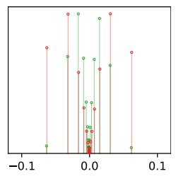

# 3.3 Optimizing Recentralized Quantization $Q[\theta]$

Hyperparameters  $\mu_c$  and  $\sigma_c$  in recentralized quantization can be optimized by applying the following two-step process in a layer-wise manner, which first identifies regions with high probabilities (first block in Figure 2), then locally quantize them with shift quantization (second and third blocks in Figure 2). First, we notice that in general, the weight distribution resembles a mixture of Gaussian distributions. It is thus more efficient to find a Gaussian mixture model  $q_{\phi}^{\rm mix}(\theta)$  that approximates the original distribution  $p(\theta|\mathcal{D})$  to closely optimize the above objective:

$$q_{\phi}^{\text{mix}}(\theta) = \sum_{c \in C} \lambda_c f(\theta | \mu_c, \sigma_c), \tag{3}$$

where  $f(\theta|\mu_c,\sigma_c)$  is the probability density function of the Gaussian distribution  $\mathcal{N}(\mu_c,\sigma_c)$ , the nonnegative  $\lambda_c$  defines the mixing weight of the  $c^{\text{th}}$  component and  $\Sigma_{c\in C}$   $\lambda_c=1$ . Here, we find the set of hyperparameters  $\mu_c$ ,  $\sigma_c$  and  $\lambda_c$  contained in  $\phi$  that maximizes  $q_{\phi}^{\text{mix}}(\theta)$  given that  $\theta \sim p(\theta|\mathcal{D})$ . This is known as the *maximum likelihood estimate* (MLE), and the MLE can be efficiently computed by the *expectation-maximization* (EM) algorithm [1]. In practice, we found it sufficient to use two Gaussian components,  $C=\{-,+\}$ , for identifying high-probability regions in the weight distribution. For faster EM convergence, we initialize  $\mu_-,\sigma_-$  and  $\mu_+,\sigma_+$  respectively with the means and standard deviations of negative and positive values in the layer weights respectively, and  $\lambda_-,\lambda_+$  with  $\frac{1}{2}$ .

We then generate  $m_{\theta}$  from the mixture model, which individually selects the component to use for each weight. For this,  $m_{\theta}$  is evaluated for each  $\theta$  by sampling a categorical distribution where the probability of assigning a component c to  $m_{\theta}$ , i.e.  $p(m_{\theta} = c)$ , is  $\lambda_c f(\theta | \mu_c, \sigma_c) / q_{\phi}^{mix}(\theta)$ .

Finally, we set the constant b to a powers-of-two value, chosen to ensure that  $q_{n,b}^{\rm shift}$   $[\cdot]$  allows at most a proportion of  $\frac{1}{2^n+1}$  values to overflow and clips them to the maximum representable magnitude. In practice, this heuristic choice makes better use of the quantization levels provided by shift quantization than disallowing overflows. After determining all of the relevant hyperparameters with the method described above,  $\hat{\theta} = Q[\theta]$  can be evaluated to quantize the layer weights.

### 3.4 Choosing the Appropriate Quantization

As we have discussed earlier, the weight distribution of sparse layers may not always have multiple high-probability regions. For example, fitting a mixture model of two Gaussian components on the layer in Figure 3a gives highly overlapped components. It is therefore of little consequence which component we use to quantize a particular weight value. Under this scenario, we can simply use n-bit shift quantization  $Q_{n,b}^{\rm shift}[\cdot]$  instead of a n-bit  $Q[\cdot]$  which internally uses a (n-1)-bit signed shift quantization. By moving the 1 bit used to represent the now absent m to shift quantization, we further increase its precision.

(b) Overlapping components.

Figure 3: The weight distribution of the layer block22/conv1 in a sparse ResNet-18 trained on ImageNet, as shown by the histograms. It shows that when the two Gaussian components have a large overlap, quantizing with either one of them results in almost the same quantization levels.

To decide whether to use shift or recentralized quantization, it is necessary to introduce a metric to compare the similarity between the pair of components. While the KL-divergence provides a measure for similarity, it is however non-symmetric, making it unsuitable for this purpose. To address this, we propose to first normalize the distribution of the mixture, then to use the 2-Wasserstein metric between the two Gaussian components after normalization as a decision criterion, which we call the *Wasserstein separation*:

$$W(c_1, c_2) = \frac{1}{\sigma^2} \left( (\mu_{c_1} - \mu_{c_2})^2 + (\sigma_{c_1} - \sigma_{c_2})^2 \right), \tag{4}$$

where  $\mu_c$  and  $\sigma_c$  are respectively the mean and standard deviation of the component  $c \in \{c_1, c_2\}$ , and  $\sigma^2$  denotes the variance of the entire weight distribution. FQ can then adaptively pick to use recentralized quantization for all sparse layers except when  $\mathcal{W}(c_1, c_2) < w_{\rm sep}$ , and shift quantization is used instead. In our experiments, we found  $w_{\rm sep} = 2.0$  usually provides a good decision criterion. In Section 4.3, we additionally study the impact of quantizing a model with different  $w_{\rm sep}$  values.

#### 3.5 Model Optimization

To optimize the quantized sparse model, we integrate the quantization process described above into the gradient-based training of model parameters. Initially, we compute the hyperparameters  $\mu_c$ ,  $\sigma_c$ ,  $\lambda_c$  for each layer, and generate the component selection mask  $m_\theta$  for each weight  $\theta$  with the method in Section 3.3. The resulting model is then fine-tuned where the forward pass uses quantized weights  $\hat{\theta} = Q[\theta]$ , and the backward pass updates the floating-point weight parameters  $\theta$  by treating the quantization as an identity function. During the fine-tuning process, the hyperparameters used by  $Q[\theta]$  are updated using the current weight distribution at every k epochs. We also found that in our

experiments, exponentially increasing the interval *k* between consecutive hyperparameter updates helps to reduce the variance introduced by sampling and improves training quality.

### 3.6 The MDL Perspective

Theoretically, the model optimization can be formulated as a *minimum description length* (MDL) optimization [10, 5]. Given that we approximate the posterior  $p(\theta|\mathcal{D})$  with a distribution of quantized weights  $q_{\phi}(\theta)$ , where  $\phi$  contains the hyperparameters used by the quantization function  $Q[\theta]$ , the MDL problem minimizes the *variational free energy* [5],  $\mathcal{L}(\theta, \alpha, \phi) = \mathcal{L}_E + \mathcal{L}_C$ , where:

$$\mathcal{L}_{E} = \mathbb{E}_{\hat{\boldsymbol{\theta}} \sim q_{\phi}(\theta)} \left[ -\log p(\mathbf{y}|\mathbf{x}, \boldsymbol{\alpha}, \hat{\boldsymbol{\theta}}) \right], \quad \mathcal{L}_{C} = \mathrm{KL} \left( q_{\phi}(\theta) \| p(\theta|\mathcal{D}) \right).$$
 (5)

The error cost  $\mathcal{L}_{\mathrm{E}}$  reflects the cross-entropy loss of the quantized model, with quantized weights  $\hat{\theta}$  and layer-wise scalings  $\alpha$ , trained on the dataset  $\mathcal{D}=(\mathbf{x},\mathbf{y})$ , which is optimized by stochastic gradient descent. The complexity cost  $\mathcal{L}_{\mathrm{C}}$  is the *Kullback-Leibler* (KL) divergence from the quantized weight distribution to the original. Intuitively, minimizing  $\mathcal{L}_{\mathrm{C}}$  reduces the discrepancies between the weight distributions before and after quantization. As this is intractable, we replace  $q_{\phi}(\theta)$  with a close surrogate, a Gaussian mixture  $q_{\phi}^{\mathrm{mix}}(\theta)$ . It turns out that the process of finding the MLE discussed in Section 3.3 is equivalent to minimizing  $\mathrm{KL}\left(q_{\phi}^{\mathrm{mix}}(\theta)\|p(\theta|\mathcal{D})\right)$ , a close proxy for  $\mathcal{L}_{\mathrm{C}}$ . Section 3.5 then interleaves the optimization of  $\mathcal{L}_{\mathrm{E}}$  and  $\mathcal{L}_{\mathrm{C}}$  to minimize the MDL objective  $\mathcal{L}(\theta, \alpha, \phi)$ .

### 4 Evaluation

We applied *focused compression* (FC), a compression flow which consists of pruning, FQ and Huffman encoding, on a wide range of popular vision models including MobileNets [11, 21] and ResNets [8, 9] on the ImageNet dataset [2]. For all of these models, FC produced models with high compression ratios (CRs) and permitted a multiplication-free hardware implementation of convolution while having minimal impact on the task accuracy. In our experiments, models are initially sparsified using Dynamic Network Surgery [6]. FQ is subsequently applied to restrict weights to low-precision values. During fine-tuning, we additionally employed Incremental Network Quantization (INQ) [26] and gradually increased the proportion of weights being quantized to 25%, 50%, 75%, 87.5% and 100%. At each step, the models were fine-tuned for 3 epochs at a learning rate of 0.001, except for the final step at 100% we ran for 10 epochs, and decay the learning rate every 3 epochs. Finally, Huffman encoding was applied to model weights which further reduced model sizes. To simplify inference computation in custom hardware (Section 4.2), in our experiments  $\mu_-$  and  $\mu_+$  are quantized to the nearest powers-of-two values, and  $\sigma_-$  and  $\sigma_+$  are constrained to be equal.

## 4.1 Model Size Reduction

Table 1 compares the accuracies and compression rates before and after applying the compression pipeline under different quantization bit-widths. It demonstrates the effectiveness of FC on the models. We found that sparsified ResNets with 7-bit weights are at least  $16\times$  smaller than the original dense model with marginal degradations ( $\le 0.24\%$ ) in top-5 accuracies. MobileNets, which are much less redundant and more compute-efficient models to begin with, achieved a smaller CR at around  $8\times$  and slightly larger accuracy degradations ( $\le 0.89\%$ ). Yet when compared to the ResNet-18 models, it is not only more accurate, but also has a significantly smaller memory footprint at 1.71 MB.

In Table 2 we compare FC with many state-of-the-art model compression schemes. It shows that FC simultaneously achieves the best accuracies and the highest CR on both ResNets. Trained Ternary Quantization (TTQ) [27] quantizes weights to ternary values, while INQ [26] and extremely low bit neural network (denoted as ADMM) [14] quantize weights to ternary or powers-of-two values using shift quantization. Distillation and Quantization (D&Q) [20] quantize parameters to integers via distillation. Note that D&Q's results used a larger model as baseline, hence the compressed model has high accuracies and low CR. We also compared against Coreset-Based Compression [3] comprising pruning, filter approximation, quantization and Huffman encoding. For ResNet-50, we additionally compare against ThiNet [17], a filter pruning method, and Clip-Q [22], which interleaves training steps with pruning, weight sharing and quantization. FC again achieves the highest CR (18.08×) and accuracy (74.86%).

Table 1: The accuracies (%), sparsities (%) and CRs of focused compression on ImageNet models. The baseline models are dense models before compression and use 32-bit floating-point weights, and 5 bits and 7 bits denote the number of bits used by individual weights of the quantized models before Huffman encoding.

| Model        | Top-1 | Δ     | Top-5 | Δ     | Sparsity | Size (MB) | $\mathbf{CR}(\times)$ |
|--------------|-------|-------|-------|-------|----------|-----------|-----------------------|
| ResNet-18    | 68.94 | _     | 88.67 | _     | 0.00     | 46.76     | _                     |
| Pruned       | 69.24 | 0.30  | 89.05 | 0.38  | 74.86    | 8.31      | 5.69                  |
| 5 bits       | 68.36 | -0.58 | 88.45 | -0.22 | 74.86    | 2.86      | 16.33                 |
| 7 bits       | 68.57 | -0.37 | 88.53 | -0.14 | 74.86    | 2.94      | 15.92                 |
| ResNet-50    | 75.58 |       | 92.83 | _     | 0.00     | 93.82     | _                     |
| Pruned       | 75.10 | -0.48 | 92.58 | -0.25 | 82.70    | 11.76     | 7.98                  |
| 5 bits       | 74.86 | -0.72 | 92.59 | -0.24 | 82.70    | 5.19      | 18.08                 |
| 7 bits       | 74.99 | -0.59 | 92.59 | -0.24 | 82.70    | 5.22      | 17.98                 |
| MobileNet-V1 | 70.77 |       | 89.48 | _     | 0.00     | 16.84     |                       |
| Pruned       | 70.03 | -0.74 | 89.13 | -0.35 | 33.80    | 6.89      | 2.44                  |
| 7 bits       | 69.13 | -1.64 | 88.61 | -0.87 | 33.80    | 2.13      | 7.90                  |
| MobileNet-V2 | 71.65 | _     | 90.44 | _     | 0.00     | 13.88     |                       |
| Pruned       | 71.24 | -0.41 | 90.31 | -0.13 | 31.74    | 5.64      | 2.46                  |
| 7 bits       | 70.05 | -1.60 | 89.55 | -0.89 | 31.74    | 1.71      | 8.14                  |

Table 2: Comparisons of top-1 and top-5 accuracies (%) and CRs with various compression methods. Numbers with \* indicate results not originally reported and calculated by us. Note that D&Q used a much larger ResNet-18, the 5 bases used by ABC-Net denote 5 separate binary convolutions. LQ-Net used a "pre-activation" ResNet-18 [9] with a 1.4% higher accuracy baseline than ours.

| ResNet-18                            | Top-1 | Top-5 | Size (MB) | CR (×)                |
|--------------------------------------|-------|-------|-----------|-----------------------|
| TTQ [27]                             | 66.00 | 87.10 | 2.92*     | 16.00*                |
| INQ (2 bits) [26]                    | 66.60 | 87.20 | 2.92*     | 16.00*                |
| INQ (3 bits) [26]                    | 68.08 | 88.36 | 4.38*     | 10.67*                |
| ADMM (2 bits) [14]                   | 67.0  | 87.5  | 2.92*     | 16.00*                |
| ADMM (3 bits) [14]                   | 68.0  | 88.3  | 4.38*     | 10.67*                |
| ABC-Net (5 bases, or 5 bits) [15]    | 67.30 | 87.90 | 7.30*     | 6.4 *                 |
| LQ-Net (preact, 2 bits) [23]         | 68.00 | 88.00 | 2.92*     | 16.00*                |
| D&Q (large) [20]                     | 73.10 | 91.17 | 21.98     | 2.13*                 |
| Coreset [3]                          | 68.00 | _     | 3.11*     | 15.00                 |
| Focused compression (5 bits, sparse) | 68.36 | 88.45 | 2.86      | 16.33                 |
| ResNet-50                            | Top-1 | Top-5 | Size (MB) | $\mathbf{CR}(\times)$ |
| INQ (5 bits) [26]                    | 74.81 | 92.45 | 14.64*    | 6.40*                 |
| ADMM (3 bits) [14]                   | 74.0  | 91.6  | 8.78*     | 10.67*                |
| ThiNet [17]                          | 72.04 | 90.67 | 16.94     | 5.53*                 |
| Clip-Q [22]                          | 73.70 | —     | 6.70      | 14.00*                |
| Coreset [3]                          | 74.00 | _     | 5.93*     | 15.80                 |
| Focused compression (5 bits, sparse) | 74.86 | 92.59 | 5.19      | 18.08                 |

