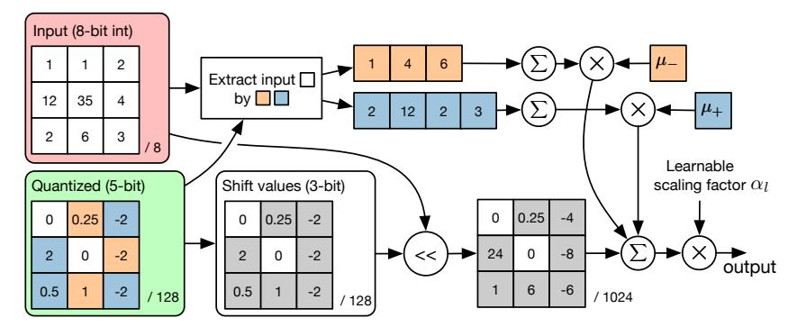

# 4.3 Exploring the Wasserstein Separation

In Section [3.4,](#page-4-2) we mentioned that some of the layers in a sparse model may not have multiple high-probability regions. For this reason, we use the Wasserstein distance W(*c*1*, c*2) between the two components in the Gaussian mixture model as a metric to differentiate whether recentralized or shift quantization should be used. In our experiments, we specified a threshold *w*sep = 2*.*0 such that for each layer, if W(*c*1*, c*2) ≥ *w*sep then recentralized quantization is used, otherwise shift quantization is employed instead. Figure [5](#page-8-2) shows the impact of choosing different *w*sep ranging from 1.0 to 3.5 at 0.1 increments on the Top-1 accuracy. This model is a fast CIFAR-10 [\[13\]](#page-9-16) classifier with only 9 convolutional layers, so that it is possible to repeat training 100 times for each *w*sep value to produce high-confidence results. Note that the average validation accuracy is minimized when the layer

It is also notable that LQ-Net used "pre-activation" ResNet-18 which has a 1.4% advantage in baseline accuracy compared to ours.

Figure 4: An implementation of the dot-product used in convolution between an integer input and a filter quantized by recentralized quantization. The notation */N* means the filter values share a common denominator *N*.

Figure 5: The effect of different threshold values on the Wasserstein distance. The larger the threshold, the fewer the number of layers using recentralized quantization instead of shift quantization.

with only one high-probability region uses shift quantization and the remaining 8 use recentralized quantization, which verifies our intuition.

