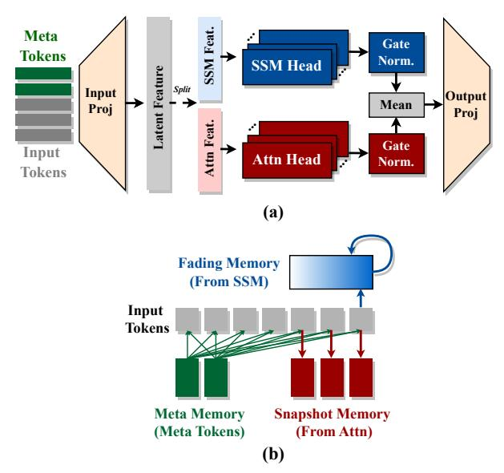
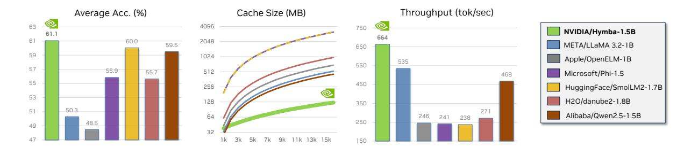
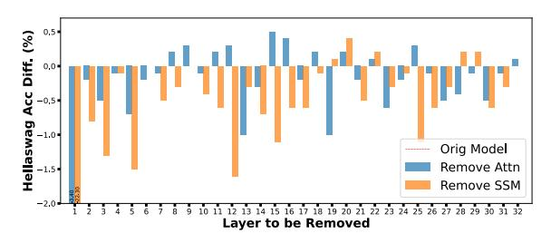
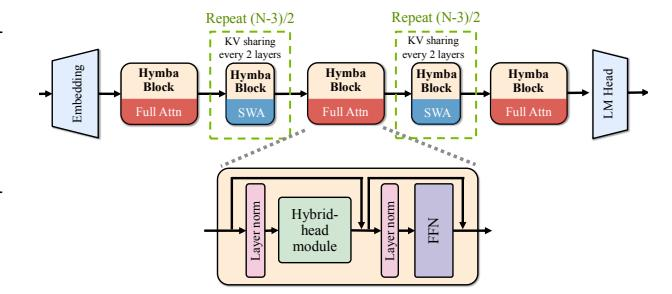
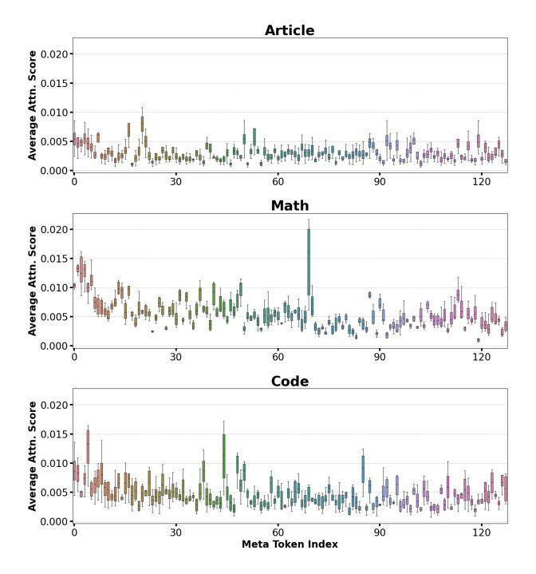
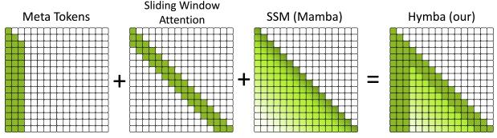
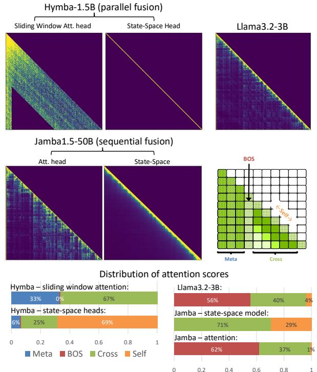
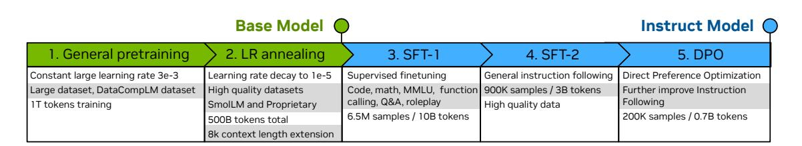

# Hymba: A Hybrid-head Architecture for Small Language Models

Xin Dong\*, Yonggan Fu\*2, Shizhe Diao, Wonmin Byeon, Zijia Chen, Ameya Sunil Mahabaleshwarkar, Shih-Yang Liu³, Matthijs Van Keirsbilck, Min-Hung Chen, Yoshi Suhara, Yingyan Celine Lin², Jan Kautz, Pavlo Molchanov

Abstract: We propose Hymba, a family of small language models featuring a hybrid-head parallel architecture that integrates transformer attention mechanisms with state space models (SSMs) for enhanced efficiency. Attention heads provide high-resolution recall, while SSM heads enable efficient context summarization. Additionally, we introduce learnable meta tokens that are prepended to prompts, storing critical information and alleviating the "forced-to-attend" burden associated with attention mechanisms. This model is further optimized by incorporating cross-layer key-value (KV) sharing and partial sliding window attention, resulting in a compact cache size. During development, we conducted a controlled study comparing various architectures under identical settings and observed significant advantages of our proposed architecture. Notably, Hymba achieves state-of-the-art results for small LMs: Our Hymba-1.5B-Base model surpasses all sub-2B public models in performance and even outperforms Llama-3.2-3B with 1.32% higher average accuracy, an 11.67× cache size reduction, and 3.49× throughput.

Models on Hugging Face: Hymba-1.5B-Base | Hymba-1.5B-Instruct

#### 1. Introduction

Transformers, with their attention-based architecture, have become the dominant choice for language models (LMs) due to their strong performance, parallelization capabilities, and long-term recall through key-value (KV) caches [1]. However, their quadratic computational cost and high memory demands pose efficiency challenges. In contrast, state space models (SSMs) like Mamba [2] and Mamba-2 [3] offer constant complexity and efficient hardware optimization but struggle with memory recall tasks, affecting their performance on general benchmarks [4, 5]. While existing hybrid models that stack attention and SSM layers have demonstrated potential [6, 7], they can introduce bottlenecks when one layer type is not wellsuited for specific tasks, requiring compensation from subsequent layers.

We propose Hymba, a novel LM architecture that integrates attention heads and SSM heads within the same layer, offering parallel and complementary processing of the same inputs. This hybrid-head approach allows each layer to simultaneously harness both the high-resolution recall of attention and the efficient context summarization of SSMs, increasing the model's flexibility and expressiveness in handling various types of information flows and memory access patterns.

To further enhance the achievable performance of Hymba, we introduce learnable meta tokens that are prepended to the input sequences and interact with all

Figure 1 | (a) Visualize the hybrid-head module in Hymba; (b) Interpret from the memory aspect.

subsequent tokens even in sliding window attention. These meta tokens appear to act as a compressed representation of world knowledge and alleviate the issue of "softmax attention not being able to attend to nothing" [8, 9, 10], improving performance across both general and recall-intensive tasks.

Sharing KV cache between attention heads is common practice. Inspired by findings in [11] that consec-

\* Equal contribution; additional affiliation:  $^2$  with Georgia Institute of Technology, USA;  $^3$  with HKUST © 2024 NVIDIA. All rights reserved.

Figure 2 | Performance comparison of Hymba-1.5B against sub-2B models in terms of average task accuracy, cache size (MB) relative to sequence length, and throughput (tok/sec). Specifically, the tasks include 5-shot MMLU, ARC-C, ARC-E, PIQA, Hellaswag, Winogrande, and SQuAD-C, and the throughput is measured on an NVIDIA A100 with a sequence length of 8k and a batch size of 128 using PyTorch. For models encountering out-of-memory (OOM) issues during throughput measurement, we halve the batch size until the OOM is resolved. This approach is used to measure the maximal achievable throughput without OOM.

utive layers have a high correlation in the KV cache, we propose sharing the KV cache between layers as well. Additionally, for most layers, we choose sliding window attention to further minimize cache costs.

Comprehensive evaluations and ablation studies demonstrate that  $\mathbf{Hymba}$  not only establishes new state-of-the-art (SOTA) benchmark performance across a wide range of representative tasks but also achieves greater efficiency compared to transformers and previous hybrid models. We provide the benchmark with other representative small LMs in Fig. 2, with more comprehensive benchmarks in Fig. 9. For instance, in commonsense reasoning tasks,  $\mathbf{Hymba-1.5B}$  can outperform Llama-3.2-3B with 1.32% higher average accuracy, while requiring  $11.67\times$  smaller cache size and being  $3.49\times$  faster.

To optimize Hymba for on-device tasks, we employ supervised finetuning and direct preference optimization [12]. Our instruction-tuned model, Hymba-1.5B-Instruct, achieves best-in-class per-

formance on GSM8K, GPQA, and the Berkeley function-calling leaderboard, surpassing Llama-3.2-1B. Additionally, parameter-efficient finetuning shows Hymba's strong potential in this setting. For instance, a DoRA [13]-finetuned version of Hymba-1.5B outperforms Llama3.1-8B-Instruct by 2.4% on RoleBench [14].

## 2. Hymba: The Proposed Hybrid-Head Architecture

SSMs such as Mamba [2] were introduced to address the quadratic complexity and large inference-time KV cache issues of transformers. However, due to their low-resolution memory, SSMs struggle with memory recall and performance [4, 15, 5]. To overcome these limitations, we propose a roadmap for developing efficient and high-performing small LMs in Tab. 1 and outlined as follows:

Fused hybrid modules. Fusing attention and SSM

| Configuration                                       | Commonsense Reasoning (%) | Recall (%) | Throughput (token/sec) | Cache Size (MB) | Design Reason                       |  |  |  |
|-----------------------------------------------------|------------------------------|------------|------------------------|--------------------|-------------------------------------|--|--|--|
| Ablations on 300M model size and 1                  | 00B training toke            | ns         |                        |                    |                                     |  |  |  |
| Transformer (Llama)                                 | 44.08                        | 39.98      | 721.1                  | 414.7              | Accurate recall while inefficient   |  |  |  |
| State Space Models (Mamba)                          | 42.98                        | 19.23      | 4720.8                 | 1.9                | Efficient while inaccurate recall   |  |  |  |
| A. + Attention heads (sequential)                   | 44.07                        | 45.16      | 776.3                  | 156.3              | Enhance recall capabilities         |  |  |  |
| B. + Multi-head structure (parallel)                | 45.19                        | 49.90      | 876.7                  | 148.2              | Better balance of two modules       |  |  |  |
| C. + Local / global attention                       | 44.56                        | 48.79      | 2399.7                 | 41.2               | Boost compute/cache efficiency      |  |  |  |
| D. + KV cache sharing                               | 45.16                        | 48.04      | 2756.5                 | 39.4               | Cache efficiency                    |  |  |  |
| E. + Meta tokens                                    | 45.59                        | 51.79      | 2695.8                 | 40.0               | Learned memory initialization       |  |  |  |
| Scaling to 1.5B model size and 1.5T training tokens |                              |            |                        |                    |                                     |  |  |  |
| F. + Size / data                                    | 60.56                        | 64.15      | 664.1                  | 78.6               | Further boost task performance      |  |  |  |
| G. + Extended context length (2K $\rightarrow$ 8K)  | 60.64                        | 68.79      | 664.1                  | 78.6               | Improve multi-shot and recall tasks |  |  |  |

Table 1 | Design roadmap of our Hymba model. We evaluate the models' (1) commonsense reasoning accuracy, averaged over 8 tasks, and (2) recall accuracy, averaged over 2 tasks, which corresponds to retrieving relevant information from past input. The throughput is on NVIDIA A100, sequence length 8k, batch size 128. The cache size is measured with a 8k sequence length, assuming the FP16 format.

heads in parallel within a hybrid-head module outperforms sequential stacking (Tab. 1 (A)-(B)). Both heads process the same information simultaneously, leading to improved reasoning and recall accuracy. We argue that sequential fusion lacks synergy, as both blocks operate on each set of inputs independently.

Efficiency and KV cache optimization. While attention heads improve task performance, they increase KV cache requirements and reduce throughput. To mitigate this, we optimize the hybrid-head module by combining local and global attention and employing cross-layer KV cache sharing, as shown in Tab. 1 (C) and (D). This improves throughput by  $3\times$  and reduces cache by almost  $4\times$ .

Meta Tokens – A set of 128 pretrained embeddings prepended to inputs, functioning as learned cache initialization to enhance focus on relevant information. These tokens serve a dual purpose: (i) they mitigate attention drain by acting as backstop tokens, redistributing attention effectively, and (ii) they encapsulate compressed world knowledge, see Tab. 1 (E) and Sec. 2.3.

Scaling – Ablation studies were performed on a 300M parameter model using 100B training tokens; the final models were trained with 1.5T tokens and scaled up to models with 350M and 1.5B parameters (see Tab. 1 (F)).

#### 2.1. A Fused Hybrid-Head Module

SSM models are efficient but suffer from limited recall capabilities and task performance [4, 15, 5, 16] as seen in Tab. 1. Given the high recall resolution of attention, in this step we aim to (1) combine the processing efficiency and context summarization capabilities of SSMs with the high recall resolution of attention, and (2) develop a fused building block to achieve this goal, so it can serve as a fundamental component for constructing future foundation models.

Previous hybrid models [7, 17, 6] often combine attention and SSMs in a sequential manner. This strategy may lead to information bottlenecks when a layer type that is poorly suited for a specific task cannot effectively process the information. Motivated by the multi-head attention structure in the vanilla Transformer [1], where different heads undertake different roles and focus on different contexts [18, 19], we propose an alternative approach: fusing attention and SSMs in parallel into a hybrid-head module, as shown in Fig. 1 (a). The advantage of this design is that different attention and SSM heads can store, retrieve, and process the same piece of information in distinct ways, thereby inheriting the strengths of both operators.

**Design formulation.** We show that the hybridhead module can be represented by a unified and symmetric formulation. As shown in Fig. 1 (a), given the input sequence  $\tilde{X}$ , which is the original input sequence X prepended with meta tokens introduced in Sec. 2.3, the input projection  $W_{\text{in\_proj}} = [W^Q, W^K, W^V, W^{SSM}, W^G]$  projects  $\tilde{X}$  to the query, key, and value of the attention heads using  $W^Q, W^K$ , and  $W^V$ , respectively, as well as the input features and gates of the SSM heads using  $W^{SSM}$  and  $W^G$ , respectively.

Following [1], the output of attention heads  $Y_{\text{attn}}$  can be formulated as:

$$Y_{\text{attn}} = \text{softmax}(QK^T) W^V \tilde{X} = M_{\text{attn}} \tilde{X}$$
 (1)

where  $M_{\text{attn}} = \text{softmax}(QK^T) W^V$  and  $Q = W^Q \tilde{X}$ ,  $K = W^K \tilde{X}$ .

Similar to the attention heads, the SSM heads in our model, for which we adopt Mamba [2], can also be represented using a data-controlled linear operator  $M_{\rm ssm}$ , following [20, 16]. Specifically, the SSM head output  $Y_{\rm ssm}$  can be formulated as:

$$\alpha^{i,j} = C_i \left( \prod_{k=j+1}^i \exp(A\Delta_k) \right) B_j \Delta_j,$$

$$Y_{\text{ssm}} = G \odot \alpha(A, B, C, \Delta) \ W^{SSM} \tilde{X} = M_{\text{ssm}} \tilde{X},$$
(2)

where  $M_{\mathrm{ssm}} = G \odot \alpha(A,B,C,\Delta) \ W^{SSM}, \ G = W^G \tilde{X}$  is an output gate, and  $A,B,C,\Delta$  are the SSM parameters following the definition in [2]. More specifically, A is a learnable matrix,  $B = W_B X_{ssm}, \ C = W_C X_{ssm},$  and  $\Delta = \mathrm{Softplus}(W_\Delta X_{ssm})$  with  $X_{ssm} = W^{SSM} \hat{X}$ .

We observed that the output magnitudes of the SSM heads,  $Y_{\rm ssm}$ , are consistently larger than those of the attention heads,  $Y_{\rm attn}$ , as visualized in Fig. 12 in Append. B. To ensure effective fusion, we normalize and re-scale them using learnable vectors to improve training stability, and then average the outputs, followed by a final output projection. The overall formulation of our fused module can be represented symmetrically:

$$Y = W_{\text{out\_proj}} \left( \beta_1 \text{norm}(M_{\text{attn}} \tilde{X}) + \beta_2 \text{norm}(M_{\text{ssm}} \tilde{X}) \right)$$
(3)

where  $\beta_1$  and  $\beta_2$  are learnable vectors that re-scale each channel of the outputs from the attention and SSM heads, respectively. We further explore the optimal ratio of SSMs and attention in hybrid heads, along with their fusion strategy, in Append. B.

Interpretation from the memory aspect. The components in the hybrid-head module can be interpreted as analogous to human brain functions. Specifically, as shown in Fig. 1 (b), the attention heads

provide high recall resolution and thus act like snapshot memories in the human brain, storing detailed recollections of a moment or event. In contrast, the SSM heads summarize the context through a constant cache and thus function as fading memories, which gradually forget the details of past events while retaining their core or gist. As shown in Tab. [10](#page-18-0) in Append. [B,](#page-15-0) in our Hymba, the summarized global context from fading memories enables allocating more snapshot memories for memorizing local information while maintaining recall capabilities. This is achieved by replacing most global attention with local attention, thus improving memory efficiency.

Figure 3 | Visualize the accuracy difference, measured using 1000 samples from Hellaswag [\[21\]](#page-11-3), after removing the Attention or SSM heads in each layer.

**Head importance analysis.** We analyze the relative importance of attention and SSM heads in each layer by setting 1 or 2 in Eq. [3](#page-2-0) to 0 and recording the final accuracy. We present the results on Hellaswag [\[21\]](#page-11-3) in Fig. [3](#page-3-1) and on more tasks in Fig. [13](#page-18-1) in Append. [C.](#page-17-1) We find that (1) the relative importance of attention/SSM heads in the same layer is input-adaptive and varies across tasks, suggesting that they can serve different roles when handling various inputs; (2) The SSM head in the first layer is critical for language modeling, and removing it causes a substantial accuracy drop to random guess levels; (3) Generally, removing one attention/SSM head results in an average accuracy drop of 0.24%/1.1% on Hellaswag, respectively.

#### **2.2. KV Cache Optimization**

Our hybrid-head module improves recall and reasoning capabilities but can compromise memory and throughput efficiency due to the KV cache required by the attention heads. To address this, we aim to reduce the KV cache while maintaining comparable task performance.

**Combine global and local attention.** Local attention, also known as Sliding Window Attention (SWA) [\[22\]](#page-11-4), offers a more efficient alternative to global full attention, though it risks losing global context. However, with the presence of SSM heads in our hybrid-head module, which already summarize global

Figure 4 | (a) The overall architecture of our Hymba model; (b) The building block of Hymba.

context, we can more aggressively replace global full attention with local attention, achieving a better balance between efficiency and performance.

**Exploring the ratio of local attention and global attention.** As shown in Tab. [10](#page-18-0) in Append. [B,](#page-15-0) we initially replace global attention in all layers with SWA, which results in a significant degradation in recall capabilities, with accuracy dropping by over 20% on recall-intensive tasks. In response, we progressively reinstate global attention in some layers. Interestingly, as shown in Tab. [1](#page-1-1) (C), we find that using global attention in just three layers (i.e., the first, middle, and last layers) is sufficient to recover recall-intensive accuracy while maintaining comparable commonsense reasoning accuracy. In turn, this strategy achieves 2.7× throughput and 3.8× cache reduction.

**Cross-layer KV sharing.** Recent works [\[23\]](#page-11-5) observe that KV cache shares a high similarity between adjacent layers, suggesting that using separate KV caches for each layer leads to both cache and parameter redundancy. In light of this, we employ cross-layer KV sharing [\[11\]](#page-10-10), where keys and values are shared between consecutive layers (e.g., every two layers share the same KV cache). This strategy reduces both KV memory usage and model parameters, allowing the saved parameters to be reallocated to other model components. As shown in Tab. [1](#page-1-1) (D), crosslayer KV sharing improves throughput by 1.15× while maintaining comparable recall accuracy and boosting commonsense accuracy by +0.60%.

After the above optimization, Hymba's overall architecture is visualized in Fig. [4.](#page-3-2)

#### **2.3. Meta Tokens**

We observed that the initial tokens, though not semantically important, often receive significant attention scores from subsequent tokens, similar to observations in prior work [\[10,](#page-10-9) [27\]](#page-11-6). As shown in Fig[.7,](#page-4-0) more than 50% of the attention is focused on the BOS token for Llama3.2-3B. To address this, we aim to

Figure 5 | Averaged attention scores received by the meta tokens in the last layer of Hymba-1.5B model. Prompts of 'Article', 'Math' and 'Code' are from SQuAD [24], GSM8K [25], and GitHub-Code [26] datasets, respectively.

guide the attention to focus more on tokens that meaningfully contribute to task performance. Specifically, we introduce a set of learnable meta tokens  $R = [r_1, r_2, \ldots, r_m]$  to serve as the initial tokens. Given the input sequence  $X = [x_1, x_2, \ldots, x_n]$ , these meta tokens are prepended to the input sequence, forming the modified input sequence:

$$\tilde{X} = [R, X] = [r_1, r_2, \dots, r_m, x_1, x_2, \dots, x_n]$$
 (4)

where  $\tilde{X}$  represents the new input sequence for our model. At inference time, since the meta tokens are fixed and appear at the beginning of any input sequences, their computation can be performed offline. Thus, the role of meta tokens at inference can also be viewed as *learned cache initialization* to modulate the subsequent tokens, allowing subsequent tokens to focus more on those that contribute meaningfully to task performance.

Interpretation from the memory aspect. Similar to the analogy in Sec. 2.1, the meta tokens participate in the attention and SSM calculations of all subsequent tokens, analogous to metamemory in the human brain, which helps recognize where to locate needed information in other memories. To see this, we visualize the averaged attention scores received by the meta tokens in Fig. 5 for a Hymba-1.5B model. We observe that when the prompts are from different domains (e.g., article, math, and codes), different meta

Figure 6 | Schematics of the attention map of Hymba as a combination of meta tokens, sliding window attention, and Mamba contributions.

Figure 7 | Sum of attention score from different categories (i.e., 'Meta', 'BOS', 'Self', 'Cross') in Llama-3.2-3B, Jamba and Hymba-1.5B. Parallel SSM and Attention fusion in the latter disentangles attention.

tokens are activated. This suggests that different meta tokens encapsulate different world knowledge, which can be leveraged to guide the attention mechanism to focus on relevant information. We further analyze others roles of meta tokens and their connections with related works in Append. D.

The role of Meta Tokens. We hypothesise, that they perform the following functions. Prevent token overwriting. As shown in [30], attention tends to overwrite and over-attend to some tokens, acting as a garbage collector. Adding learnable tokens allowed for much more representative feature maps. Later, the same phenomenon was discovered in LLMs and named "attention sinks" [10, 27]. Therefore, the model should be provided with tokens that are independent of the input.

<u>Exit tokens</u> to deal with "forced-to-attend". Prepending tokens to the input affects the shape of the soft-

Table 2 | Benchmark Hymba with SOTA small LMs. All models have fewer than 2B parameters, except for Llama-3.2-3B, which is marked as gray. All results are obtained through lm -eva luat ion -harness [\[28\]](#page-11-11). SQuAD-C (SQuAD-Completion) indicates a variant of the SQuAD question answering task proposed by [\[29\]](#page-11-12). The throughput is measured with a 8k sequence length and a 128 batch size on an NVIDIA A100 GPU. The best results are highlighted in **bold**, and the second-best results are highlighted in underline, where Llama-3.2-3B is not included in the ranking due to its 3B model size.

| Model        | #Params. | Train tokens | Token/s Cache MMLU ARC-E ARC-C PIQA Wino. | (MB) | 5-shot | 0-shot | 0-shot |       | 0-shot 0-shot 0-shot |       | Hella. SQuAD-C 1-shot | Avg.  |
|--------------|----------|-----------------|-------------------------------------------|------|--------|--------|--------|-------|----------------------|-------|--------------------------|-------|
| OpenELM-1    | 1.1B     | 1.5T            | 246                                       | 346  | 27.06  | 62.37  | 19.54  | 74.76 | 61.80                | 48.37 | 45.38                    | 48.47 |
| Rene-v0.1    | 1.3B     | 1.5T            | 800                                       | 113  | 32.94  | 67.05  | 31.06  | 76.49 | 62.75                | 51.16 | 48.36                    | 52.83 |
| Phi-1.5      | 1.3B     | 0.15T           | 241                                       | 1573 | 42.56  | 76.18  | 44.71  | 76.56 | 72.85                | 48.00 | 30.09                    | 55.85 |
| SmolLM       | 1.7B     | 1T              | 238                                       | 1573 | 27.06  | 76.47  | 43.43  | 75.79 | 60.93                | 49.58 | 45.81                    | 54.15 |
| Cosmo        | 1.8B     | 0.2T            | 244                                       | 1573 | 26.10  | 62.42  | 32.94  | 71.76 | 55.80                | 42.90 | 38.51                    | 47.20 |
| h2o-danube2  | 1.8B     | 2T              | 271                                       | 492  | 40.05  | 70.66  | 33.19  | 76.01 | 66.93                | 53.70 | 49.03                    | 55.65 |
| Llama-3.2-1B | 1.2B     | 9T              | 535                                       | 262  | 32.12  | 65.53  | 31.39  | 74.43 | 60.69                | 47.72 | 40.18                    | 50.29 |
| Qwen2.5      | 1.5B     | 18T             | 469                                       | 229  | 60.92  | 75.51  | 41.21  | 75.79 | 63.38                | 50.20 | 49.53                    | 59.51 |
| AMD-OLMo     | 1.2B     | 1.3T            | 387                                       | 1049 | 26.93  | 65.91  | 31.57  | 74.92 | 61.64                | 47.30 | 33.71                    | 48.85 |
| SmolLM2      | 1.7B     | 11T             | 238                                       | 1573 | 50.29  | 77.78  | 44.71  | 77.09 | 66.38                | 53.55 | 50.50                    | 60.04 |
| Llama-3.2-3B | 3.0B     | 9T              | 191                                       | 918  | 56.03  | 74.54  | 42.32  | 76.66 | 69.85                | 55.29 | 43.46                    | 59.74 |
| Hymba        | 1.5B     | 1.5T            | 664                                       | 79   | 51.19  | 76.94  | 45.90  | 77.31 | 66.61                | 53.55 | 55.93                    | 61.06 |

max function by modifying the denominator. Quiet Attention [\[31\]](#page-11-13) modifies the softmax denominator by adding one, allowing the attention to output zeros. Adding one is equivalent to prepending an all-zero token to the keys and values. Our meta tokens take this idea further by being learnable, allowing to learn an optimal softmax shape.

*Initialization* for KV cache and SSM state. Learning initial tokens can be seen as a form of learned prompt tuning [\[32,](#page-11-14) [33\]](#page-11-15) or learned initialization. For inference, meta tokens are fixed, and the keys and values can be precomputed offline and stored. Task-specific meta tokens can be used, though in this work we use one set for all tasks.

**Meta tokens boost recall capabilities and commonsense reasoning accuracy.** To analyze the impact of meta tokens on the attention mechanism, we visualize the entropy of the attention map for both the attention and SSM heads [\[20,](#page-11-2) [16\]](#page-10-15) before and after introducing meta tokens. Specifically, the attention map entropy reflects the distribution of attention scores across tokens, where lower entropy indicates stronger retrieval effects [\[7\]](#page-10-6), as the attention scores

are concentrated around a smaller subset of tokens, and vice versa.

We provide the visualization in Fig. [15](#page-19-0) in Append. [D,](#page-18-2) where we observe that, after introducing meta tokens, both the attention and SSM heads exhibit an overall reduction in entropy. Combined with the improved reasoning and recall capabilities shown in Tab. [1](#page-1-1) (E), this suggests that meta tokens may help both the attention and SSM heads focus more on a subset of important tokens that contribute most to task performance.

#### **2.4. Hymba Attention Map**

Hymba's attention pattern (Fig. [6\)](#page-4-2) can be viewed as a combination of individual components from sliding window attention, meta tokens, and SSM.

We further categorize elements in the attention map into four types: (1) 'Meta': attention scores from all real tokens to meta tokens. This category reflects the model's preference for attending to meta tokens. In attention map, they are usually located in the first few columns (e.g., 128 for Hymba) if a model has meta tokens. (2) 'BOS': attention scores from

Figure 8 | Training pipeline adapted for Hymba family. For detailed loss curve of Hymba-Base-1.5B see Fig [14.](#page-19-1)

all real tokens to the beginning-of-sequence token. In the attention map, they are usually located in the first column right after the meta tokens. (3) 'Self': attention scores from all real tokens to themselves. In the attention map, they are usually located in the diagonal line. (4) 'Cross': attention scores from all real tokens to other real tokens. In the attention map, they are usually located in the off-diagonal area.

In Fig. [7,](#page-4-0) we visualize the real attention maps from Llama-3.2-3B and Hymba-1.5B on texts from Oliver Twist Chapter 29 [\[34\]](#page-11-16) and sum up the attention scores from different categories. The summed scores are normalized by the context length. For SSM heads, we follow Ben-Kish et al. [\[16\]](#page-10-15) and Zimerman et al. [\[35\]](#page-11-17) to calculate their attention maps and normalize the attention maps to ensure each row sums to 1.

We observe that the attention pattern of Hymba is significantly different from the vanilla Transformers. In vanilla Transformers, attention scores are more concentrated on 'BOS', which is consistent with the findings in [\[10\]](#page-10-9). In addition, vanilla Transformers also have a higher proportion of 'Self' attention scores. In Hymba, meta tokens, attention heads and SSM heads work complimentary to each other, leading to a more balanced distribution of attention scores across different types of tokens. Specifically, meta tokens offload the attention scores from 'BOS', allowing the model to focus more on the real tokens. SSM heads summarize the global context, which focus more on current tokens (i.e., 'Self' attention scores). Attention heads, on the other hand, pay less attention to 'Self' and 'BOS' tokens, and more attention to other tokens (i.e., 'Cross' attention scores). This suggests that the hybrid-head design of Hymba can effectively balance the attention distribution across different types of tokens, potentially leading to better performance.

#### **2.5. Hymba Model Family**

Building on the design insights explored above, we scale up the model sizes and training tokens to deliver the Hymba model family, which includes a 125M model, a 350M model, and a 1.5B model.

We train Hymba-125M/350M/1.5B models using a mix of DCLM-Baseline-1.0 [\[36\]](#page-11-18), SmoLM-Corpus [\[37\]](#page-11-19), and a proprietary high-quality dataset, with 1T, 250B, and 50B tokens, respectively. We combine the Warmup-Stable-Decay (WSD) learning rate scheduler [\[38\]](#page-11-20), with maximum and minimum learning rates of 3e-3 and 1e-5, and the data annealing technique [\[39,](#page-12-0) [40\]](#page-12-1) to ensure stable pretraining. We use a sequence length of 2k and a batch size of 2M tokens throughout the training process until the last 100B tokens, where we increase the sequence length

to 8k and change the ROPE base following [\[41\]](#page-12-2). The overall training pipeline is illustrated in Fig. [8.](#page-5-0) More pretraining details are provided in Append. [E.](#page-19-2)

