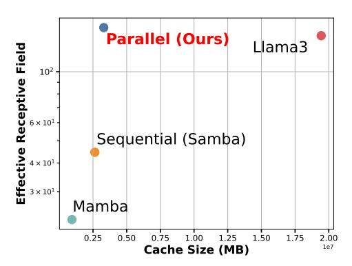
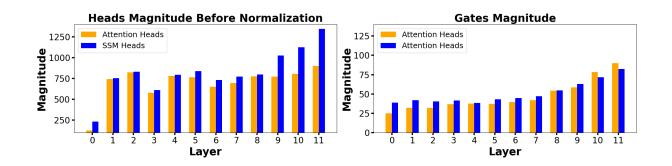
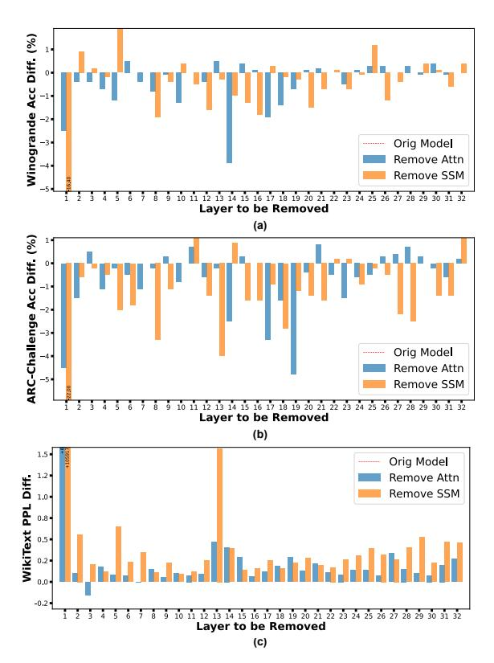

# A.2. Evaluating Hymba-1.5B Trained on Public Data Only

We have also trained our Hymba-1.5B model exclusively on public data and evaluated its performance. Specifically, following the training settings in Sec. 2.5, we train Hymba-1.5B on DCLM-Baseline-1.0 [36] for 1T tokens in the first phase and on SmoLM-Corpus [37] for 500B tokens in the second phase, keeping all other settings the same. The results are summarized in Tab. 8, where only the most competitive baselines from Tab. 2 are included. We observe that (1) Hymba-1.5B trained exclusively on public data only still surpasses all baseline small LMs in terms of average accuracy; and (2) Hymba-1.5B trained on public data primarily suffers from performance drops on 5-shot MMLU compared to the version trained on all data, including our proprietary dataset. This suggests that the public data used may lack sufficient factual knowledge, which is supplemented by our proprietary one.

#### A.3. Apple-to-Apple Comparison with Other Architectures at 300M Scale

In addition to the apple-to-apple architecture comparison under the same settings with a 1B model size in Sec. 3.3 of our main paper, we further validate the superiority of our architecture at the 300M size. Specifically, we train different 300M model architectures on 100B tokens from FineWeb [54]. We set peak learning rates to 5e-4 and use warmup and cosine decay scheduler. The training sequence length is set to 1K. For models with sliding window attention, we set the sliding window size as 256. As shown in Tab. 9, Hymba achieves the best performance in almost all tasks (with a second-best result in one task), yielding an average accuracy boost of +1.45% compared to the strongest baseline.

## B. Ablation Studies of Our Hymba Architecture

We perform further ablation studies and analyses of the design factors in our Hymba.

#### Parallel vs. Sequential fusion

We compare the hybrid-head module with a sequential counterpart, which interleaves local attention and Mamba layers as adopted by [7], by calculating the models' effective receptive field (ERF) and their overall cache size. All the compared models have the same parameter size and are training from scratch using exactly the same training recipe. ERF is an empirical measure of the averaged distance among tokens that allows effective information propagation [16, 89] defined as the following,

$$ERF \approx \sum_{n \le N} \sum_{h \le H} \sum_{s \le S} \frac{2M^h(S, s) \cdot (S - s) \cdot (N - n + 1)}{HN(N + 1)}, \quad (5)$$

where S is index of the last token in the sequence, N is index of the last layer in the model, and  $M^h(S, s)$  is the normalized attention score between token s and the last token in head h.

As shown in Fig. 11, we observe that (1) in line with common intuitions, Llama3 exhibits a notably larger ERF compared to Mamba due to its higher recall resolution, albeit at the cost of a larger cache size; (2) our multi-head structure demonstrates the best  $\overline{\text{ERF}}$ across the four designs, with an order of magnitude larger ERF while maintaining a cache size comparable to the sequential structure. This suggests that the parallel structure can better leverage the limited cache size to capture longer and more complex relationships among tokens compared to the sequential one. The differences in ERF are also reflected in task accuracy: According to Tab. 1, the multi-head design (Tab. 1 (B)) improves commonsense reasoning and recall accuracy by +1.08% and 4.74%, respectively, over the sequential design (Tab. 1 (A)). Based on this

Figure 11 | Visualize the ERF and cache size trade-off.

Table 6 | Benchmark Hymba with SOTA tiny LMs, all of which have fewer than 200M parameters. All results are obtained through Hugg ing face /L ightEva l, following Ben Allal et al. [\[43\]](#page-12-4).

| Model         | #Params. | MMLU (cloze) ↑ | ARC (c+e) ↑ | PIQA ↑ | Hella. ↑ | OBQA ↑ | Wino. ↑ | Avg. ↑ |
|---------------|----------|-------------------|----------------|--------|----------|--------|---------|--------|
| Mamba-130m-hf | 130M     | 27.41             | 33.01          | 63.33  | 33.86    | 30.40  | 51.54   | 42.43  |
| Cerebras-GPT  | 111M     | 25.56             | 27.75          | 58.16  | 26.32    | 25.40  | 50.28   | 37.58  |
| GPT-neo       | 125M     | 27.25             | 31.30          | 62.35  | 29.68    | 29.20  | 51.54   | 40.81  |
| LaMini-GPT    | 124M     | 26.47             | 33.26          | 62.89  | 30.05    | 27.80  | 50.75   | 40.95  |
| Opt           | 125M     | 25.67             | 31.25          | 61.97  | 31.04    | 29.00  | 53.20   | 41.29  |
| GPT2          | 137M     | 26.29             | 31.09          | 62.51  | 29.76    | 29.40  | 49.72   | 40.50  |
| Pythia        | 160M     | 26.68             | 31.92          | 61.64  | 29.55    | 27.80  | 49.49   | 40.08  |
| MobileLM      | 125M     | -                 | 35.51          | 65.30  | 38.90    | 39.50  | 53.10   | 46.46  |
| SmolLM        | 135M     | 30.23             | 43.99          | 69.60  | 42.30    | 33.60  | 52.70   | 48.44  |
| Hymba         | 125M     | 31.12             | 44.95          | 68.50  | 45.54    | 35.52  | 52.25   | 49.35  |

Table 7 | Benchmark Hymba with SOTA tiny LMs, all of which have fewer than 400M parameters. All results are obtained through Hugg ing face /L ightEva l, following Ben Allal et al. [\[43\]](#page-12-4).

| Model             | #Params. MMLU | (cloze) ↑ | ARC (c+e) ↑ | PIQA ↑ | Hella. ↑ | OBQA ↑ | Wino. ↑ | Avg. ↑ |
|-------------------|---------------|-----------|----------------|--------|----------|--------|---------|--------|
| Bloom             | 560M          | 27.49     | 32.86          | 65.13  | 35.98    | 28.80  | 51.70   | 42.89  |
| Cerebras-GPT-256M | 256M          | 25.91     | 29.69          | 61.37  | 28.44    | 28.00  | 51.62   | 39.82  |
| Cerebras-GPT-590M | 590M          | 26.93     | 32.40          | 62.84  | 31.99    | 28.40  | 50.12   | 41.15  |
| Opt               | 350M          | 26.57     | 31.94          | 64.36  | 36.09    | 27.80  | 52.57   | 42.55  |
| Pythia            | 410M          | 28.94     | 35.05          | 66.92  | 39.21    | 28.40  | 52.80   | 44.48  |
| GPT2-medium       | 380M          | 27.77     | 34.30          | 66.38  | 37.06    | 31.20  | 49.49   | 43.69  |
| MobileLM          | 350M          | -         | 43.65          | 68.60  | 49.60    | 40.00  | 57.60   | 51.89  |
| SmolLM            | 360M          | 34.17     | 51.10          | 72.00  | 53.80    | 37.20  | 53.70   | 53.56  |
| Hymba             | 350M          | 34.54     | 52.46          | 72.91  | 55.08    | 38.40  | 57.85   | 55.34  |

benchmarking and analysis, we adopt the hybrid-head module as our basic building block.

**The ratio of SSMs and attention in hybrid heads.** To determine the proper number of attention heads, we start with a Mamba model and gradually replace Mamba's hidden dimensions with attention heads, maintaining the same overall model size. As shown in Tab. [10](#page-18-0) (1)∼ (4), we observe that model performance improves as the ratio of attention parameters increases and gradually saturates when the parameter ratio of attention to Mamba reaches 1:2.12. We stop introducing more attention heads, considering that adding more would bring increased memory overhead.

There are two interesting observations: (1) Although the attention-only model outperforms the Mamba-only model, the hybrid model with both attention and Mamba heads achieves the best performance; (2) with further KV cache optimization, the ratio of attention heads decreases further. In our final model, attention heads occupy no more than

1/5 of the Mamba heads, yet significantly boost both recall and commonsense reasoning compared to the vanilla Mamba. This suggests that the hybrid model leverages the strengths and diversity of both attention and SSM heads, achieving a better trade-off between efficiency and performance.

**The hybrid-head fusion strategy.** We have explored two straightforward methods to fuse the outputs of attention and SSM heads: concatenation and mean. For concatenation, we combine the outputs of all heads and use a linear layer to project the concatenated output to the final output dimension. However, the parameter size of the linear layer increases with both the number of heads and the head dimensions. Additionally, based on the empirical comparison between Tab. [10](#page-18-0) (9) and (11), the performance of concatenation fusion is not better than the simple mean fusion. Therefore, we adopt the mean fusion strategy in our final design.

**Impact of KV cache optimization.** After applying a series of KV cache optimization techniques,

Table 8 | Benchmark Hymba-1.5B trained with all data and public data only against SOTA small LMs. All models have fewer than 2B parameters, except for Llama-3.2-3B, which is marked in gray. The settings follow Tab. 2 in our main paper and we only include the most competitive baselines here. **Hymba (Public Data)** refers to our model trained exclusively on public datasets, without using our proprietary high-quality dataset.

| Model               | #Params. | Train tokens | Token/s | Cache (MB) | MMLU 5-shot |              | ARC-C 0-shot | •     |       |       | SQuAD-C 1-shot | Avg.  |
|---------------------|----------|-----------------|---------|------------|----------------|--------------|-----------------|-------|-------|-------|-------------------|-------|
| Phi-1.5             | 1.3B     | 0.15T           | 241     | 1573       | 42.56          | 76.18        | 44.71           | 76.56 | 72.85 | 48.00 | 30.09             | 55.85 |
| h2o-danube2         | 1.8B     | 2T              | 271     | 492        | 40.05          | 70.66        | 33.19           | 76.01 | 66.93 | 53.70 | 49.03             | 55.65 |
| Qwen2.5             | 1.5B     | 18T             | 469     | 229        | 60.92          | 75.51        | 41.21           | 75.79 | 63.38 | 50.20 | 49.53             | 59.51 |
| SmolLM2             | 1.7B     | 11T             | 238     | 1573       | 50.29          | <u>77.78</u> | 44.71           | 77.09 | 66.38 | 53.55 | 50.50             | 60.04 |
| Llama-3.2-3B        | 3.0B     | 9T              | 191     | 918        | 56.03          | 74.54        | 42.32           | 76.66 | 69.85 | 55.29 | 43.46             | 59.74 |
| Hymba               | 1.5B     | 1.5T            | 664     | 79         | 51.19          | 76.94        | 45.90           | 77.31 | 66.61 | 53.55 | 55.93             | 61.06 |
| Hymba (Public Data) | 1.5B     | 1.5T            | 664     | 79         | 44.31          | 78.58        | 47.01           | 77.53 | 64.56 | 53.89 | 59.82             | 60.81 |

Table 9 | Apple-to-apple comparison of our Hymba, pure Mamba [2], Mamba with FFN, Llama3 [39] style, and Samba- [7] style (Mamba-FFN-Attn-FFN) architectures. All models have 300M parameters and are trained for 100B tokens from FineWeb dataset [54] with exactly the same training recipes. All results are obtained through LM-EVALUATION-HARNESS [28]. The best and second best results are highlighted in bold and underline, respectively.

| Task Type        | Arch. Style (300M) | Mamba | Mamba w/ FFN | Llama3       | Samba        | Hymba                |
|------------------|--------------------|-------|-----------------|--------------|--------------|----------------------|
| Language         | Wiki. ppl. ↓       | 30.78 | 33.41           | 30.04        | 31.41        | 28.53                |
|                  | LMB. ppl. ↓        | 19.95 | 23.64           | 20.53        | <u>19.75</u> | 15.45                |
| Recall           | SQuAD-C↑           | 21.31 | 17.56           | 22.10        | 39.88        | $\boldsymbol{45.24}$ |
| Intensive        | SWDE ↑             | 17.14 | 13.10           | 57.86        | 22.14        | 58.33                |
|                  | Avg. ↑             | 19.23 | 15.33           | 39.98        | 31.01        | 51.79                |
|                  | Lambda ↑           | 38.95 | 36.37           | 40.15        | 40.59        | 44.67                |
|                  | PIQA ↑             | 69.64 | 69.26           | <u>70.29</u> | 69.86        | 70.73                |
| Common- sense | ARC-C↑             | 24.91 | 25.00           | 24.83        | 25.76        | 26.28                |
| Reasoning        | ARC-E↑             | 50.67 | 50.34           | 50.24        | 49.79        | 53.20                |
| and              | Hella. ↑           | 44.95 | 44.08           | 45.69        | 46.45        | 48.23                |
| Question-        | Wino. ↑            | 51.70 | 51.78           | 52.64        | 52.49        | <b>53.35</b>         |
| answering        | TruthfulQA ↑       | 23.86 | 26.23           | 28.97        | 27.27        | 27.87                |
|                  | SIQA ↑             | 39.20 | 39.53           | 39.66        | 39.92        | 39.92                |
|                  | Avg.               | 42.98 | 42.82           | 44.08        | 44.02        | 45.53                |

moving from Tab. 10 (5) to Tab. 10 (9), we observe that our Hymba maintains comparable recall and commonsense reasoning accuracy while being 2.74× faster. In contrast, applying the same KV cache optimization to a pure Transformer, as seen in the comparison between Tab. 10 (6) and (10), results in a recall accuracy drop of 10% or more and degraded commonsense reasoning accuracy. This supports our analysis in Sec. 2.2, showing that the presence of SSM heads in our hybrid-head module has already summarized the global context, allowing us to more aggressively replace global full attention with local attention in our hybrid model.

Figure 12 | Left: visualization of output magnitudes of attention and SSM heads. SSM heads consistently have higher output magnitude than attention heads due to their structure. Right: visualization of attention and SSM heads' gate magnitudes. Through model learning, the relative magnitudes of attention and SSM gates vary across different layers.

Table 10 | Ablation study of the design choices of Hymba. The design finally adopted by Hymba is highlighted in **bold**. Specifically, the task lists are the same as those in Tab. 3. The throughput is measured with a 8k sequence length and a 128 batch size on an NVIDIA A100 GPU. The cache size is measured with a 8k sequence length, assuming the FP16 format.

| Design Factor | Configuration                  | Param. Ratio Attn:Mamba | $\frac{\text{Avg.}}{(\text{General})\uparrow}$ | $\begin{array}{c} \text{Avg.} \\ \text{(Recall)} \uparrow \end{array}$ | $\begin{array}{c} {\rm Throughput} \\ {\rm (Token/s)} \uparrow \end{array}$ | Cache (MB) ↓ |
|------------------|--------------------------------|----------------------------|------------------------------------------------|------------------------------------------------------------------------|-----------------------------------------------------------------------------|-----------------|
|                  | 1) Mamba Heads Only            | 0:1                        | 42.98                                          | 19.23                                                                  | 4720.8                                                                      | 1.87            |
|                  | 2) Mamba + 4 Attn Heads        | 1:8.48                     | 44.20                                          | 44.65                                                                  | 3278.1                                                                      | 99.09           |
| Attn/Mamba       | 3) $Mamba + 8 Attn Heads$      | 1:4.24                     | 44.95                                          | 52.53                                                                  | 1816.5                                                                      | 197.39          |
| Ratio            | 4) Mamba + 16 Attn Heads       | 1:2.12                     | 45.08                                          | 56.46                                                                  | 656.6                                                                       | 394.00          |
|                  | 5)  4) + GQA                   | 1:3.64                     | 45.19                                          | 49.90                                                                  | 876.7                                                                       | 148.24          |
|                  | 6) Attn Heads Only (Llama)     | 1:0                        | 44.08                                          | 39.98                                                                  | 721.1                                                                       | 414.72          |
|                  | 7) 5) + All SWA's              | 1:3.64                     | 44.42                                          | 29.78                                                                  | 4485.09                                                                     | 5.51            |
| Sliding          | 8) 5) + SWA's + Full Attn      | 1:3.64                     | 44.56                                          | 48.79                                                                  | 2399.7                                                                      | 41.19           |
| Window           | 9) 8) + Cross-layer KV sharing | 1:5.23                     | 45.16                                          | 48.04                                                                  | 2756.5                                                                      | 39.42           |
|                  | 10) 6) + Same KV compression   | 1:0                        | 43.60                                          | 28.18                                                                  | 3710.0                                                                      | 28.98           |
| Fusion           | 11) 9) Replace Mean by Concat  | 1: 5.82                    | 44.56                                          | 48.94                                                                  | 1413.9                                                                      | 39.42           |
| Meta             | 12) 1) + Meta Tokens           | 0:1                        | 44.01                                          | 19.34                                                                  | 4712.8                                                                      | 1.87            |
| Tokens           | 13) 9) + Meta Tokens           | 1:5.23                     | 45.53                                          | 51.79                                                                  | 2695.8                                                                      | 40.01           |

Figure 13 | Visualize the task performance difference across three tasks after removing the Attention or SSM heads in each layer. The task performance is measured using 1000 samples from each task. Note that removing critical modules in specific layers causes a significant gap compared to others, making their bars fall outside the box. For such layers, we annotate the task performance with text.

## C. Head Importance Analysis

**Setup.** To understand how hybrid heads contribute to the final task performance, we zero out the at-

tention or SSM heads in each layer by setting  $\beta_1$  or  $\beta_2$  in Eq. 3 to 0 and record the final accuracy. We consider four datasets, which are presented in Fig. 3 and Fig. 13, and the task performance is measured using 1000 samples from each task, evaluated with lm-evaluation-harness [28] in a zero-shot setting.

**Observations.** As shown in Fig. 13, we observe that (1) the relative importance of attention/SSM heads in the same layer, indicated by the change in task performance before and after being removed, may vary across different tasks. In other words, the relative importance of attention/SSM heads in the same layer is input-adaptive, indicating that different types of heads learn to serve different roles and undertake different responsibilities when handling various inputs; (2) The SSM head in the first layer is critical for language modeling and removing it causes a substantial increase in PPL or a substantial drop in accuracy (to random guess levels). Generally, removing one attention/SSM head results in a 0.46%/1.2%reduction in accuracy averaged across all layers and tasks, respectively.

