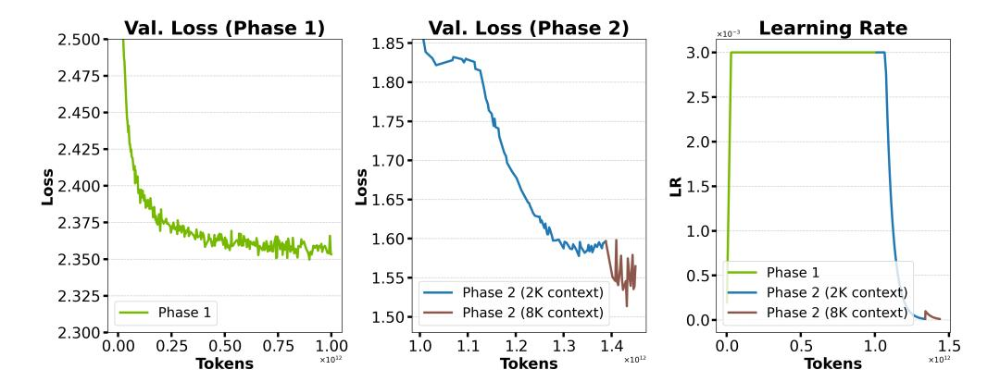
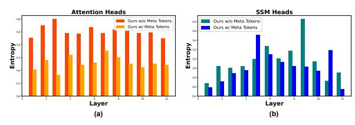

# D. Meta Tokens: More Analysis and Visualization

Relationship with prior works. Learnable tokens have also been leveraged in previous transformer-based models. Previous prompt tuning works [32, 33] prepend learnable prompts while keeping the model weights frozen during the task-specific tuning stage, aiming to adapt a pretrained LM to downstream tasks in a parameter-efficient manner. [90] introduces both learnable tokens and corresponding memory update modules to augment the memory mechanism in transformers. [30] appends a set of learnable tokens

Figure 14 | Training curves of Hymba-1.5B.

Figure 15 | Visualize the layer-wise attention map entropy of (a) attention heads, and (b) SSM heads with and without meta tokens.

called registers to the image patches of vision transformers [\[89\]](#page-14-10) to store global information and improve visual recognition. Our method combines ideas from all of these works in a more flexible manner. It optimizes the meta tokens jointly with model weights during the pretraining stage, is compatible with sliding window attention heads and other attention types or SSMs, and converts the meta tokens into KV-cache initialization during inference, without modifying the architecture.

#### **Meta tokens reduce attention map entropy.** We visualize the entropy of the attention map for both the attention and SSM heads [\[20,](#page-11-2) [16\]](#page-10-15) before and after introducing meta tokens. As introduced in Sec. [2.3](#page-3-0) of our main paper, the attention map entropy reflects the distribution of attention scores across tokens, where lower entropy indicates stronger retrieval effects [\[7\]](#page-10-6), as the attention scores are concentrated around a smaller subset of tokens.

As shown in Fig. [15,](#page-19-0) we observe that after introducing meta tokens, both the attention and SSM heads exhibit an overall reduction in entropy. Specifically, entropy is significantly reduced in all attention heads and in 10 out of 12 layers of the SSM heads. This suggests that meta tokens can reduce attention map entropy, potentially helping both the attention and SSM heads focus more on a subset of important tokens that contribute most to task performance, as indicated by the boosted performance in Tab. [10.](#page-18-0)

