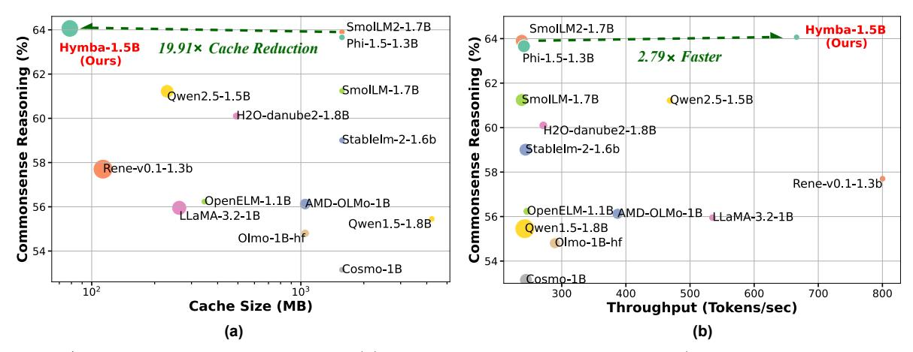
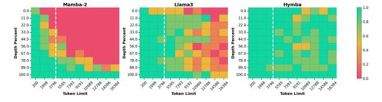

# **3. Model Evaluations**

#### **3.1. Experiment Settings**

**Baselines.** Our baselines include popular (small) LMs with quadratic attention (e.g., Llama 3.2 [\[42\]](#page-12-3), SmolLM [\[43\]](#page-12-4), SmolLM2 [\[44\]](#page-12-5), AMD-OLMo [\[45\]](#page-12-6), StableLM [\[46\]](#page-12-7), Olmo [\[47\]](#page-12-8), Cosmo [\[48\]](#page-12-9), Phi-1.5 [\[49\]](#page-12-10), H2O-Danube [\[50\]](#page-12-11), OpenELM [\[51\]](#page-12-12), and MiniCPM [\[38\]](#page-11-20)), as well as hybrid models (e.g., Rene [\[52\]](#page-12-13)).

**Benchmark settings.** We adopt two benchmarking settings: (1) In Sec. [3.2,](#page-6-0) we directly benchmark our delivered Hymba against SOTA public small LMs, and (2) in Sec. [3.3,](#page-7-1) we train different architectures from scratch with the same dataset, number of layers, model size, and training recipes.

**Benchmark tasks.** In addition to evaluating commonsense reasoning and recall-intensive tasks on our base models, we also evaluate our instruction-tuned models on downstream tasks such as math, function calling, and role-playing in Sec. [3.4.](#page-8-0)

## **3.2. Benchmark with SOTA Small LMs**

We present the benchmark results of our Hymba models with parameter sizes of 125M, 350M, and 1.5B, compared to SOTA small language models within the same size range.

As highlighted in Tab. [2,](#page-5-1) with only 1.5T pretraining tokens, our Hymba-1.5B model achieves the best performance among all sub-2B LMs and demonstrates better throughput and cache efficiency compared to all transformer-based LMs, with this speedup becoming even more pronounced as the sequence length increases. For instance, compared to the strongest sub-2B baseline, SmolLM2-1.7B, trained on 11T tokens, our Hymba-1.5B, trained on only 1.5T tokens, achieves a 1.02% average accuracy improvement, a 19.91× cache size reduction, and 2.79× throughput. When comparing with small LMs trained on no more than 2T tokens, our model achieves a 5.21%/5.41% average accuracy improvement over the most competitive baselines, Phi-1.5 and h2o-danube2-1.8B, respectively. Additionally, our model even outperforms Llama-3.2-3B, with 1.32% higher average accuracy, an 11.67× cache size reduction, and 3.49× throughput.

We visualize the trade-offs between commonsense reasoning accuracy and cache size/throughput in Fig. [9.](#page-7-0) In addition, our delivered tiny LMs, Hymba-125M/350M, consistently outperform all LMs of com-

Figure 9 | Visualize the trade-off between (a) commonsense reasoning accuracy (avr. ARC-C, ARC-E, PIQA, Hellaswag, OBQA, and Winogrande using [\[28\]](#page-11-11)) and cache size, with throughput represented by the point size of different models, and (b) commonsense reasoning accuracy and throughput, with cache size represented by the point size. The throughput is measured with a 8k sequence length and a 128 batch size on an NVIDIA A100 GPU. The cache size is measured with a 8k sequence length, assuming the FP16 format.

parable model size, as summarized in Tab. [6](#page-16-0) and Tab. [7](#page-16-1) in Append. [A.1.](#page-15-1) We have also provided a Hymba-1.5B model trained exclusively on public data in Append. [A.2.](#page-15-2)

#### **3.3. Benchmark Different Architectures Under The Same Setting**

**General and recall-intensive tasks performance comparison.** We do a comprehensive comparison between Hymba and other model architectures, including standard Transformer (Llama3 [\[53\]](#page-12-14)), pure Mamba [\[2,](#page-10-1) [3\]](#page-10-2), Mamba with FFN and hybrid architecture with sequential layer stacking (Samba [\[7\]](#page-10-6)) on several downstream tasks. All models have the same number of layers and total parameters to facilitate equal comparison. Models are trained on the same data with the same hyperparameters and under the same codebase. To ensure our conclusions are generally valid, we run comparison experiments at different scales (1B and 300M) and different training datasets (SmolLM-corpus [\[37\]](#page-11-19) and FineWeb [\[54\]](#page-12-15)) in Tab. [3](#page-8-1) and Tab. [9,](#page-17-2) respectively. We evaluate the models on language modeling, real-world recall-intensive, commonsense reasoning, and question-answering tasks.

As shown in Tab. [3,](#page-8-1) our Hymba model consistently outperforms other 1B architectures across most tasks, e.g., achieving an average score 1.45% higher than the second-best model at the 300M scale and 1.74% higher at the 1B scale. The ablation study for the 300M scale is in Append. [A.](#page-15-3)

In addition, considering that Mamba models suffer from limited recall capabilities due to their constantsize cache and recurrent nature [\[16,](#page-10-15) [5,](#page-10-4) [15\]](#page-10-14), we test

the models on two real-world recall-intensive tasks, SWDE [\[5,](#page-10-4) [55\]](#page-12-16) and SQuAD [\[5,](#page-10-4) [56\]](#page-12-17), where the former is to to extract semi-structured relations from given raw HTML websites and the latter is to extract answers from a given context passages. Echoing the previous findings, Mamba2 and Mamba2 with FFN architectures under-perform the Transformer model (i.e. Llama3) on these tasks (see Tab. [3\)](#page-8-1). Hymba model augments the Mamba heads with attention heads, which allows the model to have a large effective receptive field to establish long-range dependencies and high-resolution memory to store and retrieve key information in all layers. As a result, Hymba outperforms the Transformer and Samba architectures (where the latter stacks Mamba and attention layers sequentially).

**Needle-in-the-Haystack performance comparison.** We further do an apple-to-apple comparison between Hymba, Mamba2, and Llama3 on the synthetic retrieval task, needle-in-the-haystack. A random and informative sentence (i.e., needle) is inserted into a long document (i.e., haystack) and the model is required to retrieve the needle from the haystack to answer the questions. All models are of size 1B and trained with the same setting: (i.) pretrain is done with 1k sequence length; (ii.) finetune with 4k sequence length; (iii.) test with up to 16k sequence length. If model has ROPE, then we adjust the ROPE as in [\[57\]](#page-12-18) during finetuning. As shown in Fig. [10,](#page-8-2) the Hymba model significantly outperforms the Mamba2 and Llama3 models. While the Mamba2 model has good extrapolation capabilities when the needle is inserted in the end of the haystack, it struggles to retrieve the needle when the needle is in the beginning

| Task Type                                                      | Arch. Style (1B)                                                                                                  | Mamba2                                                                               | Mamba2 w/ FFN                                                     | Llama3                                                | Samba                                                                                                                                               | Hymba                                                                                                     |
|----------------------------------------------------------------|-------------------------------------------------------------------------------------------------------------------|--------------------------------------------------------------------------------------|----------------------------------------------------------------------|-------------------------------------------------------|-----------------------------------------------------------------------------------------------------------------------------------------------------|-----------------------------------------------------------------------------------------------------------|
| Language                                                       | Wiki. ppl. ↓ LMB. ppl. ↓                                                                                       | $\frac{19.17}{12.59}$                                                                | 20.42 $14.43$                                                        | 19.28 13.09                                        | 19.91 12.65                                                                                                                                      | $18.62 \\ 10.38$                                                                                          |
| Recall Intensive                                            | $ \begin{array}{ c c c c c }\hline   & SWDE \uparrow \\ SQuAD-C \uparrow \\\hline   & Avg. \uparrow \end{array} $ | $ \begin{array}{r} 50.24 \\ - \frac{36.43}{43.34} \end{array} $                      | $ \begin{array}{r} 26.43 \\ 31.40 \\ -28.92 \end{array} $            | <b>75.95</b>                                          | $\begin{array}{r} 30.00 \\\frac{42.33}{36.17} \end{array}$                                                                                          | $ \begin{array}{r}     \underline{54.29} \\     \underline{44.71} \\     \underline{-49.50} \end{array} $ |
| Common- sense Reasoning and Question- answering | Lambda ↑ PIQA ↑ ARC-C ↑ ARC-E ↑ Hella. ↑ Wino. ↑ TruthfulQA ↑ SIQA ↑ Āvg. ↑                                       | 47.51 73.94 38.91 70.96 57.73 <b>58.48</b> 30.75 41.86 52.52 | 44.54 73.07 37.03 71.00 55.83 55.56 29.86 42.22 | 47.95 73.45 39.68 73.74 57.64 56.20 31.64 42.22 52.82 | $ \begin{array}{r} 49.08 \\ 73.23 \\ 39.59 \\ 73.36 \\ \underline{58.49} \\ 57.54 \\ 28.84 \\ \underline{42.48} \\ - \overline{52.83} \end{array} $ | 52.84 $74.97$ $41.72$ $74.12$ $60.05$ $57.85$ $31.76$ $43.24$ $-54.57$                                    |

Table 3 | Apple-to-apple comparison of our Hymba, pure Mamba2 [3], Mamba2 with FFN, Llama3 [39] style, and Samba- [7] style (Mamba-FFN-Attn-FFN) architectures. All models have 1B parameters and are trained from scratch for 100B tokens from SmolLM-Corpus [37] with exactly the same training recipe. All results are obtained through LM-EVALUATION-HARNESS [28] using a zero-shot setting by us on HuggingFace models. The best and second best results are highlighted in bold and underline, respectively.

or middle of the haystack. In contrast, Llama3 model has limited extrapolation capabilities [58, 57, 59] and struggles to the "lost in the middle" [60] scenario.

Figure 10 | Needle-in-the-haystack performance comparison across different architecture under apple-to-apple setting. The white vertical line represents the finetuning sequence length (4k).

#### 3.4. Instruction-tuned Model

Implementation details of post-training. We post-trained Hymba-1.5B base model with a two-stage strategy: the first full-finetuning (FFT) stage and another direct preference optimization (DPO) [12] The learning rates are 5e-5, and 3e-6 for FFT and DPO, respectively. To accelerate training, we follow the training recipe [61, 62, 63 to pack the samples and use a block size of 8192. We compare Hymba-1.5B-Instruct with competitive lightweight instruction-tuned models, i.e., Llama-3.2-1B-Instruct [42], OpenELM-1-1B-Instruct [51], Qwen2.5-1.5B-Instruct [64], and SmolLM-1.7B-Instruct [43]. We test the instructiontuned models on MMLU (5-shot), IFEval, GSM8K (5shot), GPQA (0-shot), and Berkeley Function-Calling Leaderboard v2 (BFCLv2) [65]. More details about

the experimental settings, baseline models, and evaluation tasks are shown in Append. E.

**Evaluation results.** The evaluation results are shown in Tab. 4. In general, Hymba-1.5B-Instruct achieves the highest performance on an average of all tasks, outperforming the previous SoTA model, Qwen2.5-Instruct, by around 2%. It demonstrates a great ability in math, reasoning, and function calling, with the best-in-class performance.

Evaluation on role-play tasks. In addition to full finetuning, we conduct experiments to evaluate whether Hymba is compatible with DoRA [13], a parameter-efficient finetuning method that updates pretrained models using a minimal set of parameters. This approach is especially well-suited for ondevice finetuning scenarios where computational resources are constrained. Additionally, DoRA significantly reduces storage requirements for saving multiple downstream models, as it only requires storing the finetuned DoRA parameters, which constitute less than 10% of the original model's total parameters. Specifically, we further finetune the posttrained Hymba on RoleBench [14] using DoRA to enhance its role-playing capabilities. The training set of RoleBench is used for training, and the model is evaluated on two sub-tasks: instruction generalization (Inst. Gene.) and role generalization (Role. Gene.). As shown in the Tab. 5, our Hymba-DoRA significantly outperforms larger models. For instance, DoRA finetuned Hymba achieves scores of 40.0%

Table 4 | The comparison between lightweight instruction-tuned models. The best and second-best results are highlighted in bold and underlined, respectively. \* OpenELM and SmolLM cannot understand function calling, leading to 0 accuracy in most categories.

| Model      | #Params | MMLU ↑ | IFEval ↑ | GSM8K ↑ | GPQA ↑ | BFCLv2 ↑ | Avg. ↑ |
|------------|---------|--------|----------|---------|--------|----------|--------|
| SmolLM     | 1.7B    | 27.80  | 25.16    | 1.36    | 25.67  | -*       | 20.00  |
| OpenELM    | 1.1B    | 25.65  | 6.25     | 56.03   | 21.62  | -*       | 27.39  |
| Llama-3.2  | 1.2B    | 44.41  | 58.92    | 42.99   | 24.11  | 20.27    | 38.14  |
| Qwen2.5    | 1.5B    | 59.73  | 46.78    | 56.03   | 30.13  | 43.85    | 47.30  |
| SmolLM2    | 1.7B    | 49.11  | 55.06    | 47.68   | 29.24  | 22.83    | 40.78  |
| Hymba-1.5B | 1.5B    | 52.79  | 57.14    | 58.76   | 31.03  | 46.40    | 49.22  |

| Model          | #Params | Instruction Generalization | Role Generalization |
|----------------|---------|-------------------------------|------------------------|
| Llama-7B       | 7B      | 19.2                          | 19.3                   |
| Aplaca-7B      | 7B      | 25.6                          | 24.5                   |
| Vicuna-13B     | 13B     | 25.0                          | 24.3                   |
| Llama2-7B-chat | 7B      | 18.8                          | 20.5                   |
| RoleLlama-7B   | 7B      | 35.5                          | 33.5                   |
| Hymba-DoRA     | 1.5B    | 40.0                          | 37.9                   |

Table 5 | The comparison between DoRA-finetuned Hymba and baselines on RoleBench. All baseline results are from [\[14\]](#page-10-13).

37.9% on instruction generalization/role generalization, outperforming RoleLlama-7B [\[14\]](#page-10-13) by 4.5%, and 4.4% respectively. This indicates the strong generalization of our model and the effectiveness of using parameter-efficient finetuning techniques to further enhance its performance.

