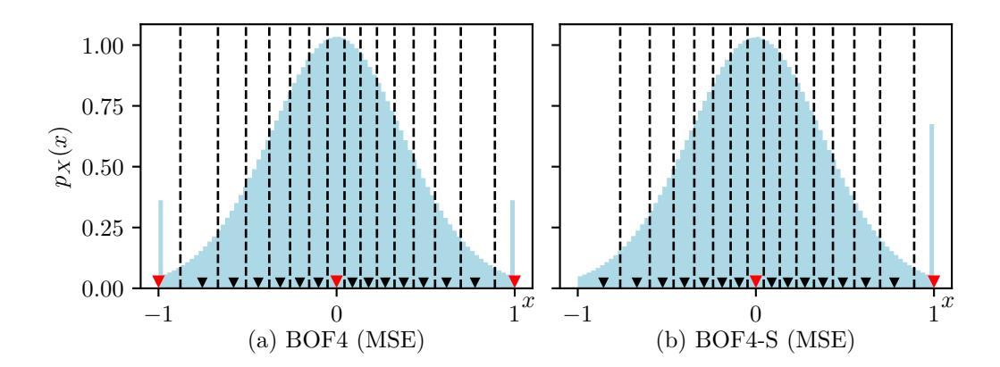
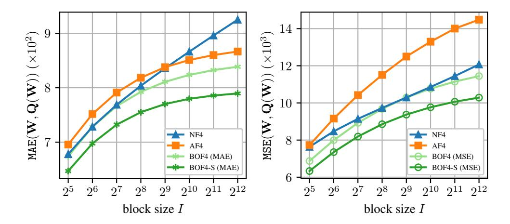
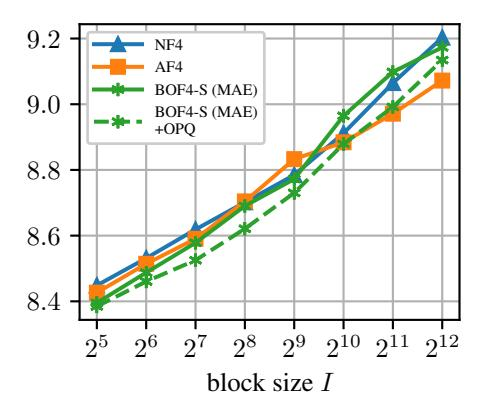

# 1 Introduction

Driven by scaling the transformer architecture to billions of parameters, large language models (LLMs) have achieved remarkable performance in language modeling tasks. However, their size poses significant challenges for deployment, particularly in memory-constrained settings. Numerous post-training quantization (PTQ) techniques have been developed to mitigate this, reducing the memory footprint of the weights and, in many cases, improving inference speed [\[1\]](#page-9-0)–[\[4\]](#page-9-1). Fine-tuning imposes even greater memory demands, making it challenging to adapt LLMs on consumer-grade GPU hardware. To address this, Dettmers et al. [\[5\]](#page-9-2) introduced QLoRA, a memory-efficient fine-tuning method that combines 4-bit quantization of pre-trained weights with low-rank adaptation (LoRA) [\[6\]](#page-9-3). For quantization, Dettmers et al. [\[5\]](#page-9-2) propose 4-bit NormalFloat (NF4), a quantization method with a fixed codebook. This method normalizes blocks of network weights by their absolute maximum (block-wise absmax normalization). Unlike other, more accurate PTQ methods, NF4 quantizes weights without computing network activations based on calibration data, making the quantization process itself more efficient in terms of both time and memory, while maintaining acceptable accuracy degradation at 4 bits per weight. Dettmers et al. [\[5\]](#page-9-2) claim that the NF4 codebook is informationtheoretically optimal due to its equal utilization of the 16 reconstruction levels. However, Yoshida demonstrates that this claim is incorrect [7]. We add that equal utilization of reconstruction levels is not a theoretically justified criterion for the optimality of a quantizer. Yoshida [7] also proposes an alternative codebook (AF4) designed to address the shortcomings of NF4.

In this work, we show that neither NF4 nor AF4 minimizes the quantization error of the network weights. For the first time, we provide a rigorous mathematical analysis of block-wise absmax quantization and explore multiple design variations through an experimental study. As a first contribution, we derive an expectation-maximization (EM) algorithm inspired by Lloyd's algorithm [8] that computes the correct, information-theoretically optimal codebook for block-wise absmax quantization w.r.t. the mean absolute error (MAE) or mean squared error (MSE) criterion. Additionally, we propose an alternative normalization technique: Instead of normalizing blocks by their absolute maximum value, we normalize by the signed absolute maximum. This simple modification results in a significant reduction of the quantization error. Using our EM algorithm, we compute a family of optimal quantization codebooks which we refer to as 4-bit block-wise optimal float (BOF4), or BOF4-S when signed normalization is used. Furthermore, we identify that block-wise absmax quantization is sensitive to outlier weights affecting the distribution of the normalized weights. We address this by introducing an outlier-preserving quantization (OPQ) that stores outliers in 16-bit precision. When combined with BOF4-S, OPQ substantially improves perplexity over NF4 and AF4.

The paper is structured as follows: Section 2 reviews related work on block-wise quantization. Section 3 outlines our mathematical analysis and novel quantization methods. Section 4 details the experimental setup, and Section 5 presents and discusses the results. We conclude in Section 7.

#### 2 Related Work

Block-wise quantization based on blocks of input values normalized by their absolute maximum was introduced by Dettmers et al. [9] as a method for quantizing optimizer states during neural network training. Subsequent works [5], [7], [10] applied this technique to LLM network weights for memory-efficient fine-tuning. We refer to this quantization method as *block-wise absmax quantization*.

#### 2.1 Block-Wise Absmax Quantization

In block-wise absmax quantization network weights  $w_{b,i} \in \mathbb{R}$  are first grouped into blocks, with block indices  $b \in \mathcal{B} = \{1, \dots, B\}$ , and indices of weights within a block  $i \in \mathcal{I} = \{1, \dots, I\}$ , where  $B \in \mathbb{N}$  is the number of blocks, and  $I \in \mathbb{N}$  the block size. Then, the weights are normalized by the absolute maximum weight in their respective block:

$$w_b^{\max} = \max_{i \in \mathcal{I}} |w_{b,i}|, \quad b \in \mathcal{B}$$
 (1)

$$x_{b,i} = \frac{w_{b,i}}{w_b^{\text{max}}} \in [-1, 1], \quad i \in \mathcal{I}, b \in \mathcal{B}$$
(2)

Next, each normalized weight  $x_{b,i}$  is quantized independently using scalar quantization. The absolute block maxima  $w_b^{\max}$ , commonly referred to as *quantization constants*, are stored in addition to the quantized weights for later decoding. Overall the block-dependent quantization function  $Q_b()$  for weights  $w_{b,i}$  is defined as

$$Q_b(w_{b,i}) = w_b^{\max} \cdot \tilde{Q}(\frac{w_{b,i}}{w_i^{\max}}) = w_b^{\max} \cdot \tilde{Q}(x_{b,i}), \tag{3}$$

where  $\tilde{Q}()$  is a block-independent quantization function.

#### 2.2 4-bit Block-Wise Quantization for LLMs

In this section, we discuss the previous block-wise absmax quantization that our work builds upon.

**4-bit NormalFloat (NF4)**: NF4 [5] is a 4-bit scalar quantizer for block-wise absmax quantization. The  $L=2^4=16$  reconstruction levels  $\hat{x}(\ell),\ \ell\in\mathcal{L}=\{1,\ldots,L\}$  are computed based on quantiles of the assumed Gaussian network weight distribution  $p_W=\mathcal{N}(0,\sigma^2)$ . Dettmers et al. [5] claim that their construction leads to equal utilization of the 16 reconstruction levels. However, this was already

shown to be incorrect by Yoshida [7]. Furthermore, an equal probability for all codebook points is not a general criterion for the optimality of a quantizer. Instead, quantization aims at rate-distortion optimality [11]. Accordingly, a codebook assigning equal probability to each codebook point is only optimal for uniformly distributed input data. This has been well-known for decades, most prominently through the necessary conditions for optimality that underpin Lloyd's algorithm [8].

**4-Bit AbnormalFloat (AF4):** Yoshida [7] analyzes the distribution of normalized network weights and performs direct minimization of the mean absolute error (MAE) to obtain a block-wise absmax quantization codebook for normally distributed network weights, named AF4. This quantizer aims to correct an oversight in the design of NF4 [5], which does not account for the dependence of the distribution of normalized weights on the block size. However, Yoshida's optimization method targets the minimum MAE of *normalized weights*  $MAE(x_{b,i}, \tilde{Q}(x_{b,i}))$ , instead of minimizing the end-to-end quantization error of the network weights  $MAE(w_{b,i}, Q_b(w_{b,i}))$ .

Both NF4 and AF4 contain reconstruction levels at -1, 0, and 1, such that the weight of the largest absolute value in a block is represented in full 16-bit precision, while the zero is represented without error. Not including these reconstruction levels leads to significantly worse MAE, mean squared error (MSE), and perplexity. We confirm this in Appendix A.

#### 3 Methods

In this section, we introduce our methods for optimizing 4-bit block-wise absmax quantization.

#### 3.1 Novel Block-Wise Signed Absmax Normalization

Instead of the normalization method based on the absolute block maximum, described in Section 2.1 and widely used in existing quantization methods such as NF4 and AF4, we propose a different normalization approach: block-wise signed absmax normalization. This approach is based on the observation that the effectiveness of block-wise absmax quantization, especially with small block sizes, is partially due to its ability to preserve weights with large absolute values. NF4 and AF4 intentionally constrain two reconstruction levels to  $\hat{x}(1) = -1$  and  $\hat{x}(16) = 1$ , respectively, thereby ensuring that the largest absolute value in each block is quantized without error. However, for network weights in general position, any given block b of the normalized weights  $x_{b,i}$  practically contains only one of the two endpoints, either -1 or 1. Therefore, optimizing a quantizer for the distribution of normalized weights, shown in Fig. 1a, which assigns an equal probability mass of  $\frac{1}{2B}$ to each endpoint, and additionally requiring that both endpoints must be reconstruction levels, leads to suboptimal results. By normalizing with our proposed signed absolute block maximum instead and constraining only *one* reconstruction level to lie at the right endpoint  $\hat{x}(16) = 1$ , we preserve the ability to precisely represent the weight with the largest magnitude in each block (typically in 16-bit representation) while achieving a lower overall quantization error. Formally, in block-wise signed absmax normalization, the quantization constants  $w_b^{\rm max}$  from (1) are selected by

$$w_b^{\max} = w_{b,j^*} \quad \text{with} \quad j^* = \underset{i \in \mathcal{I}}{\operatorname{arg max}} |w_{b,i}|, \quad b \in \mathcal{B}.$$
 (4)

Except for this modification, we proceed with quantization as before, using (2) and (3). The distribution after signed block-wise absmax normalization is shown in Fig. 1b.

## 3.2 Novel 4-bit Block-Wise Optimal Float (BOF4 / BOF4-S)

To determine optimal quantization codebooks w.r.t. the MSE and MAE criteria, we design an expectation-maximization (EM) algorithm based on Lloyd's algorithm [8], a well-known algorithm for quantizer design. In each maximization step, the reconstruction levels  $\hat{x}(\ell) \in \mathbb{R}, \ \ell \in \mathcal{L} = \{1, \dots L\}$  are set to the centroids of their respective Voronoi region  $\mathcal{R}_{\ell} = [\xi(\ell-1), \xi(\ell))$ , with decision boundaries  $\xi(\ell), \ \ell \in \mathcal{L}^{(\xi)} = \{0, 1, \dots, L\}$ , where  $\xi(0) = -\infty$  and  $\xi(L) = \infty$ . However, in block-wise absmax quantization, the codebook is applied to normalized weights  $x_{b,i}$ , whereas our goal is to minimize the quantization error of the quantized unnormalized weights  $Q_b(w_{b,i})$  relative to the original weights 1 1 1 1 1 1 1 1 1 1

&lt;sup>1Minimizing the quantization error of normalized weights  $x_{b,i}$  leads to worse perplexity; see Appendix D.

Figure 1: The blue histograms show the **distributions of normalized weights**  $p_X(x)$  for block-wise *absolute* absmax normalization (left) and block-wise *signed* absmax normalization (right) assuming Gaussian network weights. Also shown are the **resulting reconstruction levels**  $\hat{x}(\ell)$  ( $\blacktriangledown$  fixed,  $\blacktriangledown$  optimized) and decision thresholds  $\xi(\ell)$  (dashed lines), after minimizing the MSE( $\mathbf{W}, \mathbf{Q}(\mathbf{W})$ ) for normally distributed network weights  $\mathbf{W} = (w_{b,i})$  with  $w_{b,i} \sim p_W = \mathcal{N}(0,1)$  and block size I = 64. For absolute absmax normalization, we compute the 4-bit block-wise optimal float (**BOF4**, left), requiring three fixed reconstruction levels (-1, 0, 1). In contrast, when using *signed* normalization, we obtain **BOF4-S** (right), in which the largest absolute value in a block and zero are precisely represented by only two fixed reconstruction levels (0, 1), which reduces the quantization error.

weight distribution directly used in Lloyd's algorithm. To resolve this, we mathematically derive an optimal solution for the centroid update. We name the resulting quantizer 4-bit block-wise optimal float (BOF4). When *signed* absmax normalization is used, we refer to it as BOF4-S. A complete derivation is provided in Appendix B, resulting codebooks in Appendix C, major results follow here.

**MSE**: Let W be a random variable representing the continuous, zero-symmetric distribution of network weights. We further define two derived random variables X and M representing the normalized weights and absolute block maxima, respectively. Our goal is to find a reconstruction level  $\hat{x}(\ell)$  that minimizes the MSE quantization error for those network weights that fall into a fixed region  $\mathcal{R}_{\ell}$  after block-wise absmax normalization. By analytical optimization (Appendix B.2.1, (26)), we obtain the solution for the updated centroid as

$$\hat{x}(\ell) = \frac{\int_0^\infty m^2 \cdot \mathbb{E}_X[X \mid M = m, X \in \mathcal{R}_\ell] \cdot p_M(m) \cdot \left[ F_X(x \mid M = m) \right]_{\xi(\ell-1)}^{\xi(\ell)} dm}{\int_0^\infty m^2 \cdot p_M(m) \cdot \left[ F_X(x \mid M = m) \right]_{\xi(\ell-1)}^{\xi(\ell)} dm},$$
(5)

where the probability density function (PDF)  $p_X$  of the normalized weights, the cumulative distribution function (CDF)  $F_X$  of normalized weights, and the expectation  $\mathbb{E}[X \mid M=m, X \in \mathcal{R}_\ell]$  can be computed directly from the known CDF  $F_W$  and PDF  $p_W$  of the network weights, see Appendix B.2.1 (31). A detailed derivation and simplified solution for the special case of Gaussian network weights is also provided in Appendix B.2.1 (see (34)). Equation (5) can be solved by numerical integration. Alternatively, the centroid can be approximated by Monte-Carlo estimation based on samples drawn from the distribution  $p_W$  of network weights as (see Appendix B.3 (64))

$$\hat{x}(\ell) = \frac{\sum_{k \in \mathcal{K}_{\ell}} w_k^2 \cdot x_k}{\sum_{k \in \mathcal{K}_{\ell}} w_k^2},\tag{6}$$

where  $x_k \in \mathcal{R}_\ell$  are the normalized weights that fall into region  $\mathcal{R}_\ell$ ,  $k \in \mathcal{K}_\ell = \{1, \dots, K_\ell\}$  being their indices, and  $w_k$  is the absolute block maximum  $w_b^{\max}$  of the block b containing  $x_k$ .

**MAE**: A similar optimization can be performed for the MAE criterion, as detailed in Appendix B.2.2 (59), yielding

$$\int_{0}^{\infty} m \cdot p_{M}(m) \cdot \left( F_{X}(\hat{x}(\ell) \mid M = m) \right] - \frac{1}{2} \left[ F_{X}(x \mid M = m) \right]_{\xi(\ell - 1)}^{\xi(\ell)} dm = 0.$$
 (7)

The zero of the left-hand-sided monotonous function in  $\hat{x}(\ell)$  can be found using the bisection method in combination with numerical integration. Moreover, using the Monte-Carlo method, the centroid can be estimated as the weighted median (see Appendix B.3 (69))

$$\hat{x}(\ell) = \text{median}_{W}(x_1, \dots, x_{K_{\ell}}; w_1, \dots, w_{K_{\ell}}) = \max_{\kappa \in \mathcal{K}_{\ell}} \left\{ x_{\kappa} \middle| \sum_{k=1}^{\kappa} w_k \le \sum_{k=\kappa+1}^{K_{\ell}} w_k \right\}.$$
 (8)

To constrain certain reconstruction levels during Lloyd's algorithm to specific values, e.g., -1, 0, 1, we initialize them with their predetermined values and skip their recomputation in each iteration.

## 3.3 Novel Outlier-Preserving Quantization (OPQ)

Extreme outlier weights lead to suboptimal scaling of the associated block during block-wise absmax normalization. Therefore, block-wise quantization methods typically require small block sizes to limit the number of affected parameters. This increases the memory required to store the quantization constants. To enable larger block sizes and accordingly a smaller memory footprint, our outlier-preserving quantization (OPQ) approach stores outlier weights separately in bfloat16 and additionally uses a 64-bit integer for each of them to address the outlier in the (flattened) weight tensor of the respective layer. We define outliers for each weight block independently as weights with an absolute value greater than the q-quantile of absolute block maxima after normalization of the block to a unit standard deviation. Formally, a weight  $w_{b,i}$  is classified as an outlier if and only if

$$|w_{b,i}| > \sigma_b \cdot F_M^{-1}(q), \tag{9}$$

where  $\sigma_b$  is the corrected sample standard deviation of the b-th block (see (73) in Appendix E),  $F_M^{-1}()$  the quantile function of absolute block maxima (see (11) in Appendix B.1), and  $q \in [0,1]$  is a hyperparameter controlling the number of affected outliers. Before quantization, we exclude outliers from the tensor by replacing them with zero, so that they are not considered in the subsequent (signed) block maximum search. Note that OPQ can be combined with either BOF4 or BOF4-S. For an in-depth explanation of our OPQ design choices, see Appendix E. OPQ code is provided along with all relevant BOF4(-S) quantizer codebooks on GitHub: https://github.com/ifnspaml/bof4.

## 4 Experimental Setup

In this section, we discuss our choices for the experimental evaluation of quantization methods.

**Quantized Models**: For evaluation, we apply quantization to three families of pre-trained LLMs: Llama 3.1/3.2 [12], Qwen-2.5 [13], and Mistral-7B-v0.3 [14]. By benchmarking across a diverse set of LLMs, we aim to demonstrate the generalizability of our method.

**Evaluated Quantization Methods**: We evaluate our proposed BOF4 and BOF4-S approaches, optimized w.r.t. either MAE or MSE. For the optimization, we always assume Gaussian network weights. These methods are compared to the baselines NF4 [5] and AF4 [7]. For the evaluation of OPQ, we performed a limited hyperparameter search, resulting in q=0.95, see Appendix E.2. The optimized codebooks of BOF4 and BOF4-S are provided in Appendix C.

**Fine-Tuning Method**: In addition to inference with quantization, we benchmark LLMs fine-tuned with quantization using the QLoRA method [5]. The models are fine-tuned for instruction following using the Unnatural Instructions dataset [15] or for code generation using the Magicoder-OSS-Instruct-75K dataset [16]. Further details and hyperparameters can be found in Appendix F.

**Metrics**: In order to show that our approach incurs reduced quantization errors, we report the mean squared error (MSE) and mean absolute error (MAE) of network weights. Following prior work [1]–[3], we assess the language modeling abilities of quantized models based mainly on the perplexity (PPL) measured on the WikiText-2 [17] and LAMBADA [18] datasets. The perplexity on WikiText-2 is computed using the rolling log-likelihood with a maximum sequence length of 2048, as it is common in literature. Additionally, we evaluate the accuracy (ACC) in the NLP tasks MMLU [19], ARC-Challenge [20], HellaSwag [21], PIQA [22], SIQA [23], and WinoGrande [24].

Figure 2: MAE (left) and MSE (right) quantization error of our quantization methods BOF4 and BOF4-S optimized for MAE (left, \*) or MSE (right,  $\circ$ ) compared to the baselines NF4 and AF4 for Gaussian network weights  $\mathbf{W} = (w_{b,i})$  with  $w_{b,i} \sim \mathcal{N}(0,1)$  depending on the block size I.

#### 5 Results and Discussion

**Quantization Error:** In Fig. 2, we compare the MAE and MSE quantization errors of our proposed BOF4 and BOF4-S quantization methods with the baselines NF4 and AF4, assuming ideally Gaussian-distributed network weights. Accordingly, the results shown are independent of any particular LLM the methods are applied to. All compared quantizers constrain reconstruction levels such that 0 and the weight of the largest absolute value in a block are quantized without error, or in full 16-bit resolution, respectively. The error is computed empirically based on  $2^{25}$  samples.

We observe that all investigated block-wise quantizers show increasing MAE / MSE with increasing block size *I*. This is expected, as larger block sizes will have larger block maxima, which in turn increases average error for the many non-maximum weights in the block. All of our proposed methods BOF4(-S), optimized w.r.t. both MAE and MSE, are equal to or better than each of the two baselines NF4 and AF4. Note that AF4 [7] was presented in some MAE-optimized form, which explains its poor MSE performance for medium- or large-sized blocks. *Our signed normalization method BOF4-S achieves lower MAE and MSE scores than any other investigated quantization approach.* 

**Quantization Error and Perplexity**: Tab. 1 shows a comparison of the MAE and MSE quantization errors, as well as perplexity (PPL), evaluated on the weights of three pre-trained LLMs: Llama-3.1 8B, Qwen-2.5 7B, and Mistral 7B. Results for additional (smaller) models are provided in Appendix G. Note that our intention is not to compare PPL between the various LLMs, but rather between the various quantizer options.

We observe that our basic BOF4 approaches are equal to or lower in quantization error than the baselines NF4 and AF4 when optimized for the particular metric MAE / MSE. The respective methods with *signed* normalization (BOF4-S) clearly outperform the non-signed BOF4 approaches in all cases, and accordingly, the baselines NF4 and AF4 as well. We emphasize that MAE- and MSE-optimized BOF4(-S) schemes show the lowest quantization errors for their respective optimization metric. This empirically confirms our derived centroid update rules (7) and (5), along with the underlying Gaussian distribution assumption of the LLM network weights. Analyzing perplexity, BOF4-S is equal to (in a single case) or better than each of the baselines, indicating that the lower quantization error also pays off in terms of an improved language modeling accuracy. *Our proposed outlier-preserving quantization (OPQ) variant provides a further consistent performance improvement, as it lowers MAE and MSE quantization errors and perplexity in all cases.* 

**Comparative Effect of MAE and MSE Optimization**: Tab. 1 also shows the language modeling perplexity of the quantization methods on the WikiText-2 dataset [17]. This allows us to compare the

Table 1: **Quantization error** (MAE and MSE) and **perplexity** (PPL) on WikiText-2 of quantization methods applied to the network weights of three LLMs with block size I=64. Best result in each column in bold, second best underlined.

|              | Llama-3.1 8B                                                                  |              |             | Qw                                                                              | Qwen-2.5 7B  |             |              | Mistral 7B   |             |  |
|--------------|-------------------------------------------------------------------------------|--------------|-------------|---------------------------------------------------------------------------------|--------------|-------------|--------------|--------------|-------------|--|
|              | $ \begin{array}{c} \hline{\text{MAE} \downarrow} \\ 1\text{e}-3 \end{array} $ | MSE↓ 1e−6 | PPL ↓       | $ \begin{array}{c} \overline{\text{MAE}\downarrow} \\ 1\text{e}-4 \end{array} $ | MSE↓ 1e−8 | PPL ↓       |              | MSE↓ 1e−6 | PPL ↓       |  |
| NF4          | 0.977                                                                         | 1.637        | 8.53        | 1.202                                                                           | 2.391        | 9.89        | 2.256        | 8.439        | 8.90        |  |
| AF4          | 1.006                                                                         | 1.762        | 8.51        | 1.234                                                                           | 2.562        | 9.91        | 2.324        | 9.085        | 8.90        |  |
| BOF4 (MAE)   | 0.976                                                                         | 1.621        | 8.52        | 1.202                                                                           | 2.370        | 9.89        | 2.256        | 8.360        | 8.90        |  |
| BOF4 (MSE)   | 0.994                                                                         | 1.566        | 8.51        | 1.228                                                                           | 2.310        | 9.94        | 2.296        | 8.075        | 8.89        |  |
| BOF4-S (MAE) | 0.936                                                                         | 1.508        | 8.49        | 1.152                                                                           | 2.204        | 9.87        | 2.162        | 7.777        | 8.90        |  |
| + OPQ        | <b>0.918</b>                                                                  | 1.457        | <u>8.46</u> | <b>1.121</b>                                                                    | 2.101        | <b>9.82</b> | <b>2.121</b> | 7.514        | 8.89        |  |
| BOF4-S (MSE) | 0.954                                                                         | <u>1.441</u> | <u>8.46</u> | 1.179                                                                           | 2.126        | 9.88        | 2.204        | <u>7.430</u> | <u>8.88</u> |  |
| + OPQ        | 0.932                                                                         | <b>1.367</b> | <b>8.43</b> | <u>1.140</u>                                                                    | <b>1.981</b> | <u>9.83</u> | 2.153        | <b>7.052</b> | <b>8.87</b> |  |

effectiveness of BOF4(-S) optimized for MAE and MSE. We report both error metrics (MAE, MSE) for the quantized model weights w.r.t. the original model weights.

We observe the tendency of MSE-optimized BOF4(-S) methods to yield better (i.e., lower) perplexity than the MAE-optimized version, with only Qwen-2.5 7B being an exception with a 0.01 point perplexity advantage for MAE optimization. Overall, the best-performing of our proposed schemes is BOF4-S (MSE) with OPQ, as it ranks either first or second among all other investigated methods in each metric.

Fig. 3 shows the perplexity of Llama-3 8B on the WikiText-2 [17] and LAMBADA [18] datasets after quantization with NF4, AF4, and our BOF4-S optimized w.r.t. MAE (left) and MSE (right). Furthermore, Fig. 3 reports the effect of utilizing the proposed outlier-preserving quantization (OPQ) in combination with BOF4-S. A corresponding figure including our BOF4 is given in Fig. 12 in Appendix G.

Fig. 3 (left) shows that our MAE-optimized BOF4-S methods reveal a lower PPL than both baselines up to block sizes of  $I \leq 2^9$ . The MAE-optimized baseline AF4 shows some strengths for very large block sizes  $I \geq 2^{11}$ , which, however, are not practically relevant.. When comparing to Fig. 3 (right), we observe that our MSE-optimized BOF4-S methods generally achieve a lower perplexity than both baselines and also than their MAE-optimized counterparts on the left. This trend becomes even more pronounced with increasing block size I. The overall better performance of our MSE-optimized BOF4(-S) approaches leads us to focus on these in the following experiments.

**Comparison to NF4 and AF4 for Inference**: Tab. 2 shows the perplexity and accuracy of various quantized LLMs in the 3B regime on common NLP benchmarks. In addition, a *normalized average* accuracy (NAV ACC) is computed that accounts for the chance-level accuracy in each benchmark; for details about this metric, see Appendix H. Results for additional smaller and larger models are provided in Appendix G.

Analyzing accuracy over the various benchmarks reveals that rank orders of models can be quite different in different benchmarks. Accordingly, such accuracy results should be interpreted with care. Our normalized average accuracy metric (last column) helps in identifying overall trends. For the Llama-3.2 3B model we see only slightly varying NAV ACC results, with AF4 and our BOF4-S +OPQ approach being close-by on first and second rank. On Qwen-2.5 3B, our favored BOF4-S +OPQ method has the overall best NAV ACC, even outperforming the BF16 reference. As we hardly claim to be better than 16 bit weight representation, we note once more the variance in the accuracy metric in general. Among the two benchmarks reporting perplexity, our proposed BOF4-S +OPQ method ranks three times first and one time second, outperforming all baselines.

Note that OPQ only incurs a relatively small runtime overhead during inference, as demonstrated in Appendix E.3.

**Fine-Tuning with Quantization**: Tables 3 and 4 show the results for quantized fine-tuning using QLoRA [5] with various quantizers. The pre-trained Llama-3.2 3B model is fine-tuned for

Figure 3: Perplexity of Llama-3.1 8B on WikiText-2 after quantization with NF4, AF4, and our BOF4-S optimized w.r.t. MAE (left, \*) or MSE (right, ◦) for different block sizes I, with and without outlier-preserving quantization (OPQ, dashed line).

instruction following and code generation, respectively, and evaluated on corresponding task-specific benchmarks. For comparison, we apply LoRA fine-tuning [\[6\]](#page-9-3) to the original, unquantized weights in bfloat16 representation (BF16). Note that in Tables [3](#page-8-1) and [4,](#page-8-2) the accuracy metrics are defined specifically by the respective task or benchmark. We also report the average accuracy (AVG ACC).

*From a bird's-eye view over both tasks (tables) we observe the strength of BOF4-S +OPQ being confirmed*: For instruction following, it ranks second in AVG ACC, and for code generation, it ranks first—in both cases being better than NF4 and AF4.

Table [3,](#page-8-1) interestingly, reports our BOF4 approach as by far the best for instruction following. It is worth noting that the OPQ variant for this particular downstream task is not the best. Accordingly, we keep in mind that for fine-tuning towards a specific task it might be recommended to investigate which of our four proposed MSE-optimized BOF4 quantizers (signed vs. unsigned, with or without OPQ) performs best.

In Table [4,](#page-8-2) we observe for the code generation task that the previously best BOF4 is still equal to or better than the NF4 and AF4 baselines. The other three of our BOF4 variants are, however, even better in this case, with BOF4-S +OPQ being clearly ahead of all investigated approaches. The second rank is clearly taken by BOF4-S without OPQ. *This again confirms the recommendation that BOF4-based quantization of fine-tuned LLMs is best done after a small ablation study among the four MSE-optimized BOF4 quantizers.*

