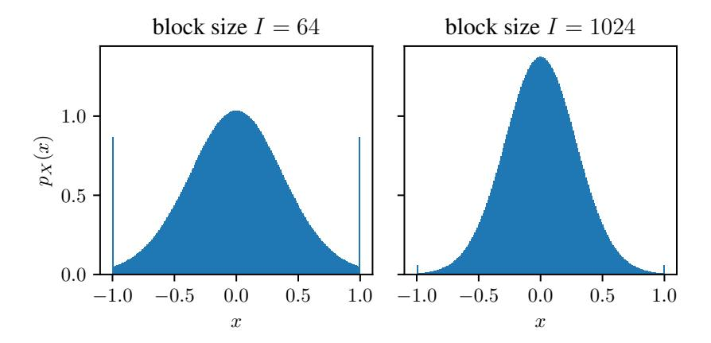

# References

- [1] E. Frantar, S. Ashkboos, T. Hoefler, and D. Alistarh, "OPTQ: Accurate Quantization for Generative Pre-trained Transformers," in *Proc. of ICLR*, Kigali, Rwanda, May 2023, pp. 1–16.
- [2] J. Lin, J. Tang, H. Tang, *et al.*, "AWQ: Activation-Aware Weight Quantization for On-Device LLM Compression and Acceleration," in *Proc. of MLSys*, Santa Clara, CA, USA, May 2024, pp. 87–100.
- [3] G. Xiao, J. Lin, M. Seznec, H. Wu, J. Demouth, and S. Han, "SmoothQuant: Accurate and Efficient Post-Training Quantization for Large Language Models," in *Proc. of ICML*, Honolulu, HI, USA, Jul. 2023, pp. 38 087–38 099.
- [4] Z. Liu, C. Zhao, I. Fedorov, *et al.*, "SpinQuant: LLM Quantization with Learned Rotations," *arXiv*, May 2024. arXiv: [2405.16406](https://arxiv.org/abs/2405.16406).
- [5] T. Dettmers, A. Pagnoni, A. Holtzman, and L. Zettlemoyer, "QLORA: Efficient Finetuning of Quantized LLMs," in *Proc. of NIPS*, New Orleans, LA, USA, Dec. 2023, pp. 10 088–10 115.
- [6] E. J. Hu, Y. Shen, P. Wallis, *et al.*, "LoRA: Low-Rank Adaptation of Large Language Models," in *Proc. of ICLR*, virtual, Apr. 2022, pp. 1–13.
- [7] D. Yoshida, "NF4 Isn't Information Theoretically Optimal (and That's Good)," *arXiv*, Jun. 2023. arXiv: [2306.06965](https://arxiv.org/abs/2306.06965).
- [8] S. P. Lloyd, "Least Squares Quantization in PCM," *IEEE Transactions on Information Theory*, vol. 28, no. 2, pp. 129–137, Mar. 1982.
- [9] T. Dettmers, M. Lewis, S. Shleifer, and L. Zettlemoyer, "8-bit Optimizers via Block-wise Quantization," in *Proc. of ICLR*, virtual, Apr. 2022, pp. 1–19.
- [10] J. Dotzel, Y. Chen, B. Kotb, *et al.*, "Learning from Students: Applying t-Distributions to Explore Accurate and Efficient Formats for LLMs," in *Proc. of ICML*, Vienna, Austria, Jul. 2024, pp. 11 573–11 591.
- [11] T. Berger, *Rate-Distortion Theory*. Wiley, 2003.
- [12] A. Dubey, A. Jauhri, A. Pandey, *et al.*, "The Llama 3 Herd of Models," *arXiv*, Jul. 2024. arXiv: [2407.21783](https://arxiv.org/abs/2407.21783).
- [13] A. Yang, B. Yang, B. Zhang, *et al.*, "Qwen2.5 Technical Report," *arXiv*, Dec. 2024. arXiv: [2412.15115](https://arxiv.org/abs/2412.15115).
- [14] A. Q. Jiang, A. Sablayrolles, A. Mensch, *et al.*, "Mistral 7B," *arXiv*, Oct. 2023. arXiv: [2310.](https://arxiv.org/abs/2310.06825) [06825](https://arxiv.org/abs/2310.06825).
- [15] O. Honovich, T. Scialom, O. Levy, and T. Schick, "Unnatural Instructions: Tuning Language Models with (Almost) No Human Labor," in *Proc. of ACL*, Toronto, ON, Canada, Jul. 2023, pp. 14 409–14 428.
- [16] Y. Wei, Z. Wang, J. Liu, Y. Ding, and L. Zhang, "Magicoder: Empowering Code Generation with OSS-INSTRUCT," in *Proc. of ICML*, Vienna, Austria, Jul. 2024, pp. 52 632–52 657.
- [17] S. Merity, C. Xiong, J. Bradbury, and R. Socher, "Pointer Sentinel Mixture Models," in *Proc. of ICLR*, Toulon, France, Apr. 2017, pp. 1–15.
- [18] D. Paperno, G. Kruszewski, A. Lazaridou, *et al.*, "The LAMBADA Dataset: Word Prediction Requiring a Broad Discourse Context," in *Proc. of ACL*, Berlin, Germany, Aug. 2016, pp. 1525– 1534.
- [19] D. Hendrycks, C. Burns, S. Basart, *et al.*, "Measuring Massive Multitask Language Understanding," in *Proc. of ICLR*, virtual, May 2021, pp. 1–27.
- [20] P. Clark, I. Cowhey, O. Etzioni, *et al.*, "Think You Have Solved Question Answering? Try ARC, the AI2 Reasoning Challenge," *arXiv*, Mar. 2018. arXiv: [1803.05457](https://arxiv.org/abs/1803.05457).
- [21] R. Zellers, A. Holtzman, Y. Bisk, A. Farhadi, and Y. Choi, "HellaSwag: Can a Machine Really Finish Your Sentence?" In *Proc. of ACL*, Florence, Italy, Jul. 2019, pp. 4791–4800.

- [22] Y. Bisk, R. Zellers, R. L. Bras, J. Gao, and Y. Choi, "PIQA: Reasoning about Physical Commonsense in Natural Language," in *Proc. of AIII*, New York, NY, USA, Feb. 2020, pp. 7432–7439.
- [23] M. Sap, H. Rashkin, D. Chen, R. Le Bras, and Y. Choi, "Social IQa: Commonsense Reasoning about Social Interactions," in *Proc. of EMNLP-IJCNLP*, Hong Kong, China, Nov. 2019, pp. 4463–4473.
- [24] K. Sakaguchi, R. L. Bras, C. Bhagavatula, and Y. Choi, "WinoGrande: An Adversarial Winograd Schema Challenge at Scale," *Commun. ACM*, vol. 64, no. 9, 99–106, Aug. 2021.
- [25] D. B. Owen, "A table of normal integrals," *Communications in Statistics - Simulation and Computation*, vol. 9, no. 4, pp. 389–419, 1980.
- [26] R. L. Burden and J. D. Faires, *Numerical Analysis*. Brooks/Cole, 2010.
- [27] I. Loshchilov and F. Hutter, "Decoupled Weight Decay Regularization," in *Proc. of ICLR*, New Orleans, LA, USA, May 2019, pp. 1–10.

## **Appendix**

## A Ablation on Constrained (i.e., Fixed) Reconstruction Levels

In Tab. 5, we evaluate the importance of precisely representing zero weights and absolute block maxima. We use the term "precise" in this context for an error-free representation of a zero weight and for a 16-bit representation of absolute block maxima. We measure the perplexity on WikiText-2 [17] of Llama-3.1-8B quantized with BOF4 for all four possible combinations of fixed (i.e., constrained) reconstruction levels  $\hat{x}(\ell)$  from 0 and  $\pm 1$ .

Table 5: The quantization error (MAE and MSE) and perplexity (PPL) on WikiText-2 of BOF4 with block size I=64 using different combinations of fixed reconstruction levels applied to the network weights of Llama-3.1-8B. Best result in each column in bold.

| Constrained reconstruction levels | MAE ↓ (1e-4) | MSE ↓ (1e-6) | PPL ↓ |
|-----------------------------------|--------------|-----------------|-------|
| Ø                                 | 9.881        | 1.506           | 8.81  |
| {0}                               | 9.904        | 1.516           | 8.57  |
| $\{1, -1\}$                       | 9.914        | 1.555           | 8.78  |
| $\{0, 1, -1\}$                    | 9.936        | 1.566           | 8.51  |

We observe that fixing all (-1, 0, and 1) yields the best performance w.r.t. perplexity, even though the additional constraints on the codebook inevitably increase the quantization error. This confirms that the design choice of NF4 [5] and AF4 [7] to include these values as reconstruction levels is sound.

## **B** Full Derivation of the Correct Optimal Reconstruction Levels

#### **B.1** Distribution of Normalized Weights

To derive an optimized code for quantization, we first characterize the distribution of normalized weights. Yoshida performs a similar analysis, assuming zero-mean, unit-variance normally-distributed network weights  $w_{b,i} \sim \mathcal{N}(0,1)$  [7]. In the following, we generalize this analysis to weights distributed as any symmetric, zero-mean probability distribution. The weights  $w_{b,i}$  are considered i.i.d. samples from a random variable W with the probability density function (PDF)  $p_W$  and cumulative distribution function (CDF)  $F_W$ . Similarly, X is a random variable describing the distribution of the normalized weights with PDF  $p_X$  and CDF  $F_X$ . A third random variable M describes the distribution of absolute or signed block maxima  $w_b^{\max}$ . Fig. 4 shows an estimation of  $p_X(x=x_{b,i})$  in case  $w_{b,i} \sim p_W = \mathcal{N}(0,1)$ . We observe that the distribution of normalized weights concentrates around zero with increasing block size I. Furthermore, the discrete fraction representing the absolute block maxima at the edges (-1 and 1) is inversely proportional to the block size I, as we will formalize later in (16).

**PDF for a Fixed Absolute Block Maximum:** First, we analyze the distribution of normalized weights X for a fixed absolute block maximum  $M=m=w_b^{\max}$  (1). The PDF  $p_X(x)$  with  $x\in\mathbb{R}$  assigns a probability mass of  $\frac{1}{2I}$  to both x=-1 and x=+1 since in the non-degenerated case there is *exactly one* value of maximum magnitude in each block of I weights. The remaining probability mass of  $\frac{I-1}{I}$  forms a continuous, non-uniform probability distribution on the interval (-1,1).

For a fixed absolute block maximum  $m=w_b^{\max}\in\mathbb{R}^+$ , the continuous portion of the CDF of X is

$$F_X^{\text{cont}}(x \mid M = m) = P[X \le x \mid |X| < 1, M = m]$$

$$= P[W < mx \mid |W| < m]$$

$$= \frac{P[W \le mx \land |W| < m]}{P[|W| < m]}$$

$$= \frac{F_W(mx) - F_W(-m)}{F_W(m) - F_W(-m)}$$

$$= F_{W_{[-m,m]}}(mx), \tag{10}$$

for x ∈ [0, 1], where FW[−m,m] is the CDF FW of weights truncated to the interval [−m, m].

Distribution of Absolute Maxima: We continue with the distribution of the absolute block maxima, defined by the random variable M. First, due to the statistical independence of weights wb,i within a block, the CDF of M is given by

$$F_{M}(m) = P[|w_{b,1}| \le m, |w_{b,2}| \le m, \dots, |w_{b,I}| \le m]$$

$$= \prod_{i \in \mathcal{I}} F_{|W|}(m), \quad \mathcal{I} = \{1, 2, \dots I\}$$

$$= F_{|W|}^{I}(m), \tag{11}$$

where F|W| is the CDF of |W|. Taking the derivative of FM using the chain rule, we obtain the PDF of M:

$$p_{M}(m) = \frac{d}{dm} F_{M}(m)$$

$$= I \cdot F_{|W|}^{I-1}(m) \cdot \frac{d}{dm} F_{|W|}(m)$$

$$= I \cdot F_{|W|}^{I-1}(m) \cdot \frac{d}{dm} (2F_{W}(m) - 1)$$

$$= 2I \cdot F_{|W|}^{I-1}(m) \cdot p_{W}(m)$$
(12)

In the derivation of [\(12\)](#page-12-1), we use the fact that the PDF is the derivative of the CDF, and we use the equality

$$F_{|W|}(m) = P[-m \le W \le m]$$

$$= F_{W}(m) - (1 - F_{W}(m))$$

$$= 2F_{W}(m) - 1,$$
(13)

exploiting the symmetry of pW w.r.t. zero.

CDF of the Normalized Weights: Now, the *continuous* part of the CDF FX(x), −1 < x < 1, can be calculated using the law of total probability by integrating over all possible values of the block-wise absolute maximum M = m, and weighting each block-maximum-dependent CDF with the corresponding probability density pM(m) as follows:

$$F_X^{\text{cont}}(x) = P\left[X_{b,i} \le x \mid |X| < 1\right]$$

$$= \int_0^\infty p_M(m) \cdot F_X^{\text{cont}}(x \mid M = m) \, dm. \tag{14}$$

By substituting the terms pM(m) and F cont X (x | M =m) using [\(12\)](#page-12-1) and [\(10\)](#page-12-2), we obtain

$$F_X^{\text{cont}}(x) = 2I \cdot \int_0^\infty F_{|W|}^{I-1}(m) p_W(m) \cdot F_{W_{[-m,m]}}(mx) \, \mathrm{d}m.$$
 (15)

Figure 4: Empiric estimation of the PDF pX, resulting from block-wise absmax normalization, in case of Gaussian network weights based on 2 29 samples x for different block sizes I.

Figure 5: Example CDF FX(x) for absolute and signed block-wise absmax normalized Gaussian network weights x = xb,i and block size I = 8.

Considering that FX,cont contains the fraction I−1 I of the probability mass, whereas +1 and −1 each occur with probability 1 2I , the CDF of X can be characterized as

$$F_X(x) = \begin{cases} 0, & \text{if } x < -1\\ \frac{1}{2I} + \frac{I - 1}{I} F_X^{\text{cont}}(x), & \text{if } -1 \le x < 1\\ 1, & \text{if } x \ge 1 \end{cases}$$
 (16)

For signed block-wise absmax quantization, the continuous part of the distribution remains unchanged due to the symmetry of pW w.r.t. zero. Only the discrete probability mass of 1/I is now allocated entirely to X = 1, resulting in the CDF

$$F_X(x) = \begin{cases} 0, & \text{if } x < -1\\ \frac{I-1}{I} F_X^{\text{cont}}(x), & \text{if } -1 \le x < 1\\ 1, & \text{if } x \ge 1 \end{cases}$$
 (17)

The CDF FX(x) for an *example* Gaussian weight distribution wb,i ∼ pW = N (0, 1) with block size I = 8 for both absolute and signed block-wise absmax quantization is shown in Fig. [5.](#page-13-2) We observe that, in the case of *absolute* block-wise absmax normalization, the CDF FX exhibits two discontinuities at x = −1 and x = 1, whereas, for *signed* absmax normalization, there is only one discontinuity at x = 1.

## B.2 Centroids for Block-Wise Normalized Weights

In the following, we show how Lloyd's algorithm [\[8\]](#page-9-5) can be modified to minimize the MSE(W, Q(W)) or MAE(W, Q(W)) quantization error when using block-wise absmax quantization, where Q : R → R denotes the overall block-wise absmax quantization function. Lloyd's algorithm is applied to the normalized weights distributed according to X, whereas the quantization error should be minimized end-to-end for the distribution of original network weights W. We demonstrate how the centroid criterion for a reconstruction level xˆ(ℓ) of a region Rℓ = [ξ(ℓ−1), ξ(ℓ)) can be reformulated to account for this discrepancy. Specifically, we derive a mathematical formula enabling the direct computation of the updated reconstruction level xˆ(ℓ) for any continuous distribution of network weights that is symmetrical w.r.t. zero and has a known PDF pW and CDF FW . Furthermore, we consider the special case of Gaussian weights pW = N (0, 1), which allows further simplification in the case of the MSE criterion.

It should also be noted that the assignment of regions according to the nearest neighbor criterion remains unchanged from Lloyd's algorithm. The proof that the nearest neighbor criterion is still a necessary condition for optimality, even when applied to normalized weights, is trivial. Therefore, showing that our modified centroid criterion is a second necessary condition for optimality is sufficient to prove the local optimality of any solution to which our algorithm converges.

#### B.2.1 MSE Optimization

First, we minimize the MSE quantization error MSE(W, Q(W)) = EW [(W − Q(W))2 ] with EW [] being the expectation w.r.t. the weights W.

General Centroid Criterion: Our goal is to find a reconstruction level xˆ(ℓ) that minimizes the MSE quantization error for normalized weights that fall into region Rℓ:

$$\hat{x}(\ell) = \operatorname*{arg\,min}_{\hat{x} \in \mathbb{R}} \mathrm{MSE}_{\ell}(W, Q(W)) = \operatorname*{arg\,min}_{\hat{x} \in \mathbb{R}} \mathbb{E}_{W}[(W - Q(W))^{2} \mid X \in \mathcal{R}_{\ell}], \tag{18}$$

where xˆ represents a candidate value of the reconstruction level utilized for normalized weights falling into region Rℓ within Q, MSEℓ(W, Q(W)) is the MSE quantization error of weights that fall into region Rℓ after normalization.

Next, to enable analytical minimization of the reconstruction error, we use the law of total expectation

$$\mathbb{E}[A] = \mathbb{E}_B[\mathbb{E}_A[A \mid B]] = \int_{-\infty}^{\infty} \mathbb{E}[A \mid B = b] \cdot p(b) \, \mathrm{d}b. \tag{19}$$

to express the expectation [\(18\)](#page-14-1) as an integral over expectations conditioned on *a fixed block maximum* M = m:

$$\mathbb{E}_{W}[(W - Q(W))^{2} \mid X \in \mathcal{R}_{\ell}]$$

$$= \int_{0}^{\infty} p_{M}(m \mid X \in \mathcal{R}_{\ell}) \cdot \mathbb{E}_{W}[(W - Q(W))^{2} \mid M = m, X \in \mathcal{R}_{\ell}] dm.$$
(20)

This reformulation allows us to express the expectation in terms of the random variable X and the sought reconstruction level xˆ:

$$\mathbb{E}_{W} \left[ (W - Q(W))^{2} \mid M = m, X \in \mathcal{R}_{\ell} \right]$$

$$= \mathbb{E}_{X} \left[ (m \cdot X - m \cdot \hat{x})^{2} \mid M = m, X \in \mathcal{R}_{\ell} \right]$$

$$= m^{2} \cdot \mathbb{E}_{X} \left[ (X - \hat{x})^{2} \mid M = m, X \in \mathcal{R}_{\ell} \right]$$
(21)

Substituting [\(21\)](#page-14-2) into [\(20\)](#page-14-3), we obtain the new formulation of an MSE-optimal reconstruction level

$$\hat{x}(\ell) = \underset{\hat{x} \in \mathbb{R}}{\operatorname{arg\,min}} \int_0^\infty p_M(m \mid X \in \mathcal{R}_\ell) \cdot m^2 \cdot \mathbb{E}_X \left[ (X - \hat{x})^2 \mid M = m, \ X \in \mathcal{R}_\ell \right] dm. \tag{22}$$

To find the optimal reconstruction level xˆ, we set the derivative w.r.t. xˆ equal to zero:

$$\frac{\mathrm{d}}{\mathrm{d}\hat{x}} \int_{0}^{\infty} p_{M}(m \mid X \in \mathcal{R}_{\ell}) \cdot m^{2} \cdot \mathbb{E}_{X} \left[ (X - \hat{x})^{2} \mid M = m, X \in \mathcal{R}_{\ell} \right] \mathrm{d}m$$

$$= \int_{0}^{\infty} m^{2} \cdot 2 \left( \hat{x} - \mathbb{E}_{X} [X \mid M = m, X \in \mathcal{R}_{\ell}] \right) \cdot p_{M}(m \mid X \in \mathcal{R}_{\ell}) \, \mathrm{d}m = 0 \tag{23}$$

Rearranging for  $\hat{x}$  yields

$$\hat{x}(\ell) = \hat{x} = \frac{\int_0^\infty m^2 \cdot \mathbb{E}_X[X \mid M = m, X \in \mathcal{R}_\ell] \cdot p_M(m \mid X \in \mathcal{R}_\ell) \, \mathrm{d}m}{\int_0^\infty m^2 \cdot p_M(m \mid X \in \mathcal{R}_\ell) \, \mathrm{d}m}.$$
 (24)

To compute this, we must express all quantities in terms of the known PDF  $p_W$  and CDF  $F_W$ . To accomplish this, we analyze the PDF  $p_M(m \mid X \in \mathcal{R}_\ell)$  of the weight maximum conditioned on the region  $\mathcal{R}_\ell$ . Using Bayes' theorem, we can express this as

$$p_{M}(m \mid X \in \mathcal{R}_{\ell}) = \frac{p_{M}(m) \cdot P[X \in \mathcal{R}_{\ell} \mid M = m]}{P[X \in \mathcal{R}_{\ell}]}$$

$$= \frac{p_{M}(m) \cdot \left(F_{X}(\xi(\ell) \mid M = m) - F_{X}(\xi(\ell - 1) \mid M = m)\right)}{P[X \in \mathcal{R}_{\ell}]}$$
(25)

The PDF of the weight maximum  $p_M(m)$  is known from (12), and the CDF  $F_X(x \mid M=m)$  for the continuous part of the distribution is known from (10). The special case of the non-continuous outermost regions is considered separately. With this and (24), the updated reconstruction level can be expressed as (major analytical result for MSE-optimized codebook reconstruction levels)

$$\hat{x}(\ell) = \frac{\int_0^\infty m^2 \cdot \mathbb{E}_X[X \mid M = m, X \in \mathcal{R}_\ell] \cdot p_M(m) \cdot \left[ F_X(x \mid M = m) \right]_{\xi(\ell - 1)}^{\xi(\ell)} dm}{\int_0^\infty m^2 \cdot p_M(m) \cdot \left[ F_X(x \mid M = m) \right]_{\xi(\ell - 1)}^{\xi(\ell)} dm}.$$
 (26)

Here, we use the notation  $[F_X(x\mid M=m)]_{\xi(\ell-1)}^{\xi(\ell)}=F_X(\xi(\ell)\mid M=m)-F_X(\xi(\ell-1)\mid M=m)$ . Using the known PDF  $p_W$  and CDF  $F_W$ ,  $p_M(m)$  is obtained by (12), while  $F_X(x\mid M=m)$  is obtained by (10). Hence, only the conditional expectation  $\mathbb{E}_X[X\mid M=m,\ X\in\mathcal{R}_\ell]$  of normalized weights X requires further analysis.

**Expectation of Normalized Weights:** To compute the optimal reconstruction level  $\hat{x}(\ell)$  according to (26), we require a method to determine the expected value of the normalized weights, conditioned on the absolute block maximum M=m and the region  $\mathcal{R}_{\ell}=[\xi(\ell-1),\xi(\ell))$ . First, we analyze  $\mathbb{E}_X[X\mid M=m,\,X\in\mathcal{R}_{\ell}]$  under the assumption that the region is contained in the continuous part of the distribution  $\mathcal{R}_{\ell}\subset (-1,1)$ . The conditional mean is given by

$$\mathbb{E}_{X}[X \mid M=m, X \in \mathcal{R}_{\ell}] = \frac{\int_{\mathcal{R}_{\ell}} x p_{X}(x \mid M=m) \, \mathrm{d}x}{\int_{\mathcal{R}_{\ell}} p_{X}(x \mid M=m) \, \mathrm{d}x}$$

$$= \frac{\int_{\mathcal{R}_{\ell}} x p_{X}(x \mid M=m)}{F_{X}(\xi(\ell) \mid M=m) - F_{X}(\xi(\ell-1) \mid M=m)}$$
(27)

We know from (10) that  $F_X(x\mid M=m)$  for the continuous part of the distribution  $\mathcal{R}_\ell\in(-1,1)$  can be expressed as  $F_{W_{[-m,m]}}(mx)$  using the CDF of W truncated to the interval [-m,m]. The derivative w.r.t. x represents the corresponding PDF

$$p_X(x \mid M = m) = \frac{\mathrm{d}}{\mathrm{d}x} F_{W_{[-m,m]}}(mx) = m p_{W_{[-m,m]}}(mx), \tag{28}$$

where  $p_{W_{[a,b]}}$  for  $a,b \in \mathbb{R}$  and a < b is the PDF  $p_W$  truncated to the interval [a,b], formally defined as

$$p_{W_{[a,b]}}(w) = \frac{p_W(w) \cdot I_{[a,b]}(w)}{F_W(b) - F_W(a)},\tag{29}$$

where  $I_{[a,b]}: \mathbb{R} \to \{0,1\}$  is the indicator function with  $I_{[a,b]}(w) = 1 \Leftrightarrow a < w < b$ . Note that our assumption  $\mathcal{R}_{\ell} \subset (-1,1)$  implies -1 < X < 1, and therefore  $I_{[-m,m]}(mx) = 1$ . Using this observation and (29), we get

$$\mathbb{E}_{X}[X \mid M = m, X \in \mathcal{R}_{\ell}] = \frac{\int_{\mathcal{R}_{\ell}} m \cdot x \cdot p_{W_{[-m,m]}}(mx) \, \mathrm{d}x}{F_{W_{[-m,m]}}(m\xi(\ell)) - F_{W_{[-m,m]}}(m\xi(\ell-1))}.$$
 (30)

This expression can be simplified, since  $p_{W_{[-m,m]}}(mx)$  and  $F_{W_{[-m,m]}}(mx)$ , shown in (10), share the common denominator  $F_W(m) - F_W(-m)$ , yielding (to be used in (26))

$$\mathbb{E}_{X}[X \mid M=m, X \in \mathcal{R}_{\ell}] = \frac{\int_{\mathcal{R}_{\ell}} m \cdot x \cdot p_{W}(mx) \, \mathrm{d}x}{F_{W}(m\xi(\ell)) - F_{W}(m\xi(\ell-1))}.$$
(31)

Simplified Solution for Gaussian Network Weights: In the following, we adopt the common assumption that the network weights are distributed according to a zero-mean unit-variance Gaussian  $p_W(w) = g(w) := \mathcal{N}(w; 0, 1)$ , enabling further simplification. Furthermore, we denote the CDF of the zero-mean unit-variance Gaussian as  $G(w) = F_W(w)$ . Additionally, we utilize the solution to the indefinite integral [25] (equation (101) therein)

$$\int xg(mx) = -\frac{1}{m^2}g(mx) + C,$$
(32)

with  $C \in \mathbb{R}$ . By applying this solution to (31), we obtain

$$\mathbb{E}_{X}[X \mid M = m, X \in \mathcal{R}_{\ell}] = -\frac{g(m\xi(\ell)) - g(m\xi(\ell-1))}{m(G(m\xi(\ell)) - G(m\xi(\ell-1)))}.$$
(33)

Substituting this into the centroid criterion (26) results in

$$\hat{x}(\ell) = -\frac{\int_{0}^{\infty} m \cdot \frac{g(m\xi(\ell)) - g(m\xi(\ell-1))}{G(m\xi(\ell)) - G(m\xi(\ell-1))} \cdot p_{M}(m) \cdot \left[ F_{X}(x \mid M = m) \right]_{\xi(\ell-1)}^{\xi(\ell)} dm}{\int_{0}^{\infty} m^{2} \cdot p_{M}(m) \cdot \left[ F_{X}(x \mid M = m) \right]_{\xi(\ell-1)}^{\xi(\ell)} dm}$$
(34)

$$\hat{x}(\ell) = \frac{\int_0^\infty m \cdot \left[ g(mx) \right]_{\xi(\ell-1)}^{\xi(\ell)} \cdot (2G(m) - 1)^{I-2} \cdot g(m) \, dm}{\int_0^\infty m^2 \cdot \left[ G(mx) \right]_{\xi(\ell-1)}^{\xi(\ell)} \cdot (2G(m) - 1)^{I-2} \cdot g(m) \, dm},$$
(35)

for  $\mathcal{R}_{\ell} \in (-1,1)$ . The integrals can be solved using numerical integration.

**Expectation of the Outermost Reconstruction Levels:** Next, we consider the edge case, where the centroid of the outermost region is to be computed, e.g.,  $-1 < \xi(\ell-1) < 1 \le \xi(\ell)$ , for the rightmost region. In this case, we can decompose the overall expectation in (26) as follows

$$\mathbb{E}_{X}[X \mid M = m, X \in \mathcal{R}_{\ell}] = P[\xi(\ell-1) \leq X < 1 \mid M = m, X \in \mathcal{R}_{\ell}] \cdot \mathbb{E}[X \mid M = m, \xi(\ell-1) \leq X < 1] + P[X = 1 \mid M = m, X \in \mathcal{R}_{\ell}] \cdot 1$$
(36)

The expectation  $\mathbb{E}_X[X \mid M=m, X \in \mathcal{R}_\ell]$  is decomposed into the expectation over the continuous part  $\mathbb{E}_X[X \mid M=m, \xi(\ell-1] \leq X < 1)$  and the complementary case X=1, each weighted by their respective probability. For the continuous part, we can compute the expectation with (33). The fraction of the probability mass in  $\mathcal{R}_\ell$  that is allocated to X=1 can be computed as

$$P[X=1 \mid M=m, X \in \mathcal{R}_{\ell}]$$

$$= \frac{P[X=1, X \in \mathcal{R}_{\ell} \mid M=m]}{P[X \in \mathcal{R}_{\ell} \mid M=m]}$$

$$= \frac{P[X=1 \mid M=m]}{P[X \in \mathcal{R}_{\ell} \mid M=m]}$$

$$= \frac{P[X=1 \mid M=m]}{P[\xi(\ell-1) < X < 1 \mid M=m] + P[X=1 \mid M=m]}$$
(37)

For block-wise absmax normalization, without signed absmax, a fraction of  $\frac{1}{2I}$  of the probability mass is allocated to 1, whereas the  $\frac{I-1}{I}$  is contained in the continuous part of the distribution. We can use the CDF  $F_X^{\mathrm{cont}}(x\mid M=m)=F_{W_{[-m,m]}}(mx)$  to find the fraction of the probability mass contained in the continuous part of  $\mathcal{R}_\ell$ :

$$P[\xi(\ell-1) < X < 1 \mid M = m]$$

$$= P[-1 < X < 1 \mid M = m] \cdot P[\xi(\ell-1) < X \mid -1 < X < 1, M = m]$$

$$= \frac{I-1}{I} \cdot (1 - F_X^{\text{cont}}(\xi(\ell-1) \mid M = m))$$

$$= \frac{I-1}{I} \cdot F_X^{\text{cont}}(-\xi(\ell-1) \mid M = m),$$
(38)

utilizing the symmetry of  $F_X^{\text{cont}}()$  w.r.t. zero in the final step. Concerning (37), we obtain

$$P[X=1 \mid M=m, X \in \mathcal{R}_{\ell}]$$

$$= \frac{\frac{1}{2I}}{\frac{I-1}{I}(1 - F_X^{\text{cont}}(\xi(\ell-1) \mid M=m)) + \frac{1}{2I}}$$

$$= \frac{1}{2(I-1)F_X^{\text{cont}}(-\xi(\ell-1) \mid M=m)) + 1},$$
(39)

where  $F_X^{\rm cont}(x\mid M=m)=F_{W_{[-m,m]}}(mx)$  is the CDF of X on the continuous part of the distribution derived in (10). The derivation for the leftmost reconstruction level is symmetric. When using signed absmax normalization, a probability of  $\frac{1}{l}$  is assigned to 1, and we obtain instead

$$P[X=1 \mid M=m, X \in \mathcal{R}_{\ell}] = \frac{1}{(I-1)F_X^{\text{cont}}(-\xi(\ell-1) \mid M=m)) + 1},$$
(40)

for the rightmost reconstruction level, while the leftmost reconstruction level requires no special treatment.

Additionally, for the centroid according to (18), we require  $F_X(x \mid M=m)$ . For the continuous part of the distribution (-1 < X < 1) the solution is provided by (10). Accounting for the probability mass fraction  $\frac{1}{I}$  distributed to -1 and 1, we obtain for absolute block-wise absmax normalization:

$$F_X(x \mid M = m) = \begin{cases} 0, & \text{if } x < -1\\ \frac{1}{2I} + \frac{I - 1}{I} F_X^{\text{cont}}(x \mid M = m), & \text{if } -1 \le x < 1\\ 1, & \text{if } x > 1, \end{cases}$$
(41)

and for signed block-wise absmax normalization:

$$F_X(x \mid M = m) = \begin{cases} 0, & \text{if } x < -1\\ \frac{I - 1}{I} F_X^{\text{cont}}(x \mid M = m), & \text{if } -1 \le x < 1\\ 1, & \text{if } x \ge 1. \end{cases}$$
 (42)

It should also be noted that the computation for the continuous part of the distribution with CDF  $F_X^{\rm cont}(x\mid M=m)$  is identical for both signed and absolute block-wise absmax normalization. This is because the distribution of normalized weights only differs in the probability mass assigned to each of the endpoints -1 and 1. Moreover, these edge cases are typically not evaluated, since the outermost reconstruction levels are usually constrained to -1 and 1 and are not updated during Lloyd's algorithm.

#### **B.2.2** MAE Optimization

We derive a condition for the centroid that minimizes the MAE quantization error MAE(W,Q(W)). We show that the condition minimizes the MAE by reducing the problem to the well-known fact that the median minimizes the mean absolute deviation from a set of points. Beginning analogously to Section B.2.1, we arrive at the following criterion for optimality:

$$\hat{x}(\ell) = \underset{\hat{x} \in \mathbb{R}}{\operatorname{arg\,min}} \int_{0}^{\infty} m \cdot \mathbb{E}_{X} \left[ |X - \hat{x}| \mid M = m, \ X \in \mathcal{R}_{\ell} \right] \cdot p_{M}(m \mid X \in \mathcal{R}_{\ell}) \, \mathrm{d}m. \tag{43}$$

Thus, we define the objective function we aim to minimize as

$$g(\hat{x}) := \int_0^\infty m \cdot \mathbb{E}_X[|X - \hat{x}| \mid M = m, X \in \mathcal{R}_\ell] \cdot p_M(m \mid X \in \mathcal{R}_\ell) \, \mathrm{d}m \tag{44}$$

Using the definition of the expected value, we have

$$\mathbb{E}_{X}\left[|X-\hat{x}| \mid M=m, X \in \mathcal{R}_{\ell}\right] = \int_{\mathcal{R}_{\ell}} p_{X}(x \mid M=m, X \in \mathcal{R}_{\ell}) \cdot |\hat{x}-x| \, \mathrm{d}x. \tag{45}$$

so that

$$g(\hat{x}) = \int_0^\infty \int_{\mathcal{R}_\ell} m \cdot p_M(m \mid X \in \mathcal{R}_\ell) \cdot p_X(x \mid M = m, X \in \mathcal{R}_\ell) \cdot |\hat{x} - x| \, \mathrm{d}x \, \mathrm{d}m. \tag{46}$$

We swap the order of integration:

$$g(\hat{x}) = \int_{\mathcal{R}_{\ell}} \left[ \int_{0}^{\infty} m \cdot p_{M}(m \mid X \in \mathcal{R}_{\ell}) \cdot p_{X}(x \mid M = m, X \in \mathcal{R}_{\ell}) \, \mathrm{d}m \right] |\hat{x} - x| \, \mathrm{d}x. \tag{47}$$

Now, we define a "re-weighted" PDF

$$\tilde{p}(x) := \frac{\int_0^\infty m \cdot p_M(m \mid X \in \mathcal{R}_\ell) \cdot p_X(x \mid M = m, X \in \mathcal{R}_\ell) \, \mathrm{d}m}{\int_0^\infty m \cdot p_M(m \mid X \in \mathcal{R}_\ell) \, \mathrm{d}m}$$
(48)

with which the objective function can be rewritten as

$$g(\hat{x}) = \int_0^\infty m \cdot p_M(m \mid X \in \mathcal{R}_\ell) \, \mathrm{d}m \cdot \int_{\mathcal{R}_\ell} \tilde{p}(x) \cdot |\hat{x} - x| \, \mathrm{d}x. \tag{49}$$

Since we search for  $\arg\min_{\hat{x}} g(\hat{x})$ , we can ignore the first integral in (49) as it is only a constant factor, and our objective function becomes

$$g(\hat{x}) := \int_{\mathcal{R}_{\ell}} \tilde{p}(x) \cdot |\hat{x} - x| \, \mathrm{d}x. \tag{50}$$

It is a well-known fact that for any PDF  $\tilde{p}()$ , the expected absolute deviation

$$\hat{x} \mapsto \int_{-\infty}^{\infty} \tilde{p}(x) \cdot |\hat{x} - x| \, \mathrm{d}x \tag{51}$$

is minimized by the median of the distribution with PDF  $\tilde{p}(x)$ . That is, if  $\hat{x} = \hat{x}(\ell)$  is the minimum of  $g(\hat{x})$ , then it satisfies

$$\int_{-\infty}^{\hat{x}(\ell)} \tilde{p}(x) \, \mathrm{d}x = \frac{1}{2} \int_{\mathcal{R}_{\ell}} \tilde{p}(x) \, \mathrm{d}x. \tag{52}$$

The denominator  $\int_0^\infty m \cdot p_M(m \mid X \in \mathcal{R}_\ell) \, \mathrm{d}m$  in (48) can be eliminated from both sides of (52), allowing us to redefine  $\tilde{p}$  as

$$\tilde{p}(x) := \int_0^\infty m \cdot p_M(m \mid X \in \mathcal{R}_\ell) \cdot p_X(x \mid M = m, X \in \mathcal{R}_\ell) \, \mathrm{d}m. \tag{53}$$

Now, substituting the definition of  $\tilde{p}(x)$  into the left-hand side of (52), we have

$$\int_{-\infty}^{\hat{x}(\ell)} \tilde{p}(x) \, \mathrm{d}x = \int_{-\infty}^{\hat{x}(\ell)} \left[ \int_{0}^{\infty} m \cdot p_{M}(m \mid X \in \mathcal{R}_{\ell}) \cdot p_{X}(x \mid M = m, X \in \mathcal{R}_{\ell}) \, \mathrm{d}m \right] \, \mathrm{d}x.$$

$$= \int_{0}^{\infty} m \cdot p_{M}(m \mid X \in \mathcal{R}_{\ell}) \cdot \left[ \int_{-\infty}^{\hat{x}(\ell)} p_{X}(x \mid M = m, X \in \mathcal{R}_{\ell}) \, \mathrm{d}x \right] \, \mathrm{d}m. \quad (54)$$

The inner integral is the conditional CDF of X given M = m and  $X \in \mathcal{R}_{\ell}$ . Thus,

$$\int_{-\infty}^{\hat{x}(\ell)} \tilde{p}(x) \, \mathrm{d}x = \int_{0}^{\infty} p_{M}(m \mid X \in \mathcal{R}_{\ell}) \cdot m \cdot F_{X}(\hat{x}(\ell) \mid M = m, X \in \mathcal{R}_{\ell}) \, \mathrm{d}m. \tag{55}$$

Similarly, the total mass in  $\mathcal{R}_{\ell}$ , on the right-hand side of (52), is

$$\int_{\mathcal{R}_{\ell}} \tilde{p}(x) \, \mathrm{d}x = \int_{0}^{\infty} m \cdot p_{M}(m \mid X \in \mathcal{R}_{\ell}) \, \mathrm{d}m. \tag{56}$$

Substituting (55) and (56) into (52), we obtain the new condition for optimality:

$$\int_{0}^{\infty} m \cdot p_{M}(m \mid X \in \mathcal{R}_{\ell}) \cdot F_{X}(\hat{x}(\ell) \mid M = m, X \in \mathcal{R}_{\ell}) dm$$

$$= \frac{1}{2} \int_{0}^{\infty} m \cdot p_{M}(m \mid X \in \mathcal{R}_{\ell}) dm.$$
(57)

Rearranging yields

$$\int_0^\infty m \cdot p_M(m \mid X \in \mathcal{R}_\ell) \cdot \left( F_X(\hat{x}(\ell) \mid M = m, X \in \mathcal{R}_\ell) - \frac{1}{2} \right) dm = 0.$$
 (58)

Finally, we use the definition of the truncated CDF and the characterization of  $p_M(m \mid X \in \mathcal{R}_\ell)$  from (25) to obtain

$$\int_{0}^{\infty} m \cdot p_{M}(m) \cdot \left( F_{X}(\hat{x}(\ell) \mid M = m) - \frac{1}{2} \left[ F_{X}(x \mid M = m) \right]_{\xi(\ell = 1)}^{\xi(\ell)} \right) dm = 0.$$
 (59)

All expressions can be computed directly from the known PDF  $p_W$  and CDF  $F_W$  of W, using (12), (41), (42). Thus, we can use this equation in Lloyd's algorithm to determine the centroid by numerical integration in combination with some method for finding the root of the monotonous function in  $\hat{x}(\ell)$  on the left-hand side of (59), such as the bisection method. [26, pp. 48 ff.]

#### **B.3** Empirical Centroid Computation

In Section B.2, we have derived theoretical solutions for the centroid computation in block-wise absmax quantization. However, computing the resulting integrals numerically might suffer from precision issues preventing a straight-forward implementation. Therefore, we additionally provide a simpler method to compute the centroid  $\hat{x}(\ell)$  of a region  $\mathcal{R}_{\ell}$  using Monte-Carlo estimation based on samples drawn from the network weight distribution. This method has the additional advantage that it can be applied to empirically collected weights from existing pre-trained networks rather than an assumed parametric distribution.

We first sample weights  $\mathbf{W}=(\mathbf{W}_b)=(w_{b,i})\in\mathbb{R}^{B\times I}$  grouped into B blocks each with I weights from the distribution of network weights  $p_W$ . Then, we normalize the weights by their respective block maxima  $w_b^{\max}$  obtaining the normalized weights  $\mathbf{X}\in\mathbb{R}^{B\times I}=(\mathbf{X}_b)=(x_{b,i})$ . The objective now becomes to minimize the quantization error of the sampled weights  $J(\mathbf{W},\mathbf{Q}(\mathbf{W}))$ , where J is either MAE() or MSE() and  $\mathbf{Q}(\mathbf{W})$  is the result of applying the quantization function  $Q_b()$  element-wise to each row  $\mathbf{W}_b$  of  $\mathbf{W}$ . We apply Lloyd's algorithm based on empirical data to the generated weights with a modified centroid criterion, which is derived in the following for both MAE and MSE optimization.

**MSE Optimization**: Our first goal is to minimize the MSE of the network weights based on the sampled weights  $\mathbf{W}$ . We can express  $\mathrm{MSE}(\mathbf{W}, \mathbf{Q}(\mathbf{W}))$  in terms of an MSE of the normalized weights as follows:

$$MSE(\mathbf{W}, \mathbf{Q}(\mathbf{W})) = \frac{1}{B \cdot I} \sum_{b \in \mathcal{B}} \sum_{i \in \mathcal{I}} (w_{b,i} - Q_b(w_{b,i}))^2$$

$$= \frac{1}{B \cdot I} \sum_{b \in \mathcal{B}} \sum_{i \in \mathcal{I}} (w_{b,i} - w_b^{\max} \cdot \tilde{Q}(x_{b,i}))^2$$

$$= \frac{1}{B \cdot I} \sum_{b \in \mathcal{B}} \sum_{i \in \mathcal{I}} (w_b^{\max})^2 \cdot (x_{b,i} - \tilde{Q}(x_{b,i}))^2$$

$$= \frac{1}{B} \sum_{b \in \mathcal{B}} (w_b^{\max})^2 \cdot MSE(\mathbf{X}_b, \tilde{\mathbf{Q}}(\mathbf{X}_b)), \tag{60}$$

where  $w_b^{\max}$  for the *b*th block  $\mathbf{W}_b \in (w_{b,i})$  is computed according to (1), and  $\tilde{Q}()$  is the block-independent quantization function (3) that is utilized to quantize normalized weights.

Next, we show how the centroid computation using Lloyd's algorithm must be modified to update the reconstruction level  $\hat{x}(\ell)$  in a *specific interval*  $[\xi(\ell-1),\xi(\ell))$  using empirical samples of normalized weights  $\mathbf{X}=(x_{b,i})$ , such that the MSE of the weights  $\mathrm{MSE}_{\ell}(\mathbf{W},\mathbf{Q}(\mathbf{W}))$  for that interval is minimized. Let  $x_k, k \in \mathcal{K}_{\ell} = \{1,\ldots,K_{\ell}\}$ , be those normalized weights  $x_{b,i}$  that fall into the interval  $[\xi(\ell-1),\xi(\ell))$  in the bth block, and  $w_k=w_b^{\max}$  the absolute or signed block maximum corresponding to the normalized weight  $x_k$ . Using (60), we can conclude that the contribution of the  $\ell$ th interval to the overall MSE is

$$MSE_{\ell}(\mathbf{W}, \mathbf{Q}(\mathbf{W})) = \frac{1}{K_{\ell}} \sum_{k \in \mathcal{K}_{\ell}} (w_k)^2 \cdot (x_k - \hat{x})^2.$$
(61)

We minimize by computing the derivative w.r.t.  $\hat{x}$  according to

$$\frac{\mathrm{d}}{\mathrm{d}\hat{x}} \mathrm{MSE}_{\ell}(\mathbf{W}, \mathbf{Q}(\mathbf{W})) = -\frac{2}{K_{\ell}} \sum_{k \in \mathcal{K}_{\ell}} w_k^2 \cdot (x_k - \hat{x}), \tag{62}$$

and setting it equal to 0, allowing us to ignore the constant factor:

$$0 = \sum_{k \in \mathcal{K}_{\ell}} w_k^2 \cdot (x_k - \hat{x}(\ell)) = \sum_{k \in \mathcal{K}_{\ell}} w_k^2 \cdot x_k - \sum_{k \in \mathcal{K}_{\ell}} w_k^2 \cdot \hat{x}$$
 (63)

Rearranging for  $\hat{x}$ , we obtain the optimal reconstruction level in the  $\ell$ th interval as

$$\hat{x}(\ell) = \hat{x} = \frac{\sum_{k \in \mathcal{K}_{\ell}} w_k^2 \cdot x_k}{\sum_{k \in \mathcal{K}_{\ell}} w_k^2},\tag{64}$$

which is the weighted mean of weights  $x_k$  in the interval  $[\xi(\ell-1), \xi(\ell))$ , weighted by their corresponding squared absolute or signed block maxima  $w_k^2$ . Tab. 8 (discussed in Appendix C) further supports the equivalence of this Monte-Carlo method with the theoretical solution given in (5).

**MAE Optimization:** A similar derivation can be made for the optimization of the MAE. Given fixed normalized network weights  $x_k$ ,  $k \in \mathcal{K}_\ell$ , with associated absolute block maxima  $w_k$ ,  $k \in \mathcal{K}_\ell$ , we are searching for

$$x(\ell) = \underset{\hat{x}}{\operatorname{arg\,min}} \operatorname{MAE}_{\ell}(\mathbf{W}, \mathbf{Q}(\mathbf{W})) = \underset{\hat{x}}{\operatorname{arg\,min}} \sum_{k \in \mathcal{K}_{\ell}} w_k \cdot |x_k - \hat{x}|$$
 (65)

Therefore, we define the function we aim to minimize as

$$f(\hat{x}) := \sum_{k \in \mathcal{K}_{\ell}} w_k \cdot |x_k - \hat{x}|. \tag{66}$$

where  $x_k, k \in \mathcal{K}_\ell$ , are those normalized network weights contained in the interval  $[\xi(\ell-1), \xi(\ell))$ . Further, we assume, w.l.o.g. that the normalized network weights  $x_k$  are in ascending order:  $x_1 \le x_2 \le \ldots \le x_{K_\ell}$ .

Obviously, the minimum must satisfy  $x_1 \leq f(\hat{x}) \leq x_{K_\ell}$ . Consider two distinct, consecutive normalized weights  $x_{\kappa}, x_{\kappa+1}$  with  $x_{\kappa} \neq x_{\kappa+1}$ . Let  $x_{\kappa} \leq \hat{x} < \hat{x} + \epsilon \leq x_{\kappa+1}$  for some  $\epsilon \in \mathbb{R}^+$ . Now, we can show the monotonicity of f() on the interval  $(x_{\kappa}, x_{\kappa+1})$  as follows:

$$f(\hat{x} + \epsilon) = \sum_{k=1}^{\kappa} w_k \cdot (\hat{x} + \epsilon - x_k) + \sum_{k=\kappa+1}^{K_{\ell}} w_k \cdot (x_k - (\hat{x} + \epsilon))$$

$$= \sum_{k=1}^{\kappa} w_k \cdot \epsilon + \sum_{k=1}^{\kappa} w_k \cdot (\hat{x} - x_k)$$

$$- \sum_{k=\kappa+1}^{K_{\ell}} w_k \cdot \epsilon + \sum_{k=\kappa+1}^{K_{\ell}} w_k \cdot (x_k - \hat{x})$$

$$= \left(\sum_{k=1}^{\kappa} w_k - \sum_{k=\kappa+1}^{K_{\ell}} w_k\right) \cdot \epsilon + f(\hat{x})$$
(67)

Table 6: Reconstruction levels  $\hat{x}(\ell)$  of **BOF4** and **BOF4-S** optimized w.r.t. MAE and MSE for **block size** I = 64.

|        | ВС                       | DF4                      | BOI                      | F4-S                     |
|--------|--------------------------|--------------------------|--------------------------|--------------------------|
| $\ell$ | MAE-opt. $\hat{x}(\ell)$ | MSE-opt. $\hat{x}(\ell)$ | MAE-opt. $\hat{x}(\ell)$ | MSE-opt. $\hat{x}(\ell)$ |
| 1      | -1.0                     | -1.0                     | -0.8018798232078552      | -0.8568463921546936      |
| 2      | -0.7026305794715881      | -0.7535245418548584      | -0.6076051592826843      | -0.6692874431610107      |
| 3      | -0.5272703766822815      | -0.579203724861145       | -0.468828022480011       | -0.5235266089439392      |
| 4      | -0.3946738243103027      | -0.4385998845100403      | -0.3559602797031403      | -0.4004882574081421      |
| 5      | -0.2832144796848297      | -0.3167679905891418      | -0.2576169371604919      | -0.2910638153553009      |
| 6      | -0.1835313588380814      | -0.2059924453496933      | -0.1677481383085251      | -0.1900092959403992      |
| 7      | -0.090308666229248       | -0.1015387624502182      | -0.0827366262674332      | -0.0938529595732689      |
| 8      | 0.0                      | 0.0                      | 0.0                      | 0.0                      |
| 9      | 0.0789600014686584       | 0.0887245312333107       | 0.0789434835314751       | 0.0887671709060669       |
| 10     | 0.1598792523145676       | 0.1793769598007202       | 0.1597966849803925       | 0.1794802695512772       |
| 11     | 0.244986355304718        | 0.2741499841213226       | 0.2448495477437973       | 0.2743096053600311       |
| 12     | 0.3372218906879425       | 0.3758211433887482       | 0.3371480107307434       | 0.3760197460651398       |
| 13     | 0.441359281539917        | 0.4884937703609467       | 0.4412573873996735       | 0.4886530041694641       |
| 14     | 0.565777063369751        | 0.6187058687210083       | 0.5656819343566895       | 0.6188603639602661       |
| 15     | 0.7299178242683411       | 0.7790452241897583       | 0.7298068404197693       | 0.7791395783424377       |
| 16     | 1.0                      | 1.0                      | 1.0                      | 1.0                      |

Therefore,  $f(\hat{x})$  is monotonously decreasing on the interval  $(x_{\kappa}, x_{\kappa+1})$  if

$$\sum_{k=1}^{\kappa} w_k \le \sum_{k=\kappa+1}^{K_\ell} w_k,\tag{68}$$

and monotonously increasing otherwise. Let  $\kappa^{\rm med}$  be the largest index  $\kappa$  for which (68) holds. Then,  $f(\hat{x})$  is monotonously decreasing for  $\hat{x} < x_{\kappa^{\rm med}}$  and monotonously increasing for  $\hat{x} > x_{\kappa^{\rm med}}$ . Therefore,  $f(\hat{x})$  must be minimal at  $\hat{x} = x_{\kappa^{\rm med}}$ . The point  $x_{\kappa^{\rm med}}$  is known as the weighted median of  $x_k$ ,  $k \in \mathcal{K}_\ell$ , with weights  $w_k$ .

In conclusion, the optimal reconstruction level  $\hat{x}(\ell)$  under the MAE criterion during the iteration of Lloyd's algorithm for normalized network weights is computed as the weighted median

$$\hat{x}(\ell) = \hat{x} = \operatorname{median}_{W}(x_{1}, \dots, x_{K_{\ell}}; w_{1}, \dots, w_{K_{\ell}}) := \max_{\kappa \in \mathcal{K}} \left\{ x_{\kappa} \middle| \sum_{k=1}^{\kappa} w_{k} \le \sum_{k=\kappa+1}^{K_{\ell}} w_{k} \right\}, \quad (69)$$

for  $x_k$ ,  $k \in \mathcal{K}_\ell$ , in ascending order  $x_1 \le x_2 \le \ldots \le x_{K_\ell}$ , both in the case of block-wise absolute and signed absmax normalization. In both cases,  $w_k$  represents the weight with the largest absolute value in the block containing  $x_k$ .

