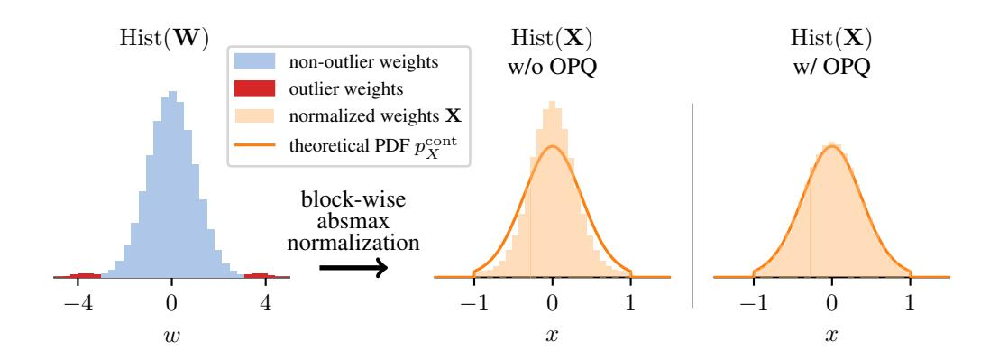
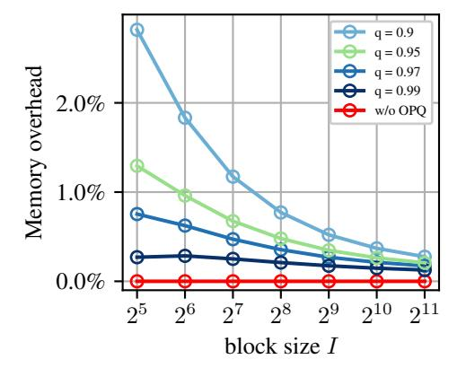

# C Optimal Quantization Codebooks

Tab. 6 and Tab. 7 display the codebooks that were computed using the EM algorithm outlined in Section 3.2. In Tab. 6, the reconstruction levels of BOF4 and BOF-S optimized w.r.t. both MAE and MSE are shown for an example block size I=64. Tab. 7 shows the reconstruction levels of our top-performing quantizer BOF4-S optimized w.r.t. MSE for additional practical block sizes  $I \le 256$ .

Furthermore, Tab. 8 presents a comparison of the BOF4 (MSE) reconstruction levels computed with two different implementations. In the first solution, the centroid is computed based on an empirical approach by the Monte-Carlo method using Gaussian-distributed data according to (6), while the second (theoretical) solution is computed data-independently using our implementation of (5) based on numerical integration. The variance in the finite number of Gaussian samples on the one hand, and numerical inaccuracies on the other hand, cause minor differences in reconstruction levels. The MSE between the theoretical and empirical solution is computed as (in dB)

$$MSE = 10 \cdot \log_{10} \frac{\sum_{\ell \in \mathcal{L}} P[X \in \mathcal{R}_{\ell}] \cdot (\hat{x}^{\text{theo}}(\ell) - \hat{x}^{\text{emp}}(\ell))^{2}}{\sum_{\ell \in \mathcal{L}} P[X \in \mathcal{R}_{\ell}] \cdot \hat{x}^{\text{theo}}(\ell)^{2}} dB,$$
(70)

Table 7: Reconstruction levels  $\hat{x}(\ell)$  of **BOF4-S** optimized w.r.t. MSE for **various block sizes** I.

|        | $\hat{x}(\ell)$ for BOF4-S (MSE) |                     |                     |                     |  |  |  |  |  |
|--------|----------------------------------|---------------------|---------------------|---------------------|--|--|--|--|--|
| $\ell$ | I = 32                           | I = 64              | I = 128             | I = 256             |  |  |  |  |  |
| 1      | -0.8732797503471375              | -0.8568463921546936 | -0.83739173412323   | -0.8146829009056091 |  |  |  |  |  |
| 2      | -0.6907446384429932              | -0.6692874431610107 | -0.6462452411651611 | -0.6221838593482971 |  |  |  |  |  |
| 3      | -0.5437039136886597              | -0.5235266089439392 | -0.5028634667396545 | -0.4820549190044403 |  |  |  |  |  |
| 4      | -0.4173701703548431              | -0.4004882574081421 | -0.3836247622966766 | -0.3669650852680206 |  |  |  |  |  |
| 5      | -0.3038933575153351              | -0.2910638153553009 | -0.2783779501914978 | -0.2659871876239777 |  |  |  |  |  |
| 6      | -0.1986017823219299              | -0.1900092959403992 | -0.1815713942050934 | -0.1733742356300354 |  |  |  |  |  |
| 7      | -0.0981557220220566              | -0.0938529595732689 | -0.0896477326750755 | -0.0855776593089104 |  |  |  |  |  |
| 8      | 0.0                              | 0.0                 | 0.0                 | 0.0                 |  |  |  |  |  |
| 9      | 0.0925938412547112               | 0.0887671709060669  | 0.0850915610790253  | 0.0815095230937004  |  |  |  |  |  |
| 10     | 0.187048003077507                | 0.1794802695512772  | 0.1720834821462631  | 0.1649149656295776  |  |  |  |  |  |
| 11     | 0.2855197489261627               | 0.2743096053600311  | 0.2632072865962982  | 0.2524392008781433  |  |  |  |  |  |
| 12     | 0.3907126188278198               | 0.3760197460651398  | 0.3613293170928955  | 0.3470274209976196  |  |  |  |  |  |
| 13     | 0.506283164024353                | 0.4886530041694641  | 0.4707452654838562  | 0.4531534314155579  |  |  |  |  |  |
| 14     | 0.6379748582839966               | 0.6188603639602661  | 0.5988966822624207  | 0.578848659992218   |  |  |  |  |  |
| 15     | 0.7956376671791077               | 0.7791395783424377  | 0.761027991771698   | 0.7418596744537354  |  |  |  |  |  |
| 16     | 1.0                              | 1.0                 | 1.0                 | 1.0                 |  |  |  |  |  |

Table 8: Reconstruction levels of **BOF4** (MSE) for block size I=64 using either the **empirical method**  $(\hat{x}^{\text{emp}}(\ell))$  or the **theoretical solution**  $(\hat{x}^{\text{theo}}(\ell))$  for the computation of centroids. The third column shows the absolute deviation between corresponding reconstruction levels.

| $\ell$ | Empirical solution $\hat{x}^{\mathrm{emp}}(\ell)$ | Theoretical Solution $\hat{x}^{\mathrm{theo}}(\ell)$ | Deviation $ \hat{x}^{\text{emp}}(\ell) - \hat{x}^{\text{theo}}(\ell) $ |
|--------|---------------------------------------------------|------------------------------------------------------|------------------------------------------------------------------------|
| 1      | -1.0                                              | -1.0                                                 | 0.0                                                                    |
| 2      | -0.7535245418548584                               | -0.7535689203869577                                  | 0.0000443785320993                                                     |
| 3      | -0.579203724861145                                | -0.5792681492535123                                  | 0.0000644243923673                                                     |
| 4      | -0.4385998845100403                               | -0.4386720084478466                                  | 0.0000721239378063                                                     |
| 5      | -0.3167679905891418                               | -0.3168191039791481                                  | 0.0000511133900062                                                     |
| 6      | -0.2059924453496933                               | -0.2060291109696586                                  | 0.0000366656199653                                                     |
| 7      | -0.1015387624502182                               | -0.1015640796456471                                  | 0.0000253171954289                                                     |
| 8      | 0.0                                               | 0.0                                                  | 0.0                                                                    |
| 9      | 0.0887245312333107                                | 0.0887646748673216                                   | 0.0000401436340109                                                     |
| 10     | 0.1793769598007202                                | 0.1794535266886747                                   | 0.0000765668879545                                                     |
| 11     | 0.2741499841213226                                | 0.274249773841407                                    | 0.0000997897200843                                                     |
| 12     | 0.3758211433887482                                | 0.375951029286045                                    | 0.0001298858972968                                                     |
| 13     | 0.4884937703609467                                | 0.4885925268369112                                   | 0.0000987564759645                                                     |
| 14     | 0.6187058687210083                                | 0.6187715546288008                                   | 0.0000656859077925                                                     |
| 15     | 0.7790452241897583                                | 0.7790828367844242                                   | 0.0000376125946659                                                     |
| 16     | 1.0                                               | 1.0                                                  | 0.0                                                                    |

where  $\mathcal{L}=\{1,\ldots,16\}$ . With the results from Tab. 8, we obtain  $MSE=-56.34\,dB$ . This demonstrates the *practical equivalence* of both implementations.

## D Optimizing the Quantization Error of Normalized Weights

Instead of minimizing the end-to-end quantization error  $\mathrm{MAE}(W,Q(W))$  or  $\mathrm{MSE}(W,Q(W))$  of the network weights  $w_{b,i}$  as in BOF4(-S), see Section 3.2, equations (7) and (5), one could alternatively minimize the quantization error  $\mathrm{MAE}(X,Q_b(X))$  or  $\mathrm{MSE}(X,Q_b(X))$  of the normalized weights  $x_{b,i}$ . In comparison to BOF4(-S), optimizing the quantization error of normalized weights is more straightforward and can be achieved using Lloyd's algorithm [8] with standard centroid update rules. For MAE minimization, the centroid of a Voronoi region  $\mathcal{R}_\ell$  is computed based on samples from the network weight distribution with PDF  $p_W$ , as the median of normalized weights  $x_k \in \mathbb{R}$ , with

Figure 6: Difference in perplexity on WikiText-2 of Llama-3.1 8B quantized with BOF4 ( $PPL_{BOF}$ ) vs. a codebook minimizing MSE of normalized weights ( $PPL_{NORM}$ ). Lower values indicate better performance of BOF4.

$$k \in \mathcal{K}_{\ell} = \{1, \dots, K_{\ell}\}:$$

$$\hat{x}(\ell) = \operatorname{median}(x_1, \dots, x_{K_{\ell}})$$
(71)

For MSE minimization, the optimal centroid is the mean

$$\hat{x}(\ell) = \frac{1}{K_{\ell}} \sum_{k \in \mathcal{K}_{\ell}} x_k. \tag{72}$$

Note that BOF4(-S) modifies these centroid conditions by introducing an additional weighting of the normalized network weights  $x_k$  depending on the absolute block maxima  $w_k$  of their respective block (see (8) for MAE and (6) for MSE).

We empirically compare the two optimization strategies. A 4-bit codebook minimizing  $MSE(X,Q_b(X))$  is computed with Lloyd's algorithm using centroids as defined in (72). Then, the perplexity of Llama-3.1 8B on WikiText-2 is measured for both this codebook (72) and BOF4 (MSE) (6). Figure 6 shows the difference in perplexity  $PPL_{BOF} - PPL_{NORM}$  between the two optimization approaches, with  $PPL_{BOF}$  referring to the perplexity achieved by BOF4 (MSE), and  $PPL_{NORM}$  referring to the perplexity when using the codebook that minimizes  $MSE(X,Q_b(X))$ . For all values of I, the difference is negative, indicating that BOF4 (MSE) consistently achieves lower perplexity than the codebook minimizing the MSE of normalized weights.

## **E** Further Details on Outlier-Preserving Quantization (OPQ)

## E.1 Design Considerations

We use a method to identify outliers that depends on the standard deviation  $\sigma_b$  of weights within a block b rather than on a fixed threshold, as the scaling of individual blocks within a neural network layer's weight tensor can vary greatly. Accordingly, we normalize the weights in each block to a standard deviation of 1, dividing by the sample estimate

$$\sigma_b = \sqrt{\frac{1}{I-1} \sum_{i \in \mathcal{I}} (w_{b,i} - \bar{w}_b)^2}, \quad b \in \mathcal{B},$$
(73)

where  $\bar{w}_b = \frac{1}{I} \sum_{i \in \mathcal{I}} w_{b,i}$  denotes the sample mean of weights  $w_{b,i}$  in block b. Furthermore, to make the method generally applicable to different distributions  $p_W$  of network weights, we use the expected distribution of absolute block maxima  $w_b^{\max}$  ( $p_M$  from (12)) to determine the threshold at which a normalized weight  $w_{b,i}$  is classified as an outlier. Specifically, we use the q-quantile of the distribution of absolute block maxima with PDF  $p_M$  for some value q close to 1 as the threshold. Intuitively, this means that a normalized weight counts as an outlier if its absolute value is larger than a fraction q of all absolute block maxima, assuming that the actual distribution of network weights would ideally adhere to our distribution assumption  $p_W$ .

Figure 7: Illustration of **OPQ outlier detection**. The histogram of absolute weights  $\frac{|w_{b,i}|}{\sigma_b}$  of an example block b with block size I=64 normalized to a unit standard deviation is shown in blue. Weights are identified as outliers (red hatching) iff they are greater than  $F_M^{-1}(0.95)$ , i.e., expected to be greater than q=95% of the absolute block maxima  $|w_b^{\rm max}|$  according to the assumption of Gaussian-distributed network weights  $w_{b,i}$ . The corresponding PDF  $p_M$  of absolute block maxima  $|w_b^{\rm max}|$  is shown as a black solid line.

Figure 8: **Effect of outlier-preserving quantization** (OPQ) on the distribution of normalized network weights. The histogram of original network weights  $\mathbf{W}$  containing some outlier weights (red) and non-outliers (blue) is shown on the left. The normalized network weights  $\mathbf{X}$  that are not -1 or 1 are shown on the right with and without OPQ. The theoretical PDF  $p_X^{\text{cont}}$  of the *continuous part* of normalized weights  $\mathbf{X}$  is shown for comparison. The PDF  $p_X^{\text{cont}}$  is computed under the assumption of Gaussian-distributed network weights, whereas the true network weights  $\mathbf{W}$  contain (non-Gaussian) outliers.

Fig. 7 illustrates the detection of outliers. The blue histogram represents a block of absolute network weights  $\frac{|w_{b,i}|}{\sigma_b}$ , normalized by the standard deviation  $\sigma_b$ . The PDF  $p_M$  (see (12)) describes the theoretical distribution of absolute block maxima, indicating where the largest absolute non-outlier weight is expected. In this example, we define outliers as absolute weights exceeding the 95th percentile of the expected absolute block maxima, denoted by  $F_M^{-1}(0.95)$ , the inverse of the CDF  $F_M$  taken from (11). An example outlier is highlighted by red hatching.

Fig. 8 illustrates the advantage of applying OPQ to the network weights W, which are almost Gaussian-distributed with only a small fraction of outlier weights that are highly unlikely to occur in Gaussian-distributed data. While OPQ stores the outlier weights (red color) in 16-bit precision, the

Figure 9: Additional OPQ memory overhead of BOF4 (MSE) applied to Llama-3.1 8B as a fraction of the total memory required by the quantized weights after block-wise absmax quantization, including the quantization constants.

Figure 10: **Perplexity** of Llama-3.1 8B on the WikiText-2 validation split after quantization with **BOF4** (MSE) using **OPQ** with various values of the hyperparameter q.

non-outlier weights (blue color) are subject to normalization. On the right side in Fig. 8, the resulting normalized weights X without and with OPQ are shown for the weights that are no absolute block maxima, i.e.,  $x \in (-1,1)$ . Without applying OPQ, the outliers affect the scaling of their blocks during normalization, resulting in a distribution of normalized weights X that is more concentrated around the mean than the distribution  $p_X^{\text{cont}}$  for which the quantizer was optimized. This is because during normalization, each block b is divided by its absolute maximum  $w_b^{\text{max}}$ . If W contains outliers,  $w_b^{\text{max}}$ is larger than expected for many blocks, leading to smaller normalized weights, which lets a quantizer operate in the underload regime, thereby being suboptimal w.r.t. its rate-distortion characteristics. On the other hand, when OPQ is used, the outlier weights are replaced with the placeholder value of 0 in the weight tensor W before normalization. Consequently, the distribution of normalized weights X is much more similar to the theoretically expected PDF  $p_X^{\mathrm{cont}}$ . We chose this method for managing outliers, instead of abandoning the assumption of Gaussian network weights, because we observe that most rows of weight matrices in LLMs are very close to Gaussian, whereas only some blocks follow a super-Gaussian distribution with a small number of large-magnitude outlier weights. This observation is also supported by Dettmers et al. (Appendix of [5]). In practice, the design of OPQ enables one to control the expected number of weights stored in high precision via the choice of the hyperparameter q.

Note that the reconstruction levels of BOF4 or BOF4-S, shown in Tabs. 6 and 7, remain unchanged when OPQ is used.

#### **E.2** Hyperparameter Search

We conduct a limited hyperparameter search to find a reasonable value for q by measuring the additional memory cost compared to block-wise absmax quantization without OPQ (Fig. 9) and the perplexity on the WikiText-2 [17] validation split (Fig. 10) for  $q \in \{0.9, 0.95, 0.97, 0.99\}$ . We observe that the memory overhead decreases as the block size I increases. Even more, the positive effect of OPQ on perplexity increases with increasing block size. For instance, when setting q=0.9, the memory overhead at block size I=32 is approximately 3% while the impact on perplexity is low. Meanwhile, at larger block sizes, where the effect on perplexity becomes more pronounced, OPQ only incurs a minimal memory overhead, even for q=0.9. While all choices of q yield a significantly improved perplexity compared to quantization without OPQ, the differences in perplexity for the tested values of q are small. This suggests that a relatively high value, such as q=0.97, is already effective, despite the negligible memory overhead. However, we find that q=0.95 (light-green curves) still leads to an acceptable fraction of weights stored in high precision, even at smaller block

Figure 11: Time to generate 1000 tokens with and without OPQ depending on the block size I, evaluated on Llama-3.1 8B.

sizes. For example, at block size I = 64, the additional memory cost relative to block-wise absmax quantization without OPQ is 0.96%. Lowering q further only marginally improves the perplexity while increasing the number of affected parameters further. Based on these findings, we perform our experiments using q = 0.95.

## E.3 Runtime Overhead

We additionally evaluate the runtime overhead of OPQ. Figure [11](#page-26-3) shows the time required to generate 1000 tokens with Llama-3.1 8B on an NVIDIA RTX 4070 Ti Super GPU using block-wise absmax quantization without and with OPQ. Note that the particular block-wise absmax quantization method that is used does not influence the decoding runtime, since NF4, AF4, BOF4, and BOF4-S all utilize the same implementation of decoding, only differing in the values of the reconstruction levels xˆ(ℓ). *We observe that OPQ only incurs a minimal runtime overhead.*

