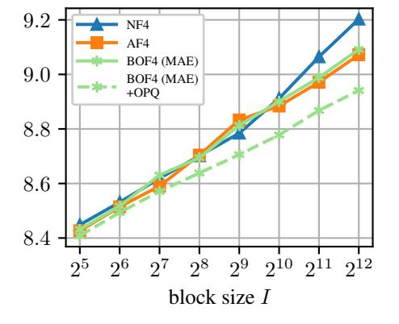
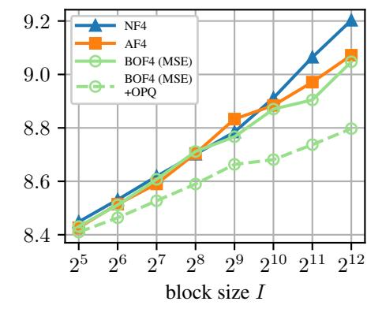

# H Definition of the Normalized Average Accuracy Metric

To determine an overall accuracy score for a model over multiple benchmarks, we employ a normalized average accuracy that accounts for the chance level accuracy achievable by random guessing on each benchmark. For example, some benchmarks use a multiple-choice format with four answer options. In this case, random guessing would yield an accuracy of 25%. To ensure that no benchmark disproportionately influences the average accuracy, we normalize the accuracy of multiple-choice benchmarks such that random guessing is expected to yield 0% and answering all queries correctly yields 100%. The normalized accuracy is calculated as

$$ACC_{norm} = \frac{ACC - ACC_{chance}}{1 - ACC_{chance}},$$
(74)

where ACCchance is the chance-level accuracy. This normalized average accuracy ACCnorm is reported in Tabs. [2](#page-8-0) and [10,](#page-28-1) abbreviated as NAV ACC.

Table 10: Inference results of 4-bit scalar quantization methods evaluated using additional LLMs with block size I = 64. The evaluated metrics are the perplexity on the WikiText-2 and LAMBADA dataset, and the accuracy on the MMLU (few-shot), ARC-Challenge, HellaSwag, PIQA, SIQA, and WinoGrande benchmarks. Best result in each column in bold, second best underlined, BF16 excluded.

| Model     | Quantizer    | WikiText2 PPL ↓ | Lambada PPL ↓ | MMLU ACC ↑ | ARC-C ACC ↑ | HellaSwag ACC ↑ | PIQA ACC ↑ | SIQA ACC ↑ | WinoGrande ACC ↑ | NAV ACC ↑ |
|-----------|--------------|--------------------|------------------|---------------|----------------|--------------------|---------------|---------------|---------------------|--------------|
|           | BF16         | 7.94               | 3.96             | 63.0          | 51.3           | 60.0               | 80.0          | 47.0          | 73.8                | 43.4         |
|           | NF4          | 8.53               | 4.41             | 61.2          | 49.1           | 59.1               | 78.9          | 47.4          | 73.6                | 42.0         |
| Llama-3.2 | AF4          | 8.51               | 4.38             | 61.6          | 49.9           | 59.1               | 79.5          | 47.0          | 73.6                | 42.4         |
| 8B        | BOF4 (MSE)   | 8.47               | 4.25             | 61.7          | 50.4           | 59.3               | 78.9          | 46.4          | 73.1                | 42.0         |
|           | + OPQ        | 8.47               | 4.25             | 61.7          | 50.4           | 59.3               | 78.9          | 46.4          | 73.1                | 42.0         |
|           | BOF4-S (MSE) | 8.47               | 4.29             | 61.7          | 48.5           | 59.5               | 79.2          | 46.2          | 72.8                | 41.6         |
|           | + OPQ        | 8.43               | 4.29             | 61.9          | 49.2           | 59.5               | 79.7          | 46.5          | 72.5                | 41.9         |
|           | BF16         | 9.50               | 4.53             | 71.5          | 48.2           | 60.0               | 78.7          | 54.8          | 72.7                | 45.8         |
|           | NF4          | 9.91               | 4.48             | 70.7          | 46.7           | 59.0               | 78.9          | 54.2          | 71.7                | 44.6         |
| Qwen-2.5  | AF4          | 9.90               | 4.70             | 70.6          | 47.2           | 58.9               | 78.3          | 54.5          | 70.2                | 44.0         |
| 7B        | BOF4 (MSE)   | 9.95               | 4.83             | 70.7          | 48.2           | 59.2               | 78.7          | 54.1          | 71.3                | 44.8         |
|           | + OPQ        | 9.85               | 4.73             | 70.6          | 47.4           | 59.2               | 78.9          | 54.2          | 72.2                | 45.0         |
|           | BOF4-S (MSE) | 9.88               | 4.79             | 70.8          | 48.4           | 59.2               | 78.6          | 54.3          | 70.6                | 44.6         |
|           | + OPQ        | 9.83               | 4.67             | 70.6          | 48.5           | 59.3               | 78.6          | 54.4          | 71.1                | 44.8         |
|           | BF16         | 19.64              | 16.95            | 47.5          | 29.5           | 40.6               | 70.2          | 44.4          | 56.4                | 21.1         |
|           | NF4          | 22.24              | 25.20            | 44.8          | 28.3           | 38.8               | 69.5          | 44.4          | 56.6                | 19.7         |
| Qwen-2.5  | AF4          | 22.14              | 27.17            | 43.5          | 28.5           | 39.0               | 68.9          | 43.3          | 56.8                | 19.1         |
| 0.5B      | BOF4 (MSE)   | 22.22              | 27.28            | 45.1          | 29.9           | 39.1               | 69.5          | 42.9          | 54.5                | 19.1         |
|           | + OPQ        | 21.72              | 24.61            | 45.0          | 29.0           | 39.0               | 69.4          | 43.5          | 55.6                | 19.3         |
|           | BOF4-S (MSE) | 23.02              | 26.64            | 44.2          | 30.4           | 39.1               | 68.0          | 43.7          | 55.6                | 19.1         |
|           | + OPQ        | 21.88              | 22.90            | 44.2          | 29.6           | 38.8               | 68.4          | 43.4          | 56.7                | 19.2         |

Figure 12: Perplexity of Llama-3.1 8B on WikiText-2 after quantization with NF4, AF4, and our BOF4 optimized w.r.t. MAE (left, \*) or MSE (right, ◦) for different block sizes I, without and with outlier-preserving quantization (OPQ, dashed line).