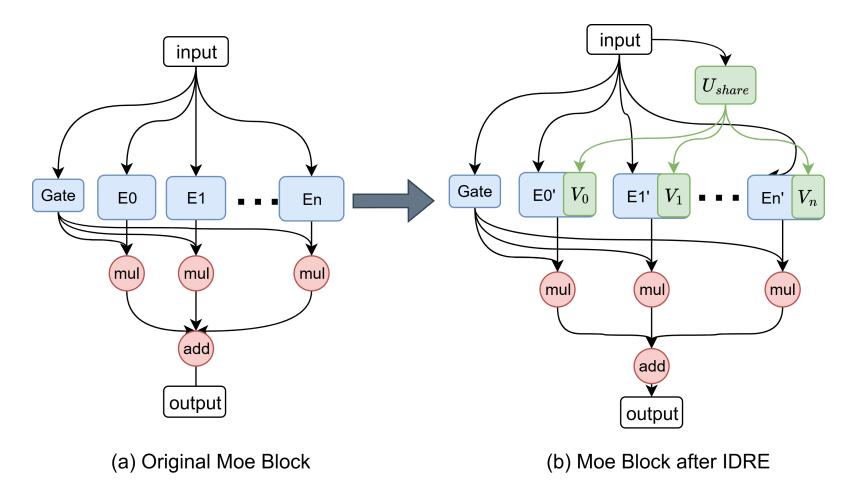

# 2.2 MOE LLMS COMPRESSION METHODS

Research on model compression for MoE architectures is still in its infancy. Most methods directly adopt general model compression techniques, lacking special consideration for the structural characteristics of MoE gating and multi-expert architectures. EAC-MoE [\(Chen et al., 2025\)](#page-9-3) reduces parameters by pruning redundant experts, but pruning causes irreversible loss of functionality. D2- MoE [\(Gu et al., 2025\)](#page-10-5) and SubMoe [\(Li et al., 2025a\)](#page-10-6) decompose expert weights into low-rank factors, yet their compression ratios are limited by rank constraints, failing to meet the demands of extreme resource-constrained scenarios. MoEQuant (Hu et al., 2025a) uses routing statistics to balance the contributions of each expert during calibration, but its performance remains unsatisfactory under quantization of  $\leq 4$  bits.

In summary, existing MoE LLMs compression methods lack a collaborative optimization mechanism that integrates the statistical characteristics of input activations—they neither fully exploit input-related common patterns shared across experts nor specifically correct distribution shifts caused by quantization errors of experts. This makes it difficult for them to balance model accuracy at high compression ratios. The KBVQ-MoE framework proposed in this paper is designed to fill this gap, significantly improving the quantization performance of MoE LLMs through input-driven redundancy elimination and bias-corrected output stabilization.

## 3 PRELIMINARIES

**Mixture-of-Experts.** Mixture-of-Experts (MoE) architectures modify standard Transformer layers by replacing conventional feed-forward (MLP) modules with specialized MoE modules, enabling efficient scaling of model capacity while maintaining computational efficiency(Jacobs et al., 1991; Jordan & Jacobs, 1994). MoE layer typically comprises two types of components: a set of m shared experts ( $\{E_1^s, \ldots, E_m^s\}$ ), a set of n routing experts ( $\{E_1^r, \ldots, E_n^r\}$ ), and a gating network (or router network) that determines which experts process each input token.

Each expert—whether shared or routing—functions as a lightweight feed-forward sub-network (effectively a compact MLP), with shared experts designed to handle general patterns across inputs and routing experts specialized for specific input subsets. When processing an input hidden state  $x \in \mathbb{R}^d$ , the MoE layer operates through a structured sequence:

- 1. Gating Score Calculation: The gating network computes weights (or affinities)  $g_i(x)$  for all experts, quantifying how well each expert aligns with the input x. These weights reflect the probability of routing x to the corresponding expert.
- 2. Expert Selection: For routing experts, only the top k experts with the highest affinities are selected, denoted by the subset  $\mathcal{K} = \operatorname{top} k\left(\{g_j(\boldsymbol{x}) \mid j \in \{1,\dots,n\}\}\right)$ . In contrast, all shared experts are typically utilized to preserve general representational capacity.
- 3. Weighted Output Computation: The final output y of the MoE layer is a weighted sum of outputs from the selected experts, where the weights are the corresponding gating scores. Mathematically, this is formalized as:

$$\mathbf{y} = \underbrace{\sum_{i=1}^{m} E_i^s(\mathbf{x}) g_i(\mathbf{x})}_{\text{shared experts}} + \underbrace{\sum_{j \in \mathcal{K}} E_j^r(\mathbf{x}) g_j(\mathbf{x})}_{\text{top } k \text{ routing experts}},$$
(1)

While this formulation captures the core mechanism, specific designs vary across architectures—for example, in how gating scores are computed, how experts are structured (e.g., depth, activation functions), or how the balance between shared and routing experts is tuned.

## 4 Method

This section introduces the proposed KLT-guided SVD with Bias-Corrected Vector Quantization for MoE Large Language Models (KBVQ-MoE). The framework is built on two innovations that align with the challenges identified in Section 1: (1) **Input-driven Redundancy Elimination (IDRE)**, where the Karhunen–Loève Transform (KLT) maps expert weights into a unified representation aligned with input statistics, and singular value decomposition (SVD) is then applied to extract dominant shared components retained at full precision, leaving expert-specific (i.e., non-redundant) representations that are more amenable to quantization; (2) **Bias-Corrected Output Stabilization (BCOS)**, where vector quantization is applied only to the expert-specific representations, and lightweight linear scaling with bias correction is used to stabilize outputs and mitigate distributional

shifts. The overall workflow of KBVQ-MoE is mathematically formulated in Eq.2, while a detailed algorithmic flow is provided in Appendix 1.

$$W \xrightarrow{\text{IDRE}} W_{\text{Share}} + W_{\text{quant}} \xrightarrow{\text{BCOS}} W_{\text{share}} + W_{\text{quant}} \xrightarrow{\text{Bias Correction}} W_{\text{share}} + W_{\text{quant}} + (s, b) \xrightarrow{\text{scale\&bias.}} (2)$$

#### 4.1 INPUT-DRIVEN REDUNDANCY ELIMINATION(IDRE)

In MoE architectures, experts often exhibit substantial redundancy, as their weights encode overlapping mappings for identical activations. This redundancy wastes quantization capacity and prevents the limited codebook from focusing on expert-specific representations. To address this issue, we introduce **Input-driven Redundancy Elimination (IDRE)**, which leverages the statistical characteristics of model inputs to construct a unified representation of expert weights. By isolating shared components and retaining them at full precision, IDRE reduces redundancy and improves the efficiency of codebook utilization for subsequent quantization. IDRE is applied uniformly to the MLP weights of all experts in each MoE layer—including both shared and routing experts. The detailed transformation of the MoE structure before and after applying IDRE is illustrated in Fig. 4. This procedure consists of the following steps:

Figure 4: The comparison of structural changes in the MoE (Mixture-of-Experts) structure before and after IDRE.

Step 1: KLT Decomposition of Input Activations: Constructing the Input Coherence Space. To reduce redundancy, we begin by applying the Karhunen–Loève Transform (KLT) to the input activations in order to construct a coherence basis that captures their dominant directions. Let the input activation matrix of the expert layer be  $X \in \mathbb{R}^{b \times ic}$ , where b denotes the number of samples and b is the input dimension. The procedure is as follows:

- 1. The covariance matrix is computed as  $C_X = \frac{1}{B-1} X^T X \in \mathbb{R}^{ic \times ic}$ .
- 2. An eigenvalue decomposition is performed on  $C_X:C_X=\left(U_{\text{KLT}}\Lambda_{\text{KLT}}^{\frac{1}{2}}\right)^T\left(U_{\text{KLT}}\Lambda_{\text{KLT}}^{\frac{1}{2}}\right)$ . where  $U_{\text{KLT}}=[u_1,\ldots,u_{ic}]$  is an orthonormal basis, and  $\Lambda_{\text{KLT}}=\operatorname{diag}(\lambda_1\geq \cdots \geq \lambda_{ic})$  is a diagonal matrix of eigenvalues. Here,  $u_j$  represents the j-th coherence direction of the input, and  $\lambda_j$  denotes the energy magnitude of this direction.
- 3. Based on this, we construct the input coherence basis:  $U_X = U_{\text{KLT}} \Lambda_{\text{KLT}}^{1/2}$  The column vectors of the resulting  $U_X$  are sorted by input energy magnitude, forming an orthogonal coordinate system based on input statistics. This facilitates prioritizing the extraction of common weight structures related to high-energy input directions in subsequent steps.

A detailed theoretical derivation linking this decomposition to the minimization of quantization error is provided in Appendix A.2.

Step 2: Mapping Weights to the Input Coherence Space. To ensure that weight analysis is guided by the dominant directions of the input, we project the original weight matrix  $W \in \mathbb{R}^{oc \times ic}$  onto the input coherence basis obtained in Step 1:  $\hat{W} = WU_X \in \mathbb{R}^{oc \times ic}$ , where oc denotes the output channel dimension and ic denotes the input channel dimension. In this transformed representation, each column of  $\hat{W}$  corresponds to the mapping of a specific coherence direction of the input to the output space. The j-th column, in particular, represents how the weights project along the j-th most energetic input direction  $u_j$ . This alignment establishes a direct connection between weight structures and input characteristics, which facilitates the subsequent extraction of shared and expert-specific components.

Step 3: Extracting Input-Coherent Common Structures: Precise Redundancy Elimination. The common structures of MoE experts manifest as cross-expert shared weight patterns in the input coherence space (e.g., similar mappings for the high-energy direction  $u_1$ ). To capture these patterns, we concateniate the mapped weights of all n experts( $\hat{W}^{(i)}$  denotes the i-th expert)—along their output channel dimension—into a  $(n \cdot oc) \times ic$ -dimensional unified representation:

$$\bar{W} = \begin{bmatrix} \hat{W}^{(1)} \\ \hat{W}^{(2)} \\ \vdots \\ \hat{W}^{(n)} \end{bmatrix} = \begin{bmatrix} W^{(1)}U_{\mathbf{X}} \\ W^{(2)}U_{\mathbf{X}} \\ \vdots \\ W^{(n)}U_{\mathbf{X}} \end{bmatrix} \in \mathbb{R}^{(n \cdot oc) \times ic}$$

$$(3)$$

We then apply SVD to  $\bar{W}$  in order to extract the dominant shared representation:  $\bar{W} = \left(U\Sigma V^T\right)^T$  .

- 1.  $U \in \mathbb{R}^{ic \times k}$  denotes the shared left singular vectors (shared mapping directions across experts, where k is the number of retained dominant singular values, focusing on input-coherent common patterns);  $\Sigma = \operatorname{diag}(\sigma_1, \ldots, \sigma_k)$  is the singular value matrix (the larger  $\sigma_i$  is, the more prominent the corresponding dominant shared representation).
- 2. The common structures in the input coherence space are mapped back to the original weight space via the inverse transformation of the input coherence basis  $(U_X^{-1})$ :

$$U_{\text{share}} = U^T \cdot U_{\mathbf{X}}^{-1} \in \mathbb{R}^{k \times ic}. \tag{4}$$

 $V \in \mathbb{R}^{(n \cdot oc) \times k}$  represents the right singular vectors, which are partitioned by expert into:

$$V = \left[\Sigma_k V^{(1)^T}, \Sigma_k V^{(2)^T}, \dots, \Sigma_k V^{(n)^T}\right]^T,$$
 (5)

where  $V^{(i)} \in \mathbb{R}^{oc \times k}$  is the private right singular vector for expert i.

3. The truncated low-rank components  $U_{\text{share}}$  and V obtained from SVD are retained in full precision to preserve the fidelity of shared and expert-specific representations.

Thus, IDRE explicitly decouples shared structures (kept at full precision) from expert-specific representations (subject to quantization), enabling more efficient use of codebook capacity. A rigorous spectral characterization of this decomposition, including its optimality and error bounds, is provided in Appendix A.3.

