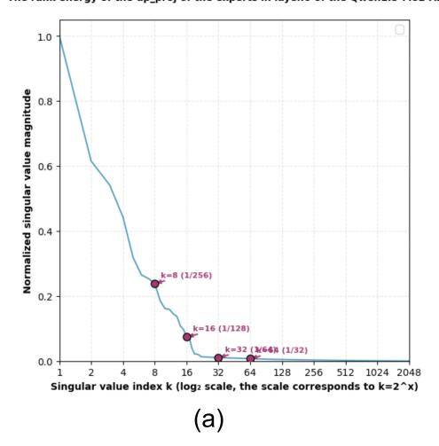

# REFERENCES

- Tongyi Qianwen Team Alibaba Cloud. Qwen3-next: Next-generation foundation model architecture. <https://modelscope.cn/models/Qwen/Qwen3-Next-80B-A3B-Instruct>, 2025.
- Aida Amini, Saadia Gabriel, Shanchuan Lin, Rik Koncel-Kedziorski, Yejin Choi, and Hannaneh Hajishirzi. Mathqa: Towards interpretable math word problem solving with operation-based formalisms. In *Proceedings of the 2019 conference of the North American chapter of the association for computational linguistics: Human language technologies, volume 1 (long and short papers)*, pp. 2357–2367, 2019.
- Saleh Ashkboos, Amirkeivan Mohtashami, Maximilian L Croci, Bo Li, Pashmina Cameron, Martin Jaggi, Dan Alistarh, Torsten Hoefler, and James Hensman. Quarot: Outlier-free 4-bit inference in rotated llms. *Advances in Neural Information Processing Systems*, 37:100213–100240, 2024.
- Yonatan Bisk, Rowan Zellers, Jianfeng Gao, and Yejin Choi. Piqa: Reasoning about physical commonsense in natural language. In *Proceedings of the AAAI Conference on Artificial Intelligence*, volume 34, pp. 7432–7439, 2020.
- Michael Boratko, Harshit Padigela, Divyendra Mikkilineni, Pritish Yuvraj, Rajarshi Das, Andrew McCallum, Maria Chang, Achille Fokoue-Nkoutche, Pavan Kapanipathi, Nicholas Mattei, et al. A systematic classification of knowledge, reasoning, and context within the arc dataset. *arXiv preprint arXiv:1806.00358*, 2018.
- Mark Chen, Jerry Tworek, Heewoo Jun, Qiming Yuan, Henrique Ponde de Oliveira Pinto, Jared Kaplan, Harri Edwards, Yuri Burda, Nicholas Joseph, Greg Brockman, Alex Ray, Raul Puri, Gretchen Krueger, Michael Petrov, Heidy Khlaaf, Girish Sastry, Pamela Mishkin, Brooke Chan, Scott Gray, Nick Ryder, Mikhail Pavlov, Alethea Power, Lukasz Kaiser, Mohammad Bavarian, Clemens Winter, Philippe Tillet, Felipe Petroski Such, Dave Cummings, Matthias Plappert, Fotios Chantzis, Elizabeth Barnes, Ariel Herbert-Voss, William H. Guss, Andrew N. Nichol, Alex Paino, Nikolas Tezak, Jie Tang, Igor Babuschkin, Sandeep Balaji, Sharan Jain, William Saunders, Christopher Hesse, and John Schulman. Evaluating large language models trained on code, 2021.
- Yuanteng Chen, Yuantian Shao, Peisong Wang, and Jian Cheng. Eac-moe: Expert-selection aware compressor for mixture-of-experts large language models. *arXiv preprint arXiv:2508.01625*, 2025.
- Peter Clark, Isaac Cowhey, Oren Etzioni, Tushar Khot, Ashish Sabharwal, Carissa Schoenick, and Oyvind Tafjord. Think you have solved question answering? try arc, the ai2 reasoning challenge. *arXiv preprint arXiv:1803.05457*, 2018.
- Karl Cobbe, Vineet Kosaraju, Mohammad Bavarian, Jacob Hilton, Reiichiro Nakano, Christopher Hesse, and John Schulman. Training verifiers to solve math word problems, 2021.
- DeepSeek-AI, Aixin Liu, Bei Feng, Bin Wang, Bingxuan Wang, Bo Liu, Chenggang Zhao, Chengqi Deng, Chong Ruan, Damai Dai, Daya Guo, Dejian Yang, Deli Chen, Dongjie Ji, Erhang Li, Fangyun Lin, Fuli Luo, Guangbo Hao, Guanting Chen, Guowei Li, H. Zhang, Hanwei Xu, Hao Yang, Haowei Zhang, Honghui Ding, Huajian Xin, Huazuo Gao, Hui Li, Hui Qu, J. L. Cai, Jian Liang, Jianzhong Guo, Jiaqi Ni, Jiashi Li, Jin Chen, Jingyang Yuan, Junjie Qiu, Junxiao Song, Kai Dong, Kaige Gao, Kang Guan, Lean Wang, Lecong Zhang, Lei Xu, Leyi Xia, Liang Zhao, Liyue Zhang, Meng Li, Miaojun Wang, Mingchuan Zhang, Minghua Zhang, Minghui Tang, Mingming Li, Ning Tian, Panpan Huang, Peiyi Wang, Peng Zhang, Qihao Zhu, Qinyu Chen, Qiushi Du, R. J. Chen, R. L. Jin, Ruiqi Ge, Ruizhe Pan, Runxin Xu, Ruyi Chen, S. S. Li, Shanghao Lu, Shangyan Zhou, Shanhuang Chen, Shaoqing Wu, Shengfeng Ye, Shirong Ma, Shiyu Wang, Shuang Zhou, Shuiping Yu, Shunfeng Zhou, Size Zheng, T. Wang, Tian Pei, Tian Yuan, Tianyu Sun, W. L. Xiao, Wangding Zeng, Wei An, Wen Liu, Wenfeng Liang, Wenjun Gao, Wentao Zhang, X. Q. Li, Xiangyue Jin, Xianzu Wang, Xiao Bi, Xiaodong Liu, Xiaohan Wang, Xiaojin Shen, Xiaokang Chen, Xiaosha Chen, Xiaotao Nie, Xiaowen Sun, Xiaoxiang Wang, Xin Liu, Xin Xie, Xingkai Yu, Xinnan Song, Xinyi Zhou, Xinyu Yang, Xuan Lu, Xuecheng Su, Y. Wu, Y. K. Li, Y. X. Wei, Y. X. Zhu, Yanhong Xu, Yanping Huang, Yao Li, Yao Zhao, Yaofeng Sun, Yaohui Li, Yaohui Wang, Yi Zheng, Yichao Zhang, Yiliang Xiong, Yilong Zhao, Ying He, Ying Tang, Yishi Piao, Yixin Dong, Yixuan Tan, Yiyuan Liu, Yongji Wang, Yongqiang Guo, Yuchen Zhu, Yuduan Wang,

- Yuheng Zou, Yukun Zha, Yunxian Ma, Yuting Yan, Yuxiang You, Yuxuan Liu, Z. Z. Ren, Zehui Ren, Zhangli Sha, Zhe Fu, Zhen Huang, Zhen Zhang, Zhenda Xie, Zhewen Hao, Zhihong Shao, Zhiniu Wen, Zhipeng Xu, Zhongyu Zhang, Zhuoshu Li, Zihan Wang, Zihui Gu, Zilin Li, and Ziwei Xie. Deepseek-v2: A strong, economical, and efficient mixture-of-experts language model. *CoRR*, abs/2405.04434, 2024. URL <https://arxiv.org/abs/2405.04434>.
- Zhenbang Du, Jiayu An, Yunlu Tu, Jiahao Hong, and Dongrui Wu. Mixture-of-experts for open set domain adaptation: A dual-space detection approach. *IEEE Transactions on Artificial Intelligence*, 2025.
- Vage Egiazarian, Andrei Panferov, Denis Kuznedelev, Elias Frantar, Artem Babenko, and Dan Alistarh. Extreme compression of large language models via additive quantization. *arXiv preprint arXiv:2401.06118*, 2024.
- Elias Frantar, Saleh Ashkboos, Torsten Hoefler, and Dan Alistarh. Gptq: Accurate post-training quantization for generative pre-trained transformers. *arXiv preprint arXiv:2210.17323*, 2022.
- Leo Gao, Jonathan Tow, Stella Biderman, Sid Black, Anthony DiPofi, Charles Foster, Laurence Golding, Jeffrey Hsu, Kyle McDonell, and Niklas Muennighoff. A framework for few-shot language model evaluation. Technical report, GitHub, September 2021.
- Allen Gersho. Asymptotically optimal block quantization. *IEEE Transactions on information theory*, 25(4):373–380, 1979.
- Hao Gu, Wei Li, Lujun Li, Qiyuan Zhu, Mark Lee, Shengjie Sun, Wei Xue, and Yike Guo. Delta decompression for moe-based llms compression. *arXiv preprint arXiv:2502.17298*, 2025.
- Xing Hu, Yuan Cheng, Dawei Yang, Zhihang Yuan, Jiangyong Yu, Chen Xu, and Sifan Zhou. I-llm: Efficient integer-only inference for fully-quantized low-bit large language models. *arXiv preprint arXiv:2405.17849*, 2024.
- Xing Hu, Zhixuan Chen, Dawei Yang, Zukang Xu, Chen Xu, Zhihang Yuan, Sifan Zhou, and Jiangyong Yu. Moequant: Enhancing quantization for mixture-of-experts large language models via expert-balanced sampling and affinity guidance. *arXiv preprint arXiv:2505.03804*, 2025a.
- Xing Hu, Yuan Cheng, Dawei Yang, Zukang Xu, Zhihang Yuan, Jiangyong Yu, Chen Xu, Zhe Jiang, and Sifan Zhou. Ostquant: Refining large language model quantization with orthogonal and scaling transformations for better distribution fitting. *arXiv preprint arXiv:2501.13987*, 2025b.
- Robert A. Jacobs, Michael I. Jordan, Steven J. Nowlan, and Geoffrey E. Hinton. Adaptive mixtures of local experts. *Neural Computation*, 3(1):79–87, 1991. doi: 10.1162/neco.1991.3.1.79.
- Albert Q. Jiang, Alexandre Sablayrolles, Antoine Roux, Arthur Mensch, Blanche Savary, Chris Bamford, Devendra Singh Chaplot, Diego de las Casas, Emma Bou Hanna, Florian Bressand, Gianna Lengyel, Guillaume Bour, Guillaume Lample, Lélio Renard Lavaud, Lucile Saulnier, Marie-Anne Lachaux, Pierre Stock, Sandeep Subramanian, Sophia Yang, Szymon Antoniak, Teven Le Scao, Théophile Gervet, Thibaut Lavril, Thomas Wang, Timothée Lacroix, and William El Sayed. Mixtral of experts. *CoRR*, abs/2401.04088, 2024. URL [https://arxiv.org/abs/2401.](https://arxiv.org/abs/2401.04088) [04088](https://arxiv.org/abs/2401.04088).
- Michael I. Jordan and Robert A. Jacobs. Hierarchical mixtures of experts and the em algorithm. *Neural Computation*, 6(2):181–214, 1994. doi: 10.1162/neco.1994.6.2.181.
- Kimi Team. Kimi-vl technical report. *CoRR*, abs/2504.07491, 2025. URL [https://arxiv.](https://arxiv.org/abs/2504.07491) [org/abs/2504.07491](https://arxiv.org/abs/2504.07491).
- Lujun Li, Zhu Qiyuan, Jiacheng Wang, Wei Li, Hao Gu, Sirui Han, and Yike Guo. Sub-moe: Efficient mixture-of-expert llms compression via subspace expert merging. *arXiv preprint arXiv:2506.23266*, 2025a.
- Yuhang Li, Ruokai Yin, Donghyun Lee, Shiting Xiao, and Priyadarshini Panda. Gptaq: Efficient finetuning-free quantization for asymmetric calibration. *arXiv preprint arXiv:2504.02692*, 2025b.

- Yifei Liu, Jicheng Wen, Yang Wang, Shengyu Ye, Li Lyna Zhang, Ting Cao, Cheng Li, and Mao Yang. Vptq: Extreme low-bit vector post-training quantization for large language models. *arXiv preprint arXiv:2409.17066*, 2024.
- Stephen Merity, Caiming Xiong, James Bradbury, and Richard Socher. Pointer sentinel mixture models. *arXiv preprint arXiv:1609.07843*, 2016.
- Nabil Omi, Siddhartha Sen, and Ali Farhadi. Load balancing mixture of experts with similarity preserving routers. *arXiv preprint arXiv:2506.14038*, 2025.
- OpenAI. Gpt-4 technical report. *CoRR*, abs/2303.08774, 2023. doi: 10.48550/arXiv.2303.08774. URL <https://doi.org/10.48550/arXiv.2303.08774>.
- Denis Paperno, Germán Kruszewski, Angeliki Lazaridou, Quan Ngoc Pham, Raffaella Bernardi, Sandro Pezzelle, Marco Baroni, Gemma Boleda, and Raquel Fernández. The lambada dataset: Word prediction requiring a broad discourse context, 2016. URL [https://arxiv.org/abs/](https://arxiv.org/abs/1606.06031) [1606.06031](https://arxiv.org/abs/1606.06031).
- Qwen Team. Qwen1.5-moe: Matching 7b model performance with 1/3 activated parameters. [https:](https://qwenlm.github.io/blog/qwen-moe/) [//qwenlm.github.io/blog/qwen-moe/](https://qwenlm.github.io/blog/qwen-moe/), 2024.
- Keisuke Sakaguchi, Ronan Le Bras, Chandra Bhagavatula, and Yejin Choi. Winogrande: An adversarial winograd schema challenge at scale. *Communications of the ACM*, 64(9):99–106, 2021.
- Eustache Sankar and Vasily Dimitri. Mixture of experts models in deep learning and their techniques applications and challenges. *Authorea Preprints*, 2025.
- Yuxuan Sun, Ruikang Liu, Haoli Bai, Han Bao, Kang Zhao, Yuening Li, Jiaxin Hu, Xianzhi Yu, Lu Hou, Chun Yuan, et al. Flatquant: Flatness matters for llm quantization. *arXiv preprint arXiv:2410.09426*, 2024.
- Together Computer. Redpajama-data-1t: An open dataset for training large language models. [https:](https://huggingface.co/datasets/togethercomputer/RedPajama-Data-1T) [//huggingface.co/datasets/togethercomputer/RedPajama-Data-1T](https://huggingface.co/datasets/togethercomputer/RedPajama-Data-1T), 2023. Available on Hugging Face Datasets.
- Albert Tseng, Jerry Chee, Qingyao Sun, Volodymyr Kuleshov, and Christopher De Sa. Quip#: Even better llm quantization with hadamard incoherence and lattice codebooks. *arXiv preprint arXiv:2402.04396*, 2024a.
- Albert Tseng, Qingyao Sun, David Hou, and Christopher M De Sa. Qtip: Quantization with trellises and incoherence processing. *Advances in Neural Information Processing Systems*, 37:59597–59620, 2024b.
- Mart Van Baalen, Andrey Kuzmin, Ivan Koryakovskiy, Markus Nagel, Peter Couperus, Cedric Bastoul, Eric Mahurin, Tijmen Blankevoort, and Paul Whatmough. Gptvq: The blessing of dimensionality for llm quantization. *arXiv preprint arXiv:2402.15319*, 2024.
- Yubo Wang, Xueguang Ma, Ge Zhang, Yuansheng Ni, Abhranil Chandra, Shiguang Guo, Weiming Ren, Aaran Arulraj, Xuan He, Ziyan Jiang, et al. Mmlu-pro: A more robust and challenging multitask language understanding benchmark. *Advances in Neural Information Processing Systems*, 37: 95266–95290, 2024.
- Zukang Xu, Yuxuan Yue, Xing Hu, Zhihang Yuan, Zixu Jiang, Zhixuan Chen, Jiangyong Yu, Chen Xu, Sifan Zhou, and Dawei Yang. Mambaquant: Quantizing the mamba family with variance aligned rotation methods. *arXiv preprint arXiv:2501.13484*, 2025.
- An Yang, Anfeng Li, Baosong Yang, Beichen Zhang, Binyuan Hui, Bo Zheng, Bowen Yu, Chang Gao, Chengen Huang, Chenxu Lv, Chujie Zheng, Dayiheng Liu, Fan Zhou, Fei Huang, Feng Hu, Hao Ge, Haoran Wei, Huan Lin, Jialong Tang, Jian Yang, Jianhong Tu, Jianwei Zhang, Jianxin Yang, Jiaxi Yang, Jing Zhou, Jingren Zhou, Junyang Lin, Kai Dang, Keqin Bao, Kexin Yang, Le Yu, Lianghao Deng, Mei Li, Mingfeng Xue, Mingze Li, Pei Zhang, Peng Wang, Qin Zhu, Rui Men, Ruize Gao, Shixuan Liu, Shuang Luo, Tianhao Li, Tianyi Tang, Wenbiao Yin,

- Xingzhang Ren, Xinyu Wang, Xinyu Zhang, Xuancheng Ren, Yang Fan, Yang Su, Yichang Zhang, Yinger Zhang, Yu Wan, Yuqiong Liu, Zekun Wang, Zeyu Cui, Zhenru Zhang, Zhipeng Zhou, Zihan Qiu, et al. Qwen3 technical report. *CoRR*, abs/2505.09388, 2025. URL [https:](https://arxiv.org/abs/2505.09388) [//arxiv.org/abs/2505.09388](https://arxiv.org/abs/2505.09388).
- Yuxuan Yue, Zukang Xu, Zhihang Yuan, Dawei Yang, Jianlong Wu, and Liqiang Nie. Pcdvq: Enhancing vector quantization for large language models via polar coordinate decoupling. *arXiv preprint arXiv:2506.05432*, 2025.
- Rowan Zellers, Ari Holtzman, Yonatan Bisk, Ali Farhadi, and Yejin Choi. Hellaswag: Can a machine really finish your sentence? *arXiv preprint arXiv:1905.07830*, 2019.
- Zhixiong Zhao, Fangxin Liu, Junjie Wang, Chenyang Guan, Zongwu Wang, Li Jiang, and Haibing Guan. Specquant: Spectral decomposition and adaptive truncation for ultra-low-bit llms quantization. *arXiv preprint arXiv:2511.11663*, 2025.

#### A APPENDIX

#### A.1 USE OF LLMS

Large language model (LLM) tools were employed solely for text polishing, including refinement of sentence structure, lexical optimization, and enhancement of language fluency.

All core components of this research—such as the conception of research ideas and framework, algorithm design and implementation, experimental protocol design, data collection and processing, execution and analysis of experiments, and validation of conclusions—were independently completed by the research team.

LLM tools were not involved in the conception of research content, generation of technical solutions, execution of experiments, or derivation of conclusions. The authors affirm full responsibility for the scientific validity, authenticity, and originality of the work in accordance with academic integrity standards.

## A.2 THEORETICAL PROOF OF THE INPUT COHERENCE BASIS

Let the linear mapping of the i-th expert be  $y^{(i)} = W^{(i)}x$ , with its quantized version denoted as  $\tilde{W}^{(i)}$  and the error matrix defined as  $E^{(i)} \triangleq \tilde{W}^{(i)} - W^{(i)}$ . For the input covariance  $C_X = \mathbb{E}[xx^T]$  that reflects the true distribution during inference, a natural definition of task distortion is the output mean squared error (MSE):

$$\mathcal{L} \triangleq \sum_{i=1}^{n} \mathbb{E}\left[\left\|\tilde{W}^{(i)}x - W^{(i)}x\right\|_{2}^{2}\right] = \sum_{i=1}^{n} \operatorname{Tr}\left(E^{(i)}C_{X}E^{(i)T}\right). \tag{9}$$

This metric directly measures the impact of quantization on the output side, rather than the unweighted difference of the weights themselves. Perform the Karhunen–Loève Transform (KLT) on  $C_X$ , such that  $C_X = U_{\text{KLT}} \Lambda_{\text{KLT}} U_{\text{KLT}}^T$ , where  $\Lambda_{\text{KLT}} = \text{diag}(\lambda_1 \ge \cdots \ge \lambda_{ic})$ . Define the input coherence basis as  $U_X \triangleq U_{\text{KLT}} \Lambda_{\text{KLT}}^{1/2}$ . Then the following identity holds:

$$\operatorname{Tr}(EC_X E^T) = \operatorname{Tr}(EU_X(U_X)^T E^T) = ||EU_X||_F^2,$$
 (10)

thus

$$\mathcal{L} = \sum_{i=1}^{n} \left\| (\tilde{W}^{(i)} - W^{(i)}) U_X \right\|_F^2.$$
 (11)

This indicates that: in the input coherence space, the output MSE is equivalent to the Frobenius norm of the weight error. Therefore, all "extraction/quantization" operations aimed at reducing output distortion should be performed in this space. Denote  $\hat{W}^{(i)} \triangleq W^{(i)}U_X$ .

#### A.3 SPECTRAL CHARACTERIZATION OF THE OPTIMAL SHARED SUBSPACE (KLT-SVD).

To formalize the redundancy removal performed by IDRE, we stack all expert weights along the output dimension:

$$W \triangleq \begin{bmatrix} \hat{W}^{(1)} \\ \vdots \\ \hat{W}^{(n)} \end{bmatrix} \in \mathbb{R}^{(no_c) \times i_c}, \qquad S \triangleq W^{\top}W.$$
 (12)

Here  $\hat{W}^{(i)}$  denotes the i-th expert weight expressed in the input KLT coordinates introduced in Appendix. A.2. The matrix S is the (input-aligned) Gram matrix of all experts. In practice, IDRE computes a truncated SVD of the stacked matrix  $W \in \mathbb{R}^{(n \cdot o_c) \times i_c}$ :  $W = U \Sigma V^{\top}$ . Note that the Gram matrix  $S = W^{\top}W$  admits the eigen-decomposition  $S = V \Sigma^2 V^{\top}$ , i.e., the eigenvalues of S are the squared singular values of S, and the eigenvectors of S coincide with the right singular vectors of S. Therefore, selecting the top-S eigenvectors of S is exactly equivalent to performing a rank-S truncated SVD on S0 and keeping the top-S1 right singular vectors. The parameter S1 used in our analysis and implementation is the dimension of this shared right-singular subspace.

**Optimal shared subspace.** We seek a k-dimensional shared subspace that maximizes the stacked energy of all experts:

$$\max_{U \in \mathbb{R}^{i_c \times k}, \ U^\top U = I} \text{Tr}(U^\top S U) = \max_{U^\top U = I} \|WU\|_F^2. \tag{13}$$

By Ky Fan's theorem, the optimizer  $U_k$  is given by the top-k eigenvectors of S associated with its largest eigenvalues  $\{\sigma_j^2\}_{j=1}^k$ . Let  $P_k \triangleq U_k U_k^{\top}$  be the projector onto this shared subspace. In the KLT space, each expert admits the orthogonal decomposition

$$\check{W}^{(i)} = \underbrace{\check{W}^{(i)} P_k}_{\text{shared (redundancy)}} + \underbrace{\check{W}^{(i)} (I - P_k)}_{\text{specific (difference)}},$$
(14)

and mapping back to the original coordinates yields  $W_{\rm share}^{(i)} = \hat{W}^{(i)} P_k T^{-1}$  and  $W_{\rm spec}^{(i)} = W^{(i)} - W_{\rm share}^{(i)}$  where T is the KLT transform defined in Sec. A.2. Intuitively, the shared component captures directions that are simultaneously important for many experts, while the specific component collects expert—unique variations.

Why KLT before SVD. Let x be the input to the MoE layer with covariance  $\Sigma_X = \mathbb{E}[xx^{\top}] = U_X \Lambda_X U_X^{\top}$  and define the input KLT transform by  $T = U_X \Lambda_X^{1/2}$ . In this basis, the stacked Gram matrix takes the form

$$S = W^{\top}W = T^{\top} \left(\sum_{i=1}^{n} W^{(i)\top} W^{(i)}\right) T = \Lambda_X^{1/2} U_X^{\top} \left(\sum_{i=1}^{n} W^{(i)\top} W^{(i)}\right) U_X \Lambda_X^{1/2}.$$
(15)

Thus the spectrum  $\{\sigma_j^2\}$  of S jointly reflects both the input energy (through  $\Lambda_X$ ) and the across–expert weight energy (through  $\sum_i W^{(i)\top}W^{(i)}$ ) along each input principal direction. Selecting the top–k eigenvectors of S therefore retains those directions that are simultaneously dominant in the input distribution and heavily utilized across experts, which is precisely the notion of "shared" structure we aim to preserve in full precision.

**Truncation error and redundancy removal.** The residual (expert–specific) part after projecting onto  $P_k$  satisfies

$$\sum_{i=1}^{n} \|\check{W}^{(i)}(I - P_k)\|_F^2 = \|W(I - P_k)\|_F^2 = \sum_{j>k} \sigma_j^2, \tag{16}$$

where  $\{\sigma_j^2\}_{j=1}^{i_c}$  are the eigenvalues of S sorted in decreasing order. Hence the truncation error is exactly controlled by the tail eigenvalues discarded by  $P_k$ . Correspondingly, the redundancy removal ratio of IDRE at rank k can be quantified as

$$\rho_k \triangleq \frac{\sum_{j=1}^k \sigma_j^2}{\sum_{j=1}^{i_c} \sigma_j^2},\tag{17}$$

which measures the fraction of stacked expert energy captured by the shared subspace.

This characterization provides an explicit trade-off: increasing k monotonically raises  $\rho_k$  and reduces the truncation error in equation 16, but also enlarges the full-precision shared component. Empirically, for MoE LLMs such as Qwen1.5-MoE-A2.7B and Qwen3-30B-A3B, we observe that the spectrum of S is strongly low-rank and decays rapidly (approximately heavy-tailed). As shown in the Fig.5, it demonstrates the obvious low-rank characteristics of the expert groups and their posterior singularity. Under a simple power-law approximation  $\sigma_j^2 \propto j^{-\alpha}$  with  $\alpha>1$ , the residual fraction  $1-\rho_k$  behaves like  $Ck^{1-\alpha}$ ; once k exceeds a moderate threshold, the marginal gain from further increasing k quickly diminishes. Across layers and models, choosing  $k\approx i_c/128$  typically yields  $\rho_k\approx 0.6$ -0.8, while larger ranks (e.g.,  $k=i_c/64$ ) provide only marginal perplexity improvements at noticeably higher storage cost. Tab.7 shows a comparison of k selection for two moe models of Qwen, and the low rank of 1/128 can already achieve very good results. This explains why  $k=i_c/128$  serves as a robust operating point that balances reconstruction error (controlled by the tail eigenvalues) and the overhead of the shared full-precision subspace across different models and tasks.

Figure 5: The low-rank characteristics after expert fusion activation of the first block, (a) Qwen1.5- MoE-A2.7B, (b) Qwen3-30B-A3B

Table 7: Low-rank value ablation

| k                 | 1/256 | 1/128 | 1/64  | 1/48  | 1/32  |
|-------------------|-------|-------|-------|-------|-------|
| Compress Ratio    | 2.05  | 2.08  | 2.11  | 2.15  | 2.2   |
| Qwen1.5-MoE-A2.7B | 20.71 | 9.61  | 9.60  | 9.58  | 9.58  |
| Qwen3-30B-A3B     | 15.30 | 11.87 | 11.30 | 11.30 | 11.01 |

## A.4 SYSTEM BIAS CORRECTION

In the paper, we reformulate bias correction as a residual affine transform on the quantized output:

$$y_{\text{corr}} = W_{\text{VQ}}x + s \odot (W_{\text{VQ}}x) + b = (1+s) \odot (W_{\text{VQ}}x) + b,$$
 (18)

where s, b ∈ R oc denote channel-wise residual scaling and bias, respectively. We now show that this correction is statistically optimal under the mean squared error (MSE) criterion.

1. Problem Setup Let the full-precision output be y = W x and the quantized output be yˆ = WVQx. Our goal is to determine s and b such that

$$y_{\text{corr}} = (1+s) \odot \hat{y} + b$$

approximates y as closely as possible. The optimization problem can be written as

$$(s^*, b^*) = \arg\min_{s, b} \mathbb{E}[\|y - ((1+s) \odot \hat{y} + b)\|^2].$$
 (19)

2. Closed-form Solution For the j-th output channel, this reduces to:

$$(s_j^*, b_j^*) = \arg\min_{s_j, b_j} \mathbb{E}[(y_j - ((1+s_j)\hat{y}_j + b_j))^2].$$
 (20)

This is equivalent to a univariate linear regression with slope αj = 1 + sj and intercept bj . Its closed-form solution is

$$\alpha_j^* = \frac{\text{Cov}(y_j, \hat{y}_j)}{\text{Var}(\hat{y}_j)}, \qquad b_j^* = \mu_{y_j} - \alpha_j^* \mu_{\hat{y}_j},$$
 (21)

and therefore

$$s_j^* = \alpha_j^* - 1. (22)$$

**3. Approximation under High Correlation** Because  $y_j$  and  $\hat{y}_j$  differ only by quantization noise, they are highly correlated. Thus, we approximate

$$Cov(y_j, \hat{y}_j) \approx \sigma_{y_j} \, \sigma_{\hat{y}_j}. \tag{23}$$

Substituting into the regression solution gives

$$s_j^* \approx \frac{\sigma_{y_j}}{\sigma_{\hat{y}_j}} - 1, \qquad b_j^* = \mu_{y_j} - (1 + s_j^*)\mu_{\hat{y}_j}.$$
 (24)

**4. Conclusion** This yields exactly the mean–variance matching rule used in the main text, showing that the residual affine correction is not a heuristic adjustment but an *unbiased MMSE-optimal estimator*.

#### A.5 COMPRESSION CONDITION

In the current experiment, all methods are matched by weight bit-width (2 bits or 3 bits), while the additional overhead of KBVQ-MoE (shared low-rank components and per-channel biases) only slightly increases the average number of bits per weight (by approximately 0.08 bits). In the table8, we report the actual storage usage and effective bits per parameter of all baselines, and provide comparisons under equal compression ratios.

Bit Compress ratio | Qwen1.5-MoE-A2.7B Qwen3-30B-A3B DeepseekV2-Lite Method Mixtral-8x7B 27.9GB 16 FP16 59.1GB 89.6GB 29.3GB 87.5% 2 RTN 4.3GB 8.4GB 12.6GB 4.3GB 2.25 **GPTO** 85.9% 4.7GB 9.3GB 13.5GB 4.7GB MoeQuant 87.5% 4.3GB 8.4GB 12.6GB 4.3GB VO 87% 4.3GB 8.7GB 13GB 4.4GB 2.08 KBVO-MoE 87% 4.3GB 8.7GB 13GB 4.4GB

Table 8: compression achieved by various techniques

We provide a comprehensive quantification from **three perspectives**: offline computation overhead, inference-time overhead, and memory/parameter cost. These analyses complement the "Decoder speed test" in Table 6 in manuscript and present a complete view of the efficiency characteristics of KBVO-MoE.

(1) Offline Computation Overhead (Does Not Affect Inference Latency)

KBVQ-MoE introduces an additional one-time KLT-guided SVD decomposition during the calibration phase. This operation is applied after stacking all expert weights: The cost of KLT-SVD is comparable to a single forward pass on the calibration set. It occurs entirely offline during calibration. It introduces no additional inference-time latency or compute cost. Therefore, the additional computation introduced by KBVQ-MoE does not affect actual inference performance.

(2) Inference-Time Overhead (Nearly Negligible)

During inference, KBVQ-MoE introduces only: Two extra parameters per output channel (scale and bias). A lightweight per-channel affine correction after each expert's linear layer:  $y_{\text{corr}} = (1+s)\odot(W_{\text{VQ}}x) + b$ . This involves only element-wise additions and multiplications, whose complexity is far lower than the original MatVec operation inside each expert MLP. Empirically, this affine correction accounts for less than 0.1% of the expert forward FLOPs, consistent with the 1.5–1.6× inference speedup reported in Table 6. Thus, KBVQ-MoE introduces minimal additional compute overhead during inference.

(3) Detailed Memory and Parameter Overhead Analysis

Let: Expert weight dimension:  $m \times l$ , Number of experts: n, IDRE rank ratio: k, VQ subvector length: v, Quantization bit-width: b.

The total bit consumption of KBVQ-MoE consists of four parts: Original FP16 parameters: 16nml, IDRE shared low-rank components:  $16(m+ln)\min(m,l)k$ , VQ codebook + indices:  $mlbn+16\cdot 2^{bv}\cdot v\cdot n$ , BCOS scale/bias (per channel):  $16\cdot 2\cdot ln$ , Total compression ratio:  $\frac{16(m+ln)\min(m,l)k+mlbn+2^{(bv+4)}vn+32ln}{16nml}$ .

Example: Qwen1.5-MoE-2.7B (gate\_proj weight) , Weight dimension:  $5632 \times 2048$ , Number of experts: 64, Original storage:  $5632 \times 2048 \times 64 \times 16$ ; bit = 1.38; GB, KBVQ-MoE configuration: 2-bit VQ, vector length = 4,  $k = \frac{1}{128}$ , Total compressed storage:  $((5632 + 2048 \times 64) \cdot 2048/128 \cdot 16) + (5632 \cdot 2048 \cdot 2 \cdot 64 + 2^8 \cdot 4 \cdot 16 \cdot 64) + (2048 \cdot 2 \cdot 16 \cdot 64)$ , bit = 0.18, GB.

This corresponds to an 87% compression ratio, equivalent to 2.08 effective bits per weight.

Through the analyses above, we provide a complete efficiency characterization of KBVQ-MoE across: Offline computation: acceptable one-time cost, no inference impact. Inference computation: negligible additional overhead (<0.1% FLOPs), Memory cost: clear and formula-based quantification (87% compression demonstrated).

#### A.6 4BIT ABLATION EXPERIMENT

Our primary focus in this work is to address the challenges of ultra–low-bit compression (e.g., 2–3 bits), where existing methods often suffer from severe accuracy degradation. In higher-bit regimes, standard scalar quantization (SQ) can already achieve strong performance, and the relative advantage of vector quantization (VQ) gradually diminishes. Moreover, our method is based on vector quantization, whose codebook training via k-means clustering incurs a computational cost that grows exponentially with the target bit-width, making VQ less attractive in practice for high-bit settings. For completeness, we additionally report the performance of KBVQ-MoE at 4-bit in Tab.9, which shows that our method remains competitive in this regime, even though ultra–low-bit compression is the main target of our design.

Method W2 ARC-C ARC-E **PIOA** Model FP16 7.22 69.53 44.03 80.47 69.30 RTN 10.83 64.95 41.12 76.84 67.28 **GPTQ** 7.43 68.03 43.78 78.90 68.14 Qwen1.5-MoE-A2.7B MoeQuant 7.55 68.97 44.04 79.76 67.86 8.92 64.68 40.88 77.20 64.91 KBVQ-MoE 7.59 69.05 44.39 80.33 68.56 FP16 3.84 85.39 66.38 85.20 76.72 RTN 5.41 75.84 55.48 77.84 70.73 **GPTQ** 4.03 84.89 63.7884.21 74.97 Mixtral-8x7B MoeQuant 4.12 83.88 63.70 84.20 75.02 VQ 4.27 84.18 64.21 84.93 74.81 KBVQ-MoE 4.16 84.97 84.84 65.04 74.17

Table 9: 4bit ablation experiment

