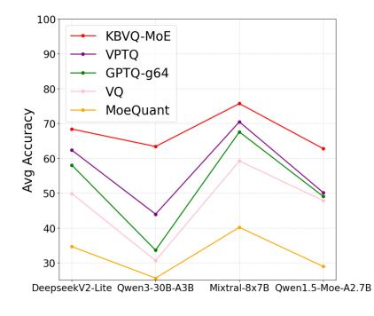
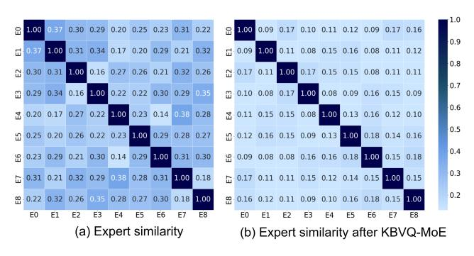
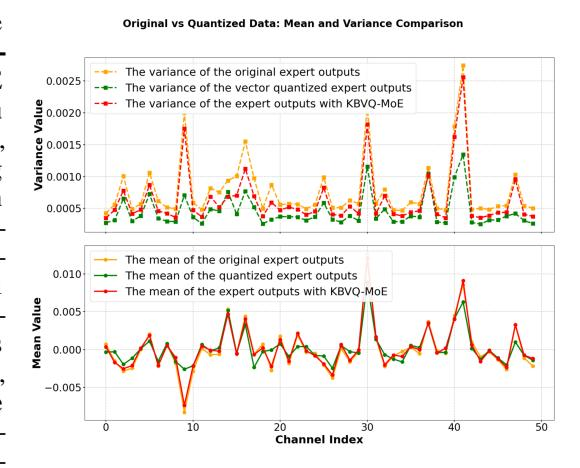

# 1 INTRODUCTION

Mixture-of-Experts (MoE) models have recently achieved state-of-the-art performance in natural language processing (NLP) [\(OpenAI, 2023;](#page-11-0) [Kimi Team, 2025;](#page-10-0) [DeepSeek-AI et al., 2024;](#page-9-0) [Jiang](#page-10-1) [et al., 2024;](#page-10-1) [Yang et al., 2025\)](#page-11-1). By activating only a small subset of experts through a gating mechanism, MoE enables near-linear scaling of capacity with the number of experts while keeping inference cost manageable. However, the growth in expert count substantially increases parameter storage and memory bandwidth requirements. For instance, Qwen3-Next-80B-A3B[\(Alibaba Cloud,](#page-9-1) [2025\)](#page-9-1) requires more than 160GB of GPU memory under FP16 inference. These extreme resource requirements make deployment on edge devices largely infeasible. Post-Training Quantization (PTQ) has emerged as a promising solution for compressing LLMs without the need for retraining [\(Hu](#page-10-2) [et al., 2024;](#page-10-2) [Frantar et al., 2022\)](#page-10-3). A typical subcategory of PTQ is Scalar Quantization (SQ), which represents each weight independently by mapping it to a discrete value from a lower bit-width set.

∗Equal contribution

†This work was conducted during his internship at Houmo AI

‡Corresponding author

Figure 2: Similarity of expert outputs before and after redundancy elimination by KBVQ-MoE.

SQ performs well from medium to high bit-width (≥ 4 bits) [\(Xu et al., 2025;](#page-11-2) [Sun et al., 2024;](#page-11-3) [Zhao et al., 2025\)](#page-12-0), but its representational capability drops sharply at extremely low bit-width (≤ 3 bits), leading to significant accuracy degradation. In contrast, Vector Quantization (VQ), another subcategory of PTQ, shows strong potential for ultra-low-bit dense LLM quantization[\(Yue et al.,](#page-12-1) [2025;](#page-12-1) [Liu et al., 2024;](#page-11-4) [Tseng et al., 2024b\)](#page-11-5). This advantage is realized mainly through leveraging a predefined codebook—where weight vectors are mapped to the most similar discrete codewords within the codebook—thus significantly reducing the data volume while maintaining an acceptable level of information retention.

However, directly applying VQ to MoE architectures suffers from significant performance degradation caused by two key obstacles. ❶ Redundant representation among experts. MoE experts often capture similar feature patterns[\(Du](#page-10-4) [et al., 2025;](#page-10-4) [Sankar & Dimitri, 2025;](#page-11-6) [Omi et al.,](#page-11-7) [2025;](#page-11-7) [Gu et al., 2025;](#page-10-5) [Li et al., 2025a\)](#page-10-6), resulting in substantial parameter redundancy. As shown in Fig. [2\(](#page-1-0)a), experts within the same layer produce highly similar outputs for identical activations, reflecting their overlapping functional roles. This redundancy wastes quantization capacity and prevents limited codebook resources from being concentrated on expert-specific (i.e., non-redundant) representations. ❷ Cumulative and amplified outputs bias. Quantization errors accumulate across layers, resulting in biased layer outputs. In MoE architectures, this bias becomes more pronounced because expert aggregation further amplifies it, leading to more severe distributional shifts than in dense LLMs. As shown in Fig[.3,](#page-1-1) both the mean and variance of outputs shift after quantization. When biased

Figure 3: Distributional Shifts in Qwen3-30B-A3B Layer 20 Outputs: (Top) Per-channel Mean Comparisons (FP, Direct VQ, KBVQ-MoE); (Bottom) Per-channel Variance Comparisons (FP, Direct VQ, KBVQ-MoE).

outputs from multiple experts are aggregated through gating, the bias is amplified and propagates across layers, leading to distributional drift and degraded model performance.

To this end, we propose KBVQ-MoE, the first VQ framework tailored to MoE architectures. KBVQ-MoE is built on two efficient innovations: ❶ Input-driven redundancy elimination(IDRE). First, we employ the Karhunen–Loève Transform (KLT) to align expert weights with input activation statistics, thereby mapping them into a common latent space, referred to here as a unified representation (see Eq. [3\)](#page-5-0). Next, we apply SVD to this unified representation in order to extract the dominant shared representation, which are retained at full precision, making the remaining expert-specific representations easier to quantize effectively. As illustrated in Fig. [2\(](#page-1-0)b), after redundancy elimination

the outputs of experts exhibit much lower similarity compared to Fig. [2\(](#page-1-0)a), validating the effectiveness of redundancy elimination. ❷ Bias-corrected output stabilization(BCOS). We apply vector quantization only to expert-specific(i.e., non-redundant) representations and stabilize the outputs of quantized experts through lightweight linear scaling and bias correction. As a result, with proposed IDRE and BCOS, KBVQ-MoE provide an effective solution for ultra-low-bit quantization in MoE LLMs, achieving both efficient codebook utilization and stable output distributions.

We conducted experimental evaluations of the proposed method on a variety of MoE LLMs, including Qwen1.5-MoE-A2.7B[\(Qwen Team, 2024\)](#page-11-8), Qwen3-30B-A3B[\(Yang et al., 2025\)](#page-11-1), Mixtral-8x7B[\(Jiang](#page-10-1) [et al., 2024\)](#page-10-1) and DeepseekV2-Lite[\(DeepSeek-AI et al., 2024\)](#page-9-0). As shown in Fig. [1,](#page-1-0) KBVQ-MoE consistently outperforms existing scalar and vector quantization methods under the same compression ratio, with particularly strong gains in ultra-low precision settings. For example, at 2-bit quantization on the Qwen3-A3B-30B, our method improves perplexity by 6 and raises average accuracy by nearly 10%, demonstrating its potential for deploying MoE LLMs on resource-constrained devices such as edge platforms.

The main contributions of this paper are as follows:

- We identify two key challenges that arise when vector quantization is applied to MoE-based LLMs: the waste of codebook resources caused by common redundant representation among experts, and outputs bias in quantization errors exacerbated by expert aggregation.
- We propose the KBVQ-MoE framework, which integrates Input-driven redundancy elimination and Bias-corrected outputstabilization.
- Both theoretical analysis and experimental results demonstrate the effectiveness of the KBVQ-MoE method. It exhibits significant advantages over existing methods on models such as the Qwen series and Mixtral, and even achieves near-floating-point accuracy performance under 2-bit quantization.

