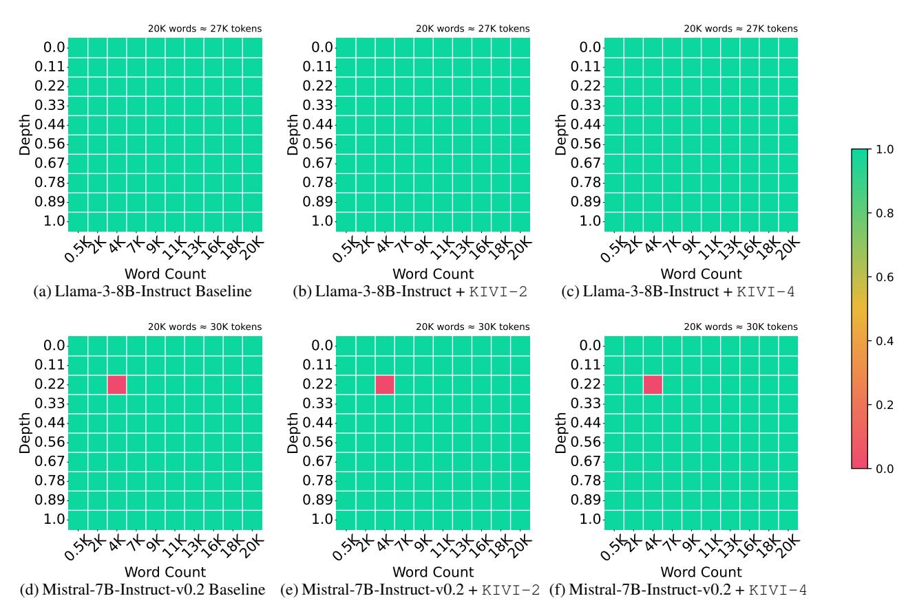

# 4.2.2. ACCURACY COMPARISON ON GENERATION TASKS

LM-Eval Results. We benchmark KIVI in CoQA, TruthfulQA and GSM8K tasks using the LM-Eval framework. All dataset parameters were set to default. We compare the standard 16bit configuration with our KIVI compression techniques in Llama-2-7B, Llama-2-13B, Falcon-7B and Mistral-7B. As shown in Table 3, we observe that for the Llama and Mistral model, KIVI only has up to 2% accuracy drop despite the KV cache being stored in 2bit. For instance, in the Llama-2-7B model, the transition from 16bit to 2bit only slightly decreases accuracy. Similar trends are observed in other Llama-family models. Since Falcon-7B adopts multi-query attention and only has one head for KV cache, it is already highly compressed compared to Llamabased models. Thus, in Table 3, 4bit KIVI is needed to maintain the accuracy, while 2bit KIVI may have a large accuracy drop in this case.

LongBench Results. The performance of KIVI over various models in the LongBench dataset is summarised in Table 4. We apply KIVI to Llama2-7B, Llama2-13B, Llama2-7B-Chat, Llama2-13B-Chat, Falcon-7B and Mistral-7B. Table 4 suggests that KIVI is an effective method for KV cache compression with minimal impact on accuracy across var-

&lt;sup>1The closed-end tasks such as MMLU are not ideal to evaluate KIVI since they only involve one decoding step and directly fetch the output logits, which is not suitable for studying the impact of compressed KV cache.

Figure 4: Needle-in-a-Haystack results on Llama-3-8B-Instruct and Mistral-7B-Instruct-v0.2. Here we count the number of words instead of tokens to better account for the tokenizer difference. The final token length is noted in the upper right corners of each figure. Detailed setting can be found in Appendix B.

ious hard long context generation tasks. We present additional results using Llama3-8b, Mistral-7B-v0.2, and LongChat-7B-v1.5, which can be found in Appendix D.

**NIAH Results.** From Figure 4, we observe that KIVI can still maintain the retrieval ability of LLMs even with 2bit KV Cache. Detailed NIAH setting can be found in Appendix B.

#### 4.2.3. ABLATION

In this section, we benchmark KIVI on GSM8K, one of the hardest generation tasks, to show the effect of hyperparameters group size G and residual length R on the model performance. For full results of KIVI with a residual length of 32, please refer to Appendix  $\mathbb{C}$ .

The effect of group size. We fix the residual length at 128 and vary the group sizes to 32, 64, and 128. From Table 5, we observe that group sizes 32 and 64 yield similar results, whereas the performance significantly decreases when the group size reaches 128. Note the zero-point and the scaling factor mentioned in Section 3.1 are calculated according to

this group size; where the choice of group size will greatly impact the KV cache compression effect under a long input.

The effect of residual length. We fix the group size at 32 and vary the residual length across 32, 64, 96, and 128. As shown in Table 5, there is no consistent pattern between residual lengths and model accuracy. Namely, while a residual length of 128 achieves good results, 32 and 96 yield similar outcomes, but a residual length of 64 results in the worst performance. We emphasize that while we observe no significance among residual lengths of  $\{32, 96, 128\}$ , having a reasonably large residual length is important; as it brings much performance boosts on hard tasks like GSM8K, again as shown in Table 5.

#### 4.2.4. EFFICIENCY COMPARISON

To evaluate the wall-clock time efficiency of KIVI, following vLLM (Kwon et al., 2023), we synthesize workloads based on ShareGPT (sha, 2023), which contain input and output texts of real LLM services. On average, the data set has an input prompt length  $l_{\rm prompt}$  of 161 and an output length  $l_{\rm gen}$  of 338 (Kwon et al., 2023). We increase the batch

Table 3: Performance comparison between 16bit, 4-bit pertoken quantization, four fake 2bit KV cache quantization similar to those in Table 1, KIVI-2 (2bit) / KIVI-4 (4bit) across various models. We emphasize that unlike KIVI, which preserves a small portion of full precision key cache  $\boldsymbol{X}_{K_r}$  and value cache  $\boldsymbol{X}_{V_r}$ , all tokens in fake KV cache quantization are quantized for a fair comparison.  $\mathbb C$  stands for per-channel quantization and  $\mathbb T$  stands for per-token quantization.

| Model       |                                             | CoQA  | TruthfulQA | GSM8K |
|-------------|---------------------------------------------|-------|------------|-------|
|             | 16bit                                       | 63.88 | 30.76      | 13.50 |
|             | 4bit (K - $\mathbb{T}$ , V - $\mathbb{T}$ ) | 64.82 | 29.85      | 12.28 |
|             | 2bit (K - $\mathbb{C}$ , V - $\mathbb{T}$ ) | 59.08 | 33.10      | 5.76  |
| Llama-2-7B  | 2bit (K - $\mathbb{T}$ , V - $\mathbb{T}$ ) | 39.88 | 18.29      | 0.83  |
|             | 2bit (K - $\mathbb{C}$ , V - $\mathbb{C}$ ) | 3.60  | 0.27       | 0.00  |
|             | 2bit (K - $\mathbb{T}$ , V - $\mathbb{C}$ ) | 1.30  | 0.49       | 0.08  |
|             | KIVI-4                                      | 63.78 | 30.80      | 13.80 |
|             | KIVI-2                                      | 63.05 | 33.95      | 12.74 |
|             | 16bit                                       | 66.37 | 29.53      | 22.67 |
|             | 4bit (K - $\mathbb{T}$ , V - $\mathbb{T}$ ) | 66.73 | 29.14      | 20.92 |
|             | 2bit (K - $\mathbb{C}$ , V - $\mathbb{T}$ ) | 63.53 | 28.60      | 12.21 |
| Llama-2-13B | 2bit (K - $\mathbb{T}$ , V - $\mathbb{T}$ ) | 52.93 | 24.98      | 4.55  |
|             | 2bit (K - $\mathbb{C}$ , V - $\mathbb{C}$ ) | 2.88  | 0.74       | 0.00  |
|             | 2bit (K - $\mathbb{T}$ , V - $\mathbb{C}$ ) | 2.80  | 0.26       | 0.08  |
|             | KIVI-4                                      | 66.38 | 29.49      | 23.65 |
|             | KIVI-2                                      | 66.23 | 29.84      | 20.77 |
|             | 16bit                                       | 59.83 | 23.20      | 4.55  |
|             | 4bit (K - $\mathbb{T}$ , V - $\mathbb{T}$ ) | 58.53 | 22.94      | 3.26  |
|             | 2bit (K - $\mathbb{C}$ , V - $\mathbb{T}$ ) | 43.93 | 20.82      | 1.29  |
| Falcon-7B   | 2bit (K - $\mathbb{T}$ , V - $\mathbb{T}$ ) | 25.72 | 0.91       | 0.53  |
|             | 2bit (K - $\mathbb{C}$ , V - $\mathbb{C}$ ) | 41.95 | 17.11      | 1.52  |
|             | 2bit (K - $\mathbb{T}$ , V - $\mathbb{C}$ ) | 19.53 | 0.94       | 0.15  |
|             | KIVI-4                                      | 59.67 | 22.58      | 4.47  |
|             | KIVI-2                                      | 57.48 | 24.98      | 3.41  |
|             | 16bit                                       | 67.40 | 30.45      | 38.36 |
|             | 4bit (K - $\mathbb{T}$ , V - $\mathbb{T}$ ) | 67.80 | 29.83      | 36.85 |
|             | 2bit (K - $\mathbb{C}$ , V - $\mathbb{T}$ ) | 61.65 | 29.64      | 26.46 |
| Mistral-7B  | 2bit (K - $\mathbb{T}$ , V - $\mathbb{T}$ ) | 54.55 | 25.86      | 5.00  |
|             | 2bit (K - $\mathbb{C}$ , V - $\mathbb{C}$ ) | 24.40 | 24.86      | 2.27  |
|             | 2bit (K - $\mathbb{T}$ , V - $\mathbb{C}$ ) | 10.73 | 19.12      | 0.99  |
|             | KIVI-4                                      | 66.95 | 30.49      | 37.30 |
|             | KIVI-2                                      | 66.35 | 32.17      | 36.01 |

size until out of memory and report the peak memory usage and throughput between KIVI (with residual length 32 and 128) and FP16 baseline for the Llama-2-7B model. The hardware here is a single NVIDIA A100 GPU (80GB).

As shown in Figure 5, with similar maximum memory usage, KIVI enables up to  $4\times$  larger batch size and gives  $2.35\times\sim3.47\times$  larger throughput. This throughput number can grow larger with longer context length and output length. We also note that **this speed-up can be greatly increased if we further fuse the KV cache quantization process with previous operations.** We leave it as one of future work.

Figure 5: Memory usage and throughput comparison between 2bit KIVI and 16bit baseline. KIVI can achieve higher throughput by enabling a larger batch size.

#### 5. Related Work

Many machine learning systems and benchmark works consider scaling up LLM inference process (Pope et al., 2023; Yuan et al., 2024). Among them, quantization techniques have been widely applied (Frantar et al., 2022; Lin et al., 2023; Kim et al., 2023; Xu et al., 2023). A main branch of LLM quantization is weight-only quantization, which involves the quantization of model weights to lower precision. For instance, AWQ (Lin et al., 2023) cleverly quantizes model weights to INT4 and INT3 using an activation-aware manner. GPTQ (Frantar et al., 2022) utilizes approximate second-order information to quantize model weights both accurately and efficiently. SqueezeLLM (Kim et al., 2023) adopts the concept of non-uniform quantization based on sensitivity along with dense-and-sparse decomposition. This line of work is orthogonal to ours, as they can be combined.

SmoothQuant (Xiao et al., 2023a) is a post-training quantization method that is more closely related to our work. This method uses equivalent transformations to balance the quantization complexity for both activation and weight, making the activation easier to quantize. SmoothQuant can compress KV cache to 8bit with minor performance loss. However, it faces a significant accuracy drop when scaled down to 4bit or less (Zhao et al., 2024). FlexGen (Sheng et al., 2023) adopts 4-bit group-wise quantization for both key and value cache.

Table 4: Performance evaluation of KIVI on various models across a range of benchmarks in LongBench. We highlight the average performance of our method. More similar results on Mistral-7B-v0.2 and LongChat-7b-v1.5 can be found in Table 10 and Table 9

| Model           |        | Qasper | QMSum | MultiNews | TREC  | TriviaQA | SAMSum | LCC   | RepoBench-P | Average |
|-----------------|--------|--------|-------|-----------|-------|----------|--------|-------|-------------|---------|
|                 | 16bit  | 9.52   | 21.28 | 3.51      | 66.00 | 87.72    | 41.69  | 66.66 | 59.82       | 44.52   |
| Llama2-7B       | KIVI-4 | 9.28   | 21.42 | 3.88      | 66.00 | 87.72    | 41.82  | 66.80 | 59.83       | 44.59   |
|                 | KIVI-2 | 9.31   | 20.50 | 1.14      | 66.00 | 87.42    | 42.71  | 66.88 | 60.23       | 44.27   |
|                 | 16bit  | 9.32   | 21.38 | 3.71      | 70.00 | 87.87    | 43.55  | 66.61 | 56.42       | 44.85   |
| Llama2-13B      | KIVI-4 | 9.16   | 20.86 | 3.21      | 69.00 | 86.97    | 44.26  | 65.30 | 57.08       | 44.48   |
|                 | KIVI-2 | 8.58   | 20.69 | 6.19      | 69.50 | 87.78    | 44.30  | 65.08 | 55.46       | 44.69   |
|                 | 16bit  | 19.65  | 20.54 | 26.36     | 63.00 | 84.28    | 41.12  | 59.75 | 52.93       | 45.95   |
| Llama2-7B-Chat  | KIVI-4 | 19.62  | 20.70 | 25.49     | 63.00 | 84.13    | 40.87  | 59.27 | 53.56       | 45.83   |
|                 | KIVI-2 | 19.32  | 20.46 | 25.48     | 63.00 | 84.84    | 40.60  | 58.71 | 52.97       | 45.67   |
|                 | 16bit  | 24.18  | 20.37 | 25.69     | 67.50 | 86.90    | 42.18  | 50.23 | 50.64       | 45.96   |
| Llama2-13B-Chat | KIVI-4 | 23.00  | 20.36 | 26.06     | 67.50 | 87.20    | 42.04  | 52.55 | 52.77       | 46.44   |
|                 | KIVI-2 | 23.59  | 20.76 | 25.25     | 67.5  | 87.17    | 41.56  | 49.93 | 48.45       | 45.52   |
|                 | 16bit  | 1.48   | 2.35  | 11.09     | 13.00 | 5.84     | 2.44   | 23.86 | 9.69        | 8.71    |
| Falcon-7B       | KIVI-4 | 1.04   | 2.41  | 11.98     | 13.00 | 5.84     | 2.36   | 23.72 | 9.92        | 8.78    |
|                 | KIVI-2 | 1.98   | 3.61  | 6.78      | 10.00 | 6.24     | 2.73   | 22.18 | 10.12       | 7.95    |
|                 | 16bit  | 8.12   | 19.98 | 19.99     | 67.50 | 89.80    | 41.69  | 66.59 | 58.99       | 46.58   |
| Mistral-7B      | KIVI-4 | 7.89   | 20.06 | 20.58     | 67.50 | 89.80    | 41.56  | 66.45 | 58.62       | 46.56   |
|                 | KIVI-2 | 6.92   | 19.71 | 17.92     | 66.50 | 89.63    | 41.66  | 65.52 | 58.99       | 45.85   |

Table 5: Ablation study of KIVI by changing group size G and residual length R.

| Model            | Group Size         | GSM8K              |
|------------------|--------------------|--------------------|
|                  | 32                 | 20.77              |
| Llama2-13B       | 64                 | 21.00              |
|                  | 128                | 17.29              |
|                  |                    |                    |
| Model            | Residual Length    | GSM8K              |
| Model            | Residual Length 32 | <b>GSM8K</b> 20.62 |
|                  |                    |                    |
| Model Llama2-13B | 32                 | 20.62              |

One essential recipe of KIVI is the per-channel quantization scheme designed based on the observation made in Section 3.2 and Figure 2. ATOM (Zhao et al., 2024) also indicates that key cache exhibits more outliers compared to the value cache. KIVI provides further extensive analysis and leverages this observation to implement per-channel quantization. A similar observation and approach has been independently discovered and developed in the concurrent work KVQuant (Hooper et al., 2024).

vLLM (Kwon et al., 2023) and S3 (Jin et al., 2023) are system-level works, which include memory management through the use of PagedAttention or memory usage prediction. They can lower the memory requirements of KV cache and simultaneously increase model throughput. This research direction is orthogonal to our work, since system-level optimizations can also be applied upon our algorithm.

Several other works also consider compressing KV cache by evicting tokens. H2O (Zhang et al., 2023) retains only a small portion of tokens that contribute significantly to the attention scores. Similarly, Scissorhands (Liu et al., 2024) exploit the persistence of the importance hypothesis in KV cache sparsification. StreamingLLM (Xiao et al., 2023b) is based on the observation of "attention sink" and maintains only a few initial tokens to preserve performance. Unlike these works, our KIVI retains all input tokens and compresses them into lower precision. This line of work is orthogonal to ours, as they can also be combined together.

## 6. Conclusion and Future Work

In this paper, we systematically analyze KV cache element distribution in popular LLMs. We conclude that key cache should be quantized per-channel and value cache should be quantized per token. Based on these observations, we propose KIVI, a plug-and-play 2bit KV cache quantization algorithm without the need for any tuning. In real LLM workload, KIVI allows up to  $4\times$  larger batch sizes and  $3.47\times$  throughput. In the future, we will further optimize the implementation to reduce the overhead of quantization process during the prefill and decoding phase.

#### Acknowledgments

The authors thank the anonymous reviewers for their helpful comments. Dr. Beidi Chen is supported by a research gift from Moffett.AI. Dr. Vladimir Braverman is partially supported by the Ministry of Trade, Industry and Energy (MOTIE) and Korea Institute for Advancement of Technology (KIAT) through the International Cooperative R&D program, the Naval Research (ONR) grant N00014-23-1-2737, and NSF CNS 2333887 award. Dr. Xia Hu is supported by NSF grants NSF IIS-2224843. The views and conclusions contained in this paper are those of the authors and should not be interpreted as representing any funding agencies.

## Impact Statement

This paper presents work whose goal is to advance the field of Machine Learning. There are many potential societal consequences of our work, none which we feel must be specifically highlighted here.

