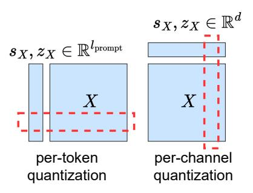

# KIVI: A Tuning-Free Asymmetric 2bit Quantization for KV Cache

Zirui Liu $^{*\,1}$  Jiayi Yuan $^{*\,1}$  Hongye Jin $^2$  Shaochen (Henry) Zhong  $^1$  Zhaozhuo Xu $^3$  Vladimir Braverman $^1$  Beidi Chen $^4$  Xia Hu $^1$ 

## **Abstract**

Efficiently serving large language models (LLMs) requires batching of many requests to reduce the cost per request. Yet, with larger batch sizes and longer context lengths, the key-value (KV) cache, which stores attention keys and values to avoid recomputations, significantly increases memory demands and becomes the new bottleneck in speed and memory usage. Additionally, the loading of the KV cache causes the computational core to be idle, which limits the inference speed. A straightforward and effective solution to reduce KV cache size is quantization, which decreases the total bytes taken by KV cache. However, there is a lack of in-depth studies that explore the element distribution of KV cache to understand the hardness and limitation of KV cache quantization. the gap, we conducted a comprehensive study on the element distribution in KV cache of popular LLMs. Our findings indicate that the key cache should be quantized per-channel, i.e., group elements along the channel dimension and quantize them together. In contrast, the value cache should be quantized per-token. From this analysis, we developed a tuning-free 2bit KV cache quantization algorithm named KIVI. With hardware-friendly implementation, KIVI can enable Llama, Falcon, and Mistral models to maintain almost the same quality while using 2.6× less peak memory (including model weight). This reduction in memory usage enables up to  $4 \times$  larger batch size, bringing  $2.35 \times \sim 3.47 \times$  throughput on real LLM inference workload. The source code is available at https://github.com/jy-yuan/KIVI.

Proceedings of the 41st International Conference on Machine Learning, Vienna, Austria. PMLR 235, 2024. Copyright 2024 by the author(s).

## 1. Introduction

Large Language Models (LLMs) have demonstrated strong performance across a wide range of tasks (Brown et al., 2020; Taylor et al., 2022; Yuan et al., 2023; Chuang et al., 2024). However, their deployment is very costly, requiring a large number of hardware accelerators such as GPUs. Given these substantial costs, one natural way to reduce the cost per request is to combine a sufficient number of requests together for batch processing. However, in this batch inference scenario, the key-value cache (KV cache), which holds the attention keys and values during generation to prevent re-computations, is becoming the new memory and speed bottleneck. This bottleneck becomes more pronounced with larger batch sizes and longer context lengths. For instance, in 540B PaLM, with a batch size of 512 and a context length of 2048, KV cache alone can take 3TB. This is 3 times the size of the model's parameters (Pope et al., 2023). Also, the GPU SRAM has to load the whole KV cache from the GPU device memory for every token generated, during which the computational cores are idle. Thus, reducing KV cache size in LLMs while maintaining accuracy is important.

Existing works towards this problem can be roughly divided into three categories. First, some work suggests reducing the number of heads in KV cache, such as multi-query attention (Shazeer, 2019) and multi-group attention (Ainslie et al., 2023). However, these methods require either training the model from scratch or fine-tuning the existing model. Second, another research line reduces KV cache size by evicting unimportant tokens (Zhang et al., 2023). Third, some other works try to solve this problem from the system perspective, e.g., offloading KV cache (Sheng et al., 2023) or extending virtual memory and paging techniques into the attention mechanism (Kwon et al., 2023).

To reduce the size of KV cache, the most simple and effective way is to reduce the total bytes taken by KV cache, namely, quantization. Unlike the well-studied weight quantization (Lin et al., 2023; Xiao et al., 2023a; Zhao et al., 2024), to the best of our knowledge, only a few studies applied the vanilla 4bit round-to-nearest quantization to KV cache (Sheng et al., 2023; Zhao et al., 2024) due to the streaming nature of KV cache or other complications. There is a lack of in-depth studies that ex-

\*Equal contribution. The order of authors is determined by flipping a coin. 1Rice University 2Texas A&M University 3Stevens Institute of Technology 4Carnegie Mellon University. Correspondence to: Zirui Liu <zl105@rice.edu>, Jiayi Yuan <jy101@rice.edu>.

Figure 1: Definition of per-token and per-channel quantization. X ∈ R lprompt×d is key/value cache where lprompt is the number of tokens and d is the number of channels. zX is the zero-point, sX is the scaling factor.

plore the element distribution of KV cache to understand the hardness and limitation of KV cache quantization. To fill the gap, we study the element distribution of KV cache. Our analysis suggests:

- For key cache, there are a few fixed channels whose magnitudes are very large, which is consistent with previous finding [\(Lin et al.,](#page-9-4) [2023;](#page-9-4) [Xiao et al.,](#page-10-6) [2023a\)](#page-10-6). Thus, as shown in Figure [1](#page-1-0) right, key cache should be quantized per-channel, i.e., group elements along the channel dimension and quantize them together. In this way, it can confine the error to each individual channel, without impacting the other normal channels.
- For value cache, there is no obvious outlier pattern. Although value cache has no obvious outlier pattern, we experimentally show that it can only be quantized pertoken because it is used to calculate the attention output, which is essentially a value cache mixer. As shown in Figure [1](#page-1-0) left, the per-token quantization can confine the error inside each individual token and ensure that the quantization of one token does not adversely impact the others.

Based on the above insights, we propose KIVI, a plug-andplay extreme low-bit KV cache quantization method. KIVI quantizes key cache per-channel and quantizes value cache per-token. The per-token value cache quantization aligns well with the streaming nature of auto-regressive inference, allowing newly quantized tensors to be directly appended to the existing quantized value cache by token dimension. However, for per-channel key cache quantization, the quantization process spans different tokens, which cannot be directly implemented in this streaming setting. Since the number of tokens in key cache can be arbitrary, our key idea is to split key cache into two parts. The first part is the grouped key cache, which contains several groups of tokens and each group has a certain number of tokens. The second part is the residual key cache, which does not have a sufficient number of tokens to form a complete group. Similarly,

we split value cache into the grouped and residual parts to maintain the accuracy. We only apply group-wise quantization to the grouped key cache and value cache, while the residual key cache and value cache are kept in full precision. The grouped and residual parts can be combined using tiled matrix multiplication when computing attention scores. Our contributions are summarized as follows:

- Extensive analysis regarding the outlier patterns and quantization error of KV cache in commonlyused LLMs. Our observations suggest that key cache should be quantized per-channel and value cache should be quantized per-token. We also explain in depth why these caches require different quantization approaches.
- A new plug-and-play 2bit KV cache quantization algorithm without any fine-tuning, **KIVI**, with hardware-friendly implementation. We conduct an extensive evaluation for KIVI with Llama, Mistral, and Falcon on popular generation tasks. KIVI can efficiently compress KV cache to 2bit and bring 2.6× peak memory usage reduction for Llama-2-7B, with little to no accuracy drop. With our efficient system implementation, this memory reduction, in return, enables up to 4× larger batch size and brings 2.35× ∼ 3.47× throughput.

