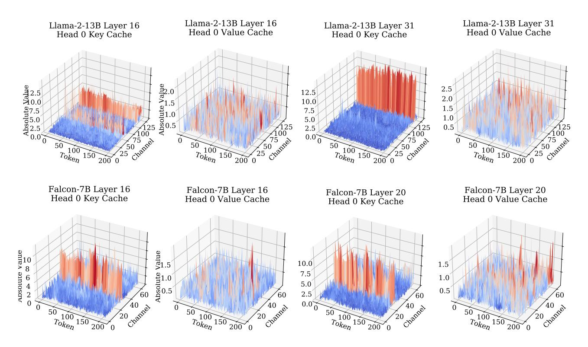

# 2. Background: Attention Inference-Time Workflow

The LLM attention inference-time workflow involves two phases: i) the *prefill* phase, where the input prompt is used to generate KV cache for each transformer layer of LLMs; and ii) the *decoding* phase, where the model uses and updates KV cache to generate the next token, one at a time.

Prefill Phase. Let X ∈ R b×lprompt×d be the input tensor, where b is the batch size, lprompt is the length of the input prompt, and d is the model hidden size. For convenience, we ignore the layer index here. The key, value tensors can be computed by

$$X_K = XW_K, X_V = XW_V,$$

where WK,WV ∈ R d×d are the key and value layer weight, respectively. After obtaining XK and XV , they are cached in the memory for the ease of decoding.

Decoding Phase. Let t ∈ R b×1×d be the current input token embedding. Let tK = tWK and tV = tWV be the key and value layer output, respectively. We first update KV cache:

$$X_K \leftarrow \operatorname{Concat}(X_K, t_K),$$
  
 $X_V \leftarrow \operatorname{Concat}(X_V, t_V),$ 

then calculate the attention output as:

$$\begin{aligned} \boldsymbol{t}_Q &= \boldsymbol{t} \boldsymbol{W}_Q, \ \boldsymbol{A} &= \operatorname{Softmax}(\boldsymbol{t}_Q \boldsymbol{X}_K^\top), \ \boldsymbol{t}_Q &= \boldsymbol{A} \boldsymbol{X}_V, \end{aligned}$$

where  $W_Q$  is the weight matrix of the query layer. For ease of illustration, we ignore the attention output layer and the other parts of the inference workflow.

Memory and Speed Analysis. The above process is repeated until a special token indicating the sentence's conclusion is reached. Let  $l_{\rm gen}$  be the number of generated tokens. From the above analysis, the shape of KV cache is  $b \times (l_{\rm prompt} + l_{\rm gen}) \times d$ . To get a sense of the scale, consider the OPT-175B model with a batch size b 512, a prompt length  $l_{\rm prompt}$  512, and an output length  $l_{\rm gen}$  32. The KV cache requires 1.2TB, which is 3.8 times the model weights (Sheng et al., 2023). Besides the memory, the inference speed is also decided by the KV cache size. The GPU needs to load KV cache from GPU main memory to GPU SRAM once for every token generated during which the computational core of the chip is essentially idle (Pope et al., 2023; Kwon et al., 2023).

## 3. Methodology

In scenarios with long contexts or batched inferences, the memory and speed bottlenecks are storing and loading KV cache. The most simple and effective way to alleviate this problem is to reduce the total bytes occupied by KV cache, specifically, quantization. Following this motivation, we first evaluate the performance of the existing quantization method in Section 3.1. Our observations suggest that key and value cache should be quantized along different dimensions. We analyze the rationale behind this observation in Section 3.2. Then based on the analysis, we propose KIVI, a new KV cache quantization method along with its streaming data structure, detailed in Section 3.3.

#### 3.1. Preliminary Study of KV Cache Quantization

As we analyzed in Section 2, KV cache functions as a streaming data structure, where the new tensor arrives sequentially. Thus, optimization-based methods like GPTQ (Frantar et al., 2022) are unsuitable for quantizing KV cache due to the overhead. To the best of our knowledge, the most flexible way for quantizing KV cache is the round-to-nearest quantization. The B-bit integer quantization-dequantization process can be expressed as:

$$Q(\boldsymbol{X}) = \lfloor \frac{\boldsymbol{X} - z_X}{s_X} \rceil, \quad \boldsymbol{X'} = Q(\boldsymbol{X}) \cdot s_X + z_X,$$

where  $z_X = \min \mathbf{X}$  is the zero-point,  $s_X = (\max \mathbf{X} - \min \mathbf{X})/(2^B - 1)$  is the scaling factor, and  $\lfloor \cdot \rfloor$  is the rounding operation. Here we ignore the batch size for ease of

Table 1: The results of simulated KV cache group-wise quantization with various configurations. The group size is set as 32.  $\mathbb C$  stands for per-channel quantization and  $\mathbb T$  stands for per-token quantization. Please check the whole evaluation in Table 3.

| Llama-2-13B                             | CoQA         | TruthfulQA   |
|-----------------------------------------|--------------|--------------|
| 16bit                                   | 66.37        | 29.53        |
| 4bit (K - T, V - T)                     | 66.48        | 29.51        |
| 2bit $(K - \mathbb{T}, V - \mathbb{T})$ | 52.93        | 24.98        |
| 2bit $(K - \mathbb{C}, V - \mathbb{C})$ | 2.88         | 0.74         |
| 2bit $(K - \mathbb{T}, V - \mathbb{C})$ | 2.80         | 0.26         |
| 2bit $(K - \mathbb{T}, V - \mathbb{T})$ | <b>63.53</b> | <b>28.60</b> |

understanding. As shown in Figure 1, X is quantized along either the token or channel dimension group-wisely.

Considering the streaming nature of KV cache, previous studies often apply per-token quantization to both key and value cache since the newly quantized KV cache can be naively added to the existing quantized one along the token dimension (Sheng et al., 2023). While per-channel quantization is non-trivial, we have designed a padding method to implement per-channel quantization to explore its effect on both key and value cache.

**Setting.** In Table 1, we show the results of fake KV cache group-wise quantization with different configurations on the Llama-2-13B model for the CoQA and TruthfulQA tasks. We use a group size of 32 for all configurations. Here fake quantization means we simulate the quantization process by first quantizing KV cache into lower precision and then dequantizing it in the attention layer. For per-channel quantization, if the number of tokens is not divided evenly into groups, we add zero-padding to ensure it can be grouped perfectly. In this way, we ensure that all tokens in KV cache are quantized for a fair comparison. The detailed experimental setting can be found in Section 4.1. Specifically, we observe that:

**OB 1.** When using the commonly used per-token quantization to both key and value caches, INT4 precision can maintain accuracy. However, reducing it to INT2 results in a notable accuracy drop.

**OB 2.** When value cache is quantized per-channel, the accuracy significantly worsens regardless of how key cache is quantized.

**OB 3.** When using a lower numerical precision such as INT2, the most accurate approach is to quantize key cache per-channel and value cache per-token.

Figure 2: Magnitude of key and value cache for Llama-2-13B and Falcon-7B. We observe (1) for key cache, there are a few channels whose magnitudes are very large. (2) for value cache, there is no obvious outlier pattern.

