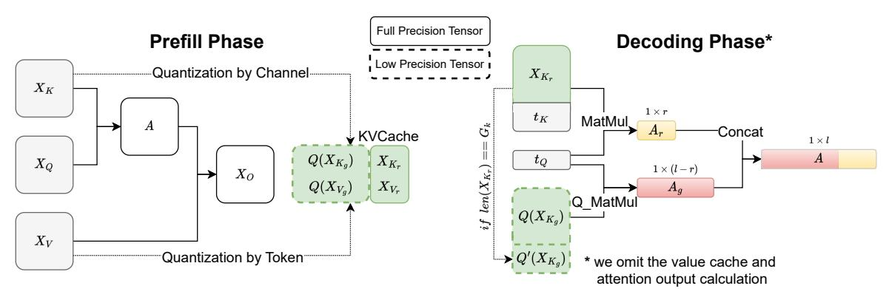

# 3.2. Why Key and Value Cache Should Quantize Along Different Dimensions?

In Table 1, we observe that quantizing key cache per-channel and value cache per-token to 2bit results in a very small accuracy drop. Here we analyze why this configuration delivers better accuracy. In Figure 2 we visualize the original KV cache distribution at different layers. We observe that in key cache, some fixed channels exhibit very large magnitudes, whereas in value cache, there is no significant pattern for outliers.

Analysis of Key Cache. The above observation for key cache aligns with previous findings that certain fixed columns in activations exhibit larger outliers (Dettmers et al., 2022; Lin et al., 2023). The persistence of outliers within each channel means that per-channel quantization can confine the quantization error to each individual channel without impacting the other normal channels. Thus, Figure 2 explains why key cache should be quantized per-channel. In Table 2 we show key cache relative reconstruction error  $\|\frac{X_K - X_K'}{X_K}\|_F$ , along with the relative attention score error  $\|\frac{A - A'}{A}\|_F$  where  $A' = \operatorname{Softmax}(t_Q X_K'^{\top})$ . We observe that the per-token quantization can lead to almost  $5 \times$  larger attention score error than per-channel quantization, which is consistent with Figure 2.

Table 2: The relative error statistics averaged over all layers and all heads

| Llama-2-13B                                                                                 | K Per-Token      | K Per-Channel |  |  |  |
|---------------------------------------------------------------------------------------------|------------------|---------------|--|--|--|
| Avg. $\ \frac{\boldsymbol{X}_K - \boldsymbol{X}_K'}{\boldsymbol{X}_K}\ _F$                  | 13.67            | 4.55          |  |  |  |
| Avg. $\ \frac{X_K}{X_K}\ _F$ Avg. $\ \frac{A-A'}{A}\ _F$                                 | 47.00            | 9.60          |  |  |  |
| Avg. $\  \overline{A} \ _F$ Attention sparsity                                           | 84.3%            |               |  |  |  |
|                                                                                             |                  |               |  |  |  |
|                                                                                             | V Per-Token      | V Per-Channel |  |  |  |
| Avg. $\ \frac{\mathbf{X}_{V} - \mathbf{X}_{V}'}{\mathbf{Y}_{V}}\ _{F}$                      | V Per-Token 4.57 | V Per-Channel |  |  |  |
| Avg. $\ \frac{\boldsymbol{x}_V - \boldsymbol{x}_V'}{\boldsymbol{x}_V}\ _F$ Avg. $\Delta$ |                  |               |  |  |  |

Analysis of Value Cache. Unlike key cache, value cache does not show the channel-wise outlier pattern. Furthermore, Figure 2 alone cannot explain **OB2**, which indicates value cache should only be quantized per-token. This is because Figure 2 implies that errors should be comparable for both per-token and per-channel quantization, given the absence of a clear pattern. As shown in Equation (1), value cache is used to calculate the attention output  $t_O$ . Instead of analyzing the quantization error of value cache  $X_V$ , in Table 2 we analyze the relative error  $\Delta = \|\frac{AX_V - AX_V'}{AX_V}\|_F$  with different quantization configurations. Surprisingly, we observe that the per-token quantization error is almost  $15\times$ 

Figure 3: The overview of KIVI algorithm. For ease of illustration, we omit the value cache and attention output parts. The detailed pseudo-code is provided in Algorithm [1.](#page-11-0) Here "Q\_Matmul" is the mix-precision matrix multiplication which fuses the dequantization with matrix multiplication at the tiling level.

smaller than per-channel quantization, which explains why OB2 happens. The intuition behind this observation stems from the attention sparsity. Equation [\(1\)](#page-1-2) can be written as:

$$[AX_V]_{i*} = \sum_{j=1}^{l_{\text{prompt}}} A_{ij}[X_V]_{j*},$$
 (2)

where [XV ]j∗ is the j-th row of XV . From Equation [\(2\)](#page-2-2), the attention output is the weighted summation of value cache across various tokens, with the weights being the attention scores. Since the attention score is highly sparse [\(Tian et al.,](#page-10-8) [2023\)](#page-10-8), the output is just the combination of value caches of a few important tokens. The per-token quantization can confine the error to each individual token. Thus, quantizing other tokens does not affect the accuracy of important tokens. Consequently, per-token quantization leads to a much smaller relative error ∆.

## 3.3. **KIVI**: Algorithm and System Support

Algorithm. As we previously analyzed, key cache should be quantized per-channel and value cache should be quantized per-token. Recall that key and value cache of newly generated tokens arrive sequentially. From the implementation perspective, per-token quantization aligns well with streaming settings, allowing newly quantized tensors to be directly appended to the existing quantized value cache by token dimension. However, for per-channel quantization, the quantization process spans across different tokens, which cannot be directly implemented in the streaming setting. As shown in Figure [3,](#page-4-1) our key idea to solve this problem is to group key cache every G tokens and quantize them separately. Because the number of tokens in XK can be arbitrary, we split XK into two parts, namely, the grouped part XKg = XK[: l − r] and residual part XKr = XK[l − r :], where l is the number of tokens inside the current key cache XK, r is the number of residual tokens, where l − r can be divisible by G.

Since XKg can be evenly divided into (l − r)/G groups,

we only store Q(XKg ) with group-wise quantization, while XKr is kept in full precision. During the decoding process, each newly arrived key cache tK is added to XKr and once XKr reaches R tokens, which is a hyperparameter - residual length, we quantize and concatenate it with the previously quantized Q(XKG ). Then we reset XKr to an empty tensor. We note that R should be divisible by G. With tiled matrix multiplication, the raw attention logits is then calculated as:

$$\begin{aligned} \boldsymbol{A}_g &= \boldsymbol{t}_Q Q(\boldsymbol{X}_{K_g}^\top), \ \boldsymbol{X}_{K_r} &= \operatorname{Concat}([\boldsymbol{X}_{K_r}, \boldsymbol{t}_K]), \ \boldsymbol{A}_r &= \boldsymbol{t}_Q \boldsymbol{X}_{K_r}^\top, \ \boldsymbol{A} &= \operatorname{Concat}([\boldsymbol{A}_g, \boldsymbol{A}_r]). \end{aligned}$$

For value cache, similar to key cache, we also split it into two parts and keep the most recent value cache in full precision, namely, XVg and XVr . Specifically, we maintain a queue and each newly arrived value cache is pushed into the queue. Once the queue reaches the predefined residual length R, the most outdated value cache is poped. Then the poped value cache is quantized per-token and concatenated with the previously quantized value cache along the token dimension.

As shown in Figure [3,](#page-4-1) we also emphasize that during the prefill phase, the exact key and value tensors are passed to the next layers, although only the quantized KV cache is retained in memory. The whole algorithm can be found in Appendix [A](#page-11-1) Algorithm [1.](#page-11-0)

Analysis. In KIVI, the grouped key cache XKg and value cache XVg is quantized, while the residual key cache XKr and value cache XVr is kept in full precision. By design, there are at most R tokens inside XKr or XVr . In practice, we set R ≤ 128 and the sequence length lprompt + lgen is often much longer than R. Thus the memory overhead from XKr and XVr is negligible when considering the benefit from extreme low-bit quantization, especially for the long context scenarios. Also, since the newly arrived key and

value tensors are added to  $X_{K_r}$  and  $X_{V_r}$  in full precision, KIVI maintains a full precision KV cache sliding window for the local relevant tokens. This window size is expected to be  $\frac{R}{2}$  for key cache, and R for value cache. Later in the experiment section, we show that this full precision sliding window is crucial for obtaining desirable performance on hard tasks, such as GSM8K.

**System Support.** We provide a hardware-friendly implementation for running KIVI on GPUs. To minimize the overhead, we have fused the dequantization process with matrix multiplication, e.g., Q\_MatMul in Figure 3, using CUDA. We also implement the group-wise quantization kernel in Triton. Our method is fully compatible with weight-only quantization.

### 4. Experiments

### 4.1. Settings

**Models.** We evaluate KIVI using three popular model families: Llama/Llama-2 (Touvron et al., 2023a;b), Falcon (Penedo et al., 2023) and Mistral (Jiang et al., 2023). Llama and Mistral model is based on multi-head attention, while Falcon is based on multi-query attention (Shazeer, 2019). We use the Hugging Face Transformers codebase and implement the KIVI algorithm upon it. Following previous work (Sheng et al., 2023), the group size G in Algorithm 1 for quantization is set as 32 across all experiments, the residual length R for key and value cache is set to 128.

**Tasks.** As we analyzed in Section 2, the KV cache size grows larger with a longer context. Thus, we evaluate KIVI under the normal context length and long context setting, respectively. Specifically, we adopt generation tasks from LM-Eval (Gao et al., 2021) for normal context length evaluation and LongBench (Bai et al., 2023) for long context evaluation, respectively1. For LM-eval, we adopt CoQA (Exact match accuracy), TruthfulQA (BLEU score), and GSM8K (Exact match accuracy). For LongBench, we chose tasks from four subgroups. Specifically, Qasper (F1 score) is a Single-Document QA task; QMSum (ROUGE score) and MultiNews (ROUGE score) are Summarization tasks; TREC (classification score), TriviaQA (F1 score), and SAM-Sum (ROUGE score) are Few-shot Learning tasks; and LCC (similarity score) and RepoBench-P (similarity score) is Code Completion task. The maximum sequence length in LongBench was set to 8192 for the Mistral model and 4096 for other models. We also consider the needle-in-a-haystack

task (NIAH) to evaluate the model's long context retrieval ability after quantizing KV cache. Detailed NIAH setting can be found in Appendix B.

#### 4.2. Accuracy and Efficiency Analysis

