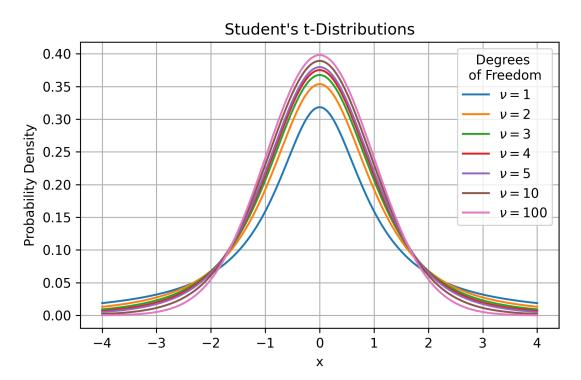

# References

- AbouElhamayed, A. F., Cui, A., Fernandez-Marques, J., Lane, N. D., and Abdelfattah, M. S. Pqa: Exploring the potential of product quantization in dnn hardware acceleration. *Trans. on Reconfig. Tech. and Sys.*, 2024.
- Alsuhli, G., Sakellariou, V., Saleh, H., Al-Qutayri, M., Mohammad, B., and Stouraitis, T. Number systems for deep neural network architectures: A survey. *arxiv*, 2023.
- Bisk, Y., Zellers, R., Bras, R. L., Gao, J., and Choi, Y. Piqa: Reasoning about physical commonsense in natural language. *Conf. on Artificial Intell.*, 2020.
- Cai, Y., Yao, Z., Dong, Z., Gholami, A., Mahoney, M. W., and Keutzer, K. Zeroq: A novel zero shot quantization framework. *CVPR*, 2020.
- Chee, J., Cai, Y., Kuleshov, V., and Sa, C. D. Quip: 2-bit quantization of large language models with guarantees. *NeurIPS*, 2023.
- Chen, Y., Dotzel, J., and Abdelfattah, M. S. M4bram: Mixed-precision matrix-matrix multiplication in fpga block rams, 2023.
- Chen, Y.-H., Yang, T.-J., Emer, J., and Sze, V. Eyeriss v2: A flexible accelerator for emerging deep neural networks on mobile devices. *Journal of Emerging and Selected Topics in Circuits and Systems*, 2019.
- Clark, C., Lee, K., Chang, M.-W., Kwiatkowski, T., Collins, M., and Toutanova, K. Boolq: Exploring the surprising difficulty of natural yes/no questions. *North. American. Assoc. for Comp. Linguistics*, 2019.
- Dai, S., Venkatesan, R., Ren, H., Zimmer, B., Dally, W. J., and Khailany, B. Vs-quant: Per-vector scaled quantization for accurate low-precision neural network inference. *MLSys*, 2021.
- Dettmers, T., Lewis, M., Belkada, Y., and Zettlemoyer, L. Llm.int8(): 8-bit matrix multiplication for transformers at scale. *NeurIPS*, 2022a.
- Dettmers, T., Lewis, M., Shleifer, S., and Zettlemoyer, L. 8 bit optimizers via block-wise quantization. *ICLR*, 2022b.
- Dettmers, T., Pagnoni, A., Holtzman, A., and Zettlemoyer, L. Qlora: Efficient finetuning of quantized llms. *NeurIPS*, 2023.
- Dotzel, J., Wu, G., Li, A., Umar, M., Ni, Y., Abdelfattah, M. S., Zhang, Z., Cheng, L., Dixon, M. G., Jouppi, N. P., Le, Q. V., and Li, S. Fliqs: One-shot mixed-precision floating-point and integer quantization search. *AutoML*, 2024.

- Frantar, E., Ashkboos, S., Hoefler, T., and Alistarh, D. Gptq: Accurate post-training quantization for generative pretrained transformers. *NeurIPS*, 2023.
- Hao, C., Dotzel, J., Xiong, J., Benini, L., Zhang, Z., and Chen, D. Enabling design methodologies and future trends for edge ai: Specialization and codesign. *IEEE Design & Test*, 2021.
- He, K., Zhang, X., Ren, S., and Sun, J. Deep residual learning for image recognition. *CVPR*, 2015.
- Huang, G., Liu, Z., van der Maaten, L., and Weinberger, K. Q. Densely connected convolutional networks. *CVPR*, 2017.
- Jiang, A. Q., Sablayrolles, A., Mensch, A., Bamford, C., Chaplot, D. S., de las Casas, D., Bressand, F., Lengyel, G., Lample, G., Saulnier, L., Lavaud, L. R., Lachaux, M.- A., Stock, P., Scao, T. L., Lavril, T., Wang, T., Lacroix, T., and Sayed, W. E. Mistral 7b. *arxiv*, 2023.
- Jouppi, N. P., Hyun Yoon, D., Ashcraft, M., Gottscho, M., Jablin, T. B., Kurian, G., Laudon, J., Li, S., Ma, P., Ma, X., Norrie, T., Patil, N., Prasad, S., Young, C., Zhou, Z., and Patterson, D. Ten lessons from three generations shaped google's tpuv4i : Industrial product. *Int. Conf. on Computer Arch.*, 2021.
- Jouppi, N. P., Kurian, G., Li, S., Ma, P., Nagarajan, R., Nai, L., Patil, N., Subramanian, S., Swing, A., Towles, B., Young, C., Zhou, X., Zhou, Z., and Patterson, D. Tpu v4: An optically reconfigurable supercomputer for machine learning with hardware support for embeddings. *Int. Conf. on Computer Arch.*, 2023.
- Kazemi, M., Kim, N., Bhatia, D., Xu, X., and Ramachandran, D. Lambada: Backward chaining for automated reasoning in natural language. *Assoc. for Comp. Linguistics*, 2023.
- Kuzmin, A., Van Baalen, M., Ren, Y., Nagel, M., Peters, J., and Blankevoort, T. Fp8 quantization: The power of the exponent. *NeurIPS*, 2022.
- Kuzmin, A., Nagel, M., van Baalen, M., Behboodi, A., and Blankevoort, T. Pruning vs quantization: Which is better? *NeurIPS*, 2023.
- Li, Y., Dong, X., and Wang, W. Additive powers-of-two quantization: An efficient non-uniform discretization for neural networks. *ICLR*, 2020.
- Li, Y., Bubeck, S., Eldan, R., Giorno, A. D., Gunasekar, S., and Lee, Y. T. Textbooks are all you need ii: phi-1.5 technical report. *arxiv*, 2023.

- Liu, J., Gong, R., Wei, X., Dong, Z., Cai, J., and Zhuang, B. Qllm: Accurate and efficient low-bitwidth quantization for large language models. *arxiv*, 2023.
- Micikevicius, P., Stosic, D., Burgess, N., Cornea, M., Dubey, P., Grisenthwaite, R., Ha, S., Heinecke, A., Judd, P., Kamalu, J., et al. Fp8 formats for deep learning. *arXiv preprint arXiv:2209.05433*, 2022.
- Moskvichev, A., Odouard, V. V., and Mitchell, M. The conceptarc benchmark: Evaluating understanding and generalization in the arc domain. *Trans. on Machine Learning*, 2023.
- Nagel, M., van Baalen, M., Blankevoort, T., and Welling, M. Data-free quantization through weight equalization and bias correction. *ICCV*, 2019.
- Rouhani, B. Next-generation narrow precision data formats for ai. *online*, 2023. URL [https://www.opencompute.org/blog/](https://www.opencompute.org/blog/amd-arm-intel-meta-...) [amd-arm-intel-meta-...](https://www.opencompute.org/blog/amd-arm-intel-meta-...)
- Rouhani, B., Zhao, R., Elango, V., Shafipour, R., Hall, M., Mesmakhosroshahi, M., More, A., Melnick, L., Golub, M., Varatkar, G., Shao, L., Kolhe, G., Melts, D., Klar, J., L'Heureux, R., Perry, M., Burger, D., Chung, E., Deng, Z., Naghshineh, S., Park, J., and Naumov, M. With shared microexponents, a little shifting goes a long way. *Int. Conf. on Computer Arch.*, 2023.
- Sakaguchi, K., Bras, R. L., Bhagavatula, C., and Choi, Y. Winogrande: An adversarial winograd schema challenge at scale. *arxiv*, 2019.
- Scao, T. L., Fan, A., Akiki, C., Pavlick, E., Ilic, S., Hess- ´ low, D., Castagne, R., and Luccioni, A. S. Bloom: A ´ 176b-parameter open-access multilingual language model. *arxiv*, 2023.
- Shao, W., Chen, M., Zhang, Z., Xu, P., Zhao, L., Li, Z., Zhang, K., Gao, P., Qiao, Y., and Luo, P. Omniquant: Omnidirectionally calibrated quantization for large language models. *arxiv*, 2023.
- Shen, H., Mellempudi, N., He, X., Gao, Q., Wang, C., and Wang, M. Efficient post-training quantization with fp8 formats. *arxiv*, 2023.
- Touvron, H., Martin, L., Stone, K., Albert, P., Almahairi, A., Babaei, Y., Bashlykov, N., Batra, S., and Bhargava, P. Llama 2: Open foundation and fine-tuned chat models. *arxiv*, 2023.
- Wei, J., Bosma, M., Zhao, V. Y., Guu, K., Yu, A. W., Lester, B., Du, N., Dai, A. M., and Le, Q. V. Finetuned language models are zero-shot learners. *ICLR*, 2022.

- Xiao, G., Lin, J., Seznec, M., Wu, H., Demouth, J., and Han, S. Smoothquant: Accurate and efficient post-training quantization for large language models. *ICML*, 2023.
- Zellers, R., Holtzman, A., Bisk, Y., Farhadi, A., and Choi, Y. Hellaswag: Can a machine really finish your sentence? *Assoc. for Comp. Linguistics*, 2019.
- Zhang, S., Roller, S., Goyal, N., Artetxe, M., Chen, M., Chen, S., Dewan, C., Diab, M., Li, X., Lin, X. V., Mihaylov, T., Ott, M., Shleifer, S., Shuster, K., Simig, D., Koura, P. S., Sridhar, A., Wang, T., and Zettlemoyer, L. Opt: Open pre-trained transformer language models. *arxiv*, 2022.
- Zhang, Y., Garg, A., Cao, Y., Łukasz Lew, Ghorbani, B., Zhang, Z., and Firat, O. Binarized neural machine translation. *NeurIPS*, 2023a.
- Zhang, Y., Zhao, L., Cao, S., Wang, W., Cao, T., Yang, F., Yang, M., Zhang, S., and Xu, N. Integer or floating point? new outlooks for low-bit quantization on large language models. *arxiv*, 2023b.
- Zhao, R., Hu, Y., Dotzel, J., De Sa, C., and Zhang, Z. Improving Neural Network Quantization without Retraining using Outlier Channel Splitting. *ICML*, June 2019a.
- Zhao, R., Hu, Y., Dotzel, J., Sa, C. D., and Zhang, Z. Building efficient deep neural networks with unitary group convolutions. *CVPR*, 2019b.
- Zhao, Y., Lin, C.-Y., Zhu, K., Ye, Z., Chen, L., Zheng, S., Ceze, L., Krishnamurthy, A., Chen, T., and Kasikci, B. Atom: Low-bit quantization for efficient and accurate llm serving. *arxiv*, 2023.

| Model           | Weig                         | ht         | Activa                      | tion   |
|-----------------|------------------------------|------------|-----------------------------|--------|
| Model           |                              | iπ KS-Δ | Activa                      |        |
| GPT2            | 2.04                         | 0.086      | 7.21                        | 0.097  |
| OPT-1B          | $2.04_{0.86} \\ 6.68_{2.86}$ | 0.080      | $7.21_{2.13}$ $5.91_{4.08}$ | 0.097  |
| BLOOM-560M      | 5.87 2.68         | 0.040      | $6.75_{4.84}$               | 0.117  |
| BLOOM-7B        | 10.13 5.96        | -0.019     | $4.51_{1.33}$               | 0.049  |
| Falcon-7B       | 5.87 2.68         | 0.020      | $6.75_{4.84}$               | 0.049  |
| LLaMA2-7B       | $6.78_{3.45}$                | 0.025      | $2.98_{0.89}$               | 0.000  |
| Yi-6B           | $7.26_{4.98}$                | 0.023      | $2.50_{0.89}$ $2.50_{3.30}$ | 0.022  |
| T5-Small        | $11.80_{4.01}$               | 0.004      | $6.74_{2.94}$               | 0.030  |
| FLAN-T5         | $13.47_{2.40}$               | 0.004      | $5.34_{1.53}$               | 0.031  |
| Mistral-7B      | $1.66_{0.67}$                | 0.049      | $1.67_{2.15}$               | 0.111  |
| Zephyr-3B       | $4.59_{5.20}$                | 0.099      | $2.37_{1.03}$               | 0.098  |
| BERT            | 13.132 42                    | -0.069     | 6.454.35                    | 0.034  |
| RoBERTa         | $7.28_{2.18}$                | 0.022      | $6.69_{4.77}$               | 0.022  |
| ALBERT          | $10.87_{4.86}$               | 0.000      | $7.81_{1.75}$               | 0.018  |
| VGG19           | 5.962.24                     | 0.016      | 1.810.75                    | 0.095  |
| ResNet18        | $2.71_{0.69}$                | 0.069      | $10.94_{6.20}$              | -0.008 |
| ResNet50        | $2.95_{1.22}$                | 0.052      | $6.57_{7.03}$               | 0.006  |
| ResNet101       | $1.96_{0.84}$                | 0.075      | $9.26_{5.13}$               | 0.008  |
| InceptionV3     | $2.61_{0.83}$                | 0.044      | $12.02_{4.62}$              | 0.002  |
| InceptionV4     | $2.29_{1.55}$                | 0.007      | $9.18_{6.11}$               | -0.039 |
| MNASNet100      | $4.45_{4.27}$                | 0.020      | $9.84_{5.56}$               | 0.021  |
| MobileNetV2     | $5.02_{5.55}$                | 0.003      | $8.22_{7.92}$               | 0.003  |
| MobileNetV3     | $4.35_{3.16}$                | 0.031      | $7.82_{5.98}$               | 0.581  |
| EfficientNet-B0 | $4.29_{5.42}$                | 0.065      | 3.51 1.86        | 0.029  |
| ConvNext-S      | $1.96_{0.79}$                | 0.110      | $4.59_{4.07}$               | 0.069  |
| RegNet          | $2.91_{1.78}$                | 0.075      | $6.12_{2.37}$               | 0.037  |
| ConvMixer       | $2.45_{1.16}$                | 0.125      | $9.84_{5.56}$               | 0.021  |
| CoAT-Lite       | $2.11_{1.87}$                | 0.050      | $7.29_{5.28}$               | -0.006 |
| PiT-B           | 8.13 3.25         | 0.006      | 8.87 4.22        | 0.017  |

Table 11. **Profiling** – DNN distributions are better approximated by t-distributions, typically with single-digit degrees of freedom ( $\nu$ ). The mean and variance for  $\nu$  are calculated across layers. The Kolmogorov-Smirnov (KS)  $\Delta$  measures the difference between the KS distance run on the best-fit normal and Student's t-distributions. Positive values indicate a smaller distance to the t-distribution. For activation profiling, model inputs are randomly generated.

Figure 4. **Degrees of Freedom** – Higher degrees of freedom lead to datatypes with more spread, and in the limit, SF4 approaches NF4. Most distributions have degrees of freedom close to 5, and therefore the SF4 ( $\nu = 5$ ) datatype is used throughout Section 4.

| Model                        | <b>Weig</b> ν                                                                         | ht KS-Δ                          | <b>Activat</b> ν                                                                         | tions KS-∆                     |
|------------------------------|------------------------------------------------------------------------------------------|-------------------------------------|------------------------------------------------------------------------------------------|-----------------------------------|
| Query Key Value Out | $\begin{array}{c} 9.88_{4.78} \\ 9.48_{4.85} \\ 13.83_{2.10} \\ 8.77_{4.50} \end{array}$ | -0.008 -0.001 -0.001 0.004 | $\begin{array}{c} 3.77_{0.46} \\ 11.07_{4.56} \\ 9.40_{4.33} \\ 4.02_{1.44} \end{array}$ | 0.027 -0.002 0.002 0.029 |
| FC1 FC2                   | 9.56 4.98 5.68 2.64                                             | 0.010 0.021                      | $\begin{array}{c} 9.72_{5.16} \\ 9.72_{5.16} \end{array}$                                | 0.034 0.242                    |
| Total                        | 9.53 4.72                                                                     | 0.004                               | 4.66 1.11                                                                     | 0.040                             |

*Table 12.* **OPT-125M Profiling Breakdown** – Disaggregating the profiling metrics for different layer types on OPT-125M.

### A. Weight and Activation Profiling

For weights and activation profiling, we use Huggingface transformers, PyTorch torchvision, and the timm package to load models. We chose the models holistically based on historical significance, current popularity, architectural types, and diversity across tasks. This leads to including LLMs, BERT-like transformers, CNNs, RNNs, and diffusion models.

To profile the model, we iterate through the model modules and filter for nn.Linear, nn.Conv1D, and nn.Conv2D. If the weight tensors are extremely large containing hundreds of millions of entries, we randomly downsample since small studies showed this did not significantly affect the profiling results. For activation profiling, we use randomly generated inputs with the appropriate shape to match the current model.

Table 11 shows all the model profiling data, comparing between Student's t-distributions and normal distributions. It lists the mean and variance for the degrees of freedom  $\nu$  calculated across layers within the model. In addition, it shows the difference between two Kolmogorov-Smirnov distances: the first is between the profiled distributions and the best-fitting normal distribution, and the second with respect to the best-fitting Student's t-distribution. A positive difference between the normal and t-distribution distances indicates that the t-distribution is closer, and therefore it better represents the profiled data.

The degrees of freedom and KS- $\Delta$  are shown for both the weights and activations. Overall, the activations typically have smaller degrees of freedom. For example, BLOOM-7B has an average of 10.13 for its weights and 4.51 for its activations, and FLAN-T5 has 13.47 for its weights and 5.34 for its activations. The degrees of freedom and KS- $\Delta$  are also very correlated, since a high degree of freedom indicates a distribution closer to normal. Only the models with  $\nu > 10$  have a negative KS- $\Delta$ , which indicates this is a useful intuitive cutoff for classifying a distribution as normal.

In addition, we disaggregate the data across layer types,

Figure 5. t-Distributions – Increasing the degrees of freedom, ν, leads to more probability mass in the center, and less at the edges of the distribution. This leads to more representation in the center of the SF4 datatype, and in the limit, the NF4 datatype.

e.g. separating the attention layers from the linear layers in transformers. This analysis is shown in Table [12](#page-11-2) for the OPT-125M model, which separately averages the degrees of freedom and KS-∆ for different layer types. It shows some differences between layer types, with FC2 having the lowest ν, yet overall most layers are similar within their variance.

