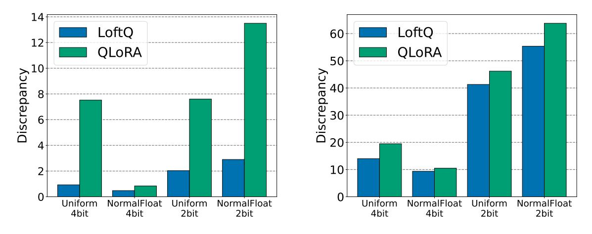

# 1 Introduction

The advent of Pre-trained Language Models (PLMs) has marked a transformative shift in the field of Natural Language Processing (NLP), offering versatile solutions across various applications [\(He et al.,](#page-14-1) [2021b;](#page-14-1) [Lewis et al.,](#page-14-2) [2019;](#page-14-2) [Touvron et al.,](#page-16-0) [2023\)](#page-16-0). They have showcased unparalleled proficiency in executing a variety of language tasks, including Natural Language Understanding (NLU) and Natural Language Generation (NLG). These models typically have millions or even billions of parameters, necessitating substantial computational and memory requirements. However, the extensive computational and memory demands of these models pose significant challenges,

∗Li, Yu, Liang and Zhao are affiliated with Georgia Tech. He, Karampatziakisand and Chen are affiliated with Microsoft Azure. Correspondence to <yixiaoli@gatech.edu>, <yyu429@gatech.edu> and <tourzhao@gatech.edu>.

\*\*Equal contributions

especially in real-world deployments where resources are often constrained and need to be shared among many users.

To mitigate the extensive storage requirements of pre-trained models, quantization serves as a pivotal compression technique [\(Zafrir et al.,](#page-16-1) [2019;](#page-16-1) [Shen et al.,](#page-15-0) [2020;](#page-15-0) [Bai et al.,](#page-13-0) [2022;](#page-13-0) [Dettmers et al.,](#page-14-3) [2022\)](#page-14-3), converting high-precision numerical values into a discrete set of values. Typically, model parameters, originally stored in a 16-bit float format, are transformed into a 4-bit integer format through quantization, resulting in a substantial 75% reduction in storage overhead. Additionally, to facilitate the adaptation of quantized pre-trained models to downstream tasks efficiently, Low-Rank Adaptation (LoRA) is a viable approach [\(Hu et al.,](#page-14-4) [2021\)](#page-14-4). This technique is a parameter-efficient fine-tuning method traditionally applied to high-precision pre-trained models. It is based on the hypothesis that the differences between fully fine-tuned weights and pre-trained weights exhibit low-rank properties. This allows these differences to be represented using low-rank matrices. As a result, the original pre-trained weights remain unaltered, with adaptations confined solely to these low-rank matrices, enabling effective task adaptation.

When quantizing pre-trained models, practitioners often concentrate primarily on the quantization technique, inadvertently neglecting the importance of subsequent LoRA fine-tuning [\(Dettmers](#page-14-0) [et al.,](#page-14-0) [2023;](#page-14-0) [Diao et al.,](#page-14-5) [2023\)](#page-14-5). For example, QLoRA inherits the fixup initialization [\(Zhang et al.,](#page-16-2) [2019\)](#page-16-2) used in LoRA, which [\(Dettmers et al.,](#page-14-0) [2023\)](#page-14-0) attaches zero initialized low-rank adapters (see Section [2.3\)](#page-4-0) to the quantized pre-trained model. The inevitable discrepancy introduced by quantization during the approximation of the original high-precision numbers, a scenario particularly pronounced in low-bit situations such as the 2-bit regime, can adversely impact the initialization of LoRA fine-tuning. As illustrated in Figure [1a,](#page-2-0) the quantized pre-trained model obtained by QLoRA exhibits severe degradation below the 3-bit level. This deviation in initialization often results in an inferior fine-tuning performance. As illustrated in Figure [1b,](#page-2-0) the fine-tuning performance drops as the quantization bit decreases when applying QLoRA. Moreover, it is noteworthy that QLoRA fails below the 3-bit level.

In this paper, we introduce a novel quantization framework, called LoRA-Fine-Tuning-aware Quantization (LoftQ). It is designed specifically for pre-trained models that require quantization and LoRA fine-tuning. This framework actively integrates low-rank approximation, working in tandem with quantization to jointly approximate the original high-precision pre-trained weights. This synergy significantly enhances alignment with the original pre-trained weights as illustrated in Figure [2.](#page-2-1) Consequently, our method provides an advantageous initialization point for subsequent LoRA fine-tuning, leading to improvements in downstream tasks.

We evaluate our quantization framework by conducting extensive experiments on downstream tasks, such as NLU, question answering, summarization, and NLG. Experiments show that LoftQ consistently outperforms QLoRA across all precision levels. For instance, with 4-bit quantization, we achieve a 1.1 and 0.8 gain in Rouge-1 for XSum [\(Narayan et al.,](#page-15-1) [2018\)](#page-15-1) and CNN/DailyMail [\(Hermann et al.,](#page-14-6) [2015\)](#page-14-6), respectively. LoftQ excels particularly in low-bit scenarios and works

- (a) Pre-trained LLAMA-2-13b on WikiText-2
- (b) Fine-tuned LLAMA-2-13b on WikiText-2

Figure 1: QLoRA performance with different bits. **Left:** QLoRA initialization of LLAMA-2-13b on WikiText-2. **Right:** Apply QLoRA to LLAMA-2-13b on WikiText-2 language modeling task. Smaller perplexity indicates better performance.

effectively with different quantization methods. For example, we achieve over an 8% gain on MNLI (Wang et al., 2019) and more than 10% on SQuADv1.1 (Rajpurkar et al., 2016) with both 2-bit NormalFloat and the 2-bit uniform quantization. We have not seen our approach performs worse than QLoRA.

- (a) Spectral norm of the initialization difference
- (b) Frobenius norm of the initialization difference

Figure 2: Initialization discrepancy between the LoRA initialization and the original pre-trained weight matrix, described by the spectral norm and Frobenius norm of the difference. The weight matrix in the above figures is randomly selected in BART-large. The initialization is obtained by QLoRA and LoftQ, with Uniform and NormalFloat quantization methods applied at both 2-bit and 4-bit levels. LoftQ successfully mitigates the discrepancy, especially at the 2-bit level.

