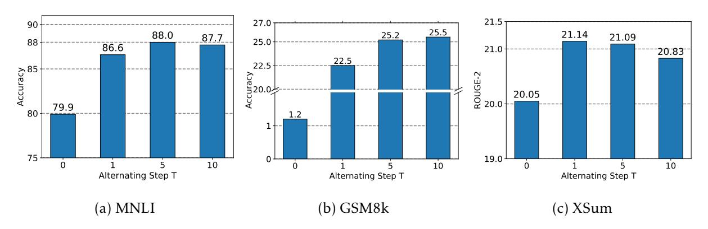

# 5 Discussion

Start with quantization or SVD in the alternating optimization? An alternative algorithm to the alternating optimization is that we first obtain the low-rank approximation *At ,Bt* and then obtain the quantized weight *Qt* by switching Line 3 and Line 4 in Algorithm [1.](#page-6-1) We note this is a valid alternative method as both still jointly minimize the objective in [\(6\)](#page-4-2). Table [6](#page-12-1) summarizes the performance of this alternative method. It is noteworthy that the alternative method still outperforms QLoRA significantly, even though it is worse than the primary version. This observation underscores the potential for performance improvement by achieving a closer

Figure 3: Comparison of different alternating step *T* used in LoftQ. *T* = 0 indicates we use QLoRA method that initializes low-rank adapters by [\(5\)](#page-4-1). *T* = 1*,*5*,*10 indicates we use different *T* for LoftQ described in Algorithm [1.](#page-6-1) Left: Uniform 2-bit DeBERTaV3-base. Middle: NF4 2-bit LLAMA-2-13b. Right: NF4 BART-large.

approximation of pre-trained weights within the low-precision regime.

Table 6: Results of 2-bit uniformly quantized DeBERTaV3-base on part of GLUE. LoftQ(SVD First) indicates the alternative LoftQ that swiches Line 3 and Line 4 in Algorithm [1.](#page-6-1) We report the median over four random seeds. The best results on each task are shown in bold.

| Method                   | Rank | MNLI m / mm | QNLI Acc | SST2 Acc |
|--------------------------|------|----------------|-------------|-------------|
| Full FT                  | -    | 90.5/90.6      | 94.0        | 95.3        |
| QLoRA                    | 32   | 79.9/79.5      | 83.8        | 86.6        |
| LoftQ(SVD First)         | 32   | 87.8/87.7      | 84.9        | 89.7        |
| LoftQ(Quantiztion First) | 32   | 88.0/88.1      | 92.2        | 94.7        |

