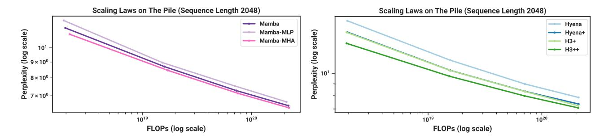
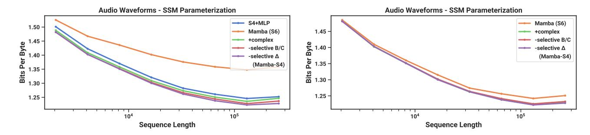

# Architecture and Training Details. Our models are:

- Transformer: The standard Transformer based on GPT3 (Table [12\)](#page-29-1).
- Transformer++: A Transformer with an improved architecture, namely rotary positional encodings (Su et al. [2021\)](#page-21-21) and SwiGLU MLP (Shazeer [2020\)](#page-21-12), and the improved training recipe above.
- Hyena: Interleaving a Hyena block (the H3 block with S4 replaced by a global convolution parameterized by an MLP) with standard MLP blocks. The MLP blocks have expansion factor 2 instead of 4 and the number of layers is correspondingly increased by 1.5× to preserve parameter count.
- H3++: The H3 architecture with a few modifications, including (i) using the same "thin" Hyena dimensions above (ii) the improved training recipe above (iii) a linear attention head dimension of 8.
- RWKV: The default RWKV model from B. Peng et al. [\(2023\)](#page-20-5), including its modified MLP block. We also used as much of its specified training recipe as possible, such as increasing the learning rates by 2× or 3× on certain parameters.
- RetNet: The default RetNet model from Y. Sun et al. [\(2023\)](#page-21-9). We also gave it the improved training recipe above.
- Mamba: The standard Mamba architecture, with the improved training recipe.

### E.2.2 Additional Scaling Law Ablations

We perform additional ablations on the architecture using the same protocol as the 2k context length scaling laws in Figure [4](#page-10-3) (Left).

Mamba Architecture: Interleaving Blocks. We test the effect of different architectural blocks combined with the Mamba block. We focus on the viewpoint that the Mamba block is simply the standard SwiGLU block with an extra conv → SSM path added. This leads to two natural ablations:

• What if the Mamba block is interleaved with a standard MLP block, instead of stacked homogenously? This can also be interpreted as taking Mamba and removing half of the SSMs.

Figure 9: (Scaling laws: extra ablations.) (Left) Instead of (Right) Instead of

• What if the Mamba block is interleaved with MHA (multi-head attention) blocks? This can also be interpreted as taking a Transformer with SwiGLU MLPs (i.e. what we call Transformer++) and simply adding SSMs to the MLP blocks.

Figure 9 (*Right*) shows these variants compared to the original (homogenous) Mamba architecture. Interestingly, neither change matters too much. The Mamba-MLP architecture is only slightly worse, and still better than all models except Transformer++. The Mamba-MHA architecture is only slightly better, which is somewhat surprising in light of the fact that many recent works have found that combining (LTI) SSMs with Attention can lead to substantial improvements (Dao, Fu, Saab, et al. 2023; Fathi et al. 2023; Fathullah et al. 2023; Saon, Gupta, and Cui 2023; Zuo et al. 2022).

**H3 Architecture: Training Recipes.** Next we ablate differences between the Hyena and H3++ models, our weakest and strongest models outside of Transformer++ and Mamba, particularly to isolate the effect of training recipes.

- Hyena: The Hyena block with its original architecture and GPT3 training recipe (same as Figure 4).
- Hyena+: The same architecture but with the improved training recipe described above.
- H3+: The same architecture as Hyena+ but with the Hyena convolution kernel swapped out for S4D convolution kernel.
- **H3++**: The same as H3+, but with a linear attention *head dimension* of 8. This increases computation inside the SSM recurrence but does not increase parameters.

Our general convention is that "Model+" represents the base model with the improved training recipe, and "Model++" also allows for architectural changes.

Figure 9 (Right) shows that

- A large improvement is achieved by the improved training recipe, which was used for many of the models in the main Figure 4 (RetNet, H3++, Transformer++, Mamba).
- The choice of the inner LTI SSM does not matter (e.g. Hyena vs. S4), consistent with findings throughout this paper.
- The head dimension expansion improves performance, consistent with one of our main themes that expanded state dimension improves performance for SSMs (Section 3).

#### **E.2.3** Downstream Evaluation Details

This pretraining procedure is the same as the scaling law protocol, but extended to 300B tokens and with the GPT-NeoX tokenizer (Black et al. 2022) instead of GPT2 tokenizer. For the 1.3B model, we use a batch size of 1M tokens to be consistent with the GPT3 specifications. We report the perplexity on the Pile validation set, and for this metric only compare to models trained on the same dataset and with the same tokenizer, in particular Pythia and RWKV.

For downstream evaluation, we use the LM evaluation harness from EleutherAI (L. Gao, Tow, et al. 2021), as done by most work in this area. We evaluate on the following tasks/datasets that measure common sense reasoning:

- LAMBADA (Paperno et al. 2016)
- HellaSwag (Zellers et al. 2019)

- PIOA (Bisk et al. 2020)
- ARC-challenge (P. Clark et al. 2018)
- · ARC-easy: an easy subset of ARC-challenge
- WinoGrande (Sakaguchi et al. 2021)

We report accuracy for LAMBADA, WinoGrande, PIQA, and ARC-easy, and accuracy normalized by sequence length for HellaSwag and ARC-challenge (since normalized accuracy is higher for almost all models for these task).

### E.3 DNA Modeling

### E.3.1 Pretraining Details

We describe the dataset and training procedure of the HG38 pretraining task in more detail.

The dataset follows the splits from the prior Enformer work on genomics (Avsec et al. 2021); the training split contains a total of S = 34021 segments of length  $2^{17} = 131072$  that cover the genome, for a total of approximately 4.5 billion tokens (DNA base pairs). These segments are pairs of (chromosome number, starting index, ending index), and can be extended if necessary (e.g. to get longer segments).

We deviate from HyenaDNA when the training sequence length is not  $2^{17}$ . HyenaDNA always takes a fixed sub-segment (e.g. the beginning or middle of the prescribed segment), and thus for any training sequence length each epoch is fixed to 34021 samples and doesn't necessarily go through the whole genome. On the other hand, we use the entire training data:

- When the context length L is less than (or equal to)  $2^{17}$ , we divide up each segment into non-overlapping sub-segments of length L, so that there are  $S \times \frac{2^{17}}{L}$  total samples and  $S \times 2^{17} \approx 4.5B$  tokens per epoch.
- When the context length L is greater than  $2^{17}$ , we turn each segment into two samples, one that begins with the prescribed segment and one that ends with the prescribed segment. Thus each epoch has 2S items and 2SL tokens per epoch. For example, at sequence length  $2^{18} = 262144$  there are  $4\times$  as many tokens as the default, and at sequence length  $2^{20}$  there are  $16\times$  as many tokens.

Other training details generally follow the same protocol as our language modeling experiments (Appendix E.2). For example, we use the AdamW with  $(\beta_1, \beta_2) = (0.9, 0.95)$ , no dropout, weight decay 0.1. We use a cosine learning rate scheduler with linear warmup for 10% of total steps.

### E.3.2 Scaling: Model Size Details

**Models.** The models we consider are:

- Transformer++: a Transformer with improved architecture, notably the usage of RoPE positional encodings (Su et al. 2021). Informally, we found these to be noticeably better than vanilla positional encodings from (Vaswani et al. 2017).
- HyenaDNA: the Hyena model from Nguyen, Poli, et al. (2023) and Poli et al. (2023), which is roughly a Transformer with the MHA block replaced by an H3 block using a global convolution parameterized by an MLP.
- Mamba: the standard Mamba architecture.

**Model Sizes.** We use the following model sizes.

| Вьоскя           | 4    | 5    | 6    | 7    | 8    | 10    | 12    |
|------------------|------|------|------|------|------|-------|-------|
| Model Dimension  | 64   | 96   | 128  | 192  | 256  | 384   | 512   |
| PARAMS (APPROX.) | 250K | 700K | 1.4M | 3.5M | 7.0M | 19.3M | 40.7M |

Note that the number of blocks for Mamba is doubled, because one Transformer "layer" includes both the MHA and MLP blocks (and similarly for Hyena), which requires two Mamba blocks to match parameters (Section 3.4).

**Training.** For each model (Transformer++, HyenaDNA, Mamba), we swept the learning rate across  $\{1e-3, 2e-3, 4e-3, 8e-3\}$ . The optimal Transformer and HyenaDNA learning rates were 2e-3 across all sizes. The optimal Mamba learning rate was 8e-3; note that Mamba performed better than baselines with matched learning rates (2e-3), but was more stable and improved even more at higher learning rates. (Furthermore, as this LR is on the upper range of the sweep, it is possible that our results are still suboptimal.)

Note that, in contrast to standard LM scaling laws (Table 12), our LR held constant across model sizes for simplicity. The optimal LR should go down for larger models, but we didn't find a noticeable effect at the small model sizes (at most a few million parameters) we considered.

#### E.3.3 Scaling: Context Length Details

We use a total batch size of  $2^{24} \approx 16M$  tokens per training step, for every sequence length (e.g. at length  $2^{20}$  there are 16 segments per batch and at length  $2^{10}$  there are 16384 segments per batch). This is a large batch size relative to the model size by usual LM standards, but note that a batch size of  $2^{23}$  is the minimum possible on a machine with 8 GPUs and sequence length of  $2^{20}$ , and that HyenaDNA used much larger batches of  $2^{28}$ .

The learning rate used was 0.008 for Mamba and 0.001 for HyenaDNA; we initially attempted to use the same learning rate of 0.002 from the previous section for HyenaDNA, but found that it was unstable at the longest context length.

**Sequence Length Warmup.** Following (Nguyen, Poli, et al. 2023), we use sequence length warmup (SLW) during pretraining. We choose a simple schedule of 2 epochs at each power-of-two sequence length starting from  $2^{10} = 1024$ . (Note that because of how data is curated, at the longest sequence lengths more steps and tokens are spent proportionally. In particular, each stage up to length  $2^{17}$  processes the same number of tokens, but  $4\times$  as many tokens are processed at length  $2^{18}$ ,  $8\times$  as many at length  $2^{19}$ , and  $16\times$  as many at length  $2^{20}$ .)

Unlike HyenaDNA, we always control for the number of tokens per gradient update, so the batch size is successively halved as the sequence lengths are doubled in each stage.

**Remark E.1.** We also note that the schedule was not tuned, and we never experimented with turning off sequence length warmup for these pretraining experiments. We later found that SLW did not help noticeably for audio pretraining at similar lengths (Section 4.4), and it is possible that it is not necessary for DNA pretraining either.

### E.3.4 Species (Great Apes) Classification

Models are causal and therefore only the last element (across the sequence length) of the model's output is used for the classification head. Note that we control for the total number of elements in the loss function per gradient step. The pretraining objective includes all positions across the sequence length, so that batch\_size × sequence\_length is held constant; in other words, the batch size decreases as the sequence length increases. However, for a classification task, since only the last position enters the loss, the batch size itself is held constant. Note that this also means that fine-tuning models with longer sequence lengths is more computationally expensive.

Training consists of 10 epochs, each of which has 1024 gradient steps. Each gradient step uses batch size 64, which are all independently randomly drawn by uniformly picking a species, uniformly picking a chromosome, and then uniformly picking a contiguous segment of DNA.

Following (Nguyen, Poli, et al. 2023), models with a maximum context length greater than  $2^{14} = 16384$  use sequence length warmup with 1 epoch at length  $2^{14} = 16384$ , 1 epoch at length  $2^{15} = 32768$ , 1 epoch at length  $2^{16} = 65536$ , and so on up to the maximum sequence length. For example, the model with  $2^{20} = 1048576$  context undergoes 6 epochs of sequence length warmup before 4 more epochs at its maximum sequence length.

The learning rate for all Hyena models is 4e - 5, while the learning rate for all Mamba models is 1e - 4. These were found by performing learning rate sweeps for each model among  $\{1e - 5, 2e - 5, 4e - 5, 1e - 4, 2e - 4\}$  for the smaller sequence lengths  $(2^{10}, 2^{12}, 2^{14}, 2^{16})$ , and these values were consistently found to be the best for each model. An abridged learning rate sweep was done at length  $2^{18}$ , which agreed with these values, and a single run at length  $2^{20}$  was performed (as described above, the computational cost of these experiments is proportional to the sequence length). The learning rate followed a cosine decay schedule with warmup with 5 epochs of linear warmup to the maximum learning rate, and 5 epochs of cosine decay down to 1e - 6. The unusually long learning rate warmup schedule was chosen because the sequence length

Table 13: (**Great Apes DNA Classification**.) Accuracy after fine-tuning on sequences of length  $2^{10} = 1024$  up to  $2^{20} = 1048576$  using pretrained models of the same context length. Random guessing is 20%.

| Model    | Params | Accuracy (%) at Sequence Length |          |          |          |          |          |
|----------|--------|---------------------------------|----------|----------|----------|----------|----------|
|          |        | $2^{10}$                        | $2^{12}$ | $2^{14}$ | $2^{16}$ | $2^{18}$ | $2^{20}$ |
| HyenaDNA | 1.4M   | 28.04                           | 28.43    | 41.17    | 42.22    | 31.10    | 54.87    |
| Mamba    | 1.4M   | 31.47                           | 27.50    | 27.66    | 40.72    | 42.41    | 71.67    |
| Mamba    | 7M     | 30.00                           | 29.01    | 31.48    | 43.73    | 56.60    | 81.31    |

Table 14: YouTubeMix length scaling sequence lengths and batch sizes.

| Sequence length            | BATCH SIZE | Tokens / batch |
|----------------------------|------------|----------------|
| $468 \times 2048 = 958464$ | 1          | 958464         |
| $234 \times 2048 = 479232$ | 2          | 958464         |
| $117 \times 2048 = 239616$ | 4          | 958464         |
| $59 \times 2048 = 120832$  | 8          | 966656         |
| $30 \times 2048 = 61440$   | 16         | 983040         |
| $15 \times 2048 = 30720$   | 32         | 983040         |
| $8 \times 2048 = 16384$    | 64         | 1048576        |
| $4 \times 2048 = 8192$     | 128        | 1048576        |

warmup was also long (e.g. comprising 6 out of 10 epochs for the model with context length 220); we did not experiment with this choice.

Results for the Species classification task are in Table 13.

#### E.4 Audio Details

#### E.4.1 YouTubeMix Audio Pretraining

**Model.** We use a model with 3 blocks per stage ( $3 \times 5 = 15$  total Mamba blocks), pooling factor p = 16, and outer dimension D = 64, for about 3.5M parameters.

**Dataset.** The data is mu-law encoded at 8 bits, so the model is modeling discrete tokens with a vocab size of 256.

The dataset consists of clips of up to 1 minute long, or length 960000, which is subsampled and divided into segments of any desired sequence length. Since the architecture involves two stages of pooling by a factor of 16, and we want the resulting sequence length to be a multiple of 8 for hardware efficiency, the longest possible sequence is  $468 \times 2048 = 958464$ . The rest of our sequence lengths are defined by successively halving this and rounding up to the nearest multiple of 2048.

Table 14 lists the specifications used in Figure 7. Beyond the varying batch sizes, the number of valid segments in the training set varied between different sequence lengths (e.g. the number of training steps per epoch was not constant for different points in the graph), which may have contributed to kinks in the scaling curves.

**Training.** Models were trained for 200*K* training steps with a maximum learning rate of 0.002, 20*K* (10%) warmup steps, and weight decay 0.1 (similar to our general pretraining recipe across domains).

**Additional Ablations: SSM Parameterizations.** We investigate SSM parameterizations on long-form audio waveform pretraining in the setting of Figure 7. The setting is modified slightly to use larger models (8 layers and D = 64 for 6M params, the SaShiMi default), shorter sequences ( $2^{11} = 2048$  to  $2^{18} = 262144$  instead of  $2^{13}$  to  $2^{20}$ ), lower LR (0.001 from 0.002), and shorter training cycles (100K instead of 200K steps).

Figure 10 shows that the change from  $S4 \rightarrow S6$  (i.e. the selection mechanism) is not always beneficial. On long-form audio waveforms, it in fact significantly hampers performance, which may be intuitive from the point of view that audio

Figure 10: (**Audio Pretraining (YouTubeMix) Ablations**.) As a uniformly-sampled "continuous" signal modality, audio waveforms actually benefit from LTI models which have matching inductive bias. (*Left*) Homogenous models (all blocks have the same parameterization) (*Right*) Only the center U-Net blocks are ablated; the outer blocks are Mamba-S4. Purple line is same as figure on left.

is uniformly sampled and very smooth, and therefore benefits from continuous linear time-invariant (LTI) methods. After ablating away the selection mechanism, note that the resulting model is the S4 layer inside the Mamba block. To disambiguate, we call this Mamba-S4 as opposed the default Mamba architecture Mamba-S6.

However, on the right side, we keep the outer layers of the U-Net Mamba-S4 and ablate only the inner layers. The performance differences shrink dramatically; this reinforces the hypothesis that layers closer to the *raw* audio signal should be LTI, but once they are "tokenized" and compressed by the outer layers, the inner layers no longer need to be LTI. In this setting however, the real-valued SSM still underperforms the complex-valued one.

### E.4.2 SC09 Speech Generation

Autoregressive training largely followed the autoregressive language modeling protocol, such as

- · Weight decay 0.1
- Learning rate warmup for 10% of total steps
- AdamW optimizer with  $\beta = (0.9, 0.95)$
- Gradient clip value 0.1

We used a learning rate of 0.002 and 200000 training steps at a batch size of 16.

The large Mamba model in Table 4 has 15 layers per stage with an outer dimension of D = 96 and pooling factor 4. We note that this dataset is small (training went through 100 epochs) and for this large model, there was significant overfitting of the BPB or NLL. However, automated metrics of generated samples continually improving throughout training.

The models in the architecture ablations in Table 5 all have 8 layers per stage with an outer dimension of D = 64 and pooling factor 4. The S4+MLP block has roughly  $2D^2 + 4D^2$  parameters (expansion factor 2 in the MLP). The Transformer block has  $4D^2 + 2D^2$  parameters (expansion factor 1 in the MLP). The Mamba block has the usual  $\approx 6D^2$  parameters. All models have roughly 6M total parameters.

## E.5 Efficiency Benchmark

**Scan Operation.** We compare the core operation of selective SSMs, which is the parallel scan (Section 3.3), against convolution and attention, measured on an A100 80GB PCIe GPU. Note that these do not include the cost of other operations outside of this core operation, such as computing the convolutional kernel in global-convolution models, or computing the OKV projections in attention.

As a baseline, we implement a standard parallel scan in PyTorch with no kernel fusion. This requires materializing the parameters  $\overline{A}$ ,  $\overline{B}$ , C in HBM.

Our scan implementation fuses the discretization step and the parallel scan, avoiding the cost of materializing all the large parameters in HBM.

Table 15: (Memory benchmark.) Mamba's memory footprint is comparable to the most optimized Transformer. Results for 125M models.

| Batch size | Transformer (w/ FlashAttention-2) | Mamba  |
|------------|-----------------------------------|--------|
| 1          | 4.6GB                             | 4.8GB  |
| 2          | 5.2GB                             | 5.8GB  |
| 4          | 6.9GB                             | 7.3GB  |
| 8          | 11.5GB                            | 12.3GB |
| 16         | 20.7GB                            | 23.1GB |
| 32         | 34.5GB                            | 38.2GB |
|            |                                   |        |

For convolution, we use the standard implementation in PyTorch, which separately performs FFTs on the inputs and the filters, multiply them in frequency domain, then performs an inverse FFT to obtain the result. The theoretical complexity is  $O(L \log(L))$  for sequence length L.

For attention, we compare against the fastest implementation that we are aware of (FlashAttention-2 (Dao 2024)), with causal mask. Note that FlashAttention-2 with causal mask is about 1.7× faster than without causal mask, since approximately only half of the attention entries are computed.

We use batch size of 1 and increase the sequence length from  $2^9 = 512$ ,  $2^{10} \approx 1K$ ,  $2^{11} \approx 2K$ , up to  $2^{19} \approx 500K$  (some of the baselines run out of memory before reaching 500K). We use a model dimension of D = 1024 and state dimension N = 16. We measure with BF16 inputs, which is the data type most commonly used for large scale training.

**End-to-end Inference.** We measure the inference throughput of a Mamba 1.4B model and an untrained Mamba 6.9B model, against a standard Transformer (GPT3 architecture) at 1.3B and 6.7B size. We use the standard Transformer implementation in the Huggingface transformers library.

We set the prompt length to be 2048 and the generation length to be 128. We vary the batch size from 1, 2, 4, 8, 16, 32, 64, to 128, and measure time taken to generate 128 tokens. We then calculate the throughput (tokens/s) as batch size  $\times$  128/time taken. We repeat the measurements 3 times and take the average. Measurements are done on an A100 80GB PCIe GPU

**Memory Benchmark.** The memory usage simply scales proportionally to the size of the activation tensors, as with most deep sequence models. We report measurements of the training memory requirements of 125M models on 1 A100 80GB GPU. Each batch consists of sequences of length 2048. We compare to the most memory-efficient Transformer implementation we are aware of (with kernel fusion from torch.compile and with FlashAttention-2). Table 15 shows that Mamba's memory requirement is comparable to a similar-sized Transformer with an extremely optimized implementation, and we expect further improvement in Mamba's memory footprint in the future.