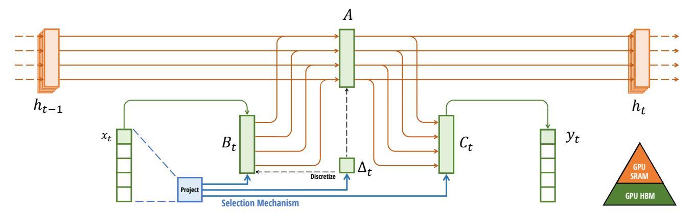

# Selective State Space Model

with Hardware-aware State Expansion

Figure 1: (**Overview**.) Structured SSMs independently map each channel (e.g. D=5) of an input x to output y through a higher dimensional latent state h (e.g. N=4). Prior SSMs avoid materializing this large effective state (DN, times batch size B and sequence length L) through clever alternate computation paths requiring time-invariance: the ( $\Delta$ , A, B, C) parameters are constant across time. Our selection mechanism adds back input-dependent dynamics, which also requires a careful hardware-aware algorithm to only materialize the expanded states in more efficient levels of the GPU memory hierarchy.

1-dimensional function or sequence  $x(t) \in \mathbb{R} \mapsto y(t) \in \mathbb{R}$  through an implicit latent state  $h(t) \in \mathbb{R}^N$ .

Concretely, S4 models are defined with four parameters ( $\Delta$ , A, B, C), which define a sequence-to-sequence transformation in two stages.

$$h'(t) = Ah(t) + Bx(t)$$
 (1a)  $h_t = \overline{A}h_{t-1} + \overline{B}x_t$  (2a)  $\overline{K} = (C\overline{B}, C\overline{A}\overline{B}, \dots, C\overline{A}^k\overline{B}, \dots)$  (3a)  $y(t) = Ch(t)$  (1b)  $y_t = Ch_t$  (2b)  $y = x * \overline{K}$  (3b)

**Discretization.** The first stage transforms the "continuous parameters"  $(\Delta, A, B)$  to "discrete parameters"  $(\overline{A}, \overline{B})$  through fixed formulas  $\overline{A} = f_A(\Delta, A)$  and  $\overline{B} = f_B(\Delta, A, B)$ , where the pair  $(f_A, f_B)$  is called a *discretization rule*. Various rules can be used such as the zero-order hold (ZOH) defined in equation (4).

$$\overline{A} = \exp(\Delta A)$$
  $\overline{B} = (\Delta A)^{-1}(\exp(\Delta A) - I) \cdot \Delta B$  (4)

Discretization has deep connections to continuous-time systems which can endow them with additional properties such as resolution invariance (Nguyen, Goel, et al. 2022) and automatically ensuring that the model is properly normalized (Gu, Johnson, Timalsina, et al. 2023; Orvieto et al. 2023). It also has connections to gating mechanisms of RNNs (Gu, Gulcehre, et al. 2020; Tallec and Ollivier 2018) which we will revisit in Section 3.5. However, from a mechanical point of view discretization can simply be viewed as the first step of the computation graph in the forward pass of an SSM. Alternate flavors of SSMs can bypass the discretization step and parameterize  $(\overline{A}, \overline{B})$  directly instead (Zhang et al. 2023), which may be easier to reason about.

**Computation.** After the parameters have been transformed from  $(\Delta, A, B, C) \mapsto (\overline{A}, \overline{B}, C)$ , the model can be computed in two ways, either as a **linear recurrence** (2) or a **global convolution** (3).

Commonly, the model uses the convolutional mode (3) for efficient parallelizable training (where the whole input sequence is seen ahead of time), and switched into recurrent mode (2) for efficient autoregressive inference (where the inputs are seen one timestep at a time).

**Linear Time Invariance (LTI).** An important property of equations (1) to (3) is that the model's dynamics are constant through time. In other words ( $\Delta$ , A, B, C), and consequently ( $\overline{A}$ ,  $\overline{B}$ ) as well, are fixed for all time-steps. This property is

called *linear time invariance (LTI)*, which is deeply connected to recurrence and convolutions. Informally, we think of LTI SSMs as being equivalent to any linear recurrence (2a) or convolution (3b), and use LTI as an umbrella term for these classes of models.

Thus far, all structured SSMs have been LTI (e.g. computed as convolutions) because of fundamental efficiency constraints, discussed in Section 3.3. However, a core insight of this work is that LTI models have fundamental limitations in modeling certain types of data, and our technical contributions involve removing the LTI constraint while overcoming the efficiency bottlenecks.

**Structure and Dimensions.** Finally, we note that structured SSMs are so named because computing them efficiently also requires imposing structure on the *A* matrix. The most popular form of structure is diagonal (Gu, Gupta, et al. 2022; Gupta, Gu, and Berant 2022; Smith, Warrington, and Linderman 2023), which we also use.

In this case, the  $A \in \mathbb{R}^{N \times N}$ ,  $B \in \mathbb{R}^{N \times 1}$ ,  $C \in \mathbb{R}^{1 \times N}$  matrices can all be represented by N numbers. To operate over an input sequence x of batch size B and length L with D channels, the SSM is applied independently to each channel. Note that in this case, the total hidden state has dimension DN per input, and computing it over the sequence length requires O(BLDN) time and memory; this is the root of the fundamental efficiency bottleneck addressed in Section 3.3.

General State Space Models. We note that the term *state space model* has a very broad meaning which simply represents the notion of any recurrent process with a latent state. It has been used to refer to many disparate concepts in different disciplines, including Markov decision processes (MDP) (reinforcement learning (Hafner et al. 2020)), dynamic causal modeling (DCM) (computational neuroscience (Friston, Harrison, and Penny 2003)), Kalman filters (controls (Kalman 1960)), hidden Markov models (HMM) and linear dynamical systems (LDS) (machine learning), and recurrent (and sometimes convolutional) models at large (deep learning).

Throughout this entire paper we use the term "SSM" to refer exclusively to the class of structured SSMs or S4 models (Gu, Goel, and Ré 2022; Gu, Gupta, et al. 2022; Gupta, Gu, and Berant 2022; Hasani et al. 2023; Ma et al. 2023; Smith, Warrington, and Linderman 2023) and use these terms interchangeably. For convenience we may also include derivatives of such models, such as those focusing on either the linear-recurrence or global-convolution viewpoints (Y. Li et al. 2023; Orvieto et al. 2023; Poli et al. 2023), and clarify nuances when necessary.

**SSM Architectures.** SSMs are standalone sequence transformations that can be incorporated into end-to-end neural network architectures. (We also sometimes call SSM architectures SSNNs, which are to SSM layers as CNNs are to linear convolution layers.) We discuss some of the most well-known SSM architectures, many of which will also serve as our primary baselines.

- Linear attention (Katharopoulos et al. 2020) is an approximation of self-attention involving a recurrence which can be viewed as a degenerate linear SSM.
- H3 (Dao, Fu, Saab, et al. 2023) generalized this recurrence to use S4; it can be viewed as an architecture with an SSM sandwiched by two gated connections (Figure 3). H3 also inserts a standard local convolution, which they frame as a shift-SSM, before the main SSM layer.
- Hyena (Poli et al. 2023) uses the same architecture as H3 but replaces the S4 layer with an MLP-parameterized global convolution (Romero et al. 2021).
- RetNet (Y. Sun et al. 2023) adds an additional gate to the architecture and uses a simpler SSM, allowing an alternative parallelizable computation path, using a variant of multi-head attention (MHA) instead of convolutions.
- RWKV (B. Peng et al. 2023) is a recent RNN designed for language modeling based on another linear attention approximation, the attention-free Transformer (S. Zhai et al. 2021). Its main "WKV" mechanism involves LTI recurrences and can be viewed as the ratio of two SSMs.

Other closely related SSMs and architectures are discussed further in an extended related work (Appendix B). We highlight in particular S5 (Smith, Warrington, and Linderman 2023), QRNN (Bradbury et al. 2016), and SRU (Lei et al. 2017), which we view as the most closely related methods to our core selective SSM.

