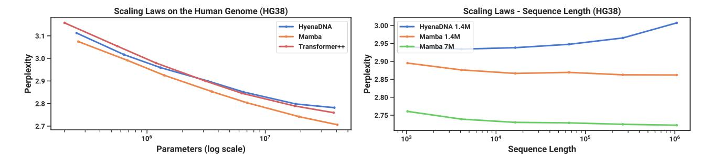
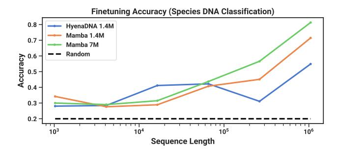
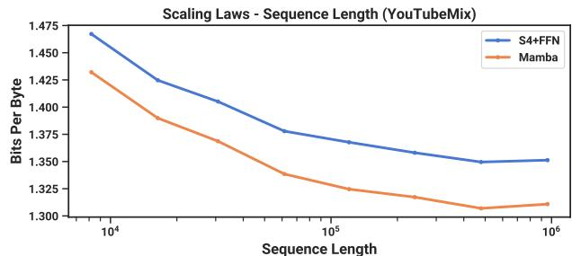

# 4.3 DNA Modeling

Motivated by the success of large language models, there has been recent exploration into using the foundation model paradigm for genomics. DNA has been likened to language in that it consists of sequences of discrete tokens with a finite vocabulary. It is also known for requiring long-range dependencies to model (Avsec et al. [2021\)](#page-17-10). We investigate Mamba as a FM backbone for pretraining and fine-tuning in the same setting as recent works on long-sequence models for DNA (Nguyen, Poli, et al. [2023\)](#page-20-8). In particular, we focus on two explorations of scaling laws across model size and sequence length (Figure [5\)](#page-12-1), and a difficult downstream synthetic classification task requiring long context (Figure [6\)](#page-13-1).

For pretraining, we largely follow a standard causal language modeling (next token prediction) setup for the training and model details (see also Appendix [E.2\)](#page-28-2). For the dataset, we largely follow the setup of HyenaDNA (Nguyen, Poli, et al. [2023\)](#page-20-8), which uses the HG38 dataset for pretraining consisting of a single human genome with about 4.5 billion tokens (DNA base pairs) in the training split.

Figure 5: (**DNA Scaling Laws**.) Pretraining on the HG38 (human genome) dataset. (Left) Fixing short context length  $2^{10} = 1024$  and increasing size from  $\approx 200K$  to  $\approx 40M$  parameters, Mamba scales better than baselines. (Right) Fixing model size and increasing sequence lengths while keeping tokens/batch and total training tokens fixed. Unlike baselines, the selection mechanism of Mamba facilitates better performance with increasing context length.

#### 4.3.1 Scaling: Model Size

In this experiment, we investigate the scaling properties of genomics foundation models with various model backbones (Figure 5 *Left*).

**Training.** To advantage the baselines, we train on a short sequence length of 1024; as shown in Section 4.3.2, we expect results to favor Mamba even more at longer sequence lengths. We fix a global batch size of 1024, for a total of  $2^{20} \approx 1M$  tokens per batch. Models were trained for 10K gradient steps for a total of 10B tokens.

**Results.** Figure 5 (*Left*) shows that Mamba's pretraining perplexity improves smoothly with model size, and that Mamba scales better than both HyenaDNA and Transformer++. For example, at the largest model size of  $\approx 40M$  parameters, the curve shows that **Mamba can match the Transformer++ and HyenaDNA models with roughly**  $3\times$  **to**  $4\times$  **fewer parameters**.

#### 4.3.2 Scaling: Context Length

In the next DNA experiment, we investigate the scaling properties of models with respect to sequence length. We only compare the HyenaDNA and Mamba models, as quadratic attention becomes prohibitively expensive at longer sequence lengths. We pretrain models on sequence lengths  $2^{10} = 1024$ ,  $2^{12} = 4096$ ,  $2^{14} = 16384$ ,  $2^{16} = 65536$ ,  $2^{18} = 262144$ ,  $2^{20} = 1048576$ . We fix a model size of 6 layers by width 128 (about 1.3M-1.4M parameters). Models were trained for 20K gradient steps for a total of  $\approx 330B$  tokens. The longer sequence lengths used sequence length warmup similar to (Nguyen, Poli, et al. 2023).

**Results.** Figure 5 (*Right*) shows that **Mamba is able to make use of longer context even up to extremely long sequences of length 1M, and its pretraining perplexity improves as the context increases. On the other hand, the HyenaDNA model gets worse with sequence length. This is intuitive from the discussion in Section 3.5 on properties of the selection mechanism. In particular, LTI models cannot selectively ignore information; from a convolutional perspective, a very long convolution kernel is aggregating all information across a long sequence which may be very noisy. Note that while HyenaDNA claims to improve with longer context, their results do not control for computation time.** 

#### 4.3.3 Synthetic Species Classification

We evaluate models on a downstream task of classifying between 5 different species by randomly sampling a contiguous segment of their DNA. This task is adapted from HyenaDNA, which used the species {human, lemur, mouse, pig, hippo}. We modify the task to be significantly more challenging by classifying between the five *great apes* species {human, chimpanzee, gorilla, orangutan, bonobo}, which are known to share 99% of their DNA.

Figure 6: (**Great Apes DNA Classification**.) Accuracy after fine-tuning on sequences of length  $2^{10} = 1024$  up to  $2^{20} = 1048576$  using pretrained models of the same context length. Numerical results in Table 13.

Figure 7: (Audio Pretraining.) Mamba improves performance over prior state-of-the-art (Sashimi) in autoregressive audio modeling, while improving up to minute-long context or million-length sequences (controlling for computation).

### 4.4 Audio Modeling and Generation

For the audio waveform modality, we compare primarily to the SaShiMi architecture and training protocols (Goel et al. 2022). This model comprises:

- 1. a U-Net backbone with two stages of pooling by a factor p that doubles the model dimension D per stage,
- 2. alternating S4 and MLP blocks in each stage.

We consider replacing the S4+MLP blocks with Mamba blocks. Experiment details are in Appendix E.4.

#### 4.4.1 Long-Context Autoregressive Pretraining

We evaluate pretraining quality (autoregressive next-sample prediction) on YouTubeMix (DeepSound 2017), a standard piano music dataset used by prior work consisting of 4 hours of solo piano music, sampled at a rate of 16000 Hz. Pretraining details largely follow the standard language modeling setup (Section 4.2). Figure 7 evaluates the effect of increasing training sequence lengths from  $2^{13} = 8192$  to  $2^{20} \approx 10^6$ , while keeping computation fixed. (There are some slight edge cases to the way the data is curated, which may lead to kinks in the scaling curves. For example, only minute-long clips were available so the maximum sequence length is actually bounded by  $60s \cdot 16000Hz = 960000$ .)

Both Mamba and the SaShiMi (S4+MLP) baseline improve consistently with longer context lengths; Mamba is better throughout, and the gap widens at longer lengths. The main metric is bits per byte (BPB), which is a constant factor log(2) of the standard negative log-likelihood (NLL) loss for pretraining other modalities.

We note one important detail: this is the only experiment in this paper in which we switched from the real parameterization to complex (Section 3.6). We show additional ablations in Appendix E.4.

#### 4.4.2 Autoregressive Speech Generation

SC09 is a benchmark speech generation dataset (Donahue, McAuley, and Puckette 2019; Warden 2018), consisting of 1-second clips sampled at 16000 Hz of the digits "zero" through "nine" with highly variable characteristics. We largely follow the autoregressive training setup and generation protocol of Goel et al. (2022).

Table 4 shows automated metrics of the Mamba-UNet model compared to a variety of baselines from Goel et al. (2022): WaveNet (Oord et al. 2016), SampleRNN (Mehri et al. 2017), WaveGAN (Donahue, McAuley, and Puckette 2019), DiffWave (Z. Kong et al. 2021), and SaShiMi. A small Mamba model outperforms the state-of-the-art (and much larger) GAN-and diffusion-based models. A larger model parameter-matched to the baselines further improves on fidelity metrics dramatically.

Table 5 takes the small Mamba model and investigates combinations of different architectures for the outer stages and center stage. It shows that Mamba is consistently better than S4+MLP in the outer blocks, and Mamba > S4+MLP > MHA+MLP in the center blocks.

Table 4: (**SC09**) Automated metrics for unconditional generation on Table 5: (**SC09 Model Ablations**) Models with 6M parameters. In a challenging dataset of fixed-length speech clips. (*Top to Bottom*) SaShiMi's U-Net backbone, there are 8 center blocks operating on Autoregressive baselines, non-autoregressive baselines, Mamba, and sequence length 1000, sandwiched on each side by 8 outer blocks on sequence length 4000, sandwiched by 8 outer blocks on sequence

| Model     | Params | NLL ↓ | FID ↓ | IS ↑ | мIS ↑ | AM↓  |
|-----------|--------|-------|-------|------|-------|------|
| SampleRNN | 35.0M  | 2.042 | 8.96  | 1.71 | 3.02  | 1.76 |
| WaveNet   | 4.2M   | 1.925 | 5.08  | 2.27 | 5.80  | 1.47 |
| SaShiMi   | 5.8M   | 1.873 | 1.99  | 5.13 | 42.57 | 0.74 |
| WaveGAN   | 19.1M  | -     | 2.03  | 4.90 | 36.10 | 0.80 |
| DiffWave  | 24.1M  | -     | 1.92  | 5.26 | 51.21 | 0.68 |
| + SaShiMi | 23.0M  | -     | 1.42  | 5.94 | 69.17 | 0.59 |
| Mamba     | 6.1M   | 1.852 | 0.94  | 6.26 | 88.54 | 0.52 |
| Mamba     | 24.3M  | 1.860 | 0.67  | 7.33 | 144.9 | 0.36 |
| Train     | -      | -     | 0.00  | 8.56 | 292.5 | 0.16 |
| Test      | -      | -     | 0.02  | 8.33 | 257.6 | 0.19 |
|           |        |       |       |      |       |      |

Table 5: (SC09 Model Ablations) Models with 6M parameters. In SaShiMi's U-Net backbone, there are 8 center blocks operating on sequence length 1000, sandwiched on each side by 8 outer blocks on sequence length 4000, sandwiched by 8 outer blocks on sequence length 16000 (40 blocks total). The architecture of the 8 center blocks are ablated independently of the rest. Note that Transformers (MHA+MLP) were not tested in the more important outer blocks because of efficiency constraints.

| OUTER                                        | Center                                                   | NLL ↓                                                            | FID↓                                         | IS ↑                                                       | мIS ↑                                              | AM ↓                                                       |
|----------------------------------------------|----------------------------------------------------------|------------------------------------------------------------------|----------------------------------------------|------------------------------------------------------------|----------------------------------------------------|------------------------------------------------------------|
| S4+MLP S4+MLP S4+MLP Mamba Mamba | MHA+MLP S4+MLP Mamba MHA+MLP S4+MLP Mamba | 1.859 1.867 1.859 <b>1.850</b> 1.853 <u>1.852</u> | 1.45 1.43 1.42 1.37 1.07 0.94 | 5.06 5.42 5.71 5.63 <u>6.05</u> <b>6.26</b> | 47.03 53.54 56.51 58.23 73.34 88.54 | 0.70 0.65 0.64 0.62 <u>0.55</u> <b>0.52</b> |

