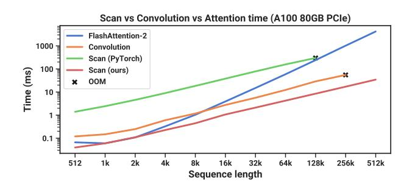
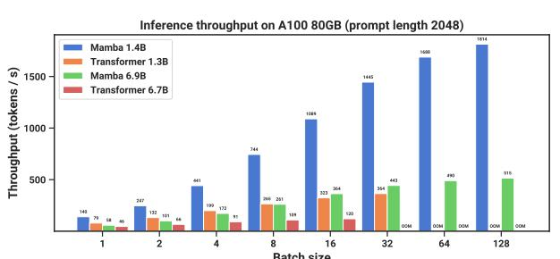

# 4.5 Speed and Memory Benchmarks

We benchmark the speed of the SSM scan operation (state expansion N=16), as well as the end-to-end inference throughput of Mamba, in Figure 8. Our efficient SSM scan is faster than the best attention implementation that we know of (FlashAttention-2 (Dao 2024)) beyond sequence length 2K, and up to  $20\text{-}40\times$  faster than a standard scan implementation in PyTorch. Mamba achieves  $4\text{-}5\times$  higher inference throughput than a Transformer of similar size, since without the KV cache it can use much higher batch sizes. For example, a Mamba-6.9B (untrained) would have higher inference throughput than a  $5\times$  smaller Transformer-1.3B. Details in Appendix E.5, which additionally includes a benchmark of memory consumption.

Figure 8: (Efficiency Benchmarks.) (*Left*) Training: our efficient scan is  $40 \times$  faster than a standard implementation. (*Right*) Inference: as a recurrent model, Mamba can achieve  $5 \times$  higher throughput than Transformers.

#### 4.6 Model Ablations

We perform a series of detailed ablations on components of our model, focusing on the setting of language modeling with size  $\approx 350$ M models at Chinchilla token counts (same setting as Figure 4).

#### 4.6.1 Architecture

Table 6 investigates the effects of the architecture (block) and its inner SSM layer (Figure 3). We find that

- Among previous non-selective (LTI) SSMs, which are equivalent to global convolutions, performance is very similar.
- Replacing the complex-valued S4 variant from previous work with a real-valued one does not affect performance much, suggesting that (at least for LM) real-valued SSMs may be a better choice when accounting for hardware efficiency.
- Replacing any of these with a selective SSM (S6) significantly improves performance, validating the motivation of Section 3.

Table 6: (**Ablations: Architecture and SSM layer**.) The Mamba block performs similarly to H3 while being simpler. In the inner layer, there is little difference among different parameterizations of LTI models, while selective SSMs (S6) provide a large improvement. More specifically, the S4 (real) variant is S4D-Real and the S4 (complex) variant is S4D-Lin.

| Model | Arch. | SSM Layer    | PERPLEXITY |
|-------|-------|--------------|------------|
| Hyena | Н3    | Hyena        | 10.24      |
| Н3    | H3    | S4 (complex) | 10.30      |
| -     | H3    | S4 (real)    | 10.34      |
| -     | H3    | S6           | 8.95       |
|       |       |              |            |

| Model | Arch. | SSM Layer    | PERPLEXITY |
|-------|-------|--------------|------------|
| -     | Mamba | Hyena        | 10.75      |
| -     | Mamba | S4 (complex) | 10.54      |
| -     | Mamba | S4 (real)    | 10.56      |
| Mamba | Mamba | S6           | 8.69       |

Table 7: (**Ablations: Selective parameters**.)  $\Delta$  is the most important parameter (Theorem 1), but using multiple selective parameters together synergizes.

| Selective $\Delta$ | SELECTIVE B | Selective $C$ | PERPLEXITY |  |  |
|--------------------|-------------|---------------|------------|--|--|
| X                  | Х           | Х             | 10.93      |  |  |
| X                  | ✓           | X             | 10.15      |  |  |
| X                  | X           | ✓             | 9.98       |  |  |
| ✓                  | ×           | X             | 9.81       |  |  |
| ✓                  | ✓           | ✓             | 8.71       |  |  |

Table 8: (**Ablations: Parameterization of** *A.*) The more standard initializations based on S4D-Lin (Gu, Gupta, et al. 2022) perform worse than S4D-Real or a random initialization, when the SSM is selective.

| FIELD   | PERPLEXITY              |
|---------|-------------------------|
| Complex | 9.16                    |
| Real    | 8.85                    |
| Real    | 8.71                    |
| Real    | 8.71                    |
|         | Complex Real Real |

• The Mamba architecture performs similarly to the H3 architecture (and seems slightly better when using a selective layer).

We also investigate interleaving the Mamba block with other blocks such as MLP (a traditional architecture) MHA (a hybrid attention architecture) in Appendix E.2.2.

#### 4.6.2 Selective SSM

Table 7 ablates the selective SSM layer by considering different combinations of selective  $\Delta$ , B, and C parameters (Algorithm 2), showing that  $\Delta$  is the most important parameter due to its connection to RNN gating (Theorem 1).

Table 8 considers different initializations of the SSM, which have been shown to make a large difference in some data modalities and settings (Gu, Goel, and Ré 2022; Gu, Gupta, et al. 2022). On language modeling, we find that simpler real-valued diagonal initializations (S4D-Real, row 3) instead of more standard complex-valued parameterizations (S4D-Lin, row 1) perform better. Random initializations also work well, consistent with findings from prior work (Mehta et al. 2023).

Table 9 and Table 10 consider varying the dimension of the  $\Delta$  and (B, C) projections respectively. Changing them from static to selective provides the most benefit, while increasing the dimensions further generally improves performance modestly with a small increase in parameter count.

Of particular note is the dramatic improvement of the selective SSM when the state size N is increased, with over a 1.0 perplexity improvement for a cost of only 1% additional parameters. This validates our core motivation in Sections 3.1 and 3.3.

#### 5 Discussion

We discuss related work, limitations, and some future directions.

**Related Work.** Appendix A discusses how the selection mechanism relates to similar concepts. Appendix B has an extended related work of SSMs and other related models.

Table 9: (**Ablations: Expressivity of**  $\Delta$ .) The selection mechanism of  $\Delta$  constructs it with a projection of the input. Projecting it even to dim. 1 provides a large increase in performance; increasing it further provides further improvements at the cost of a modest increase in parameters. State size fixed to N=16.

Table 10: (**Ablations: SSM state dimension**.) (*Top*) Constant **B** and **C** (*Bottom*) Selective **B** and **C**. Increasing the SSM state dimension N, which can be viewed as an expansion factor on the dimension of the recurrent state, can significantly improve performance for a negligible cost in parameters/FLOPs, but only when **B** and **C** are also selective. Size of  $\Delta$  projection fixed to 64.

| Size of $\Delta$ proj. | Params (M) | PERPLEXITY |
|------------------------|------------|------------|
| -                      | 358.9      | 9.12       |
| 1                      | 359.1      | 8.97       |
| 2                      | 359.3      | 8.97       |
| 4                      | 359.7      | 8.91       |
| 8                      | 360.5      | 8.83       |
| 16                     | 362.1      | 8.84       |
| 32                     | 365.2      | 8.80       |
| 64                     | 371.5      | 8.71       |

| State dimension $N$ | Params (M) | PERPLEXITY |
|---------------------|------------|------------|
| 1                   | 367.1      | 9.88       |
| 2                   | 367.4      | 9.86       |
| 4                   | 368.0      | 9.82       |
| 8                   | 369.1      | 9.82       |
| 16                  | 371.5      | 9.81       |
| 1                   | 367.1      | 9.73       |
| 2                   | 367.4      | 9.40       |
| 4                   | 368.0      | 9.09       |
| 8                   | 369.1      | 8.84       |
| 16                  | 371.5      | 8.71       |

**No Free Lunch: Continuous-Discrete Spectrum.** Structured SSMs were originally defined as discretizations of continuous systems (1), and have had a strong inductive bias toward continuous-time data modalities such as perceptual signals (e.g. audio, video). As discussed in Sections 3.1 and 3.5, the selection mechanism overcomes their weaknesses on discrete modalities such as text and DNA; but this conversely can impede their performance on data that LTI SSMs excel on. Our ablations on audio waveforms examine this tradeoff in more detail.

**Downstream Affordances.** Transformer-based foundation models (particularly LLMs) have a rich ecosystem of properties and modes of interaction with pretrained models, such as fine-tuning, adaptation, prompting, in-context learning, instruction tuning, RLHF, quantization, and so on. We are particularly interested in whether Transformer alternatives such as SSMs have similar properties and affordances.

**Scaling.** Our empirical evaluation is limited to small model sizes, below the threshold of most strong open source LLMs (e.g. Llama (Touvron et al. 2023)) as well as other recurrent models such as RWKV (B. Peng et al. 2023) and RetNet (Y. Sun et al. 2023), which have been evaluated at the 7B parameter scale and beyond. It remains to assess whether Mamba still compares favorably at these larger sizes. We also note that scaling SSMs may involve further engineering challenges and adjustments to the model that are not discussed in this paper.

### 6 Conclusion

We introduce a selection mechanism to structured state space models, allowing them to perform context-dependent reasoning while scaling linearly in sequence length. When incorporated into a simple attention-free architecture, Mamba achieves state-of-the-art results on a diverse set of domains, where it matches or exceeds the performance of strong Transformer models. We are excited about the broad applications of selective state space models to build foundation models for different domains, especially in emerging modalities requiring long context such as genomics, audio, and video. Our results suggest that Mamba is a strong candidate to be a general sequence model backbone.

### Acknowledgments

We thank Karan Goel, Arjun Desai, and Kush Bhatia for helpful feedback on the draft.

### References

[1] Martin Arjovsky, Amar Shah, and Yoshua Bengio. "Unitary Evolution Recurrent Neural Networks". In: *The International Conference on Machine Learning (ICML)*. 2016, pp. 1120–1128.

- [2] Žiga Avsec, Vikram Agarwal, Daniel Visentin, Joseph R Ledsam, Agnieszka Grabska-Barwinska, Kyle R Taylor, Yannis Assael, John Jumper, Pushmeet Kohli, and David R Kelley. "Effective Gene Expression Prediction from Sequence by Integrating Long-range Interactions". In: *Nature Methods* 18.10 (2021), pp. 1196–1203.
- [3] Jimmy Ba, Geoffrey E Hinton, Volodymyr Mnih, Joel Z Leibo, and Catalin Ionescu. "Using Fast Weights to Attend to the Recent Past". In: *Advances in Neural Information Processing Systems (NeurIPS)* 29 (2016).
- [4] Jimmy Lei Ba, Jamie Ryan Kiros, and Geoffrey E Hinton. "Layer Normalization". In: *arXiv preprint arXiv:1607.06450* (2016).
- [5] Dzmitry Bahdanau, Kyunghyun Cho, and Yoshua Bengio. "Neural Machine Translation by Jointly Learning to Align and Translate". In: *The International Conference on Learning Representations (ICLR)*. 2015.
- [6] David Balduzzi and Muhammad Ghifary. "Strongly-typed Recurrent Neural Networks". In: *International Conference on Machine Learning*. PMLR. 2016, pp. 1292–1300.
- [7] Stella Biderman, Hailey Schoelkopf, Quentin Gregory Anthony, Herbie Bradley, Kyle O'Brien, Eric Hallahan, Mohammad Aflah Khan, Shivanshu Purohit, USVSN Sai Prashanth, Edward Raff, et al. "Pythia: A Suite for Analyzing Large Language Models across Training and Scaling". In: *The International Conference on Machine Learning (ICML)*. PMLR. 2023, pp. 2397–2430.
- [8] Yonatan Bisk, Rowan Zellers, Jianfeng Gao, Yejin Choi, et al. "PIQA: Reasoning about Physical Commonsense in Natural Language". In: *Proceedings of the AAAI conference on Artificial Intelligence*. Vol. 34. 2020.
- [9] Sid Black, Stella Biderman, Eric Hallahan, Quentin Anthony, Leo Gao, Laurence Golding, Horace He, Connor Leahy, Kyle McDonell, Jason Phang, et al. "Gpt-NeoX-20B: An Open-source Autoregressive Language Model". In: *arXiv* preprint *arXiv*:2204.06745 (2022).
- [10] Guy E Blelloch. "Prefix Sums and Their Applications". In: (1990).
- [11] James Bradbury, Stephen Merity, Caiming Xiong, and Richard Socher. "Quasi-recurrent Neural Networks". In: arXiv preprint arXiv:1611.01576 (2016).
- [12] Tom Brown, Benjamin Mann, Nick Ryder, Melanie Subbiah, Jared D Kaplan, Prafulla Dhariwal, Arvind Neelakantan, Pranav Shyam, Girish Sastry, Amanda Askell, et al. "Language Models are Few-shot Learners". In: *Advances in Neural Information Processing Systems (NeurIPS)* 33 (2020), pp. 1877–1901.
- [13] Aydar Bulatov, Yuri Kuratov, and Mikhail S Burtsev. "Scaling Transformer to 1M tokens and Beyond with RMT". In: *arXiv preprint arXiv:2304.11062* (2023).
- [14] Rewon Child, Scott Gray, Alec Radford, and Ilya Sutskever. "Generating Long Sequences with Sparse Transformers". In: *arXiv preprint arXiv:1904.10509* (2019).
- [15] Krzysztof Choromanski, Valerii Likhosherstov, David Dohan, Xingyou Song, Andreea Gane, Tamas Sarlos, Peter Hawkins, Jared Davis, Afroz Mohiuddin, Lukasz Kaiser, et al. "Rethinking Attention with Performers". In: *The International Conference on Learning Representations (ICLR)*. 2021.
- [16] Aakanksha Chowdhery, Sharan Narang, Jacob Devlin, Maarten Bosma, Gaurav Mishra, Adam Roberts, Paul Barham, Hyung Won Chung, Charles Sutton, Sebastian Gehrmann, et al. "PaLM: Scaling Language Modeling with Pathways". In: Journal of Machine Learning Research 24.240 (2023), pp. 1–113. URL: http://jmlr.org/papers/v24/22-1144.html.
- [17] Junyoung Chung, Caglar Gulcehre, KyungHyun Cho, and Yoshua Bengio. "Empirical Evaluation of Gated Recurrent Neural Networks on Sequence Modeling". In: *arXiv preprint arXiv:1412.3555* (2014).
- [18] Peter Clark, Isaac Cowhey, Oren Etzioni, Tushar Khot, Ashish Sabharwal, Carissa Schoenick, and Oyvind Tafjord. "Think you have Solved Question Answering? Try ARC, the AI2 Reasoning Challenge". In: *arXiv preprint arXiv:1803.05457* (2018).
- [19] Tri Dao. "FlashAttention-2: Faster Attention with Better Parallelism and Work Partitioning". In: *The International Conference on Learning Representations (ICLR)*. 2024.
- [20] Tri Dao, Daniel Y Fu, Stefano Ermon, Atri Rudra, and Christopher Ré. "FlashAttention: Fast and Memory-Efficient Exact Attention with IO-Awareness". In: *Advances in Neural Information Processing Systems (NeurIPS)*. 2022.
- [21] Tri Dao, Daniel Y Fu, Khaled K Saab, Armin W Thomas, Atri Rudra, and Christopher Ré. "Hungry Hungry Hippos: Towards Language Modeling with State Space Models". In: *The International Conference on Learning Representations (ICLR)*. 2023.
- [22] Yann N Dauphin, Angela Fan, Michael Auli, and David Grangier. "Language Modeling with Gated Convolutional Networks". In: *The International Conference on Machine Learning (ICML)*. PMLR. 2017, pp. 933–941.
- [23] DeepSound. SampleRNN. https://github.com/deepsound-project/samplernn-pytorch. 2017.
- [24] Jiayu Ding, Shuming Ma, Li Dong, Xingxing Zhang, Shaohan Huang, Wenhui Wang, and Furu Wei. "LongNet: Scaling Transformers to 1,000,000,000 Tokens". In: *arXiv preprint arXiv:2307.02486* (2023).

- [25] Chris Donahue, Julian McAuley, and Miller Puckette. "Adversarial Audio Synthesis". In: *The International Conference on Learning Representations (ICLR)*. 2019.
- [26] Alexey Dosovitskiy, Lucas Beyer, Alexander Kolesnikov, Dirk Weissenborn, Xiaohua Zhai, Thomas Unterthiner, Mostafa Dehghani, Matthias Minderer, Georg Heigold, Sylvain Gelly, et al. "An Image is Worth 16x16 Words: Transformers for Image Recognition at Scale". In: *The International Conference on Learning Representations (ICLR)*. 2020.
- [27] Nelson Elhage, Neel Nanda, Catherine Olsson, Tom Henighan, Nicholas Joseph, Ben Mann, Amanda Askell, Yuntao Bai, Anna Chen, Tom Conerly, Nova DasSarma, Dawn Drain, Deep Ganguli, Zac Hatfield-Dodds, Danny Hernandez, Andy Jones, Jackson Kernion, Liane Lovitt, Kamal Ndousse, Dario Amodei, Tom Brown, Jack Clark, Jared Kaplan, Sam McCandlish, and Chris Olah. "A Mathematical Framework for Transformer Circuits". In: *Transformer Circuits Thread* (2021). https://transformer-circuits.pub/2021/framework/index.html.
- [28] Mahan Fathi, Jonathan Pilault, Pierre-Luc Bacon, Christopher Pal, Orhan Firat, and Ross Goroshin. "Block-State Transformer". In: *arXiv preprint arXiv:2306.09539* (2023).
- [29] Yassir Fathullah, Chunyang Wu, Yuan Shangguan, Junteng Jia, Wenhan Xiong, Jay Mahadeokar, Chunxi Liu, Yangyang Shi, Ozlem Kalinli, Mike Seltzer, and Mark J. F. Gales. "Multi-Head State Space Model for Speech Recognition". In: *Proc. INTERSPEECH 2023*. 2023, pp. 241–245. DOI: 10.21437/Interspeech.2023-1036.
- [30] Karl J Friston, Lee Harrison, and Will Penny. "Dynamic Causal Modelling". In: *Neuroimage* 19.4 (2003), pp. 1273–1302.
- [31] Daniel Y Fu, Elliot L Epstein, Eric Nguyen, Armin W Thomas, Michael Zhang, Tri Dao, Atri Rudra, and Christopher Ré. "Simple Hardware-efficient Long Convolutions for Sequence Modeling". In: *The International Conference on Machine Learning (ICML)* (2023).
- [32] Ken-ichi Funahashi and Yuichi Nakamura. "Approximation of Dynamical Systems by Continuous Time Recurrent Neural Networks". In: *Neural Networks* 6.6 (1993), pp. 801–806.
- [33] Leo Gao, Stella Biderman, Sid Black, Laurence Golding, Travis Hoppe, Charles Foster, Jason Phang, Horace He, Anish Thite, Noa Nabeshima, Shawn Presser, and Connor Leahy. "The Pile: An 800GB Dataset of Diverse Text for Language Modeling". In: *arXiv* preprint *arXiv*:2101.00027 (2020).
- [34] Leo Gao, Jonathan Tow, Stella Biderman, Sid Black, Anthony DiPofi, Charles Foster, Laurence Golding, Jeffrey Hsu, Kyle McDonell, Niklas Muennighoff, Jason Phang, Laria Reynolds, Eric Tang, Anish Thite, Ben Wang, Kevin Wang, and Andy Zou. *A Framework for Few-shot Language Model Evaluation*. Version v0.0.1. Sept. 2021. DOI: 10.5281/zenodo.5371628. URL: https://doi.org/10.5281/zenodo.5371628.
- [35] Karan Goel, Albert Gu, Chris Donahue, and Christopher Ré. "It's Raw! Audio Generation with State-Space Models". In: *The International Conference on Machine Learning (ICML)*. 2022.
- [36] Albert Gu, Tri Dao, Stefano Ermon, Atri Rudra, and Christopher Ré. "HIPPO: Recurrent Memory with Optimal Polynomial Projections". In: *Advances in Neural Information Processing Systems (NeurIPS)*. 2020.
- [37] Albert Gu, Karan Goel, and Christopher Ré. "Efficiently Modeling Long Sequences with Structured State Spaces". In: *The International Conference on Learning Representations (ICLR)*. 2022.
- [38] Albert Gu, Caglar Gulcehre, Tom Le Paine, Matt Hoffman, and Razvan Pascanu. "Improving the Gating Mechanism of Recurrent Neural Networks". In: *The International Conference on Machine Learning (ICML)*. 2020.
- [39] Albert Gu, Ankit Gupta, Karan Goel, and Christopher Ré. "On the Parameterization and Initialization of Diagonal State Space Models". In: *Advances in Neural Information Processing Systems (NeurIPS)*. 2022.
- [40] Albert Gu, Isys Johnson, Karan Goel, Khaled Saab, Tri Dao, Atri Rudra, and Christopher Ré. "Combining Recurrent, Convolutional, and Continuous-time Models with the Linear State Space Layer". In: *Advances in Neural Information Processing Systems (NeurIPS)*. 2021.
- [41] Albert Gu, Isys Johnson, Aman Timalsina, Atri Rudra, and Christopher Ré. "How to Train Your HIPPO: State Space Models with Generalized Basis Projections". In: *The International Conference on Learning Representations (ICLR)*. 2023.
- [42] Ankit Gupta, Albert Gu, and Jonathan Berant. "Diagonal State Spaces are as Effective as Structured State Spaces". In: *Advances in Neural Information Processing Systems* 35 (2022), pp. 22982–22994.
- [43] Ankit Gupta, Harsh Mehta, and Jonathan Berant. "Simplifying and Understanding State Space Models with Diagonal Linear RNNs". In: *arXiv preprint arXiv:2212.00768* (2022).
- [44] David Ha, Andrew Dai, and Quoc V. Le. "HyperNetworks". In: *The International Conference on Learning Representations (ICLR)*. 2017.
- [45] Danijar Hafner, Timothy Lillicrap, Jimmy Ba, and Mohammad Norouzi. "Dream to Control: Learning Behaviors by Latent Imagination". In: *The International Conference on Learning Representations (ICLR)*. 2020.

- [46] Ramin Hasani, Mathias Lechner, Tsun-Hsuan Wang, Makram Chahine, Alexander Amini, and Daniela Rus. "Liquid Structural State-Space Models". In: *The International Conference on Learning Representations (ICLR)*. 2023.
- [47] Mikael Henaff, Arthur Szlam, and Yann LeCun. "Recurrent Orthogonal Networks and Long-Memory Tasks". In: *The International Conference on Machine Learning (ICML)*. 2016.
- [48] Dan Hendrycks and Kevin Gimpel. "Gaussian Error Linear Units (GELUs)". In: arXiv preprint arXiv:1606.08415 (2016).
- [49] Sepp Hochreiter. "Untersuchungen zu dynamischen neuronalen Netzen". In: *Diploma, Technische Universität München* 91.1 (1991), p. 31.
- [50] Sepp Hochreiter, Yoshua Bengio, Paolo Frasconi, Jürgen Schmidhuber, et al. *Gradient Flow in Recurrent Nets: The Difficulty of Learning Long-term Dependencies*. 2001.
- [51] Sepp Hochreiter and Jürgen Schmidhuber. "Long Short-Term Memory". In: Neural Computation 9.8 (1997), pp. 1735–1780.
- [52] Jordan Hoffmann, Sebastian Borgeaud, Arthur Mensch, Elena Buchatskaya, Trevor Cai, Eliza Rutherford, Diego de Las Casas, Lisa Anne Hendricks, Johannes Welbl, Aidan Clark, et al. "An Empirical Analysis of Compute-Optimal Large Language Model Training". In: Advances in Neural Information Processing Systems (NeurIPS) 35 (2022), pp. 30016–30030.
- [53] Weizhe Hua, Zihang Dai, Hanxiao Liu, and Quoc Le. "Transformer Quality in Linear Time". In: *The International Conference on Machine Learning (ICML)*. PMLR. 2022, pp. 9099–9117.
- [54] Hassan Ismail Fawaz, Germain Forestier, Jonathan Weber, Lhassane Idoumghar, and Pierre-Alain Muller. "Deep Learning for Time Series Classification: A Review". In: Data Mining and Knowledge Discovery 33.4 (2019), pp. 917– 963
- [55] Andrei Ivanov, Nikoli Dryden, Tal Ben-Nun, Shigang Li, and Torsten Hoefler. "Data Movement is All You Need: A Case Study on Optimizing Transformers". In: *Proceedings of Machine Learning and Systems* 3 (2021), pp. 711–732.
- [56] Li Jing, Caglar Gulcehre, John Peurifoy, Yichen Shen, Max Tegmark, Marin Soljacic, and Yoshua Bengio. "Gated Orthogonal Recurrent Units: On Learning to Forget". In: *Neural Computation* 31.4 (2019), pp. 765–783.
- [57] Rudolph Emil Kalman. "A New Approach to Linear Filtering and Prediction Problems". In: (1960).
- [58] Angelos Katharopoulos, Apoorv Vyas, Nikolaos Pappas, and François Fleuret. "Transformers are RNNs: Fast Autoregressive Transformers with Linear Attention". In: *International Conference on Machine Learning*. PMLR. 2020, pp. 5156–5165.
- [59] Shiva Kaul. "Linear Dynamical Systems as a Core Computational Primitive". In: *Advances in Neural Information Processing Systems* 33 (2020), pp. 16808–16820.
- [60] Zhifeng Kong, Wei Ping, Jiaji Huang, Kexin Zhao, and Bryan Catanzaro. "DiffWave: A Versatile Diffusion Model for Audio Synthesis". In: *International Conference on Learning Representations*. 2021.
- [61] Chrysoula Kosma, Giannis Nikolentzos, and Michalis Vazirgiannis. "Time-Parameterized Convolutional Neural Networks for Irregularly Sampled Time Series". In: *arXiv preprint arXiv:2308.03210* (2023).
- [62] Alex Krizhevsky, Ilya Sutskever, and Geoffrey E Hinton. "ImageNet Classification with Deep Convolutional Neural Networks". In: *Advances in Neural Information Processing Systems (NeurIPS)* 25 (2012).
- [63] Tao Lei. "When Attention Meets Fast Recurrence: Training Language Models with Reduced Compute". In: *Proceedings of the 2021 Conference on Empirical Methods in Natural Language Processing.* 2021, pp. 7633–7648.
- [64] Tao Lei, Yu Zhang, Sida I Wang, Hui Dai, and Yoav Artzi. "Simple Recurrent Units for Highly Parallelizable Recurrence". In: *arXiv preprint arXiv:1709.02755* (2017).
- [65] Mario Lezcano-Casado and David Martínez-Rubio. "Cheap Orthogonal Constraints in Neural Networks: A Simple Parametrization of the Orthogonal and Unitary Group". In: *The International Conference on Machine Learning (ICML)*. 2019.
- [66] Yuhong Li, Tianle Cai, Yi Zhang, Deming Chen, and Debadeepta Dey. "What Makes Convolutional Models Great on Long Sequence Modeling?" In: *The International Conference on Learning Representations (ICLR)*. 2023.
- [67] Vasileios Lioutas and Yuhong Guo. "Time-aware Large Kernel Convolutions". In: *The International Conference on Machine Learning (ICML)*. PMLR. 2020, pp. 6172–6183.
- [68] Chris Lu, Yannick Schroecker, Albert Gu, Emilio Parisotto, Jakob Foerster, Satinder Singh, and Feryal Behbahani. "Structured State Space Models for In-Context Reinforcement Learning". In: *Advances in Neural Information Processing Systems (NeurIPS)*. 2023.
- [69] Shahar Lutati, Itamar Zimerman, and Lior Wolf. "Focus Your Attention (with Adaptive IIR Filters)". In: *arXiv* preprint *arXiv*:2305.14952 (2023).

- [70] Xuezhe Ma, Chunting Zhou, Xiang Kong, Junxian He, Liangke Gui, Graham Neubig, Jonathan May, and Luke Zettlemoyer. "Mega: Moving Average Equipped Gated Attention". In: *The International Conference on Learning Representations (ICLR)*. 2023.
- [71] Eric Martin and Chris Cundy. "Parallelizing Linear Recurrent Neural Nets Over Sequence Length". In: *The International Conference on Learning Representations (ICLR)*. 2018.
- [72] Soroush Mehri, Kundan Kumar, Ishaan Gulrajani, Rithesh Kumar, Shubham Jain, Jose Sotelo, Aaron Courville, and Yoshua Bengio. "SampleRNN: An Unconditional End-to-End Neural Audio Generation Model". In: *The International Conference on Learning Representations (ICLR)*. 2017.
- [73] Harsh Mehta, Ankit Gupta, Ashok Cutkosky, and Behnam Neyshabur. "Long Range Language Modeling via Gated State Spaces". In: *The International Conference on Learning Representations (ICLR)*. 2023.
- [74] Zakaria Mhammedi, Andrew Hellicar, Ashfaqur Rahman, and James Bailey. "Efficient Orthogonal Parametrisation of Recurrent Neural Networks using Householder Reflections". In: *International Conference on Machine Learning*. PMLR. 2017, pp. 2401–2409.
- [75] Eric Nguyen, Karan Goel, Albert Gu, Gordon Downs, Preey Shah, Tri Dao, Stephen Baccus, and Christopher Ré. "S4ND: Modeling Images and Videos as Multidimensional Signals with State Spaces". In: *Advances in Neural Information Processing Systems (NeurIPS)*. 2022.
- [76] Eric Nguyen, Michael Poli, Marjan Faizi, Armin Thomas, Callum Birch-Sykes, Michael Wornow, Aman Patel, Clayton Rabideau, Stefano Massaroli, Yoshua Bengio, et al. "HyenaDNA: Long-range Genomic Sequence Modeling at Single Nucleotide Resolution". In: *Advances in Neural Information Processing Systems (NeurIPS)*. 2023.
- [77] Catherine Olsson, Nelson Elhage, Neel Nanda, Nicholas Joseph, Nova DasSarma, Tom Henighan, Ben Mann, Amanda Askell, Yuntao Bai, Anna Chen, Tom Conerly, Dawn Drain, Deep Ganguli, Zac Hatfield-Dodds, Danny Hernandez, Scott Johnston, Andy Jones, Jackson Kernion, Liane Lovitt, Kamal Ndousse, Dario Amodei, Tom Brown, Jack Clark, Jared Kaplan, Sam McCandlish, and Chris Olah. "In-context Learning and Induction Heads". In: *Transformer Circuits Thread* (2022). https://transformer-circuits.pub/2022/in-context-learning-and-induction-heads/index.html.
- [78] Aaron van den Oord, Sander Dieleman, Heiga Zen, Karen Simonyan, Oriol Vinyals, Alex Graves, Nal Kalchbrenner, Andrew Senior, and Koray Kavukcuoglu. "WaveNet: A Generative Model for Raw Audio". In: arXiv preprint arXiv:1609.03499 (2016).
- [79] Antonio Orvieto, Samuel L Smith, Albert Gu, Anushan Fernando, Caglar Gulcehre, Razvan Pascanu, and Soham De. "Resurrecting Recurrent Neural Networks for Long Sequences". In: *The International Conference on Machine Learning (ICML)*. 2023.
- [80] Denis Paperno, Germán Kruszewski, Angeliki Lazaridou, Ngoc-Quan Pham, Raffaella Bernardi, Sandro Pezzelle, Marco Baroni, Gemma Boleda, and Raquel Fernández. "The LAMBADA Dataset: Word Prediction Requiring a Broad Discourse Context". In: *Proceedings of the 54th Annual Meeting of the Association for Computational Linguistics*. 2016, pp. 1525–1534.
- [81] Razvan Pascanu, Tomas Mikolov, and Yoshua Bengio. "On the Difficulty of Training Recurrent Neural Networks". In: *International Conference on Machine Learning*. 2013, pp. 1310–1318.
- [82] Bo Peng, Eric Alcaide, Quentin Anthony, Alon Albalak, Samuel Arcadinho, Huanqi Cao, Xin Cheng, Michael Chung, Matteo Grella, Kranthi Kiran GV, et al. "RWKV: Reinventing RNNs for the Transformer Era". In: *arXiv preprint arXiv:2305.13048* (2023).
- [83] Hao Peng, Nikolaos Pappas, Dani Yogatama, Roy Schwartz, Noah A Smith, and Lingpeng Kong. "Random Feature Attention". In: *The International Conference on Learning Representations (ICLR)*. 2021.
- [84] Michael Poli, Stefano Massaroli, Eric Nguyen, Daniel Y Fu, Tri Dao, Stephen Baccus, Yoshua Bengio, Stefano Ermon, and Christopher Ré. "Hyena Hierarchy: Towards Larger Convolutional Language Models". In: *The International Conference on Machine Learning (ICML)*. 2023.
- [85] Zhen Qin, Xiaodong Han, Weixuan Sun, Bowen He, Dong Li, Dongxu Li, Yuchao Dai, Lingpeng Kong, and Yiran Zhong. "Toeplitz Neural Network for Sequence Modeling". In: *The International Conference on Learning Representations (ICLR)*. 2023.
- [86] Zhen Qin, Xiaodong Han, Weixuan Sun, Dongxu Li, Lingpeng Kong, Nick Barnes, and Yiran Zhong. "The devil in linear transformer". In: *arXiv preprint arXiv:2210.10340* (2022).
- [87] Zhen Qin, Weixuan Sun, Hui Deng, Dongxu Li, Yunshen Wei, Baohong Lv, Junjie Yan, Lingpeng Kong, and Yiran Zhong. "CosFormer: Rethinking Softmax in Attention". In: *The International Conference on Learning Representations* (ICLR). 2022.
- [88] Ali Rahimi and Benjamin Recht. "Random Features for Large-Scale Kernel Machines". In: *Advances in Neural Information Processing Systems (NeurIPS)* 20 (2007).

- [89] Prajit Ramachandran, Barret Zoph, and Quoc V Le. "Swish: A Self-gated Activation Function". In: *arXiv preprint arXiv:1710.05941* 7.1 (2017), p. 5.
- [90] David W Romero, Anna Kuzina, Erik J Bekkers, Jakub M Tomczak, and Mark Hoogendoorn. "CKConv: Continuous Kernel Convolution For Sequential Data". In: *arXiv preprint arXiv:2102.02611* (2021).
- [91] Keisuke Sakaguchi, Ronan Le Bras, Chandra Bhagavatula, and Yejin Choi. "Winogrande: An Adversarial Winograd Schema Challenge at Scale". In: *Communications of the ACM* 64.9 (2021), pp. 99–106.
- [92] George Saon, Ankit Gupta, and Xiaodong Cui. "Diagonal State Space Augmented Transformers for Speech Recognition". In: *ICASSP 2023-2023 IEEE International Conference on Acoustics, Speech and Signal Processing (ICASSP)*. IEEE. 2023, pp. 1–5.
- [93] Imanol Schlag, Kazuki Irie, and Jürgen Schmidhuber. "Linear Transformers are Secretly Fast Weight Programmers". In: *The International Conference on Machine Learning (ICML)*. PMLR. 2021, pp. 9355–9366.
- [94] Jürgen Schmidhuber. "Learning to control fast-weight memories: An alternative to dynamic recurrent networks". In: *Neural Computation* 4.1 (1992), pp. 131–139.
- [95] Noam Shazeer. "GLU Variants Improve Transformer". In: arXiv preprint arXiv:2002.05202 (2020).
- [96] Freda Shi, Xinyun Chen, Kanishka Misra, Nathan Scales, David Dohan, Ed H Chi, Nathanael Schärli, and Denny Zhou. "Large Language Models can be Easily Distracted by Irrelevant Context". In: *The International Conference on Machine Learning (ICML)*. PMLR. 2023, pp. 31210–31227.
- [97] Jiaxin Shi, Ke Alexander Wang, and Emily Fox. "Sequence Modeling with Multiresolution Convolutional Memory". In: *The International Conference on Machine Learning (ICML)*. PMLR. 2023, pp. 31312–31327.
- [98] Jimmy TH Smith, Andrew Warrington, and Scott W Linderman. "Simplified State Space Layers for Sequence Modeling". In: *The International Conference on Learning Representations (ICLR)*. 2023.
- [99] Jianlin Su, Yu Lu, Shengfeng Pan, Ahmed Murtadha, Bo Wen, and Yunfeng Liu. "Roformer: Enhanced Transformer with Rotary Position Embedding". In: *arXiv preprint arXiv:2104.09864* (2021).
- [100] Yutao Sun, Li Dong, Shaohan Huang, Shuming Ma, Yuqing Xia, Jilong Xue, Jianyong Wang, and Furu Wei. "Retentive network: A successor to transformer for large language models". In: *arXiv preprint arXiv:2307.08621* (2023).
- [101] Ilya Sutskever, Oriol Vinyals, and Quoc V Le. "Sequence to Sequence Learning with Neural Networks". In: *Advances in Neural Information Processing Systems (NeurIPS)* 27 (2014).
- [102] Corentin Tallec and Yann Ollivier. "Can Recurrent Neural Networks Warp Time?" In: *The International Conference on Learning Representations (ICLR)*. 2018.
- [103] Yi Tay, Mostafa Dehghani, Samira Abnar, Yikang Shen, Dara Bahri, Philip Pham, Jinfeng Rao, Liu Yang, Sebastian Ruder, and Donald Metzler. "Long Range Arena: A Benchmark for Efficient Transformers". In: *International Conference on Learning Representations (ICLR)*. 2021.
- [104] Yi Tay, Mostafa Dehghani, Dara Bahri, and Donald Metzler. "Efficient Transformers: A Survey". In: *ACM Computing Surveys* 55.6 (2022), pp. 1–28.
- [105] Hugo Touvron, Thibaut Lavril, Gautier Izacard, Xavier Martinet, Marie-Anne Lachaux, Timothée Lacroix, Baptiste Rozière, Naman Goyal, Eric Hambro, Faisal Azhar, et al. "Llama: Open and Efficient Foundation Language Models". In: arXiv preprint arXiv:2302.13971 (2023).
- [106] Ashish Vaswani, Noam Shazeer, Niki Parmar, Jakob Uszkoreit, Llion Jones, Aidan N. Gomez, Lukasz Kaiser, and Illia Polosukhin. "Attention Is All You Need". In: *Advances in Neural Information Processing Systems (NeurIPS)*. 2017.
- [107] Eugene Vorontsov, Chiheb Trabelsi, Samuel Kadoury, and Chris Pal. "On Orthogonality and Learning Recurrent Networks with Long Term Dependencies". In: *International Conference on Machine Learning*. PMLR. 2017, pp. 3570–3578.
- [108] Jue Wang, Wentao Zhu, Pichao Wang, Xiang Yu, Linda Liu, Mohamed Omar, and Raffay Hamid. "Selective Structured State-Spaces for Long-form Video Understanding". In: *Proceedings of the IEEE/CVF Conference on Computer Vision and Pattern Recognition*. 2023, pp. 6387–6397.
- [109] Pete Warden. "Speech Commands: A Dataset for Limited-Vocabulary Speech Recognition". In: *ArXiv* abs/1804.03209 (2018).
- [110] Samuel Williams, Andrew Waterman, and David Patterson. "Roofline: An Insightful Visual Performance Model for Multicore Architectures". In: *Communications of the ACM* 52.4 (2009), pp. 65–76.
- [111] Brandon Yang, Gabriel Bender, Quoc V Le, and Jiquan Ngiam. "CondConv: Conditionally Parameterized Convolutions for Efficient Inference". In: *Advances in Neural Information Processing Systems (NeurIPS)* 32 (2019).
- [112] Rowan Zellers, Ari Holtzman, Yonatan Bisk, Ali Farhadi, and Yejin Choi. "HellaSwag: Can a Machine Really Finish Your Sentence?" In: *Proceedings of the 57th Annual Meeting of the Association for Computational Linguistics.* 2019.

- [113] Shuangfei Zhai, Walter Talbott, Nitish Srivastava, Chen Huang, Hanlin Goh, Ruixiang Zhang, and Josh Susskind. "An Attention Free Transformer". In: arXiv preprint arXiv:2105.14103 (2021).
- [114] Michael Zhang, Khaled K Saab, Michael Poli, Tri Dao, Karan Goel, and Christopher Ré. "Effectively Modeling Time Series with Simple Discrete State Spaces". In: The International Conference on Learning Representations (ICLR). 2023.
- [115] Lin Zheng, Chong Wang, and Lingpeng Kong. "Linear complexity randomized self-attention mechanism". In: International Conference on Machine Learning. PMLR. 2022, pp. 27011–27041.
- [116] Simiao Zuo, Xiaodong Liu, Jian Jiao, Denis Charles, Eren Manavoglu, Tuo Zhao, and Jianfeng Gao. "Efficient Long Sequence Modeling via State Space Augmented Transformer". In: arXiv preprint arXiv:2212.08136 (2022).

### A Discussion: Selection Mechanism

Our selection mechanism is inspired by and related to concepts such as gating, hypernetworks, and data-dependence. It can also be viewed as related to "fast weights" (J. Ba et al. 2016; Schmidhuber 1992), which connects classical RNNs with the mechanism of linear attention (Schlag, Irie, and Schmidhuber 2021). However, we believe that it is a distinct concept that is worth clarifying.

**Gating.** Gating originally referred to the gating mechanisms of RNNs such as the LSTM (Hochreiter and Schmidhuber 1997) and GRU (J. Chung et al. 2014), or the gated equation (5) in Theorem 1. This was interpreted as a particular mechanism for controlling whether to let an input into the hidden state of an RNN. In particular, this affects the propagation of signal through time and causes inputs to interact along the sequence length dimension.

However, the concept of gating has since been relaxed in popular usage to simply mean any multiplicative interaction (often with an activation function). For example, *elementwise* multiplicative components of neural network architectures (that do not interact along sequence length) are now commonly referred to as gated architectures (Hua et al. 2022; Mehta et al. 2023), despite a very different meaning than the original RNN sense. Thus we believe the original concept of *RNN gating* versus the popular usage of *multiplicative gating* actually have a very different semantic meaning.

**Hypernetworks.** Hypernetworks refer to neural networks whose parameters are themselves generated by smaller neural networks. The original idea (Ha, Dai, and Quoc V. Le 2017) used it in a narrow sense to define a large RNN whose recurrent parameters are generated by a smaller RNN, and other variants have been around for a long time (Schmidhuber 1992).

**Data-dependence.** Similar to hypernetworks, data-dependence can refer to any notion where some parameters of the model depend on the data (Poli et al. 2023).

**Example: GLU Activation.** To illustrate the issues with these concepts, consider a simple diagonal linear layer y = Dx, where D is a diagonal weight parameter. Now suppose that D is itself generated from a linear transformation of x, with an optional nonlinearity:  $D = \sigma(Wx)$ . Since it is diagonal, the multiplication becomes an elementwise product:  $y = \sigma(Wx) \circ x$ .

This is a rather trivial transformation, yet it technically satisfies the common meanings of gating (since it has a multiplicative "branch"), hypernetworks (since the parameter D is generated by another layer), and data-dependent (since D depends on the data x). However, this in fact simply defines a GLU function, which is so simple that it is often considered just an activation function (Dauphin et al. 2017; Shazeer 2020) instead of a meaningful layer.

**Selection.** Thus, while selection mechanisms could be considered a special case of ideas such as architectural gating, hypernetworks, or data-dependence, so can an enormous range of other constructions—essentially anything with a multiplication, including standard attention mechanisms (Bahdanau, Cho, and Bengio 2015; Vaswani et al. 2017) as well—and we find it uninformative to think of them as such.

Instead, we view it as most closely related to the gating mechanism of traditional RNNs, which is a special case (Theorem 1) and also has a deeper history of connections to SSMs through variable (input-dependent) discretization of  $\Delta$  (Funahashi and Nakamura 1993; Gu, Dao, et al. 2020; Tallec and Ollivier 2018). We also eschew the term "gating" in favor of *selection* to clarify the overloaded use of former. More narrowly, we use selection to refer to the *mechanistic* action of a model to select or ignore inputs and facilitate data interaction along the sequence length (Section 3.1). Beyond selective SSMs and gated RNNs, other examples may include input-dependent convolutions (Kosma, Nikolentzos, and Vazirgiannis 2023; Lioutas and Guo 2020; Lutati, Zimerman, and Wolf 2023; Yang et al. 2019) and even attention.

### **B** Related Work

We overview several prior works related to our methods. We mention that some of the most closely related models include recurrent layers such as S4, S5, and quasi-RNNs; as well as end-to-end architectures such as H3, RetNet, and RWKV.

