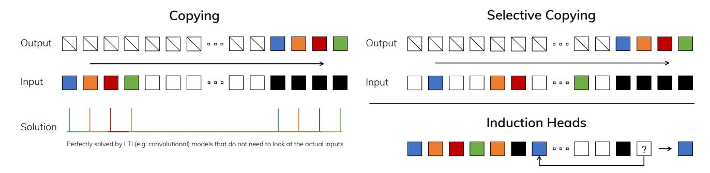

# 3.2 Improving SSMs with Selection

One method of incorporating a selection mechanism into models is by letting their parameters that affect interactions along the sequence (e.g. the recurrent dynamics of an RNN or the convolution kernel of a CNN) be input-dependent.

Algorithms 1 and 2 illustrates the main selection mechanism that we use. The main difference is simply making several parameters  $\Delta$ , B, C functions of the input, along with the associated changes to tensor shapes throughout. In particular, we highlight that these parameters now have a length dimension L, meaning that the model has changed from time-invariant to time-varying. (Note that shape annotations were described in Section 2.) This loses the equivalence to convolutions (3) with implications for its efficiency, discussed next.

We specifically choose  $s_B(x) = \operatorname{Linear}_N(x)$ ,  $s_C(x) = \operatorname{Linear}_N(x)$ ,  $s_\Delta(x) = \operatorname{Broadcast}_D(\operatorname{Linear}_1(x))$ , and  $\tau_\Delta = \operatorname{softplus}$ , where  $\operatorname{Linear}_d$  is a parameterized projection to dimension d. The choice of  $s_\Delta$  and  $\tau_\Delta$  is due to a connection to RNN gating mechanisms explained in Section 3.5.

Figure 2: (*Left*) The standard version of the Copying task involves constant spacing between input and output elements and is easily solved by time-invariant models such as linear recurrences and global convolutions. (*Right Top*) The Selective Copying task has random spacing in between inputs and requires time-varying models that can *selectively* remember or ignore inputs depending on their content. (*Right Bottom*) The Induction Heads task is an example of associative recall that requires retrieving an answer based on context, a key ability for LLMs.

| Algorithm 1 SSM (S4)                                                                | Algorithm 2 SSM + Selection (S6)                                                          |  |  |  |  |
|-------------------------------------------------------------------------------------|-------------------------------------------------------------------------------------------|--|--|--|--|
| Input: $x : (B, L, D)$                                                              | Input: $x:(B,L,D)$                                                                        |  |  |  |  |
| Output: $y:(B,L,D)$                                                                 | Output: $y:(B,L,D)$                                                                       |  |  |  |  |
| 1: $A:(D,N) \leftarrow Parameter$                                                   | 1: $A:(D,N) \leftarrow Parameter$                                                         |  |  |  |  |
| ▶ Represents structured $N \times N$ matrix                                         | ▶ Represents structured $N \times N$ matrix                                               |  |  |  |  |
| 2: $B:(D,N) \leftarrow Parameter$                                                   | $2: B: (B, L, N) \leftarrow s_B(x)$                                                       |  |  |  |  |
| $S: C: (D, N) \leftarrow Parameter$                                                 | 3: $C: (B, L, N) \leftarrow s_C(x)$                                                       |  |  |  |  |
| 4: $\Delta: (D) \leftarrow \tau_{\Delta}(Parameter)$                                | 4: $\Delta : (B, L, D) \leftarrow \tau_{\Delta}(Parameter + s_{\Delta}(x))$               |  |  |  |  |
| 5: $\overline{A}, \overline{B} : (D, N) \leftarrow \text{discretize}(\Delta, A, B)$ | 5: $\overline{A}, \overline{B} : (B, L, D, N) \leftarrow \text{discretize}(\Delta, A, B)$ |  |  |  |  |
| 6: $y \leftarrow SSM(\overline{A}, \overline{B}, C)(x)$                             | 6: $y \leftarrow SSM(\overline{A}, \overline{B}, C)(x)$                                   |  |  |  |  |
| ▶ Time-invariant: recurrence or convolution                                         | ▶ Time-varying: recurrence (scan) only                                                    |  |  |  |  |
| 7: <b>return</b> <i>y</i>                                                           | 7: <b>return</b> <i>y</i>                                                                 |  |  |  |  |

