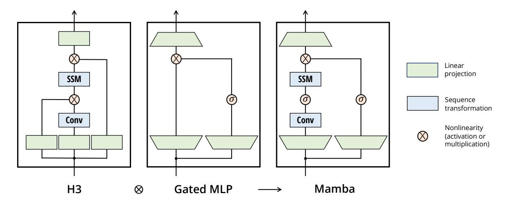

# 3.3 Efficient Implementation of Selective SSMs

Hardware-friendly primitives such as convolutions (Krizhevsky, Sutskever, and Hinton 2012) and attention (Bahdanau, Cho, and Bengio 2015; Vaswani et al. 2017) enjoy widespread application. Here we aim to make selective SSMs efficient on modern hardware (GPUs) as well. The selection mechanism is quite natural, and earlier works attempted to incorporate special cases of selection, such as letting  $\Delta$  vary over time in recurrent SSMs (Gu, Dao, et al. 2020). However, as previously mentioned a core limitation in the usage of SSMs is their computational efficiency, which was why S4 and all derivatives used LTI (non-selective) models, most commonly in the form of global convolutions.

#### 3.3.1 Motivation of Prior Models

We first revisit this motivation and overview our approach to overcome limitations of prior methods.

- At a high level, recurrent models such as SSMs always balance a tradeoff between expressivity and speed: as discussed in Section 3.1, models with larger hidden state dimension should be more effective but slower. Thus we want to maximize hidden state dimension without paying speed and memory costs.
- Note that the recurrent mode is more flexible than the convolution mode, since the latter (3) is derived from expanding the former (2) (Gu, Goel, and Ré 2022; Gu, Johnson, Goel, et al. 2021). However, this would require computing and materializing the latent state h with shape (B, L, D, N), which is much larger (by a factor of N, the SSM state dimension) than the input x and output y of shape (B, L, D). Thus the more efficient convolution mode was introduced which could bypass the state computation and materializes a convolution kernel (3a) of size only (B, L, D).
- Prior LTI state space models leverage the dual recurrent-convolutional forms to increase the effective state dimension by a factor of  $N \approx 10 100$ , much larger than traditional RNNs, without efficiency penalties.

#### 3.3.2 Overview of Selective Scan: Hardware-Aware State Expansion

The selection mechanism is designed to overcome the limitations of LTI models; at the same time, we therefore need to revisit the computation problem of SSMs. We address this with three classical techniques: kernel fusion, parallel scan, and recomputation. We make two main observations:

- The naive recurrent computation uses O(BLDN) FLOPs while the convolutional computation uses  $O(BLD \log(L))$  FLOPs, and the former has a lower constant factor. Thus for long sequences and not-too-large state dimension N, the recurrent mode can actually use fewer FLOPs.
- The two challenges are the sequential nature of recurrence, and the large memory usage. To address the latter, just like the convolutional mode, we can attempt to not actually materialize the full state *h*.

The main idea is to leverage properties of modern accelerators (GPUs) to materialize the state h only in more efficient levels of the memory hierarchy. In particular, most operations (except matrix multiplication) are bounded by memory bandwidth (Dao, Fu, Ermon, et al. 2022; Ivanov et al. 2021; Williams, Waterman, and Patterson 2009). This includes our scan operation, and we use kernel fusion to reduce the amount of memory IOs, leading to a significant speedup compared to a standard implementation.

Concretely, instead of preparing the scan input  $(\overline{A}, \overline{B})$  of size (B, L, D, N) in GPU HBM (high-bandwidth memory), we load the SSM parameters  $(\Delta, A, B, C)$  directly from slow HBM to fast SRAM, perform the discretization and recurrence in SRAM, and then write the final outputs of size (B, L, D) back to HBM.

To avoid the sequential recurrence, we observe that despite not being linear it can still be parallelized with a work-efficient parallel scan algorithm (Blelloch 1990; Martin and Cundy 2018; Smith, Warrington, and Linderman 2023).

Finally, we must also avoid saving the intermediate states, which are necessary for backpropagation. We carefully apply the classic technique of recomputation to reduce the memory requirements: the intermediate states are not stored but recomputed in the backward pass when the inputs are loaded from HBM to SRAM. As a result, the fused selective scan layer has the same memory requirements as an optimized transformer implementation with FlashAttention.

Details of the fused kernel and recomputation are in Appendix D. The full Selective SSM layer and algorithm is illustrated in Figure 1.

### 3.4 A Simplified SSM Architecture

As with structured SSMs, selective SSMs are standalone sequence transformations that can be flexibly incorporated into neural networks. The H3 architecture is the basis for the most well-known SSM architectures (Section 2), which are generally comprised of a block inspired by linear attention interleaved with an MLP (multi-layer perceptron) block. We simplify this architecture by combining these two components into one, which is stacked homogenously (Figure 3). This is inspired by the gated attention unit (GAU) (Hua et al. 2022), which did something similar for attention.

This architecture involves expanding the model dimension D by a controllable expansion factor E. For each block, most of the parameters ( $3ED^2$ ) are in the linear projections ( $2ED^2$  for input projections,  $ED^2$  for output projection) while the inner SSM contributes less. The number of SSM parameters (projections for  $\Delta$ , B, C, and the matrix A) are much smaller in comparison. We repeat this block, interleaved with standard normalization and residual connections, to form the Mamba architecture. We always fix to E=2 in our experiments and use two stacks of the block to match the  $12D^2$  parameters of a Transformer's interleaved MHA (multi-head attention) and MLP blocks. We use the SiLU / Swish activation function (Hendrycks and Gimpel 2016; Ramachandran, Zoph, and Quoc V Le 2017), motivated so that the Gated MLP becomes the popular "SwiGLU" variant (Chowdhery et al. 2023; Dauphin et al. 2017; Shazeer 2020; Touvron et al. 2023). Finally, we additionally use an optional normalization layer (we choose LayerNorm (J. L. Ba, Kiros, and Hinton 2016)), motivated by RetNet's usage of a normalization layer in a similar location (Y. Sun et al. 2023).

### 3.5 Properties of Selection Mechanisms

The selection mechanism is a broader concept that can be applied in different ways, such as to more traditional RNNs or CNNs, to different parameters (e.g. A in Algorithm 2), or using different transformations s(x).

Figure 3: (Architecture.) Our simplified block design combines the H3 block, which is the basis of most SSM architectures, with the ubiquitous MLP block of modern neural networks. Instead of interleaving these two blocks, we simply repeat the Mamba block homogenously. Compared to the H3 block, Mamba replaces the first multiplicative gate with an activation function. Compared to the MLP block, Mamba adds an SSM to the main branch. For we use the SiLU / Swish activation (Hendrycks and Gimpel [2016;](#page-19-9) Ramachandran, Zoph, and Quoc V Le [2017\)](#page-21-11).

#### 3.5.1 Connection to Gating Mechanisms

We highlight the most important connection: the classical gating mechanism of RNNs is an instance of our selection mechanism for SSMs. We note that the connection between RNN gating and the discretization of continuous-time systems is well established (Funahashi and Nakamura [1993;](#page-18-11) Tallec and Ollivier [2018\)](#page-21-7). In fact, Theorem [1](#page-7-1) is an improvement of Gu, Johnson, Goel, et al. [\(2021,](#page-18-2) Lemma 3.1) generalizing to the ZOH discretization and input-dependent gates (proof in Appendix [C\)](#page-26-0). More broadly, Δ in SSMs can be seen to play a generalized role of the RNN gating mechanism. In line with prior work, we adopt the view that discretization of SSMs is the principled foundation of heuristic gating mechanisms.

Theorem 1. When = 1, = −1, = 1, Δ = Linear(), and Δ = softplus, then the selective SSM recurrence (Algorithm [2\)](#page-5-2) takes the form

$$g_t = \sigma(\operatorname{Linear}(x_t))$$

$$h_t = (1 - g_t)h_{t-1} + g_t x_t.$$
(5)

As mentioned in Section [3.2,](#page-4-1) our specific choices of Δ, Δ is from this connection. In particular, note that if a given input should be completely ignored (as necessary in the synthetic tasks), all channels should ignore it, and so we project the input down to 1 dimension before repeating/broadcasting with Δ.

### 3.5.2 Interpretation of Selection Mechanisms

We elaborate on three particular mechanistic effects of selection.

Variable Spacing. Selectivity allows filtering out irrelevant noise tokens that may occur between inputs of interest. This is exemplified by the Selective Copying task, but occurs ubiquitously in common data modalities, particularly for discrete data – for example the presence of language fillers such as "um". This property arises because the model can mechanistically filter out any particular input , for example in the gated RNN case (Theorem [1\)](#page-7-1) when → 0.

Filtering Context. It has been empirically observed that many sequence models do not improve with longer context (F. Shi et al. [2023\)](#page-21-13), despite the principle that more context should lead to strictly better performance. An explanation is that many sequence models cannot effectively ignore irrelevant context when necessary; an intuitive example are global convolutions (and general LTI models). On the other hand, selective models can simply reset their state at any time to remove extraneous history, and thus their performance in principle improves monotonicly with context length (e.g. Section [4.3.2\)](#page-12-0).

**Boundary Resetting.** In settings where multiple independent sequences are stitched together, Transformers can keep them separate by instantiating a particular attention mask, while LTI models will bleed information between the sequences. Selective SSMs can also reset their state at boundaries (e.g.  $\Delta_t \to \infty$ , or Theorem 1 when  $g_t \to 1$ ). These settings may occur artificially (e.g. packing documents together to improve hardware utilization) or naturally (e.g. episode boundaries in reinforcement learning (Lu et al. 2023)).

Additionally, we elaborate on effects of each selective parameter.

**Interpretation of**  $\Delta$ . In general,  $\Delta$  controls the balance between how much to focus or ignore the current input  $x_t$ . It generalizes RNN gates (e.g.  $g_t$  in Theorem 1): mechanically, a large  $\Delta$  resets the state h and focuses on the current input x, while a small  $\Delta$  persists the state and ignores the current input. SSMs (1)-(2) can be interpreted as a continuous system discretized by a timestep  $\Delta$ , and in this context the intuition is that large  $\Delta \to \infty$  represents the system focusing on the current input for longer (thus "selecting" it and forgetting its current state) while a small  $\Delta \to 0$  represents a transient input that is ignored.

**Interpretation of** A. We remark that while the A parameter could also be selective, it ultimately affects the model only through its interaction with  $\Delta$  via  $\overline{A} = \exp(\Delta A)$  (the discretization (4)). Thus selectivity in  $\Delta$  is enough to ensure selectivity in  $(\overline{A}, \overline{B})$ , and is the main source of improvement. We hypothesize that making A selective in addition to (or instead of)  $\Delta$  would have similar performance, and leave it out for simplicity.

**Interpretation of** *B* **and** *C***.** As discussed in Section 3.1, the most important property of selectivity is filtering out irrelevant information so that a sequence model's context can be compressed into an efficient state. In an SSM, modifying *B* and *C* to be selective allows finer-grained control over whether to let an input  $x_t$  into the state  $h_t$ , or the state into the output  $y_t$ . These can be interpreted as allowing the model to modulate the recurrent dynamics based on content (input) and context (hidden states) respectively.

#### 3.6 Additional Model Details

**Real vs. Complex.** Most prior SSMs use complex numbers in their state h, which is necessary for strong performance on many tasks in perceptual modalities (Gu, Goel, and Ré 2022). However, it has been empirically observed that completely real-valued SSMs seem to work fine, and possibly even better, in some settings (Ma et al. 2023). We use real values as the default, which work well for all but one of our tasks; we hypothesize that the complex-real tradeoff is related to the continuous-discrete spectrum in data modalities, where complex numbers are helpful for continuous modalities (e.g. audio, video) but not discrete (e.g. text, DNA).

**Initialization.** Most prior SSMs also suggest special initializations, particularly in the complex-valued case, which can help in several settings such as low-data regimes. Our default initialization for the complex case is S4D-Lin and for the real case is S4D-Real (Gu, Gupta, et al. 2022), which is based on the HIPPO theory (Gu, Dao, et al. 2020). These define the n-th element of  $\mathbf{A}$  as -1/2 + ni and -(n + 1) respectively. However, we expect many initializations to work fine, particularly in the large-data and real-valued SSM regimes; some ablations are considered in Section 4.6.

**Parameterization of**  $\Delta$ . We defined the selective adjustment to  $\Delta$  as  $s_{\Delta}(x) = \operatorname{Broadcast}_D(\operatorname{Linear}_1(x))$ , which was motivated by the mechanics of  $\Delta$  (Section 3.5). We observe that it can be generalized from dimension 1 to a larger dimension R. We set this to be a small fraction of D, which uses a negligible number of parameters compared to the main Linear projections in the block. We additionally note that the broadcasting operation can instead be viewed as another Linear projection, initialized to a specific pattern of 1's and 0's; if this projection is trainable, this leads to the alternative  $s_{\Delta}(x) = \operatorname{Linear}_D(\operatorname{Linear}_R(x))$ , which can be viewed as a low-rank projection.

In our experiments, the  $\Delta$  parameter (which can be viewed as a bias term) is initialized to  $\tau_{\Delta}^{-1}(\text{Uniform}([0.001, 0.1]))$ , following prior work on SSMs (Gu, Johnson, Timalsina, et al. 2023).

**Remark 3.1.** For brevity in our experimental results, we sometimes abbreviate selective SSMs as S6 models, because they are S4 models with a selection mechanism and computed with a scan.

