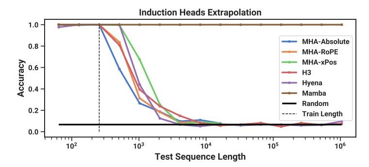
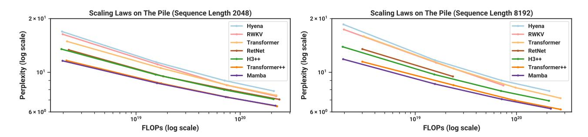

# 4.1 Synthetic Tasks

Full experiment details for these tasks including task details and training protocol are in Appendix E.1.

#### 4.1.1 Selective Copying

The Copying task is one of the most well-studied synthetic tasks for sequence modeling, originally designed to test the memorization abilities of recurrent models. As discussed in Section 3.1, LTI SSMs (linear recurrences and global convolutions) can easily solve this task by only keeping track of time instead of reasoning about the data; for example, by constructing a convolution kernel of exactly the right length (Figure 2). This was explicitly validated in earlier work on global convolutions (Romero et al. 2021). The Selective Copying task prevents this shortcut by randomizing the spacing between tokens. Note that this task has been introduced before as the Denoising task (Jing et al. 2019).

Note that many previous works argue that adding architecture gating (multiplicative interactions) can endow models with "data-dependence" and solve related tasks (Dao, Fu, Saab, et al. 2023; Poli et al. 2023). However, we find this explanation insufficient intuitively because such gating does not interact along the sequence axis, and cannot affect the spacing between tokens. In particular architecture gating is not an instance of a selection mechanism (Appendix A).

Table 1 confirms that gated architectures such as H3 and Mamba only partially improve performance, while the selection mechanism (modifying S4 to S6) easily solves this task, particularly when combined with these more powerful architectures.

#### 4.1.2 Induction Heads

Induction heads (Olsson et al. 2022) is a simple task from the mechanistic interpretability lens (Elhage et al. 2021) that is surprisingly predictive of the in-context learning ability of LLMs. It requires models to perform associative recall and copy: for example, if the model has seen a bigram such as "Harry Potter" in the sequence, then the next time "Harry" appears in the same sequence, the model should be able to predict "Potter" by copying from history.

**Dataset.** We train a 2-layer model on the induction heads task at sequence length 256, with a vocab size of 16, which is comparable to prior work on this task (Dao, Fu, Saab, et al. 2023) but with longer sequences. We additionally investigate generalization and extrapolation abilities by evaluating on a range of sequence lengths from  $2^6 = 64$  up to  $2^{20} = 1048576$  at test time.

**Models.** Following established work on induction heads, we use 2 layer models, which allows attention to mechanistically solve the induction heads task (Olsson et al. 2022). We test both multi-head attention (8 heads, with various positional encodings) and SSM variants. We use a model dimension *D* of 64 for Mamba and 128 for the other models.

**Results.** Table 2 shows that Mamba—or more precisely, its selective SSM layer—has the ability to solve the task perfectly because of its ability to selectively remember the relevant token while ignoring everything else in between. **It generalizes perfectly to million-length sequences, or**  $4000 \times$  **longer than it saw during training**, while no other method goes beyond  $2 \times$ .

| Model           | Arch.                   | Layer             | Acc.                        |
|-----------------|-------------------------|-------------------|-----------------------------|
| S4 -         | No gate No gate      | S4 S6          | 18.3 <b>97.0</b>         |
| H3 Hyena     | H3 H3 H3          | S4 Hyena S6 | 57.0 30.1 <b>99.7</b> |
| - - Mamba | Mamba Mamba Mamba | S4 Hyena S6 | 56.4 28.4 <b>99.8</b> |

Table 1: (**Selective Copying**.) Accuracy for combinations of architectures and inner sequence layers.

Table 2: (**Induction Heads**.) Models are trained on sequence length  $2^8 = 256$ , and tested on increasing sequence lengths of  $2^6 = 64$  up to  $2^{20} = 1048576$ . Full numbers in Table 11.

Figure 4: (Scaling Laws.) Models of size  $\approx 125M$  to  $\approx 1.3B$  parameters, trained on the Pile. Mamba scales better than all other attention-free models and is the first to match the performance of a very strong "Transformer++" recipe that has now become standard, particularly as the sequence length grows.

Out of positional encoding variants for attention models, xPos (which was designed for length extrapolation) is slightly better than the others; also note that all attention models were only tested up to sequence length  $2^{14} = 16384$  due to memory limitations. Out of other SSMs, H3 and Hyena are similar, contrary to the findings in Poli et al. (2023).

### 4.2 Language Modeling

We evaluate the Mamba architecture on standard autoregressive language modeling against other architectures, on both pretraining metrics (perplexity) and zero-shot evaluations. We set the model sizes (depth and width) to mirror GPT3 specifications. We use the Pile dataset (L. Gao, Biderman, et al. 2020), and follow the training recipe described in Brown et al. (2020). All training details are in Appendix E.2.

### 4.2.1 Scaling Laws

For baselines, we compare against the standard Transformer architecture (GPT3 architecture), as well as the strongest Transformer recipe we know of (here referred to as Transformer++), based on the PaLM and LLaMa architectures (e.g. rotary embedding, SwiGLU MLP, RMSNorm instead of LayerNorm, no linear bias, and higher learning rates). We also compare against other recent subquadratic architectures (Figure 4). All model details are in Appendix E.2.

Figure 4 shows scaling laws under the standard Chinchilla (Hoffmann et al. 2022) protocol, on models from  $\approx 125M$  to  $\approx 1.3B$  parameters. **Mamba is the first attention-free model to match the performance of a very strong Transformer recipe (Transformer++) that has now become standard, particularly as the sequence length grows.** (We note that full results on context length 8k are missing for the RWKV and RetNet baselines, prior strong recurrent models that can also be interpreted as SSMs, because of a lack of efficient implementations leading to out-of-memory or unrealistic computation requirements.)

### 4.2.2 Downstream Evaluations

Table [3](#page-11-1) shows the performance of Mamba on a range of popular downstream zero-shot evaluation tasks. We compare against the most well-known open source models at these sizes, most importantly Pythia (Biderman et al. [2023\)](#page-17-9) and RWKV (B. Peng et al. [2023\)](#page-20-5) which were trained with the same tokenizer, dataset, and training length (300B tokens) as our models. (Note that Mamba and Pythia are trained with context length 2048, while RWKV was trained with context length 1024.)

Table 3: (Zero-shot Evaluations.) Best results for each size in bold. We compare against open source LMs with various tokenizers, trained for up to 300B tokens. Pile refers to the validation split, comparing only against models trained on the same dataset and tokenizer (GPT-NeoX-20B). For each model size, Mamba is best-in-class on every single evaluation result, and generally matches baselines at twice the model size.

| Model          | Token. | Pile ppl ↓ | LAMBADA ppl ↓ | LAMBADA acc ↑ | HellaSwag acc ↑ | PIQA acc ↑ | Arc-E acc ↑ | Arc-C acc ↑ | WinoGrande acc ↑ | Average acc ↑ |
|----------------|--------|------------------|---------------------|---------------------|-----------------------|------------------|-------------------|-------------------|------------------------|---------------------|
| Hybrid H3-130M | GPT2   | —                | 89.48               | 25.77               | 31.7                  | 64.2             | 44.4              | 24.2              | 50.6                   | 40.1                |
| Pythia-160M    | NeoX   | 29.64            | 38.10               | 33.0                | 30.2                  | 61.4             | 43.2              | 24.1              | 51.9                   | 40.6                |
| Mamba-130M     | NeoX   | 10.56            | 16.07               | 44.3                | 35.3                  | 64.5             | 48.0              | 24.3              | 51.9                   | 44.7                |
| Hybrid H3-360M | GPT2   | —                | 12.58               | 48.0                | 41.5                  | 68.1             | 51.4              | 24.7              | 54.1                   | 48.0                |
| Pythia-410M    | NeoX   | 9.95             | 10.84               | 51.4                | 40.6                  | 66.9             | 52.1              | 24.6              | 53.8                   | 48.2                |
| Mamba-370M     | NeoX   | 8.28             | 8.14                | 55.6                | 46.5                  | 69.5             | 55.1              | 28.0              | 55.3                   | 50.0                |
| Pythia-1B      | NeoX   | 7.82             | 7.92                | 56.1                | 47.2                  | 70.7             | 57.0              | 27.1              | 53.5                   | 51.9                |
| Mamba-790M     | NeoX   | 7.33             | 6.02                | 62.7                | 55.1                  | 72.1             | 61.2              | 29.5              | 56.1                   | 57.1                |
| GPT-Neo 1.3B   | GPT2   | —                | 7.50                | 57.2                | 48.9                  | 71.1             | 56.2              | 25.9              | 54.9                   | 52.4                |
| Hybrid H3-1.3B | GPT2   | —                | 11.25               | 49.6                | 52.6                  | 71.3             | 59.2              | 28.1              | 56.9                   | 53.0                |
| OPT-1.3B       | OPT    | —                | 6.64                | 58.0                | 53.7                  | 72.4             | 56.7              | 29.6              | 59.5                   | 55.0                |
| Pythia-1.4B    | NeoX   | 7.51             | 6.08                | 61.7                | 52.1                  | 71.0             | 60.5              | 28.5              | 57.2                   | 55.2                |
| RWKV-1.5B      | NeoX   | 7.70             | 7.04                | 56.4                | 52.5                  | 72.4             | 60.5              | 29.4              | 54.6                   | 54.3                |
| Mamba-1.4B     | NeoX   | 6.80             | 5.04                | 64.9                | 59.1                  | 74.2             | 65.5              | 32.8              | 61.5                   | 59.7                |
| GPT-Neo 2.7B   | GPT2   | —                | 5.63                | 62.2                | 55.8                  | 72.1             | 61.1              | 30.2              | 57.6                   | 56.5                |
| Hybrid H3-2.7B | GPT2   | —                | 7.92                | 55.7                | 59.7                  | 73.3             | 65.6              | 32.3              | 61.4                   | 58.0                |
| OPT-2.7B       | OPT    | —                | 5.12                | 63.6                | 60.6                  | 74.8             | 60.8              | 31.3              | 61.0                   | 58.7                |
| Pythia-2.8B    | NeoX   | 6.73             | 5.04                | 64.7                | 59.3                  | 74.0             | 64.1              | 32.9              | 59.7                   | 59.1                |
| RWKV-3B        | NeoX   | 7.00             | 5.24                | 63.9                | 59.6                  | 73.7             | 67.8              | 33.1              | 59.6                   | 59.6                |
| Mamba-2.8B     | NeoX   | 6.22             | 4.23                | 69.2                | 66.1                  | 75.2             | 69.7              | 36.3              | 63.5                   | 63.3                |
| GPT-J-6B       | GPT2   | –                | 4.10                | 68.3                | 66.3                  | 75.4             | 67.0              | 36.6              | 64.1                   | 63.0                |
| OPT-6.7B       | OPT    | –                | 4.25                | 67.7                | 67.2                  | 76.3             | 65.6              | 34.9              | 65.5                   | 62.9                |
| Pythia-6.9B    | NeoX   | 6.51             | 4.45                | 67.1                | 64.0                  | 75.2             | 67.3              | 35.5              | 61.3                   | 61.7                |
| RWKV-7.4B      | NeoX   | 6.31             | 4.38                | 67.2                | 65.5                  | 76.1             | 67.8              | 37.5              | 61.0                   | 62.5                |

