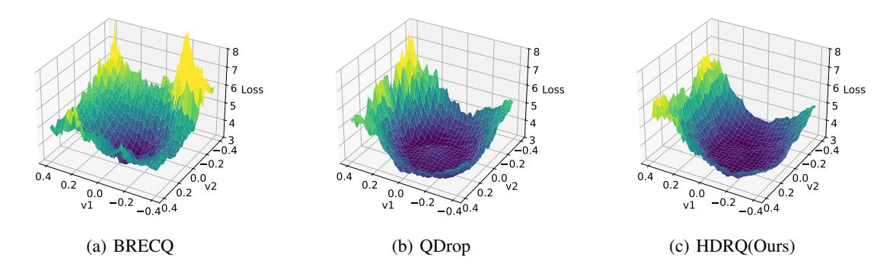
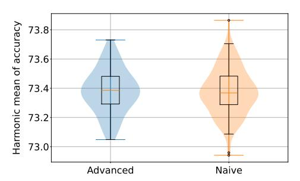

# 4. HDRQ: Hessian and Distance Regularizing Quantization

Building upon our previous analysis, we propose a novel quantization method called Hessian and Distance Regularizing Quantization (HDRQ). Our method incorporates two key strategies to enable merge-friendly quantized networks. First, it employs noise-based quantization to regularize the Hessian, reducing the sensitivity of the loss landscape to weight perturbations. Second, it introduces weight distance regularization, encouraging quantized models to converge that are inherently more compatible for merging.

Additionally, to address the rounding ambiguity problem that occurs during the merging of quantized models, we propose an advanced noise sampling-based rounding technique. This approach effectively mitigates ambiguity in rounding policies, ensuring stable weight merging and enhancing the overall quality of the adapted models.

#### 4.1. Noise-based hessian regularization

To regularize the Hessian of the network, HDRQ simulates quantization by introducing additive sampled quantization noise. For each optimization step involving weight w and quantization step size  $\Delta$ , we first compute the quantized weight  $\hat{w}$  under uniform quantization as follows:

Figure 2. Visualization of loss surfaces quantized with each method is shown. ResNet-50 adapted from Real domain to Clipart domain ( $R \rightarrow C$ ) is quantized to W4A8. HDRQ effectively regularize hessian with noise-based quantization, leading weights to flatter surface.

$$\hat{w} = clamp(\lfloor \frac{w}{\Delta} \rceil, -2^{b-1}, 2^{b-1} - 1) \cdot \Delta, \tag{8}$$

where b denotes the bit width. We then sample the quantization noise  $\epsilon$  from the quantization error  $w-\hat{w}$  and train using  $w+\epsilon$  instead of the deterministic quantized value  $\hat{w}$ . Since the quantization noise follows a uniform distribution  $U[-\frac{\Delta}{2},\frac{\Delta}{2}]$ , the modified loss function inherently regularizes the Hessian as follows:

$$E[\mathcal{L}(\hat{w})] \approx E[\mathcal{L}(w+e)]$$

$$\approx E[\mathcal{L}(w) + \epsilon \cdot \nabla_w \mathcal{L}(w) + \frac{1}{2} \epsilon^T \cdot \nabla_w^2 \mathcal{L}(w) \cdot \epsilon]$$

$$\approx E[\mathcal{L}(w) + \frac{1}{2} \epsilon^T \cdot \nabla_w^2 \mathcal{L}(w) \cdot \epsilon], \tag{9}$$

where the first-order term of the Taylor expansion vanishes because  $E[\epsilon] = 0$ . As a result, the expected loss function penalizes sharp curvature in the loss landscape, leading to implicit Hessian regularization.

While noise-based quantization is not a novel concept—its effectiveness has been established in prior works (Baskin et al., 2021; Défossez et al., 2022; Shin et al., 2023; Lin et al., 2023)—our approach is the first to integrate this technique within a model merging framework, motivated by theoretical analysis. This integration results in smoother loss surfaces and improved compatibility between quantized models during merging.

The effect of noise-based Hessian regularization is demonstrated in Figure 2. When this regularization technique is applied, the network converges to a smoother loss surface compared to existing methods. This smoother convergence not only enhances the robustness of the quantized model but also facilitates better merging compatibility by reducing sharp loss barriers between models.

Figure 3. The distribution of harmonic mean accuracy for merging W4A8 quantized  $C \rightarrow R$  and  $C \rightarrow A$  models on the Office-Home dataset is presented. Our simple yet effective cosine similarity-based method, denoted as Advanced, successfully filters out low-quality weights, stabilizing merging outcomes.

#### 4.2. Weight distance regularization

Measuring the distance between separately adapted weights for each domain is challenging, as no prior information about the target domain is assumed. Instead of directly minimizing this distance, HDRQ ensures that the distances between domain-adapted weights remain small by regularizing their distances from the source weight. The upper bound of the distance between the two domain-adapted weights,  $w_{tar1}$  and  $w_{tar2}$ , can be derived using the triangular inequality:

$$|w_{tar1} - w_{tar2}| \le |w_{src} - w_{tar1}| + |w_{src} - w_{tar2}|.$$
 (10)

Since both the source and domain-adapted weights reside within the same basin, enforcing this regularization during quantization is unlikely to significantly degrade weight quality. To implement this, we introduce a regularization term based on the  $l_2$ -norm between the source and target weights.

It is important to note that assuming access to the original weights is reasonable. In most deployment scenarios, models are initially pretrained on source data and subsequently adapted on user devices using user-specific data.

Table 1. Quantization and multi-target domain adaptation results on semantic segmentation task

| Method | Bit(W/A) | Domain                                           | $p_{QQ}$       | sidewalk      | building.      | lle M | fence          | $^{POle}$      | tr affic light | traffic sign   | vegetation     | tenain         | Sys            | Person         | $^{nide_r}$    | car            | huck           | pas            | train         | motorcycle     | bicycle        | mIoU                  |
|--------|----------|--------------------------------------------------|----------------|---------------|----------------|------------------|----------------|----------------|---------------------------|----------------|----------------|----------------|----------------|----------------|----------------|----------------|----------------|----------------|---------------|----------------|----------------|-----------------------|
| FP     | 32/32    | $\begin{matrix} G \to C \\ G \to I \end{matrix}$ | 95.71 97.23 | 72.37 4.41 | 88.52 80.91 | 27.88 38.86   | 22.65 11.03 | 49.62 34.70 | 59.37 21.50            | 69.97 44.18 | 89.47 80.83 | 44.69 39.80 | 89.63 95.71 | 77.37 72.56 | 49.26 63.62 | 91.29 80.25 | 54.30 58.56 | 56.65 60.16 | 38.22 0.00 | 36.91 78.63 | 58.25 26.13 | 61.69 52.06        |
| BRECQ  | 6/6      | $\begin{matrix} G \to C \\ G \to I \end{matrix}$ | 95.85 97.15 | 71.73 5.40 | 88.44 80.55 | 25.12 38.57   | 23.72 13.90 | 48.83 35.48 | 57.46 16.98            | 69.42 43.58 | 89.24 80.51 | 43.63 39.09 | 89.39 95.51 | 76.78 72.36 | 47.82 63.35 | 91.40 80.09 | 54.53 58.52 | 55.48 59.23 | 36.65 0.00 | 33.76 77.97 | 57.17 25.92 | 60.86 <b>51.80</b> |
| QDrop  | 6/6      | $\begin{matrix} G \to C \\ G \to I \end{matrix}$ | 95.54 97.13 | 71.41 4.61 | 88.49 80.70 | 28.33 39.01   | 23.82 11.60 | 48.87 34.05 | 58.38 17.87            | 70.06 44.21 | 89.52 80.63 | 44.63 39.69 | 89.73 95.62 | 76.79 71.99 | 48.04 63.37 | 91.19 79.95 | 53.13 59.01 | 57.66 59.96 | 35.94 0.00 | 35.89 78.18 | 57.62 23.82 | 61.32 51.65        |
| Ours   | 6/6      | $\begin{matrix} G \to C \\ G \to I \end{matrix}$ | 95.64 97.20 | 71.83 7.34 | 88.47 80.60 | 29.46 38.80   | 23.11 13.39 | 49.33 34.68 | 57.98 13.55            | 69.96 43.53 | 89.45 80.75 | 44.22 39.97 | 89.57 95.65 | 76.72 71.34 | 47.32 62.69 | 91.32 79.68 | 55.12 58.95 | 56.35 59.61 | 35.60 0.00 | 39.23 78.00 | 58.61 23.41 | <b>61.54</b> 51.53    |
| BRECQ  | 4/4      | $\begin{matrix} G \to C \\ G \to I \end{matrix}$ | 90.36 94.90 | 41.90 2.01 | 83.73 71.59 | 12.16 27.91   | 24.78 19.49 | 42.92 28.61 | 43.57 2.53             | 57.77 35.70 | 87.96 77.04 | 40.64 34.97 | 88.05 91.49 | 72.89 60.66 | 40.63 58.42 | 81.28 78.41 | 45.13 55.01 | 48.32 47.64 | 36.81 0.00 | 28.63 68.97 | 52.27 9.05  | 53.67 45.50        |
| QDrop  | 4/4      | $\begin{matrix} G \to C \\ G \to I \end{matrix}$ | 94.94 96.68 | 69.01 2.48 | 87.85 79.38 | 24.99 36.29   | 24.55 12.31 | 46.99 32.32 | 53.66 10.40            | 68.27 42.19 | 88.86 80.39 | 43.07 39.97 | 88.94 95.22 | 74.53 69.19 | 43.87 61.52 | 89.95 78.48 | 49.29 56.80 | 54.44 54.87 | 27.51 0.00 | 32.76 75.98 | 56.04 14.90 | 58.92 49.44        |
| Ours   | 4/4      | $\begin{matrix} G \to C \\ G \to I \end{matrix}$ | 95.23 96.74 | 69.78 3.52 | 87.63 79.03 | 26.60 35.56   | 20.82 11.54 | 46.93 33.04 | 51.65 7.22             | 67.90 40.18 | 89.04 79.71 | 42.25 38.76 | 89.12 95.41 | 73.63 66.29 | 38.86 59.74 | 90.13 78.23 | 47.50 56.89 | 52.09 55.09 | 25.88 0.00 | 34.97 75.67 | 56.46 12.29 | 58.23 48.68        |

(a) Quantization results on each target domain

| Method | Bit(W/A) | Metric      | $p_{eQ_I}$              | sidewalk                | building                | $He_{Al}$               | $fe_{nce}$              | Pole                    | tr affic light | traffic sign            | Vegetation              | tenain                  | Ŋs                      | $per_{SOR}$             | $ride_r$                | Car                     | tnck                    | snq                     | train                 | motorcycle              | bicycle                 | mIoU                            |
|--------|----------|-------------|-------------------------|-------------------------|-------------------------|-------------------------|-------------------------|-------------------------|---------------------------|-------------------------|-------------------------|-------------------------|-------------------------|-------------------------|-------------------------|-------------------------|-------------------------|-------------------------|-----------------------|-------------------------|-------------------------|---------------------------------|
| FP     | 32/32    | C I H | 91.68 97.21 94.36 | 49.98 33.64 40.21 | 86.83 80.12 83.34 | 36.25 35.85 36.05 | 38.83 24.95 30.38 | 46.82 32.95 38.68 | 54.05 24.76 33.96   | 55.10 41.86 47.58 | 89.31 79.45 84.09 | 42.77 34.70 38.31 | 90.18 94.54 92.31 | 75.37 73.88 74.62 | 41.86 60.97 49.64 | 89.99 78.01 83.57 | 50.51 51.37 50.94 | 58.04 57.71 57.87 | 22.46 0.00 0.00 | 35.38 76.96 48.48 | 48.86 37.65 42.53 | 58.12 53.50 55.71         |
| BRECQ  | 6/6      | C I H | 87.51 96.90 91.94 | 37.85 32.24 34.55 | 84.99 78.21 81.45 | 23.90 29.63 26.36 | 31.28 21.66 25.51 | 42.44 31.31 36.01 | 48.39 22.24 30.38   | 49.52 38.83 43.36 | 87.78 78.86 83.07 | 36.48 35.62 35.78 | 87.56 93.76 90.54 | 73.02 71.12 72.05 | 39.78 58.71 47.38 | 78.03 74.51 76.04 | 45.79 45.03 45.31 | 53.45 53.68 53.52 | 16.66 0.00 0.00 | 29.20 75.09 41.74 | 44.35 33.85 38.37 | 52.52 51.12 51.80         |
| QDrop  | 6/6      | C I H | 87.44 96.72 91.83 | 40.12 32.46 35.77 | 85.08 78.58 81.69 | 26.04 30.58 28.04 | 31.94 23.90 27.25 | 41.82 31.57 35.95 | 48.95 26.10 33.93   | 52.07 41.38 46.10 | 88.20 78.99 83.34 | 37.60 33.11 34.84 | 88.60 94.16 91.29 | 73.27 72.06 72.66 | 38.60 59.50 46.81 | 76.99 74.41 75.50 | 47.67 46.93 47.25 | 55.27 54.44 54.84 | 19.81 0.00 0.00 | 28.42 75.09 41.14 | 43.40 34.64 38.51 | 53.23 51.82 52.51         |
| Ours   | 6/6      | C I H | 89.38 97.48 93.25 | 47.97 33.35 39.25 | 85.19 78.82 81.87 | 29.36 32.82 30.95 | 34.05 23.84 28.02 | 43.76 31.86 36.86 | 50.22 25.15 33.45   | 54.24 42.09 47.38 | 88.57 78.83 83.41 | 39.32 36.55 37.84 | 88.75 94.39 91.48 | 73.62 72.42 73.01 | 37.92 59.65 46.34 | 82.34 76.45 79.24 | 48.63 48.35 48.45 | 55.45 54.81 55.11 | 19.29 0.00 0.00 | 30.00 76.06 42.86 | 44.58 36.18 39.94 | 54.88 52.58 <b>53.70</b>  |
| BRECQ  | 4/4      | C I H | 60.65 84.71 70.06 | 5.48 18.07 8.09   | 67.05 56.39 60.55 | 4.87 12.74 6.90   | 8.51 13.03 9.90   | 13.56 18.91 15.58 | 22.22 8.46 12.08    | 17.46 23.55 19.37 | 70.92 70.04 70.40 | 13.59 24.72 16.70 | 71.41 74.94 72.51 | 43.65 48.00 45.53 | 8.59 38.98 13.74  | 59.05 54.66 56.43 | 17.26 27.67 20.32 | 28.61 25.98 26.76 | 8.14 0.00 0.00  | 16.01 53.86 24.25 | 17.93 16.80 16.98 | 29.21 35.34 31.95         |
| QDrop  | 4/4      | C I H | 80.75 91.54 85.70 | 10.68 17.59 12.45 | 77.57 67.78 72.13 | 12.62 22.80 16.08 | 19.34 18.99 18.85 | 25.28 23.79 24.41 | 29.52 11.66 16.50   | 37.63 36.53 37.00 | 80.47 75.05 77.64 | 21.73 27.07 23.54 | 78.26 86.68 82.07 | 61.92 62.28 62.08 | 21.18 49.08 29.25 | 74.64 68.91 71.32 | 34.81 34.67 34.57 | 41.43 41.01 41.05 | 6.45 0.00 0.00  | 18.77 65.66 28.81 | 25.25 22.87 23.89 | 39.91 43.37 41.54         |
| Ours   | 4/4      | C I H | 83.36 94.78 88.67 | 18.63 25.67 21.08 | 80.15 73.27 76.49 | 16.81 25.85 20.28 | 26.99 19.49 22.50 | 34.00 28.28 30.82 | 35.01 17.94 23.60   | 43.11 38.15 40.45 | 84.96 78.35 81.51 | 28.75 30.46 29.37 | 81.18 91.85 86.12 | 67.49 67.13 67.29 | 25.84 53.48 34.65 | 77.21 70.81 73.69 | 40.20 38.92 39.50 | 42.72 45.66 44.00 | 6.99 0.00 0.00  | 20.91 69.90 31.95 | 30.04 26.23 27.95 | 44.44 47.17 <b>45.7</b> 5 |

(b) Multi-target domain adaptation via model merging results. C and I represents CityScapes and Indian Driving Dataset, respectively. H denotes the harmonic mean of performance on C and I. HDRQ demonstrates comparable or superior performance across all settings.

#### 4.3. Handling ambiguity in rounding policy

While HDRQ optimizes the network to a more mergefriendly state, naive merging may still lead to quality degradation due to ambiguity in the rounding policy.

Consider two quantized values being merged with integer representations  $I_1$  and  $I_2$ , and step sizes  $\Delta_1$  and  $\Delta_2$ , respectively. Using the midpoint merging technique described in (Li et al., 2024), if the sum of  $I_1$  and  $I_2$  is an odd number, the merged integer value falls between two adjacent integers, leading to ambiguity in the rounding direction. A potential solution is to merge in the floating-point domain as follows:

$$I_{merged} = \lfloor \frac{I_1 \cdot \Delta_1 + I_2 \cdot \Delta_2}{\Delta_1 + \Delta_2} \rceil. \tag{11}$$

However, when the step sizes  $\Delta_1$  and  $\Delta_2$  are similar, this

approach again degenerates into an ambiguous case, as the  $\Delta$  terms effectively cancel out. This issue is particularly pronounced in domain adaptation scenarios, where weights are fine-tuned from shared source weights with a small learning rate, making their step sizes likely to be similar.

To handle the ambiguity problem in rounding policies, HDRQ employs noise sampling during the merging process. Instead of merging weights directly in the integer or floating-point domain, we sample noise  $\epsilon \sim U[-\frac{\Delta}{2},\frac{\Delta}{2}]$  and add it to the weights prior to merging. This maintains the same quantized representation as the original values while mitigating ambiguity:

$$I_{merged} = \left\lfloor \frac{(I_1 \cdot \Delta_1 + \epsilon_1) + (I_2 \cdot \Delta_2 + \epsilon_2)}{\Delta_1 + \Delta_2} \right\rceil.$$
 (12)

Table 2. Multi-target domain adaptation results on the Office-Home dataset. The harmonic mean of accuracy across three target domains for the merged model is reported as the main metric, with individual domain performance of each quantized models provided in parentheses. The best accuracy for each configuration is highlighted in bold, with red text indicating a gap of more than 1% compared to the second-best result. Blue text highlights cases where previous methods failed to converge to a flat loss surface. Note that sampling is not applied in this setting, as there is no ambiguity in merging across the three-task scenario.

| Domain     | FP                  | Methods | W8A8                | W8A4                | W4A8                | W4A4                | W3A3                |  |
|------------|---------------------|---------|---------------------|---------------------|---------------------|---------------------|---------------------|--|
|            |                     | BRECQ   | 67.74               | 64.79               | 64.15               | 60.95               | 43.66               |  |
|            |                     |         | (73.55 59.18 83.85) | (73.09 55.62 82.92) | (73.38 59.11 83.87) | (72.89 56.56 82.70) | (67.00 47.74 73.49) |  |
| R −→ A,C,P | 67.78               | QDrop   | 67.91               | 67.4                | 64.85               | 66.26               | 62.99               |  |
|            | (73.59 59.22 83.87) |         | (73.51 59.20 83.83) | (73.34 59.24 83.78) | (73.71 59.15 83.92) | (73.47 58.99 83.92) | (73.14 58.69 83.62) |  |
|            |                     |         | 67.46               | 66.71               | 66.74               | 66.41               | 64.70               |  |
|            |                     | HDRQ    | (73.34 59.06 83.85) | (73.34 59.18 83.71) | (73.42 59.20 83.89) | (73.42 59.04 83.87) | (72.81 58.72 83.33) |  |
|            |                     |         | 68.75               | 65.4                | 66.06               | 62.53               | 48.04               |  |
|            |                     | BRECQ   | (81.71 56.01 78.06) | (80.06 54.91 77.16) | (81.73 55.99 77.99) | (80.35 55.49 77.11) | (71.43 48.84 71.32) |  |
| A −→ R,C,P | 68.80               |         | 68.75               | 68.24               | 66.83               | 66.04               | 64.22               |  |
|            | (81.78 55.99 78.06) | QDrop   | (81.71 55.97 78.04) | (81.75 55.85 78.15) | (81.66 55.88 78.04) | (81.80 55.78 78.13) | (81.41 55.67 77.88) |  |
|            |                     |         | 68.10               | 68.15               | 67.80               | 67.58               | 65.29               |  |
|            |                     | HDRQ    | (81.73 55.92 77.97) | (81.75 55.78 77.97) | (81.68 55.92 78.04) | (81.89 55.83 77.83) | (80.97 55.40 78.04) |  |
|            |                     |         | 74.75               | 73.51               | 73.22               | 71.31               | 56.16               |  |
|            |                     | BRECQ   | (79.07 68.89 79.39) | (78.70 68.81 79.07) | (79.11 69.06 79.39) | (78.49 68.81 78.91) | (72.69 64.69 70.40) |  |
| C −→ R,A,P | 75.07               |         | 74.79               | 74.58               | 73.81               | 73.25               | 71.01               |  |
|            | (79.11 68.97 79.43) | QDrop   | (79.09 68.89 79.43) | (79.23 68.85 79.45) | (79.11 68.89 79.36) | (79.23 68.69 79.39) | (79.07 68.40 79.25) |  |
|            |                     |         | 74.58               | 73.70               | 74.26               | 73.58               | 71.63               |  |
|            |                     | HDRQ    | (79.14 69.14 79.34) | (79.21 68.69 79.14) | (79.23 68.77 79.39) | (79.11 68.60 79.18) | (78.77 68.07 78.96) |  |
|            |                     |         | 65.14               | 63.27               | 64.09               | 61.92               | 45.09               |  |
|            |                     | BRECQ   | (81.96 68.19 55.90) | (80.88 67.94 54.73) | (82.03 68.15 56.06) | (81.25 67.82 53.97) | (72.11 62.75 41.90) |  |
| P −→ R,A,C | 65.25               |         | 64.8                | 64.52               | 62.52               | 63.22               | 61.24               |  |
|            | (82.03 68.27 55.95) | QDrop   | (81.98 68.27 55.97) | (82.05 67.86 55.99) | (82.10 68.19 55.88) | (81.89 68.07 56.08) | (81.68 67.82 55.51) |  |
|            |                     |         | 64.51               | 64.09               | 63.93               | 63.19               | 61.55               |  |
|            |                     | HDRQ    | (81.91 68.11 56.08) | (81.96 68.15 56.01) | (82.01 68.19 55.83) | (82.10 68.19 55.90) | (81.23 67.45 55.33) |  |

Since noise sampling introduces randomness, it is crucial to reject noise samples that could degrade the quality of the merged network. To achieve this, we evaluate the cosine similarity between the vector connecting the merged sampled weights to the target domain weights and the original interpolation vector connecting the target domain weights. The sample with the highest similarity is selected, ensuring highquality merging. As shown in Figure [3,](#page-4-1) this straightforward yet effective approach successfully filters out low-quality weight samples and stabilizes the merging quality.

## 5. Experimental Results

To validate the effectiveness of our proposed HDRQ method, we conduct experiments on multi-target domain adaptation tasks for semantic segmentation and image classification. Following our initial objective, we adopt the merging-based multi-target domain adaptation approach [\(Li et al.,](#page-8-0) [2024\)](#page-8-0), where models are first adapted independently to each target domain and then merged for unified multi-target adaptation. Quantization is applied between the single-target domain adaptation and the merging process. The harmonic mean of performances across target domains is reported as the

primary evaluation metric. Unless otherwise specified, advanced noise-based sampling is used during the merging step after quantization. We report the mean results from 30 sampled weights for semantic segmentation.

Semantic Segmentation For semantic segmentation, we use the GTA synthetic dataset [\(Richter et al.,](#page-9-7) [2016\)](#page-9-7) as the source domain and two real-world datasets, Cityscapes [\(Cordts](#page-8-15) [et al.,](#page-8-15) [2016\)](#page-8-15) and Indian Driving datasets [\(Varma et al.,](#page-9-8) [2019\)](#page-9-8), as the target domains. We adopt HRDA [\(Hoyer et al.,](#page-8-16) [2022\)](#page-8-16) as the single-target domain adaptation method, using ResNet-101 [\(He et al.,](#page-8-17) [2016\)](#page-8-17) as the backbone model and simple convolution head. All other settings are kept consistent with the original paper.

Image Classification For image classification, we use the Office-Home dataset [\(Venkateswara et al.,](#page-9-9) [2017\)](#page-9-9), which consists of four domains (Real, Art, Clipart, and Product). We select one of the four domains as the source domain and treat the other three as target domains. ResNet-50 [\(He et al.,](#page-8-17) [2016\)](#page-8-17) is used as the backbone architecture, and SHOT [\(Liang et al.,](#page-8-10) [2020\)](#page-8-10) is adopted as the single-target domain adaptation method. Adaptation settings follow the original work.

Quantization Details Quantization is applied after folding batch normalization layers. Thus, batch normalization layers do not need to be considered and only mid-point weight averaging is used for the merging process. The hyperparameter λ for weight distance regularization is set to 5e-2 for all tasks. HDRQ conducts 20,000 iterations of block-wise reconstruction, including activation quantization with partial dropout. We use the Adam optimizer with an initial learning rate of 0.001 and a cosine annealing with warmup. For the last 3,500 iterations of reconstruction, we switch from noisebased quantization simulation to actual fake quantization, which stabilizes training and improves the final results by decreasing the gap between simulated and actual quantization. It is important to note that most reconstruction is conducted with noise-based quantization, and the learning rate becomes very small at the final stage, ensuring this switch does not undermine our objectives.

#### 5.1. Semantic Segmentation

The results for multi-target domain adaptation on semantic segmentation are presented in Section [4.1.](#page-4-1) HDRQ demonstrates comparable performance to QDrop for the quantization task itself, while the merged quantized models significantly outperform other methods after multi-target domain adaptation. The benefits of HDRQ become more pronounced as the bit precision decreases, where the impact of quantization on model merging becomes more severe. While HDRQ surpasses QDrop by a modest 1.19 mIoU in the W6A6 setting, it achieves a much more substantial improvement of 4.21 mIoU in the W4A4 setting.

These results highlight the importance of robust quantization strategies for successful multi-target domain adaptation via model merging and validate the effectiveness of the Hessian and distance regularizations proposed by HDRQ.

#### 5.2. Office Home

The experimental results on the Office-Home dataset [\(Venkateswara et al.,](#page-9-9) [2017\)](#page-9-9) are summarized in Table [2.](#page-6-0) We report the harmonic mean of accuracies across target domains, with the best results highlighted in bold, and red-colored results indicating accuracy gains of over > 1% compared to the second-best result.

For the relatively easy-to-quantize Office-Home task, all methods achieve comparable performance when weight precision is high. However, in specific settings such as R −→ A,C,P, when weights are quantized into lower bit-width, previous methods exhibit significant performance degradation compared to HDRQ.

We conjecture that this discrepancy arises because previous methods occasionally fail to converge to flat minima, which are critical for successful merging after quantization. Since

Table 3. Incremental ablation study on each component of HDRQ

| Method                     | Accuracy                     |  |  |  |  |
|----------------------------|------------------------------|--|--|--|--|
| Baseline                   | 62.99 (73.14 58.69 83.62) |  |  |  |  |
| + Noise-based quantization | 64.21 (73.42 58.65 83.67) |  |  |  |  |
| + Distance regularization  | 64.70 (72.81 58.72 83.33) |  |  |  |  |

block-wise reconstruction and partial dropping may regularize overall hessian of loss landscape, it may not effective to handle lumps around actual converged points. In contrast, HDRQ effectively guides the network to smoother loss surfaces by direct injection of noise to weights, as visualized in Figure [2.](#page-4-0) This ability to find flatter minima is particularly evident in the P −→ R, A, C task, where QDrop struggles to merge the models successfully. HDRQ, however, demonstrates robust and consistent performance, achieving either comparable or superior results across all evaluated settings.

#### 5.3. Ablation Study

To evaluate the effectiveness of each component in HDRQ, we conducted an incremental ablation study on the Office-Home dataset under the W3A3 precision, R −→A,C,P setting. The results are presented in Table [3.](#page-7-0)

When neither noise-based quantization nor weight distance regularization was applied, our method degenerated to QDrop, which only employs block-wise reconstruction and partial dropping during quantization. Introducing the noise-based quantization scheme yielded a significant performance gain of 1.22% , highlighting the importance of direct regularization around the converged solution surface.

Further incorporating weight distance regularization brought an additional 0.49% accuracy gain, showing the effectiveness of keeping target domain weights close to each other for improved merging stability. These results underscore the combined value of noise-based quantization and distance regularization in HDRQ for enhancing model merging.

## 6. Conclusion

In this paper, we analyze the impact of quantization on model merging, particularly its effect on the error barrier. Building on this, we propose HDRQ, a post-training quantization scheme tailored for multi-target domain adaptation. HDRQ leverages noise-based quantization to regularize the Hessian and applies weight distance regularization to facilitate better merging. It also mitigates the rounding ambiguity inherent in naive merging methods through noise sampling. Experimental results demonstrate that HDRQ consistently outperforms previous approaches, validating its superiority.

## Acknowledgements

This work was supported by IITP and NRF grant funded by the Korea government(MSIT) (No. RS-2019-II191906, RS-2024-00396013, RS-2023-00228970, RS-2024-00457882).

## Impact Statement

This paper addresses the novel problem of combining quantization with multi-target domain adaptation and proposes an effective solution. Our work holds potential societal contributions by advancing the practical deployment of machine learning models with reduced computational and memory footprints.

## References

- Ainsworth, S., Hayase, J., and Srinivasa, S. Git re-basin: Merging models modulo permutation symmetries. In *The Eleventh International Conference on Learning Representations*, 2023.
- Baskin, C., Zheltonozhkii, E., Rozen, T., Liss, N., Chai, Y., Schwartz, E., Giryes, R., Bronstein, A. M., and Mendelson, A. Nice: Noise injection and clamping estimation for neural network quantization. *Mathematics*, 9(17):2144, 2021.
- Bengio, Y., Leonard, N., and Courville, A. C. Estimating ´ or propagating gradients through stochastic neurons for conditional computation. *CoRR*, abs/1308.3432, 2013. URL <http://arxiv.org/abs/1308.3432>.
- Cordts, M., Omran, M., Ramos, S., Rehfeld, T., Enzweiler, M., Benenson, R., Franke, U., Roth, S., and Schiele, B. The cityscapes dataset for semantic urban scene understanding. In *Proc. of the IEEE Conference on Computer Vision and Pattern Recognition (CVPR)*, 2016.
- Defossez, A., Adi, Y., and Synnaeve, G. Differentiable ´ model compression via pseudo quantization noise. *Transactions on Machine Learning Research*, 2022. ISSN 2835-8856.
- Esser, S. K., McKinstry, J. L., Bablani, D., Appuswamy, R., and Modha, D. S. Learned step size quantization. In *International Conference on Learning Representations*, 2020.
- Frankle, J., Dziugaite, G. K., Roy, D., and Carbin, M. Linear mode connectivity and the lottery ticket hypothesis. In III, H. D. and Singh, A. (eds.), *Proceedings of the 37th International Conference on Machine Learning*, volume 119 of *Proceedings of Machine Learning Research*, pp. 3259–3269. PMLR, 13–18 Jul 2020.

- Gholami, B., Sahu, P., Rudovic, O., Bousmalis, K., and Pavlovic, V. Unsupervised multi-target domain adaptation: An information theoretic approach. *IEEE Transactions on Image Processing*, 29:3993–4002, 2020. doi: 10.1109/TIP.2019.2963389.
- He, K., Zhang, X., Ren, S., and Sun, J. Deep residual learning for image recognition. In *Proceedings of the IEEE Conference on Computer Vision and Pattern Recognition (CVPR)*, June 2016.
- Hou, Y. and Zheng, L. Source free domain adaptation with image translation, 2021.
- Hoyer, L., Dai, D., and Van Gool, L. Hrda: Context-aware high-resolution domain-adaptive semantic segmentation. In *European conference on computer vision*, pp. 372–391. Springer, 2022.
- Li, W., Gao, H.-a., Gao, M., Tian, B., Zhi, R., and Zhao, H. Training-free model merging for multi-target domain adaptation. In *European Conference on Computer Vision*. Springer, 2024.
- Li, Y., Gong, R., Tan, X., Yang, Y., Hu, P., Zhang, Q., Yu, F., Wang, W., and Gu, S. {BRECQ}: Pushing the limit of post-training quantization by block reconstruction. In *International Conference on Learning Representations*, 2021.
- Liang, J., Hu, D., and Feng, J. Do we really need to access the source data? Source hypothesis transfer for unsupervised domain adaptation. In III, H. D. and Singh, A. (eds.), *Proceedings of the 37th International Conference on Machine Learning*, volume 119 of *Proceedings of Machine Learning Research*, pp. 6028–6039. PMLR, 13–18 Jul 2020.
- Lin, C., Peng, B., Li, Z., Tan, W., Ren, Y., Xiao, J., and Pu, S. Bit-shrinking: Limiting instantaneous sharpness for improving post-training quantization. In *Proceedings of the IEEE/CVF Conference on Computer Vision and Pattern Recognition (CVPR)*, pp. 16196–16205, June 2023.
- Liu, Y., Zhang, W., and Wang, J. Source-free domain adaptation for semantic segmentation. In *Proceedings of the IEEE/CVF Conference on Computer Vision and Pattern Recognition (CVPR)*, pp. 1215–1224, June 2021.
- Long, M., Zhu, H., Wang, J., and Jordan, M. I. Unsupervised domain adaptation with residual transfer networks. In Lee, D., Sugiyama, M., Luxburg, U., Guyon, I., and Garnett, R. (eds.), *Advances in Neural Information Processing Systems*, volume 29. Curran Associates, Inc., 2016.
- Nagel, M., Amjad, R. A., Van Baalen, M., Louizos, C., and Blankevoort, T. Up or down? adaptive rounding for posttraining quantization. In *International Conference on Machine Learning*, pp. 7197–7206. PMLR, 2020.

- Nguyen-Meidine, L. T., Belal, A., Kiran, M., Dolz, J., Blais-Morin, L.-A., and Granger, E. Unsupervised multi-target domain adaptation through knowledge distillation. In *Proceedings of the IEEE/CVF Winter Conference on Applications of Computer Vision (WACV)*, pp. 1339–1347, January 2021.
- Richter, S. R., Vineet, V., Roth, S., and Koltun, V. Playing for data: Ground truth from computer games. In Leibe, B., Matas, J., Sebe, N., and Welling, M. (eds.), *European Conference on Computer Vision (ECCV)*, volume 9906 of *LNCS*, pp. 102–118. Springer International Publishing, 2016.
- Shin, J., So, J., Park, S., Kang, S., Yoo, S., and Park, E. Nipq: Noise proxy-based integrated pseudo-quantization. In *Proceedings of the IEEE/CVF Conference on Computer Vision and Pattern Recognition (CVPR)*, pp. 3852–3861, June 2023.
- Stoica, G., Bolya, D., Bjorner, J. B., Ramesh, P., Hearn, T., and Hoffman, J. Zipit! merging models from different tasks without training. In *The Twelfth International Conference on Learning Representations*, 2024. URL [https://openreview.net/forum?](https://openreview.net/forum?id=LEYUkvdUhq) [id=LEYUkvdUhq](https://openreview.net/forum?id=LEYUkvdUhq).
- Varma, G., Subramanian, A., Namboodiri, A., Chandraker, M., and Jawahar, C. IDD: A Dataset for Exploring Problems of Autonomous Navigation in Unconstrained Environments . In *2019 IEEE Winter Conference on Applications of Computer Vision (WACV)*, pp. 1743–1751, Los Alamitos, CA, USA, January 2019. IEEE Computer Society. doi: 10.1109/WACV.2019.00190.
- Venkateswara, H., Eusebio, J., Chakraborty, S., and Panchanathan, S. Deep hashing network for unsupervised domain adaptation. In *Proceedings of the IEEE Conference on Computer Vision and Pattern Recognition*, pp. 5018–5027, 2017.
- Wei, X., Gong, R., Li, Y., Liu, X., and Yu, F. QDrop: Randomly dropping quantization for extremely low-bit posttraining quantization. In *International Conference on Learning Representations*, 2022.
- Xu, Z., Yuan, K., Wang, H., Wang, Y., Song, M., and Song, J. Training-free pretrained model merging. In *Proceedings of the IEEE/CVF Conference on Computer Vision and Pattern Recognition (CVPR)*, pp. 5915–5925, June 2024.
- Yu, H., Hu, M., and Chen, S. Multi-target unsupervised domain adaptation without exactly shared categories, 2018.
- Zou, Y., Yu, Z., Kumar, B. V., and Wang, J. Unsupervised domain adaptation for semantic segmentation via

class-balanced self-training. In *Proceedings of the European Conference on Computer Vision (ECCV)*, September 2018.