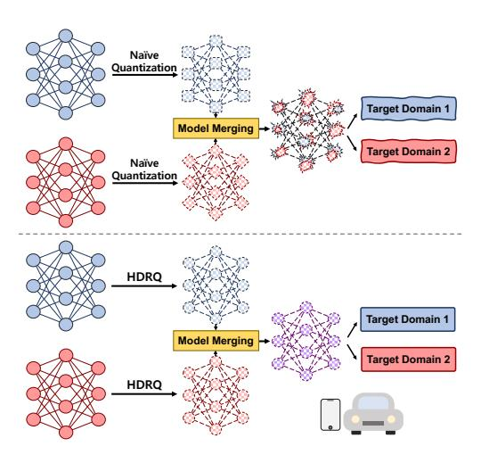

## Merge-Friendly Post-Training Quantization for Multi-Target Domain Adaptation

Juncheol Shin 1 Minsang Seok 2 Seonggon Kim 2 Eunhyeok Park 1 2

## Abstract

Model merging has emerged as a powerful technique for combining task-specific weights, achieving superior performance in multi-target domain adaptation. However, when applied to practical scenarios, such as quantized models, new challenges arise. In practical scenarios, quantization is often applied to target-specific data, but this process restricts the domain of interest and introduces discretization effects, making model merging highly non-trivial. In this study, we analyze the impact of quantization on model merging through the lens of error barriers. Leveraging these insights, we propose a novel post-training quantization, HDRQ - Hessian and distant regularizing quantization - that is designed to consider model merging for multi-target domain adaptation. Our approach ensures that the quantization process incurs minimal deviation from the source pre-trained model while flattening the loss surface to facilitate smooth model merging. To our knowledge, this is the first study on this challenge, and extensive experiments confirm its effectiveness.

## 1. Introduction

Large-scale models have driven breakthroughs across various domains, particularly in generative AI, enabling efficient adaptation to multiple tasks and user-specific data. However, deploying such models on resource-constrained devices remains a significant challenge due to their computational demands. In this perspective, model merging has emerged as a promising technique that enables multi-target domain adaptation without additional training. A recent study on multi-

*Proceedings of the* 42 nd *International Conference on Machine Learning*, Vancouver, Canada. PMLR 267, 2025. Copyright 2025 by the author(s).

Figure 1. We propose a quantization scheme designed with future merging in mind. Our method ensures that networks are quantized to a more merge-friendly state, reducing the degradation induced by merging.

target domain adaptation [\(Li et al.,](#page-8-0) [2024\)](#page-8-0) demonstrated that models fine-tuned for different target domains can be fused into a single general model via simple weight averaging, even in a training-free manner. This discovery highlights the potential of real-time adaptive AI.

Despite its promise, a major obstacle in achieving practical multi-target domain adaptation is the effect of quantization. Quantization is essential for reducing memory and computational costs for efficiency, but it introduces discretization that is not well aligned with the merging idea, leading to suboptimal merging and degraded performance. While previous works have extensively explored quantization and domain adaptation separately, little attention has been given to their interplay. In particular, no existing research systematically investigates how quantization influences model merging or proposes solutions to mitigate its impact.

To address this challenge, we introduce HDRQ (Hessian and Distance Regularizing Quantization), the first post-training quantization (PTQ) method designed to preserve merging compatibility in multi-target domain adaptation. Our key contributions are as follows:

1Graduate School of Artificial Intelligence, Pohang University of Science and Technology (POSTECH), Pohang, Republic of Korea 2Department of Computer Science and Engineering, Pohang University of Science and Technology (POSTECH), Pohang, Republic of Korea. Correspondence to: Eunhyeok Park <eh.park@postech.ac.kr>.

- Theoretical Analysis of Quantization's Impact on Model Merging: We extend the concept of the error barrier [\(Frankle et al.,](#page-8-1) [2020\)](#page-8-1) to analyze how weight perturbations from quantization affect merging quality. Our study reveals that quantization-induced misalignment reduces merging effectiveness across different adaptation scenarios.
- Regularization for Merge-Friendly Quantization: Based on our analysis, HDRQ incorporates two key regularization techniques to ensure that quantized models remain merge-compatible:
  - *Hessian Regularization:* By controlling sensitivity to perturbations, we mitigate the adverse effects of quantization on merging stability.
  - *Distance Regularization:* By reducing weight divergence among quantized models, we enhance their ability to merge effectively.
- Noise-Sampling-Based Rounding: We introduce an advanced rounding mechanism that resolves the rounding ambiguity problem in conventional quantization, ensuring more stable weight updates.

We evaluate HDRQ across multiple datasets and compare it against conventional PTQ methods. Our key findings are:

- Comparable or Superior Single-Model Performance: HDRQ maintains accuracy on individual quantized models, performing on par with or better than existing PTQ methods.
- Significantly Improved Merging Performance: Unlike standard PTQ, which degrades merging quality, HDRQ ensures that merged models achieve higher accuracy and better generalization. For example, HDRQ improves the performance of merged model by 4.21 mIoU compared to conventional PTQ in the multitarget domain adaptation task for semantic segmentation.
- Robust Multi-Target Domain Adaptation: HDRQ consistently improves merging outcomes across different adaptation settings, confirming its effectiveness in real-world scenarios.

By addressing the impact of quantization through theoretical analysis and targeted regularization, HDRQ ensures that quantized models remain merge-compatible, paving the way for real-time adaptive AI on resource-constrained devices.

## 2. Related Work

#### 2.1. Quantization

Quantization is a crucial technique for reducing model size and computational cost, making deep learning models more practical for resource-constrained environments. Research on quantization can be broadly categorized into two approaches: Quantization-Aware Training (QAT) and Post-Training Quantization (PTQ).

The first category, Quantization-Aware Training (QAT) [\(Esser et al.,](#page-8-2) [2020;](#page-8-2) [Baskin et al.,](#page-8-3) [2021;](#page-8-3) [Defossez](#page-8-4) ´ [et al.,](#page-8-4) [2022;](#page-8-4) [Shin et al.,](#page-9-0) [2023\)](#page-9-0), fine-tunes full-precision models using fake quantization operators and straight-through estimators (STE) [\(Bengio et al.,](#page-8-5) [2013\)](#page-8-5) to approximate gradients. These methods leverage the full dataset to compensate for errors induced by quantization. A notable subfield within QAT is noise-based quantization [\(Baskin](#page-8-3) [et al.,](#page-8-3) [2021;](#page-8-3) [Defossez et al.](#page-8-4) ´ , [2022;](#page-8-4) [Shin et al.,](#page-9-0) [2023\)](#page-9-0), which models quantization noise as an additive perturbation to weights, eliminating the need for STE and improving stability.

The second category, Post-Training Quantization (PTQ), enables quantization without full retraining, making it more efficient but often at the cost of performance degradation. Various techniques have been developed to enhance PTQ: [\(Nagel et al.,](#page-8-6) [2020\)](#page-8-6) proposed a theoretically justified layerwise reconstruction method to optimize rounding policies, while [\(Li et al.,](#page-8-7) [2021\)](#page-8-7) extended this idea to block-wise reconstruction, addressing cross-layer dependencies. [\(Wei](#page-9-1) [et al.,](#page-9-1) [2022\)](#page-9-1) further introduced selective activation quantization and dropout strategies to enhance robustness. A more recent advancement, Bit-shrinking [\(Lin et al.,](#page-8-8) [2023\)](#page-8-8), leveraged noise-based quantization with sharpness-aware scheduling to minimize degradation. Our proposed method, HDRQ, falls within this category, introducing a compact noise-based quantization strategy specifically designed to maintain merging compatibility across models.

#### 2.2. Domain Adaptation

Domain adaptation enables models to generalize to a target domain by leveraging knowledge from a related source domain. One of the most widely studied areas is Unsupervised Domain Adaptation (UDA) [\(Long et al.,](#page-8-9) [2016;](#page-8-9) [Zou et al.,](#page-9-2) [2018\)](#page-9-2), which aligns domain distributions using labeled source data and unlabeled target data. However, conventional UDA techniques become impractical when source data is unavailable due to privacy constraints. To address this, Source-Free Domain Adaptation (SFDA) [\(Liang](#page-8-10) [et al.,](#page-8-10) [2020;](#page-8-10) [Liu et al.,](#page-8-11) [2021;](#page-8-11) [Hou & Zheng,](#page-8-12) [2021\)](#page-8-12) has emerged, where adaptation relies solely on a pre-trained model and target domain data, eliminating the need for direct source data access.

Most domain adaptation approaches focus on Single-Target Domain Adaptation (STDA), where a model adapts to one specific target domain. However, real-world applications often require adaptation to multiple distinct target domains. Multi-Target Domain Adaptation (MTDA) [\(Yu et al.,](#page-9-3)

2018; Gholami et al., 2020; Nguyen-Meidine et al., 2021; Li et al., 2024) addresses this by training a model capable of handling diverse target domains. Many MTDA methods employ multiple student models (Nguyen-Meidine et al., 2021), which significantly increases computational overhead.

A recent alternative, **training-free MTDA via model merging** (Li et al., 2024), leverages the observation that models fine-tuned from the same initialization often reside within a similar optimization basin. This enables weight merging via simple averaging, provided that normalization statistics are properly handled. While effective, this approach has largely overlooked the impact of quantization, which disrupts weight alignment and hinders merging quality.

Our work bridges this gap by proposing **HDRQ**, a quantization method explicitly designed to preserve merging compatibility in multi-target domain adaptation. By addressing quantization-induced misalignment, HDRQ unlocks new possibilities for real-time, adaptive AI on resource-constrained devices.

#### 3. Analysis

Both quantization and model merging have been extensively explored, yet a rigorous understanding of how quantization noise affects model merging remains unexplored. To address this gap, we provide a theoretical analysis of quantization-induced misalignment and its impact on the merging process. Inspired by prior works (Ainsworth et al., 2023; Xu et al., 2024; Stoica et al., 2024) on model merging, we extend the concept of the error barrier to explicitly incorporate quantization effects. While previous studies have examined merging under full-precision settings, we analyze how quantization-induced perturbations affect the loss landscape and merging quality. This analysis reveals key factors that degrade merging performance and motivates our proposed quantization regularization techniques.

#### 3.1. General error barrier case

An ideal merging process should ensure that interpolated models maintain low error without introducing sharp increases in loss. This motivates us to analyze the merging process through the lens of the *error barrier*, which quantifies the degree of interpolation-induced performance degradation. Given two converged weight points  $\theta_1$  and  $\theta_2$ , we define the interpolated model as:

$$\theta_{\lambda} = (1 - \lambda)\theta_1 + \lambda\theta_2, \quad \lambda \in [0, 1].$$
 (1)

The error barrier (Frankle et al., 2020) is then given by:

$$\max_{\lambda \in [0,1]} [\mathcal{L}(\theta_{\lambda}) - \frac{1}{2} (\mathcal{L}(\theta_1) + \mathcal{L}(\theta_2))]. \tag{2}$$

The error barrier quantifies the maximum increase in error relative to the average loss along the linear path connecting

the two points. It serves as an indicator of convexity (Frankle et al., 2020; Ainsworth et al., 2023). Specifically, a zero error barrier implies linear mode connectivity, indicating that the loss remains flat or exhibits positive curvature along the path. In other words, it provides insight into merging feasibility. A low error barrier indicates a smooth loss landscape, while a high barrier suggests weight misalignment.

Since the error induced by quantization can be approximated as the addition of uniform noise to the original values (Baskin et al., 2021; Défossez et al., 2022; Shin et al., 2023), we can derive the error barrier for the quantized weights as follows:

$$\max_{\lambda \in [0,1]} [\mathcal{L}(\theta_{\lambda} + \epsilon_{\lambda}) - \frac{1}{2} (\mathcal{L}(\theta_{1} + \epsilon_{1}) + \mathcal{L}(\theta_{2} + \epsilon_{2}))], \quad (3)$$

where  $\epsilon_1, \epsilon_2$  represent quantization noise sampled from a uniform distribution  $\epsilon_1 \sim U[-\frac{s_1}{2}, \frac{s_1}{2}]$  and  $\epsilon_2 \sim U[-\frac{s_2}{2}, \frac{s_2}{2}]$ , respectively, with quantization step sizes  $s_1$  and  $s_2$ .

Applying a second-order Taylor expansion, we obtain:

$$\max_{\lambda \in [0,1]} [\mathcal{L}(\theta_{\lambda}) - \frac{1}{2} (\mathcal{L}(\theta_{1}) + \mathcal{L}(\theta_{2})] + \\
\max_{\lambda \in [0,1]} [\epsilon_{\lambda} \cdot \nabla_{\theta} \mathcal{L}(\theta_{\lambda}) + \frac{1}{2} \epsilon_{\lambda}^{T} \cdot \nabla_{\theta}^{2} \mathcal{L}(\theta_{\lambda}) \cdot \epsilon_{\lambda} - \\
\frac{1}{2} (\epsilon_{1} \cdot \nabla_{\theta} \mathcal{L}(\theta_{1}) + \frac{1}{2} \epsilon_{1}^{T} \cdot \nabla_{\theta}^{2} \mathcal{L}(\theta_{1}) \cdot \epsilon_{1} + \\
\epsilon_{2} \cdot \nabla_{\theta} \mathcal{L}(\theta_{2}) + \frac{1}{2} \epsilon_{2}^{T} \cdot \nabla_{\theta}^{2} \mathcal{L}(\theta_{2}) \cdot \epsilon_{2})]. \tag{4}$$

This yields the sum of the original error barrier and the maximum of terms involving the first- and second-order derivatives at the two points and their merged point. Given that both  $\theta_1$  and  $\theta_2$  have converged to the same loss  $\mathcal{L}$ , all terms involving the first-order derivatives can be ignored. Furthermore, assuming a zero loss barrier for the original points for simplicity, we obtain:

$$\max_{\lambda \in [0,1]} [\epsilon_{\lambda} \cdot \nabla_{\theta} \mathcal{L}(\theta_{\lambda}) + \frac{1}{2} \epsilon_{\lambda}^{T} \cdot \nabla_{\theta}^{2} \mathcal{L}(\theta_{\lambda}) \cdot \epsilon_{\lambda} - \frac{1}{4} (\epsilon_{1}^{T} \cdot \nabla_{\theta}^{2} \mathcal{L}(\theta_{1}) \cdot \epsilon_{1} + \epsilon_{2}^{T} \cdot \nabla_{\theta}^{2} \mathcal{L}(\theta_{2}) \cdot \epsilon_{2})]. \quad (5)$$

To minimize this term, we consider two approaches. The first approach maximizes the sum of the second-order terms. Since both weights are at local minima, their Hessians are positive semi-definite, ensuring that these terms remain nonnegative regardless of  $\epsilon_1$  and  $\epsilon_2$ . However, maximizing this term is undesirable, as an increased Hessian implies reduced robustness. This approach deliberately increases the loss of the quantized models to reduce the maximum difference between their mean and the interpolated point.

An alternative, but promising approach is to minimize the term related to the merged point  $\theta_{\lambda}$ . Assuming that the

Hessian of the loss  $\mathcal{L}$  is M-Lipschitz continuous between  $\theta_1$  and  $\theta_2$ , we can bound the Hessian at the merged point using the original points as follows:

$$|\nabla_{\theta}^{2} \mathcal{L}(\theta_{\lambda}) - \frac{\nabla_{\theta}^{2} \mathcal{L}(\theta_{1}) + \nabla_{\theta}^{2} \mathcal{L}(\theta_{2})}{2}| \leq \frac{M||\theta_{2} - \theta_{1}||}{2}.$$
 (6)

This result indicates that the Hessian at the merged point can be effectively regularized by controlling the Hessians at the original points and minimizing the distance between them. Since the Hessian is M-Lipschitz continuous, the gradient of the loss also becomes Lipschitz continuous with some constant L. Given that the Hessian is closely related to the rate of change of the gradient, regularizing both the Hessians and the distance between the points implicitly regularizes the first-order terms at the two points and the merged point.

#### 3.2. Regularization for Merge-Friendly Quantization

Our theoretical analysis identifies two key contributors to the error barrier: (1) increased sensitivity to quantization noise due to sharp loss landscapes, and (2) excessive divergence between quantized weights that disrupt interpolation. Based on these insights, we introduce two regularization:

- Hessian Regularization: To reduce sensitivity to perturbations, we minimize the second-order term in (7) by encouraging smooth Hessian spectra during quantization. This prevents excessive local curvature that amplifies quantization noise effects.
- Distance Regularization: To control weight divergence, we minimize  $||\theta_1 \theta_2||$  during quantization, ensuring better alignment between the merged models.

By integrating these regularization techniques, we significantly mitigate the impact of quantization on merging performance. Figure 2 illustrates the effectiveness of HDRQ in flattening the loss landscape, leading to improved merging.

#### 3.3. Domain Adaptation case

In domain adaptation, the losses are not necessarily equal, i.e.,  $\mathcal{L}(\theta_1) \not\approx \mathcal{L}(\theta_2)$ , as the models are optimized with respect to different domain-specific objectives. This discrepancy shifts the lower bound of the error barrier from 0 to  $\frac{1}{2}|(\mathcal{L}(\theta_1) - \mathcal{L}(\theta_2))|$ . Despite this shift, minimizing the error barrier remains essential for effective model merging.

The key implication of this change is that one of the first-order terms at the original points in Equation (7) does not vanish. However, by leveraging the fact that domain adaptation from the same source weight results in weights located within a single basin (Li et al., 2024), the remaining first-order term can be absorbed into that of the merged point. Let us assume  $\theta_1$  and  $\theta_2$  are obtained through domain adaptation from the same source weight  $\theta_0$ , optimized with losses

 $L_1$  and  $L_2$ , respectively. For simplicity, we analyze the case from the perspective of one domain with loss  $L_1$ , though the same reasoning applies symmetrically to the other domain.

When the Hessian is M-Lipschitz continuous, as assumed in the general error barrier case, the gradient also becomes Lipschitz continuous with some constant L. Since  $\theta_1$  and  $\theta_2$  lie within the same basin, their linear interpolation  $\theta_\lambda$  also resides within this basin. Consequently, the Jacobian term  $\nabla_\theta L_1(\theta_2)$  in Equation (7) becomes a scaled version of  $\nabla_\theta \theta_\lambda$ , proportional to the distance between points. Therefore, Equation (7) can be reformulated as:

$$\max_{\lambda \in [0,1]} [L_1(\theta_{\lambda}) - \frac{1}{2} (\mathcal{L}_1(\theta_1) + \mathcal{L}_1(\theta_2)] + \\
\max_{\lambda \in [0,1]} [(\epsilon_{\lambda} + k \cdot \epsilon_2) \cdot \nabla_{\theta} \mathcal{L}_1(\theta_{\lambda}) + \frac{1}{2} \epsilon_{\lambda}^T \cdot \nabla_{\theta}^2 \mathcal{L}_1(\theta_{\lambda}) \cdot \epsilon_{\lambda} - \\
\frac{1}{4} (\epsilon_1^T \cdot \nabla_{\theta}^2 \mathcal{L}_1(\theta_1) \cdot \epsilon_1 + \epsilon_2^T \cdot \nabla_{\theta}^2 \mathcal{L}_1(\theta_2) \cdot \epsilon_2)], \quad (7)$$

where k is a scalar proportional to the distance between  $\theta\lambda$  and  $\theta_2$ . Although it may not be feasible for each weight to directly account for the Hessians of both losses, regularizing it within a single domain can still indirectly regulate the upper bound of the error at the merged points. This insight ensures that the model remains more robust to quantization-induced errors and facilitates smoother merging across domains.

