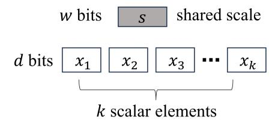
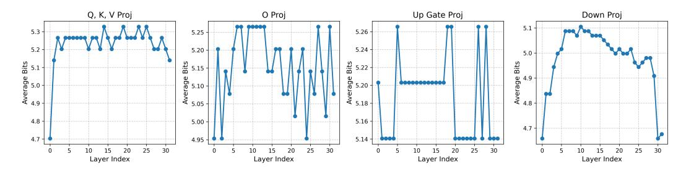

# ACKNOWLEDGMENT

The authors would like to thank Yafei Zhao for his valuable contributions to the technical implementation.

This work is supported in part by the National Natural Science Foundation of China (Grant No. 62550068 and No. 62276188), and the Emerging Frontiers Cultivation Program of Tianjin University Interdisciplinary Center.

### REFERENCES

Tushar Krishna Akshat Ramachandran, Souvik Kundu. Microscopiq: Accelerating foundational models through outlier-aware microscaling quantization, 2025. URL [https://arxiv.org/](https://arxiv.org/abs/2411.05282) [abs/2411.05282](https://arxiv.org/abs/2411.05282).

- Saleh Ashkboos, Ilia Markov, Elias Frantar, Tingxuan Zhong, Xincheng Wang, Jie Ren, Torsten Hoefler, and Dan Alistarh. Quik: Towards end-to-end 4-bit inference on generative large language models. *arXiv preprint arXiv:2310.09259*, 2023.
- Saleh Ashkboos, Amirkeivan Mohtashami, Maximilian L. Croci, Bo Li, Pashmina Cameron, Martin Jaggi, Dan Alistarh, Torsten Hoefler, and James Hensman. Quarot: Outlier-free 4-bit inference in rotated LLMs. In *The Thirty-eighth Annual Conference on Neural Information Processing Systems*, 2024. URL <https://openreview.net/forum?id=dfqsW38v1X>.
- Jacob Austin, Augustus Odena, Maxwell Nye, Maarten Bosma, Henryk Michalewski, David Dohan, Ellen Jiang, Carrie Cai, Michael Terry, Quoc Le, and Charles Sutton. Program synthesis with large language models, 2021. URL <https://arxiv.org/abs/2108.07732>.
- Tom B. Brown, Benjamin Mann, Nick Ryder, Melanie Subbiah, Jared D. Kaplan, Prafulla Dhariwal, Arvind Neelakantan, Pranav Shyam, Girish Sastry, Amanda Askell, et al. Language models are few-shot learners. *Advances in Neural Information Processing Systems*, 33:1877–1901, 2020.
- Mark Chen, Jerry Tworek, Heewoo Jun, Qiming Yuan, Henrique Ponde de Oliveira Pinto, Jared Kaplan, Harri Edwards, Yuri Burda, Nicholas Joseph, Greg Brockman, Alex Ray, Raul Puri, Gretchen Krueger, Michael Petrov, Heidy Khlaaf, Girish Sastry, Pamela Mishkin, Brooke Chan, Scott Gray, Nick Ryder, Mikhail Pavlov, Alethea Power, Lukasz Kaiser, Mohammad Bavarian, Clemens Winter, Philippe Tillet, Felipe Petroski Such, Dave Cummings, Matthias Plappert, Fotios Chantzis, Elizabeth Barnes, Ariel Herbert-Voss, William Hebgen Guss, Alex Nichol, Alex Paino, Nikolas Tezak, Jie Tang, Igor Babuschkin, Suchir Balaji, Shantanu Jain, William Saunders, Christopher Hesse, Andrew N. Carr, Jan Leike, Josh Achiam, Vedant Misra, Evan Morikawa, Alec Radford, Matthew Knight, Miles Brundage, Mira Murati, Katie Mayer, Peter Welinder, Bob Mc-Grew, Dario Amodei, Sam McCandlish, Ilya Sutskever, and Wojciech Zaremba. Evaluating large language models trained on code. 2021.
- Yuxiang Chen, Haocheng Xi, Jun Zhu, and Jianfei Chen. Oscillation-reduced mxfp4 training for vision transformers, 2025. URL <https://arxiv.org/abs/2502.20853>.
- Christopher Clark, Kenton Lee, Ming-Wei Chang, Tom Kwiatkowski, Michael Collins, and Kristina Toutanova. Bert: Pre-training of deep bidirectional transformers for language understanding. *arXiv preprint arXiv:1810.04805*, 2019.
- Peter Clark, Isaac Cowhey, Oren Etzioni, Tushar Khot, Ashish Sabharwal, Carissa Schoenick, and Oyvind Tafjord. Think you have solved question answering? try arc, the ai2 reasoning challenge. *arXiv:1803.05457v1*, 2018.
- Karl Cobbe, Vineet Kosaraju, Mohammad Bavarian, Mark Chen, Heewoo Jun, Lukasz Kaiser, Matthias Plappert, Jerry Tworek, Jacob Hilton, Reiichiro Nakano, Christopher Hesse, and John Schulman. Training verifiers to solve math word problems. *arXiv preprint arXiv:2110.14168*, 2021.
- Bita Darvish Rouhani, Nitin Garegrat, Tom Savell, Ankit More, Kyung-Nam Han, Mathew Zhao, Ritchie amd Hall, Jasmine Klar, Eric Chung, Yuan Yu, Michael Schulte, Ralph Wittig, Ian Bratt, Nigel Stephens, Jelena Milanovic, John Brothers, Pradeep Dubey, Marius Cornea, Alexander Heinecke, Andres Rodriguez, Martin Langhammer, Summer Deng, Maxim Naumov, Paulius Micikevicius, Michael Siu, and Colin Verrilli. OCP Microscaling (MX) Specification. *Open Compute Project*, 2023a.
- Bita Darvish Rouhani, Ritchie Zhao, Ankit More, Mathew Hall, Alireza Khodamoradi, Summer Deng, Dhruv Choudhary, Marius Cornea, Eric Dellinger, Kristof Denolf, Stosic Dusan, Venmugil Elango, Maximilian Golub, Alexander Heinecke, Phil James-Roxby, Dharmesh Jani, Gaurav Kolhe, Martin Langhammer, Ada Li, Levi Melnick, Maral Mesmakhosroshahi, Andres Rodriguez, Michael Schulte, Rasoul Shafipour, Lei Shao, Michael Siu, Pradeep Dubey, Paulius Micikevicius, Maxim Naumov, Colin Verrilli, Ralph Wittig, Doug Burger, and Eric Chung. Microscaling data formats for deep learning, 2023b. URL [https://arxiv.org/abs/2310.](https://arxiv.org/abs/2310.10537) [10537](https://arxiv.org/abs/2310.10537).
- DeepSeek-AI. Deepseek-v3 technical report, 2024. URL [https://arxiv.org/abs/2412.](https://arxiv.org/abs/2412.19437) [19437](https://arxiv.org/abs/2412.19437).

- Tim Dettmers, Mike Lewis, Younes Belkada, and Luke Zettlemoyer. Llm.int8(): 8-bit matrix multiplication for transformers at scale, 2022. URL <https://arxiv.org/abs/2208.07339>.
- Elias Frantar, Saleh Ashkboos, Torsten Hoefler, and Dan Alistarh. Gptq: Accurate post-training quantization for generative pre-trained transformers, 2023. URL [https://arxiv.org/](https://arxiv.org/abs/2210.17323) [abs/2210.17323](https://arxiv.org/abs/2210.17323).
- Leo Gao, Stella Biderman, Sid Black, Laurence Golding, Travis Hoppe, Charles Foster, Jason Phang, Horace He, Anish Thite, Noa Nabeshima, Shawn Presser, and Connor Leahy. The pile: An 800gb dataset of diverse text for language modeling, 2020. URL [https://arxiv.org/](https://arxiv.org/abs/2101.00027) [abs/2101.00027](https://arxiv.org/abs/2101.00027).
- Leo Gao, Jonathan Tow, Baber Abbasi, Stella Biderman, Sid Black, Anthony DiPofi, Charles Foster, Laurence Golding, Jeffrey Hsu, Alain Le Noac'h, Haonan Li, Kyle McDonell, Niklas Muennighoff, Chris Ociepa, Jason Phang, Laria Reynolds, Hailey Schoelkopf, Aviya Skowron, Lintang Sutawika, Eric Tang, Anish Thite, Ben Wang, Kevin Wang, and Andy Zou. The language model evaluation harness, 07 2024. URL <https://zenodo.org/records/12608602>.
- Aaron Grattafiori, Abhimanyu Dubey, Abhinav Jauhri, Abhinav Pandey, Abhishek Kadian, Ahmad Al-Dahle, Aiesha Letman, and et al. Akhil Mathur. The llama 3 herd of models, 2024. URL <https://arxiv.org/abs/2407.21783>.
- Dan Hendrycks, Collin Burns, Steven Basart, Andy Zou, Mantas Mazeika, Dawn Song, and Jacob Steinhardt. Measuring massive multitask language understanding. *Proceedings of the International Conference on Learning Representations (ICLR)*, 2021a.
- Dan Hendrycks, Collin Burns, Saurav Kadavath, Akul Arora, Steven Basart, Eric Tang, Dawn Song, and Jacob Steinhardt. Measuring mathematical problem solving with the math dataset. *arXiv preprint arXiv:2103.03874*, 2021b.
- Coleman Hooper, Charbel Sakr, Ben Keller, Rangharajan Venkatesan, Kurt Keutzer, Sophia Shao, and Brucek Khailany. Fgmp: Fine-grained mixed-precision weight and activation quantization for hardware-accelerated llm inference, 2025. URL <https://arxiv.org/abs/2504.14152>.
- Sehoon Kim, Coleman Hooper, Amir Gholami, Zhen Dong, Xiuyu Li, Sheng Shen, Michael W. Mahoney, and Kurt Keutzer. Squeezellm: Dense-and-sparse quantization, 2024. URL [https:](https://arxiv.org/abs/2306.07629) [//arxiv.org/abs/2306.07629](https://arxiv.org/abs/2306.07629).
- Woosuk Kwon, Zhuohan Li, Siyuan Zhuang, Ying Sheng, Lianmin Zheng, Cody Hao Yu, Joseph E. Gonzalez, Hao Zhang, and Ion Stoica. Efficient memory management for large language model serving with pagedattention. In *Proceedings of the ACM SIGOPS 29th Symposium on Operating Systems Principles*, 2023.
- Changhun Lee, Jungyu Jin, Taesu Kim, Hyungjun Kim, and Eunhyeok Park. Owq: Outlier-aware weight quantization for efficient fine-tuning and inference of large language models, 2024. URL <https://arxiv.org/abs/2306.02272>.
- Janghwan Lee, Jiwoong Park, Jinseok Kim, Yongjik Kim, Jungju Oh, Jinwook Oh, and Jungwook Choi. Amxfp4: Taming activation outliers with asymmetric microscaling floating-point for 4-bit llm inference, 2025. URL <https://arxiv.org/abs/2411.09909>.
- Haokun Lin, Haobo Xu, Yichen Wu, Jingzhi Cui, Yingtao Zhang, Linzhan Mou, Linqi Song, Zhenan Sun, and Ying Wei. Duquant: Distributing outliers via dual transformation makes stronger quantized llms. *arXiv preprint arXiv:2406.01721*, 2024a.
- Haokun Lin, Haobo Xu, Yichen Wu, Ziyu Guo, Renrui Zhang, Zhichao Lu, Ying Wei, Qingfu Zhang, and Zhenan Sun. Quantization meets dllms: A systematic study of post-training quantization for diffusion llms. *arXiv preprint arXiv:2508.14896*, 2025a.
- Haokun Lin, Xinle Jia, Shaozhen Liu, Shujun Xia, Weitao Huang, Haobo Xu, Junyang Li, Yicheng Xiao, Xingrun Xing, Ziyu Guo, et al. Efficient diffusion language models: A comprehensive survey. *Authorea Preprints*, 2026.

- Ji Lin, Jiaming Tang, Haotian Tang, Shang Yang, Wei-Ming Chen, Wei-Chen Wang, Guangxuan Xiao, Xingyu Dang, Chuang Gan, and Song Han. Awq: Activation-aware weight quantization for llm compression and acceleration. In *MLSys*, 2024b.
- Yujun Lin, Haotian Tang, Shang Yang, Zhekai Zhang, Guangxuan Xiao, Chuang Gan, and Song Han. Qserve: W4a8kv4 quantization and system co-design for efficient llm serving, 2025b. URL <https://arxiv.org/abs/2405.04532>.
- Zechun Liu, Changsheng Zhao, Igor Fedorov, Bilge Soran, Dhruv Choudhary, Raghuraman Krishnamoorthi, Vikas Chandra, Yuandong Tian, and Tijmen Blankevoort. Spinquant: Llm quantization with learned rotations, 2024. URL <https://arxiv.org/abs/2405.16406>.
- Nicholas Lourie, Ronan Le Bras, Chandra Bhagavatula, and Yejin Choi. Unicorn on rainbow: A universal commonsense reasoning model on a new multitask benchmark, 2021. URL [https:](https://arxiv.org/abs/2103.13009) [//arxiv.org/abs/2103.13009](https://arxiv.org/abs/2103.13009).
- Stephen Merity, Caiming Xiong, James Bradbury, and Richard Socher. Pointer sentinel mixture models. *CoRR*, abs/1609.07843, 2016. URL <http://arxiv.org/abs/1609.07843>.
- Denis Paperno, German Kruszewski, Angeliki Lazaridou, Ngoc Quan Pham, Raffaella Bernardi, ´ Sandro Pezzelle, Marco Baroni, Gemma Boleda, and Raquel Fernandez. The LAMBADA dataset: Word prediction requiring a broad discourse context. In *Proceedings of the 54th Annual Meeting of the Association for Computational Linguistics (Volume 1: Long Papers)*, pp. 1525–1534, Berlin, Germany, August 2016. Association for Computational Linguistics. URL <http://www.aclweb.org/anthology/P16-1144>.
- Qwen, :, An Yang, Baosong Yang, Beichen Zhang, Binyuan Hui, Bo Zheng, Bowen Yu, Chengyuan Li, Dayiheng Liu, Fei Huang, Haoran Wei, Huan Lin, Jian Yang, Jianhong Tu, Jianwei Zhang, Jianxin Yang, Jiaxi Yang, Jingren Zhou, Junyang Lin, Kai Dang, Keming Lu, Keqin Bao, Kexin Yang, Le Yu, Mei Li, Mingfeng Xue, Pei Zhang, Qin Zhu, Rui Men, Runji Lin, Tianhao Li, Tianyi Tang, Tingyu Xia, Xingzhang Ren, Xuancheng Ren, Yang Fan, Yang Su, Yichang Zhang, Yu Wan, Yuqiong Liu, Zeyu Cui, Zhenru Zhang, and Zihan Qiu. Qwen2.5 technical report, 2025. URL <https://arxiv.org/abs/2412.15115>.
- Colin Raffel, Noam Shazeer, Adam Roberts, Katherine Lee, Sharan Narang, Michael Matena, Yanqi Zhou, Wei Li, and Peter J. Liu. Exploring the limits of transfer learning with a unified text-to-text transformer. *CoRR*, abs/1910.10683, 2019. URL <http://arxiv.org/abs/1910.10683>.
- Keisuke Sakaguchi, Ronan Le Bras, Chandra Bhagavatula, and Yejin Choi. Winogrande: An adversarial winograd schema challenge at scale, 2019. URL [https://arxiv.org/abs/1907.](https://arxiv.org/abs/1907.10641) [10641](https://arxiv.org/abs/1907.10641).
- Utkarsh Saxena, Sayeh Sharify, Kaushik Roy, and Xin Wang. Resq: Mixed-precision quantization of large language models with low-rank residuals, 2025. URL [https://arxiv.org/abs/](https://arxiv.org/abs/2412.14363) [2412.14363](https://arxiv.org/abs/2412.14363).
- Wenqi Shao, Mengzhao Chen, Zhaoyang Zhang, Peng Xu, Lirui Zhao, Zhiqian Li, Kaipeng Zhang, Peng Gao, Yu Qiao, and Ping Luo. Omniquant: Omnidirectionally calibrated quantization for large language models, 2024. URL <https://arxiv.org/abs/2308.13137>.
- Sayeh Sharify, Utkarsh Saxena, Zifei Xu, Wanzin Yazar, Ilya Soloveychik, and Xin Wang. Post training quantization of large language models with microscaling formats, 2024a. URL [https:](https://arxiv.org/abs/2405.07135) [//arxiv.org/abs/2405.07135](https://arxiv.org/abs/2405.07135).
- Sayeh Sharify, Utkarsh Saxena, Zifei Xu, Wanzin Yazar, Ilya Soloveychik, and Xin Wang. Post training quantization of large language models with microscaling formats, 2024b. URL [https:](https://arxiv.org/abs/2405.07135) [//arxiv.org/abs/2405.07135](https://arxiv.org/abs/2405.07135).
- Yuxuan Sun, Ruikang Liu, Haoli Bai, Han Bao, Kang Zhao, Yuening Li, Jiaxin Hu, Xianzhi Yu, Lu Hou, Chun Yuan, Xin Jiang, Wulong Liu, and Jun Yao. Flatquant: Flatness matters for llm quantization, 2025. URL <https://arxiv.org/abs/2410.09426>.

- Ashish Vaswani, Noam Shazeer, Niki Parmar, Jakob Uszkoreit, Llion Jones, Aidan N. Gomez, Lukasz Kaiser, and Illia Polosukhin. Attention is all you need, 2023. URL [https://arxiv.](https://arxiv.org/abs/1706.03762) [org/abs/1706.03762](https://arxiv.org/abs/1706.03762).
- Tianwen Wei, Jian Luan, Wei Liu, Shuang Dong, and Bin Wang. Cmath: Can your language model pass chinese elementary school math test?, 2023.
- Guangxuan Xiao, Ji Lin, Mickael Seznec, Hao Wu, Julien Demouth, and Song Han. Smoothquant: Accurate and efficient post-training quantization for large language models, 2024. URL [https:](https://arxiv.org/abs/2211.10438) [//arxiv.org/abs/2211.10438](https://arxiv.org/abs/2211.10438).
- Lianwei Yang, Haokun Lin, Tianchen Zhao, Yichen Wu, Hongyu Zhu, Ruiqi Xie, Zhenan Sun, Yu Wang, and Qingyi Gu. Lrq-dit: Log-rotation post-training quantization of diffusion transformers for image and video generation. *arXiv preprint arXiv:2508.03485*, 2025.
- Zhewei Yao, Reza Yazdani Aminabadi, Minjia Zhang, Xiaoxia Wu, Conglong Li, and Yuxiong He. Zeroquant: Efficient and affordable post-training quantization for large-scale transformers, 2022. URL <https://arxiv.org/abs/2206.01861>.
- Zihao Ye, Lequn Chen, Ruihang Lai, Yilong Zhao, Size Zheng, Junru Shao, Bohan Hou, Hongyi Jin, Yifei Zuo, Liangsheng Yin, Tianqi Chen, and Luis Ceze. Accelerating self-attentions for llm serving with flashinfer, February 2024. URL [https://flashinfer.ai/2024/02/02/](https://flashinfer.ai/2024/02/02/introduce-flashinfer.html) [introduce-flashinfer.html](https://flashinfer.ai/2024/02/02/introduce-flashinfer.html).
- Zhihang Yuan, Lin Niu, Jiawei Liu, Wenyu Liu, Xinggang Wang, Yuzhang Shang, Guangyu Sun, Qiang Wu, Jiaxiang Wu, and Bingzhe Wu. Rptq: Reorder-based post-training quantization for large language models, 2023. URL <https://arxiv.org/abs/2304.01089>.
- Yilong Zhao, Chien-Yu Lin, Kan Zhu, Zihao Ye, Lequn Chen, Size Zheng, Luis Ceze, Arvind Krishnamurthy, Tianqi Chen, and Baris Kasikci. Atom: Low-bit quantization for efficient and accurate llm serving. In P. Gibbons, G. Pekhimenko, and C. De Sa (eds.), *Proceedings of Machine Learning and Systems*, volume 6, pp. 196– 209, 2024. URL [https://proceedings.mlsys.org/paper\\_files/paper/2024/](https://proceedings.mlsys.org/paper_files/paper/2024/file/5edb57c05c81d04beb716ef1d542fe9e-Paper-Conference.pdf) [file/5edb57c05c81d04beb716ef1d542fe9e-Paper-Conference.pdf](https://proceedings.mlsys.org/paper_files/paper/2024/file/5edb57c05c81d04beb716ef1d542fe9e-Paper-Conference.pdf).

### A RELATED WORKS

Post-training Quantization can be broadly divided into two categories: weight-only methods and weight–activation methods [Lin et al.](#page-11-9) [\(2025a\)](#page-11-9). Weight-only approaches [\(Frantar et al., 2023;](#page-11-0) [Kim](#page-11-10) [et al., 2024;](#page-11-10) [Lin et al., 2024b\)](#page-12-0) compress model weights into low-bit formats while dequantizing them back to high precision (e.g., FP16) during GEMM operations. Although this reduces memory bandwidth requirements, the computation itself still relies on high-precision operations, leaving a significant bottleneck in inference efficiency [\(Lin et al., 2025b\)](#page-12-1). Consequently, there remains substantial room for accelerating LLM inference. Weight–activation methods [\(Yao et al., 2022;](#page-13-1) [Lee](#page-11-11) [et al., 2024;](#page-11-11) [Lin et al., 2026\)](#page-11-12), in contrast, quantize both weights and activations into low-bit formats, enabling GEMM to be executed entirely in low precision. This approach alleviates both bandwidth and computational bottlenecks but often suffers from severe accuracy degradation due to the presence of outlier activations.To address this challenge, mathematically equivalent transformation methods [\(Xiao et al., 2024;](#page-13-2) [Shao et al., 2024\)](#page-12-9) adopt a channel-level smoothing strategy. By shifting activation outliers into the weights, these methods effectively reduce quantization error. Rotationbased weight–activation methods [\(Ashkboos et al., 2024;](#page-10-1) [Liu et al., 2024;](#page-12-10) [Lin et al., 2024a\)](#page-11-13) have recently emerged, achieving notable success in preserving model accuracy even at 4-bit precision.

Mixed-precision quantization retains outliers in higher bit-widths while quantizing the remaining elements to lower bit-widths [\(Dettmers et al., 2022;](#page-11-1) [Saxena et al., 2025;](#page-12-11) [Ashkboos et al., 2023;](#page-10-4) [Hooper et al., 2025\)](#page-11-14). The central challenge is designing efficient fused GEMM kernel. Atom [\(Zhao](#page-13-4) [et al., 2024\)](#page-13-4) achieves state-of-the-art performance by preserving 128 outlier channels in INT8 and quantizing the rest to INT4. Although Atom demonstrated a 7.73× speedup over FP16 on the RTX 4090, its current kernel is limited to Llama2-7B and can only handle up to 128 high-precision channels. Unlike previous approaches that use a fixed number of high-precision channels for all linear layers, our method enables flexible, fine-grained mixed-precision configurations, and is specifically designed to leverage the advantages of Microscaling data formats.

Applications of Microscaling data formats. Recent works (Darvish Rouhani et al., 2023b; Sharify et al., 2024a;b) begin to study the applications of MX in both training and inference. AMXFP4 (Lee et al., 2025) handles outliers and asymmetries in activation by introducing asymmetric shared scales. Furthermore, Chen et al. (2025) significantly improved the FP4 training accuracy of Vision Transformers by identifying and solving the weight oscillation problem in forward propagation. MicroScopiQ (Akshat Ramachandran, 2025) optimizes the quantization by combining pruning with outlier-aware miniaturization. Although these works have made significant progress in the inference and training of low-width MX formats, there is still a lack of systematic work on using microscaling data formats for general mixed-precision quantization.

### B MICROSCALING DATA FORMATS (MX)

According to Darvish Rouhani et al. (2023a), we give some supplementary information of MX in this section. An MX-compliant format is consisted of three components: scaling block size k, k scalar elements  $\{x_i\}_{i=1}^k$  and a shared scale s in E8M0 format (see Figure 9). The special scale format enables the Microscaling data format to achieve dequantization operations solely through shift operations, thereby enhancing the running speed. Here,  $\{x_i\}_{i=1}^k$  is already quantized, so the original value is  $\{sx_i\}_{i=1}^k$ . The specific parameters of MX data formats are shown in Table 8. More details on MX please refer to OCP Microscaling Specification (Darvish Rouhani et al., 2023a).

Figure 9: A schematic diagram of the basic unit of Microscaling block. The block encodes the original k values  $sx_i$  into k elements in MX and a shared scale s.

| E 4   El 4 D24   E       | I 4D 4   E 4             | M   C P DI LC           |                             |
|--------------------------|--------------------------|-------------------------|-----------------------------|
| 2023a).                  |                          |                         |                             |
| 2023a).                  | a parameters of concrete | , wix-compliant formats | (Dai visii Roullain et al., |
| Table A. Formal names an | a parameters of concrete | · Mrx-combilant tormals | . O Jarvišn Romnam er ar    |

| Format Name | Element Bits (d) | Element Data Type | Exponent Bias (b) | Max Normal | Scaling Block Size (k) | Scale Data Type | Scale Bits (w) |
|----------------|------------------|----------------------|----------------------|---------------|------------------------|--------------------|----------------|
| MXFP8          | 8                | FP8 (E5M2)           | 15                   | $\pm 57344$   | 32                     | E8M0               | 8              |
|                |                  | FP8 (E4M3)           | 7                    | ± 448         |                        |                    |                |
| MXFP6          | 6                | FP6 (E3M2)           | 3                    | ± 28          | 32                     | E8M0               | 8              |
|                |                  | FP6 (E2M3)           | 1                    | ± 7.5         |                        |                    |                |
| MXFP4          | 8                | FP4 (E2M1)           | 1                    | ±6            | 32                     | E8M0               | 8              |
| MXINT8         | 8                | INT8                 | N/A                  | ± 163/64      | 32                     | E8M0               | 8              |

### C QUANTIZATION ERROR ANALYSIS

#### C.1 OBSERVATIONS

In this section, we discuss the quantization error in detail. We observe the variation relationship between the accuracy of the quantization model and the quantization error, which supplements the deficiency in the description of the continuity relationship between accuracy and error in previous works.

Figure 10: After quantizing weights to INT4 using per-channel symmetric quantization, the zeroshot average accuracy of the models on Winograde, PIQA, BoolQ, ARC C, and Lambada changes with qmax.The quantization process of activations corresponding to different qmax is implemented through fake-quant simulation. A lower value of qmax corresponds to a higher upper bound on the quantization error.

Given a FP16 tensor X ∈ R 1×I , ∀Xi ∈ X, the quantization error E(Xi) between Q(Xi) and Xi is:

$$E(X_i) = |X_i - Q(X_i)| = |X_i - round(\frac{X_i}{s})s| = \gamma \cdot s$$
(11)

where γ = |round(Xi/s) − Xi/s| is the rounding error. INT quantization is similar to FP quantization:

$$Q(X_i) = round(\frac{X_i}{s}), s = \frac{\max(|\mathbf{X}|)}{q_{max}}$$
(12)

where round(·) is rounding to the nearest INT value and qmax = 2n−1 −1 is the maximum value of INT range. For INT format, there is γ ∈ [0, 0.5], so we can get the quantization error upper bound E(Xi) of INT format:

$$E(X_i) = \gamma \cdot s \le 0.5 \cdot s$$

$$= 0.5 \cdot \frac{\max(|\mathbf{X}|)}{2^{n-1} - 1} = \frac{\max(|\mathbf{X}|)}{2^n - 2} = \overline{E}(X_i)$$
(13)

in particular, for INT8:

$$\overline{E}(X_i)_{INT8} = \frac{\max(|\boldsymbol{X}|)}{254} \tag{14}$$

We reformulate Equation [14](#page-15-0) as following:

$$\overline{E}(X_i) = \frac{\max(|\boldsymbol{X}|)}{2 \cdot q_{max}} \tag{15}$$

Then we control qmax to observe the relationship between the quantized model accuracy and the quantization error upper bound, as shown in Figure [10.](#page-15-1) We have three observations:

- (1) The curve in Figure [10.](#page-15-1) clearly illustrates how model accuracy varies with quantization error. In general, the accuracy of the model decreases with the increase of the upper bound of the quantization error.
- (2) There is a "Stable Stage" for each model maintaining high accuracy of variation qmax, INT8 (qmax=127) is located in this stage. For all four models, INT8 is a high-precision format.
- (3) When qmax is below a threshold, the accuracy of quantized model degrades significantly, which we name as "Decline Stage", and INT4 (qmax=7) is located at the end of this stage.

In conclusion, enhancing the accuracy of a quantized model requires reducing its quantization error to bring it within the stable stage. The relationship between the quantization error upper bound and the model accuracy inspires us to divide values into three parts from the view of quantization error upper bound.

### C.2 DERIVATIONS

In this section, we show the detailed derivation processes of quantization threshold, which is based on the motivation of controlling the quantization error of MXFP4/MXFP6 below  $\overline{E}(X)_{INT8}$ . The quantization error of MXFP4/MXFP6 is:

$$E(X_i)_{\{MXFP4,MXFP6\}} = \gamma \cdot 2^{\lfloor \log_2(\max(|\mathbf{X}|)) \rfloor - b}$$
(16)

Since the gap between adjacent FP values is not a constant, we use

$$\gamma = \frac{q_{max}}{2^{n-1}} \tag{17}$$

to approximately express the rounding error in Equation 16, where  $q_{max}$  is the maximum value of MXFP4/MXFP6. Substituting Equation 17 into Equation 16 gives:

$$E(X_{i}) = \frac{q_{max}}{2^{n-1}} \cdot 2^{\lfloor \log_{2}(\max(|\boldsymbol{X}|)) \rfloor - b}$$

$$\leq \frac{q_{max}}{2^{n-1}} \cdot 2^{\log_{2}(\max(|\boldsymbol{X}|)) - b}$$

$$= \frac{q_{max}}{2^{n-1}} \cdot \frac{\max(|\boldsymbol{X}|)}{2^{b}}$$
(18)

Let  $E(X_i)_{\{MXFP4,MXFP6\}} \leq \overline{E}(X_i)_{INT8}$ . Then we have

$$E(X_i) \le \frac{q_{max}}{2^{n-1}} \cdot \frac{\max(|G_{\{4,6\}}|)}{2^b} \le \overline{E}(X_i)_{INT8}$$
 (19)

If the inequality on the right-hand side holds, it follows that

$$\max(|G_{\{4,6\}}|) \le 2^b \cdot \frac{2^{n-1}}{q_{max}} \cdot \frac{\max(|X|)}{254}$$
 (20)

According to Table 8, when n=4 or n=6, the corresponding values of  $q_{\text{max}}$  and b can be substituted directly into Equation 20. At last, we get the definition of quantization threshold:

$$T(n) = 2^{b} \cdot \frac{2^{n-1}}{q_{max}} \cdot \frac{\max(|\mathbf{X}|)}{254}$$
 (21)

### D SUPPLEMENTARY MATERIALS OF EXPERIMENTS

#### D.1 EXPERIMENTAL SETTINGS

In this section, we demonstrate some reproduction details, especially claiming how "Avg.Bits" in Table 1 is calculated.

**QuaRot**1. QuaRot uses symmetric INT4 quantization of group size 128.  $a\_clip\_ratio$  is 0.9, and  $w\_clip$  is used. For QuaRot, its online Hadamard transformation depends on Fast\_Hadamard\_Transform2 kernel without introducing extra matrices. So its average bits is:

$$4 + \frac{1}{128} \cdot 16 = 4.12 \tag{22}$$

**Atom**3. The activation-sort metric is chosen as "hessian" according to Atom's default settings. a\_clip\_ratio is 0.9, w\_clip\_ratio is 0.85 and keeper\_size is 128. The "Avg.Bits" of Atom is calculated as following:

$$\frac{((hidden\_size - 128) \cdot 4 + 128 \cdot 8 + \frac{hidden\_size}{128} \cdot 16}{hidden\_size}$$
 (23)

&lt;sup>1https://github.com/spcl/QuaRot/tree/main

&lt;sup>2https://github.com/Dao-AILab/fast-hadamard-transform

&lt;sup>3https://github.com/efeslab/Atom

QUIK[4](#page-17-1) . The value of f p features num is set to 256, following the settings used in QUIK. The part of INT4 is quantized using asymmetric per-token quantization. w clip and int8 down proj is used. Since QUIK adopts pure INT8 for all Down Projs and mixed-precision for other linear layers, its "Avg. Bits" is:

$$\frac{((hidden\_size - 256) \cdot 4 + 256 \cdot 16 + 2 \cdot 16) \cdot 6 + (intermediate\_size \cdot 8 + 16)}{hidden\_size \cdot 6 + intermediate\_size}$$
(24)

where 6 counts for Q, K, V, O, Up and Gate Projs.

AMXFP4[5](#page-17-2) . We use the f p4 e2m1 asym element format as specified in AMXFP4. scale bits is 8 and block size is 32. scale mode = 2 (default setting in run.sh) needs two FP16 scales for each block, so its "Avg. Bits" is:

$$\frac{32 \cdot 4 + 2 \cdot 16}{32} = 5 \tag{25}$$

FlatQuant[6](#page-17-3) . We adopt the per-token and per-channel INT4 symmetric quantization for FlatQuant, with parameters such as lwc, lac, cali trans, and add diag. Since FlatQuant introduces 7 additional square transformation matrices per layer during the forward pass, and the elements of these matrices differ across decoder layers, its "Avg. Bits" is computed as follows:

$$\frac{(hidden\_size \cdot 6 + intermediate\_size) \cdot 4 \cdot seqlen + numel(\mathbf{P}) \cdot 16}{(hidden\_size \cdot 6 + intermediate\_size) \cdot seqlen}$$
(26)

where numel(P ) denotes the sum of the elements of the transformation matrices per layer:

$$numel(\mathbf{P}) = \begin{cases} 64 \cdot 64 \cdot 4 + 32 \cdot 32 + 112 \cdot 112 + 128 \cdot 128 = 46336, \text{Llama } 3.1\text{-8B} \\ 64 \cdot 64 \cdot 2 + 80 \cdot 80 \cdot 2 + 40 \cdot 40 + 144 \cdot 144 + 192 \cdot 192 = 80192, \text{Qwen } 2.5\text{-32B} \end{cases}$$
(27)

Since the additional introduced matrix can be reused for all tokens, when the seqlen is longer, the average number of bits caused by transformation matrices is lower. When seqlen > 190, the average number of additional bits introduced by P is less than 0.01. But at the same time, the single-token situation in the decode stage has to be taken into consideration. In conclusion, we uniformly set seqlen = 100.

### D.2 INFORMATION ON POST-QUANTIZATION MODELS

Table [9](#page-17-0) shows some information of quantized models. In general, MicroMix utilizes 5-5.6 bits for Llama and Qwen series models. The offline calibration and quantization time are relatively fast, which only takes 2min23s to get the quantized model of Qwen2.5-Math-7B-Instruct.

Table 9: Average bit-width per element and memory consumption of quantized weights across all evaluated models. "Quantization Time" denotes the total offline time cost, including reordering and quantization of the original model weights.

| Models                     | Avg. Bits | Memory   | Quantization Time |
|----------------------------|-----------|----------|-------------------|
| Llama3.1-8B                | 5.51      | 5.09 GB  | 179s              |
| Qwen2.5-32B                | 5.22      | 24.54 GB | 406s              |
| Qwen2.5-Coder-14B-Instruct | 5.54      | 9.10 GB  | 260s              |
| Qwen2.5-Coder-32B-Instruct | 5.18      | 24.53 GB | 406s              |
| Qwen2.5-Math-7B-Instruct   | 5.16      | 4.79 GB  | 143s              |

In Figure [3,](#page-4-0) we tallied p4, p6 and p8 of each layer of Llama3.1-8B. We supplement the average number of bits for each layer in Figure [11.](#page-18-2)

Figure [12](#page-18-3) illustrates the precision mapping in MicroMix. The reorder-and-quantize operation is fused into LayerNorm, and the resulting quantized activations are reused by subsequent linear layers. In addition, the KV cache is quantized with FlashInfer [\(Ye et al., 2024\)](#page-13-7) to further reduce memory usage.

4 https://github.com/IST-DASLab/QUIK

5 https://github.com/aiha-lab/MX-QLLM

6 github.com/ruikangliu/FlatQuant

Figure 11: The average number of bits per layer of Llama3.1-8B.

Figure 12: Precision mapping of MicroMix for a Transformer block in LLM.

#### D.3 SUPPLEMENTARY RESULTS

The results of KV cache quantization are reported in Table 10, where all methods adopt INT4 asymmetric quantization with a group size of 64. MicroMix retains over 97.6% of the FP16 zero-shot accuracy under this setting. For five-shot accuracy and perplexity, MicroMix also achieves state-of-the-art performance.

Table 10: Zero-shot, few-shot accuracy and perplexity of Llama3.1-8B, using lm-eval (Gao et al., 2024). All methods use asymmetric INT4 quantization of group size 64.

| Model       | Method    | Avg.   Bits | 0-shot (†) |       |         |       |            |       | 5-shot (†)   PPL (\(\psi\)) |           |
|-------------|-----------|----------------|------------|-------|---------|-------|------------|-------|-----------------------------|-----------|
|             |           |                | ARC_C      | BoolQ | Lambada | PIQA  | Winogrande | Avg.  | MMLU                        | WikiText2 |
|             | FP16      | 16.00          | 53.58      | 81.99 | 75.47   | 80.09 | 74.03      | 73.03 | 65.24                       | 6.24      |
|             | QuaRot    | 4.12           | 44.88      | 74.19 | 66.74   | 77.09 | 66.61      | 65.90 | 53.19                       | 8.03      |
| I 12 1 0D   | QUIK      | 5.95           | 49.66      | 77.77 | 71.08   | 78.51 | 67.88      | 68.98 | 57.63                       | 7.32      |
| Llama3.1-8B | Atom      | 4.25           | 47.95      | 79.94 | 72.81   | 78.35 | 70.72      | 69.95 | 57.10                       | 7.43      |
|             | FlatQuant | 4.19           | 50.17      | 79.33 | 72.15   | 79.27 | 71.59      | 70.50 | 59.34                       | 7.12      |
|             | AMXFP4    | 5.00           | 46.84      | 73.24 | 69.59   | 77.15 | 67.56      | 66.87 | 53.11                       | 7.33      |
|             | INT6      | 6.00           | 49.15      | 76.73 | 68.62   | 78.07 | 69.06      | 68.32 | 56.82                       | 7.82      |
|             | MicroMix  | 5.51           | 52.22      | 80.64 | 74.00   | 79.38 | 70.96      | 71.44 | 60.90                       | 6.97      |

Table 11 shows the results of Atom and QUIK directly applied to MXFP4 and MXFP8, with a significant performance drop compared to MicroMix. Since the kernels of Atom and QUIK do not support the MXFP format, we use the MicroMix kernel to keep the number of MXFP8 channels at 128 and 256 respectively.

We further test the stability and flexibility of MicroMix to adapt different average bit-widths (4, 5 and 6), as shown in Table 13.

Table 11: Zero-shot accuracy (↑) and WikiText2 perplexity (↓) results of mixed-precision methods on MXFP formats using Llama3.1-8B.

| Methods      | ARC C          | BoolQ          | Lambada        | PIQA           | WikiText2    |
|--------------|----------------|----------------|----------------|----------------|--------------|
| FP16         | 51.28          | 82.05          | 75.80          | 80.03          | 6.24         |
| Atom QUIK | 43.60 47.27 | 76.36 76.15 | 66.52 68.52 | 75.57 76.72 | 8.02 7.86 |
| MicroMix     | 50.17          | 81.13          | 74.13          | 80.14          | 6.72         |

Table 12: Zero-shot accuracy (↑) on ARC C, BoolQ, Lambada, PIQA, and perplexity (↓) on Wiki-Text2 of MicroMix on different datasets using Qwen2.5-14B.

| Calib Data | ARC C | BoolQ | Lambada | PIQA  | WikiText2 |
|------------|-------|-------|---------|-------|-----------|
| WikiText2  | 57.59 | 86.18 | 74.29   | 81.12 | 5.87      |
| Pile       | 57.68 | 85.41 | 74.13   | 80.14 | 5.92      |
| C4         | 58.36 | 86.57 | 73.65   | 81.56 | 5.92      |

Table 13: Using Qwen2.5-32B, we report the accuracy and performance of MicroMix on various average bits.

| Avg Bits    | Arc C | BoolQ | Lambada | PIQA  | Winogrande | Avg.  | Execution Time |
|-------------|-------|-------|---------|-------|------------|-------|----------------|
| 4.48        | 56.91 | 85.87 | 76.54   | 81.28 | 73.88      | 74.89 | 5min 37s       |
| 4.84        | 55.46 | 86.51 | 77.18   | 81.50 | 74.19      | 74.96 | 5min 42s       |
| 5.09        | 56.14 | 85.66 | 77.14   | 81.39 | 74.98      | 75.06 | 5min 44s       |
| 5.22 (ours) | 56.66 | 87.13 | 77.37   | 80.65 | 74.19      | 75.20 | 5min 46s       |
| 5.30        | 55.38 | 86.09 | 77.24   | 81.66 | 75.06      | 75.08 | 5min 48s       |
| 5.74        | 55.63 | 86.02 | 76.65   | 81.77 | 74.19      | 74.85 | 5min 49s       |
| 6.01        | 55.78 | 86.27 | 76.67   | 81.72 | 74.66      | 75.02 | 5min 50s       |