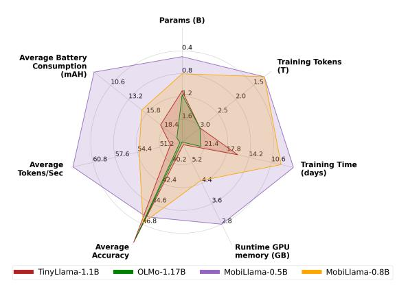

# 1 Introduction

Recent years have witnessed a tremendous surge in the development of Large Language Models (LLMs) with the emergence of prominent closedsource commercial models such as ChatGPT, Bard, and Claude. These LLMs exhibit surprising capabilities, typically called emergent abilities, towards solving complex tasks. Most existing popular LLMs follow a similar trend that bigger is always better, where scaling model size or data size typically provides improved model capacity and performance on downstream tasks. For instance,

the recent Llama-2 70 billion (70B) model [\(Tou](#page-10-0)[vron et al.,](#page-10-0) [2023\)](#page-10-0) is considered more favorable in different chat applications due to its effectiveness towards handling dialogues, logical reasoning, coding, compared to its 7B counterpart which is typically better suited for basic tasks such as categorization or summaries. While these LLMs demonstrate impressive performance in handling complex language tasks, a key limitation is their size and computational requirements. For instance, the large-scale Falcon [\(Almazrouei et al.,](#page-8-0) [2023\)](#page-8-0) 180B model was trained using 4096 A100 GPUs and requires large memory and compute for deployment with dedicated high-performance servers and scalable storage systems.

Recently, Small Language Models (SLMs) have shown potential in terms of providing decent performance with emergent abilities achieved at a significantly smaller scale compared to their large-scale LLM counterparts. Modern SLMs like Microsoft's Phi-2 2.7 billion [\(Li et al.,](#page-9-0) [2023b\)](#page-9-0) highlight the growing focus in the community on achieving more with less. SLMs offer advantages in terms of efficiency, cost, flexibility, and customizability. With fewer parameters, SLMs offer significant computational efficiency in terms of fast pre-training and inference with reduced memory and storage requirements. This is critical in real-world applications where efficient resource utilization is highly desired. It particularly opens up possibilities in resource-constrained computing, where the models are required to be memory efficient to operate on low-powered devices (e.g., edge). SLMs support on-device processing that enhances privacy, security, response time, and personalization. Such an integration can lead to advanced personal assistants, cloud-independent applications, and improved energy efficiency with a reduced carbon footprint.

The landscape of language models, especially SLMs, is currently marked by a notable lack of open-source availability. While LLMs have gar-

\*Equal contribution.

nered significant attention, the proprietary nature of most models has led to limited transparency and accessibility, particularly in the realm of SLMs. This gap hinders the scientific and technological exploration of these more efficient, compact and performant models. Recognizing this, there's a growing need in the community for fully transparent opensource SLMs, which would facilitate a deeper understanding of their capabilities and limitations and spur innovation by allowing broader community access to their architecture and reproducible training methodologies. We argue that bridging this gap is crucial for democratizing access to collaborative advancement for SLMs. Therefore, we investigate the problem of designing accurate yet efficient SLMs from scratch with the intention to provide full transparency in the form of access to entire training data pipeline and code, model weights, more than 300 checkpoints along with evaluation codes.

When designing a SLM from scratch it is desired that the resulting model is accurate, while maintaining efficiency in terms of pre-training and deployment. A straightforward way is to scaledown a larger LLM design to the desired model size (e.g., 0.5B) by reducing either the size of the hidden dimension layers or the number of layers. We empirically observe both these design strategies to provide inferior performance. This motivates us to look into an alternative way of designing a SLM from scratch that is accurate yet maintains the efficiency, while offering full transparency.

## Contributions:

We introduce a SLM framework, named *MobiLlama*, with an aim to develop accurate SLMs by alleviating the redundancy in the transformer blocks. Different to the conventional SLM design where dedicated feed forward layers (FFN) are typically allocated to each transformer block, we propose to employ a shared FFN design for all the transformer blocks within SLM. Our *MobiLlama* leveraging a shared FFN-based SLM design is accurate and maintains efficiency, while offering full transparency in terms of data pipeline, training code, model weights and extensive intermediate checkpoints along with evaluation codes.

We empirically show that our *MobiLlama* performs favorably compared to conventional SLMs design schemes when performing pre-training from scratch. Our *MobiLlama* 0.5B model outperforms existing SLMs of similar size on nine different benchmarks. *MobiLlama* 0.5B achieves a gain of 2.4% in terms of average performance on nine

Figure 1: Comparison of our *MobiLlama* 0.5B and 0.8B models with recent OLMo-1.17B [\(Groeneveld](#page-9-1) [et al.,](#page-9-1) [2024\)](#page-9-1) and TinyLlama-1.1B [\(Zhang et al.,](#page-10-1) [2024\)](#page-10-1) in terms of pre-training tokens, pre-training time and memory, model parameters, overall accuracy across nine benchmarks and on-device efficiency (average battery consumption and average token/second on a PC with RTX2080Ti). Our *MobiLlama* achieves comparable accuracy while requiring significantly fewer pre-training data (1.2T tokens vs. 3T tokens), lesser pre-training time and GPU memory along with being efficient in terms of deployment on a resource constrained device.

benchmarks, compared to the best existing 0.5B SLM in the literature. We further develop a 0.8B SLM that originates from our 0.5B model by utilizing a wider shared-FFN scheme in transformer blocks, achieving top performance among existing SLMs falling under less than 1B parameters category. Lastly, we build multimodal models on top of our SLM to showcase visual perception and reasoning capabilities. Fig. [1](#page-1-0) shows a comparison of our *MobiLlama* with recent fully transparent relatively larger SLMs in terms of accuracy, pre-training complexity and on-board deployment cost.

